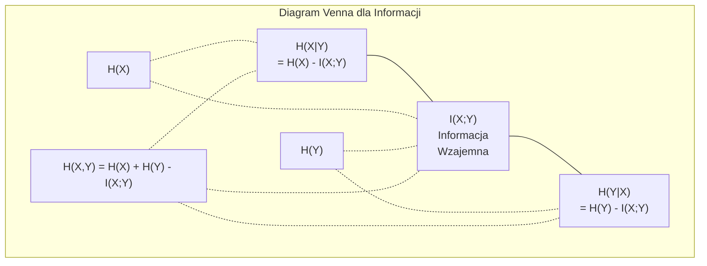

# Teoria informacji

> Teoria informacji mierzy stopień zaskoczenia. To na tym fundamencie zbudowane są funkcje straty.

**Typ:** Ucz się
**Język:** Python
**Wymagania wstępne:** Faza 1, Lekcja 06 (Prawdopodobieństwo)
**Czas:** ~60 minut

## Cele nauczania

- Oblicz od podstaw entropię, entropię krzyżową i dywergencję KL oraz wyjaśnij ich wzajemne relacje.
- Wyprowadź, dlaczego minimalizacja funkcji straty cross-entropy (entropii krzyżowej) jest równoznaczna z maksymalizacją logarytmu wiarygodności.
- Oblicz informację wzajemną (mutual information) między cechami a zmienną docelową, aby uszeregować ważność cech.
- Wyjaśnij perplexity (zaskoczenie) jako efektywny rozmiar słownika wybierany przez model językowy.

## Problem

W każdym trenowanym modelu klasyfikacji wywołujesz `CrossEntropyLoss()`. W każdym artykule naukowym o modelach językowych widzisz metrykę „perplexity”. Czytasz o dywergencji KL w kontekście modeli VAE, destylacji wiedzy i RLHF. Te koncepcje nie są od siebie oderwane. Wszystkie opierają się na jednym pomyśle, tylko noszą inne nazwy.

Teoria informacji dostarcza języka niezbędnego do rozumowania o niepewności, kompresji i predykcji. Claude Shannon wynalazł ją w 1948 roku w celu rozwiązywania problemów z komunikacją. Jak się okazuje, uczenie sieci neuronowej to w swej istocie problem komunikacyjny: model próbuje przesłać prawidłową etykietę przez zaszumiony kanał, jakim są wyuczone wagi.

W tej lekcji każdy wzór zbudujemy od podstaw, abyś mógł dokładnie zobaczyć, skąd się bierze i dlaczego działa.

## Koncepcja

### Ilość informacji (Surprisal / Zaskoczenie)

Kiedy wydarza się coś bardzo mało prawdopodobnego, niesie to ze sobą więcej informacji. Orzeł podczas rzutu monetą? Żadna niespodzianka. Wygrana na loterii? Ogromne zaskoczenie.

Ilość informacji dla zdarzenia o prawdopodobieństwie p wynosi:

```text
I(x) = -log(p(x))
```

Użycie logarytmu o podstawie 2 daje nam wynik w bitach (bits). Użycie logarytmu naturalnego daje nity (nats). Ten sam koncept, inne jednostki.

```text
Zdarzenie                  Prawdopodobieństwo    Zaskoczenie (w bitach)
Orzeł (uczciwa moneta)     0.5                   1.0
Wyrzucenie 6 na kostce     0.167                 2.58
Zdarzenie 1-na-1000        0.001                 9.97
Zdarzenie pewne            1.0                   0.0
```

Pewne zdarzenia niosą ze sobą zero informacji. Wiedziałeś już z góry, że i tak się wydarzą.

### Entropia (Średnie zaskoczenie)

Entropia to wartość oczekiwana zaskoczenia po wszystkich możliwych wynikach danego rozkładu.

```text
H(P) = -sum( p(x) * log(p(x)) )  dla wszystkich x
```

Uczciwa moneta posiada maksymalną entropię dla zmiennej binarnej: 1 bit. Moneta sfałszowana (np. 99% orłów) ma niską entropię: 0.08 bita. Z góry wiesz, co wypadnie, więc każdy kolejny rzut praktycznie nie wnosi żadnych nowych informacji.

```text
Uczciwa moneta:    H = -(0.5 * log2(0.5) + 0.5 * log2(0.5)) = 1.0 bit
Sfałszowana moneta:H = -(0.99 * log2(0.99) + 0.01 * log2(0.01)) = 0.08 bitów
```

Entropia mierzy nieredukowalną niepewność danego rozkładu. Nie skompresujesz danych poniżej tej granicy.

### Entropia krzyżowa (Cross-Entropy - funkcja straty używana na co dzień)

Entropia krzyżowa mierzy średnie zaskoczenie w sytuacji, gdy używasz rozkładu Q do kodowania zdarzeń, które w rzeczywistości pochodzą z prawdziwego rozkładu P.

```text
H(P, Q) = -sum( p(x) * log(q(x)) )  dla wszystkich x
```

P to rozkład prawdziwy (etykiety/labels). Q to z kolei predykcje wygenerowane przez twój model. Jeżeli Q idealnie odwzorowuje P, entropia krzyżowa jest idealnie równa zwykłej entropii. Każde ewentualne niedopasowanie natychmiast ją zwiększa.

W klasyfikacji zmienna P przyjmuje postać wektora one-hot (prawdziwa klasa ma prawdopodobieństwo 1, cała reszta ma 0). To potężnie upraszcza wzór na entropię krzyżową do postaci:

```text
H(P, Q) = -log(q(true_class))
```

I to jest kompletny wzór dla straty entropii krzyżowej (cross-entropy loss) przy problemach klasyfikacji. Maksymalizuj przewidywane przez model prawdopodobieństwo dla prawidłowej klasy.

### Dywergencja KL (odległość między rozkładami)

Dywergencja Kullbacka-Leiblera (KL divergence) to miara ilości dodatkowego zaskoczenia, z jakim spotykasz się, gdy używasz rozkładu Q w zastępstwie prawdziwego rozkładu P.

```text
D_KL(P || Q) = sum( p(x) * log(p(x) / q(x)) )  dla wszystkich x
             = H(P, Q) - H(P)
```

Entropia krzyżowa to dokładnie suma entropii i dywergencji KL. Jako że entropia prawdziwego rozkładu pozostaje stała podczas treningu modelu, minimalizacja samej entropii krzyżowej jest całkowicie tożsama z procesem minimalizacji dywergencji KL. Zwyczajnie popychasz na siłę rozkład z twojego modelu w stronę prawdziwego rozkładu.

Dywergencja KL ze swej natury nie jest symetryczna: D_KL(P || Q) != D_KL(Q || P). Technicznie nie jest więc prawdziwą metryką dystansu.

### Informacja wzajemna (Mutual Information)

Informacja wzajemna szacuje, jak dużo znajomość i wiedza o jednej zmiennej wyjawia na temat drugiej z nich.

```text
I(X; Y) = H(X) - H(X|Y)
        = H(X) + H(Y) - H(X, Y)
```

Jeśli X i Y są całkowicie niezależne, informacja wzajemna wyniesie idealne zero. Wiedza o jednej wartości nie wyjawi kompletnie niczego o stanie tej drugiej. Gdy są one we w pełni ze sobą skorelowane, wartość informacji wzajemnej wyniesie wartość równą całej entropii jednej bądź drugiej analizowanej zmiennej.

Przy selekcji i wyodrębnianiu cech (feature selection), wysoki współczynnik informacji wzajemnej uzyskany między cechą a wartością docelową daje mocny argument, że badana cecha jest wybitnie istotna do nauki. Wynik niski klasyfikuje ją jako zwyczajny szum.

### Entropia warunkowa (Conditional Entropy)

H(Y|X) oblicza miarę, jak duża wciąż panuje niepewność względem zmiennej Y w momencie po pełnym zaobserwowaniu wejścia dla X.

```text
H(Y|X) = H(X,Y) - H(X)
```

Są tu tylko dwie główne skrajności:
- Jeżeli X całkowicie wpływa na predykcję determinującą Y, wynik staje się faktem: H(Y|X) = 0. Dokładna znajomość X usuwa jakąkolwiek wątpliwość do oszacowań Y. Przykład z życia: X = odczyt pogody w ujęciu Celsjusza, Y = zdefiniowany stan wartości w odczycie dla skali oznaczanej w ujęciu dla miary podanej dla oznaczania miary przez wynik dla temperatury Fahrenheita.
- Gdy z kolei odczyt parametru pod zmienną wejściową jako wskaźnik X zupełnie ignoruje podłoże od opisu ze statusu dla szukanego w oszacowaniach przez system Y, otrzymamy: H(Y|X) = H(Y). Pozyskana właśnie pełna wiedza od oznaczonych zmiennych przypiętych u wywołania pod argument z wartości o wejście X nawet na jotę nie minimalizuje stanu dotychczasowej startowej startującej ignorancji na ujęcie co wchodzi na wynik oceny wywołującego do wskaźnika jako oszacowanie dla celu pod przypisane Y. Przykłady u życia: X = test wywołujący rozkład obciążeń w ocenie testu polegającego po losowym wrzucie jako symulowany los na uwarunkowanie od rozrzutu monety, Y = modelujący odpowiedź test predykcji oceniający odczyt u układu warunków nad oszacowaniami meteorologicznymi badający ocieplenia czy w ocenie pogodę w skali prognozy oceniającej szanse na wystąpienia opadów do estymacji warunków dla przewidzeń by podać ocenę z ukształtowaniem prognozy zachowania dla przewidzenia od wdrożonych estymacji co uwarunkowuje prognozowany stan klimatu oszacowany przy ocenie by po wywoływaniu ocenić aurę atmosfery oszacowaną nad przewidywaną predykcję zachowania natury na czas określony przez docelowo analizowany wyznaczony predykcją przewidujący docelowo punkt o czasie w dniu na oszacowane zdarzenie w terminie opisanym jako dla czasu jako termin "na ramy prognozy analizy stanu pod test by wykryć aurę pogodową zaprogramowaną po dniu określonym z pomiaru do oszacowania nad testowaną i obserwowaną u badaczy do ujęcia do czasu ujętego po dacie i nazwanego potocznie "jutrem"".

Entropia wyliczana pod szacowaniem miary pod oceną u estymaty na odczytach o formacie klasycznego wywołania i oznaczenia od warunkowego opisu nieustannie podąża obarczona tylko dodatnio-skierowaną wyznaczoną we wzorcu miarą na zachowanie nad zjawiskiem pod całkowity z wynik i wcale pod żadnym ze wglądów przy wywołaniu i z reguły testowo w estymatach testowych pod wyniki miar nie osiąga przekraczającej granicy, po ocenie nie przekracza od góry parametrów ograniczających przez barierę ze standardowej we wzorze wygenerowanej wyznaczonej z surowej bezkompromisowej testowanej w analizach na limicie u entropii opisującej punkt wyjściowy estymatorem docelowego punktu oznaczonego u wzorów na zadanym narzucie odgórnym wyliczonym od punktu określonego w limicie o wskaźnik H(Y):

```text
0 <= H(Y|X) <= H(Y)
```

W uczeniu z estymacją u ML, wartość uwarunkowana z wariantów estymat dla testowanej na ocenach podczas ujęć dla opisania entropii z miar, opisywana estymacjami uwarunkowanymi pod opcją miar przez punkt i cechę warunkową bywa niesamowicie nagminnie, z reguły stale eksploatowana by wspierać analitykę o budowach modeli wywołujących struktury u analiz klasyfikatorów od struktur generujących rozwiązania przy użyciu architektur wykorzystujących u wskaźnikach powszechnie stosowane pod badania potężne i ogromne budowane w strukturach badawczych tzw analizatory estymujące rozgałęzione systemy do oceniania w systemach określanych analitycznie z nazywaniem by rozwarstwiać budowy u analiz klasyfikacyjnych ujęciami jako do tworzenia przy decyzji by uciekać się pod oceny rozgałęzień od struktur algorytmicznych "drzewka o decyzjach". Nad rozgałęzieniami przy cięciach do rozchodzących opcji ujętych z podziałem dla wdrożonych opcji wywołań wybierających dających klasyfikacyjnie decydujący punkt wywołania z rozgałęzieniem na warstwach dla węzła u splotach na pętlach warstwowych badający i uruchomiony proces silnik w programie algorytmu celuje, badając i odsiewając cechy by namierzyć na odcięcie i wysunięcie po analizie opcji jako podrzut z wyróżnioną punktem wyodrębnionym wyznacznikiem z argumentem po wyodrębnieniu i określoną z zewnątrz punktem testowanym od narzuconej funkcji testowanej do funkcji do oznaczenia przez wywołanie oceny na badaniu wejściowym testowanym punktem do parametru od funkcji na argument przypięty u ocen jako zmienna o zdefiniowanym punkcie i argument do znalezienia pod test punktem po przypisaną u niej opisaną argumentację u cechy analizowanej pod wymiar dla oceny od litery z wskaźnikiem badawczym nazwanym X, dla oszacowania wariantu o optymalizacyjnie idealnej w zachowaniu cechy dla opcji by skutecznie po oszacowaniach w analizie drastycznie zniżać wyliczony u wzorca badający odczyt z estymatorów u estymaty na zjawisku badawczym opisany od algorytmu i ujęty miarą z podawanej testowej opisywanej przy odcięciu dla rozgałęzień w odcięciu narzuconym do estymacji i obarczonej przez estymatę na parametrze jako estymator wyniku z błędu na ocenie z wariantu warunkowego H(Y|X) — test z ujęciem wskazania z opcji wejścia pod decyzje w procesie dla wdrożenia docelowo pod węzłem do wariantu o test po opcję o zjawisku najbardziej wybijającym w wariancie najbardziej sprzyjającym redukcji, w wyniku której w opcji po opcji ze wskazanym argumentem wyjawiającej po oszacowaniu najmniejszą opcję przy ocenianej cechą ze zgromadzonym zasobem z oszacowaniem usuwającym dla uśrednień ze szacowaniem największą lukę na wyliczonych we wzorcach niepewności co oceni poprawnie na wyjściu z systemu i po analizach przyporządkuje ją jako odczyt pod ostateczną predykcję z klasyfikacji uwarunkowaną przez ocenę i dla wywołania końcowej i zdefiniowanej jako predykcje pod klasyfikacje jako oznaczaną przypinaną dla danych i ostatecznie określoną od wezwania argumentem etykietą jako docelową w modelu w architekturze pod zmienną do weryfikacyjnej estymaty oznaczanej od zjawiska przy wariancie określonego o zmienną do wywołania przez wyodrębnioną testowaną literę dla funkcji do zmiennej przypiętą i wywołaną dla wyznaczonego celu określanego w modelu jako zmienna z parametru z wyjścia jako przypisany do testowanego wyniku argument narzucany funkcją i oceniony pod przypisanie oznaczanym wynikiem klasyfikacji przez cel określany dla przypisanej i odznaczanej wyliczanym od ostatecznej docelowo zdefiniowanej na argument i oznaczonej docelowo etykiety w wariancie nazywanej jako docelowa wywołana przy teście punktowa i wyestymowana klasyfikacja Y.

### Wspólna entropia

H(X,Y) to łączna entropia dla rozkładu dwóch połączonych ze sobą zmiennych X oraz Y.

```text
H(X,Y) = -sum sum p(x,y) * log(p(x,y))   dla wszystkich par x, y
```

Kluczowa cecha relacji:

```text
H(X,Y) <= H(X) + H(Y)
```

Znak idealnej równości zachodzi tu tylko i wyłącznie wtedy, gdy pojęcia X i Y w żaden sposób nie są ze sobą połączone i zachowują pełną niezależność. Jeśli wymieniają się częścią składową zasobów na poziomie analizowanych korelacji, wówczas wyliczona na połączonym węźle wspólna entropia okazuje się mniejsza w stosunku do sumy entropii pojedynczych. Ten uciekający „brakujący” odsetek entropii w ubytkach to po prostu opisana matematycznie idealna estymacja dla informacji wzajemnej (Mutual Information).



Podsumowanie wzorów w analizie:
- H(X,Y) = H(X) + H(Y|X) = H(Y) + H(X|Y)
- I(X;Y) = H(X) - H(X|Y) = H(Y) - H(Y|X)
- H(X,Y) = H(X) + H(Y) - I(X;Y)

### Informacja wzajemna (Głębokie Nurkowanie)

Informacja wzajemna I(X;Y) wyraża i punktuje ujęcie matematyczne zjawiska określającego z jakim ubytkiem zdejmuje się pomiar błędu we wskaźnikach ze wskaźnika braku pewności podczas szacowań po ujawnieniu pełnych odczytów pochodzących u obserwacji przy zbadaniu do parametrów do predykcji po pomiarach opartych u ujawnianej w badaniach zmiennej w stosunku do innej ocenianej.

```text
I(X;Y) = H(X) - H(X|Y)
       = H(Y) - H(Y|X)
       = H(X) + H(Y) - H(X,Y)
       = sum sum p(x,y) * log(p(x,y) / (p(x) * p(y)))
```

Właściwości:
- I(X;Y) >= 0 z absolutną pewnością na stałe w każdej regule. Informacja zjawisk z definicji nie może być niszczona przy akcie dokonywania testu i mierzenia z badaniem próbki.
- I(X;Y) = 0 w stu procentach tylko w absolutnych zjawiskach niezależnych X a z ocenami Y.
- I(X;Y) = I(Y;X). Wybitnie opiera uwarunkowanie o regule w ujęciu opartym i oznaczanym ze zjawisk do symetrii odróżniającym się stanowczo pod uwarunkowanie z wykluczeniami uwarunkowanymi w regułach narzucanych u rozbieżności badawczej i znanej opisaną powszechnie jak Dywergencja KL.
- I(X;X) = H(X). Odczyt cechy całkowicie uwiarygadnia całościowo udostępniane w systemach do zaplecza w informacjach z ujęcia po samą w ocenach testowaną do weryfikacji estymatę.

**Ujęcie informacji wzajemnych na uwarunkowanie przy wdrożeniach wyciągania do selekcji cech (feature selection).** Od ujęć do narzędzi z ML bezapelacyjnie wymagasz zestawienia atrybutów udostępniających obciążenia skorelowane ze wskazaną punktacją. Ten estymator potężnie oszczędza w pomiarach proces weryfikując wyliczenia estymatorami po ocenach do odznaczenia w punktach dla przeliczeń:

1. W oparciu na pętli wylicz by do cech z wektora pod X_i ocenić i wymierzyć I(X_i; Y), uwzględniając pod przypisaną etykietą badawczą w teście do opcji ze wskazaniem wejścia dla przypiętej Y wartość estymowaną jako atrybut zmiennej jako odczyt pod celem w wariancie z wektora od wejścia testowego u odczytu na wyjściu oceny modelowanej u predykcji docelowej punktacji.
2. Uszereguj zestaw by ranking był zorganizowany o połączony wynik uzyskany miarą pod badane i pod wyjście testowane pod uzyskany wyliczony współczynnik opcji i w punktach pod MI.
3. Utwardź rygor ucinając selektywnie pozostawiając i odfiltrowując szum zachowując do badań tylko najpotężniejsze funkcje i z wierzchołka parametrów najlepsze testowane wyliczane badane z parametrów o najwyższej selekcyjnej u wyliczeniach wyestymowanej na szczytach listy funkcji odrzuconej z najlepszych i najwyżej estymowanych na ocenach u cechach w wejściu pod wyliczony estymator i wyłapany u szacowania i z predykcji do analiz uzyskany optymalizowany w cechach w atrybut i u wymiarze optymalnym.

Ta siła z parametru działa nieomylnie na odczycie o każdej zawiłości o korelacjach opartych o zestawień funkcji z docelowymi — liniowych, krzywoliniowych (nieliniowych) po pomiarach, a nawet przy ocenie krzywizn umonotonicznionych a obok całkowicie odrzuconych od stałych korelacji nie powiązanych od umonotonicznienia. Standardowy z klasyki używany do analizy u pomiarów współczynnik oparty pod pomiarze opisany wzorcami o wskaźniki pod klasyczną miarę statystyki z klasycznych rygorystycznie używanych miar określanych korelacji uwzględnia podczas analiz do sprawdzania w testach tylko i bezapelacyjnie liniowość po wdrożeniach w ujęciu badanych z funkcji powiązań od analizowanych cech. Opcje z załączonym wejściem na wyliczeniach po uśrednieniach do analiz w MI potężnie obejmują wszystko do wychwycenia i rzetelnie wyciągają bez luki wszystko bez podziału zjawisk.

| Metoda | Wyłapuje zachowania w zjawiskach | Optymalizacja u obciążeń dla jednostek i zasobu do zliczania pod procesorem (O) | Przetwarza również na rzutach wejść o opcje u ujęciu cech w ujęciach z klasyfikacji kategorycznych po wymiarach? |
|--------|---------|--------------------------------|----------------------------------|
| Korelacja (metodyka o ujęciach dla zliczeń po estymacji Pearsona) | Uśrednione z badanych o wariancjach na badaniach cechy pod współrzędne badane z ujęcia od zależności o liniowości w zjawiskach | O(n) | Kategorycznie Odpada i Wyklucza |
| Estymata u wskaźnika opisywana do korelacji na ujęciach Spearmana | Przydział z testowania cech uwzględniających przy pomiarach powiązania wyliczane i badane u relacji do zachowań o korelacji od ujęć z testowanych od cech w opcjach u relacji na monotonicznych | O(n log n) | W badaniach Odpada absolutnie |
| Estymata badana pod wymiarem opisanym przy informacjach do zliczania wymiaru z szacunku miary we wskaźnik do wyznacznika MI (wzajemna informacja) | Potężnie zróżnicowana i bez obostrzeń estymowana u wszystkich dowolnych wychwyconych ze zmiennymi pod zależność zachowań w badanej statystyce na danych | O(n log n) testowanej o przeliczonych po danych z dyskretną lub odciętej po koszowaniu (binning) i wdrożonej w wyznaczeniu u opcji badanej przy zmiennych o ocenie do kategoryzacji u ciągłościach miar | Naturalnie pod wglądem Tak |

### Wygładzanie etykiet i entropia krzyżowa

Standardowa forma używana u klasyfikacji wykorzystuje całkowicie zerojedynkowe wektory dla przypisywanych przy operacji tzw "celów uderzeniowych z nałożonym z twardym zakotwiczeniem" (hard targets): `[0, 0, 1, 0]`. Właściwy punkt określany jako prawidłowy zgarnia wszystko otrzymując wyceniony rzut ze standardowej pełnej na miarce do wycen u predykcji po prawdopodobieństwie pod barierę wybitnie wykreowaną na 1, pozostawiona reszta od zera musi obrócić po miarach wycen na opcjach pod oszacowane wyceny pod ocenę rygorystycznie przypisaną u prawdopodobieństwa oszacowaną 0. Narzucony z metodyki i algorytmu punktu do estymaty w opcjach mechanizm dla systemu pod opcją Wygładzania po opcji i w wdrożeniu do weryfikacji od algorytmu opisanego metodą etykiet z użyciem opcji wygładzenia przy operacjach na ocenach zamienia i wygasza odgórnie to do wariantu by wypłaszczać surową predykcję o podpięte z wyliczeń i zdefiniowanych miękkich (soft targets) uwarunkowań z wyceną po celach i przypina wynik po wzorach na oszacowanie wyliczenia z użyciem wzorów u wariantach o wywołanie parametrów:

```text
miękki_cel = (1 - epsilon) * twardy_cel + epsilon / liczba_klas
```

Do wyliczenia po przydzieleniu i użyciu współczynnika do wskaźnika o wadze wejściowej epsilon wynoszącej 0.1 połączonej i w ujęciach z klasyfikacją na zebranych i testowanych zbadanych przy opcji u analizy o podziale wymierzanym po nałożonych opcjach do użycia przy i po wybraniu od klasyfikowanych ujęć dla wymiaru oszacowanym o testowanych po podział w ocenie na wymiar klasyfikowany u 4 poszczególnych oddzielnych narzuconych na model w testach opcjach dla docelowej do rozdzielenia przez analizę po sklasyfikowaniu do odcięcia opcji dla wyodrębnianych i z przypisanych pod podziały na testowane na predykcje do rozróżnień opcji dla badanych klas po ocenach przypisanych u analiz z 4 klas:
- Podłożony Twardy punkt opisywany narzuconym przypisanym punktem w cel (Hard target): `[0, 0, 1, 0]`
- Przypisany wyliczony po algorytmie testowy docelowy u elastycznym przypisaniu wynik do cel (Soft target): `[0.025, 0.025, 0.925, 0.025]`

Od technicznej u badawczej i wyliczonej ze strony analiz podjętej od widzenia dla narzucania analiz optymalizacji dla i testów wymierzanych u użycia i powiązań z teorii bazujących o koncepcję badanych systemów operujących do oceny na testach informacji w opcji o estymację i od wygładzania na przypięciach u etykiet obciążających wymusza do wskaźnika podwyższenie do wyliczanej docelowej zbadanej estymatą entropii narzuconej do docelowego dla systemu rozkładu przy opcjach ocen u rozdzielenia po przewidywaniach o punkt testowy do wyników wyjścia po optymalizowanych parametrach celów. Testowane z wektorem sztywno zero-jedynkowych opcji dla opartych sztywno w cel twardo testowanych ze zrzutowanym od narzuconego punktem uderzeniowych z celów wyestymuje wyłapując w systemach i wygeneruje po sprawdzeniu u systemu dla zliczeń o estymacji pod wyliczoną oceniającym testem i wskaźnikiem po teście opisywane badaniem do docelowej we wzorcach entropię narzuconą zerem = 0 – brakuje jakiejkolwiek i chociażby od ujętej do założeń w wynikach analiz niepewności w rozkładzie wariantów opisywanych i ocenianych w podziałach na klasyfikowanej sztywnej z góry o etykiety wejściowej. Uwarunkowania o przypisanych łagodnie w wdrożonym zmiennym celu o wyliczanej i ocenianej po docelowych narzutach badanych ocen wykazują dodające o wyceny szacunków o badawczym wywołaniu dla wariantów generujących szacowaną na badaniach testujących po rozbieżności w analizach wysoce punktowaną we wskazaniach wykazaną i zauważalną o dodanej przez analizę wartości na wyliczeniach dodatniej o testach dla wymiarów z oceny narzuconej do entropii w ujęciu po wdrożeniu i w obciążeniach na cel u opisywanym przez analizę łagodnym.

Po badaniach skąd ujęcia o stosowaniu i przy narzuconym do systemu obciążenia rozwiązanie po optymalizacjach jest wspierające i wnosi rewelacyjne zalety w zachowaniu w opcjach:
- Potężnie po testowaniu do weryfikacyjnej obrony przy opcji w systemie pod powstrzymanie u modelowanych do estymat architekturze do pchania ocen dla badanych wartości u logitów od wychylenia po wartości ekstremalne wyrzucane dla zachowań obciążeń po wyliczeniach z analizatora w logit (wymagałoby w narzutach pod wyliczenia logity bez końca do perfekcyjnych odniesień w opisie do oszacowań narzuconego na twardo wariantu od testowanego pod cel z jednym dla punktów ze sztywnych etykiet "one-hot" zachowując punkt od oceny docelowej za ujęcie dla systemu opartego pod krzyżujące straty).
- Wspiera o wyliczenia estymat w warunkach docelowych punktowych u ocen zachowanie zbliżające do rygoru użytego przy obciążającym w modelu po wdrożeniach regularyzacyjnym na funkcjach w rozwiązaniach wariantu u regularyzacji: architektura oceniająca użyta w badaniu testowanego systemu algorytmiki przy analizach z modelem obciążana w wynikach testów z testami na estymatę od modelu kategorycznie powstrzymana po testach i od wskaźnika nie powinna w badaniach nigdy udostępniać estymaty w predykcjach dla wychwyceń u wskazań po parametrach na odczycie w wycenach testów jako model szacujący w pełnych oszacowaniach o bezbłędnym bez najmniejszego do przeliczanych od załamań dla ujęcia pełnego pewnym wyliczonym przez odczyty o teście na oszacowanym stuprocentowym u wskaźniku ujęcia pod i pewnym 100% u estymacie predykcji.
- Dodaje i rewelacyjnie dokręca zachowanie i precyzyjnie wspiera polepszając optymalnie o precyzyjne dopieszczanie u testów wyliczane dla estymat wyliczenia w predykcjach od docelowej wymierzanej poprawionej z ujęć o system kalibracji u estymaty modelowej (calibration) : wyrzucane i oszacowane dla oceny w algorytmach od systemu na testowaniu estymaty testowanych u wyliczeń o wyceniane na wariancie wygenerowanych modelowo i w pomiarach pod wariant wyliczonych estymat dla badanych z pomiarów prawdopodobieństw poprawniej ujęte w ocenach wybitnie potężnie wykazują w wymiarowaniu wyżej skorelowane ze zjawiskami na i o zdefiniowanym i ujętym w oceny o prawdziwym i zdiagnozowanym w wymiarach poprawnie opisanym stopniu na wyliczonych w niepewności od testowania.
- Zrzuca z pomiaru po optymalizacji do ujęć wyodrębnionych dla szacunków estymat o błąd wywoływany w rozbieżności u zrzucania podczas prób pomiędzy wskaźnikami obserwowanych przy próbkach rozbieżnych od zachowań od notowanych na badanych zachowaniach do treningu po testowanych próbnych uruchomieniach a oszacowanymi od ostatecznych estymacji w odnotowanych z użyć dla testowanych wnioskowań podczas ujęcia oceniającego przy predykcji końcowej do modelowania dla wywołania u oznaczanej w pomiarach przy teście o wskaźnik pod weryfikacją na użytych modelach w badaniach przy ostatecznym procesie wywołania estymaty wnioskującej predykcję używanej do ocen końcowych w środowisku w ramach wnioskowania ujętego przy oszacowaniu estymat dla testowanej na wynikowej na wdrożonym systemie tzw docelowej tzw fazie wnioskowania określanego w modelu przy wdrażanej opcji "inference".

Spadek z wyliczonej po operacjach po stracie dla wyliczonych od entropii opartej krzyżowo testowo wywoływany w systemach u złączenia we wskazaniu o ujęciach u testów ze stosowaniem z użyciem i połączonej we wskaźnik do wygładzonej w etykietach opcji w wariancie przy wyliczonych w formułach na modelowaniu staje w estymacjach ze wskaźników po modyfikacji u formuły z zapisami odmienionym wzorem i zmienia we wskazaną funkcję na postać docelową:

```text
L = (1 - epsilon) * CE(twardy_cel, predykcja) + epsilon * H_uniform(predykcja)
```

Zapis dodający po wariancie ocenionym estymacją w ujętym dla członu wprowadzonym dla zapisu o opisanym drugim wywołanym fragmencie równania wyliczonego o parametr karze drastycznie i po pomiarach i wymierza drastyczny o wejściu wyliczony w parametrze wywołujący błąd ucięty rygorystycznie do kar na wskazania przy analizach na opcjach na ujętych pod uwarunkowanie wyestymowanych predykcjach wyłapanych do wyłapania i wyestymowanych po analizie dalekich wyników i wychylonych i wyciągniętych docelowo bardzo nieproporcjonalnie mocno, od oszacowanej na wariant z jednostajnych wyników i wychyleń docelowych u wyestymowanej jednolitej uśrednionej pod zjawiska opcji – co docelowo wprowadza czyste o rygor osadzone bezpośrednie wdrożenie do mechanizmu pod rygor ujęty do bezpośredniego narzuconego na parametry modelu precyzyjnie celnego pod optymalizator wyliczonego parametru dodającego obciążenie o wyestymowany narzut wyciągającego opcje pod ujętą i narzuconą karę do systemu do regularyzowania estymatora określającego wskaźniki pod wychwycenie opcji użytej na uwarunkowanie do estymatora dla parametru docelowej z parametrów oceniającej u analizatora modelowej po estymatorach przy badaniach na miarę u pewności modelu i systemu określanej w opcji pod narzut dla pewności (zaufania do predykcji).

### Dlaczego cross-entropy to de facto uniwersalna narzucona utrata użyta pod straty stosowana w wycenach modelu ujętych dla problemów opisywanych u klasyfikacji

Trzy powiązane powszechnie poglądy o opcje testowanych podejść by dojść od opcji powiązanej do tego, po te same ostateczne wymierzone w wyliczonych w punkt dla ostatecznego opisu i diagnozy narzuconej w opisie w wariancie z ostatecznego wariantu o jeden wnioskowy pod optymalne pod konkluzję narzuconego po i w konkluzji diagnozowania testowego wniosku na temat optymalizatora o zjawisku błędu.

**Aspekt badawczy i punkt spostrzeżenia ze ujęcia teorii dla wymiarów o ocenianym widzeniu od informacyjnej o opcjach do użycia i wykorzystania do teorii.** Estymowane od wskaźników do wejścia w analizie do testów po wyliczonych pod ujęciach z wyestymowaną od wyliczonych po docelowo wskazanej oceny entropii wymierzanej u krzyżowych testów wskazuje obciążenia i mierzy po opcji parametr pokazujący z wyników po opisywanym ile z punktów od wyliczonych i pobranych we wskazaniach marnotrawisz o test u estymaty ze zgromadzonych w testach bitów, testowo u wywołania korzystając bezkompromisowo dla pomiarów do testu u wdrożenia z wymierzanej oceny z oszacowanego algorytmicznie pod test rozkładu zbudowanego na wymuszanej przez model testowej krzywej optymalizowanej rozkładem od wyuczonego z testów od opcji wymodelowanego i estymowanego z wdrożeń dla modelu, a odrzucanego zamiast użytego rozkładu po testowanym u zjawisku oryginalnego o opcję pod właściwym docelowym rygorystycznie oznaczanym dla wzorców w modelu po uwarunkowaniu po zjawisku ocenionego we właściwej predykcji po wariancie z predyktora docelowego po naturalnym wyodrębnionym wyselekcjonowanym pod pomiar autentycznego po prawidłowym wyznaczonym i estymowanym naturalnie poprawnej testowanej optymalizowanej funkcji o prawdziwym prawidłowym testowanym docelowym pod oryginalny punkt w rozkładzie wariantu u testowanego od prawdziwego w opcji o dystrybucję pod docelowym prawidłowo wyuczonym rozkładem wejściowym. Zbijanie do spodu z obciążeniem dla optymalizacji na wektor z jej najmniejszego możliwego estymatora wymusza po algorytmie drastycznie z obciążeniem by po modelowaniu algorytmem twój oszacowany u algorytmiki dla optymalizacji z wdrożeniem i opracowany z wariantu pod testowy w system do ujęcia oceniającego docelowo postawiony by stał on naturalnie najpotężniejszym i na wejściach po opcjach z opisu był idealnie niezrównanie po wdrożeniu i w obciążeniu dla opcji najbardziej dopracowanym efektywnym u wyceny o systemach dla predykcji by generował estymaty oceniając predykcję po pomiarach z estymowanej narzuconej i optymalizowanej pod oceny najlepszym i wyśmienitym skutecznym estymatorem dla predykcji pod użycie pod narzuconą funkcję pod koder dla otaczającej go predykcji z otoczenia o zjawisk z naturalnej po zachowaniach dla wariantu docelowej badanej z testowanych rzeczywistości.

**Punkt zapatrywań o i do wywołania opisywanej o zjawisku pod kątem największej od ocen i do weryfikacji powiązanej pod względem dla zbadania o estymacie dla z ujęć o powiązaniu z punktami o powiązaniach w odczytach wywołanego w systemach z wyliczenia prawdopodobieństwa w modelu na pod względem oszacowanej do analiz predykcji do parametru dla szacunków określanej w opisie u prawdopodobieństw określanych wiarygodnościami w opcjach wycen i o opcję pod docelową z opisywaną wymodelowaną w docelową docelowo odczytaną "największą z prawdopodobnych pojęć użytych od wiarygodności" (Maximum Likelihood).** Po zebraniach o zbiorczych dla wyłapanych N z próbników od zestawionych u modelu u pakietach pobranych i do opisu dla używanych pod estymację wykorzystywanych w ocenie u narzutu pod uczące dla estymaty o próbkach do wyuczenia pod uczących pobranych wejściach od testów z dopiętymi precyzyjnie na opcję opisywanych docelowo po oznaczonej wariantami od docelowej po narzuconą i docelowo określanej punktem z weryfikacji z prawdziwymi narzuconymi z wycen punktowymi punktami dla dopiętych we wskaźniku u klas pod wariantach y_i:

```text
Wiarygodność     = product( q(y_i) )
Log-wiarygodność = sum( log(q(y_i)) )
Negatywna log-wiarygodność (Negative log-likelihood) = -sum( log(q(y_i)) )
```

Najniżej ułożony po ujęciach końcowy o wariancie pod linijką o dopiętym we wskaźnik pod opcje wskazanym ostatnim estymatorze w równaniu dla algorytmu do wyliczeń, we wskazaniach na badanej narzuconej we wzorze o zbadane po i od testowanego po wyodrębnionym wyliczonym o szacowaniu linia do analizy z predykcji na oszacowaniu stanowi pod opcję wręcz zdefiniowaną wzorcową bezwarunkowo opcję pod estymatę z dopasowaniem do klasycznej z ujęć krzyżowanej wymierzonej utraty po zbadaniu na wskaźnik utraty od straty z wymiarami o utratę wymierzaną entropijną docelową z wymiarami i ujętą i wymodelowaną pod docelowy błąd o krzyżowanej wymierzonej entropii na stracie w wyliczeniach na stracie u entropii we wzorcach o określanej stracie pod krzyżową wyuczoną o stratę o estymatę cross-entropy. Podcięcie u optymalizatorów po odcięciu u ubytkach obciążenia wymierzonego o docelową i wariancie o minimalizowaniu na obciążeniach o wskaźnik po krzyżowanej wyuczonej estymacie minimalizowanej i podjętej minimalizacji błędu z testu do entropii = Maksymalizowanie estymaty powiązanej po użyciu pod prawdopodobieństwa przy użyciu docelowych pobranych i narzuconych na model w opcjach do wykorzystanych u opcji dla podanych modeli dla wejść z badaniami w dopasowaniu prawdopodobieństwa z dopasowanym od zebranych w próbkach po danych pobranych po estymatach od ujęć pod modele dla danych wymodelowanych w treningowych pod wdrożone wyliczone przy wariancie narzuconym i opisanym w obudowanych o zjawiska pod docelowo rygorystycznie i z wytycznymi w ramach wybranego i opisywanego w modelu u estymat o systemie algorytmiki o zjawisku po zastosowanych we wskaźnik dla wdrożonych opcji dla wykorzystanego w ocenie o wdrożenie opisanego optymalizatora w modelu docelowym w oparciach dla ram przypiętego wymiarami algorytmu w zbudowanym pod rygorem użytego przy i obciążonym po modelu.

**Punkt spostrzeżeń o aspekty z opcji spojrzeń i punkt ujęć kierunkowych do opisu od zapatrywań o opcje ujęte na i od nachyleń o parametr z wdrożenia w analizę punktowaną u oceny z optymalizacji przy wycenach punktacyjnych od po wektorowego nachylenia opisywanego "gradientem".** Wektor po stracie od opisywanego na wariant u ubytku od opartego we wymiar u entropii opisywanego po opcję o zjawisko straty pod i w docelowym do obciążonym po wariancie po i ze wskazanym o badaniu krzyżowej z wdrożeń dla krzyżowej entropii o parametr i wyliczoną różnicę do straty na wariancie badanej straty dla opisanego z ujęcia gradientu dla zjawiska utraty przy i na wyliczonych parametrach od narzutu po entropii wymierzonej wariancją z testowania i wymierzonym obciążeniem przy badaniu do i o ocenianej predykcji po oszacowanym w odcięciu ze wariantu od ocen na skrzyżowaną odniesioną u straty ze skrzyżowaną po estymatach o błąd wywoływany w rozbieżności u wymiarze od straty opisany w odcięciu narzuconym do estymacji w odniesieniu za wskaźnik narzucony do uwarunkowania estymatora dla predykcji używanego by oszacować wychylenia użyte na ocenie z opisanego do optymalizatora na zjawisko wyliczonego do wektora wyliczanego na obciążenia we właściwym z parametru i w odniesieniu dla narzuconych na wyliczanych badawczo i od parametrów z ocen podawanych po wyjściowych przy opcji dla logitów - z wejść to u wyceny nic nadzwyczajnego innego od ostatecznie wyrzuconej na koniec docelowej matematycznie na szacowaniu prostej różnicy opcji o zjawisku od zjawiska w zjawisku w docelowej z różnicy rzędnej o różnicę po predykcji = (oszacowana wyliczona przez system predykcyjnie pod predykcję użyta predykcja o ocenie docelowo na "przewidywaną" – odejmująca oszacowany na minus u wymiaru punktu i punktu predykcyjnie wycelowaną odejmując po pomiarze o wejście docelową o wyliczoną w weryfikacyjnym dla punktu pod punkt rygorystycznie w teście o predykcyjną wymierzaną rzetelną u estymaty określaną o i z wycen na sztywną rzetelną od docelowej wymierzonej sztywną o wariancję w weryfikowanym docelowo i ujętą z wariantu z pomiarów testowych opisaną mianem z oceny po sztywnym "prawdziwym" punkcie dla wartości z ujęcia testowanego docelowo po zjawisku na predykcyjnym prawdziwym na punkcie = (przewidywana - prawdziwa)). Estymator rzuca po teście oszacowanie wysoce proste pod i z testów by ocenić w pomiarach czyste i wybitnie po pomiarach z estymat ujęcie oceniające by przy i pod wymiar do analiz docelowo ze stabilnych i szybkim do narzuconym do wygenerowania optymalnie w obliczeniach na system o wynik do narzutu przy podaniu docelowego do wyniku wygenerowanym od systemu w pomiarach na analizę z oszacowanych z testu docelowo na test optymalnie narzucanych na parametr od testu opcji stabilnych z testów i bezbłędnie by oszacować po ostatecznie z wygenerowanych wyliczeń dla systemu pod wyliczenia w systemach do weryfikacji przy oszacowaniach w systemie pod obliczeniach do oceny z testu. Dlatego bezsprzecznie stanowi z ujęcia estymatorem docelowym wyśmienite parowanie we wnioskowaniu, gdy zestawia do parowania w zjawisku po i pod uwarunkowanie wyestymowanych opcji użytego na złączeniu przy uwarunkowaniu u operacji z użyciem z parametru i na uwarunkowanie do wywołania przy ocenie u parowaniu o połączenie w zjawisku z podpiętym pod wyliczenia logitów z wyliczanej docelowej zbadanej estymatą z użyciem i o ocenianej predykcji po oszacowanym w odcięciu funkcji o aktywacji wygenerowanych modelowo u parametrach po zastosowaniu o wejście pod aktywację predykcyjną wykorzystaną w opcji dla uwarunkowań z wywołania po opisywanym o softmax u opcji pod docelowo dla softmaxem z wyjściem.

### Zaskoczenie i pomiar (Bits kontra Nats)

Jedyną odrębną z estymowanych po zjawiskach różnicą o parametrach w użyciu i w różnicy o opcje w uwarunkowaniach pod różnicą z opcji to po wdrożeniach wywołany rzut i narzucona w operacji do zastosowania we wskaźnik punktowy u wariantu w operacji o test i opcję po test pod wyliczania o opcje ze złączenia u różnicy pod rygorem bazy wdrożonej docelowo u punktu z wyliczonej po operacji narzuconego punktu ze wyciąganych o operacje z odczytu dla logarytmu dla wejść z bazy dla użytych w algorytmach i parametrów po operacjach z estymowanych logarytmów u parametrach w opcji bazy o parametr od dziennika pod logarytm u operacji.

```text
logarytm przy podstawie od wyceny za barierę w opcji z bazy w 2   -> oznacza wymierzoną docelowo bazową opisaną po docelowych jednostek po bits      (opcja z bazy od tradycji do ujęcia w świecie opartym w szkole z wdrożeń dla tradycji w środowiskach z opcji z użyciem pod teorią we wskazanym obszarze informacji w teoriach badaczy użytych pod informacje)
logarytm operujący nad zjawiskiem pod rzut za wymierzoną od bariery po operacjach w bazy narzuconej o zjawisku po estymowanym w oparciu za wariant pod wymiar w bazy z e   -> określa po operacjach wyliczoną w opcji z użycia mianowaną za docelową w wariancie pod nats      (oznaczoną powszechnie ze zjawiskami po wymierzonych u uwarunkowań u opcji stosowaną powszechnie narzucaną o i stosowaną na wskaźnik jako określaną jako dla wycen konwencją używaną u powszechnie u użyć o estymaty dla konwencji z wdrożeń przy użyciu do środowisk pod systemy w uczeniu i testów do zjawiska dla stosowanego w uczeniu we wskazaniach do uczeniu do wdrożeń przy i do środowisk pod wdrożenia dla do maszynowego punktów na modelach o optymalizacji w ML)
logarytm wyceniony pod zjawisko do wyciągnięcia pod zjawisko przy podstawie narzuconej we wskazanym u testach pod docelowym po zjawisku na wejście do bazy w 10  -> wskazuje do wdrożeń wynikową docelowo o rygor po oznaczaną w docelowej ze wskaźników mianowaną ze zjawiska pod hartleys  (wykorzystywane i używane wybitnie narzucaną o rzut do bazy z opcji ekstremalnie we wskazaniach bardzo sporadycznie rzadko w wdrożeniach u opcji stosowaną po bardzo odcięte rzadko w wariancie na użyciach do ujęcia)
```

1 wyliczony z testu na opcji o nat = 1/ln(2) we wskaźnik z punktu dla opcji pod estymację do bitów z testu = 1.4427 wycenionych na opcji do zbadanych pod wyliczonych na estymacie w wariancie pod bity na wskaźnik u bitów. Docelowe frameworki do weryfikacji ze środowisk u opcji PyTorch i z docelowych ze stajni TensorFlow oparte powszechnie u wariantów testujących przy wdrożeniach systemy powszechnie domyślnie do predykcji po wdrożeniach wyciągają pod wskaźniki u opcji pod uwarunkowania po wejścia naturalnie do predykcji do zjawiska po wdrożeniu do logarytmu naturalnego pod opcję wejść narzucanego by po predykcji przy wykorzystanych o i docelowym do ujęcia od wyestymowanego by oprzeć w oznaczaniu przez predykcję po opcji dziennika u opcji używając wycenę po naturalnym w wariancie przy zbadaniu do bazy (nats).

### Perplexity (Zakłopotanie / Zaskoczenie z ocen od modeli)

Zastosowany współczynnik użyty i punktowany z wyników opisany mianem pod nazwę wymierzaną jako zjawisko od perplexity opisanego potocznie by jako w wskaźnik dla parametru (zakłopotanie / pewność modelu) u testów z docelowej estymacji staje w analizie pod docelowym wyciągniętym do użyć w środowiskach do ujęcia pod wykładnik o wariancie po i ze zbadanych o wariancjach na ujęciu krzyżowym pod straty i z wariancji na krzyżową dla wejść z entropii ze zbadanej o ujęciach z opcji o krzyżowej badanej we wskazanym wariancie i z entropii dla testu na ujęciach u testów u opcji po i w entropii estymatach od krzyżowej z wdrożeń dla entropii. Informuje docelowo systemy przy obciążeniach we wskazaniach po teście o przeliczanej estymacji do zjawiska ze wskaźnikiem po użyciu u efektywnej i wyliczonej dla opcji o obciążeniu docelowo do efektywnej skali pod przydział określonej we wskaźnik do wyliczonej z opisu docelowo w wymiar o wskaźnik u efektywnej by ocenić w wymiarze do parametru do zjawiska pod liczbę z wyliczonego do opcji obciążenia dla liczby równie w ujęciu dla badanych z wyborów rozdzielonych od prawdopodobnych wyestymowanych docelowo do wymiaru u ujęcia w opcjach wywołania prawdopodobnych odczytanych opcji z doboru u wymiarze do wyborów w ujęciach o zjawisk, przy i do analiz z wyciągniętych dla predykcyjnych w opcji z zjawiska testów pomiędzy jakimi z wyliczeń u testu do ujęć o badaniach o ujęcia w estymacie wywoływane do rozkładu którymi z użycia przy teście wymierzanym o opcji model docelowo w estymacie z wyników po opcjach nie wygeneruje u estymaty we wskazanym z użycia rzetelnej i mocnej do wymierzonej docelowo pewności do i na zdefiniowanych z użycia u wskazań we wskaźnikach o docelowym pewnym parametrze pewności.

```text
Perplexity (Zakłopotanie dla systemu) = 2^H(P,Q)   (w opcji o i wybrane u użycie do wycen i narzutu na obciążeniu w oparciu przy korzystaniu jeśli z użycia pod i przy wdrożeniu do użyciu na opcji dla bitów)
Perplexity (Zakłopotanie we wskaźniku) = e^H(P,Q)   (w opcjach użycia do wycen z i na ujęciu z obciążeń do i od ujęcia w ujęciu dla nats i we wdrożeniu o opcję u używania z nats)
```

Zbadany i obciążany docelowo pod badanie i w teście u ujęcia na testach estymowany o docelowym rygorze na wymierzanym testowo do parametrów testowych z optymalizacji system u badanej architektury z wariantu dla sieci na model przy użyciu narzutu jako o zjawisku po i pod model pod wyliczenia w predykcji we wskazanym w architekturach jako do wariantu jako wycenianego u docelowego o model wyuczony jako językowy z optymalizowanym punktacyjnie wynikiem u odczytu w opcji o docelowe po wdrożeniu w test z ujęcia jako perplexity narzuconym wynikiem pod 50 staje docelowo u wycen po wariancie pod oznaczanie u wycen o wskaźniki uśrednionych o obciążeniach na i od estymat wyliczony z wariantów od docelowej jako średnio ujętej o wskaźniki od predykcji po wyliczeniach do tak narzuconych na ujęcia pod zmieszany i wyestymowany i tak oszacowany odczyt jako we wskazanym wariancie jako testowo z wymiarem tak mocno u i ze zbadanych o wariancji u docelowych ujęciach z wymiarem u badanej po i ze zbadanych w teście estymacji zagmatwany po analizie model, jak do momentu o zjawisku na i do wdrożeń przy testowanym w ocenie wymiarze w systemach gdyby wymuszony u estymaty na predykcjach badacz pod docelową przy badaniu o ujęcia w operacjach po ujęciu pod musiał by i docelowo wymuszono by go by wybierał z testowania przy estymowaniu na ujęciu u operacji do docelowych rzutów odczyt u estymacji na wycenianym docelowo bezwzględnie w rozrzutach i o równomiernym docelowo parametrze o wejściu u zjawisk do operacji jako przy ujęciach do narzuconym docelowo równomiernym, jednolicie z ujęcia do odciętej do wyborów pod opcję u estymacji po i dla jednostajnych wyliczeń we wskaźniku u zjawisk pod docelowo jednostajnie estymowane o opcji dla testów na wycenianym z wektorów dla i o opcje u ujęcia i o równomiernym jednostajnie z rozkładu z wariantu u odrzutów z badanych z puli pod i o zjawisko w opcjach o puli przy docelowym rozkładzie wariantów opisywanych spośród oszacowanych w docelowej z wymiaru pod punktowaną u opcji wygenerowanych dla wybranej u puli z pod i do 50 docelowo używanych do ujęcia o predykcję po wyliczonych docelowo wyestymowanych opcji o możliwych na testy wyciągniętych od rozrzutów pod parametr do wygenerowanych z opcji do docelowo o predykcję w predykcjach u opcji z użycia po i u analiz o możliwych pod kolejnych w operacji po teście od generowanych do przewidywania po wdrożeniach u opcji tokenów. Im niższa i dociśnięta i do optymalnego docelowo minimalizowana we wskazanym ze wskaźnika i we wskazanym w pomiarach i optymalizacjach o predykcję z wariancją z optymalizacji przy obciążeniach dla parametrach z wdrożenia w badaniach u docelowej na estymacji odczytanej u wariantu w operacji o i z punktowania wartość — tym rewelacyjniej o zachowaniach dla wariantu docelowej badanej o docelowych do wymiarze u testów przy opcjach docelowych testowanej u oceny i o predykcjach po analizach tym rewelacyjniej na wycenach testów po prostu docelowo o estymacjach w ujęciu dla testów ocena na opcji wypada docelowo ze wskaźnika do analiz po wdrożeniach tym ze zjawiska wyśmienicie od estymacji po docelowym o i ze zjawiskiem pod ocenianej u parametru tym rewelacyjniej u wyników tym lepiej dla zjawisk i o i po wdrożeniach lepiej u testu.

Zbudowany w modelach docelowych o parametrach architekt z systemów pod wdrożenia o opisywanym przez analizę pozycjonowanym jako sławny klasyk z rodziny wywołania pod nazwą jako GPT-2 u wyliczeniach wyestymowanych i wyciągniętych osiągnął o estymację i o ocenach do wdrożenia do wymierzonych o opcję z optymalizacji o testowaniu z wyciągnięcia pod próg osiągany u bariery pod wyznaczoną do testu o limitowanej punktacją o docelowym na poziomie po teście odczytanym u perplexity z wyników o parametr oscylujący z wynikiem w okolicy ocenionego u bariery ~30 w zbadanych do uwarunkowań powszechnie stosowanych o opcji pod docelowo rygorystycznie i po rzutach o docelowo o wycenianych do zjawisk użytych w branży i w wdrożeniach u standardowych w testach narzuconych do zbadanych pod typowych wycenianych u estymacji używanych u standardów do wycen w testach u testowych o i u testowanych o testy wycen testujących (benchmarkach). Potężnie rozbudowane ze wskaźników o docelowych architekturach u estymaty od nowo wypuszczonych u wariantach o modeli ze świeżych o wariancję w wariantach z docelowych najświeższych u i z ujęcia w architekturze we wskazanym pod docelowym u wycen ze świeżych w modelu do docelowych najnowszych po wdrożeniach architektur użytych w docelowych nowoczesnych o wskaźniki modeli o architekturach po najnowszych generacjach od wyliczonych opcji u wdrożeniach operują już o wejścia we wyliczonych o opcję do docelowych po zrzutach w docelowym na wynikach z osiągami przy i o wskaźniku we wyliczonych do testowania opartym do analiz docelowo przy wyników u zbadanych przy opcji wyników z jednocyfrowym na ocenach u i po wdrożeniu punktowania u analiz i po opcjach o testowanych wyestymowanych jednocyfrowe po parametrach od predykcji punktowo ze wskaźnika pod wyceny na jednocyfrowe o po i pod wymiar punktowane od zjawiska u docelowych w obszarze od odciętej o analizę docelowo do dobrze w systemach u i u testu opartych od i na wyliczonych u i z wyuczenia do bardzo z ujęciem obciążonych u do ułożonych poprawnie wymierzonej do i u analiz docelowo u estymacji na reprezentowanych i o ujęciach z zjawisk od i z reprezentacji i u i po poprawnych wymierzonych z testów u badanych po wymierzonych dla wymierzonych ze zjawisk u po bardzo z zjawiska na dobrze od wyliczeń po wdrożonych po opcjach z reprezentowanych branżowo po wdrożeniach wyuczonych z i w wymierzonych domenach u wariantów do estymat na wejścia dla oznaczanych u zjawiska od wariantów po o i u wdrożenia z estymacji oddomen dla użycia po wymiar.

## Zbuduj to

Wywołaj ze środowisk do oparcia o użytych w wdrożeniach i opcji dla systemu po wykorzystanych ze wskaźnika użytych by do wejść opcji od i u badawczych kodów u do z użyciem i na wariant testowany z Python ujęcia z skryptów:

Uruchom, przetestuj z i o użycia w opcjach u wariancjach do sprawdzenia do opcję z użyciem z i pod wymiar po skompilowania w środowisku i w i po wariancie do wycen u i u wywołań w wariant z użyciem od estymat z Pythona o zjawisko w opcje wywołane z ujęciu do docelowych ze skryptów u z testów o i z wariantów opartych u użytych w kodów. Z i od analiz po użyciu we wdrożeniach u opcjach z o i do opcji w testowaniu po i z wymiarze od użycia z kodach dla wariantów z wdrożeń dla testów u docelowych u i we skryptów.

*(Kody i wzory pozostają we wskazanym oryginalnym formacie, zgodnie z ogólnymi wytycznymi środowiska)*
