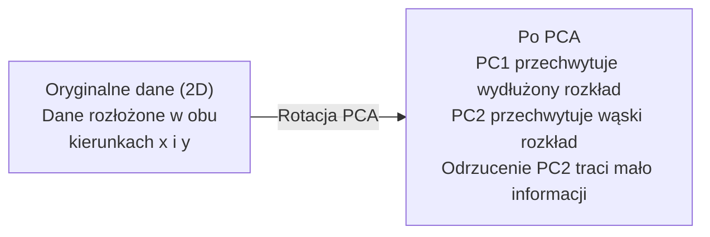

# Redukcja wymiarowości

> Dane wysokowymiarowe mają strukturę. Znajdujesz ją, patrząc z odpowiedniego kąta.

**Typ:** Build
**Język:** Python
**Wymagania wstępne:** Faza 1, Lekcje 01 (Intuicja algebry liniowej), 02 (Wektory, macierze i operacje), 03 (Wartości własne i wektory własne), 06 (Prawdopodobieństwo i rozkłady)
**Czas:** ~90 minut

## Cele nauki

- Zaimplementuj PCA od podstaw: wycentruj dane, oblicz macierz kowariancji, wykonaj dekompozycję na wektory własne i wykonaj projekcję
- Użyj wskaźnika wyjaśnionej wariancji (explained variance ratio) i metody łokcia (elbow method), aby wybrać liczbę głównych składowych
- Porównaj PCA, t-SNE i UMAP do wizualizacji cyfr MNIST w 2D i wyjaśnij ich kompromisy (tradeoffs)
- Zastosuj kernel PCA z jądrem RBF do separacji nieliniowych struktur danych, których standardowe PCA nie jest w stanie obsłużyć

## Problem

Masz zbiór danych z 784 cechami na próbkę. Może to być wartości pikseli ręcznie pisanych cyfr. Może to poziomy ekspresji genów. Może to sygnały zachowań użytkowników. Nie możesz zwizualizować 784 wymiarów. Nie możesz ich narysować na wykresie. Nie możesz nawet o nich myśleć.

Ale większość z tych 784 cech jest redundantna. Rzeczywista informacja żyje na znacznie mniejszej powierzchni. Ręcznie napisana "7" nie potrzebuje 784 niezależnych liczb do opisania. Potrzebuje kilku: kąta pociągnięcia, długości poprzecznej kreski, jak bardzo jest nachylona. Resztę stanowi szum.

Redukcja wymiarowości znajduje tę mniejszą powierzchnię. Bierze Twoje 784-wymiarowe dane i kompresuje je do 2, 10 lub 50 wymiarów, zachowując strukturę, która ma znaczenie.

## Koncepcja

### Klątwa wymiarowości

Przestrzenie wysokowymiarowe są nieintuicyjne. Trzy rzeczy przestają działać, gdy liczba wymiarów rośnie.

**Odległość staje się bezsensowna.** W wysokich wymiarach odległość między dowolnymi dwoma losowymi punktami zbiega do tej samej wartości. Jeśli każdy punkt jest w przybliżeniu w tej samej odległości od każdego innego punktu, wyszukiwanie najbliższego sąsiada przestaje działać.

```
Wymiar       Średni współczynnik odległości (max/min między losowymi punktami)
2            ~5.0
10           ~1.8
100          ~1.2
1000         ~1.02
```

**Objętość koncentruje się w narożnikach.** Jednostkowy hiperkostka w d wymiarach ma 2^d narożników. W 100 wymiarach niemal cała objętość znajduje się w narożnikach, daleko od centrum. Punkty danych rozkładają się na krawędziach, a Twoje modele głodują o dane w środku.

**Potrzebujesz wykładniczo więcej danych.** Aby zachować taką samą gęstość próbek w przestrzeni, przejście z 2D do 20D oznacza, że potrzebujesz 10^18 razy więcej danych. Nigdy nie masz ich wystarczająco. Redukcja wymiarów przywraca gęstość danych do czegoś, z czym można pracować.

### PCA: znajdź kierunki, które mają znaczenie

Analiza głównych składowych (Principal Component Analysis, PCA) znajduje osie, wzdłuż których Twoje dane zmieniają się najbardziej. Obraca Twój system współrzędnych tak, aby pierwsza osi przechwytywała najwięcej wariancji, druga przechwytywała kolejną największą wariancję, i tak dalej.

Algorytm:

```
1. Wycentruj dane         (odejmij średnią od każdej cechy)
2. Oblicz kowariancję     (jak cechy zmieniają się razem)
3. Dekompozycja na wektory własne (znajdź główne kierunki)
4. Sortuj według wartości własnej (największa wariancja pierwsza)
5. Wykonaj projekcję      (zachowaj top k wektorów własnych, odrzuć resztę)
```

Dlaczego dekompozycja na wektory własne? Macierz kowariancji jest symetryczna i dodatnio semi-określona (positive semi-definite). Jej wektory własne są ortogonalnymi kierunkami w przestrzeni cech. Wartości własne mówią Ci, jak dużo wariancji przechwytuje każdy kierunek. Wektor własny z największą wartością własną wskazuje kierunek maksymalnej wariancji.



- **Przed PCA:** Obłok danych jest rozłożony ukośnie wzdłuż obu osi x i y
- **Po PCA:** System współrzędnych jest obrócony tak, że PC1 jest zgodne z kierunkiem maksymalnej wariancji (wydłużony rozkład), a PC2 jest zgodne z kierunkiem minimalnej wariancji (wąski rozkład)
- **Redukcja wymiarowości:** Odrzucenie PC2 i projekcja danych na PC1 powoduje utratę bardzo małej ilości informacji

### Wskaźnik wyjaśnionej wariancji (explained variance ratio)

Każda główna składowa przechwytuje pewną część całkowitej wariancji. Wskaźnik wyjaśnionej wariancji mówi Ci, jak dużą.

```
Składowa     Wartość własna    Wskaźnik wyjaśniony    Skumulowany
PC1          4.73              0.473                   0.473
PC2          2.51              0.251                   0.724
PC3          1.12              0.112                   0.836
PC4          0.89              0.089                   0.925
...
```

Kiedy skumulowana wyjaśniona wariancja osiąga 0.95, wiesz, że tyle składowych przechwytuje 95% informacji. Wszystko po tym to w większości szum.

### Wybór liczby składowych

Trzy strategie:

1. **Próg (threshold).** Zachowaj wystarczająco wiele składowych, aby wyjaśnić 90-95% wariancji.
2. **Metoda łokcia (elbow method).** Wykreśl wyjaśnioną wariancję dla każdej składowej. Poszukaj wyraźnego spadku.
3. **Wydajność na docelowym zadaniu (downstream performance).** Użyj PCA jako preprocessingu. Przeskanuj k i zmierz dokładność swojego modelu. Najlepsze k znajduje się tam, gdzie dokładność wypłaszcza się (plateau).

### t-SNE: zachowuj sąsiedztwa

t-Distributed Stochastic Neighbor Embedding (t-SNE) jest zaprojektowany do wizualizacji. Mapuje dane wysokowymiarowe na 2D (lub 3D), zachowując informację o tym, które punkty są blisko siebie.

Intuicja: w oryginalnej przestrzeni oblicz rozkład prawdopodobieństwa dla par punktów na podstawie ich odległości. Bliskie punkty otrzymują wysokie prawdopodobieństwo. Odległe punkty otrzymują niskie prawdopodobieństwo. Następnie znajdź układ 2D, w którym zachodzi ten sam rozkład prawdopodobieństwa. Punkty, które były sąsiadami w 784 wymiarach, pozostają sąsiadami w 2D.

Kluczowe właściwości t-SNE:
- Nieliniowy. Może rozwijać (unfold) złożone rozmaitości (manifolds), z którymi PCA nie poradzi sobie.
- Stochastyczny. Różne uruchomienia produkują różne układy.
- Parametr perplexity kontroluje, jak wielu sąsiadów się uwzględnia (typowy zakres: 5-50).
- Odległości między klastrami w wyniku nie mają znaczenia. Jedynie same klastry mają znaczenie.
- Wolny na dużych zbiorach danych. Domyślnie O(n^2).

### UMAP: szybszy, lepsza globalna struktura

Uniform Manifold Approximation and Projection (UMAP) działa podobnie do t-SNE, ale z dwoma zaletami:
- Szybszy. Używa przybliżonych grafów najbliższych sąsiadów (approximate nearest-neighbor graphs) zamiast obliczania wszystkich odległości parami.
- Lepsza globalna struktura. Względne pozycje klastrów w wyniku są zwykle bardziej znaczące niż w t-SNE.

UMAP budujesz ważony graf w przestrzeni wysokowymiarowej ("rozmyta reprezentacja topologiczna" - fuzzy topological representation), a następnie znajduje niskowymiarowy układ, który zachowuje ten graf najlepiej, jak to możliwe.

Kluczowe parametry:
- `n_neighbors`: ile sąsiadów definiuje lokalną strukturę (podobnie do perplexity). Wyższe wartości zachowują więcej globalnej struktury.
- `min_dist`: jak ściśle punkty pakują się w wyniku. Niższe wartości tworzą gęstsze klastry.

### Kiedy używać czego

| Metoda | Przypadek użycia | Zachowuje | Szybkość |
|--------|----------|-----------|-------|
| PCA | Preprocessing przed treningiem | Globalną wariancję | Szybka (dokładna), działa na milionach próbek |
| PCA | Szybka eksploracyjna wizualizacja | Liniową strukturę | Szybka |
| t-SNE | Wykresy 2D na poziomie publikacji | Lokalne sąsiedztwa | Wolna (< 10k próbek idealnie) |
| UMAP | Wizualizacja 2D na dużą skalę | Lokalna + część globalnej struktury | Średnia (obsługuje miliony) |
| PCA | Redukcja cech dla modeli | Cechy uporządkowane według wariancji | Szybka |
| t-SNE / UMAP | Zrozumienie struktury klastrów | Separację klastrów | Średnia do wolnej |

Praktyczna zasada: użyj PCA do preprocessingu i kompresji danych. Użyj t-SNE lub UMAP, gdy potrzebujesz zwizualizować strukturę w 2D.

### Kernel PCA

Standardowe PCA znajduje liniowe podprzestrzenie. Obraca Twój system współrzędnych i odrzuca osie. Ale co, jeśli dane leżą na nieliniowej rozmaitości (manifold)? Okrąg w 2D nie może zostać rozdzielony żadną linią. Standardowe PCA tu nie pomoże.

Kernel PCA stosuje PCA w wysokowymiarowej przestrzeni cech wyznaczonej przez funkcję jądra (kernel function), bez jawnego obliczania współrzędnych w tej przestrzeni. To tzw. kernel trick - ten sam pomysł stoi za SVM.

Algorytm:
1. Oblicz macierz jądra K, gdzie K_ij = k(x_i, x_j)
2. Wycentruj macierz jądra w przestrzeni cech
3. Wykonaj dekompozycję na wektory własne wycentrowanej macierzy jądra
4. Top wektory własne (przeskalowane przez 1/sqrt(wartość_własna)) są projekcjami

Popularne funkcje jądra:

| Jądro | Formuła | Dobre dla |
|--------|---------|----------|
| RBF (Gaussowskie) | exp(-gamma * \|\|x - y\|\|^2) | Większości nieliniowych danych, gładkich rozmaitości |
| Wielomianowe | (x . y + c)^d | Relacji wielomianowych |
| Sigmoidalne | tanh(alpha * x . y + c) | Mapowań przypominających sieci neuronowe |

Kiedy użyć kernel PCA, a kiedy standardowego PCA:

| Kryterium | Standardowe PCA | Kernel PCA |
|-----------|-------------|------------|
| Struktura danych | Liniowa podprzestrzeń | Nieliniowa rozmaitość |
| Szybkość | O(min(n^2 d, d^2 n)) | O(n^2 d + n^3) |
| Interpretowalność | Składowe są liniowymi kombinacjami cech | Składowe nie mają bezpośredniej interpretacji w cechach |
| Skalowalność | Działa na milionach próbek | Macierz jądra ma rozmiar n x n, ograniczona pamięcią |
| Rekonstrukcja | Bezpośrednia transformacja odwrotna | Wymaga przybliżenia pre-image |

Klasyczny przykład: koncentryczne okręgi w 2D. Dwa pierścienie punktów, jeden wewnątrz drugiego. Standardowe PCA rzutuje obie na tę samą linię - bezużyteczne do klasyfikacji. Kernel PCA z jądrem RBF mapuje wewnętrzny okrąg i zewnętrzny okrąg na różne regiony, czyniąc je liniowo separowalnymi.

### Błąd rekonstrukcji

Jak dobra jest Twoja redukcja wymiarowości? Skompresowałeś 784 wymiary do 50. Co straciłeś?

Zmierz błąd rekonstrukcji:
1. Zrzutuj dane do k wymiarów: X_reduced = X @ W_k
2. Zrekonstruuj: X_hat = X_reduced @ W_k^T
3. Oblicz MSE: mean((X - X_hat)^2)

Dla PCA błąd rekonstrukcji ma czystą relację do wyjaśnionej wariancji:

```
Błąd rekonstrukcji = suma wartości własnych NIEUWZGLĘDNIONYCH
Wariancja całkowita = suma WSZYSTKICH wartości własnych
Utracona część = (suma odrzuconych wartości własnych) / (suma wszystkich wartości własnych)
```

Wskaźnik wyjaśnionej wariancji dla każdej składowej to:

```
explained_ratio_k = wartość_własna_k / suma(wszystkich wartości własnych)
```

Wykreślenie skumulowanej wyjaśnionej wariancji w funkcji liczby składowych daje krzywą "łokcia" (elbow). Właściwa liczba składowych to ta, w której:
- Krzywa wypłaszcza się (zmniejszające się korzyści)
- Skumulowana wariancja przekracza Twój próg (zwykle 0.90 lub 0.95)
- Wydajność na docelowym zadaniu wypłaszcza się

Błąd rekonstrukcji jest użyteczny nie tylko do wyboru k. Możesz go użyć do wykrywania anomalii: próbki z wysokim błędem rekonstrukcji są wartościami odstającymi (outliers), które nie pasują do nauczonej podprzestrzeni. To podstawa wykrywania anomalii na bazie PCA w systemach produkcyjnych.

## Zbuduj to

### Krok 1: PCA od podstaw

```python
import numpy as np

class PCA:
    def __init__(self, n_components):
        self.n_components = n_components
        self.components = None
        self.mean = None
        self.eigenvalues = None
        self.explained_variance_ratio_ = None

    def fit(self, X):
        self.mean = np.mean(X, axis=0)
        X_centered = X - self.mean

        cov_matrix = np.cov(X_centered, rowvar=False)

        eigenvalues, eigenvectors = np.linalg.eigh(cov_matrix)

        sorted_idx = np.argsort(eigenvalues)[::-1]
        eigenvalues = eigenvalues[sorted_idx]
        eigenvectors = eigenvectors[:, sorted_idx]

        self.components = eigenvectors[:, :self.n_components].T
        self.eigenvalues = eigenvalues[:self.n_components]
        total_var = np.sum(eigenvalues)
        self.explained_variance_ratio_ = self.eigenvalues / total_var

        return self

    def transform(self, X):
        X_centered = X - self.mean
        return X_centered @ self.components.T

    def fit_transform(self, X):
        self.fit(X)
        return self.transform(X)
```

### Krok 2: Test na danych syntetycznych

```python
np.random.seed(42)
n_samples = 500

t = np.random.uniform(0, 2 * np.pi, n_samples)
x1 = 3 * np.cos(t) + np.random.normal(0, 0.2, n_samples)
x2 = 3 * np.sin(t) + np.random.normal(0, 0.2, n_samples)
x3 = 0.5 * x1 + 0.3 * x2 + np.random.normal(0, 0.1, n_samples)

X_synthetic = np.column_stack([x1, x2, x3])

pca = PCA(n_components=2)
X_reduced = pca.fit_transform(X_synthetic)

print(f"Original shape: {X_synthetic.shape}")
print(f"Reduced shape:  {X_reduced.shape}")
print(f"Explained variance ratios: {pca.explained_variance_ratio_}")
print(f"Total variance captured: {sum(pca.explained_variance_ratio_):.4f}")
```

### Krok 3: Cyfry MNIST w 2D

```python
from sklearn.datasets import fetch_openml

mnist = fetch_openml("mnist_784", version=1, as_frame=False, parser="auto")
X_mnist = mnist.data[:5000].astype(float)
y_mnist = mnist.target[:5000].astype(int)

pca_mnist = PCA(n_components=50)
X_pca50 = pca_mnist.fit_transform(X_mnist)
print(f"50 components capture {sum(pca_mnist.explained_variance_ratio_):.2%} of variance")

pca_2d = PCA(n_components=2)
X_pca2d = pca_2d.fit_transform(X_mnist)
print(f"2 components capture {sum(pca_2d.explained_variance_ratio_):.2%} of variance")
```

### Krok 4: Porównanie ze sklearn

```python
from sklearn.decomposition import PCA as SklearnPCA
from sklearn.manifold import TSNE

sklearn_pca = SklearnPCA(n_components=2)
X_sklearn_pca = sklearn_pca.fit_transform(X_mnist)

print(f"\nOur PCA explained variance:     {pca_2d.explained_variance_ratio_}")
print(f"Sklearn PCA explained variance: {sklearn_pca.explained_variance_ratio_}")

diff = np.abs(np.abs(X_pca2d) - np.abs(X_sklearn_pca))
print(f"Max absolute difference: {diff.max():.10f}")

tsne = TSNE(n_components=2, perplexity=30, random_state=42)
X_tsne = tsne.fit_transform(X_mnist)
print(f"\nt-SNE output shape: {X_tsne.shape}")
```

### Krok 5: Porównanie z UMAP

```python
try:
    from umap import UMAP

    reducer = UMAP(n_components=2, n_neighbors=15, min_dist=0.1, random_state=42)
    X_umap = reducer.fit_transform(X_mnist)
    print(f"UMAP output shape: {X_umap.shape}")
except ImportError:
    print("Install umap-learn: pip install umap-learn")
```

## Wykorzystaj to

PCA jako preprocessing przed klasyfikatorem:

```python
from sklearn.decomposition import PCA as SklearnPCA
from sklearn.linear_model import LogisticRegression
from sklearn.model_selection import train_test_split
from sklearn.metrics import accuracy_score

X_train, X_test, y_train, y_test = train_test_split(
    X_mnist, y_mnist, test_size=0.2, random_state=42
)

results = {}
for k in [10, 30, 50, 100, 200]:
    pca_k = SklearnPCA(n_components=k)
    X_tr = pca_k.fit_transform(X_train)
    X_te = pca_k.transform(X_test)

    clf = LogisticRegression(max_iter=1000, random_state=42)
    clf.fit(X_tr, y_train)
    acc = accuracy_score(y_test, clf.predict(X_te))
    var_captured = sum(pca_k.explained_variance_ratio_)
    results[k] = (acc, var_captured)
    print(f"k={k:>3d}  accuracy={acc:.4f}  variance={var_captured:.4f}")
```

Wydajność wypłaszcza się dużo wcześniej niż 784 wymiary. To wypłaszczenie jest Twoim punktem pracy (operating point).

## Wypchnij to (Ship It)

Ta lekcja produkuje:
- `outputs/skill-dimensionality-reduction.md` - umiejętność (skill) wyboru właściwej techniki redukcji wymiarowości dla danego zadania

## Ćwiczenia

1. Zmodyfikuj klasę PCA, aby wsparła `inverse_transform`. Zrekonstruuj cyfry MNIST z 10, 50 i 200 składowych. Wypisz błąd rekonstrukcji (średnia różnica kwadratowa względem oryginału) dla każdej z nich.

2. Uruchom t-SNE na tym samym podzbiorze MNIST z wartościami perplexity 5, 30 i 100. Opisz, jak zmienia się wynik. Czemu perplexity wpływa na zwartość klastrów?

3. Weź zbiór danych z 50 cechami, gdzie tylko 5 jest informacyjnych (wygeneruj taki za pomocą `sklearn.datasets.make_classification`). Zastosuj PCA i sprawdź, czy krzywa wyjaśnionej wariancji prawidłowo identyfikuje, że dane są efektywnie 5-wymiarowe.

## Kluczowe terminy

| Termin | Co mówią ludzie | Co to faktycznie oznacza |
|------|----------------|----------------------|
| Klątwa wymiarowości (curse of dimensionality) | "Za dużo cech" | Odległości, objętości i gęstość danych zaczynają zachowywać się nieintuicyjnie w miarę wzrostu liczby wymiarów. Modele potrzebują wykładniczo więcej danych, aby to skompensować. |
| PCA | "Zredukuj wymiary" | Obróć swój system współrzędnych tak, aby osie były zgodne z kierunkami maksymalnej wariancji, a następnie odrzuć osie o niskiej wariancji. |
| Główna składowa (principal component) | "Ważny kierunek" | Wektor własny macierzy kowariancji. Kierunek w przestrzeni cech, wzdłuż którego dane zmieniają się najbardziej. |
| Wskaźnik wyjaśnionej wariancji (explained variance ratio) | "Jak dużo informacji ma ta składowa" | Część całkowitej wariancji przechwyconej przez jedną główną składową. Zsumuj top k wskaźników, aby zobaczyć, jak dużo zachowuje k składowych. |
| Macierz kowariancji | "Jak cechy się korelują" | Symetryczna macierz, w której wpis (i,j) mierzy, jak cecha i i cecha j zmieniają się razem. Wpisy na przekątnej to indywidualne wariancje. |
| t-SNE | "Ten wykres klastrów" | Nieliniowa metoda, która mapuje dane wysokowymiarowe na 2D, zachowując parowe prawdopodobieństwa sąsiedztwa. Dobra do wizualizacji, nie do preprocessingu. |
| UMAP | "Szybszy t-SNE" | Nieliniowa metoda bazująca na topologicznej analizie danych. Zachowuje lokalną i część globalnej struktury. Skaluje się lepiej niż t-SNE. |
| Perplexity | "Pokrętło t-SNE" | Kontroluje efektywną liczbę sąsiadów rozważanych dla każdego punktu. Niska perplexity skupia się na bardzo lokalnej strukturze. Wysoka perplexity przechwytuje szersze wzorce. |
| Rozmaitość (manifold) | "Powierzchnia, na której żyją dane" | Niskowymiarowa powierzchnia zanurzona w przestrzeni o wyższej wymiarowości. Arkusz papieru zmięty w 3D jest 2-wymiarową rozmaitością. |

## Dalsze materiały

- [A Tutorial on Principal Component Analysis](https://arxiv.org/abs/1404.1100) (Shlens) - przejrzysty wywód PCA od podstaw
- [How to Use t-SNE Effectively](https://distill.pub/2016/misread-tsne/) (Wattenberg i in.) - interaktywny przewodnik po pułapkach i wyborze parametrów t-SNE
- [Dokumentacja UMAP](https://umap-learn.readthedocs.io/) - teoria i praktyczne wskazówki od autorów UMAP
