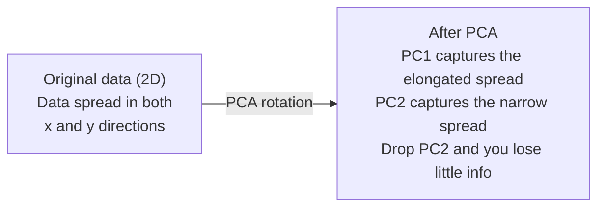

# Redukcja wymiarów

> Dane wielowymiarowe mają strukturę. Znajdziesz go, patrząc pod odpowiednim kątem.

**Typ:** Kompilacja
**Język:** Python
**Wymagania wstępne:** Faza 1, Lekcje 01 (Intuicja algebry liniowej), 02 (Wektory, macierze i operacje), 03 (Wartości własne i wektory własne), 06 (Prawdopodobieństwo i rozkłady)
**Czas:** ~90 minut

## Cele nauczania

- Wdrażaj PCA od podstaw: wyśrodkuj dane, oblicz macierz kowariancji, rozkład własny i projekt
- Użyj wyjaśnionego współczynnika wariancji i metody łokcia, aby wybrać liczbę głównych składników
- Porównaj PCA, t-SNE i UMAP w celu wizualizacji cyfr MNIST w 2D i wyjaśnij ich kompromisy
- Zastosuj jądro PCA z jądrem RBF, aby oddzielić nieliniowe struktury danych, których standardowy PCA nie jest w stanie obsłużyć

## Problem

Masz zbiór danych zawierający 784 funkcje na próbkę. Być może są to wartości pikseli odręcznie pisanych cyfr. Być może chodzi o poziom ekspresji genów. Być może są to sygnały dotyczące zachowań użytkowników. Nie można wizualizować 784 wymiarów. Nie możesz ich spiskować. Nie możesz nawet o nich myśleć.

Ale większość z tych 784 funkcji jest zbędna. Rzeczywista informacja żyje na znacznie mniejszej powierzchni. Odręcznie napisana „7” nie potrzebuje 784 niezależnych liczb, aby ją opisać. Potrzebuje kilku: kąta skoku, długości poprzeczki, stopnia pochylenia. Reszta to hałas.

Redukcja wymiarowości pozwala znaleźć mniejszą powierzchnię. Pobiera 784-wymiarowe dane i kompresuje je do 2, 10 lub 50 wymiarów, zachowując przy tym istotną strukturę.

## Koncepcja

### Klątwa wymiarowości

Przestrzenie wielowymiarowe są nieintuicyjne. Trzy rzeczy psują się wraz ze wzrostem wymiarów.

**Odległość traci znaczenie.** W dużych wymiarach odległość pomiędzy dowolnymi dwoma przypadkowymi punktami zbiega się do tej samej wartości. Jeśli każdy punkt znajduje się mniej więcej w tej samej odległości od każdego innego punktu, wyszukiwanie najbliższego sąsiada przestaje działać.

```
Dimension    Avg distance ratio (max/min between random points)
2            ~5.0
10           ~1.8
100          ~1.2
1000         ~1.02
```

**Objętość skupia się w rogach.** Hipersześcian jednostkowy o wymiarach d ma 2^d narożniki. W 100 wymiarach prawie cała objętość znajduje się w rogach, daleko od środka. Punkty danych rozciągają się na krawędzie, a Twoje modele cierpią na brak danych we wnętrzu.

**Potrzebujesz wykładniczo więcej danych.** Aby utrzymać tę samą gęstość próbek w przestrzeni, przejście z 2D na 20D oznacza, że ​​potrzebujesz 10^18 razy więcej danych. Nigdy nie masz dość. Zmniejszenie wymiarów przywraca gęstość danych do realnej wartości.

### PCA: znajdź ważne wskazówki

Analiza głównych składowych (PCA) znajduje osie, wzdłuż których dane różnią się najbardziej. Obraca układ współrzędnych, tak aby pierwsza oś uchwyciła najwięcej wariancji, druga następna i tak dalej.

Algorytm:

```
1. Center the data        (subtract the mean from each feature)
2. Compute covariance     (how features move together)
3. Eigendecomposition     (find the principal directions)
4. Sort by eigenvalue     (biggest variance first)
5. Project               (keep top k eigenvectors, drop the rest)
```

Dlaczego rozkład własny? Macierz kowariancji jest symetryczna i dodatnia półokreślona. Jego wektory własne są kierunkami ortogonalnymi w przestrzeni cech. Wartości własne mówią, ile wariancji wychwytuje każdy kierunek. Wektor własny z największą wartością własną punktów wzdłuż kierunku maksymalnej wariancji.



- **Przed PCA:** Chmura danych jest rozłożona po przekątnej na osiach x i y
- **Po PCA:** Układ współrzędnych zostaje obrócony tak, aby PC1 zrównał się z kierunkiem maksymalnej wariancji (wydłużony rozrzut), a PC2 zrównał się z kierunkiem minimalnej wariancji (wąski rozrzut)
- **Redukcja wymiarów:** Upuszczenie PC2 wyświetla dane na PC1, tracąc bardzo mało informacji

### Wyjaśniony współczynnik wariancji

Każdy główny składnik obejmuje ułamek całkowitej wariancji. Wyjaśniony współczynnik wariancji informuje, jak bardzo.

```
Component    Eigenvalue    Explained ratio    Cumulative
PC1          4.73          0.473              0.473
PC2          2.51          0.251              0.724
PC3          1.12          0.112              0.836
PC4          0.89          0.089              0.925
...
```

Kiedy skumulowana wyjaśniona wariancja osiągnie 0,95, wiadomo, że wiele składników przechwytuje 95% informacji. Wszystko potem to głównie hałas.

### Wybór liczby komponentów

Trzy strategie:

1. **Próg.** Zachowaj wystarczającą liczbę składników, aby wyjaśnić 90–95% wariancji.
2. **Metoda łokcia.** Wykres wyjaśniający wariancję na składnik. Szukaj ostrego spadku.
3. **Wydajność na późniejszym etapie.** Użyj PCA jako przetwarzania wstępnego. Przeciągnij k i zmierz dokładność swojego modelu. Najlepsze k jest tam, gdzie dokładność jest na stałym poziomie.

### t-SNE: ochrona dzielnic

t-Distributed Stochastic Neighbor Embedding (t-SNE) jest przeznaczony do wizualizacji. Mapuje dane wielowymiarowe do formatu 2D (lub 3D), zachowując jednocześnie to, które punkty są blisko siebie.

Intuicja: w oryginalnej przestrzeni oblicz rozkład prawdopodobieństwa dla par punktów na podstawie ich odległości. Bliskie punkty mają duże prawdopodobieństwo. Odległe punkty mają niskie prawdopodobieństwo. Następnie znajdź układ 2D, w którym obowiązuje ten sam rozkład prawdopodobieństwa. Punkty, które były sąsiadami w 784 wymiarach, pozostają sąsiadami w 2D.

Kluczowe właściwości t-SNE:
- Nieliniowy. Może rozwinąć złożone rozmaitości, których PCA nie jest w stanie.
- Stochastyczny. Różne przebiegi dają różne układy.
- Parametr zakłopotania kontroluje, ilu sąsiadów należy uwzględnić (typowy zakres: 5-50).
- Odległości pomiędzy klastrami w wynikach nie są znaczące. Są nimi tylko same klastry.
- Wolno na dużych zbiorach danych. Domyślnie O(n^2).

### UMAP: szybsza, lepsza struktura globalna

Uniform Manifold Approximation and Projection (UMAP) działa podobnie do t-SNE, ale ma dwie zalety:
- Szybciej. Wykorzystuje przybliżone wykresy najbliższego sąsiada zamiast obliczać wszystkie odległości parami.
- Lepsza struktura globalna. Względne pozycje klastrów w wynikach są zwykle bardziej znaczące niż w przypadku t-SNE.

UMAP tworzy wykres ważony w przestrzeni wielowymiarowej („rozmyta reprezentacja topologiczna”), a następnie znajduje układ niskowymiarowy, który najlepiej zachowuje ten wykres.

Kluczowe parametry:
- `n_neighbors`: ilu sąsiadów definiuje strukturę lokalną (podobnie jak zakłopotanie). Wyższe wartości zachowują bardziej globalną strukturę.
- `min_dist`: jak ciasno upakowane są punkty w wynikach. Niższe wartości tworzą gęstsze klastry.

### Kiedy używać którego

| Metoda | Przypadek użycia | Konserwuje | Prędkość |
|--------|----------|------|-------|
| PCA | Przetwarzanie wstępne przed szkoleniem | Globalna wariancja | Szybki (dokładny), działa na milionach próbek |
| PCA | Szybka wizualizacja eksploracyjna | Struktura liniowa | Szybki |
| t-SN | Wykresy 2D o jakości publikacyjnej | Lokalne dzielnice | Powolny (idealnie < 10 tys. próbek) |
| UMAP | Wizualizacja 2D w skali | Lokalne + trochę struktury globalnej | Średni (obsługuje miliony) |
| PCA | Redukcja funkcji dla modeli | Funkcje z rankingiem wariancji | Szybki |
| t-SNE / UMAP | Zrozumienie struktury klastrów | Separacja klastrów | Średnio do powolnego |

Ogólna zasada: używaj PCA do wstępnego przetwarzania i kompresji danych. Jeśli potrzebujesz wizualizacji struktury w 2D, użyj t-SNE lub UMAP.

### Kernel PCA

Standardowa PCA znajduje podprzestrzenie liniowe. Obraca układ współrzędnych i upuszcza osie. Ale co, jeśli dane leżą na rozmaitości nieliniowej? Okrąg w 2D nie może być oddzielony żadną linią. Standardowe PCA nie pomoże.

Kernel PCA stosuje PCA w wielowymiarowej przestrzeni cech indukowanej przez funkcję jądra, bez jawnego obliczania współrzędnych w tej przestrzeni. To jest sztuczka z jądrem — ten sam pomysł kryje się za maszynami SVM.

Algorytm:
1. Oblicz macierz jądra K gdzie K_ij = k(x_i, x_j)
2. Wyśrodkuj macierz jądra w przestrzeni cech
3. Rozłóż własny wyśrodkowany macierz jądra
4. Górne wektory własne (skalowane przez 1/sqrt(wartość własna)) to rzuty

Typowe funkcje jądra:

| Jądro | Formuła | Dobre dla |
|--------|---------|---------|
| RBF (Gaussa) | exp(-gamma * \|\|x - y\|\|^2) | Większość danych nieliniowych, gładkie rozmaitości |
| Wielomian | (x. y + c)^d | Relacje wielomianowe |
| Sigmoida | tanh(alfa * x . y + c) | Mapowania przypominające sieć neuronową |

Kiedy używać jądra PCA zamiast standardowego PCA:

| Kryterium | Standardowa PCA | Jądro PCA |
|---------------|------------|------------|
| Struktura danych | Podprzestrzeń liniowa | Rozmaitość nieliniowa |
| Prędkość | O(min(n^2 d, d^2 n)) | O(n^2d + n^3) |
| Interpretowalność | Komponenty są liniowymi kombinacjami cech | Komponentom brakuje bezpośredniej interpretacji cech |
| Skalowalność | Działa na milionach próbek | Macierz jądra to n x n, ograniczona pamięć |
| Rekonstrukcja | Bezpośrednia transformacja odwrotna | Wymaga przybliżenia obrazu wstępnego |

Klasyczny przykład: koncentryczne okręgi w 2D. Dwa pierścienie punktów, jeden wewnątrz drugiego. Standardowe projekty PCA oba na tej samej linii - bezużyteczne do klasyfikacji. Jądro PCA z jądrem RBF odwzorowuje okrąg wewnętrzny i okrąg zewnętrzny na różne regiony, dzięki czemu można je liniowo oddzielić.

### Błąd rekonstrukcji

Jak dobra jest Twoja redukcja wymiarów? Skompresowałeś 784 wymiary do 50. Co straciłeś?

Zmierz błąd rekonstrukcji:
1. Projektuj dane na k wymiarów: X_reduced = X @ W_k
2. Zrekonstruuj: X_hat = X_reduced @ W_k^T
3. Oblicz MSE: średnia((X - X_hat)^2)

W przypadku PCA błąd rekonstrukcji ma czysty związek z wyjaśnioną wariancją:

```
Reconstruction error = sum of eigenvalues NOT included
Total variance = sum of ALL eigenvalues
Fraction lost = (sum of dropped eigenvalues) / (sum of all eigenvalues)
```

Wyjaśniony współczynnik wariancji dla każdego składnika wynosi:

```
explained_ratio_k = eigenvalue_k / sum(all eigenvalues)
```

Wykreślenie skumulowanej wyjaśnionej wariancji w funkcji liczby składników daje krzywą „kolanka”. Właściwa liczba komponentów to:
- Krzywa się wypłaszcza (malejące zyski)
- Skumulowana wariancja przekracza Twój próg (zwykle 0,90 lub 0,95)
- plateau wydajności zadań dalszych

Błąd rekonstrukcji jest przydatny poza wyborem k. Można go użyć do wykrywania anomalii: próbki o dużym błędzie rekonstrukcji to wartości odstające, które nie pasują do wyuczonej podprzestrzeni. Stanowi to podstawę wykrywania anomalii w systemach produkcyjnych w oparciu o PCA.

## Zbuduj to

### Krok 1: PCA od podstaw

```python
import numpy as np

class PCA:
    def __init__(self, n_components):
        self.n_components = n_components
        self.components = None
        self.mean = None
        self.eigenvalues = None
        self.explained_variance_ratio_ = None

    def fit(self, X):
        self.mean = np.mean(X, axis=0)
        X_centered = X - self.mean

        cov_matrix = np.cov(X_centered, rowvar=False)

        eigenvalues, eigenvectors = np.linalg.eigh(cov_matrix)

        sorted_idx = np.argsort(eigenvalues)[::-1]
        eigenvalues = eigenvalues[sorted_idx]
        eigenvectors = eigenvectors[:, sorted_idx]

        self.components = eigenvectors[:, :self.n_components].T
        self.eigenvalues = eigenvalues[:self.n_components]
        total_var = np.sum(eigenvalues)
        self.explained_variance_ratio_ = self.eigenvalues / total_var

        return self

    def transform(self, X):
        X_centered = X - self.mean
        return X_centered @ self.components.T

    def fit_transform(self, X):
        self.fit(X)
        return self.transform(X)
```

### Krok 2: Test na danych syntetycznych

```python
np.random.seed(42)
n_samples = 500

t = np.random.uniform(0, 2 * np.pi, n_samples)
x1 = 3 * np.cos(t) + np.random.normal(0, 0.2, n_samples)
x2 = 3 * np.sin(t) + np.random.normal(0, 0.2, n_samples)
x3 = 0.5 * x1 + 0.3 * x2 + np.random.normal(0, 0.1, n_samples)

X_synthetic = np.column_stack([x1, x2, x3])

pca = PCA(n_components=2)
X_reduced = pca.fit_transform(X_synthetic)

print(f"Original shape: {X_synthetic.shape}")
print(f"Reduced shape:  {X_reduced.shape}")
print(f"Explained variance ratios: {pca.explained_variance_ratio_}")
print(f"Total variance captured: {sum(pca.explained_variance_ratio_):.4f}")
```

### Krok 3: Cyfry MNIST w 2D

```python
from sklearn.datasets import fetch_openml

mnist = fetch_openml("mnist_784", version=1, as_frame=False, parser="auto")
X_mnist = mnist.data[:5000].astype(float)
y_mnist = mnist.target[:5000].astype(int)

pca_mnist = PCA(n_components=50)
X_pca50 = pca_mnist.fit_transform(X_mnist)
print(f"50 components capture {sum(pca_mnist.explained_variance_ratio_):.2%} of variance")

pca_2d = PCA(n_components=2)
X_pca2d = pca_2d.fit_transform(X_mnist)
print(f"2 components capture {sum(pca_2d.explained_variance_ratio_):.2%} of variance")
```

### Krok 4: Porównaj ze sklearn

```python
from sklearn.decomposition import PCA as SklearnPCA
from sklearn.manifold import TSNE

sklearn_pca = SklearnPCA(n_components=2)
X_sklearn_pca = sklearn_pca.fit_transform(X_mnist)

print(f"\nOur PCA explained variance:     {pca_2d.explained_variance_ratio_}")
print(f"Sklearn PCA explained variance: {sklearn_pca.explained_variance_ratio_}")

diff = np.abs(np.abs(X_pca2d) - np.abs(X_sklearn_pca))
print(f"Max absolute difference: {diff.max():.10f}")

tsne = TSNE(n_components=2, perplexity=30, random_state=42)
X_tsne = tsne.fit_transform(X_mnist)
print(f"\nt-SNE output shape: {X_tsne.shape}")
```

### Krok 5: Porównanie UMAP

```python
try:
    from umap import UMAP

    reducer = UMAP(n_components=2, n_neighbors=15, min_dist=0.1, random_state=42)
    X_umap = reducer.fit_transform(X_mnist)
    print(f"UMAP output shape: {X_umap.shape}")
except ImportError:
    print("Install umap-learn: pip install umap-learn")
```

## Użyj tego

PCA jako przetwarzanie wstępne przed klasyfikatorem:

```python
from sklearn.decomposition import PCA as SklearnPCA
from sklearn.linear_model import LogisticRegression
from sklearn.model_selection import train_test_split
from sklearn.metrics import accuracy_score

X_train, X_test, y_train, y_test = train_test_split(
    X_mnist, y_mnist, test_size=0.2, random_state=42
)

results = {}
for k in [10, 30, 50, 100, 200]:
    pca_k = SklearnPCA(n_components=k)
    X_tr = pca_k.fit_transform(X_train)
    X_te = pca_k.transform(X_test)

    clf = LogisticRegression(max_iter=1000, random_state=42)
    clf.fit(X_tr, y_train)
    acc = accuracy_score(y_test, clf.predict(X_te))
    var_captured = sum(pca_k.explained_variance_ratio_)
    results[k] = (acc, var_captured)
    print(f"k={k:>3d}  accuracy={acc:.4f}  variance={var_captured:.4f}")
```

Wydajność osiąga poziom na długo przed wymiarami 784. Ten płaskowyż to twój punkt operacyjny.

## Wyślij to

Ta lekcja daje:
- `outputs/skill-dimensionality-reduction.md` - umiejętność wyboru właściwej techniki redukcji wymiarowości dla danego zadania

## Ćwiczenia

1. Zmodyfikuj klasę PCA, aby obsługiwała `inverse_transform`. Zrekonstruuj cyfry MNIST z 10, 50 i 200 składników. Wydrukuj błąd rekonstrukcji (średnia kwadratowa różnica w stosunku do oryginału) dla każdego z nich.

2. Uruchom t-SNE w tym samym podzbiorze MNIST z wartościami złożoności 5, 30 i 100. Opisz, jak zmienia się wynik. Dlaczego zakłopotanie wpływa na szczelność klastra?

3. Weź zbiór danych zawierający 50 cech, z których tylko 5 ma charakter informacyjny (wygeneruj jeden za pomocą `sklearn.datasets.make_classification`). Zastosuj PCA i sprawdź, czy wyjaśniona krzywa wariancji prawidłowo wskazuje, że dane są faktycznie 5-wymiarowe.

## Kluczowe terminy

| Termin | Co ludzie mówią | Co to właściwie oznacza |
|------|----------------|----------------------|
| Klątwa wymiarowości | „Zbyt wiele funkcji” | Odległości, objętości i gęstość danych zachowują się wbrew intuicji w miarę wzrostu wymiarów. Modele potrzebują wykładniczo więcej danych, aby to skompensować. |
| PCA | „Zmniejsz wymiary” | Obróć układ współrzędnych tak, aby osie pokrywały się z kierunkami największej wariancji, a następnie upuść osie o małej wariancji. |
| Główny składnik | „Ważny kierunek” | Wektor własny macierzy kowariancji. Kierunek w przestrzeni cech, wzdłuż którego dane różnią się najbardziej. |
| Wyjaśniony współczynnik wariancji | „Ile informacji ma ten komponent” | Część całkowitej wariancji ujęta przez jeden główny składnik. Zsumuj najwyższe współczynniki k, aby zobaczyć, ile k składników się zachowuje. |
| Macierz kowariancji | „Jak cechy korelują” | Symetryczna macierz, w której wpis (i, j) mierzy, w jaki sposób cecha i i cecha j poruszają się razem. Wpisy ukośne są indywidualnymi odchyleniami. |
| t-SN | „Ta fabuła klastra” | Metoda nieliniowa, która odwzorowuje dane wielowymiarowe na 2D, zachowując prawdopodobieństwa sąsiedztwa parami. Dobre do wizualizacji, a nie do wstępnego przetwarzania. |
| UMAP | „Szybszy t-SNE” | Metoda nieliniowa oparta na analizie danych topologicznych. Zachowuje zarówno strukturę lokalną, jak i pewną globalną. Skaluje się lepiej niż t-SNE. |
| Zakłopotanie | „Pokrętło t-SNE” | Kontroluje efektywną liczbę sąsiadów uwzględnianych przez każdy punkt. Niska zakłopotanie skupia się na bardzo lokalnej strukturze. Wysokie zakłopotanie pozwala uchwycić szersze wzorce. |
| Kolektor | „Powierzchnia, na której żyją dane” | Powierzchnia o niższych wymiarach osadzona w przestrzeni o wyższych wymiarach. Arkusz papieru zmięty w 3D to rozmaitość 2D. |

## Dalsze czytanie

- [Samouczek na temat analizy głównych składowych](https://arxiv.org/abs/1404.1100) (Shlens) - jasne wyprowadzenie PCA od podstaw
- [Jak skutecznie korzystać z t-SNE](https://distill.pub/2016/misread-tsne/) (Wattenberg i in.) - interaktywny przewodnik po pułapkach t-SNE i doborze parametrów
- [Dokumentacja UMAP](https://umap-learn.readthedocs.io/) - teoria i praktyczne wskazówki od autorów UMAP