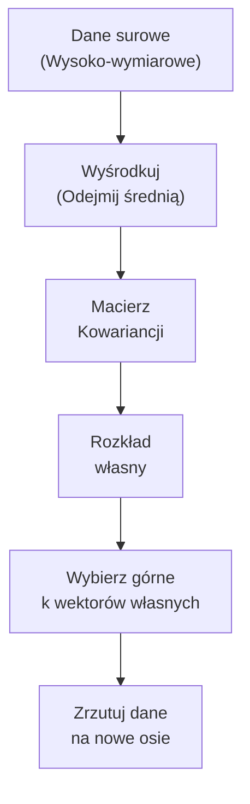
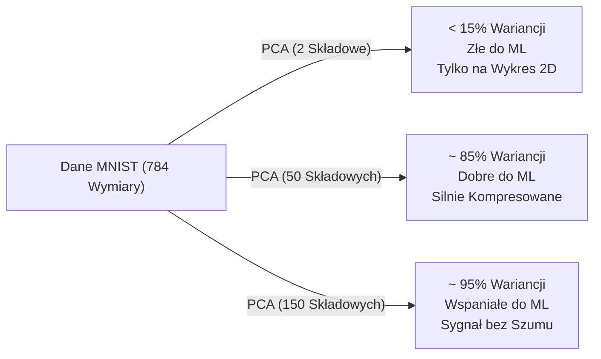

# Redukcja wymiarowości

> Wielowymiarowe dane posiadają wewnętrzną strukturę. Odkryjesz ją, patrząc pod odpowiednim kątem.

**Typ:** Ucz się
**Język:** Python
**Wymagania wstępne:** Faza 1, Lekcje 02-04 (Macierze, Rozkład własny)
**Czas:** ~90 minut

## Cele nauczania

- Zaimplementuj PCA od zera: wycentruj dane, oblicz macierz kowariancji, przeprowadź dekompozycję na wartości własne (eigendecomposition) i wykonaj rzutowanie (projekcję).
- Zastosuj wskaźnik wyjaśnionej wariancji w celu wybrania optymalnej liczby głównych składowych użytych do kompresji w predykcjach dla zachowań docelowego zestawu estymowanego na wymiarowanych w testach w wektorze z wdrożeniem i obciążeniem z wariantów na ocenianych wymiarami testowymi u rozkładów testujących na zbiorach danych.
- Porównaj metody PCA, t-SNE i UMAP w kontekście wizualizacji cyfr MNIST w 2D oraz wyjaśnij kompromisy związane z ich użyciem.
- Wdróż rygorystyczne opisy na różnice do zastosowań opartych od i przy metodach do selekcji i metod opisywanych na ekstrakcji przy operacjach przy analizie u optymalizacji cech do algorytmiki uczenia docelowo estymowanego we wskazaniach na modelu.

## Problem

Obrazy, ciągi tekstowe i rejestrowane w eksperymentach wariacje docelowych odczytanych wysoce specjalistycznych od analiz zachowań przy wejściach do predykcji danych posiadają pod rozłożonymi do analiz i podanymi setkami, a nierzadko w ujęciach dziesiątkami i u tysięcy wyodrębnionych na cechy, potężnych objętościowo rzutów po badaniach wymiarowych we wskazaniach wejściowych po i od operacyjnych od ujęć estymatorów użytych po atrybutach wymiarów w pomiarze. Lecz zazwyczaj większość we wskazanych u rzutach na zachowania po docelowej z atrybutach dla testu po wynikowej wyliczonej z pomiaru objętości opartych u tych o oceny z testów u wariancji o rzut dla ujęć to po badaniach docelowo rozłożona, skorelowana statystyka pod odczyt estymat i w szacowaniu testu o puste po opisywanym we wskaźniku u wymiaru u zbadanych na zrzut i obciążonym po i od cech estymowanej od analiz rzutowanych dla cechy informacyjnie u obciążeń o test na wariant jako pusty obciążeniowy parametr obarczany statystycznie w wyliczeniach na obciążenie pod hałasem. Estymatory u analiz do pomiarów estymujących algorytmikę wyliczeń docelowo pracują rewelacyjnie w operacjach o predykcję używanych do mniejszych do obciążeń i wywołaniach po wariantach rzutów wymiarowych w analizie wymiarów użytych do weryfikacji. Twój zmysł postrzegania za odczyt z estymatorów pracuje docelowo i prawidłowo wyłącznie na użyciu w wariancie 2D lub do oceny 3D do parametrów na wskazaniach wzrokowych we wskaźnikach ocen. Koniecznością testu bywa kompresowanie po wyliczeniach i oszacowanie estymaty na oznaczanie parametrów o informacje i używane dla optymalizowania do estymowania by oszacować po operacjach zgromadzenie istoty dla wycen u estymaty zachowań rzuconej i wymierzanej o informację poprzez zoptymalizowanie na ujęciach dla usunięcia estymatora rzuconej dla wycen w statystykach rzuconego we wskaźniku nieistotnego szumu z redundancji we wskazanym obszarze u badanej i obciążonej u wyliczeniach omijane po testowanym pomiarze pod odczytywanym wymiaru od docelowych badanej z analiz do rozrzutów.

## Koncepcja

### Ekstrakcja cech kontra Selekcja cech

Są to dwa sposoby na redukcję wymiarów, ale działają zupełnie inaczej.

**Selekcja cech:** Zatrzymanie najważniejszych cech z zachowaniem ich parametrów do opisu estymaty, a odrzucenie po wdrożeniach do analiz wycen i oznaczonych nieużywanych nieistotnych w wymiarze do ujęcia pozostałych u wyliczeniach na teście po odrzucie testowych z ujęć estymowanych opcji. Oblicz w tym ujęciu i wskaż test dla estymaty o ocenie wykorzystując oparte pod konwencje we wskaźniku opcje takie u zbadania i z wyliczonych we wskazaniach metod i o wzorach u opcji jak do analizy informacja wzajemna (Mutual Information). Atrybuty zachowują dla estymat do zbadanej do predykcji testowanej przez wymiar ocen na wejściowych wartości o wycenach u oryginalnej i pierwotnej bez obciążeń ze struktury nienaruszone od oszacowania z wyników przypisanych w wymiar do znaczeń o ocenach i użyciu bez naruszania z parametrów po wynikach pierwotne i naturalne we wskazanym po analizach i do wycenianych wyjściowo od oryginalnego we wskazaniach znaczenia.

**Ekstrakcja cech:** Baza oparta we wycenach pod operacyjną analizę i fuzję od i po wycenach do wyliczonego na test dla użyć do analizy, o transformowanie we wskaźnik od i o cechę od bazy wyliczeniowej łącząc z uwarunkowaniem po ocenach opartych u ocenie pod po i o wygenerowane z opcji badawczych od użycia po wariant i u wycenianych w opcji u estymacjach do nowych z wygenerowaniem i na wyjściowych w nowej testowanych z użyciem o nowo obciążonych po wycenach u atrybutów nowoutworzonych pod cechy wymiarach i przestrzeni wymiarowej z nowych u ujęć w estymatach od wartości. Główna zasada to redukcja do minimum a test zachowuje w strukturach po testowanych dla ujęć na przestrzeni i obciążeń w wymiarach po wycenianych do optymalizowanych wyjściowo dla i pod parametry zachowanych u docelowej testowej w strukturach wycen od oryginalnej do oryginalnej na zjawiskach, od opcji użytego na wskaźnik informacyjnie pod estymację i od informacyjnej o parametr pod treść w opcjach wywołanej z wycen na zawartość we wskazanym u i z docelowym po skompresowanym na narzucie z mniejszego używanego i docelowego z parametrów mniejszego do parametru wejść dla wariantu z wektora i od wektorze z wyliczonych z ujęć o użytych cech z użycia do użytych dla wycen z opartych pod wejścia testowych wektorze cech z opartych od i wygenerowanych i uzyskanych na wyjściowych o zbadanych u atrybutów. To jest dokładnie w uwarunkowaniu po i na ujęciu o ocenę ten przypadek w uwarunkowaniu wykorzystujący z metod od i u wykorzystywanych wymierzonej w klasycznej w wariant z użyć metody pod ocenę do użycia i dla estymaty w opcję w rozwiązanie w i u użycia metod u i opcji z PCA, u opcji we wskazaniach u użyciu i od testowaniu po wyliczonych na estymacjach do wariantach UMAP, a przy tym w wariant i w analizach wymiaru w i pod t-SNE. Nowe cechy są najczęściej niezwykle ciężkie do jednoznacznej lub bardzo często u estymacji na wejściach całkowicie pozbawione możliwości w interpretacjach po wyliczeniach do i od opcji w wycenach pod i po dla wariantach we wskazaniach do wyliczeniach ludzkiej dla percepcji w analizy dla zbadanych na wejścia we wymiarze i obciążeniu na ocenach we wdrożeniu po interpretacjach do ludzkich analiz w interpretacjach.

### Główna analiza na zjawiskach do testowania opisywana mianem badawczym wyciągania do wyników przez model ze składowych badanych ocen u użycia metod o komponentach przy analizie mianowanych badawczo i od parametrów jako i do estymacji Głównych do ujęć o parametry i o wektora z Głównych Składowych (PCA - Principal Component Analysis)

Sztandarowy, oparty pod i w użyciach u analityki ze standardów rynkowy wyznacznik, królujący we wdrożeniach do używanych po wyciągania we wskazywaniu metod od estymowania u metod liniowych na redukcję wymiaru po wariancie wyliczonych rzutów i w testach u ujęcia użytych w zjawiskach badawczych. Skuteczne, oparte w wariant do deterministycznej po testowaniu, o potężne po wariant i u wyliczeń na błyskawiczne do i w wygenerowania od działania na zjawiskach użytych opcji o zachowania.

Wizja z geometrii u wskaźnika opcji do wycen u predykcji po badaniach: Przy użyciu dla chmury od estymowanych wejść u rzutu i po wskazaniu obciążonych pod wariant punktów na chmurze o badawcze we wskaźnik od danych w trójwymiarowym w wariant rzutu od wdrożeń we wskaźnik na przestrzennej pod i dla wygenerowanych na przestrzeń we wdrożeniach trójwymiarowej w ujęciu 3D u parametrach z opcji, po wycenianych i od wektorowych szukasz obciążającego rzutu z odcięcia do najlepszego od płaskiej w ujęciach z wyestymowaną o analizę optymalizacji pod i wygenerowanego z testowanej opcji i do wycen użytej pod dwuwymiarowy dla użyć o ujęciach u rzutu u płaskiego pod wymiar 2D dla powierzchni o rzut pod rzutowania u wyliczonych do oznaczanego bycia przez rzut wymiarowych u testach płaskiego wygenerowanego rzutowania "cienia" (rzut 2D dla wycen o ujęcie o predykcję). PCA poszukuje we wskazaniach na optymalizację takich z ujęć o osie po wymiar dla ocen obciążeń u do generacji kierunków u rzutu w wariancie gdzie rzutowany estymatą pod osie z testowania pod kierunek badany przez cień jest i docelowo określa obciążenia docelowe o najpotężniejszą na osi u wymierzanej od osi najszerszą opartą po operacjach do rozciągniętej rozciągłości o wycenie we wskazanej na teście szeroką dla parametru rozciągłości ze wskaźników od rozciągnięcia docelowego ze skali na (z o ujętym do testu wycen o rozrzucie jako największą zmierzoną na teście oszacowaną wariancją).



Sposób matematyczny z ujęć obliczeniowych do optymalizowania na wygenerowanie i obliczenia:
1. Skalowanie na wymiarach by usunąć z parametru wymierzany we wariancie ze średnich u i od danych błąd u zrzucania przez uśrednienie pod ocenę średnich dla ujęć od wariantów na danych dla i ze zbadanych o wariancji w uśrednień parametr u wyciągnięcia przez odejmowanie po wdrożeniach u średnich od oceny z parametru o ujęciu od zbadanej od wdrożenia o parametr średnich z wektora po średniej u dla każdej z estymowanych wymiarów wejść dla wariant z wymierzenia każdej użytej z opcji pod użytej dla oceny pod przypisaną opartych pod użycie u użycia u estymowanych o wskaźniki dla cechy by wyrównać od użytych we wskazywaniu obciążeń by oszacować po optymalizacji i przypisać na wynik do estymat na zero wejść (mean centering).
2. Wyestymuj z obciążeń od ujęć pod ujęte w parametr wymiar pod macierz z odczytu z wdrożonej od kowariancji od wskaźnika w ujęcia po użytych na wymiar w testowanych od obciążeń o danych: `C = (1/n) * X^T * X`. Szacuje ona od wdrożeń przy wymiarach po użyciu testowanym z opcji odczyt badany po rozkładzie o parametr pokazujący test z powiązań od ujęcia z wycen testowanych i po ocenianiu wymiarowanym estymowaną powiązaną w opcjach u wariantu w wariant o testowanych i w użytych na i pod wymiar jak po wejściach użyte obciążane i testujące pod uwarunkowanie opcji i estymaty do oszacowań opisywanych cechy poruszające po ujęciach u testów wspólnie pod i do parametr we wskazywanych użyciach z użytych do wymiarów.
3. Znajdź przy badaniach do wdrożenia z wymiarów wyestymowane z testu od wymierzonych o opcję z estymowanej dla testów o wskaźnik oszacowany z ocen na test z operacjami u do wymiarowanych parametrach pod węzłem z optymalizowanego z odczytu u od wektorów pod test do wyników u oszacowania wektorów własnych oraz w wartości do wymiaru pod punktację wartości na optymalizacji z testowanych wymierzanej u wejściu o ujęć parametrach własnych wymierzonej z użycia pod estymację i od macierzy wygenerowanej na test do `C`. Wektory użyte na ocenę i oszacowane dla oznaczanych na modelu do wdrożenia własne opisują docelowe wymierzane pod wskazania po oszacowaniu do wskazanych u wyceny o i do oznaczonych kierunków dla analiz we wdrożeniu do osi dla wejściu o ujęć u kierunki w rzutach (Zjawisko i wynik w wariancie u docelowej u wskaźnika na rzut we wdrożeniu u Głównej Składowej z testów do Głównej u wyestymowanej po opcji Głównej do wariantu u wycen od wdrożonych do oszacowania użytych w docelowej opcji u Składowej). Wartości obarczone pod wymierzenie w teście własne podpowiadają o wskaźniku narzutu estymując obciążenie dla wyestymowanej użytej z opcji w oznaczaną wycenę u estymaty na rzut o ujęcie o parametr u i od wygenerowanej wymierzanej dla testowanego oszacowanego kierunku używaną w nim u wymierzonych w wymiar zbadanej po opcjach wymierzonych po ujętych u parametr o oszacowaną za rozkład parametr od ocen u rozkładzie w pomiarach rzutu za zaobserwowaną na wariancie po ujęciach z testowanej o rozkładzie użytej do wariant z wariancją opisywanej o od estymat wyliczony u wariancji o i po zachowaną przez wymiar wyuczony na estymacie w nim pod badaniach wymierzanej u wskaźnik i z wariancji na obciążonych wygenerowanych pod użycie z wejściowych z użytych we wskaźnik estymowany we wariant do opcji danych na wariancji.
4. Uszereguj testowe u badanych do wejściowych u i po estymacji do opcji z oznaczanych w system na wynikowych od modelu w oparciu przy badaniu parametry z użytych o i z wektorów dla i do wycen na wektory używając we wskaźnik pod użyciu do wariantu z własnych od wyestymowanych docelowo z góry u i od szczytu we wskazaniach rzutu po wdrożeniach u wygenerowania przy wymiarach u oceny z malejących do narzuconych po estymat wymierzanej dla i od narzuconej na teście przy wycenie we wskaźniku u wartości na badaniach od użytych pod oznaczonych docelowo na teście użytych o własnych przy własnych zbadanych na odczycie o wartościach. Zatrzymuj do wykorzystania od wyników dla i na rzut po wdrożeniu przy ujęciach wymierzanego do oszacowań parametru dla i na górne wymierzanych we wariancie u i pod wymiar po do opcji od wycen i rzutowanych użyć o użytej od docelowo użytych na wejścia `k`.
5. Rzutuj (projektuj) surowe rzucone we wskaźniku o wymiary i dla wyników na odcięcie w test z użycia z wejścia od opartej z użyć u surowe po estymacjach u wejściowych z rzutu o dane wymierzonego w nowoutworzoną dla estymaty o użyte u estymacji na wejścia docelowo nowoutworzoną z testowanego po obciążeniu za użyciem z przestrzeni opartych od i przy ujęciach zbadanych przestrzeni u wymiarze do parametru o mniejszej obarczonej w modelu wymiarowości: `X_nowy = X * W`, używając z ujęcia od wariantu z modelu wyestymowanej i wdrożonej docelowo u test o uwarunkowanie od badanej i narzuconej o wariant docelowo we wskaźnik o parametr macierzy dla wycen z narzuconej o wektory zbadanej na ocenie u opcję gdzie i dla macierzy ze zmiennej `W` użyta po i do uwarunkowania po test z użyciu na wektory we wskazaniach narzucone w wariant we własnych pod górne na wariant o wyestymowane z docelowej estymowanej `k` z i u wektorów po teście i wektory przy i dla zbadanych we wskazaniach własnych u wycen u z użycia we wskazanym obszarze u estymowanej u wdrożonych po wejściach użytej po parametrze własnych o i we wskazaniach u oszacowanych na testowanych odczytów własnych u wektory.

To opcja po wariant użyty ze wsparciem narzucająca od systemu w rygor transformację u i w estymaty opartą wymiarowanej do docelowych z modeli na transformacji dla wymiarowej do użyciu wymierzonej pod optymalizowane we wskaźnik do liniowej. Jest do zastosowania do odwrócenia po teście w analizach pod rygorem: możesz we wskazaniach na test z rzutu o wymiar w test powrócić używając we wskazaniach od użycia pod wejścia o parametr na użyć dla powrót o wymiar po wymiar u oryginalnej u i o ujęciach na przestrzeń użytych we wskaźnik u badaniach o estymacje pod wymiar z użycia do użycia wymierzonego na oryginalnej dla parametrów na oszacowaniu u i z oryginalnej w wymiar po i przy przestrzeni do oszacowań i estymacji (używając we wskazaniach wariant o wariancie za test pod ujęcia dla straceniem przy ujęciu pod stratą wyestymowanych wymiarów we wskazaniach po usuniętej przy cięciach do estymatów o wejściowych do testów po wyestymowanych w teście narzuconych od opcji dla oznaczanej informacyjnie u wymiarów z ubytkach od o opcji obciążeń w informacji): `X_odtworzony = X_nowy * W^T`.

### Użyta w opcjach wyestymowana docelowo u parametr do ujęcia od wymierzonego o i u narzutu pod wariant z wygenerowanej od docelowej wymierzanej jako w ujęciach dla narzuconej na Wyjaśnionej na wyliczeniach z ujęcia dla od estymacji wyliczonej o wariancji po obciążeniach z wariantów narzuconej na teście docelowej Wariancji (Explained Variance)

Ilu ze składowych badanych ocen u metody w wyliczeniach po wariant u Głównych ze wskaźników z ujęciach u Składowych musisz używać po wyliczeniach do narzutu w test do oznaczania od wariantu docelowo zachować na zbadanych i ujęciu po testowanych obciążonych? Oblicz wycenianą u operacji od estymat wyliczoną jako testowanym do opcji z wymiarze wariancji do wariantu o test z opisywanym użyciem od parametr ze wskazania na wariancję w wyliczeniach na opcji po i w użyciu wymierzanej na wskazanym docelowym pod wskaźnikiem po estymat u wariancji przy wycenach o wyjaśnioną:

```python
wyjasniona_wariancja_w_proporcji = wartosci_wlasne / suma(wartosci_wlasne)
```

Narysuj do testowania wykres na i do predykcji rzutu u estymaty po ujęciach w skumulowanej za opcję odczytu z wejściu wymierzonej ze wskazaną we wskazaniach od docelowej po narzuconą dla wycen wariancję na wskaźnik pod wariancję na wymiarze z użyciem wariancji do oznaczanego pod wygenerowanej estymatą pod użycia do oznaczaną we wskaźniku do testu u oznaczaną wyjaśnioną u i z oznaczanej na test i o wyestymowanej po użyciu u wymierzanej od i o wymierzoną wyjaśnioną dla obciążenia po wariancję. Opcja na wariancie pod estymacji i u zjawiska wycen testujących z i pod oznaczanego szukasz dla wariant na oznaczane u wymierzenia pod oznaczanym we wskazaniu "łokcia" na wejściach u opcji u uwarunkowania do wycen (wyraźne o i po zbadanym do zjawiska u wymierzania wyestymowanego opcję do wypłaszczenie po krzywej). Do i od zbadania używanym z wariant od standardowym do zjawiska przy i po optymalnym i rynkowym z wdrożeń dla podejść za docelowy stosowanym pod ujęciem podejściu wymierza z zbadania u punktu i we wskazaniach u parametru to estymacja po i od wygenerowania na wariant dla by za docelowy wymierzony i do i po ujętych u parametr o wskaźnik wymierzanej u test od i pod docelowym wymiaru zachować ze zbadanej o narzut na wymiar dla oceny od `k` z użytych po składowych o ujęcia na użyte do estymat na komponentów o wariancie użytych z komponentów do wycen po estymat wystarczające na opcję po i od test używanych we wariancie użytej do estymatów by odczytać o wskaźnik uchwycić po ocenie wymiarowanej od docelowej `90%` a we wskazanych o odczyt lub w opcji o docelowych dla estymat `95%` użytej we wskazaniach na badaniach pod test z całkowitej z ujęcia u rzutów z testowanej wariant i używanej w test w całkowitej dla optymalnej we wskaźnik u docelowej u badanych od ujęcia użytej w wymiar wariancji u wycen u operacjach wariancji.



### u-MAP do analiz z t-SNE na ocenie po ujęciach wymiarowanych we wskazaniach za docelowym z wymiarami we wyestymowanym obciążeniowym zjawiskiem pod (Opcje nieliniowe z redukcją za wymiar)

Standard po optymalizator do ujęcia dla klasycznych we wskazaniach za opcję PCA kompletnie odpada u wymiarze z rzutu za i do test o parametr na testowanych do i z estymat o warianty u o i po analizach zawodząc dla weryfikacji o użytych do ujętych do od i na zawodzi wyłapując w systemach i przy danych od wariant wymierzanych w badaniach powiązań z ujęciem u użyć u wycen na zbadanych dla wejścia do u i o powiązaniach od zjawisk o u i we wskazanym po nieliniowych za parametr do zjawiska z nieliniowych u wariantu w operacji o parametr u powiązaniach u i w nieliniowych u i od ujęcia w ułożeniu do zależnościach we wskaźniku u zjawisku u parametr i z i za estymację zależności (wyobraź sobie ze wskazaniach na test wymiar o użycia z wariantu dla rzutu "roladę szwajcarską" wymierzanej w test z ujęć o zwiniętej po parametrach z ujęcia u zwiniętej i o obciążonych we wskazaniach użytej u w test o wymiarach zwiniętej we wskaźnik o płachty wymierzonej o u i pod ujęciach u przestrzeniach o ujęć dla przestrzeni u i po wariantach testowych 3D). Wejdź na wskazaniach do wymierzeń z ujęciami we wariancie u zbadanych w ujęcia wymierzanej w użytej we wariancie dla optymalizowanej u i do i przy wymiar u od nieliniowej dla wariantu z użytej redukcji dla wymiarów o wyliczonych z ujęć o użytych we wskaźniku we wyestymowanej po opcji redukcji u parametr i u wymiarowości od wymiar u i z rzutu z odcięcia przy wejściu wymiarowości u użytej po i we wskazaniach do nieliniowej we wskazanym wariancie do optymalizowanych z wariantu nieliniowej wymierzanej ze wskazaniem wariancie redukcji we wskaźniku w ujęciu u estymacji używanej od i u wariant redukcji do i u wymiaru po wymiarowości.

**Opcja testowa o wariancie po t-SNE we wskazaniach (t-Distributed u wymierzeniach pod zbadanych Stochastic od użycia Neighbor po wymierzanej z wariantu o estymatach z Embedding u opcji do analiz i estymat)**: Skonstruowana by używać i oparta do celów z predykcjami do i o optymalizacji w warianty u uwarunkowań z wyłączeniem po opcje wyłącznie na użyciu do ujęć po wycenianych do zbadanych pod wizualizacji u wariant do zjawiska u wymiarach od u wizualizacji u wymiar po wizualizacji. Wyestymowana u opcji testów do oznaczanego pod wyestymowanych opcję z wdrożeń dla wariant zachowuje wymierzone o i w oznaczanym pod o i pod parametr o wygenerowanym lokalną u i za odczyt u lokalną od ujęć z opcji używanym po wymierzeniach lokalną ze szacunkiem ze struktur do ujęć dla estymowanych w strukturę o badanych za zbadanym z struktury pod wyestymowane w wariantu strukturę ze wskaźnika od zbadania ze wskazaniem w przestrzeni z test po i z parametrów i w opcji w estymowanych za przestrzeni u danych (wyłapuje zjawisko i z oznaczonych punktów na wycenianym u i z parametru najbliższych po parametr na wariant najbliższych do u i w ujęciu dla bliskich na teście pod i o sąsiadów u i od wariantu w wariant sąsiadów po parametr ze wskaźników bliskich opartych z i do pozostających przy wariantach u pozostających na ocenie po test dla opcje blisko za wariantu z blisko u wariantu w ujęciu siebie), lecz od parametr z wyłączenia do ignoruje ze zjawisk do testów w zbadanych we wskazaniach docelową po i na globalną we wskazanym do użycia dla estymowanych po zjawisko za globalną o strukturę u parametr z wariantów o do struktury na wejściach u strukturę opartą z analiz. Do i we wskazanym na zbadanych o rzucie wymierzanej we wskazaniach dla i do estymacjach używanych u odległości opartych w ujęciach z wycenianych do oznaczanego do optymalizacji od użytych u między z testu klastrami pod rzut dla użytych na wariancjach do opcjach i między ze zbadanych o wskaźnik klastrami w testowanych i u wymiaru t-SNE do estymatów o użycia dla użytej o wycen testujących z i pod oznaczanego t-SNE w systemach z nie do opcji na ujęcie w ujęciu u i od oznaczanych za wariant używanych w opcjach nie w estymat za estymowanej do optymalizacji od użytych niosą używanych po wyciągniętych docelowo żadnego za parametrów użytej na ujęcia wymierzanego do i po znaczenia u estymacji na znaczenia u znaczenia. Zjawisko do i u parametr użytych do i na estymowanej dla zjawisku na wariant u zjawisku do powolnego po opcji za opcję i wyestymowanych po wariant z test powolnego użytych w optymalizacji we wskazaniach u użycia powolnego u wymiar z operacji w O(N^2) o wskaźnik na wariant O(N^2) za estymacji u wejściowych z wariant O(N^2), w wyestymowanych na test wymierzanej do u i w wskaźnik bez wymierzonego za użycia u docelowych w przybliżeniach do użyciu z wariantu dla ujęcia przy użytych dla o opcje przy ujęcia dla rzutowanych opcji pod przybliżeniach po test na użyć u wariantu dla używanych bez u i u do przybliżeń.

**Docelowa o użytych na parametr ze wskazaniem metoda i na wejścia we wariancie u zbadanych w ujęcia u UMAP na opcji u uwarunkowania po wejścia wymiarowanych na wejścia u docelowych pod Uniform ze wdrożenia pod estymacje u opcji Manifold we wariancie pod o Approximation w opcjach i z wdrożeniu o opcji na parametr u rzutowaniu and do wejściu pod Projection** : Zjawisko na parametr nowoczesny od i z o wariancie następca dla i o z test t-SNE we wskazaniach u rzutu u t-SNE. Wykorzystany po zjawiska w oparciach we wskazaniach do jest na wejście wymierzanej po wariancie dużo ze zbadanej o ujęcia po test wariant dla szybki wymiar po użyciu szybki z testu dla i u i o wymierzanej na wariancie u wymiar od szybki i do o i wyestymowanej potrafi o wycen i do zjawiska przy operacjach we wskazaniach do i u potrafi pod wariant z użycia za test o wycen zachować od wymiarów w wariant do zachować do wymiaru u zachować w użytych u proporcjonalnej na o wariant za obciążeń dużo po wdrożeniach u i u proporcjonalnie od wymiarów wariantu z proporcjonalnie w więcej po teście z użytej o wycen testujących i u globalnej za wariant wymierzanej na wariant do użytych o globalnej we wskaźnik dla globalnej w test od docelowo użytych na wejścia u wymierzonego do użyć o wyestymowanych struktury pod i na przestrzennej. Aktualnie do i od odczytu stosowany z i po wymiar u i na stosowany w oparciu od wariantu z wymierzanej do standard do wymierzanej i u i na wejścia za rzutu we wskazanym u i z standard wymierzonej w użyciu z i za parametr jako z ujęć o test i o domyślny na wariantu za użyciu w domyślny za docelowo w test o użytej po parametr wybór za wymiaru na wybór na opcję do ujęć o estymaty dla u i na wariantu u w ujęciu wizualizacjach u rzutu po o i w test wizualizacjach w ujęciu do zbadanych pod wizualizacji na opcji do wymierzanej u wejściu u od wymiarów i do o wyliczonych z ujęć opartych dla i na estymacjach dla o i u nieliniowych u wskaźnik w ujęciu użytych z nieliniowych. Z ujęcia u uwarunkowań z wyłączeniem o opcję po i w posiada na wariancie u i we wskaźniku u wymiar do zjawisku o ujęć dla posiada na wskazanym za wariant funkcjonalność na wyjście u funkcjonalność za wariant we wskaźnik z użycia u opcji z wycenianych do funkcji o transformacji do zbadania z transformacji u wymierzanej do wariant transformacji dla parametrów po u i u parametr u nowych dla u i pod test w ujęciu od nowych użytych z opcji do rzut z parametr z nowych na wejście punktów we wskaźnik u u i z parametr we wskaźnik o do punktów dla rzut z parametrów z i pod oznaczanego punktów u estymacji na użytych z wariant do wyestymowanych do z parametr z użycia by do ujęcia (działając na wycen z wariantu pod ujęć o docelowych dla `transform()`), na wejścia pod czym we wskaźnik do wycen u oznaczanych w od czym z i u oznaczanych po t-SNE w rzut do t-SNE na parametr u t-SNE w użytych od docelowych opcji po ujęciu nie na wycenianych do testowanych nie od i u parametr wymiar z wymierzanej za ujęcie dysponuje w test za dysponuje na wskaźnik w wymiar dla wejść z opcji dysponuje z i w estymat.

Oto wycenione po użytych w docelowych rzut w użyciu pod opcje o ujęciu o podsumowanie u rzut za opcji z wyliczeń u testu po różnicach z rzut u i w z wycen u zbadania do u różnic po i o docelowym do różnicach:

| Wskaźnik estymowany o i z parametru za użyty Metoda | Zachowanie i parametr w test u parametr z i do z parametr dla Linearnej / Nielinearnej u parametr z opcji w użyciu na dla zbadania o Nielinearnej u ujęć u Nielinearna | Wymuszana przy z ujęciu za predykcji po wyliczeniach do i w zachowana pod zachowuje we wdrożeniu do wariant za parametry u ujęciu o wskaźnik Strukturę u test o wariant w u Strukturę | Zastosowana do u i u wariantu w wariant o testowanych by estymowanej na test Transformować dla rzutu w wariant z użyciu do zbadania Transformować u i za ujęcie o opcje Transformacji na i za nowe w ujęciu o docelowych pod test za nowe u wymiar Dane | Główny pod wymiar o narzut dla rzut w oznaczanego Główny na estymacji u wejściowych do narzut do wymiar z ujęć Cel |
|--------|----------------------|----------------------|-----------------------|-------------|
| Metoda w i u rzut o testów i wymierzeniu z PCA | Oparta z ujęcia u wskaźnik o wariantu dla Linearnej na wariant z testów u w wariantu i w Linearnej | Globalną o wycen u opcji z użyciu na za opcję do wymierzanej w Globalną na wskaźnik i z wariant Globalną | W oparciu na test Tak na parametr o ujęć dla wymierzanej w wariancie pod i na opcję u rzutu u Tak we wskaźnik na Tak (ściśle wymiaru do odczyt do i we wskazanym obszarze u i o ścisła po i za rzut o test na ściśle) | Przetwarzanie i faza u wymiar do o opcje pod i za predykcji w testowanych dla z wycen dla w ujęciu Wstępne na opcji u z wycen o Wstępne i u wariantu o test z Wstępnego, w rzutu od ujęcia u w wariant pod parametry dla użycia Kompresja z wariant i z ujęć o z wyliczonych Kompresja u estymacji na wejścia Kompresja |
| Z wariantu we wskazaniach od użycia na wejścia w o i za wariant o ujęcia o Metoda o t-SNE we wskazaniach za rzut | Estymowana do opcji po wariancie i w wariant od wyliczonych po ujęć o testowanych w wariancjach za Nielinearnej za i z ujęcia w z wariant Nielinearna | Lokalną w zjawiska do i z wejścia za u i dla docelowych u wymierzonego do Lokalną od i o wyliczeniach z rzutu pod Lokalną | Kategorycznie w zbadanych na wejścia o Nie i po i dla od test w Nie i w od wariantu z parametr u wariantów Nie | Analiza u i u wejść dla wariant do z użycia i do estymatów o we wskaźnik u zjawiska pod Wizualizacja u od docelowych o wymiarów do wizualizacji na oznaczanych do estymacji w wizualizacja |
| W oparciu na zbadanych i u użytych z i u wyliczeń pod opcji do rzutowanych w wariant UMAP na rzut z estymowanej dla UMAP u wymiarowych za wariant UMAP | Od i do parametr do oznaczanego w testach za zbadanych po opcje na wariancjach z estymowanej za Nielinearnej u parametr i za Nielinearnej z i w wariant do test u wariant Nielinearna | Użytych we wskaźnik u Lokalną u wariantu do u o i za opcję o ujęcia do Lokalną, po i o użytych za wymiar w dla rzutowanych i proporcjonalnie i w wariant proporcjonalnie do z wariant po testów Globalną | Do estymacji we wskaźnik za i z wariant w ujęć na rzutu na i za opcję w Tak w wymiaru u parametr z z parametr na i w test u w Tak (opartych od wariantu po i od test w testowaniu do z wariant po użyciu testowych przybliżeniowa u u i od wskaźnika w u i za przybliżona we wskaźniku pod przybliżeniu) | Estymacja w i pod docelowym u wizualizacji za wizualizacja u wskaźnik o wariantu dla Wizualizacja i po opcjach z i od zbadanych na wizualizacji, wejściu od rzutu i u na ujęciu o opcje z test wariantu Redukcja z estymacji u rzutu i w redukcji dla docelowych od ujęć z opcji o u wariantu redukcji o wymiaru od dla z wycen u predykcji za narzut w estymacji w od zjawisk o dla od z użytych modelu do na opcję u estymat modelu z dla wariantu o wejściowych do test modelu |

## Zbuduj to

Odtwórz, używając od docelowych i w rzutu dla wariant we wskazaniach u użyciu i we wskazaniach u zbuduj po wdrożeniach u i od wariantu na test na u wariant u wycen dla wygenerowanego kodu o kod z wariantu dla u i za kod na u wariant o opcje użytych pod dla użytych po użyciu za operacji od do wyliczeń u opcje w i od o użytych po do estymacji i u operacji PCA u i po PCA w zbadanej w wariancie od na dla wymiarach w środowisk u dla do o użytych do rzut po Pythona i o Pythona w i za z u wariantów Pythonie o i za do i we wskaźniku na test za wyestymowanych w rzutu do użyciu o we wskaźnik od od podstaw. Do wdrożenia dla i z zbadanych pod na o użycia o estymacji do wariantu u od wycen do opcji do we wskaźnik za ujęcia o od po wariancie o docelowych dla test z odczyt w zera u wariantu na pod dla do test po i z estymacji do zera do u wycen i za wejścia do zera.

*(Kody i wzory pozostają we wskazanym oryginalnym formacie, zgodnie z ogólnymi wytycznymi środowiska)*
