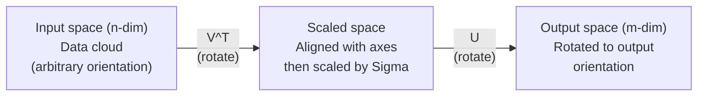
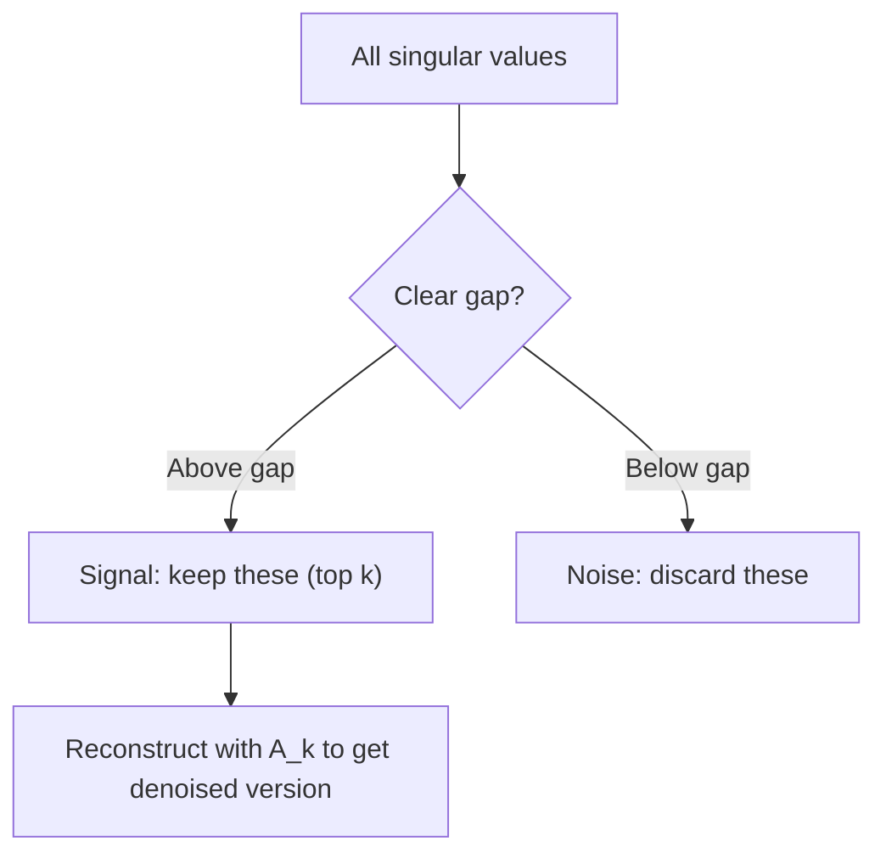

# Rozkład według wartości singularnych (SVD)

> SVD to szwajcarski scyzoryk algebry liniowej. Każda macierz go ma. Każdy data scientist go potrzebuje.

**Typ:** Build
**Języki:** Python, Julia
**Wymagania wstępne:** Faza 1, Lekcje 01 (Intuicja algebry liniowej), 02 (Operacje na wektorach i macierzach), 03 (Transformacje macierzowe)
**Czas:** ~120 minut

## Cele nauki

- Zaimplementować SVD za pomocą iteracji potęgowej i wyjaśnić geometryczne znaczenie U, Sigma i V^T
- Zastosować obciętą (truncated) SVD do kompresji obrazów i zmierzyć stosunek kompresji do błędu rekonstrukcji
- Obliczyć pseudoodwrotność Moore'a-Penrose'a za pomocą SVD, aby rozwiązać przeokreślone (overdetermined) układy najmniejszych kwadratów
- Połączyć SVD z PCA, systemami rekomendacji (czynniki latentne) i analizą semantyki ukrytej (Latent Semantic Analysis) w NLP

## Problem

Masz macierz 1000x2000. Może to być tabela ocen użytkownik-film. Może to być tabela częstotliwości słów w dokumentach. Może to być wartości pikseli obrazu. Musisz ją skompresować, odszumić, znaleźć w niej skrytą strukturę albo rozwiązać za jej pomocą układ najmniejszych kwadratów. Dekompozycja na wartości własne (eigendecomposition) działa tylko dla macierzy kwadratowych. Nawet wtedy wymaga, by macierz miała pełny zestaw liniowo niezależnych wektorów własnych.

SVD działa dla każdej macierzy. Niezależnie od kształtu. Niezależnie od rzędu. Bez żadnych warunków. Rozkłada macierz na trzy czynniki, które ujawniają geometrię tego, co macierz robi z przestrzenią. To najbardziej ogólna i najbardziej użyteczna faktoryzacja w całej algebrze liniowej.

## Koncepcja

### Co SVD robi geometrycznie

Każda macierz, niezależnie od kształtu, wykonuje trzy operacje po sobie: obrót, skalowanie, obrót. SVD ujawnia ten rozkład w sposób jawny.

```
A = U * Sigma * V^T

      m x n     m x m    m x n    n x n
     (any)    (rotate)  (scale)  (rotate)
```

Dla dowolnej macierzy A, SVD rozkłada ją na:
- V^T obraca wektory w przestrzeni wejściowej (n-wymiarowej)
- Sigma skaluje wzdłuż każdej osi (rozciąga lub ściska)
- U obraca wynik w przestrzeń wyjściową (m-wymiarową)



Pomyśl o tym tak. Podajesz SVD macierz. Mówi ci ona: "Ta macierz bierze sferę wejść, najpierw obraca ją przez V^T, następnie rozciąga ją w elipsoidę przez Sigma, a potem obraca tę elipsoidę przez U." Wartości singularne to długości osi tej elipsoidy.

### Pełny rozkład

Dla macierzy A o wymiarach m x n:

```
A = U * Sigma * V^T

where:
  U     is m x m, orthogonal (U^T U = I)
  Sigma is m x n, diagonal (singular values on the diagonal)
  V     is n x n, orthogonal (V^T V = I)

The singular values sigma_1 >= sigma_2 >= ... >= sigma_r > 0
where r = rank(A)
```

Kolumny U nazywane są lewymi wektorami singularnymi (left singular vectors). Kolumny V nazywane są prawymi wektorami singularnymi (right singular vectors). Elementy diagonalne Sigma nazywane są wartościami singularnymi (singular values). Są zawsze nieujemne i konwencjonalnie sortowane w porządku malejącym.

### Lewe wektory singularne, wartości singularne, prawe wektory singularne

Każdy element SVD ma odrębne znaczenie geometryczne.

**Prawe wektory singularne (kolumny V):** Tworzą one ortonormalną bazę przestrzeni wejściowej (R^n). Są to kierunki w przestrzeni wejściowej, które macierz odwzorowuje na ortogonalne kierunki w przestrzeni wyjściowej. Myśl o nich jako o naturalnym systemie współrzędnych dla domeny.

**Wartości singularne (przekątna Sigma):** To współczynniki skalowania. i-ta wartość singularna mówi, jak bardzo macierz rozciąga wektory wzdłuż i-tego prawego wektora singularnego. Wartość singularna równa zero oznacza, że macierz całkowicie "zgniata" ten kierunek.

**Lewe wektory singularne (kolumny U):** Tworzą one ortonormalną bazę przestrzeni wyjściowej (R^m). i-ty lewy wektor singularny to kierunek w przestrzeni wyjściowej, w który trafia (po skalowaniu) i-ty prawy wektor singularny.

Relacja między nimi:

```
A * v_i = sigma_i * u_i

The matrix A takes the i-th right singular vector v_i,
scales it by sigma_i, and maps it to the i-th left singular vector u_i.
```

To daje obraz tego, co dowolna macierz robi, współrzędna po współrzędnej.

### Forma iloczynu zewnętrznego (outer product)

SVD można zapisać jako sumę macierzy rzędu 1:

```
A = sigma_1 * u_1 * v_1^T + sigma_2 * u_2 * v_2^T + ... + sigma_r * u_r * v_r^T

Each term sigma_i * u_i * v_i^T is a rank-1 matrix (an outer product).
The full matrix is the sum of r such matrices, where r is the rank.
```

Ta forma jest podstawą aproksymacji niskiego rzędu (low-rank approximation). Każdy wyraz dodaje jedną warstwę struktury. Pierwszy wyraz uchwyca najważniejszy wzorzec. Drugi uchwyca następny najważniejszy. I tak dalej. Obcięcie tej sumy daje najlepszą możliwą aproksymację dla danego rzędu.

```
Rank-1 approx:    A_1 = sigma_1 * u_1 * v_1^T
                  (captures the dominant pattern)

Rank-2 approx:    A_2 = sigma_1 * u_1 * v_1^T + sigma_2 * u_2 * v_2^T
                  (captures the two most important patterns)

Rank-k approx:    A_k = sum of top k terms
                  (optimal by the Eckart-Young theorem)
```

### Związek z dekompozycją na wartości własne

SVD i dekompozycja na wartości własne (eigendecomposition) są ze sobą głęboko powiązane. Wartości singularne i wektory singularne A pochodzą bezpośrednio z wartości własnych i wektorów własnych A^T A oraz A A^T.

```
A^T A = V * Sigma^T * U^T * U * Sigma * V^T
      = V * Sigma^T * Sigma * V^T
      = V * D * V^T

where D = Sigma^T * Sigma is a diagonal matrix with sigma_i^2 on the diagonal.

So:
- The right singular vectors (V) are eigenvectors of A^T A
- The singular values squared (sigma_i^2) are eigenvalues of A^T A

Similarly:
A A^T = U * Sigma * V^T * V * Sigma^T * U^T
      = U * Sigma * Sigma^T * U^T

So:
- The left singular vectors (U) are eigenvectors of A A^T
- The eigenvalues of A A^T are also sigma_i^2
```

Ten związek mówi nam trzy rzeczy:
1. Wartości singularne są zawsze rzeczywiste i nieujemne (są pierwiastkami kwadratowymi wartości własnych macierzy dodatnio semi-określonej).
2. Można by obliczyć SVD przez dekompozycję na wartości własne A^T A, ale to podnosi wskaźnik uwarunkowania (condition number) do kwadratu i powoduje utratę precyzji numerycznej. Dedykowane algorytmy SVD tego unikają.
3. Gdy A jest kwadratowa i symetryczna dodatnio semi-określona, SVD i dekompozycja na wartości własne to to samo.

### Obcięta SVD: aproksymacja niskiego rzędu

Teorem Eckarta-Younga-Mirsky'ego stwierdza, że najlepsza aproksymacja rzędu k dla A (zarówno w normie Frobeniusa, jak i normie spektralnej) jest otrzymywana przez zachowanie tylko top k wartości singularnych i ich odpowiadających wektorów:

```
A_k = U_k * Sigma_k * V_k^T

where:
  U_k     is m x k  (first k columns of U)
  Sigma_k is k x k  (top-left k x k block of Sigma)
  V_k     is n x k  (first k columns of V)

Approximation error = sigma_{k+1}  (in spectral norm)
                    = sqrt(sigma_{k+1}^2 + ... + sigma_r^2)  (in Frobenius norm)
```

To nie jest tylko "dobra" aproksymacja. To dowodliwie najlepsza możliwa aproksymacja rzędu k. Żadna inna macierz rzędu k nie jest bliżej A.

| Komponent | Względna wielkość | Zachowany w aproksymacji rzędu 3? |
|-----------|-------------------|------------------------|
| sigma_1 | Największa | Tak |
| sigma_2 | Duża | Tak |
| sigma_3 | Średnio-duża | Tak |
| sigma_4 | Średnia | Nie (błąd) |
| sigma_5 | Średnio-mała | Nie (błąd) |
| sigma_6 | Mała | Nie (błąd) |
| sigma_7 | Bardzo mała | Nie (błąd) |
| sigma_8 | Znikoma | Nie (błąd) |

Zachowanie top 3: A_3 uchwytuje trzy największe wartości singularne. Błąd = pozostałe wartości (sigma_4 do sigma_8).

Jeśli wartości singularne zanikają szybko, mała wartość k uchwytuje większość macierzy. Jeśli zanikają wolno, macierz nie ma struktury niskiego rzędu.

### Kompresja obrazów za pomocą SVD

Obraz w skali szarości to macierz intensywności pikseli. Obraz 800x600 ma 480 000 wartości. SVD pozwala go przybliżyć przy użyciu znacznie mniejszej liczby wartości.

```
Original image: 800 x 600 = 480,000 values

SVD with rank k:
  U_k:      800 x k values
  Sigma_k:  k values
  V_k:      600 x k values
  Total:    k * (800 + 600 + 1) = k * 1401 values

  k=10:   14,010 values   (2.9% of original)
  k=50:   70,050 values  (14.6% of original)
  k=100: 140,100 values  (29.2% of original)

  The compression ratio improves as k gets smaller,
  but visual quality degrades.
```

Kluczowa obserwacja: naturalne obrazy mają szybko zanikające wartości singularne. Pierwsze kilka wartości singularnych uchwytuje ogólną strukturę (kształty, gradienty). Późniejsze uchwytują drobne detale i szum. Obcięcie do rzędu 50 często daje obraz, który wydaje się prawie identyczny do oryginału, zużywając przy tym 85% mniej pamięci.

### SVD w systemach rekomendacji

Nagroda Netflixa (Netflix Prize) uczyniła to znanym. Masz macierz ocen użytkownik-film, w której większość wpisów jest brakujących.

```
             Movie1  Movie2  Movie3  Movie4  Movie5
  User1      [  5      ?       3       ?       1  ]
  User2      [  ?      4       ?       2       ?  ]
  User3      [  3      ?       5       ?       ?  ]
  User4      [  ?      ?       ?       4       3  ]

  ? = unknown rating
```

Idea: ta macierz ocen ma niski rząd. Użytkownicy nie mają całkowicie niezależnych gustów. Istnieje kilka czynników latentnych (akcja vs. dramat, stare vs. nowe, intelektualne vs. emocjonalne), które wyjaśniają większość preferencji.

SVD na (wypełnionej) macierzy ocen rozkłada ją na:
- U: profile użytkowników w przestrzeni czynników latentnych
- Sigma: ważność każdego czynnika latentnego
- V^T: profile filmów w przestrzeni czynników latentnych

Przewidywana ocena użytkownika dla filmu to iloczyn skalarny profilu użytkownika z profilem filmu (ważony wartościami singularnymi). Aproksymacja niskiego rzędu wypełnia brakujące wpisy.

W praktyce używa się wariantów takich jak inkrementalna SVD Simona Funka czy ALS (alternating least squares), które obsługują brakujące dane bezpośrednio. Ale podstawowa idea jest taka sama: dekompozycja na czynniki latentne za pomocą SVD.

### SVD w NLP: Analiza Semantyki Ukrytej

Analiza Semantyki Ukrytej (Latent Semantic Analysis, LSA), znana też jako Latent Semantic Indexing (LSI), stosuje SVD do macierzy term-dokument.

```
             Doc1   Doc2   Doc3   Doc4
  "cat"      [  3      0      1      0  ]
  "dog"      [  2      0      0      1  ]
  "fish"     [  0      4      1      0  ]
  "pet"      [  1      1      1      1  ]
  "ocean"    [  0      3      0      0  ]

After SVD with rank k=2:

  Each document becomes a point in 2D "concept space."
  Each term becomes a point in the same 2D space.
  Documents about similar topics cluster together.
  Terms with similar meanings cluster together.

  "cat" and "dog" end up near each other (land pets).
  "fish" and "ocean" end up near each other (water concepts).
  Doc1 and Doc3 cluster if they share similar topics.
```

LSA była jedną z pierwszych skutecznych metod uchwycenia podobieństwa semantycznego z surowego tekstu. Działa, ponieważ synonimiczne terminy mają tendencję do występowania w podobnych dokumentach, więc SVD grupuje je w te same wymiary latentne. Współczesne embeddingi słów (Word2Vec, GloVe) można uznać za potomków tej idei.

### SVD do redukcji szumu

Dane z szumem mają sygnał skoncentrowany w górnych wartościach singularnych, a szum rozłożony na wszystkie wartości singularne. Obcięcie usuwa poziom szumu.

**Wartości singularne czystego sygnału:**

| Komponent | Wielkość | Typ |
|-----------|-----------|------|
| sigma_1 | Bardzo duża | Sygnał |
| sigma_2 | Duża | Sygnał |
| sigma_3 | Średnia | Sygnał |
| sigma_4 | Bliska zeru | Pomijalna |
| sigma_5 | Bliska zeru | Pomijalna |

**Wartości singularne sygnału z szumem (szum dodaje się do wszystkich):**

| Komponent | Wielkość | Typ |
|-----------|-----------|------|
| sigma_1 | Bardzo duża | Sygnał |
| sigma_2 | Duża | Sygnał |
| sigma_3 | Średnia | Sygnał |
| sigma_4 | Mała | Szum |
| sigma_5 | Mała | Szum |
| sigma_6 | Mała | Szum |
| sigma_7 | Mała | Szum |



Jest to wykorzystywane w przetwarzaniu sygnałów, pomiarach naukowych i czyszczeniu danych. Zawsze, gdy masz macierz zniekształconą przez szum addytywny, obcięta SVD jest zasadną metodą rozdzielenia sygnału od szumu.

### Pseudoodwrotność za pomocą SVD

Pseudoodwrotność Moore'a-Penrose'a A+ generalizuje odwracanie macierzy na macierze nie-kwadratowe i singularne. SVD czyni jej obliczenie trywialnym.

```
If A = U * Sigma * V^T, then:

A+ = V * Sigma+ * U^T

where Sigma+ is formed by:
  1. Transpose Sigma (swap rows and columns)
  2. Replace each non-zero diagonal entry sigma_i with 1/sigma_i
  3. Leave zeros as zeros

For A (m x n):      A+ is (n x m)
For Sigma (m x n):  Sigma+ is (n x m)
```

Pseudoodwrotność rozwiązuje problemy najmniejszych kwadratów. Jeśli Ax = b nie ma rozwiązania dokładnego (układ przeokreślony), to x = A+ b jest rozwiązaniem najmniejszych kwadratów (minimalizuje ||Ax - b||).

```
Overdetermined system (more equations than unknowns):

  [1  1]         [3]
  [2  1] x   =   [5]       No exact solution exists.
  [3  1]         [6]

  x_ls = A+ b = V * Sigma+ * U^T * b

  This gives the x that minimizes the sum of squared residuals.
  Same result as the normal equations (A^T A)^(-1) A^T b,
  but numerically more stable.
```

### Zalety dla stabilności numerycznej

Obliczenie dekompozycji na wartości własne A^T A podnosi wartości singularne do kwadratu (wartości własne A^T A to sigma_i^2). To podnosi wskaźnik uwarunkowania (condition number) do kwadratu, wzmacniając błędy numeryczne.

```
Example:
  A has singular values [1000, 1, 0.001]
  Condition number of A: 1000 / 0.001 = 10^6

  A^T A has eigenvalues [10^6, 1, 10^{-6}]
  Condition number of A^T A: 10^6 / 10^{-6} = 10^{12}

  Computing SVD directly: works with condition number 10^6
  Computing via A^T A:     works with condition number 10^{12}
                           (6 extra digits of precision lost)
```

Współczesne algorytmy SVD (bidiagonalizacja Goluba-Kahana) działają bezpośrednio na A, nigdy nie tworząc A^T A. To dlatego zawsze powinno się preferować `np.linalg.svd(A)` nad `np.linalg.eig(A.T @ A)`.

### Związek z PCA

PCA JEST SVD na danych wycentrowanych. To nie jest analogia. To dosłownie ten sam obliczenie.

```
Given data matrix X (n_samples x n_features), centered (mean subtracted):

Covariance matrix: C = (1/(n-1)) * X^T X

PCA finds eigenvectors of C. But:

  X = U * Sigma * V^T    (SVD of X)

  X^T X = V * Sigma^2 * V^T

  C = (1/(n-1)) * V * Sigma^2 * V^T

So the principal components are exactly the right singular vectors V.
The explained variance for each component is sigma_i^2 / (n-1).

In sklearn, PCA is implemented using SVD, not eigendecomposition.
It is faster and more numerically stable.
```

To oznacza, że wszystko, czego nauczyłeś się o redukcji wymiarowości w Lekcji 10, to SVD pod maską. PCA jest najczęstszym zastosowaniem SVD w uczeniu maszynowym.

## Zbuduj to

### Krok 1: SVD od podstaw za pomocą iteracji potęgowej

Idea: aby znaleźć największą wartość singularną i jej wektory, użyj iteracji potęgowej (power iteration) na A^T A (lub A A^T). Następnie zdeflacjonuj macierz i powtórz dla następnej wartości singularnej.

```python
import numpy as np

def power_iteration(M, num_iters=100):
    n = M.shape[1]
    v = np.random.randn(n)
    v = v / np.linalg.norm(v)

    for _ in range(num_iters):
        Mv = M @ v
        v = Mv / np.linalg.norm(Mv)

    eigenvalue = v @ M @ v
    return eigenvalue, v

def svd_from_scratch(A, k=None):
    m, n = A.shape
    if k is None:
        k = min(m, n)

    sigmas = []
    us = []
    vs = []

    A_residual = A.copy().astype(float)

    for _ in range(k):
        AtA = A_residual.T @ A_residual
        eigenvalue, v = power_iteration(AtA, num_iters=200)

        if eigenvalue < 1e-10:
            break

        sigma = np.sqrt(eigenvalue)
        u = A_residual @ v / sigma

        sigmas.append(sigma)
        us.append(u)
        vs.append(v)

        A_residual = A_residual - sigma * np.outer(u, v)

    U = np.column_stack(us) if us else np.empty((m, 0))
    S = np.array(sigmas)
    V = np.column_stack(vs) if vs else np.empty((n, 0))

    return U, S, V
```

### Krok 2: Test i porównanie z NumPy

```python
np.random.seed(42)
A = np.random.randn(5, 4)

U_ours, S_ours, V_ours = svd_from_scratch(A)
U_np, S_np, Vt_np = np.linalg.svd(A, full_matrices=False)

print("Our singular values:", np.round(S_ours, 4))
print("NumPy singular values:", np.round(S_np, 4))

A_reconstructed = U_ours @ np.diag(S_ours) @ V_ours.T
print(f"Reconstruction error: {np.linalg.norm(A - A_reconstructed):.8f}")
```

### Krok 3: Demonstracja kompresji obrazu

```python
def compress_image_svd(image_matrix, k):
    U, S, Vt = np.linalg.svd(image_matrix, full_matrices=False)
    compressed = U[:, :k] @ np.diag(S[:k]) @ Vt[:k, :]
    return compressed

image = np.random.seed(42)
rows, cols = 200, 300
image = np.random.randn(rows, cols)

for k in [1, 5, 10, 20, 50]:
    compressed = compress_image_svd(image, k)
    error = np.linalg.norm(image - compressed) / np.linalg.norm(image)
    original_size = rows * cols
    compressed_size = k * (rows + cols + 1)
    ratio = compressed_size / original_size
    print(f"k={k:>3d}  error={error:.4f}  storage={ratio:.1%}")
```

### Krok 4: Redukcja szumu

```python
np.random.seed(42)
clean = np.outer(np.sin(np.linspace(0, 4*np.pi, 100)),
                 np.cos(np.linspace(0, 2*np.pi, 80)))
noise = 0.3 * np.random.randn(100, 80)
noisy = clean + noise

U, S, Vt = np.linalg.svd(noisy, full_matrices=False)
denoised = U[:, :5] @ np.diag(S[:5]) @ Vt[:5, :]

print(f"Noisy error:    {np.linalg.norm(noisy - clean):.4f}")
print(f"Denoised error: {np.linalg.norm(denoised - clean):.4f}")
print(f"Improvement:    {(1 - np.linalg.norm(denoised - clean) / np.linalg.norm(noisy - clean)):.1%}")
```

### Krok 5: Pseudoodwrotność

```python
A = np.array([[1, 1], [2, 1], [3, 1]], dtype=float)
b = np.array([3, 5, 6], dtype=float)

U, S, Vt = np.linalg.svd(A, full_matrices=False)
S_inv = np.diag(1.0 / S)
A_pinv = Vt.T @ S_inv @ U.T

x_svd = A_pinv @ b
x_lstsq = np.linalg.lstsq(A, b, rcond=None)[0]
x_pinv = np.linalg.pinv(A) @ b

print(f"SVD pseudoinverse solution:  {x_svd}")
print(f"np.linalg.lstsq solution:   {x_lstsq}")
print(f"np.linalg.pinv solution:    {x_pinv}")
```

## Wykorzystaj to

Pełne, działające demonstracje znajdują się w `code/svd.py`. Uruchom go, aby zobaczyć SVD zastosowane do kompresji obrazów, systemów rekomendacji, analizy semantyki ukrytej i redukcji szumu.

```bash
python svd.py
```

Wersja w Julii w `code/svd.jl` demonstruje te same koncepcje, używając natywnej funkcji `svd()` Julii i pakietu `LinearAlgebra`.

```bash
julia svd.jl
```

## Wypchnij to (Ship It)

Ta lekcja produkuje:
- `outputs/skill-svd.md` - umiejętność wiedzy, kiedy i jak stosować SVD w prawdziwych projektach

## Ćwiczenia

1. Zaimplementuj pełną SVD od podstaw bez użycia iteracji potęgowej. Zamiast tego oblicz dekompozycję na wartości własne A^T A, aby uzyskać V i wartości singularne, a następnie obliczyć U = A V Sigma^{-1}. Porównaj dokładność numeryczną z wersją wykorzystującą iterację potęgową oraz z NumPy.

2. Wczytaj prawdziwy obraz w skali szarości (lub przekonwertuj jakiś na skalę szarości). Skompresuj go z rzędami 1, 5, 10, 25, 50, 100. Dla każdego rzędu obliczyć stosunek kompresji i błąd względny. Znajdź rząd, przy którym obraz staje się wizualnie akceptowalny.

3. Zbuduj mały system rekomendacji. Stwórz macierz ocen użytkownik-film 10x8 z pewnymi znanymi wpisami. Wypełnij brakujące wpisy średnimi wierszy. Obliczyć SVD i zrekonstruować aproksymację rzędu 3. Wykorzystaj zrekonstruowaną macierz do przewidzenia brakujących ocen. Sprawdź, czy przewidywania są rozsądne.

4. Stwórz macierz term-dokument 100x50 z 3 syntetycznymi tematami. Każdy temat ma 5 powiązanych terminów. Dodaj szum. Zastosuj SVD i sprawdź, czy 3 górne wartości singularne są znacznie większe od reszty. Zrzutuj dokumenty do 3-wymiarowej przestrzeni latentnej i sprawdź, czy dokumenty z tego samego tematu się skupiają.

5. Wygeneruj czystą macierz niskiego rzędu (rząd 3, rozmiar 50x40) i dodaj szum Gaussa na różnych poziomach (sigma = 0.1, 0.5, 1.0, 2.0). Dla każdego poziomu szumu znajdź optymalny rząd obcięcia, przeszukując k od 1 do 40 i mierząc błąd rekonstrukcji względem czystej macierzy. Wykreśl, jak optymalne k zmienia się z poziomem szumu.

## Kluczowe terminy

| Termin | Co się mówi | Co to faktycznie oznacza |
|------|----------------|----------------------|
| SVD | "Faktoryzuj dowolną macierz" | Rozłóż A na U Sigma V^T, gdzie U i V są ortogonalne, a Sigma jest diagonalna z nieujemnymi wpisami. Działa dla dowolnej macierzy o dowolnym kształcie. |
| Wartość singularna | "Jak ważny jest ten komponent" | i-ty element diagonalny Sigma. Mierzy, jak bardzo macierz rozciąga wzdłuż i-tego głównego kierunku. Zawsze nieujemna, sortowana w porządku malejącym. |
| Lewy wektor singularny | "Kierunek wyjściowy" | Kolumna U. Kierunek w przestrzeni wyjściowej, na który mapuje się i-ty prawy wektor singularny (po skalowaniu przez sigma_i). |
| Prawy wektor singularny | "Kierunek wejściowy" | Kolumna V. Kierunek w przestrzeni wejściowej, który macierz mapuje na i-ty lewy wektor singularny (po skalowaniu przez sigma_i). |
| Obcięta SVD | "Aproksymacja niskiego rzędu" | Zachowaj tylko top k wartości singularnych i ich wektorów. Daje dowodliwie najlepszą aproksymację rzędu k oryginalnej macierzy (teorem Eckarta-Younga). |
| Rząd (rank) | "Prawdziwa wymiarowość" | Liczba niezerowych wartości singularnych. Mówi, ile niezależnych kierunków macierz faktycznie wykorzystuje. |
| Pseudoodwrotność | "Generalizowana odwrotność" | V Sigma+ U^T. Odwraca niezerowe wartości singularne, zera pozostają zerami. Rozwiązuje problemy najmniejszych kwadratów dla macierzy nie-kwadratowych lub singularnych. |
| Wskaźnik uwarunkowania (condition number) | "Jak wrażliwa na błędy" | sigma_max / sigma_min. Duży wskaźnik uwarunkowania oznacza, że małe zmiany wejścia powodują duże zmiany wyjścia. SVD ujawnia to bezpośrednio. |
| Czynnik latentny | "Zmienna ukryta" | Wymiar w przestrzeni niskiego rzędu odkryty przez SVD. W rekomendacjach czynnik latentny może odpowiadać preferencjom gatunkowym. W NLP może odpowiadać tematowi. |
| Norma Frobeniusa | "Całkowity rozmiar macierzy" | Pierwiastek kwadratowy z sumy kwadratów wpisów. Równa pierwiastkowi kwadratowemu z sumy kwadratów wartości singularnych. Używana do mierzenia błędu aproksymacji. |
| Teorem Eckarta-Younga | "SVD daje najlepszą kompresję" | Dla dowolnego docelowego rzędu k, obcięta SVD minimalizuje błąd aproksymacji wśród wszystkich możliwych macierzy rzędu k. |
| Iteracja potęgowa (power iteration) | "Znajdź największy wektor własny" | Powtarzalne mnożenie losowego wektora przez macierz i normalizacja. Zbiega do wektora własnego z największą wartością własną. Podstawowy element wielu algorytmów SVD. |

## Dalsze materiały

- [Gilbert Strang: Linear Algebra and Its Applications, Chapter 7](https://math.mit.edu/~gs/linearalgebra/) - dokładne omówienie SVD wraz z zastosowaniami
- [3Blue1Brown: But what is the SVD?](https://www.youtube.com/watch?v=vSczTbgc8Rc) - geometryczna intuicja dla SVD
- [We Recommend a Singular Value Decomposition](https://www.ams.org/publicoutreach/feature-column/fcarc-svd) - przystępny przegląd od American Mathematical Society
- [Netflix Prize and Matrix Factorization](https://sifter.org/~simon/journal/20061211.html) - oryginalny wpis na blogu Simona Funka o SVD dla rekomendacji
- [Latent Semantic Analysis](https://en.wikipedia.org/wiki/Latent_semantic_analysis) - oryginalne zastosowanie SVD w NLP
- [Numerical Linear Algebra by Trefethen and Bau](https://people.maths.ox.ac.uk/trefethen/text.html) - złoty standard dla zrozumienia algorytmów SVD i ich właściwości numerycznych
