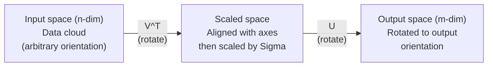
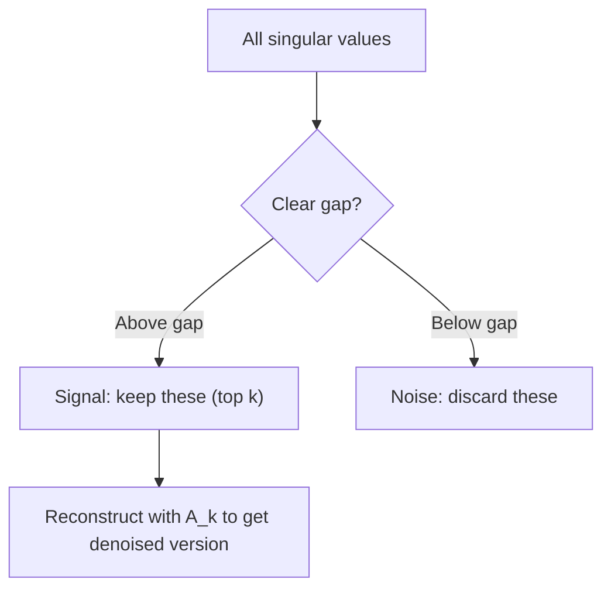

# Rozkład wartości osobliwych

> SVD to szwajcarski scyzoryk algebry liniowej. Każda matryca ma taką. Każdy analityk danych go potrzebuje.

**Typ:** Kompilacja
**Języki:** Python, Julia
**Wymagania wstępne:** Faza 1, Lekcje 01 (Intuicja algebry liniowej), 02 (Operacje na wektorach i macierzach), 03 (Przekształcenia na macierzach)
**Czas:** ~120 minut

## Cele nauczania

- Zaimplementuj SVD poprzez iterację potęgową i wyjaśnij geometryczne znaczenie U, Sigma i V^T
- Zastosuj obcięty SVD do kompresji obrazu i zmierz współczynnik kompresji w funkcji błędu rekonstrukcji
- Oblicz pseudoodwrotność Moore'a-Penrose'a za pomocą SVD, aby rozwiązać nadokreślone systemy najmniejszych kwadratów
- Połącz SVD z PCA, systemami rekomendacji (czynniki ukryte) i ukrytą analizą semantyczną w NLP

## Problem

Masz matrycę 1000x2000. Być może chodzi o oceny filmów użytkowników. Być może jest to tabela częstotliwości terminów dokumentu. Być może chodzi o wartości pikseli obrazu. Trzeba to skompresować, odszumić, znaleźć w nim ukrytą strukturę lub rozwiązać za jego pomocą system najmniejszych kwadratów. Rozkład własny działa tylko na macierzach kwadratowych. Nawet wtedy wymaga to, aby macierz miała pełny zestaw liniowo niezależnych wektorów własnych.

SVD działa na dowolnej matrycy. Dowolny kształt. Dowolna ranga. Żadnych warunków. Rozkłada matrycę na trzy czynniki, które ujawniają geometrię tego, co matryca robi z przestrzenią. Jest to najbardziej ogólna i najbardziej użyteczna faktoryzacja w całej algebrze liniowej.

## Koncepcja

### Co SVD robi geometrycznie

Każda matryca, niezależnie od kształtu, wykonuje kolejno trzy operacje: obrót, skalowanie, obrót. SVD czyni ten rozkład wyraźnym.

```
A = U * Sigma * V^T

      m x n     m x m    m x n    n x n
     (any)    (rotate)  (scale)  (rotate)
```

Biorąc pod uwagę dowolną macierz A, SVD rozkłada ją na:
- V^T obraca wektory w przestrzeni wejściowej (n-wymiarowo)
- Sigma skaluje się wzdłuż każdej osi (rozciąga się lub kompresuje)
- U obraca wynik do przestrzeni wyjściowej (m-wymiarowej)



Pomyśl o tym w ten sposób. Podajesz SVD matrycę. Mówi ci: „Ta macierz pobiera kulę danych wejściowych, najpierw obraca ją o V^T, następnie rozciąga ją w elipsoidę za pomocą Sigmy, a następnie obraca elipsoidę o U”. Wartości osobliwe to długości osi elipsoidy.

### Pełny rozkład

Dla macierzy A o kształcie m x n:

```
A = U * Sigma * V^T

where:
  U     is m x m, orthogonal (U^T U = I)
  Sigma is m x n, diagonal (singular values on the diagonal)
  V     is n x n, orthogonal (V^T V = I)

The singular values sigma_1 >= sigma_2 >= ... >= sigma_r > 0
where r = rank(A)
```

Kolumny U nazywane są lewymi wektorami osobliwymi. Kolumny V nazywane są prawymi wektorami osobliwymi. Ukośne wpisy Sigmy nazywane są wartościami osobliwymi. Są one zawsze nieujemne i konwencjonalnie posortowane w kolejności malejącej.

### Lewe wektory osobliwe, wartości osobliwe, prawe wektory osobliwe

Każdy element SVD ma odrębne znaczenie geometryczne.

**Prawe wektory osobliwe (kolumny V):** Tworzą one bazę ortonormalną przestrzeni wejściowej (R^n). Są to kierunki w przestrzeni wejściowej, które macierz odwzorowuje na kierunki ortogonalne w przestrzeni wyjściowej. Pomyśl o nich jak o naturalnym układzie współrzędnych domeny.

**Wartości pojedyncze (przekątna Sigma):** Są to współczynniki skalujące. I-ta wartość osobliwa informuje, jak bardzo macierz rozciąga wektory wzdłuż i-tego prawego wektora osobliwego. Pojedyncza wartość zero oznacza, że ​​macierz całkowicie niszczy ten kierunek.

**Lewe wektory osobliwe (kolumny U):** Stanowią one bazę ortonormalną przestrzeni wyjściowej (R^m). I-ty lewy wektor osobliwy jest kierunkiem w przestrzeni wyjściowej, w którym ląduje i-ty prawy wektor osobliwy (po skalowaniu).

Relacja między nimi:

```
A * v_i = sigma_i * u_i

The matrix A takes the i-th right singular vector v_i,
scales it by sigma_i, and maps it to the i-th left singular vector u_i.
```

Daje to obraz współrzędnych po współrzędnych działania dowolnej macierzy.

### Zewnętrzna forma produktu

SVD można zapisać jako sumę macierzy rangi 1:

```
A = sigma_1 * u_1 * v_1^T + sigma_2 * u_2 * v_2^T + ... + sigma_r * u_r * v_r^T

Each term sigma_i * u_i * v_i^T is a rank-1 matrix (an outer product).
The full matrix is the sum of r such matrices, where r is the rank.
```

Ta forma jest podstawą przybliżenia niskiego stopnia. Każdy termin dodaje jedną warstwę struktury. Pierwszy termin oddaje pojedynczy, najważniejszy wzór. Drugi zawiera następny najważniejszy. I tak dalej. Obcięcie tej sumy daje najlepsze możliwe przybliżenie dla dowolnej rangi.

```
Rank-1 approx:    A_1 = sigma_1 * u_1 * v_1^T
                  (captures the dominant pattern)

Rank-2 approx:    A_2 = sigma_1 * u_1 * v_1^T + sigma_2 * u_2 * v_2^T
                  (captures the two most important patterns)

Rank-k approx:    A_k = sum of top k terms
                  (optimal by the Eckart-Young theorem)
```

### Związek z rozkładem własnym

SVD i rozkład własny są ze sobą głęboko powiązane. Wartości osobliwe i wektory A pochodzą bezpośrednio z wartości własnych i wektorów własnych A^T A i A A^T.

```
A^T A = V * Sigma^T * U^T * U * Sigma * V^T
      = V * Sigma^T * Sigma * V^T
      = V * D * V^T

where D = Sigma^T * Sigma is a diagonal matrix with sigma_i^2 on the diagonal.

So:
- The right singular vectors (V) are eigenvectors of A^T A
- The singular values squared (sigma_i^2) are eigenvalues of A^T A

Similarly:
A A^T = U * Sigma * V^T * V * Sigma^T * U^T
      = U * Sigma * Sigma^T * U^T

So:
- The left singular vectors (U) are eigenvectors of A A^T
- The eigenvalues of A A^T are also sigma_i^2
```

To połączenie mówi ci trzy rzeczy:
1. Wartości osobliwe są zawsze rzeczywiste i nieujemne (są pierwiastkami kwadratowymi wartości własnych dodatniej macierzy półokreślonej).
2. Można obliczyć SVD poprzez rozkład własny A^T A, ale to podnosi liczbę warunku do kwadratu i traci precyzję numeryczną. Dedykowane algorytmy SVD pozwalają tego uniknąć.
3. Gdy A jest kwadratowe i symetryczne dodatnio półokreślone, SVD i rozkład własny to to samo.

### Obcięty SVD: przybliżenie niskiej rangi

Twierdzenie Eckarta-Younga-Mirsky'ego stwierdza, że najlepsze przybliżenie stopnia k do A (zarówno w Frobeniusie, jak i normie widmowej) uzyskuje się zachowując tylko górne wartości osobliwe k i odpowiadające im wektory:

```
A_k = U_k * Sigma_k * V_k^T

where:
  U_k     is m x k  (first k columns of U)
  Sigma_k is k x k  (top-left k x k block of Sigma)
  V_k     is n x k  (first k columns of V)

Approximation error = sigma_{k+1}  (in spectral norm)
                    = sqrt(sigma_{k+1}^2 + ... + sigma_r^2)  (in Frobenius norm)
```

To nie jest tylko „dobre” przybliżenie. Jest to prawdopodobnie najlepsze możliwe przybliżenie rangi k. Żadna inna macierz rangi k nie jest bliższa A.

| Składnik | Wielkość względna | Utrzymany w przybliżeniu w randze 3? |
|----------|----------------------|--------------------------------|
| sigma_1 | Największy | Tak |
| sigma_2 | Duży | Tak |
| sigma_3 | Średnio duży | Tak |
| sigma_4 | Średni | Nie (błąd) |
| sigma_5 | Średnio-mały | Nie (błąd) |
| sigma_6 | Mały | Nie (błąd) |
| sigma_7 | Bardzo mały | Nie (błąd) |
| sigma_8 | Mały | Nie (błąd) |

Zachowaj górne 3: A_3 przechwytuje trzy największe wartości osobliwe. Błąd = pozostałe wartości (sigma_4 do sigma_8).

Jeśli wartości osobliwe szybko zanikają, małe k obejmuje większość macierzy. Jeśli zanikają powoli, matryca nie ma struktury niskiego rzędu.

### Kompresja obrazu za pomocą SVD

Obraz w skali szarości jest matrycą intensywności pikseli. Obraz o wymiarach 800 x 600 ma 480 000 wartości. SVD pozwala przybliżyć to za pomocą znacznie mniejszej liczby.

```
Original image: 800 x 600 = 480,000 values

SVD with rank k:
  U_k:      800 x k values
  Sigma_k:  k values
  V_k:      600 x k values
  Total:    k * (800 + 600 + 1) = k * 1401 values

  k=10:   14,010 values   (2.9% of original)
  k=50:   70,050 values  (14.6% of original)
  k=100: 140,100 values  (29.2% of original)

  The compression ratio improves as k gets smaller,
  but visual quality degrades.
```

Kluczowy spostrzeżenie: naturalne obrazy mają szybko zanikające wartości osobliwe. Kilka pierwszych wartości osobliwych odzwierciedla szeroką strukturę (kształty, gradienty). Te późniejsze rejestrują drobne szczegóły i szumy. Obcięcie na poziomie 50 często daje obraz, który wygląda prawie identycznie jak oryginał, zużywając przy tym o 85% mniej miejsca.

### SVD dla systemów rekomendacji

Nagroda Netflix rozsławiła ten film. Masz tabelę ocen filmów użytkowników, w której brakuje większości wpisów.

```
             Movie1  Movie2  Movie3  Movie4  Movie5
  User1      [  5      ?       3       ?       1  ]
  User2      [  ?      4       ?       2       ?  ]
  User3      [  3      ?       5       ?       ?  ]
  User4      [  ?      ?       ?       4       3  ]

  ? = unknown rating
```

Pomysł: ta matryca ocen ma niską rangę. Użytkownicy nie mają całkowicie niezależnych gustów. Istnieje kilka ukrytych czynników (akcja czy dramat, stare czy nowe, intelektualne czy instynktowne), które wyjaśniają większość preferencji.

SVD na (wypełnionej) macierzy ocen rozkłada ją na:
- U: profile użytkowników w przestrzeni czynników ukrytych
- Sigma: znaczenie każdego ukrytego czynnika
- V^T: profile filmowe w przestrzeni czynników ukrytych

Przewidywana ocena filmu przez użytkownika to iloczyn skalarny jego profilu użytkownika z profilem filmu (ważony wartościami osobliwymi). Przybliżenie niskiego rzędu uzupełnia brakujące wpisy.

W praktyce stosuje się warianty takie jak przyrostowy SVD Simona Funka lub ALS (naprzemienne metody najmniejszych kwadratów), które bezpośrednio obsługują brakujące dane. Ale podstawowa idea jest taka sama: rozkład czynników ukrytych za pomocą SVD.

### SVD w NLP: ukryta analiza semantyczna

Ukryta analiza semantyczna (LSA), zwana także ukrytym indeksowaniem semantycznym (LSI), stosuje SVD do macierzy termin-dokument.

```
             Doc1   Doc2   Doc3   Doc4
  "cat"      [  3      0      1      0  ]
  "dog"      [  2      0      0      1  ]
  "fish"     [  0      4      1      0  ]
  "pet"      [  1      1      1      1  ]
  "ocean"    [  0      3      0      0  ]

After SVD with rank k=2:

  Each document becomes a point in 2D "concept space."
  Each term becomes a point in the same 2D space.
  Documents about similar topics cluster together.
  Terms with similar meanings cluster together.

  "cat" and "dog" end up near each other (land pets).
  "fish" and "ocean" end up near each other (water concepts).
  Doc1 and Doc3 cluster if they share similar topics.
```

LSA była jedną z pierwszych skutecznych metod wychwytywania podobieństwa semantycznego z surowego tekstu. Działa, ponieważ terminy synonimiczne zwykle pojawiają się w podobnych dokumentach, więc SVD grupuje je w te same ukryte wymiary. Nowoczesne osadzanie słów (Word2Vec, GloVe) można postrzegać jako potomków tej idei.

### SVD do redukcji szumów

Zaszumione dane mają sygnał skoncentrowany w najwyższych wartościach osobliwych, a szum jest rozłożony na wszystkie wartości osobliwe. Obcięcie usuwa poziom szumów.

**Czyste wartości pojedyncze sygnału:**

| Składnik | Wielkość | Wpisz |
|----------|-----------|------|
| sigma_1 | Bardzo duży | Sygnał |
| sigma_2 | Duży | Sygnał |
| sigma_3 | Średni | Sygnał |
| sigma_4 | Blisko zera | Znikome |
| sigma_5 | Blisko zera | Znikome |

**Wartości pojedyncze sygnału zaszumionego (szum dodaje się do wszystkich):**

| Składnik | Wielkość | Wpisz |
|----------|-----------|------|
| sigma_1 | Bardzo duży | Sygnał |
| sigma_2 | Duży | Sygnał |
| sigma_3 | Średni | Sygnał |
| sigma_4 | Mały | Hałas |
| sigma_5 | Mały | Hałas |
| sigma_6 | Mały | Hałas |
| sigma_7 | Mały | Hałas |



Jest to wykorzystywane w przetwarzaniu sygnałów, pomiarach naukowych i czyszczeniu danych. Za każdym razem, gdy matryca jest uszkodzona przez szum addytywny, obcięty SVD jest podstawowym sposobem na oddzielenie sygnału od szumu.

### Pseudoodwrotność poprzez SVD

Pseudoodwrotność Moore’a-Penrose’a A+ uogólnia inwersję macierzy na macierze niekwadratowe i osobliwe. SVD sprawia, że ​​obliczenia są banalne.

```
If A = U * Sigma * V^T, then:

A+ = V * Sigma+ * U^T

where Sigma+ is formed by:
  1. Transpose Sigma (swap rows and columns)
  2. Replace each non-zero diagonal entry sigma_i with 1/sigma_i
  3. Leave zeros as zeros

For A (m x n):      A+ is (n x m)
For Sigma (m x n):  Sigma+ is (n x m)
```

Pseudoodwrotność rozwiązuje problemy najmniejszych kwadratów. Jeśli Ax = b nie ma rozwiązania dokładnego (układ nadokreślony), to x = A+ b jest rozwiązaniem metodą najmniejszych kwadratów (minimalizuje ||Ax - b||).

```
Overdetermined system (more equations than unknowns):

  [1  1]         [3]
  [2  1] x   =   [5]       No exact solution exists.
  [3  1]         [6]

  x_ls = A+ b = V * Sigma+ * U^T * b

  This gives the x that minimizes the sum of squared residuals.
  Same result as the normal equations (A^T A)^(-1) A^T b,
  but numerically more stable.
```

### Zalety stabilności numerycznej

Obliczanie rozkładu własnego A^T A do kwadratu wartości osobliwych (wartości własne A^T A to sigma_i^2). Podnosi to liczbę warunku do kwadratu, wzmacniając błędy numeryczne.

```
Example:
  A has singular values [1000, 1, 0.001]
  Condition number of A: 1000 / 0.001 = 10^6

  A^T A has eigenvalues [10^6, 1, 10^{-6}]
  Condition number of A^T A: 10^6 / 10^{-6} = 10^{12}

  Computing SVD directly: works with condition number 10^6
  Computing via A^T A:     works with condition number 10^{12}
                           (6 extra digits of precision lost)
```

Nowoczesne algorytmy SVD (bidiagonalizacja Goluba-Kahana) działają bezpośrednio na A, nigdy nie tworząc A^T A. Dlatego zawsze powinieneś preferować `np.linalg.svd(A)` zamiast `np.linalg.eig(A.T @ A)`.

### Połączenie z PCA

PCA IS SVD na danych wyśrodkowanych. To nie jest analogia. To dosłownie te same obliczenia.

```
Given data matrix X (n_samples x n_features), centered (mean subtracted):

Covariance matrix: C = (1/(n-1)) * X^T X

PCA finds eigenvectors of C. But:

  X = U * Sigma * V^T    (SVD of X)

  X^T X = V * Sigma^2 * V^T

  C = (1/(n-1)) * V * Sigma^2 * V^T

So the principal components are exactly the right singular vectors V.
The explained variance for each component is sigma_i^2 / (n-1).

In sklearn, PCA is implemented using SVD, not eigendecomposition.
It is faster and more numerically stable.
```

Oznacza to, że wszystko, czego nauczyłeś się o redukcji wymiarów w Lekcji 10, to pod maską SVD. PCA jest najczęstszym zastosowaniem SVD w uczeniu maszynowym.

## Zbuduj to

### Krok 1: SVD od podstaw przy użyciu iteracji mocy

Pomysł: aby znaleźć największą wartość osobliwą i jej wektory, użyj iteracji potęgowej na A^T A (lub A A^T). Następnie opróżnij matrycę i powtórz dla następnej wartości pojedynczej.

```python
import numpy as np

def power_iteration(M, num_iters=100):
    n = M.shape[1]
    v = np.random.randn(n)
    v = v / np.linalg.norm(v)

    for _ in range(num_iters):
        Mv = M @ v
        v = Mv / np.linalg.norm(Mv)

    eigenvalue = v @ M @ v
    return eigenvalue, v

def svd_from_scratch(A, k=None):
    m, n = A.shape
    if k is None:
        k = min(m, n)

    sigmas = []
    us = []
    vs = []

    A_residual = A.copy().astype(float)

    for _ in range(k):
        AtA = A_residual.T @ A_residual
        eigenvalue, v = power_iteration(AtA, num_iters=200)

        if eigenvalue < 1e-10:
            break

        sigma = np.sqrt(eigenvalue)
        u = A_residual @ v / sigma

        sigmas.append(sigma)
        us.append(u)
        vs.append(v)

        A_residual = A_residual - sigma * np.outer(u, v)

    U = np.column_stack(us) if us else np.empty((m, 0))
    S = np.array(sigmas)
    V = np.column_stack(vs) if vs else np.empty((n, 0))

    return U, S, V
```

### Krok 2: Przetestuj i porównaj z NumPy

```python
np.random.seed(42)
A = np.random.randn(5, 4)

U_ours, S_ours, V_ours = svd_from_scratch(A)
U_np, S_np, Vt_np = np.linalg.svd(A, full_matrices=False)

print("Our singular values:", np.round(S_ours, 4))
print("NumPy singular values:", np.round(S_np, 4))

A_reconstructed = U_ours @ np.diag(S_ours) @ V_ours.T
print(f"Reconstruction error: {np.linalg.norm(A - A_reconstructed):.8f}")
```

### Krok 3: Demo kompresji obrazu

```python
def compress_image_svd(image_matrix, k):
    U, S, Vt = np.linalg.svd(image_matrix, full_matrices=False)
    compressed = U[:, :k] @ np.diag(S[:k]) @ Vt[:k, :]
    return compressed

image = np.random.seed(42)
rows, cols = 200, 300
image = np.random.randn(rows, cols)

for k in [1, 5, 10, 20, 50]:
    compressed = compress_image_svd(image, k)
    error = np.linalg.norm(image - compressed) / np.linalg.norm(image)
    original_size = rows * cols
    compressed_size = k * (rows + cols + 1)
    ratio = compressed_size / original_size
    print(f"k={k:>3d}  error={error:.4f}  storage={ratio:.1%}")
```

### Krok 4: Redukcja hałasu

```python
np.random.seed(42)
clean = np.outer(np.sin(np.linspace(0, 4*np.pi, 100)),
                 np.cos(np.linspace(0, 2*np.pi, 80)))
noise = 0.3 * np.random.randn(100, 80)
noisy = clean + noise

U, S, Vt = np.linalg.svd(noisy, full_matrices=False)
denoised = U[:, :5] @ np.diag(S[:5]) @ Vt[:5, :]

print(f"Noisy error:    {np.linalg.norm(noisy - clean):.4f}")
print(f"Denoised error: {np.linalg.norm(denoised - clean):.4f}")
print(f"Improvement:    {(1 - np.linalg.norm(denoised - clean) / np.linalg.norm(noisy - clean)):.1%}")
```

### Krok 5: Pseudoodwrotność

```python
A = np.array([[1, 1], [2, 1], [3, 1]], dtype=float)
b = np.array([3, 5, 6], dtype=float)

U, S, Vt = np.linalg.svd(A, full_matrices=False)
S_inv = np.diag(1.0 / S)
A_pinv = Vt.T @ S_inv @ U.T

x_svd = A_pinv @ b
x_lstsq = np.linalg.lstsq(A, b, rcond=None)[0]
x_pinv = np.linalg.pinv(A) @ b

print(f"SVD pseudoinverse solution:  {x_svd}")
print(f"np.linalg.lstsq solution:   {x_lstsq}")
print(f"np.linalg.pinv solution:    {x_pinv}")
```

## Użyj tego

Pełne działające dema znajdują się w `code/svd.py`. Uruchom go, aby zobaczyć zastosowanie SVD do kompresji obrazu, systemów rekomendacji, ukrytej analizy semantycznej i redukcji szumów.

```bash
python svd.py
```

Wersja Julii w `code/svd.jl` demonstruje te same koncepcje, korzystając z natywnej funkcji Julii `svd()` i pakietu `LinearAlgebra`.

```bash
julia svd.jl
```

## Wyślij to

Ta lekcja daje:
- `outputs/skill-svd.md` - umiejętność wiedzy, kiedy i jak zastosować SVD w rzeczywistych projektach

## Ćwiczenia

1. Zaimplementuj od zera pełny SVD bez korzystania z iteracji mocy. Zamiast tego oblicz rozkład własny A^T A, aby otrzymać V i wartości osobliwe, a następnie oblicz U = A V Sigma^{-1}. Porównaj dokładność numeryczną z wersją iteracji mocy i z NumPy.

2. Załaduj obraz w rzeczywistej skali szarości (lub przekonwertuj go na skalę szarości). Skompresuj go w pozycjach 1, 5, 10, 25, 50, 100. Dla każdej rangi oblicz współczynnik kompresji i błąd względny. Znajdź stopień, w którym obraz staje się akceptowalny wizualnie.

3. Zbuduj mały system rekomendacji. Utwórz macierz ocen filmów użytkowników o wymiarach 10 x 8, zawierającą kilka znanych wpisów. Uzupełnij brakujące wpisy średnimi wierszy. Oblicz SVD i zrekonstruuj przybliżenie rzędu 3. Użyj zrekonstruowanej macierzy, aby przewidzieć brakujące oceny. Sprawdź, czy przewidywania są uzasadnione.

4. Utwórz matrycę terminów dokumentu o wymiarach 100x50 z 3 syntetycznymi tematami. Każdy temat ma 5 powiązanych terminów. Dodaj hałas. Zastosuj SVD i sprawdź, czy 3 górne wartości osobliwe są znacznie większe niż pozostałe. Projektuj dokumenty w ukrytej przestrzeni 3D i sprawdzaj, czy dokumenty z tego samego zestawu tematycznego są razem.

5. Wygeneruj czystą macierz niskiego rzędu (ranga 3, rozmiar 50x40) i dodaj szum Gaussa na różnych poziomach (sigma = 0,1, 0,5, 1,0, 2,0). Dla każdego poziomu szumu znajdź optymalny stopień obcięcia, przesuwając k od 1 do 40 i mierząc błąd rekonstrukcji w stosunku do czystej matrycy. Wykreśl, jak optymalne k zmienia się wraz z poziomem szumu.

## Kluczowe terminy

| Termin | Co ludzie mówią | Co to właściwie oznacza |
|------|----------------|----------------------|
| SVD | „Uwzględnij dowolną macierz” | Rozłóż A na U Sigma V^T, gdzie U i V są ortogonalne, a Sigma jest diagonalna z wpisami nieujemnymi. Działa dla dowolnej matrycy o dowolnym kształcie. |
| Wartość pojedyncza | „Jak ważny jest ten element” | I-ty ukośny wpis Sigmy. Mierzy, jak bardzo macierz rozciąga się wzdłuż i-tego głównego kierunku. Zawsze nieujemne, posortowane w kolejności malejącej. |
| Lewy wektor liczby pojedynczej | „Kierunek wyjścia” | Kolumna U. Kierunek w przestrzeni wyjściowej, na który odwzorowuje i-ty prawy wektor liczby pojedynczej (po przeskalowaniu przez sigma_i). |
| Prawy wektor liczby pojedynczej | „Kierunek wprowadzania” | Kolumna V. Kierunek w przestrzeni wejściowej, który macierz odwzorowuje na i-ty lewy wektor osobliwy (po przeskalowaniu przez sigma_i). |
| Obcięty SVD | „Przybliżenie niskiego stopnia” | Zachowaj tylko k górnych wartości osobliwych i ich wektory. Tworzy najlepsze możliwe do udowodnienia przybliżenie rangi k oryginalnej macierzy (twierdzenie Eckarta-Younga). |
| Ranga | „Prawdziwa wymiarowość” | Liczba niezerowych wartości osobliwych. Informuje, ile niezależnych kierunków faktycznie wykorzystuje macierz. |
| Pseudoodwrotność | „Uogólniona odwrotność” | V Sigma+ U^T. Odwraca niezerowe wartości pojedyncze, pozostawia zera jako zera. Rozwiązuje problemy najmniejszych kwadratów dla macierzy niekwadratowych lub osobliwych. |
| Numer warunku | „Jak wrażliwy na błędy” | sigma_max / sigma_min. Duży numer warunku oznacza, że ​​małe zmiany na wejściu powodują duże zmiany na wyjściu. SVD ujawnia to bezpośrednio. |
| Ukryty czynnik | „Ukryta zmienna” | Wymiar w przestrzeni niskiego rzędu odkryty przez SVD. W zaleceniach ukryty czynnik może odpowiadać preferencjom gatunkowym. W NLP może odpowiadać tematowi. |
| Norma Frobeniusa | „Całkowity rozmiar matrycy” | Pierwiastek kwadratowy z sumy kwadratów wpisów. Równa się pierwiastkowi kwadratowemu z sumy kwadratów wartości osobliwych. Służy do pomiaru błędu aproksymacji. |
| Twierdzenie Eckarta-Younga | „SVD daje najlepszą kompresję” | Dla dowolnej docelowej rangi k obcięty SVD minimalizuje błąd aproksymacji we wszystkich możliwych macierzach rangi k. |
| Iteracja mocy | „Znajdź największy wektor własny” | Wielokrotnie pomnóż losowy wektor przez macierz i normalizuj. Zbiega się do wektora własnego o największej wartości własnej. Element konstrukcyjny wielu algorytmów SVD. |

## Dalsze czytanie

- [Gilbert Strang: Algebra liniowa i jej zastosowania, rozdział 7](https://math.mit.edu/~gs/linearalgebra/) - dokładne leczenie SVD z zastosowaniami
- [3Blue1Brown: Ale co to jest SVD?](https://www.youtube.com/watch?v=vSczTbgc8Rc) - intuicja geometryczna dla SVD
– [Zalecamy rozkład wartości osobliwych](https://www.ams.org/publicoutreach/feature-column/fcarc-svd) – dostępny przegląd Amerykańskiego Towarzystwa Matematycznego
– [Nagroda Netflix i faktoryzacja macierzy](https://sifter.org/~simon/journal/20061211.html) – oryginalny post na blogu Simona Funka na SVD zawierający rekomendacje
- [Ukryta analiza semantyczna](https://en.wikipedia.org/wiki/Latent_semantic_analytic) - oryginalna aplikacja SVD NLP
- [Numeryczna algebra liniowa autorstwa Trefethena i Bau](https://people.maths.ox.ac.uk/trefethen/text.html) - złoty standard zrozumienia algorytmów SVD i ich właściwości numerycznych