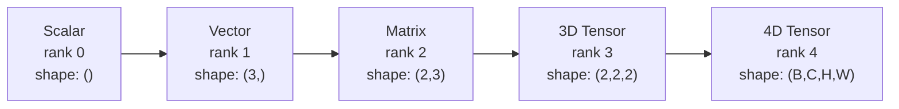
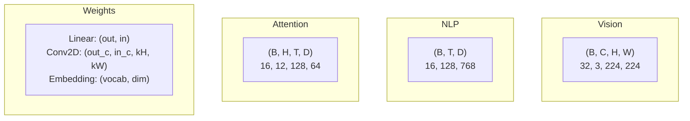
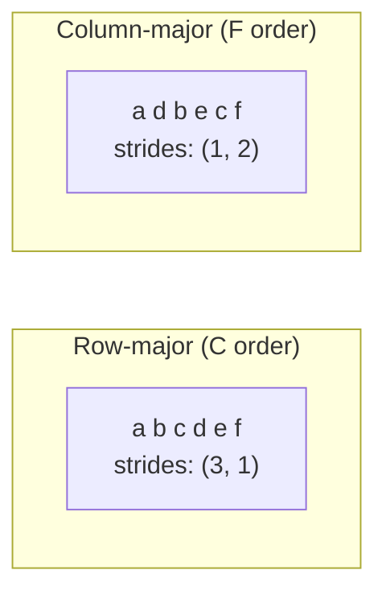
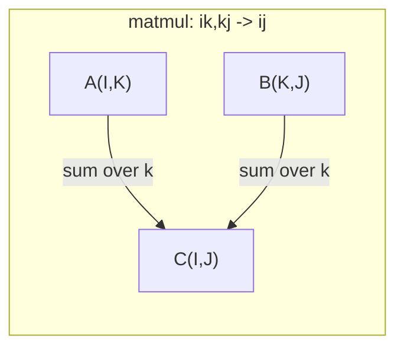

# Operacje na tensorach

> Tensory są wspólnym językiem między danymi a głębokim uczeniem. Każdy obraz, każde zdanie, każdy gradient przepływa właśnie przez nie.

**Typ:** Build
**Język:** Python
**Wymagania wstępne:** Faza 1, Lekcje 01 (Intuicja algebry liniowej), 02 (Wektory, macierze i operacje)
**Czas:** ~90 minut

## Cele nauki

- Zaimplementować od podstaw klasę tensora z kształtem (shape), krokami (strides), zmianą kształtu (reshape), transpozycją i operacjami element po elemencie
- Stosować reguły broadcastingu, aby operować na tensorach o różnych kształtach bez kopiowania danych
- Pisać wyrażenia einsum dla iloczynów skalarnych, mnożeń macierzowych, iloczynów zewnętrznych i operacji wsadowych (batched)
- Śledzić dokładne kształty tensorów na każdym etapie wielogłowicowej uwagi (multi-head attention)

## Problem

Budujesz transformer. Przebieg w przód (forward pass) wygląda czysto. Uruchamiasz go i otrzymujesz: `RuntimeError: mat1 and mat2 shapes cannot be multiplied (32x768 and 512x768)`. Wpatrujesz się w kształty. Próbujesz transpozycji. Teraz pojawia się komunikat `Expected 4D input (got 3D input)`. Dodajesz unsqueeze. Coś innego się psuje.

Błędy kształtów to najczęstszy bug w kodzie głębokiego uczenia. Nie są trudne koncepcyjnie -- każda operacja ma swój kontrakt kształtu -- ale szybko się namnażają. Transformer zawiera dziesiątki połączonych ze sobą zmian kształtu, transpozycji i operacji broadcastingu. Jedna błędna osia i błąd rozprzestrzenia się kaskadowo. Co gorsza, niektóre błędy kształtu nie zgłaszają żadnych wyjątków. Po prostu w ciszy generują śmieci, wykonując broadcasting wzdłuż niewłaściwego wymiaru albo sumując po niewłaściwej osi.

Macierze obsługują relacje parami między dwoma zbiorami obiektów. Rzeczywiste dane nie mieszczą się w dwóch wymiarach. Partia 32 obrazów RGB o rozmiarze 224x224 to tensor 4D: `(32, 3, 224, 224)`. Self-attention z 12 głowicami to również tensor 4D: `(batch, heads, seq_len, head_dim)`. Potrzebujesz struktury danych, która generalizuje się na dowolną liczbę wymiarów, z operacjami, które komponują się czysto we wszystkich z nich. Tą strukturą jest tensor. Opanuj jego operacje, a błędy kształtu staną się trywialne do debugowania.

## Koncepcja

### Czym jest tensor

Tensor to wielowymiarowa tablica liczb o jednolitym typie danych. Liczba wymiarów to **rząd** (rank, czyli **order**). Każdy wymiar to **osie** (axis). **Kształt** (shape) to krotka określająca rozmiar wzdłuż każdej osi.



Łączna liczba elementów = iloczyn wszystkich rozmiarów. Kształt `(2, 3, 4)` zawiera `2 * 3 * 4 = 24` elementów.

### Kształty tensorów w głębokim uczeniu

Różne typy danych mapują się na konkretne kształty tensorów zgodnie z konwencją.



PyTorch używa formatu NCHW (kanały na pierwszym miejscu). TensorFlow domyślnie używa NHWC (kanały na ostatnim miejscu). Niezgodne układy powodują ciche spowolnienia lub błędy.

### Jak działa układ pamięci

Tablica 2D w pamięci jest jednowymiarową sekwencją bajtów. **Strides** (kroki) mówią, ile elementów trzeba przeskoczyć, aby przesunąć się o jeden krok wzdłuż każdej osi.



Transpozycja nie przenosi danych. Zamienia ze sobą strides, czyniąc tensor **nieciągłym (non-contiguous)** -- elementy danego wiersza nie są już sąsiadujące w pamięci.

### Reguły broadcastingu

Broadcasting pozwala operować na tensorach o różnych kształtach bez kopiowania danych. Wyrównaj kształty od prawej strony. Dwa wymiary są kompatybilne, gdy są równe albo jeden z nich wynosi 1. Mniejsza liczba wymiarów jest dopełniana jedynkami z lewej strony.

```
Tensor A:     (8, 1, 6, 1)
Tensor B:        (7, 1, 5)
Padded B:     (1, 7, 1, 5)
Result:       (8, 7, 6, 5)
```

### Einsum: uniwersalna operacja na tensorach

Sumowanie Einsteina (Einstein summation) etykietuje każdą osię literą. Osie obecne na wejściu, ale nie na wyjściu, są sumowane. Osie obecne w obu są zachowywane.



Kluczowe wzorce: `i,i->` (iloczyn skalarny), `i,j->ij` (iloczyn zewnętrzny), `ii->` (śled, trace), `ij->ji` (transpozycja), `bij,bjk->bik` (mnożenie macierzowe wsadowe), `bhtd,bhsd->bhts` (wyniki uwagi/attention scores).

## Zbuduj to

Kod znajduje się w `code/tensors.py`. Każdy krok odnosi się do implementacji tam zawartej.

### Krok 1: Przechowywanie tensora i strides

Tensor przechowuje płaską listę liczb plus metadane kształtu. Strides informują logikę indeksowania, jak mapować indeksy wielowymiarowe na pozycje w płaskiej tablicy.

```python
class Tensor:
    def __init__(self, data, shape=None):
        if isinstance(data, (list, tuple)):
            self._data, self._shape = self._flatten_nested(data)
        elif isinstance(data, np.ndarray):
            self._data = data.flatten().tolist()
            self._shape = tuple(data.shape)
        else:
            self._data = [data]
            self._shape = ()

        if shape is not None:
            total = reduce(lambda a, b: a * b, shape, 1)
            if total != len(self._data):
                raise ValueError(
                    f"Cannot reshape {len(self._data)} elements into shape {shape}"
                )
            self._shape = tuple(shape)

        self._strides = self._compute_strides(self._shape)

    @staticmethod
    def _compute_strides(shape):
        if len(shape) == 0:
            return ()
        strides = [1] * len(shape)
        for i in range(len(shape) - 2, -1, -1):
            strides[i] = strides[i + 1] * shape[i + 1]
        return tuple(strides)
```

Dla kształtu `(3, 4)` strides wynoszą `(4, 1)` -- przeskocz 4 elementy, aby przejść o jeden wiersz, przeskocz 1 element, aby przejść o jedną kolumnę.

### Krok 2: Reshape, squeeze, unsqueeze

Reshape zmienia kształt bez zmiany porządku elementów. Łączna liczba elementów musi pozostać taka sama. Użyj `-1` dla jednego wymiaru, aby wnioskować jego rozmiar.

```python
t = Tensor(list(range(12)), shape=(2, 6))
r = t.reshape((3, 4))
r = t.reshape((-1, 3))
```

Squeeze usuwa osie o rozmiarze 1. Unsqueeze wstawia taką osię. Unsqueeze jest kluczowy dla broadcastingu -- wektor bias o kształcie `(D,)` dodawany do partii `(B, T, D)` wymaga unsqueeze do `(1, 1, D)`.

```python
t = Tensor(list(range(6)), shape=(1, 3, 1, 2))
s = t.squeeze()
v = Tensor([1, 2, 3])
u = v.unsqueeze(0)
```

### Krok 3: Transpose i permute

Transpose zamienia ze sobą dwie osie. Permute zmienia porządek wszystkich osi. Tak właśnie konwertuje się między NCHW i NHWC.

```python
mat = Tensor(list(range(6)), shape=(2, 3))
tr = mat.transpose(0, 1)

t4d = Tensor(list(range(24)), shape=(1, 2, 3, 4))
perm = t4d.permute((0, 2, 3, 1))
```

Po transpose lub permute tensor jest nieciągły w pamięci. W PyTorch `view` zawodzi na nieciągłych tensorach -- użyj `reshape` albo wcześniej wywołaj `.contiguous()`.

### Krok 4: Operacje element po elemencie i redukcje

Operacje element po elemencie (dodawanie, mnożenie, odejmowanie) stosują się niezależnie do każdego elementu i zachowują kształt. Redukcje (sum, mean, max) zwijają jedną lub więcej osi.

```python
a = Tensor([[1, 2], [3, 4]])
b = Tensor([[10, 20], [30, 40]])
c = a + b
d = a * 2
s = a.sum(axis=0)
```

Globalne uśrednianie (global average pooling) w CNN: `(B, C, H, W).mean(axis=[2, 3])` daje `(B, C)`. Uśrednianie sekwencji w NLP: `(B, T, D).mean(axis=1)` daje `(B, D)`.

### Krok 5: Broadcasting z NumPy

Funkcja `demo_broadcasting_numpy()` w `tensors.py` pokazuje podstawowe wzorce.

```python
activations = np.random.randn(4, 3)
bias = np.array([0.1, 0.2, 0.3])
result = activations + bias

images = np.random.randn(2, 3, 4, 4)
scale = np.array([0.5, 1.0, 1.5]).reshape(1, 3, 1, 1)
result = images * scale

a = np.array([1, 2, 3]).reshape(-1, 1)
b = np.array([10, 20, 30, 40]).reshape(1, -1)
outer = a * b
```

Odległość parami (pairwise distance) za pomocą broadcastingu: zmień kształt `(M, 2)` na `(M, 1, 2)` oraz `(N, 2)` na `(1, N, 2)`, odejmij, podnieś do kwadratu, zsumuj wzdłuż ostatniej osi, weź pierwiastek kwadratowy. Wynik: `(M, N)`.

### Krok 6: Operacje einsum

Funkcje `demo_einsum()` i `demo_einsum_gallery()` przechodzą przez każdy popularny wzorzec.

```python
a = np.array([1.0, 2.0, 3.0])
b = np.array([4.0, 5.0, 6.0])
dot = np.einsum("i,i->", a, b)

A = np.array([[1, 2], [3, 4], [5, 6]], dtype=float)
B = np.array([[7, 8, 9], [10, 11, 12]], dtype=float)
matmul = np.einsum("ik,kj->ij", A, B)

batch_A = np.random.randn(4, 3, 5)
batch_B = np.random.randn(4, 5, 2)
batch_mm = np.einsum("bij,bjk->bik", batch_A, batch_B)
```

Koszt obliczeniowy kontrakcji to iloczyn wszystkich rozmiarów indeksów (zachowanych i sumowanych). Dla `bij,bjk->bik` z B=32, I=128, J=64, K=128: `32 * 128 * 64 * 128 = 33 554 432` operacji mnożenia z akumulacją (multiply-add).

### Krok 7: Mechanizm uwagi (attention) za pomocą einsum

Funkcja `demo_attention_einsum()` implementuje wielogłowicową uwagę (multi-head attention) od początku do końca.

```python
B, H, T, D = 2, 4, 8, 16
E = H * D

X = np.random.randn(B, T, E)
W_q = np.random.randn(E, E) * 0.02

Q = np.einsum("bte,ek->btk", X, W_q)
Q = Q.reshape(B, T, H, D).transpose(0, 2, 1, 3)

scores = np.einsum("bhtd,bhsd->bhts", Q, K) / np.sqrt(D)
weights = softmax(scores, axis=-1)
attn_output = np.einsum("bhts,bhsd->bhtd", weights, V)

concat = attn_output.transpose(0, 2, 1, 3).reshape(B, T, E)
output = np.einsum("bte,ek->btk", concat, W_o)
```

Każdy krok jest operacją tensorową: projekcja (mnożenie macierzowe za pomocą einsum), podział na głowice (reshape + transpose), wyniki uwagi (mnożenie macierzowe wsadowe za pomocą einsum), suma ważona (mnożenie macierzowe wsadowe za pomocą einsum), scalanie głowic (transpose + reshape), projekcja wyjściowa (mnożenie macierzowe za pomocą einsum).

## Zastosuj to

### Od podstaw vs NumPy

| Operacja | Od podstaw (klasa Tensor) | NumPy |
|---|---|---|
| Utworzenie | `Tensor([[1,2],[3,4]])` | `np.array([[1,2],[3,4]])` |
| Reshape | `t.reshape((3,4))` | `a.reshape(3,4)` |
| Transpose | `t.transpose(0,1)` | `a.T` lub `a.transpose(0,1)` |
| Squeeze | `t.squeeze(0)` | `np.squeeze(a, 0)` |
| Sum | `t.sum(axis=0)` | `a.sum(axis=0)` |
| Einsum | N/A | `np.einsum("ij,jk->ik", a, b)` |

### Od podstaw vs PyTorch

```python
import torch

t = torch.tensor([[1, 2, 3], [4, 5, 6]], dtype=torch.float32)
t.shape
t.stride()
t.is_contiguous()

t.reshape(3, 2)
t.unsqueeze(0)
t.transpose(0, 1)
t.transpose(0, 1).contiguous()

torch.einsum("ik,kj->ij", A, B)
```

PyTorch dodaje autograd, wsparcie GPU oraz zoptymalizowane jądra BLAS. Semantyka kształtów jest identyczna. Jeśli rozumiesz wersję od podstaw, błędy kształtów w PyTorch staną się czytelne.

### Każda warstwa sieci neuronowej jako operacja tensorowa

| Operacja | Forma tensorowa | Einsum |
|---|---|---|
| Warstwa liniowa | `Y = X @ W.T + b` | `"bd,od->bo"` + bias |
| Attention QKV | `Q = X @ W_q` | `"btd,dh->bth"` |
| Wyniki uwagi (attention scores) | `Q @ K.T / sqrt(d)` | `"bhtd,bhsd->bhts"` |
| Wyjście uwagi (attention output) | `softmax(scores) @ V` | `"bhts,bhsd->bhtd"` |
| Batch norm | `(X - mu) / sigma * gamma` | element po elemencie + broadcast |
| Softmax | `exp(x) / sum(exp(x))` | element po elemencie + redukcja |

## Wykorzystaj to

Ta lekcja produkuje dwa wielokrotnie używane prompty:

1. **`outputs/prompt-tensor-shapes.md`** -- Systematyczny prompt do debugowania niezgodności kształtów tensorów. Zawiera tabele decyzyjne dla każdej popularnej operacji (matmul, broadcast, cat, Linear, Conv2d, BatchNorm, softmax) oraz tabelę z gotowymi rozwiązaniami (fix lookup table).

2. **`outputs/prompt-tensor-debugger.md`** -- Krok po kroku prompt debugujący, który wklejasz do dowolnego asystenta AI, gdy błąd kształtu blokuje Ci pracę. Podaj mu komunikat błędu oraz swoje kształty tensorów, a otrzymasz konkretną poprawkę.

## Ćwiczenia

1. **Łatwe -- Przejście tam i z powrotem przy reshape (round-trip).** Weź tensor o kształcie `(2, 3, 4)`. Zmień jego kształt na `(6, 4)`, potem na `(24,)`, a następnie z powrotem na `(2, 3, 4)`. Zweryfikuj, że porządek elementów jest zachowany na każdym etapie, wypisując płaskie dane.

2. **Średnie -- Implementacja broadcastingu.** Rozszerz klasę `Tensor` o metodę `broadcast_to(shape)`, która rozszerza wymiary o rozmiarze 1, aby dopasować je do docelowego kształtu. Następnie zmodyfikuj `_elementwise_op`, aby automatycznie wykonywała broadcasting przed operacją. Przetestuj na kształtach `(3, 1)` i `(1, 4)` dających `(3, 4)`.

3. **Trudne -- Zbuduj einsum od podstaw.** Zaimplementuj podstawową funkcję `einsum(subscripts, *tensors)`, która obsługuje przynajmniej: iloczyn skalarny (`i,i->`), mnożenie macierzowe (`ij,jk->ik`), iloczyn zewnętrzny (`i,j->ij`) oraz transpozycję (`ij->ji`). Sparsuj łańcuch indeksów (subscript string), zidentyfikuj indeksy kontrahowane (contracted) i przejdź w pętli przez wszystkie kombinacje indeksów. Porównaj swoje wyniki z `np.einsum`.

4. **Trudne -- Śledzenie kształtów w attention.** Napisz funkcję, która przyjmuje `batch_size`, `seq_len`, `embed_dim` i `num_heads` jako argumenty wejściowe i wypisuje dokładny kształt na każdym etapie wielogłowicowej uwagi: wejście, projekcja Q/K/V, podział na głowice, wyniki uwagi (attention scores), wagi softmax, suma ważona, scalanie głowic, projekcja wyjściowa. Zweryfikuj wynik względem wyjścia `demo_attention_einsum()`.

## Kluczowe terminy

| Termin | Co mówią ludzie | Co to faktycznie znaczy |
|---|---|---|
| Tensor | "Macierz, ale z większą liczbą wymiarów" | Wielowymiarowa tablica o jednolitym typie oraz zdefiniowanym kształcie, strides i operacjach |
| Rank | "Liczba wymiarów" | Liczba osi. Macierz ma rank 2, nie rank równy jej rzędowi macierzy (matrix rank) |
| Shape | "Rozmiar tensora" | Krotka opisująca rozmiar wzdłuż każdej osi. `(2, 3)` znaczy 2 wiersze, 3 kolumny |
| Stride | "Jak jest zorganizowana pamięć" | Liczba elementów do przeskoczenia, aby przesunąć się o jedną pozycję wzdłuż każdej osi |
| Broadcasting | "Po prostu działa, gdy kształty się różnią" | Ściśle określony zestaw reguł: wyrównanie od prawej strony, wymiary muszą być równe albo jeden z nich musi wynosić 1 |
| Contiguous | "Tensor jest normalny" | Elementy przechowywane sekwencyjnie w pamięci, bez przerw i bez zmiany porządku względem logicznego układu |
| Einsum | "Wymyślny sposób zapisu matmul" | Ogólna notacja wyrażająca każdą kontrakcję tensorową, iloczyn zewnętrzny, śled (trace) lub transpozycję w jednej linii |
| View | "To samo co reshape" | Tensor współdzielący ten sam bufor pamięci, ale z innymi metadanymi kształtu/strides. Zawodzi na danych nieciągłych |
| Contraction | "Sumowanie po indeksie" | Ogólna operacja, w której wspólny indeks między tensorami jest mnożony i sumowany, dając wynik o niższym rzędzie |
| NCHW / NHWC | "Format PyTorch vs TensorFlow" | Konwencje układu pamięci dla tensorów obrazów. NCHW umieszcza kanały przed wymiarami przestrzennymi, NHWC umieszcza je po nich |

## Dalsza lektura

- [NumPy Broadcasting](https://numpy.org/doc/stable/user/basics.broadcasting.html) -- Kanoniczne reguły z wizualnymi przykładami
- [PyTorch Tensor Views](https://pytorch.org/docs/stable/tensor_view.html) -- Kiedy widoki (views) działają, a kiedy kopiują dane
- [einops](https://github.com/arogozhnikov/einops) -- Biblioteka, która sprawia, że zmiana kształtu tensorów jest czytelna i bezpieczna
- [The Illustrated Transformer](https://jalammar.github.io/illustrated-transformer/) -- Wizualizuje kształty tensorów przepływające przez attention
- [Einstein Summation in NumPy](https://numpy.org/doc/stable/reference/generated/numpy.einsum.html) -- Pełna dokumentacja einsum z przykładami
