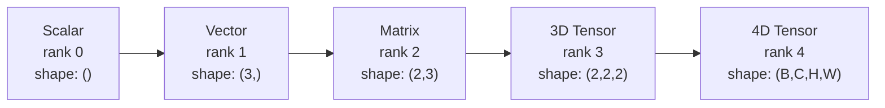
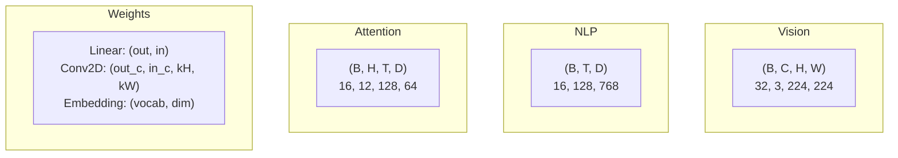
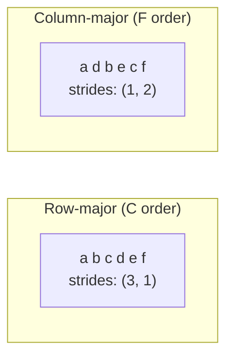
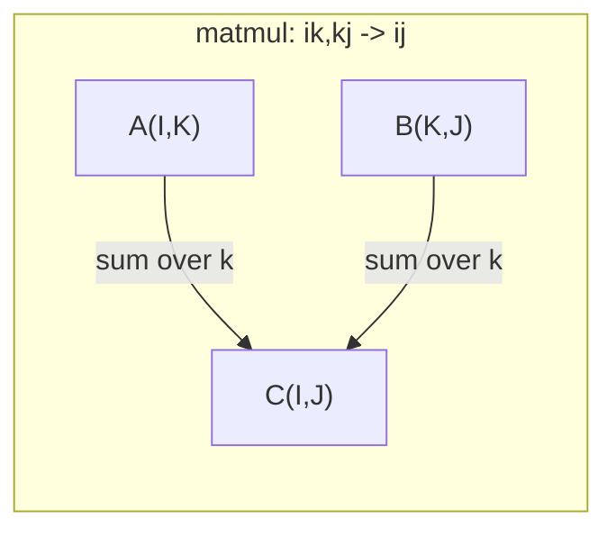

# Operacje tensorowe

> Tensory są wspólnym językiem danych i głębokiego uczenia się. Przepływa przez nie każdy obraz, każde zdanie, każdy gradient.

**Typ:** Kompilacja
**Język:** Python
**Wymagania wstępne:** Faza 1, lekcje 01 (Intuicja algebry liniowej), 02 (wektory, macierze i operacje)
**Czas:** ~90 minut

## Cele nauczania

- Zaimplementuj klasę tensora z operacjami kształtu, kroków, zmiany kształtu, transpozycji i elementów od podstaw
- Zastosuj reguły rozgłaszania, aby operować na tensorach o różnych kształtach bez kopiowania danych
- Napisz wyrażenia einsum dla iloczynów skalarnych, mnożenia macierzy, iloczynów zewnętrznych i operacji wsadowych
- Śledź dokładne kształty tensorów na każdym etapie uwagi wielogłowej

## Problem

Budujesz transformator. Podanie w przód wygląda czysto. Uruchamiasz go i otrzymujesz: `RuntimeError: mat1 and mat2 shapes cannot be multiplied (32x768 and 512x768)`. Wpatrujesz się w kształty. Próbujesz transpozycji. Teraz jest napisane `Expected 4D input (got 3D input)`. Dodajesz unsqueeze. Coś innego się psuje.

Błędy kształtu są najczęstszym błędem w kodzie głębokiego uczenia się. Nie są one trudne koncepcyjnie — każda operacja ma kontrakt dotyczący kształtu — ale szybko się mnożą. Transformator ma dziesiątki połączonych ze sobą zmian kształtu, transpozycji i transmisji. Jedna zła oś i kaskady błędów. Co gorsza, niektóre błędy kształtu w ogóle nie powodują błędów. Po cichu produkują śmieci, nadając w niewłaściwym wymiarze lub sumując w niewłaściwej osi.

Macierze obsługują relacje parami pomiędzy dwoma zbiorami rzeczy. Prawdziwych danych nie można podzielić na dwa wymiary. Partia 32 obrazów RGB o rozdzielczości 224x224 to tensor 4D: `(32, 3, 224, 224)`. Samouważność z 12 głowami też jest 4D: `(batch, heads, seq_len, head_dim)`. Potrzebujesz struktury danych, która uogólnia na dowolną liczbę wymiarów i zawiera operacje, które obejmują wszystkie z nich. Ta struktura to tensor. Opanuj jego operacje, a błędy kształtu staną się łatwe do debugowania.

## Koncepcja

### Co to jest tensor

Tensor to wielowymiarowa tablica liczb o jednolitym typie danych. Liczba wymiarów to **ranking** (lub **porządek**). Każdy wymiar jest **osią**. **kształt** to krotka wyświetlająca rozmiar wzdłuż każdej osi.



Suma elementów = produkt we wszystkich rozmiarach. Kształt `(2, 3, 4)` zawiera elementy `2 * 3 * 4 = 24`.

### Kształty tensorowe w uczeniu głębokim

Różne typy danych są zgodnie z konwencją odwzorowywane na określone kształty tensora.



PyTorch używa NCHW (najpierw kanały). Domyślną wartością TensorFlow jest NHWC (ostatnie kanały). Niedopasowane układy powodują ciche spowolnienia lub błędy.

### Jak działa układ pamięci

Tablica 2D w pamięci to sekwencja bajtów 1D. **Kroki** informują, ile elementów należy pominąć, aby przejść o jeden krok wzdłuż każdej osi.



Transpozycja nie przenosi danych. Zamienia kroki, czyniąc tensor **nieciągłym** — elementy wiersza nie sąsiadują już ze sobą w pamięci.

### Zasady nadawania

Rozgłaszanie umożliwia operowanie na tensorach o różnych kształtach bez kopiowania danych. Wyrównaj kształty od prawej strony. Dwa wymiary są kompatybilne, jeśli są równe lub jeden wynosi 1. Mniej wymiarów jest uzupełnianych jedynkami po lewej stronie.

```
Tensor A:     (8, 1, 6, 1)
Tensor B:        (7, 1, 5)
Padded B:     (1, 7, 1, 5)
Result:       (8, 7, 6, 5)
```

### Einsum: uniwersalna operacja tensorowa

Sumowanie Einsteina oznacza każdą oś literą. Osie na wejściu, ale nie na wyjściu, są sumowane. Osie w obu przypadkach zachowane.



Kluczowe wzorce: `i,i->` (iloczyn kropkowy), `i,j->ij` (iloczyn zewnętrzny), `ii->` (ślad), `ij->ji` (transpozycja), `bij,bjk->bik` (matmul wsadowy), `bhtd,bhsd->bhts` (ocena uwagi).

## Zbuduj to

Kod znajduje się w `code/tensors.py`. Każdy krok odnosi się do tamtejszej implementacji.

### Krok 1: przechowywanie tensora i kroki

Tensor przechowuje płaską listę liczb oraz metadane kształtu. Strides mówi logice indeksowania, jak mapować wielowymiarowe indeksy na płaskie pozycje.

```python
class Tensor:
    def __init__(self, data, shape=None):
        if isinstance(data, (list, tuple)):
            self._data, self._shape = self._flatten_nested(data)
        elif isinstance(data, np.ndarray):
            self._data = data.flatten().tolist()
            self._shape = tuple(data.shape)
        else:
            self._data = [data]
            self._shape = ()

        if shape is not None:
            total = reduce(lambda a, b: a * b, shape, 1)
            if total != len(self._data):
                raise ValueError(
                    f"Cannot reshape {len(self._data)} elements into shape {shape}"
                )
            self._shape = tuple(shape)

        self._strides = self._compute_strides(self._shape)

    @staticmethod
    def _compute_strides(shape):
        if len(shape) == 0:
            return ()
        strides = [1] * len(shape)
        for i in range(len(shape) - 2, -1, -1):
            strides[i] = strides[i + 1] * shape[i + 1]
        return tuple(strides)
```

W przypadku kształtu `(3, 4)` kroki wynoszą `(4, 1)` — pomiń 4 elementy, aby przejść do przodu o jeden wiersz, pomiń 1 element, aby przejść do przodu o jedną kolumnę.

### Krok 2: Zmień kształt, ściśnij, rozluźnij

Zmień kształt zmienia kształt bez zmiany kolejności elementów. Całkowita liczba elementów musi pozostać taka sama. Użyj `-1` dla jednego wymiaru, aby wywnioskować jego rozmiar.

```python
t = Tensor(list(range(12)), shape=(2, 6))
r = t.reshape((3, 4))
r = t.reshape((-1, 3))
```

Ściśnięcie usuwa osie o rozmiarze 1. Odciśnięcie wstawia jedną. Wyciśnięcie ma kluczowe znaczenie w przypadku nadawania — wektor odchylenia `(D,)` dodany do wsadu `(B, T, D)` wymaga rozciągnięcia do `(1, 1, D)`.

```python
t = Tensor(list(range(6)), shape=(1, 3, 1, 2))
s = t.squeeze()
v = Tensor([1, 2, 3])
u = v.unsqueeze(0)
```

### Krok 3: Transpozycja i permutacja

Transpozycja zamienia dwie osie. Permute zmienia kolejność wszystkich osi. W ten sposób dokonujesz konwersji pomiędzy NCHW i NHWC.

```python
mat = Tensor(list(range(6)), shape=(2, 3))
tr = mat.transpose(0, 1)

t4d = Tensor(list(range(24)), shape=(1, 2, 3, 4))
perm = t4d.permute((0, 2, 3, 1))
```

Po transpozycji lub permutacji tensor nie jest ciągły w pamięci. W PyTorch `view` nie działa na nieciągłych tensorach — użyj najpierw `reshape` lub wywołaj `.contiguous()`.

### Krok 4: Operacje i redukcje na elementach

Operacje związane z elementami (dodawanie, mnożenie, odejmowanie) mają zastosowanie niezależnie do każdego elementu i zachowują kształt. Redukcje (suma, średnia, maks.) zwijają jedną lub więcej osi.

```python
a = Tensor([[1, 2], [3, 4]])
b = Tensor([[10, 20], [30, 40]])
c = a + b
d = a * 2
s = a.sum(axis=0)
```

Globalne średnie łączenie w CNN: `(B, C, H, W).mean(axis=[2, 3])` daje `(B, C)`. Łączenie średnich sekwencji w NLP: `(B, T, D).mean(axis=1)` daje `(B, D)`.

### Krok 5: Nadawanie za pomocą NumPy

Funkcja `demo_broadcasting_numpy()` w `tensors.py` pokazuje podstawowe wzorce.

```python
activations = np.random.randn(4, 3)
bias = np.array([0.1, 0.2, 0.3])
result = activations + bias

images = np.random.randn(2, 3, 4, 4)
scale = np.array([0.5, 1.0, 1.5]).reshape(1, 3, 1, 1)
result = images * scale

a = np.array([1, 2, 3]).reshape(-1, 1)
b = np.array([10, 20, 30, 40]).reshape(1, -1)
outer = a * b
```

Odległość parami poprzez transmisję: zmień kształt `(M, 2)` na `(M, 1, 2)` i `(N, 2)` na `(1, N, 2)`, odejmij, podnieś do kwadratu, zsumuj wzdłuż ostatniej osi i wypierwiastkuj kwadrat. Wynik: `(M, N)`.

### Krok 6: Operacje Einsum

Funkcje `demo_einsum()` i `demo_einsum_gallery()` opisują każdy typowy wzorzec.

```python
a = np.array([1.0, 2.0, 3.0])
b = np.array([4.0, 5.0, 6.0])
dot = np.einsum("i,i->", a, b)

A = np.array([[1, 2], [3, 4], [5, 6]], dtype=float)
B = np.array([[7, 8, 9], [10, 11, 12]], dtype=float)
matmul = np.einsum("ik,kj->ij", A, B)

batch_A = np.random.randn(4, 3, 5)
batch_B = np.random.randn(4, 5, 2)
batch_mm = np.einsum("bij,bjk->bik", batch_A, batch_B)
```

Koszt obliczeniowy skurczu jest iloczynem wszystkich rozmiarów indeksów (zachowanych i zsumowanych). Dla `bij,bjk->bik` z B=32, I=128, J=64, K=128: `32 * 128 * 64 * 128 = 33,554,432` mnoży-dodaje.

### Krok 7: Mechanizm uwagi poprzez einsum

Funkcja `demo_attention_einsum()` implementuje wielogłową uwagę od końca do końca.

```python
B, H, T, D = 2, 4, 8, 16
E = H * D

X = np.random.randn(B, T, E)
W_q = np.random.randn(E, E) * 0.02

Q = np.einsum("bte,ek->btk", X, W_q)
Q = Q.reshape(B, T, H, D).transpose(0, 2, 1, 3)

scores = np.einsum("bhtd,bhsd->bhts", Q, K) / np.sqrt(D)
weights = softmax(scores, axis=-1)
attn_output = np.einsum("bhts,bhsd->bhtd", weights, V)

concat = attn_output.transpose(0, 2, 1, 3).reshape(B, T, E)
output = np.einsum("bte,ek->btk", concat, W_o)
```

Każdy krok jest operacją tensorową: projekcja (matmul przez einsum), dzielenie głowy (zmiana kształtu + transpozycja), wyniki uwagi (matmul przez einsum), suma ważona (matmul przez einsum), łączenie głów (transpozycja + zmiana kształtu), projekcja wyników (matmul przez einsum).

## Użyj tego

### Scratch kontra NumPy

| Operacja | Scratch (klasa Tensor) | NumPy |
|---|---|---|
| Utwórz | `Tensor([[1,2],[3,4]])` | `np.array([[1,2],[3,4]])` |
| Zmień kształt | `t.reshape((3,4))` | `a.reshape(3,4)` |
| Transpozycja | `t.transpose(0,1)` | `a.T` lub `a.transpose(0,1)` |
| Ściśnij | `t.squeeze(0)` | `np.squeeze(a, 0)` |
| Suma | `t.sum(axis=0)` | `a.sum(axis=0)` |
| Einsum | Nie dotyczy | `np.einsum("ij,jk->ik", a, b)` |

### Scratch kontra PyTorch

```python
import torch

t = torch.tensor([[1, 2, 3], [4, 5, 6]], dtype=torch.float32)
t.shape
t.stride()
t.is_contiguous()

t.reshape(3, 2)
t.unsqueeze(0)
t.transpose(0, 1)
t.transpose(0, 1).contiguous()

torch.einsum("ik,kj->ij", A, B)
```

PyTorch dodaje autograd, obsługę GPU i zoptymalizowane jądra BLAS. Semantyka kształtu jest identyczna. Jeśli rozumiesz wersję zdrapkową, błędy kształtu PyTorch staną się czytelne.

### Każda warstwa sieci neuronowej jako operacja tensorowa

| Operacja | Forma Tensora | Einsum |
|---|---|---|
| Warstwa liniowa | `Y = X @ W.T + b` | `"bd,od->bo"` + odchylenie |
| Uwaga QKV | `Q = X @ W_q` | `"btd,dh->bth"` |
| Wyniki uwagi | `Q @ K.T / sqrt(d)` | `"bhtd,bhsd->bhts"` |
| Uwaga wyjście | `softmax(scores) @ V` | `"bhts,bhsd->bhtd"` |
| Norma partii | `(X - mu) / sigma * gamma` | elementarnie + transmisja |
| Softmax | `exp(x) / sum(exp(x))` | elementarnie + redukcja |

## Wyślij to

W tej lekcji powstają dwa monity wielokrotnego użytku:

1. **`outputs/prompt-tensor-shapes.md`** — Systematyczny monit o debugowanie niedopasowań kształtu tensora. Zawiera tabele decyzyjne dla każdej typowej operacji (matmul, rozgłoszenie, cat, Linear, Conv2d, BatchNorm, softmax) oraz tabelę wyszukiwania poprawek.

2. **`outputs/prompt-tensor-debugger.md`** — monit o debugowanie krok po kroku, który wklejasz do dowolnego asystenta AI, gdy blokuje Cię błąd kształtu. Podaj mu komunikat o błędzie i kształty tensora, a następnie uzyskaj dokładną poprawkę.

## Ćwiczenia

1. **Łatwe — zmiana kształtu w obie strony.** Weź tensor kształtu `(2, 3, 4)`. Zmień jego kształt na `(6, 4)`, następnie na `(24,)` i z powrotem na `(2, 3, 4)`. Na każdym etapie sprawdzaj, czy kolejność elementów została zachowana, drukując płaskie dane.

2. **Medium — Implementacja emisji.** Rozszerz klasę `Tensor` o metodę `broadcast_to(shape)`, która rozszerza wymiary rozmiaru 1 w celu dopasowania do kształtu docelowego. Następnie zmodyfikuj `_elementwise_op`, aby automatycznie transmitować przed rozpoczęciem działania. Przetestuj z kształtami `(3, 1)` i `(1, 4)` tworzącymi `(3, 4)`.

3. **Trudne — Zbuduj einsum od zera.** Zaimplementuj podstawową funkcję `einsum(subscripts, *tensors)`, która obsługuje co najmniej: iloczyn skalarny (`i,i->`), mnożenie macierzy (`ij,jk->ik`), iloczyn zewnętrzny (`i,j->ij`) i transponować (`ij->ji`). Przeanalizuj ciąg indeksu dolnego, zidentyfikuj skurczone indeksy i pętlę po wszystkich kombinacjach indeksów. Porównaj swoje wyniki z `np.einsum`.

4. **Trudny — śledzenie kształtu uwagi.** Napisz funkcję, która jako dane wejściowe pobiera `batch_size`, `seq_len`, `embed_dim` i `num_heads` i wypisuje dokładny kształt na każdym kroku uwagi wielogłowej: dane wejściowe, projekcja Q/K/V, podział głowy, wyniki uwagi, wagi softmax, suma ważona, połączenie głów, projekcja wyników. Sprawdź wyniki `demo_attention_einsum()`.

## Kluczowe terminy

| Termin | Co ludzie mówią | Co to właściwie oznacza |
|---|---|---|
| Tensor | „Macierz, ale więcej wymiarów” | Wielowymiarowa tablica o jednolitym typie i określonym kształcie, krokach i operacjach |
| Ranga | „Liczba wymiarów” | Liczba osi. Macierz ma rangę 2, a nie rangę równą swojej rangi macierzy |
| Kształt | „Wielkość tensora” | Krotka wyświetlająca rozmiar wzdłuż każdej osi. `(2, 3)` oznacza 2 wiersze, 3 kolumny |
| Krok | „Jak układa się pamięć” | Liczba elementów do pominięcia, aby przejść o jedną pozycję wzdłuż każdej osi |
| Nadawanie | „To po prostu działa, gdy kształty się różnią” | Ścisły zestaw zasad: wyrównaj od prawej, wymiary muszą być równe lub jeden musi wynosić 1 |
| Sąsiadujące | „Tensor jest normalny” | Elementy przechowywane w pamięci sekwencyjnie, bez przerw i zmiany kolejności z logicznego układu |
| Einsum | „Fantazyjny sposób pisania matmul” | Ogólna notacja wyrażająca dowolne skrócenie tensora, iloczyn zewnętrzny, ślad lub transpozycję w jednym wierszu |
| Zobacz | „Tak samo jak zmiana kształtu” | Tensor współdzielący ten sam bufor pamięci, ale z różnymi metadanymi kształtu/kroku. Niepowodzenie w przypadku danych nieciągłych |
| Skurcz | „Podsumowanie po indeksie” | Ogólna operacja polegająca na mnożeniu i sumowaniu wspólnego indeksu tensorów, co daje wynik o niższej randze |
| NCHW / NHWC | „Format PyTorch vs TensorFlow” | Konwencje układu pamięci dla tensorów obrazu. NCHW umieszcza kanały przed przyciemnieniami przestrzennymi, NHWC umieszcza je po |

## Dalsze czytanie

– [NumPy Broadcasting](https://numpy.org/doc/stable/user/basics.broadcasting.html) – Reguły kanoniczne z przykładami wizualnymi
– [Widoki PyTorch Tensor](https://pytorch.org/docs/stable/tensor_view.html) – Kiedy widoki działają i kiedy kopiują
- [einops](https://github.com/arogozhnikov/einops) -- Biblioteka, dzięki której przekształcanie tensora jest czytelne i bezpieczne
– [Ilustrowany transformator](https://jalammar.github.io/ilustrated-transformer/) – Wizualizuje kształty tensora przepływające przez uwagę
- [Podsumowanie Einsteina w NumPy](https://numpy.org/doc/stable/reference/generated/numpy.einsum.html) -- Pełna dokumentacja einsum z przykładami