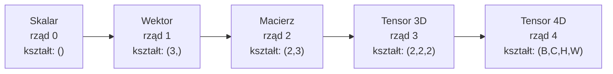
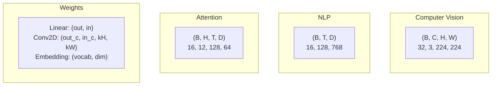
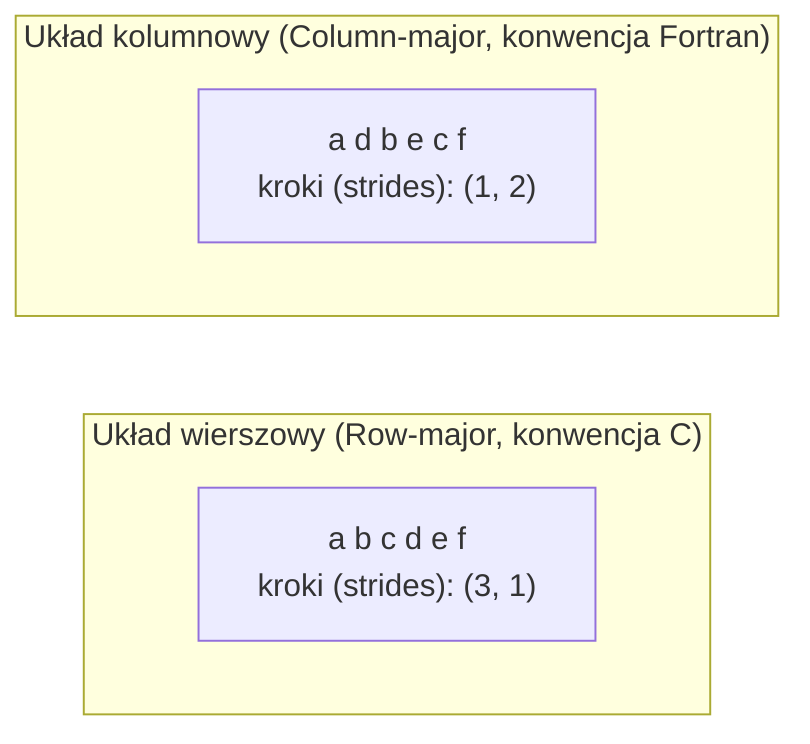
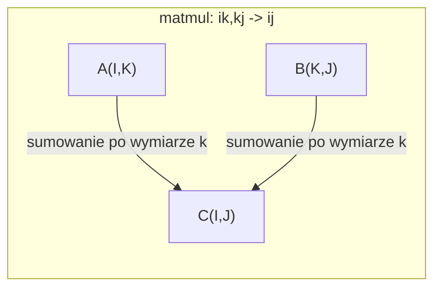

# Operacje tensorowe

> Tensory to uniwersalny język danych i głębokiego uczenia. Płynie przez nie każdy obraz, każde zdanie i każdy gradient.

**Typ:** Kompilacja
**Język:** Python
**Wymagania wstępne:** Faza 1, Lekcje: 01 (Intuicja z algebry liniowej), 02 (Wektory, macierze i operacje)
**Czas:** ~90 minut

## Cele nauczania

- Zaimplementować klasę tensora od podstaw, wprowadzając operacje na kształtach, kroki (strides), zmiany wymiarów (reshape), transpozycje oraz operacje po współrzędnych.
- Stosować reguły rozgłaszania (broadcasting), aby operować na tensorach o różnych wymiarach bez konieczności kopiowania danych.
- Tworzyć wyrażenia *einsum* dla iloczynów skalarnych, mnożenia macierzy, iloczynów zewnętrznych i operacji wsadowych (batch operations).
- Precyzyjnie śledzić kształty tensorów na każdym etapie działania mechanizmu wielogłowej uwagi (multi-head attention).

## Problem

Budujesz model Transformer. Propagacja w przód (forward pass) wydaje się poprawna. Uruchamiasz ją i otrzymujesz błąd: `RuntimeError: mat1 and mat2 shapes cannot be multiplied (32x768 and 512x768)`. Analizujesz wymiary. Próbujesz transpozycji. Wtedy pojawia się: `Expected 4D input (got 3D input)`. Dodajesz `unsqueeze`. Psuje się coś innego.

Niezgodności wymiarów to najczęstsze błędy w kodzie deep learningowym. Koncepcyjnie nie są one trudne — każda operacja ma z góry ustalony układ wymiarów (shape contract) — ale ich liczba potrafi szybko przerosnąć programistę. Transformer zawiera dziesiątki połączonych ze sobą operacji zmiany kształtu, transpozycji i rozgłaszania. Wystarczy jeden niewłaściwy wymiar, by wywołać kaskadę błędów. Co gorsza, niektóre błędy nie generują komunikatów w trakcie wykonania. Po cichu zwracają bzdurne wyniki, na przykład poprzez sumowanie lub rozgłaszanie względem niewłaściwej osi.

Macierze świetnie opisują relacje parami między dwoma zbiorami. Jednak rzeczywistych danych zazwyczaj nie da się wtłoczyć w dwa wymiary. Partia 32 obrazów RGB o rozdzielczości 224x224 to tensor 4D o kształcie: `(32, 3, 224, 224)`. Moduł self-attention z 12 głowami to również struktura 4D: `(batch, heads, seq_len, head_dim)`. Potrzebujesz więc struktury danych, która uogólnia się na dowolną liczbę wymiarów i oferuje spójne operacje nad nimi wszystkimi. Tą strukturą jest tensor. Opanuj działania na tensorach, a debugowanie błędów kształtu stanie się niezwykle proste.

## Koncepcja

### Czym jest tensor?

Tensor to wielowymiarowa tablica liczb posiadająca jeden wspólny typ danych (data type). Liczba wymiarów nazywana jest **rzędem** (rank, czasami porządkiem). Każdy z tych wymiarów to **oś** (axis). **Kształt** (shape) to krotka definiująca rozmiar wzdłuż każdej osi.



Suma wszystkich elementów to iloczyn rozmiarów w każdym wymiarze. Przykładowo, tensor o kształcie `(2, 3, 4)` posiada w sumie `2 * 3 * 4 = 24` elementy.

### Kształty tensorów w głębokim uczeniu

Różne typy danych reprezentuje się konwencjonalnie poprzez określone kształty tensorów.



PyTorch standardowo wykorzystuje format NCHW (najpierw kanały). TensorFlow domyślnie korzysta z formatu NHWC (kanały na końcu). Niedopasowanie układu danych w pamięci prowadzi do spadku wydajności lub po prostu błędów wykonania.

### Jak działa układ danych w pamięci (Memory Layout)

W pamięci RAM tablica 2D zapisana jest w postaci jednowymiarowej sekwencji bajtów. **Kroki** (strides) informują algorytm indeksujący, ile pojedynczych elementów w płaskiej tablicy trzeba pominąć, aby przesunąć się o jedną pozycję na poszczególnej osi.



Operacja transpozycji fizycznie nie przesuwa danych w pamięci. Zmienia ona jedynie wartości kroków, sprawiając, że tensor staje się **nieciągły** (non-contiguous) — kolejne elementy z wiersza nie są już obok siebie w układzie pamięci.

### Reguły rozgłaszania (Broadcasting)

Broadcasting pozwala na przeprowadzanie operacji na tensorach o różnych wymiarach bez konieczności kopiowania i alokacji dodatkowej pamięci. Reguły:
1. Wyrównaj wymiary (kształty) od prawej strony.
2. Dwa wymiary są kompatybilne, jeśli są identyczne lub jeden z nich wynosi 1.
3. Jeśli tensory mają różną liczbę wymiarów, brakujące z lewej strony są wypełniane wymiarami wielkości 1.

```
Tensor A:     (8, 1, 6, 1)
Tensor B:        (7, 1, 5)
B po dodaniu: (1, 7, 1, 5)
Wynik:        (8, 7, 6, 5)
```

### Einsum: Uniwersalny nóż szwajcarski do operacji tensorowych

Konwencja sumowania Einsteina polega na oznaczaniu każdej osi małą literą. Indeksy (osie) występujące przed znakiem wejścia, a brakuje ich w wyniku, są automatycznie sumowane (następuje po nich tzw. kontrakcja/zwinięcie). Oś, która pojawia się po obu stronach wyrażenia zostaje zachowana.



Kluczowe wzorce: `i,i->` (iloczyn skalarny), `i,j->ij` (iloczyn zewnętrzny), `ii->` (ślad macierzy - trace), `ij->ji` (transpozycja), `bij,bjk->bik` (batched matmul - mnożenie dla paczek/batchy), `bhtd,bhsd->bhts` (wyliczanie wagi uwag).

## Budowa (Zrób to sam)

Kod źródłowy znajdziesz w pliku `code/tensors.py`. Każdy poniższy krok odnosi się do zaprezentowanej tam implementacji.

### Krok 1: Przechowywanie danych oraz mechanizm strides

Klasa Tensor przechowuje spłaszczoną listę liczb (elementów) oraz metadane na temat wymiarów i kroków (strides). Kroki podpowiadają logice indeksowania jak rzutować wielowymiarowy indeks `(i, j, k)` na jedną, spłaszczoną pozycję w pamięci.

```python
class Tensor:
    def __init__(self, data, shape=None):
        if isinstance(data, (list, tuple)):
            self._data, self._shape = self._flatten_nested(data)
        elif isinstance(data, np.ndarray):
            self._data = data.flatten().tolist()
            self._shape = tuple(data.shape)
        else:
            self._data = [data]
            self._shape = ()

        if shape is not None:
            total = reduce(lambda a, b: a * b, shape, 1)
            if total != len(self._data):
                raise ValueError(
                    f"Cannot reshape {len(self._data)} elements into shape {shape}"
                )
            self._shape = tuple(shape)

        self._strides = self._compute_strides(self._shape)

    @staticmethod
    def _compute_strides(shape):
        if len(shape) == 0:
            return ()
        strides = [1] * len(shape)
        for i in range(len(shape) - 2, -1, -1):
            strides[i] = strides[i + 1] * shape[i + 1]
        return tuple(strides)
```

Dla struktury o wymiarach `(3, 4)`, kroki będą wynosiły `(4, 1)`. Oznacza to: przeskocz 4 elementy w pamięci by dotrzeć do kolejnego wiersza, a przeskocz 1 element, by dojść do następnej kolumny.

### Krok 2: Reshape, squeeze oraz unsqueeze

Operacja `reshape` modyfikuje układ wymiarów bez zmieniania samej kolejności elementów. Całkowity iloczyn rozmiarów musi być nienaruszony. W wielu bibliotekach (np. PyTorch, NumPy) zastosowanie wymiaru `-1` pozwala automatycznie domyślić się wielkości pozostałej osi.

```python
t = Tensor(list(range(12)), shape=(2, 6))
r = t.reshape((3, 4))
r = t.reshape((-1, 3))
```

Z kolei metoda `squeeze` (wyciskanie) całkowicie eliminuje te wymiary w tensorze, których rozmiar wynosi 1. Operacja `unsqueeze` jest odwrotna - wstawia dodatkowy wymiar wielkości 1. Jest to bardzo przydatne np. do rozgłaszania: wektor biasu `(D,)` chcąc dodać go do większego tensora `(B, T, D)` musi zostać uzupełniony do postaci `(1, 1, D)`.

```python
t = Tensor(list(range(6)), shape=(1, 3, 1, 2))
s = t.squeeze()
v = Tensor([1, 2, 3])
u = v.unsqueeze(0)
```

### Krok 3: Transpozycja i Permutacja (Permute)

Transpozycja (`transpose`) wymienia miejscami dwie konkretne osie. Permutacja (`permute`) nadaje zupełnie nową, konkretną kolejność dla wszystkich zdefiniowanych osi. Korzysta się z niej chociażby po to, aby skonwertować obraz z `NCHW` na `NHWC`.

```python
mat = Tensor(list(range(6)), shape=(2, 3))
tr = mat.transpose(0, 1)

t4d = Tensor(list(range(24)), shape=(1, 2, 3, 4))
perm = t4d.permute((0, 2, 3, 1))
```

Należy jednak pamiętać: tensor bezpośrednio po użyciu `transpose` i `permute` **nie zachowuje ciągłości** w swej strukturze w pamięci. Z tego powodu wywołanie metody `.view()` w bibliotece PyTorch zgłosi wtedy wyjątek. Ratunkiem jest użycie przedtem procedury `.contiguous()` lub posłużenie się `.reshape()`.

### Krok 4: Operacje po współrzędnych (element-wise) oraz redukcje

Działania wektorowe na wartościach skalarnych - mnożenie, odejmowanie, czy dodawanie, nakładane są jednostkowo, na wybrane pary elementów z zachowaniem oryginalnego układu tensora. Procesy odwrotne do tego, takie jak operacje sumy (`sum`), uśredniania (`mean`), max - działają po danej osi powodując tym samym jej "zgniecenie".

```python
a = Tensor([[1, 2], [3, 4]])
b = Tensor([[10, 20], [30, 40]])
c = a + b
d = a * 2
s = a.sum(axis=0)
```

Typowym zjawiskiem "zgniatania" (redukcji) używanym przy modelach CNN (Global Average Pooling) jest `(B, C, H, W).mean(axis=[2, 3])`, co generuje wymiar `(B, C)`.

### Krok 5: Rozgłaszanie (broadcasting) na podstawie NumPy

Przykłady dla logiki `demo_broadcasting_numpy()` dostarczone w zbiorze ćwiczeń.

```python
activations = np.random.randn(4, 3)
bias = np.array([0.1, 0.2, 0.3])
result = activations + bias

images = np.random.randn(2, 3, 4, 4)
scale = np.array([0.5, 1.0, 1.5]).reshape(1, 3, 1, 1)
result = images * scale

a = np.array([1, 2, 3]).reshape(-1, 1)
b = np.array([10, 20, 30, 40]).reshape(1, -1)
outer = a * b
```

Ciekawym przypadkiem jest znalezienie odległości wszystkich punktów między sobą: najpierw kształtowi `(M, 2)` poszerzamy wymiar by przybrał postać `(M, 1, 2)`. Następnie rozmiar `(N, 2)` modyfikujemy jako `(1, N, 2)`. Potem odejmujemy te zbiory używając broadcastingu, sumujemy wielkości i z całości ostatecznie wyciągamy pierwiastek (`sqrt`). Da to wynik z wymiarem `(M, N)`.

### Krok 6: Operacje z wykorzystaniem einsum

`demo_einsum()` i galeria funkcji `demo_einsum_gallery()` doskonale pokazują, do czego przydaje się takie podejście przy złożonych macierzach.

```python
a = np.array([1.0, 2.0, 3.0])
b = np.array([4.0, 5.0, 6.0])
dot = np.einsum("i,i->", a, b)

A = np.array([[1, 2], [3, 4], [5, 6]], dtype=float)
B = np.array([[7, 8, 9], [10, 11, 12]], dtype=float)
matmul = np.einsum("ik,kj->ij", A, B)

batch_A = np.random.randn(4, 3, 5)
batch_B = np.random.randn(4, 5, 2)
batch_mm = np.einsum("bij,bjk->bik", batch_A, batch_B)
```

Koszt dla zliczenia takiej matrycy to skumulowany w jedno iloczyn od wszystkich przypisanych rzędów, połączony i skrócony do ostatecznych wartości. Dla działania postaci: `bij,bjk->bik` przy wartości wejściowej: `B=32, I=128, J=64, K=128`, wygeneruje się nam `32 * 128 * 64 * 128 = 33,554,432` powtarzalnych operacji typu MAC (mnożenie z akumulacją).

### Krok 7: Złożoność uwagi (Attention) a einsum

Rozwiązanie bazujące na wielogłowej uwadze w sposób systemowy udostępnia nam procedura `demo_attention_einsum()`.

```python
B, H, T, D = 2, 4, 8, 16
E = H * D

X = np.random.randn(B, T, E)
W_q = np.random.randn(E, E) * 0.02

Q = np.einsum("bte,ek->btk", X, W_q)
Q = Q.reshape(B, T, H, D).transpose(0, 2, 1, 3)

scores = np.einsum("bhtd,bhsd->bhts", Q, K) / np.sqrt(D)
weights = softmax(scores, axis=-1)
attn_output = np.einsum("bhts,bhsd->bhtd", weights, V)

concat = attn_output.transpose(0, 2, 1, 3).reshape(B, T, E)
output = np.einsum("bte,ek->btk", concat, W_o)
```

Dla tego zapisu poszczególne działania oznaczają: projekcje (matmul i powtórzenia do wewnątrz z `einsum`), zmianę ustawienia poszczególnych "głów" (reshape + transpose), następnie same wyniki wielogłowej ustrukturyzowanej oceny poprzez wagę (matmul w opcji `einsum`) po czym finalne wyrównanie całości po projekcji (z powrotem: transpose + reshape na koniec podłączone dla matmul - przez `einsum`).

## Użyj w praktyce

### Wersja własna (od podstaw) vs NumPy

| Operacja | Scratch (Własna klasa Tensor) | NumPy |
|---|---|---|
| Inicjalizacja | `Tensor([[1,2],[3,4]])` | `np.array([[1,2],[3,4]])` |
| Reshape | `t.reshape((3,4))` | `a.reshape(3,4)` |
| Transpozycja | `t.transpose(0,1)` | `a.T` lub `a.transpose(0,1)` |
| Squeeze | `t.squeeze(0)` | `np.squeeze(a, 0)` |
| Suma | `t.sum(axis=0)` | `a.sum(axis=0)` |
| Einsum | Nie dotyczy | `np.einsum("ij,jk->ik", a, b)` |

### Wersja własna (od podstaw) vs PyTorch

```python
import torch

t = torch.tensor([[1, 2, 3], [4, 5, 6]], dtype=torch.float32)
t.shape
t.stride()
t.is_contiguous()

t.reshape(3, 2)
t.unsqueeze(0)
t.transpose(0, 1)
t.transpose(0, 1).contiguous()

torch.einsum("ik,kj->ij", A, B)
```

Silnik i moduły oferowane z pakietu `PyTorch` dorzucają w sobie od ręki automatyczną gradację funkcji (`autograd`), precyzyjne mapowanie sprzętowe procesorów w jednostkach `GPU` oraz przygotowane bloki optymalizacyjne BLAS do skomplikowanych obliczeń numerycznych. Jednak zasada manipulowania i definiowania samych tensorów we wszystkich opisywanych przypadkach to de facto ujednolicona procedura systematyczna oparta na tym samym procesie. Kiedy zrozumiesz podstawową naturę własnoręcznej edycji "scratch" - logi z awarii wyliczania rozmiarów będą wręcz odruchowo czytelne!

### Każda warstwa sieci neuronowej ukryta za logiką wymiarów Tensorowych

| Działanie operacyjne w sieci | Zapis jako Tensor | Funkcja do wykorzystania w Einsum |
|---|---|---|
| Standardowa powłoka w Warstwie liniowej | `Y = X @ W.T + b` | `"bd,od->bo"` + wymuszony broadcast na końcu |
| Atrybut `QKV` dla Attention | `Q = X @ W_q` | `"btd,dh->bth"` |
| Rezultaty i wyniki Attention | `Q @ K.T / sqrt(d)` | `"bhtd,bhsd->bhts"` |
| Rezultat wyjściowy wyników | `softmax(scores) @ V` | `"bhts,bhsd->bhtd"` |
| Proces w `Batch Norm` | `(X - mu) / sigma * gamma` | wymuszenie po współrzędnych z dodatkiem `broadcast` |
| Warstwa dla `Softmax` | `exp(x) / sum(exp(x))` | operacja logiczna po wektorach i finalna `redukcja` (sumowanie wielkości) |

## Podsumowanie / Wyniki (Ship it)

Z tej lekcji płyną dwie ważne notatki koncepcyjne o wielokrotnym zastosowaniu (znajdziesz je w dedykowanych plikach Markdown):

1. **`outputs/prompt-tensor-shapes.md`** — Usystematyzowany przewodnik / podpowiedź (prompt) ułatwiający zlokalizowanie usterek w wielkości wymiarów sieci. Posiada on wypisane konkretne, użyteczne odniesienia (tabele mapujące) dotyczące wyodrębniania kłopotów dla poszczególnych rodzajów działań takich jak (mnożenie matmul, parametry sieci: powiększania/cat, procedury warstw Liniowych `Conv2d`, wbudowanych procesów `BatchNorm`, czy typowania danych pod `softmax`).

2. **`outputs/prompt-tensor-debugger.md`** — Pomocny interfejs, krok-po-kroku w formie skryptowej instrukcji testującej, który możesz swobodnie zaaplikować do działania sztucznej inteligencji wspomagającej Twoją ścieżkę uczenia na wypadek ewidentnego konfliktu wielkości podczas programowania. Narzędziu wskazuje się dany układ `Tensorów` po czym SI od razu identyfikuje powody niespójności z gotową propozycją ratunkową modyfikacji kodu.

## Ćwiczenia

1. **Poziom łatwy — Zmiana kształtu tam i z powrotem.** Weź tensor o rozmiarach `(2, 3, 4)`. Przekształć jego budowę do postaci: `(6, 4)`, a potem po kolei na `(24,)` i wróć do wejściowego układu - `(2, 3, 4)`. Wydrukuj log i za weryfikuj po płaskich danych `data`, aby po każdym podpunkcie móc upewnić się o poprawnym braku ingerencji do zapisanych wartości w samej w macierzy bazowej.

2. **Poziom średni — Implementacja rozgłaszania (broadcasting).** Zaktualizuj własną klasę Tensor dodając funkcję powielania `broadcast_to(shape)`, nadbudowując wielowymiarowość brakujących fragmentów przybierającą rozmiar 1 aby odzwierciedlały nowo oczekiwane wartości. Później edytuj sekcje odpowiedzialną za procedury matematyczne w `_elementwise_op`, w celu przymusowego odczytania poszerzonych wektorów. Wykonaj test próbny powiązując kształt wektora `(3, 1)` z postacią elementu `(1, 4)` tak, by nowo spięty układ generował tensor `(3, 4)`.

3. **Poziom trudny — Zbuduj własne einsum od podstaw.** Opracuj program łącząc do tego nadrzędną obsługę logiki `einsum(subscripts, *tensors)` umożliwiając realizację podstawowych działań tj.: Mnożenie pod kątem odczytu przez powiązanie i relacje skalarne: iloczyn wewnętrzny punktów (`i,i->`), standardowe mnożenie dwóch macierzy (`ij,jk->ik`), a do tego uwzględnij generowanie mnożenia zewnętrznego: (`i,j->ij`) połączone z funkcją transpozycji komórek (`ij->ji`). Napisz funkcję parsującą zapytanie znakowe indeksu pod spodem, uwzględnij zintegrowane skurczone parametry wektorowe (łączone litery w formacie einsum) do ostatecznej pętli obliczeniowej wektorów. Porównaj czas operacji programowanych działań do operacji wybudowanych z funkcjami i bibliotekami systemowymi np. moduł w `np.einsum`.

4. **Poziom ekspercki — Śledzenie kształtów w mechanizmie uwagi.** Przygotuj aplikację opartą na powiązanym łańcuchu generowania danych odbierającą w swoich metodach zmienne jak: `batch_size`, wyliczanie sekwencji dla funkcji `seq_len` po parametr do `embed_dim` w odniesieniu wielkości wygenerowanej na procedurę do `num_heads`. Finalnie zaprogramuj log ze specyfiką pokazania i zobrazowania wyliczanych i tworzonych ułożeń rozmiaru tensorowego uwzględniającą proces po zadeklarowanych krokach w odniesieniu do ukształtowania mechanizmu "Wielogłowej, samodzielnej uwagi we własnym zakresie sieci" na etapach tj.: wprowadzane wymiary bazowe komórek do obliczeń, pre-proces projekcji do wektorów - odpowiednio (`Q/K/V`), tworzenie segmentu dla operacyjnej podzielności względem wielokrotnych komórek badających w głowie mechanizmu (Głowicach podziału Attention), procedury wynikowej, podział i weryfikacja operacyjnej logiki podziału wskaźników z rozkładu parametru prawdopodobieństw dla - funkcji softmax uwzględniającej podsumowanie wszystkich zgrupowanych wektorów wagowych macierzy do operacji "sumy" skróconej, etap i faza łącznej finalizacji operacyjnej przez wyrównanie do docelowej głowy bazowej dla uwag w skali docelowej na końcu (z podsumowaniem operacyjnej macierzy u układu projekcji na ostatecznych, wejściowych zadeklarowanych początkowo kształtach tablic/wektorów układu macierzy wejściowej tensora). Dla finalnego podsumowania logów zestaw z rezultatami metody systemowej opisanymi i zdefiniowanymi w: `demo_attention_einsum()`.

## Kluczowe terminy

| Termin | Potoczne określenie | Co w rzeczywistości to oznacza? |
|---|---|---|
| Tensor | "Taka rozbudowana wielowymiarowo i skomplikowana macierz" | Konkretnie wielowymiarowa układanka (tablica) jednolitych skwantyfikowanych pod względem typu powiązań z konkretnie ukształtowaną wielkością rozmiarową względem zdefiniowanych wymiarów i wykreowanych dla logiki indeksów. |
| Rząd (Rank) | "Tabela rzędów - wymiarów" | Faktycznie wskazuje na poszczególną ilość zadeklarowanych w tensorze osi. Rząd w formacie dwuwymiarowej tablicy wyniesie 2 – rzędy nie są tu przypisane do odpowiednio używanych pojęć algebry matryc dla matrycowych wymiarów ("rang" algebry liniowej macierzy). |
| Kształt (Shape) | "Aktualna powłoka wielkościowa dla samego tensora i macierzy układu komórek." | Matematyczna definicja na formę zebranych zmiennych zgrupowanych informującą i oznaczająca specyfikę wielkości na odrębnie przypisanej zdeklarowanej i podpinanej względem siebie oddzielnej sekcji "osi". Dla formatu opisu tablicy - (2,3) to rzetelna notyfikacja mówiąca: że dla danej struktury ukształtowało się 2 wiersze i w stosunku dla do podpinanego - zestawu odwołującego z wymiarami o wykazanej odrębnie w układzie 3 odmiennych sekcji kolumn informacyjnych z danymi. |
| Stride (Krok) | "To zdefiniowanie budowy po ułożeniu fizycznym danych z podziału lokacji dla zapisywania pamięci operacyjnej tablic układu po wycinkach." | Precyzyjna fizyczna miara wielkości elementów do zrealizowania dla systemowej luki na logikę krokowego skoku dla indeksowanych procesów względem zadeklarowanego formatu rozmiaru wskaźników by dotrzeć - po pamięci z fizycznym lokowaniem kolejnego elementu z zestawu wielkości wymiarowych na wskazanych dla wskaźników operacyjnych poszczególnych "Osiach Tablicy / Tensorów". |
| Broadcasting (Rozgłaszanie) | "Skrócona informacyjnie droga, żeby obliczyć równolegle mniejszy element, dopasowując się by zadziałać bez kłopotów z innym formatem rozmiarowych dla tensorów u poszczególnych matryc na ich własnej logice do działania po rozmiarach odmiennego ukształtowania poszczególnych formatów po ich różnych parametrach fizycznej "Wielkości". | Surowy wyznaczany z podziałem standard i narzucony procedurami z formatowania układ. Procedury i parametry wyrównywania układu od wartości do układu przypisywanego parametru od "Prawej" na wskazanie by wartości parametrów logicznie zostały zestawiane po wielkości przypisane by w sposób rygorystyczny "odwzorować równe liczby osiowe lub do procedur poszczególnego 1 by wymusić zrównanie formatów wielkości w celach obliczeniowych dla logik matrycy (tensora)". |
| Ciągły (Contiguous) | "To naturalny zapis pamięci bez operacji przekształcania w ułożeniu matrycy lub Tensora, który w ten sposób nie straci swojej podstawowej przypisanej matrycy bazowego układu pod struktury zapisu zmiennych logiki fizycznego zapisu od pamięci." | Fizycznie zrealizowany proces i logika operacji alokowania - czyli poszczególne poszczególnymi blokami elementów ze strumieniami, zrzutowane systemowo fizycznie bez wyrw, odmienności lub z przekręcania parametrów, logicznych i przypisanych sekwencji ukształtowanej względem budowy po pamięci RAM." |
| Einsum | "Fajny programistyczny hack koderski o skróconej formule zapisu dla skomplikowanych macierzy - do pomnażania układów pod powiązane wartości parametru tablic / układów macierzy" | Szeroko uwzględniająca logika w specyficznym standardzie skryptowym upraszczającym o skróconą funkcję zapisywania logiki (konwencji matematycznej dla poszczególnej operacyjnej - kontrakcji skracania) w pojedynczym i prostym skrócie operacyjnym ujętej formuły uwzględniającej pod jednym zrębem kodowym funkcje matematyczne np: powielenia z parametrem i procedurami iloczynów wielowektorowych i matryc i zewnętrznych form dla tensorów układających odwrócenia (transpozycji)." |
| Widok (View) | "Jest po prostu formą ułatwioną formowania i działania w standardowym zrzuconym od `reshape` z wywołaniem podobnych wymiarowych wielkości od wielkości układów w oznaczaniu procedur." | Uproszczona forma ukształtowanej od wielkości tensorowej od powielania widoków pamięciowej bez generowania powielanego nowego kopiowania fizycznie danych z obszaru matrycy na której do zapisu współdziała z identyczną, lokowaną już w odrębnym buforze lokacją RAM odczytując te same zasoby i parametry a jednak uwzględniająca podmienione wielkości logik z atrybutów: rzędu lub samego strida (kroku). Proces ten nie sprawdza się na podpinanych danych u odmiennej budowy przy utraconym w tablicy parametrze na zadeklarowaną "Ciągłość". |
| Kontrakcja (Contraction) | "Ukształtowana logicznie w matematyce od skrótu parametrycznego, forma zredukowania przy operacyjnym ujęciu, po dodawanej wektorowo po sobie "Suma indeksu pod wektorem wartości przypisanej". | Zaawansowana forma, parametrycznego działania logiki operacji po weryfikacji iloczynu - dla logiki sumowań matematycznych z zastosowaniem poszczególnych logik skróconych procesów wielo-indeksowanych względem bazowego wymiarowego wskaźnika użytego po wymiarze tensorów względem "osi" w formowaniu wyniku o niższej od samej siebie rzędowości matematycznej". |
| NCHW / NHWC | "Format stosowanych zapisów przez procedury w systemach oprogramowań - od PyTorch w rywalizacji TensorFlow" | Od przyjętych przez twórców, ramy przypisywanego zachowania porządkującego i ułatwiającego lokację poszczególnych zmiennych względem "Tablic w poszczególnym logice przyporządkowania strumieni na formatach (fizycznych zdjęciowych). Format NCHW ukierunkowany od alokowania logik dla wielkości od formatowanych (kanałów), układając przestrzenną mapę rozmiarowych procedur dla weryfikacji przed procedurami logiki przestrzeni - na ujęcie NHWC formowane pod alokowanie na sam koniec dla osi wielkości wektora" |

## Dalsze czytanie

- [NumPy Broadcasting](https://numpy.org/doc/stable/user/basics.broadcasting.html) – Oficjalne reguły wraz z wizualizacjami reguł w procedurze
- [Widoki tensorów w PyTorch](https://pytorch.org/docs/stable/tensor_view.html) – Przydatne informacje na temat działania funkcji w celu weryfikacji, w jakim formacie i co operacyjnie wykonują powiązane algorytmy np kopiowanie od pamięci na weryfikacji zapisanego w zmiennych atrybutu (bez jego skracania).
- [einops](https://github.com/arogozhnikov/einops) – Przejrzysta biblioteka oprogramowania służąca na logikę uproszczeń dla skomplikowanych przekształceń po wymiarowych układach Tensorów z opisywalnym czytelniej i bardzo stabilnym zapleczu bezpieczeństw działania.
- [The Illustrated Transformer](https://jalammar.github.io/illustrated-transformer/) – Wizualizacja koncepcji przepływających zmiennych i parametrów odkształcających tensor od procesów dla modelu Attention.
- [NumPy einsum](https://numpy.org/doc/stable/reference/generated/numpy.einsum.html) – Obszerna i dedykowana biblioteka na procedury z wywołań wbudowanej logiki dla wtyczek "Einsum", bardzo precyzyjne odniesienia na wywołaniach i załącznikach od gotowych dla zastosowań po kodach z skryptowymi przykładami rozwiązań implementowanych.
