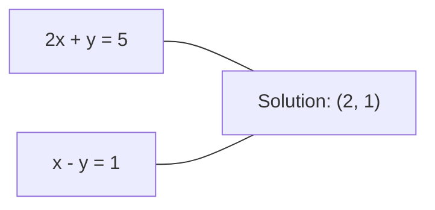
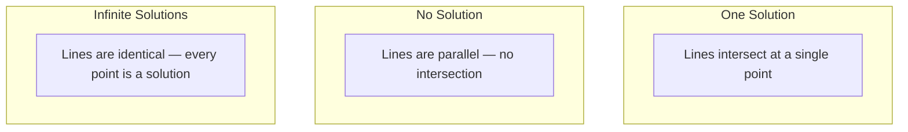

# Systemy liniowe

> Rozwiązanie Ax = b to najstarszy problem matematyczny, który wciąż napędza twoją sieć neuronową.

**Typ:** Kompilacja
**Język:** Python
**Wymagania wstępne:** Faza 1, Lekcje 01 (Intuicja algebry liniowej), 02 (Wektory i macierze), 03 (Przekształcenia macierzy)
**Czas:** ~120 minut

## Cele nauczania

- Rozwiąż Ax = b, stosując eliminację Gaussa z częściowym obracaniem i podstawieniem wstecznym
- Rozłóż macierze na czynniki za pomocą rozkładów LU, QR i Cholesky'ego i wyjaśnij, kiedy każdy z nich jest odpowiedni
- Wyprowadzić równania normalne metodą najmniejszych kwadratów i połączyć je z regresją liniową i grzbietową
- Diagnozuj źle kondycjonowane systemy za pomocą numeru stanu i stosuj regularyzację, aby je ustabilizować

## Problem

Za każdym razem, gdy ćwiczysz regresję liniową, rozwiązujesz układ liniowy. Za każdym razem, gdy obliczasz dopasowanie metodą najmniejszych kwadratów, rozwiązujesz układ liniowy. Za każdym razem, gdy warstwa sieci neuronowej wykonuje obliczenia `y = Wx + b`, ocenia jedną stronę układu liniowego. Dodając regularyzację, modyfikujesz system. Kiedy używasz procesów Gaussa, uwzględniasz macierz. Kiedy odwracamy macierz kowariancji odległości Mahalanobisa, rozwiązujemy układ liniowy.

Równanie Ax = b pojawia się wszędzie. A jest macierzą znanych współczynników. b jest wektorem znanych wyników. x jest wektorem niewiadomych, które chcesz znaleźć. W regresji liniowej A to macierz danych, b to wektor docelowy, a x to wektor wagi. Cały model sprowadza się do: znalezienia x takiego, że Ax jest jak najbliżej b.

W tej lekcji omówiono od podstaw wszystkie główne metody rozwiązywania tego równania. Zrozumiesz, dlaczego niektóre metody są szybkie, a inne stabilne, dlaczego niektóre działają tylko w przypadku systemów kwadratowych, a inne radzą sobie z nadokreślonymi metodami i dlaczego numer warunku Twojej macierzy określa, czy Twoja odpowiedź w ogóle coś znaczy.

## Koncepcja

### Co Ax = b oznacza geometrycznie

Układ równań liniowych ma interpretację geometryczną. Każde równanie definiuje hiperpłaszczyznę. Rozwiązaniem jest punkt (lub zbiór punktów), w którym przecinają się wszystkie hiperpłaszczyzny.

```
2x + y = 5          Two lines in 2D.
x - y  = 1          They intersect at x=2, y=1.
```



Mogą się wydarzyć trzy rzeczy:



W formie macierzowej „jedno rozwiązanie” oznacza, że A jest odwracalne. „Brak rozwiązania” oznacza, że ​​system jest niespójny. „Nieskończone rozwiązania” oznaczają, że A ma przestrzeń zerową. Większość problemów ML należy do kategorii „brak dokładnego rozwiązania”, ponieważ masz więcej równań (punktów danych) niż niewiadomych (parametrów). I tu właśnie pojawia się metoda najmniejszych kwadratów.

### Obraz w kolumnie a obraz w wierszu

Istnieją dwa sposoby odczytania Ax = b.

**Obraz wiersza.** Każdy wiersz A definiuje jedno równanie. Każde równanie jest hiperpłaszczyzną. Rozwiązaniem jest miejsce, w którym wszystkie się przecinają.

**Obraz kolumny.** Każda kolumna A jest wektorem. Powstaje pytanie: jaka kombinacja liniowa kolumn A daje b?

```
A = | 2  1 |    b = | 5 |
    | 1 -1 |        | 1 |

Row picture: solve 2x + y = 5 and x - y = 1 simultaneously.

Column picture: find x1, x2 such that:
  x1 * [2, 1] + x2 * [1, -1] = [5, 1]
  2 * [2, 1] + 1 * [1, -1] = [4+1, 2-1] = [5, 1]   check.
```

Obraz kolumnowy jest bardziej fundamentalny. Jeśli b leży w przestrzeni kolumn A, system ma rozwiązanie. Jeśli b nie, znajdź najbliższy punkt w przestrzeni kolumn. Ten najbliższy punkt to rozwiązanie metodą najmniejszych kwadratów.

### Eliminacja Gaussa

Eliminacja Gaussa przekształca Ax = b w górny układ trójkątny Ux = c, który rozwiązuje się przez podstawienie wsteczne. Jest to najbardziej bezpośrednia metoda.

Algorytm:

```
1. For each column k (the pivot column):
   a. Find the largest entry in column k at or below row k (partial pivoting).
   b. Swap that row with row k.
   c. For each row i below k:
      - Compute multiplier m = A[i][k] / A[k][k]
      - Subtract m times row k from row i.
2. Back substitute: solve from the last equation upward.
```

Przykład:

```
Original:
| 2  1  1 | 8 |       R2 = R2 - (2)R1     | 2  1   1 |  8 |
| 4  3  3 |20 |  -->  R3 = R3 - (1)R1 --> | 0  1   1 |  4 |
| 2  3  1 |12 |                            | 0  2   0 |  4 |

                       R3 = R3 - (2)R2     | 2  1   1 |  8 |
                                       --> | 0  1   1 |  4 |
                                           | 0  0  -2 | -4 |

Back substitute:
  -2 * x3 = -4    -->  x3 = 2
  x2 + 2  = 4     -->  x2 = 2
  2*x1 + 2 + 2 = 8 --> x1 = 2
```

Eliminacja Gaussa kosztuje O(n^3) operacji. Dla systemu 1000x1000 oznacza to około miliarda operacji zmiennoprzecinkowych. Szybko, ale możesz zrobić lepiej, jeśli chcesz rozwiązać wiele systemów za pomocą tego samego A.

### Częściowy obrót: dlaczego to ma znaczenie

Bez obracania eliminacja Gaussa może zakończyć się niepowodzeniem lub wygenerowaniem śmieci. Jeśli element obrotowy ma wartość zero, dzielisz przez zero. Jeśli jest mały, wzmacniasz błędy zaokrągleń.

```
Bad pivot:                       With partial pivoting:
| 0.001  1 | 1.001 |            Swap rows first:
| 1      1 | 2     |            | 1      1 | 2     |
                                 | 0.001  1 | 1.001 |
m = 1/0.001 = 1000              m = 0.001/1 = 0.001
R2 = R2 - 1000*R1               R2 = R2 - 0.001*R1
| 0.001  1     | 1.001   |      | 1      1     | 2     |
| 0     -999   | -999.0  |      | 0      0.999 | 0.999 |

x2 = 1.000 (correct)            x2 = 1.000 (correct)
x1 = (1.001 - 1)/0.001          x1 = (2 - 1)/1 = 1.000 (correct)
   = 0.001/0.001 = 1.000        Stable because the multiplier is small.
```

W arytmetyce zmiennoprzecinkowej z ograniczoną precyzją wersja nieobrotowa może spowodować utratę cyfr znaczących. Częściowy obrót zawsze wybiera największy dostępny obrót, aby zminimalizować wzmocnienie błędu.

### Rozkład LU

Czynniki rozkładu LU A na dolną macierz trójkątną L i górną macierz trójkątną U: A = LU. Macierz L przechowuje mnożniki z eliminacji Gaussa. Macierz U jest wynikiem eliminacji.

```
A = L @ U

| 2  1  1 |   | 1  0  0 |   | 2  1   1 |
| 4  3  3 | = | 2  1  0 | @ | 0  1   1 |
| 2  3  1 |   | 1  2  1 |   | 0  0  -2 |
```

Po co uwzględniać, a nie po prostu eliminować? Ponieważ gdy masz L i U, rozwiązanie Ax = b dla dowolnego nowego b kosztuje tylko O(n^2):

```
Ax = b
LUx = b
Let y = Ux:
  Ly = b    (forward substitution, O(n^2))
  Ux = y    (back substitution, O(n^2))
```

Koszt O(n^3) jest płacony jednorazowo podczas faktoryzacji. Każde kolejne rozwiązanie to O(n^2). Jeśli chcesz rozwiązać 1000 układów za pomocą tych samych wektorów A, ale różnych wektorów b, LU oszczędza całkowitą pracę o współczynnik 1000/3.

Przy częściowym obrocie otrzymujesz PA = LU, gdzie P jest macierzą permutacji rejestrującą zamiany wierszy.

### Rozkład QR

Czynniki rozkładu QR A na macierz ortogonalną Q i macierz trójkątną górną R: A = QR.

Macierz ortogonalna ma właściwość Q^T Q = I. Jej kolumny są wektorami ortonormalnymi. Mnożenie przez Q zachowuje długości i kąty.

```
A = Q @ R

Q has orthonormal columns: Q^T Q = I
R is upper triangular

To solve Ax = b:
  QRx = b
  Rx = Q^T b    (just multiply by Q^T, no inversion needed)
  Back substitute to get x.
```

QR jest numerycznie bardziej stabilny niż LU w rozwiązywaniu problemów metodą najmniejszych kwadratów. Proces Grama-Schmidta buduje Q kolumna po kolumnie:

```
Given columns a1, a2, ... of A:

q1 = a1 / ||a1||

q2 = a2 - (a2 . q1) * q1        (subtract projection onto q1)
q2 = q2 / ||q2||                (normalize)

q3 = a3 - (a3 . q1) * q1 - (a3 . q2) * q2
q3 = q3 / ||q3||

R[i][j] = qi . aj    for i <= j
```

Każdy krok usuwa komponent wzdłuż wszystkich poprzednich wektorów q, pozostawiając jedynie nowy kierunek ortogonalny.

### Rozkład Choleskiego

Kiedy A jest symetryczne (A = A^T) i dodatnio określone (wszystkie wartości własne są dodatnie), można to rozłożyć na czynniki jako A = L L^T, gdzie L jest dolnym trójkątem. To jest rozkład Choleskiego.

```
A = L @ L^T

| 4  2 |   | 2  0 |   | 2  1 |
| 2  5 | = | 1  2 | @ | 0  2 |

L[i][i] = sqrt(A[i][i] - sum(L[i][k]^2 for k < i))
L[i][j] = (A[i][j] - sum(L[i][k]*L[j][k] for k < j)) / L[j][j]    for i > j
```

Cholesky jest dwa razy szybszy niż LU i wymaga o połowę mniej pamięci. Działa to tylko w przypadku symetrycznych macierzy dodatnio określonych, ale te pojawiają się stale:

- Macierze kowariancji są symetryczne dodatnio półokreślone (dodatnio określone z regularyzacją).
- Macierz jądra w procesach Gaussa jest symetrycznie dodatnio określona.
- Hesjan funkcji wypukłej jest co najmniej symetrycznie dodatnio określony.
- A^T A jest zawsze symetrycznie dodatnio półokreślone.

W procesach Gaussa uwzględniasz macierz jądra K za pomocą Cholesky'ego, a następnie rozwiązujesz K alfa = y, aby uzyskać średnią predykcyjną. Współczynnik Cholesky'ego daje również wyznacznik logarytmiczny prawdopodobieństwa krańcowego: log det(K) = 2 * sum(log(diag(L))).

### Metoda najmniejszych kwadratów: gdy Ax = b nie ma dokładnego rozwiązania

Jeżeli A wynosi m x n, gdzie m > n (więcej równań niż niewiadomych), to układ jest nadokreślony. Nie ma dokładnego rozwiązania. Zamiast tego minimalizujesz błąd kwadratowy:

```
minimize ||Ax - b||^2

This is the sum of squared residuals:
  sum((A[i,:] @ x - b[i])^2 for i in range(m))
```

Minimalizator spełnia równania normalne:

```
A^T A x = A^T b
```

Wyprowadzenie: rozwiń ||Ax - b||^2 = (Ax - b)^T (Ax - b) = x^T A^T A x - 2 x^T A^T b + b^T b. Weź gradient względem x, ustaw go na zero: 2 A^T A x - 2 A^T b = 0.

```
Original system (overdetermined, 4 equations, 2 unknowns):
| 1  1 |         | 3 |
| 1  2 | x     = | 5 |       No exact x satisfies all 4 equations.
| 1  3 |         | 6 |
| 1  4 |         | 8 |

Normal equations:
A^T A = | 4  10 |    A^T b = | 22 |
        | 10 30 |            | 63 |

Solve: x = [1.5, 1.7]

This is linear regression. x[0] is the intercept, x[1] is the slope.
```

### Równania normalne = regresja liniowa

Połączenie jest dokładne. W regresji liniowej macierz danych X ma jeden wiersz na próbkę i jedną kolumnę na cechę. Twój wektor docelowy y ma jeden wpis na próbkę. Wektor wag w spełnia:

```
X^T X w = X^T y
w = (X^T X)^(-1) X^T y
```

Jest to rozwiązanie w postaci zamkniętej regresji liniowej. Każde wywołanie `sklearn.linear_model.LinearRegression.fit()` oblicza tę wartość (lub odpowiednik poprzez QR lub SVD).

Dodaj termin regularyzacyjny lambda * I do macierzy, a otrzymasz regresję grzbietową:

```
(X^T X + lambda * I) w = X^T y
w = (X^T X + lambda * I)^(-1) X^T y
```

Regularyzacja sprawia, że macierz jest lepiej kondycjonowana (łatwiej dokładnie ją odwrócić) i zapobiega nadmiernemu dopasowaniu poprzez zmniejszenie wag do zera. Macierz X^T X + lambda * I jest zawsze symetrycznie dodatnio określona, ​​gdy lambda > 0, więc możesz ją rozwiązać za pomocą Cholesky'ego.

### Pseudoodwrotność (Moore’a-Penrose’a)

Pseudoodwrotność A+ uogólnia inwersję macierzy na macierze niekwadratowe i osobliwe. Dla dowolnej macierzy A:

```
x = A+ b

where A+ = V Sigma+ U^T    (computed via SVD)
```

Sigma+ powstaje poprzez odwrotność każdej niezerowej wartości pojedynczej i transpozycję wyniku. Jeśli A = U Sigma V^T, to A+ = V Sigma+ U^T.

```
A = U Sigma V^T        (SVD)

Sigma = | 5  0 |       Sigma+ = | 1/5  0  0 |
        | 0  2 |                | 0  1/2  0 |
        | 0  0 |

A+ = V Sigma+ U^T
```

Pseudoodwrotność daje rozwiązanie metodą najmniejszych kwadratów o minimalnej normie. Jeżeli system posiada:
- Jedno rozwiązanie: A+b daje.
- Brak rozwiązania: A+ b daje rozwiązanie metodą najmniejszych kwadratów.
- Nieskończone rozwiązania: A+ b daje jedno z najmniejszym ||x||.

Zarówno `np.linalg.lstsq`, jak i `np.linalg.pinv` NumPy używają wewnętrznie SVD.

### Numer warunku

Numer warunku mierzy, jak wrażliwe jest rozwiązanie na małe zmiany na wejściu. Dla macierzy A numer warunku to:

```
kappa(A) = ||A|| * ||A^(-1)|| = sigma_max / sigma_min
```

gdzie sigma_max i sigma_min są największą i najmniejszą wartością osobliwą.

```
Well-conditioned (kappa ~ 1):        Ill-conditioned (kappa ~ 10^15):
Small change in b -->                Small change in b -->
small change in x                    huge change in x

| 2  0 |   kappa = 2/1 = 2          | 1   1          |   kappa ~ 10^15
| 0  1 |   safe to solve            | 1   1+10^(-15) |   solution is garbage
```

Praktyczne zasady:
- kappa < 100: bezpieczne, rozwiązanie jest dokładne.
- kappa ~ 10^k: tracisz około k cyfr precyzji w arytmetyce zmiennoprzecinkowej.
- kappa ~ 10^16 (dla float64): rozwiązanie nie ma sensu. Macierz jest faktycznie osobliwa.

W ML złe uwarunkowanie ma miejsce, gdy cechy są prawie współliniowe. Regularyzacja (dodanie lambda * I) poprawia numer warunku z sigma_max / sigma_min do (sigma_max + lambda) / (sigma_min + lambda).

### Metody iteracyjne: gradient sprzężony

W przypadku bardzo dużych, rzadkich systemów (miliony niewiadomych) metody bezpośrednie, takie jak LU lub Cholesky, są zbyt drogie. Metody iteracyjne przybliżają rozwiązanie, poprawiając zgadywanie w wielu iteracjach.

Gradient sprzężony (CG) rozwiązuje Ax = b, gdy A jest symetrycznie dodatnio określone. Znajduje dokładne rozwiązanie w co najwyżej n iteracjach (w dokładnej arytmetyce), ale zazwyczaj osiąga zbieżność znacznie szybciej, jeśli wartości własne A są skupione.

```
Algorithm sketch:
  x0 = initial guess (often zero)
  r0 = b - A x0           (residual)
  p0 = r0                 (search direction)

  For k = 0, 1, 2, ...:
    alpha = (rk . rk) / (pk . A pk)
    x_{k+1} = xk + alpha * pk
    r_{k+1} = rk - alpha * A pk
    beta = (r_{k+1} . r_{k+1}) / (rk . rk)
    p_{k+1} = r_{k+1} + beta * pk
    if ||r_{k+1}|| < tolerance: stop
```

CG jest używany w:
- Optymalizacja na dużą skalę (metoda Newtona-CG)
- Rozwiązywanie dyskretyzacji PDE
- Metody jądra, w których macierz jądra jest zbyt duża, aby ją uwzględnić
- Warunkowanie wstępne dla innych rozwiązań iteracyjnych

Stopień zbieżności zależy od numeru warunku. Lepiej uwarunkowane systemy łączą się szybciej, co jest kolejnym powodem, dla którego pomaga regularyzacja.

### Pełny obraz: która metoda kiedy

| Metoda | Wymagania | Koszt | Przypadek użycia |
|--------|------------|------|---------|
| Eliminacja Gaussa | Kwadrat, nieosobisty A | O(n^3) | Jednorazowe rozwiązanie układu kwadratowego |
| Rozkład LU | Kwadrat, nieosobisty A | Współczynnik O(n^3) + O(n^2) rozwiązanie | Wiele rozwiązań z tym samym A |
| Rozkład QR | Dowolne A (m >= n) | O(mn^2) | Metoda najmniejszych kwadratów, numerycznie stabilna |
| Choleski | Symetryczny dodatnio określony A | O(n^3/3) | Macierze kowariancji, procesy Gaussa, regresja grzbietowa |
| Równania normalne | Naddeterminowany (m > n) | O(mn^2 + n^3) | Regresja liniowa (małe n) |
| SVD / pseudoodwrotność | Dowolne A | O(mn^2) | Systemy z niedoborem rang, rozwiązania o minimalnych normach |
| Skoniugowany gradient | Symetryczny dodatnio określony, rzadki A | O(n * k * nnz) | Duże systemy rzadkie, k = iteracje |

### Połączenie z ML

Każda metoda opisana w tej lekcji pojawia się w produkcyjnym ML:

**Regresja liniowa.** Rozwiązanie w postaci zamkniętej rozwiązuje równania normalne X^T X w = X^T y. Odbywa się to za pomocą Cholesky'ego (jeśli n jest małe) lub QR (jeśli liczy się stabilność numeryczna) lub SVD (jeśli macierz może mieć braki w zakresie rang).

**Regresja grzbietowa.** Dodaje lambda * I do X^T X. Uregulowany układ (X^T X + lambda * I) w = X^T y jest zawsze rozwiązywalny metodą Cholesky'ego, ponieważ X^T X + lambda * I jest symetrycznie dodatnio określone dla lambda > 0.

**Procesy Gaussa.** Średnia predykcyjna wymaga rozwiązania K alfa = y, gdzie K jest macierzą jądra. Rozkład Choleskiego na czynniki K jest podejściem standardowym. Logarytm wiarygodności krańcowej wykorzystuje log det(K) = 2 sum(log(diag(L))).

**Inicjalizacja sieci neuronowej.** Inicjalizacja ortogonalna wykorzystuje rozkład QR w celu utworzenia macierzy wag, których kolumny są ortonormalne. Zapobiega to załamaniu się sygnału w głębokich sieciach.

**Kondycjonowanie wstępne.** Optymalizatory na dużą skalę wykorzystują niekompletny Cholesky'ego lub niekompletny LU jako czynniki wstępne dla solwerów z gradientem sprzężonym.

**Inżynieria cech.** Numer warunku X^T X informuje, czy cechy są współliniowe. Jeśli kappa jest duża, porzuć funkcje lub dodaj regularyzację.

## Zbuduj to

### Krok 1: Eliminacja Gaussa z częściowym obracaniem

```python
import numpy as np

def gaussian_elimination(A, b):
    n = len(b)
    Ab = np.hstack([A.astype(float), b.reshape(-1, 1).astype(float)])

    for k in range(n):
        max_row = k + np.argmax(np.abs(Ab[k:, k]))
        Ab[[k, max_row]] = Ab[[max_row, k]]

        if abs(Ab[k, k]) < 1e-12:
            raise ValueError(f"Matrix is singular or nearly singular at pivot {k}")

        for i in range(k + 1, n):
            m = Ab[i, k] / Ab[k, k]
            Ab[i, k:] -= m * Ab[k, k:]

    x = np.zeros(n)
    for i in range(n - 1, -1, -1):
        x[i] = (Ab[i, -1] - Ab[i, i+1:n] @ x[i+1:n]) / Ab[i, i]

    return x
```

### Krok 2: Rozkład LU

```python
def lu_decompose(A):
    n = A.shape[0]
    L = np.eye(n)
    U = A.astype(float).copy()
    P = np.eye(n)

    for k in range(n):
        max_row = k + np.argmax(np.abs(U[k:, k]))
        if max_row != k:
            U[[k, max_row]] = U[[max_row, k]]
            P[[k, max_row]] = P[[max_row, k]]
            if k > 0:
                L[[k, max_row], :k] = L[[max_row, k], :k]

        for i in range(k + 1, n):
            L[i, k] = U[i, k] / U[k, k]
            U[i, k:] -= L[i, k] * U[k, k:]

    return P, L, U

def lu_solve(P, L, U, b):
    n = len(b)
    Pb = P @ b.astype(float)

    y = np.zeros(n)
    for i in range(n):
        y[i] = Pb[i] - L[i, :i] @ y[:i]

    x = np.zeros(n)
    for i in range(n - 1, -1, -1):
        x[i] = (y[i] - U[i, i+1:] @ x[i+1:]) / U[i, i]

    return x
```

### Krok 3: Rozkład Choleskiego

```python
def cholesky(A):
    n = A.shape[0]
    L = np.zeros_like(A, dtype=float)

    for i in range(n):
        for j in range(i + 1):
            s = A[i, j] - L[i, :j] @ L[j, :j]
            if i == j:
                if s <= 0:
                    raise ValueError("Matrix is not positive definite")
                L[i, j] = np.sqrt(s)
            else:
                L[i, j] = s / L[j, j]

    return L
```

### Krok 4: Metoda najmniejszych kwadratów za pomocą równań normalnych

```python
def least_squares_normal(A, b):
    AtA = A.T @ A
    Atb = A.T @ b
    return gaussian_elimination(AtA, Atb)

def ridge_regression(A, b, lam):
    n = A.shape[1]
    AtA = A.T @ A + lam * np.eye(n)
    Atb = A.T @ b
    L = cholesky(AtA)
    y = np.zeros(n)
    for i in range(n):
        y[i] = (Atb[i] - L[i, :i] @ y[:i]) / L[i, i]
    x = np.zeros(n)
    for i in range(n - 1, -1, -1):
        x[i] = (y[i] - L.T[i, i+1:] @ x[i+1:]) / L.T[i, i]
    return x
```

### Krok 5: Numer warunku

```python
def condition_number(A):
    U, S, Vt = np.linalg.svd(A)
    return S[0] / S[-1]
```

## Użyj tego

Łączenie elementów w celu uzyskania regresji liniowej i regresji grzbietowej na rzeczywistych danych:

```python
np.random.seed(42)
X_raw = np.random.randn(100, 3)
w_true = np.array([2.0, -1.0, 0.5])
y = X_raw @ w_true + np.random.randn(100) * 0.1

X = np.column_stack([np.ones(100), X_raw])

w_ols = least_squares_normal(X, y)
print(f"OLS weights (ours):    {w_ols}")

w_np = np.linalg.lstsq(X, y, rcond=None)[0]
print(f"OLS weights (numpy):   {w_np}")
print(f"Max difference: {np.max(np.abs(w_ols - w_np)):.2e}")

w_ridge = ridge_regression(X, y, lam=1.0)
print(f"Ridge weights (ours):  {w_ridge}")

from sklearn.linear_model import Ridge
ridge_sk = Ridge(alpha=1.0, fit_intercept=False)
ridge_sk.fit(X, y)
print(f"Ridge weights (sklearn): {ridge_sk.coef_}")
```

## Wyślij to

Ta lekcja daje:
- `code/linear_systems.py` zawierający od podstaw implementacje eliminacji Gaussa, rozkładu LU, rozkładu Cholesky'ego, najmniejszych kwadratów i regresji grzbietowej
- Robocza demonstracja, że równania normalne i regresja liniowa Sklearna dają te same wagi

## Ćwiczenia

1. Rozwiąż układ `[[1,2,3],[4,5,6],[7,8,10]] x = [6, 15, 27]`, używając eliminacji Gaussa, modułu LU i `np.linalg.solve`. Sprawdź, czy wszystkie trzy dają tę samą odpowiedź w ramach tolerancji zmiennoprzecinkowej.

2. Wygeneruj losową macierz X 50x5 i cel y = X @ w_true + szum. Rozwiąż w, używając równań normalnych, QR (przez `np.linalg.qr`), SVD (przez `np.linalg.svd`) i `np.linalg.lstsq`. Porównaj wszystkie cztery rozwiązania. Zmierz numer warunku X^T X i wyjaśnij, jak wpływa on na metodę, której ufasz.

3. Utwórz prawie pojedynczą macierz, czyniąc dwie kolumny prawie identycznymi (np. kolumna 2 = kolumna 1 + 1e-10 * szum). Oblicz numer warunku. Rozwiąż Ax = b z regularyzacją i bez (dodaj 0,01 * I). Porównaj rozwiązania i reszty. Wyjaśnij, dlaczego regularyzacja pomaga.

4. Zaimplementuj algorytm gradientu sprzężonego dla losowej, symetrycznej, dodatnio określonej macierzy o wymiarach 100x100. Policz, ile iteracji potrzeba, aby osiągnąć tolerancję 1e-8. Porównaj z teoretycznym maksimum n iteracji.

5. Zmierz czas solwera Cholesky'ego, solwera LU i `np.linalg.solve` na symetrycznych dodatnio określonych macierzach o rozmiarach 10, 50, 200, 500. Przedstaw wyniki. Sprawdź, czy Cholesky jest około 2 razy szybszy niż LU.

## Kluczowe terminy

| Termin | Co ludzie mówią | Co to właściwie oznacza |
|------|----------------|----------------------|
| Układ liniowy | „Rozwiąż dla x” | Zbiór równań liniowych Ax = b. Znalezienie x oznacza znalezienie danych wejściowych, które dają wynik b w ramach transformacji A. |
| Eliminacja Gaussa | „Zmniejszenie wiersza” | Systematycznie zeruj wpisy poniżej przekątnej za pomocą operacji na wierszach, tworząc układ górnego trójkąta, który można rozwiązać poprzez podstawienie wsteczne. O(n^3). |
| Częściowe obracanie | „Zamień rzędy, aby uzyskać stabilność” | Przed eliminacją w kolumnie k zamień wiersz z największą wartością bezwzględną w tej kolumnie na pozycję obrotu. Zapobiega dzieleniu przez małe liczby. |
| Rozkład LU | „Rozważ trójkąty” | Zapisz A = LU, gdzie L jest dolnym trójkątem (przechowuje mnożniki), a U jest górnym trójkątem (wyeliminowana macierz). Amortyzuje koszt O(n^3) przez wiele rozwiązań. |
| Rozkład QR | „Rozkład na czynniki ortogonalne” | Zapisz A = QR, gdzie Q ma kolumny ortonormalne, a R jest trójkątem górnym. Bardziej stabilny niż LU w przypadku metody najmniejszych kwadratów. |
| Rozkład Choleskiego | „Pierwiastek kwadratowy macierzy” | Dla symetrycznego dodatnio określonego A zapisz A = LL^T. Połowa ceny LU. Używany do macierzy kowariancji, macierzy jądra i regresji grzbietowej. |
| Najmniejsze kwadraty | „Najlepsze dopasowanie, gdy dokładność jest niemożliwa” | Minimalizuj sumę kwadratów reszt ||Ax - b||^2, gdy układ jest nadokreślony (więcej równań niż niewiadomych). |
| Równania normalne | „Skrót rachunku różniczkowego” | A^T A x = A^T b. Ustawienie gradientu ||Ax - b||^2 na zero. Jest to zamknięte rozwiązanie regresji liniowej. |
| Pseudoodwrotność | „Inwersja dla macierzy niekwadratowych” | A+ = V Sigma+ U^T przez SVD. Podaje rozwiązanie metodą najmniejszych kwadratów o minimalnej normie dla dowolnej macierzy, kwadratowej lub prostokątnej, pojedynczej lub nie. |
| Numer warunku | „Jak wiarygodna jest ta odpowiedź” | kappa = sigma_max / sigma_min. Mierzy wrażliwość na zakłócenia wejściowe. Strać około log10 (kappa) cyfr precyzji. |
| Regresja grzbietu | „Uregulowane metody najmniejszych kwadratów” | Rozwiąż (X^T X + lambda I) w = X^T y. Dodanie lambda I poprawia kondycjonowanie i zmniejsza ciężary do zera. Zapobiega nadmiernemu dopasowaniu. |
| Skoniugowany gradient | „Iteracyjny Ax=b dla dużych macierzy” | Rozwiązanie iteracyjne dla symetrycznych układów dodatnio określonych. Zbiega się w co najwyżej n krokach. Praktyczne w przypadku dużych, rzadkich systemów, w których faktoryzacja jest zbyt kosztowna. |
| System przedeterminowany | „Więcej danych niż parametrów” | m > n w układzie m na n. Nie ma dokładnego rozwiązania. Metoda najmniejszych kwadratów pozwala znaleźć najlepsze przybliżenie. To jest każdy problem regresji. |
| Zmiana z tyłu | „Rozwiązuj od dołu do góry” | Mając układ trójkąta górnego, rozwiąż najpierw ostatnie równanie, a następnie podstaw od tyłu. O(n^2). |
| Zmiana napastnika | „Rozwiąż od góry do dołu” | Biorąc pod uwagę dolny układ trójkątny, najpierw rozwiąż pierwsze równanie, a następnie podstaw dalej. O(n^2). Używany w kroku L rozwiązań LU. |

## Dalsze czytanie

- [MIT 18.06: Algebra liniowa](https://ocw.mit.edu/courses/18-06-linear-algebra-spring-2010/) (Gilbert Strang) – ostateczny kurs na temat układów liniowych i faktoryzacji macierzy
– [Numeryczna algebra liniowa](https://people.maths.ox.ac.uk/trefethen/text.html) (Trefethen i Bau) – standardowe źródło informacji pomagające zrozumieć stabilność numeryczną, warunkowanie i przyczyny niepowodzeń algorytmów
– [Obliczenia macierzowe](https://www.cs.cornell.edu/cv/GolubVanLoan4/golubandvanloan.htm) (Golub & Van Loan) – encyklopedyczne odniesienie do każdego algorytmu macierzowego
- [3Blue1Brown: Macierze odwrotne](https://www.3blue1brown.com/lessons/inverse-matrices) -- wizualna intuicja pokazująca, co geometrycznie oznacza rozwiązanie Ax = b