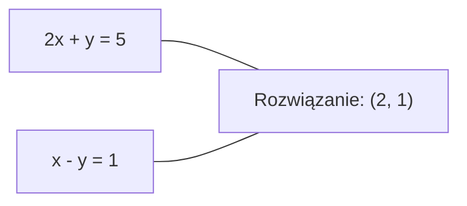
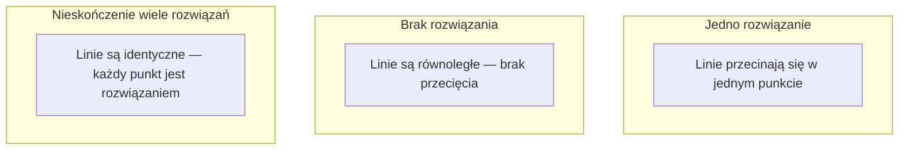

# Układy liniowe

> Rozwiązywanie Ax = b to najstarszy problem matematyki, który wciąż napędza Twoją sieć neuronową.

**Typ:** Build
**Język:** Python
**Wymagania wstępne:** Faza 1, lekcje 01 (Intuicja algebry liniowej), 02 (Wektory i macierze), 03 (Transformacje macierzowe)
**Czas:** ~120 minut

## Cele nauki

- Rozwiązywanie Ax = b za pomocą eliminacji Gaussa z częściowym pivotowaniem i podstawiania wstecz
- Faktoryzacja macierzy metodami LU, QR i Cholesky'ego oraz wyjaśnienie, kiedy każda z nich jest właściwa
- Wyprowadzenie równań normalnych dla najmniejszych kwadratów i powiązanie ich z regresją liniową i grzbietową (ridge)
- Diagnozowanie źle uwarunkowanych układów za pomocą wskaźnika uwarunkowania i stosowanie regularyzacji w celu ich stabilizacji

## Problem

Każdy raz, gdy trenujesz regresję liniową, rozwiązujesz układ liniowy. Każdy raz, gdy obliczasz dopasowanie metodą najmniejszych kwadratów, rozwiązujesz układ liniowy. Każdy raz, gdy warstwa sieci neuronowej oblicza `y = Wx + b`, ewaluuje jedną stronę układu liniowego. Gdy dodajesz regularyzację, modyfikujesz układ. Gdy używasz procesów Gaussa, faktoryzujesz macierz. Gdy odwracasz macierz kowariancji w celu obliczenia odległości Mahalanobisa, rozwiązujesz układ liniowy.

Równanie Ax = b pojawia się wszędzie. A to macierz znanych współczynników. b to wektor znanych wyjść. x to wektor niewiadomych, które chcesz znaleźć. W regresji liniowej A jest Twoją macierzą danych, b jest wektorem celów, a x jest wektorem wag. Cały model sprowadza się do: znajdź x takie, że Ax jest jak najbliższe b.

Ta lekcja buduje od zera każdą główną metodę rozwiązywania tego równania. Zrozumiesz, dlaczego niektóre metody są szybkie, a inne stabilne, dlaczego niektóre działają tylko dla układów kwadratowych, a inne obsługują układy nadokreślone, oraz dlaczego wskaźnik uwarunkowania Twojej macierzy decyduje o tym, czy Twoja odpowiedź ma jakikolwiek sens.

## Koncepcja

### Co geometrycznie oznacza Ax = b

Układ równań liniowych ma interpretację geometryczną. Każde równanie definiuje hiperpłaszczyznę. Rozwiązaniem jest punkt (lub zbiór punktów), w którym przecinają się wszystkie hiperpłaszczyzny.

```
2x + y = 5          Dwie linie w 2D.
x - y  = 1          Przecinają się w x=2, y=1.
```



Mogą zdarzyć się trzy sytuacje:



W postaci macierzowej "jedno rozwiązanie" oznacza, że A jest odwracalna. "Brak rozwiązania" oznacza, że układ jest niezgodny (sprzeczny). "Nieskończenie wiele rozwiązań" oznacza, że A ma jądro (null space). Większość problemów ML wpada w kategorię "brak rozwiązania dokładnego", ponieważ masz więcej równań (punktów danych) niż niewiadomych (parametrów). Tutaj wkracza metoda najmniejszych kwadratów.

### Obraz kolumnowy vs obraz wierszowy

Istnieją dwa sposoby odczytania Ax = b.

**Obraz wierszowy.** Każdy wiersz A definiuje jedno równanie. Każde równanie jest hiperpłaszczyzną. Rozwiązaniem jest miejsce, w którym wszystkie się przecinają.

**Obraz kolumnowy.** Każda kolumna A jest wektorem. Pytanie staje się: jaka kombinacja liniowa kolumn A daje b?

```
A = | 2  1 |    b = | 5 |
    | 1 -1 |        | 1 |

Obraz wierszowy: rozwiąż 2x + y = 5 oraz x - y = 1 jednocześnie.

Obraz kolumnowy: znajdź x1, x2 takie, że:
  x1 * [2, 1] + x2 * [1, -1] = [5, 1]
  2 * [2, 1] + 1 * [1, -1] = [4+1, 2-1] = [5, 1]   sprawdzenie.
```

Obraz kolumnowy jest bardziej fundamentalny. Jeśli b leży w przestrzeni kolumnowej A, układ ma rozwiązanie. Jeśli b nie leży w tej przestrzeni, znajdujesz najbliższy punkt w przestrzeni kolumnowej. Ten najbliższy punkt jest rozwiązaniem najmniejszych kwadratów.

### Eliminacja Gaussa

Eliminacja Gaussa przekształca Ax = b w górnotrójkątny układ Ux = c, który rozwiązujesz przez podstawianie wstecz. To najbardziej bezpośrednia metoda.

Algorytm:

```
1. Dla każdej kolumny k (kolumny pivota):
   a. Znajdź największy element w kolumnie k w wierszu k lub poniżej (częściowe pivotowanie).
   b. Zamień ten wiersz z wierszem k.
   c. Dla każdego wiersza i poniżej k:
      - Oblicz mnożnik m = A[i][k] / A[k][k]
      - Odejmij m razy wiersz k od wiersza i.
2. Podstawianie wstecz: rozwiąż od ostatniego równania wzwyż.
```

Przykład:

```
Oryginał:
| 2  1  1 | 8 |       R2 = R2 - (2)R1     | 2  1   1 |  8 |
| 4  3  3 |20 |  -->  R3 = R3 - (1)R1 --> | 0  1   1 |  4 |
| 2  3  1 |12 |                            | 0  2   0 |  4 |

                       R3 = R3 - (2)R2     | 2  1   1 |  8 |
                                       --> | 0  1   1 |  4 |
                                           | 0  0  -2 | -4 |

Podstawianie wstecz:
  -2 * x3 = -4    -->  x3 = 2
  x2 + 2  = 4     -->  x2 = 2
  2*x1 + 2 + 2 = 8 --> x1 = 2
```

Eliminacja Gaussa kosztuje O(n^3) operacji. Dla układu 1000x1000 to około miliarda operacji zmiennoprzecinkowych. Szybko, ale można zrobić lepiej, jeśli trzeba rozwiązać wiele układów z tym samym A.

### Częściowe pivotowanie: dlaczego ma znaczenie

Bez pivotowania eliminacja Gaussa może zawieść lub dać bezsensowne wyniki. Jeśli element pivota jest zerem, dzielisz przez zero. Jeśli jest mały, wzmacniasz błędy zaokrągleń.

```
Zły pivot:                        Z częściowym pivotowaniem:
| 0.001  1 | 1.001 |             Najpierw zamień wiersze:
| 1      1 | 2     |             | 1      1 | 2     |
                                  | 0.001  1 | 1.001 |
m = 1/0.001 = 1000               m = 0.001/1 = 0.001
R2 = R2 - 1000*R1                R2 = R2 - 0.001*R1
| 0.001  1     | 1.001   |       | 1      1     | 2     |
| 0     -999   | -999.0  |       | 0      0.999 | 0.999 |

x2 = 1.000 (poprawnie)           x2 = 1.000 (poprawnie)
x1 = (1.001 - 1)/0.001           x1 = (2 - 1)/1 = 1.000 (poprawnie)
   = 0.001/0.001 = 1.000         Stabilne, bo mnożnik jest mały.
```

W arytmetyce zmiennoprzecinkowej o ograniczonej precyzji wersja bez pivotowania może utracić istotne cyfry. Częściowe pivotowanie zawsze wybiera największy dostępny pivot, aby zminimalizować wzmocnienie błędu.

### Dekompozycja LU

Dekompozycja LU faktoryzuje A na dolnotrójkątną macierz L i górnotrójkątną macierz U: A = LU. Macierz L przechowuje mnożniki z eliminacji Gaussa. Macierz U jest wynikiem eliminacji.

```
A = L @ U

| 2  1  1 |   | 1  0  0 |   | 2  1   1 |
| 4  3  3 | = | 2  1  0 | @ | 0  1   1 |
| 2  3  1 |   | 1  2  1 |   | 0  0  -2 |
```

Dlaczego faktoryzować, a nie po prostu eliminować? Ponieważ gdy masz już L i U, rozwiązanie Ax = b dla każdego nowego b kosztuje tylko O(n^2):

```
Ax = b
LUx = b
Niech y = Ux:
  Ly = b    (podstawianie w przód, O(n^2))
  Ux = y    (podstawianie wstecz, O(n^2))
```

Koszt O(n^3) płaci się jednorazowo podczas faktoryzacji. Każde kolejne rozwiązanie kosztuje O(n^2). Jeśli trzeba rozwiązać 1000 układów z tym samym A, ale różnymi wektorami b, LU oszczędza czynnik 1000/3 całkowitej pracy.

Z częściowym pivotowaniem otrzymujemy PA = LU, gdzie P jest macierzą permutacji rejestrującą zamiany wierszy.

### Dekompozycja QR

Dekompozycja QR faktoryzuje A na macierz ortogonalną Q i górnotrójkątną macierz R: A = QR.

Macierz ortogonalna ma własność Q^T Q = I. Jej kolumny są wektorami ortonormalnymi. Mnożenie przez Q zachowuje długości i kąty.

```
A = Q @ R

Q ma kolumny ortonormalne: Q^T Q = I
R jest górnotrójkątna

Aby rozwiązać Ax = b:
  QRx = b
  Rx = Q^T b    (po prostu pomnóż przez Q^T, bez odwracania)
  Podstaw wstecz, aby uzyskać x.
```

QR jest numerycznie bardziej stabilna niż LU przy rozwiązywaniu problemów najmniejszych kwadratów. Proces Gram-Schmidta buduje kolumnę Q po kolumnie:

```
Dla kolumn a1, a2, ... macierzy A:

q1 = a1 / ||a1||

q2 = a2 - (a2 . q1) * q1        (odejmij projekcję na q1)
q2 = q2 / ||q2||                (normalizuj)

q3 = a3 - (a3 . q1) * q1 - (a3 . q2) * q2
q3 = q3 / ||q3||

R[i][j] = qi . aj    dla i <= j
```

Każdy krok usuwa składową wzdłuż wszystkich poprzednich wektorów q, pozostawiając tylko nowy, ortogonalny kierunek.

### Dekompozycja Cholesky'ego

Gdy A jest symetryczna (A = A^T) i dodatnio określona (wszystkie wartości własne są pozytywne), można ją faktoryzować jako A = L L^T, gdzie L jest dolnotrójkątna. To dekompozycja Cholesky'ego.

```
A = L @ L^T

| 4  2 |   | 2  0 |   | 2  1 |
| 2  5 | = | 1  2 | @ | 0  2 |

L[i][i] = sqrt(A[i][i] - sum(L[i][k]^2 for k < i))
L[i][j] = (A[i][j] - sum(L[i][k]*L[j][k] for k < j)) / L[j][j]    dla i > j
```

Cholesky jest dwa razy szybsza niż LU i wymaga połowy pamięci. Działa tylko dla symetrycznych macierzy dodatnio określonych, ale takie macierze pojawiają się nieustannie:

- Macierze kowariancji są symetryczne i dodatnio semiokreślone (dodatnio określone po regularyzacji).
- Macierz jądra (kernel) w procesach Gaussa jest symetryczna i dodatnio określona.
- Hesjan funkcji wypukłej w minimum jest symetryczny i dodatnio określony.
- A^T A jest zawsze symetryczna i dodatnio semiokreślona.

W procesach Gaussa faktoryzujesz macierz jądra K za pomocą Cholesky'ego, a następnie rozwiązujesz K alpha = y, aby uzyskać średnią predykcyjną. Faktor Cholesky'ego daje również logarytm wyznacznika potrzebny do wiarygodności marginalnej: log det(K) = 2 * sum(log(diag(L))).

### Najmniejsze kwadraty: gdy Ax = b nie ma rozwiązania dokładnego

Jeśli A jest m x n z m > n (więcej równań niż niewiadomych), układ jest nadokreślony. Nie istnieje rozwiązanie dokładne. Zamiast tego minimalizujesz błąd kwadratowy:

```
minimalizuj ||Ax - b||^2

To suma kwadratów residuów:
  sum((A[i,:] @ x - b[i])^2 for i in range(m))
```

Minimizator spełnia równania normalne:

```
A^T A x = A^T b
```

Wyprowadzenie: rozwiń ||Ax - b||^2 = (Ax - b)^T (Ax - b) = x^T A^T A x - 2 x^T A^T b + b^T b. Weź gradient względem x i przyrównaj go do zera: 2 A^T A x - 2 A^T b = 0.

```
Oryginalny układ (nadokreślony, 4 równania, 2 niewiadome):
| 1  1 |         | 3 |
| 1  2 | x     = | 5 |       Brak dokładnego x spełniającego wszystkie 4 równania.
| 1  3 |         | 6 |
| 1  4 |         | 8 |

Równania normalne:
A^T A = | 4  10 |    A^T b = | 22 |
        | 10 30 |            | 63 |

Rozwiązanie: x = [1.5, 1.7]

To jest regresja liniowa. x[0] to wyraz wolny (intercept), x[1] to nachylenie (slope).
```

### Równania normalne = regresja liniowa

Powiązanie jest dokładne. W regresji liniowej Twoja macierz danych X ma jeden wiersz na próbkę i jedną kolumnę na cechę. Twój wektor celów y ma jeden wpis na próbkę. Wektor wag w spełnia:

```
X^T X w = X^T y
w = (X^T X)^(-1) X^T y
```

To rozwiązanie w postaci zamkniętej dla regresji liniowej. Każde wywołanie `sklearn.linear_model.LinearRegression.fit()` oblicza to (lub równoważnik przez QR lub SVD).

Dodaj człon regularyzacyjny lambda * I do macierzy i otrzymasz regresję grzbietową (ridge):

```
(X^T X + lambda * I) w = X^T y
w = (X^T X + lambda * I)^(-1) X^T y
```

Regularyzacja powoduje, że macierz jest lepiej uwarunkowana (łatwiejsza do dokładnego odwrócenia) i zapobiega przeuczeniu, ściągając wagi w stronę zera. Macierz X^T X + lambda * I jest zawsze symetryczna i dodatnio określona, gdy lambda > 0, więc można ją rozwiązać za pomocą Cholesky'ego.

### Pseudoodwrotność (Moore-Penrose)

Pseudoodwrotność A+ generalizuje odwracanie macierzy na macierze niekwadratowe i singularne. Dla każdej macierzy A:

```
x = A+ b

gdzie A+ = V Sigma+ U^T    (obliczone przez SVD)
```

Sigma+ jest tworzona przez odwrócenie odwrotności każdej niezerowej wartości singularnej i transpozycję wyniku. Jeśli A = U Sigma V^T, to A+ = V Sigma+ U^T.

```
A = U Sigma V^T        (SVD)

Sigma = | 5  0 |       Sigma+ = | 1/5  0  0 |
        | 0  2 |                | 0  1/2  0 |
        | 0  0 |

A+ = V Sigma+ U^T
```

Pseudoodwrotność daje rozwiązanie najmniejszych kwadratów o minimalnej normie. Jeśli układ ma:
- Jedno rozwiązanie: A+ b daje je.
- Brak rozwiązania: A+ b daje rozwiązanie najmniejszych kwadratów.
- Nieskończenie wiele rozwiązań: A+ b daje to z najmniejszym ||x||.

`np.linalg.lstsq` i `np.linalg.pinv` z NumPy wewnętrznie korzystają z SVD.

### Wskaźnik uwarunkowania (condition number)

Wskaźnik uwarunkowania mierzy, jak czułe jest rozwiązanie na małe zmiany w danych wejściowych. Dla macierzy A wskaźnik uwarunkowania to:

```
kappa(A) = ||A|| * ||A^(-1)|| = sigma_max / sigma_min
```

gdzie sigma_max i sigma_min to największa i najmniejsza wartość singularna.

```
Dobrze uwarunkowana (kappa ~ 1):     Źle uwarunkowana (kappa ~ 10^15):
Mała zmiana w b -->                  Mała zmiana w b -->
mała zmiana w x                      ogromna zmiana w x

| 2  0 |   kappa = 2/1 = 2          | 1   1          |   kappa ~ 10^15
| 0  1 |   bezpieczna do rozwiązania | 1   1+10^(-15) |   rozwiązanie jest bezsensowne
```

Reguły praktyczne:
- kappa < 100: bezpieczne, rozwiązanie jest dokładne.
- kappa ~ 10^k: tracisz około k cyfr precyzji wynikających z arytmetyki zmiennoprzecinkowej.
- kappa ~ 10^16 (dla float64): rozwiązanie jest bezsensowne. Macierz jest efektywnie singularna.

W ML źle uwarunkowanie zdarza się, gdy cechy są prawie współliniowe. Regularyzacja (dodanie lambda * I) poprawia wskaźnik uwarunkowania z sigma_max / sigma_min do (sigma_max + lambda) / (sigma_min + lambda).

### Metody iteracyjne: gradient sprzężony

Dla bardzo dużych rzadkich układów (miliony niewiadomych) metody bezpośrednie takie jak LU lub Cholesky są za drogie. Metody iteracyjne aproksymują rozwiązanie, poprawiając zgadnięte rozwiązanie na przestrzeni wielu iteracji.

Metoda gradientu sprzężonego (CG, conjugate gradient) rozwiązuje Ax = b, gdy A jest symetryczna i dodatnio określona. Znajduje dokładne rozwiązanie w co najwyżej n iteracjach (w arytmetyce dokładnej), ale zazwyczaj zbiega znacznie szybciej, jeśli wartości własne A są skupione.

```
Szkic algorytmu:
  x0 = wstępne zgadnięcie (często zero)
  r0 = b - A x0           (residuum)
  p0 = r0                 (kierunek poszukiwań)

  Dla k = 0, 1, 2, ...:
    alpha = (rk . rk) / (pk . A pk)
    x_{k+1} = xk + alpha * pk
    r_{k+1} = rk - alpha * A pk
    beta = (r_{k+1} . r_{k+1}) / (rk . rk)
    p_{k+1} = r_{k+1} + beta * pk
    jeśli ||r_{k+1}|| < tolerancja: zatrzymaj
```

CG jest używany w:
- Optymalizacji wielkoskalowej (metoda Newtona-CG)
- Rozwiązywaniu dyskretyzacji PDE (równań różniczkowych częściowych)
- Metodach jądrowych (kernel), gdzie macierz jądra jest za duża do faktoryzacji
- Preconditioningu dla innych solwerów iteracyjnych

Szybkość zbieżności zależy od wskaźnika uwarunkowania. Lepiej uwarunkowane układy zbiegają szybciej, co jest kolejnym powodem, dla którego regularyzacja pomaga.

### Pełny obraz: która metoda kiedy

| Metoda | Wymagania | Koszt | Przypadek użycia |
|--------|-------------|------|----------|
| Eliminacja Gaussa | Kwadratowa, nieosobliwa A | O(n^3) | Jednorazowe rozwiązanie układu kwadratowego |
| Dekompozycja LU | Kwadratowa, nieosobliwa A | O(n^3) faktoryzacja + O(n^2) rozwiązanie | Wielokrotne rozwiązania z tym samym A |
| Dekompozycja QR | Każda A (m >= n) | O(mn^2) | Najmniejsze kwadraty, numerycznie stabilna |
| Cholesky | Symetryczna dodatnio określona A | O(n^3/3) | Macierze kowariancji, procesy Gaussa, regresja grzbietowa |
| Równania normalne | Nadokreślony (m > n) | O(mn^2 + n^3) | Regresja liniowa (małe n) |
| SVD / pseudoodwrotność | Każda A | O(mn^2) | Układy o niepełnym rzędzie, rozwiązania o minimalnej normie |
| Gradient sprzężony | Symetryczna dodatnio określona, rzadka A | O(n * k * nnz) | Duże rzadkie układy, k = liczba iteracji |

### Powiązanie z ML

Każda metoda z tej lekcji pojawia się w produkcyjnym ML:

**Regresja liniowa.** Rozwiązanie w postaci zamkniętej rozwiązuje równania normalne X^T X w = X^T y. Robi się to za pomocą Cholesky'ego (jeśli n jest małe) lub QR (jeśli liczy się stabilność numeryczna) lub SVD (jeśli macierz może mieć niepełny rząd).

**Regresja grzbietowa (ridge).** Dodaje lambda * I do X^T X. Zregularyzowany układ (X^T X + lambda * I) w = X^T y jest zawsze rozwiązywalny za pomocą Cholesky'ego, ponieważ X^T X + lambda * I jest symetryczna i dodatnio określona dla lambda > 0.

**Procesy Gaussa.** Średnia predykcyjna wymaga rozwiązania K alpha = y, gdzie K jest macierzą jądra. Faktoryzacja Cholesky'ego macierzy K jest standardowym podejściem. Logarytm wiarygodności marginalnej wykorzystuje log det(K) = 2 sum(log(diag(L))).

**Inicjalizacja sieci neuronowych.** Inicjalizacja ortogonalna wykorzystuje dekompozycję QR do tworzenia macierzy wag, których kolumny są ortonormalne. Zapobiega to zapadaniu się sygnału (signal collapse) w głębokich sieciach.

**Preconditioning.** Wielkoskalowe optymalizatory używają niepełnej Cholesky'ego lub niepełnej LU jako preconditionerów dla solwerów gradientu sprzężonego.

**Inżynieria cech (feature engineering).** Wskaźnik uwarunkowania X^T X mówi, czy Twoje cechy są współliniowe. Jeśli kappa jest duża, usuń cechy lub dodaj regularyzację.

## Zbuduj to

### Krok 1: Eliminacja Gaussa z częściowym pivotowaniem

```python
import numpy as np

def gaussian_elimination(A, b):
    n = len(b)
    Ab = np.hstack([A.astype(float), b.reshape(-1, 1).astype(float)])

    for k in range(n):
        max_row = k + np.argmax(np.abs(Ab[k:, k]))
        Ab[[k, max_row]] = Ab[[max_row, k]]

        if abs(Ab[k, k]) < 1e-12:
            raise ValueError(f"Matrix is singular or nearly singular at pivot {k}")

        for i in range(k + 1, n):
            m = Ab[i, k] / Ab[k, k]
            Ab[i, k:] -= m * Ab[k, k:]

    x = np.zeros(n)
    for i in range(n - 1, -1, -1):
        x[i] = (Ab[i, -1] - Ab[i, i+1:n] @ x[i+1:n]) / Ab[i, i]

    return x
```

### Krok 2: Dekompozycja LU

```python
def lu_decompose(A):
    n = A.shape[0]
    L = np.eye(n)
    U = A.astype(float).copy()
    P = np.eye(n)

    for k in range(n):
        max_row = k + np.argmax(np.abs(U[k:, k]))
        if max_row != k:
            U[[k, max_row]] = U[[max_row, k]]
            P[[k, max_row]] = P[[max_row, k]]
            if k > 0:
                L[[k, max_row], :k] = L[[max_row, k], :k]

        for i in range(k + 1, n):
            L[i, k] = U[i, k] / U[k, k]
            U[i, k:] -= L[i, k] * U[k, k:]

    return P, L, U

def lu_solve(P, L, U, b):
    n = len(b)
    Pb = P @ b.astype(float)

    y = np.zeros(n)
    for i in range(n):
        y[i] = Pb[i] - L[i, :i] @ y[:i]

    x = np.zeros(n)
    for i in range(n - 1, -1, -1):
        x[i] = (y[i] - U[i, i+1:] @ x[i+1:]) / U[i, i]

    return x
```

### Krok 3: Dekompozycja Cholesky'ego

```python
def cholesky(A):
    n = A.shape[0]
    L = np.zeros_like(A, dtype=float)

    for i in range(n):
        for j in range(i + 1):
            s = A[i, j] - L[i, :j] @ L[j, :j]
            if i == j:
                if s <= 0:
                    raise ValueError("Matrix is not positive definite")
                L[i, j] = np.sqrt(s)
            else:
                L[i, j] = s / L[j, j]

    return L
```

### Krok 4: Najmniejsze kwadraty przez równania normalne

```python
def least_squares_normal(A, b):
    AtA = A.T @ A
    Atb = A.T @ b
    return gaussian_elimination(AtA, Atb)

def ridge_regression(A, b, lam):
    n = A.shape[1]
    AtA = A.T @ A + lam * np.eye(n)
    Atb = A.T @ b
    L = cholesky(AtA)
    y = np.zeros(n)
    for i in range(n):
        y[i] = (Atb[i] - L[i, :i] @ y[:i]) / L[i, i]
    x = np.zeros(n)
    for i in range(n - 1, -1, -1):
        x[i] = (y[i] - L.T[i, i+1:] @ x[i+1:]) / L.T[i, i]
    return x
```

### Krok 5: Wskaźnik uwarunkowania

```python
def condition_number(A):
    U, S, Vt = np.linalg.svd(A)
    return S[0] / S[-1]
```

## Użyj tego

Złóżmy elementy w całość dla regresji liniowej i grzbietowej na rzeczywistych danych:

```python
np.random.seed(42)
X_raw = np.random.randn(100, 3)
w_true = np.array([2.0, -1.0, 0.5])
y = X_raw @ w_true + np.random.randn(100) * 0.1

X = np.column_stack([np.ones(100), X_raw])

w_ols = least_squares_normal(X, y)
print(f"OLS weights (ours):    {w_ols}")

w_np = np.linalg.lstsq(X, y, rcond=None)[0]
print(f"OLS weights (numpy):   {w_np}")
print(f"Max difference: {np.max(np.abs(w_ols - w_np)):.2e}")

w_ridge = ridge_regression(X, y, lam=1.0)
print(f"Ridge weights (ours):  {w_ridge}")

from sklearn.linear_model import Ridge
ridge_sk = Ridge(alpha=1.0, fit_intercept=False)
ridge_sk.fit(X, y)
print(f"Ridge weights (sklearn): {ridge_sk.coef_}")
```

## Wypchnij to

Ta lekcja tworzy:
- `code/linear_systems.py` zawierający implementacje od zera eliminacji Gaussa, dekompozycji LU, dekompozycji Cholesky'ego, najmniejszych kwadratów i regresji grzbietowej
- Działającą demonstrację, że równania normalne i sklearn-owe LinearRegression dają te same wagi

## Ćwiczenia

1. Rozwiąż układ `[[1,2,3],[4,5,6],[7,8,10]] x = [6, 15, 27]` za pomocą swojej eliminacji Gaussa, swojego solwera LU oraz `np.linalg.solve`. Zweryfikuj, że wszystkie trzy dają tę samą odpowiedź w granicach tolerancji zmiennoprzecinkowej.

2. Wygeneruj losową macierz 50x5 X oraz cel y = X @ w_true + szum. Rozwiąż dla w za pomocą równań normalnych, QR (przez `np.linalg.qr`), SVD (przez `np.linalg.svd`) oraz `np.linalg.lstsq`. Porównaj wszystkie cztery rozwiązania. Zmierz wskaźnik uwarunkowania X^T X i wyjaśnij, jak wpływa on na to, której metodzie ufasz.

3. Stwórz macierz prawie singularną, sprawiając, że dwie kolumny są prawie identyczne (np. kolumna 2 = kolumna 1 + 1e-10 * szum). Oblicz jej wskaźnik uwarunkowania. Rozwiąż Ax = b z regularyzacją i bez niej (dodaj 0.01 * I). Porównaj rozwiązania i residua. Wyjaśnij, dlaczego regularyzacja pomaga.

4. Zaimplementuj algorytm gradientu sprzężonego dla losowej symetrycznej dodatnio określonej macierzy 100x100. Policz, ile iteracji zajmuje zbieżność do tolerancji 1e-8. Porównaj z teoretycznym maksimum n iteracji.

5. Zmierz czas swojego solwera Cholesky'ego vs swojego solwera LU vs `np.linalg.solve` na symetrycznych dodatnio określonych macierzach o rozmiarach 10, 50, 200, 500. Wykreśl wyniki. Zweryfikuj, że Cholesky jest około 2x szybsza niż LU.

## Kluczowe terminy

| Termin | Co ludzie mówią | Co to faktycznie znaczy |
|------|----------------|----------------------|
| Linear system (układ liniowy) | "Rozwiąż dla x" | Zbiór równań liniowych Ax = b. Znalezienie x oznacza znalezienie wejścia, które produkuje wyjście b pod transformacją A. |
| Gaussian elimination (eliminacja Gaussa) | "Redukcja wierszowa" | Systematyczne zerowanie wpisów poniżej przekątnej za pomocą operacji wierszowych, dające górnotrójkątny układ rozwiązywalny przez podstawianie wstecz. O(n^3). |
| Partial pivoting (częściowe pivotowanie) | "Zamieniaj wiersze dla stabilności" | Przed eliminacją w kolumnie k, zamień wiersz z największą wartością absolutną w tej kolumnie na pozycję pivota. Zapobiega dzieleniu przez małe liczby. |
| LU decomposition (dekompozycja LU) | "Faktoryzuj na trójkąty" | Zapisz A = LU, gdzie L jest dolnotrójkątna (przechowuje mnożniki) a U jest górnotrójkątna (macierz wyeliminowana). Amortyzuje koszt O(n^3) na wiele rozwiązań. |
| QR decomposition (dekompozycja QR) | "Faktoryzacja ortogonalna" | Zapisz A = QR, gdzie Q ma ortonormalne kolumny a R jest górnotrójkątna. Bardziej stabilna niż LU dla najmniejszych kwadratów. |
| Cholesky decomposition (dekompozycja Cholesky'ego) | "Pierwiastek kwadratowy macierzy" | Dla symetrycznej dodatnio określonej A, zapisz A = LL^T. Połowa kosztu LU. Używana dla macierzy kowariancji, macierzy jądra i regresji grzbietowej. |
| Least squares (najmniejsze kwadraty) | "Najlepsze dopasowanie, gdy dokładne jest niemożliwe" | Minimalizuj sumę kwadratów residuów ||Ax - b||^2, gdy układ jest nadokreślony (więcej równań niż niewiadomych). |
| Normal equations (równania normalne) | "Skrót przez rachunek różniczkowy" | A^T A x = A^T b. Przyrównanie gradientu ||Ax - b||^2 do zera. To JEST rozwiązanie w postaci zamkniętej dla regresji liniowej. |
| Pseudoinverse (pseudoodwrotność) | "Odwracanie dla macierzy niekwadratowych" | A+ = V Sigma+ U^T przez SVD. Daje rozwiązanie najmniejszych kwadratów o minimalnej normie dla każdej macierzy, kwadratowej lub prostokątnej, singularnej lub nie. |
| Condition number (wskaźnik uwarunkowania) | "Jak wiarygodna jest ta odpowiedź" | kappa = sigma_max / sigma_min. Mierzy czułość na zaburzenia wejściowe. Tracisz około log10(kappa) cyfr precyzji. |
| Ridge regression (regresja grzbietowa) | "Zregularyzowane najmniejsze kwadraty" | Rozwiąż (X^T X + lambda I) w = X^T y. Dodanie lambda I poprawia uwarunkowanie i zmniejsza wagi w stronę zera. Zapobiega przeuczeniu. |
| Conjugate gradient (gradient sprzężony) | "Iteracyjne Ax=b dla dużych macierzy" | Iteracyjny solwer dla symetrycznych dodatnio określonych układów. Zbiega w co najwyżej n krokach. Praktyczny dla dużych rzadkich układów, gdzie faktoryzacja jest za droga. |
| Overdetermined system (układ nadokreślony) | "Więcej danych niż parametrów" | m > n w układzie m-na-n. Nie istnieje dokładne rozwiązanie. Najmniejsze kwadraty znajdują najlepszą aproksymację. To każdy problem regresji. |
| Back substitution (podstawianie wstecz) | "Rozwiązuj od dołu do góry" | Dla danego układu górnotrójkątnego, rozwiąż ostatnie równanie pierwsze, a następnie podstawiaj wstecz. O(n^2). |
| Forward substitution (podstawianie w przód) | "Rozwiązuj od góry do dołu" | Dla danego układu dolnotrójkątnego, rozwiąż pierwsze równanie pierwsze, a następnie podstawiaj w przód. O(n^2). Używane w kroku L rozwiązań LU. |

## Dalsze lektury

- [MIT 18.06: Linear Algebra](https://ocw.mit.edu/courses/18-06-linear-algebra-spring-2010/) (Gilbert Strang) -- definitywny kurs o układach liniowych i faktoryzacjach macierzy
- [Numerical Linear Algebra](https://people.maths.ox.ac.uk/trefethen/text.html) (Trefethen & Bau) -- standardowe źródło wiedzy o stabilności numerycznej, uwarunkowaniu i tym, dlaczego algorytmy zawodzą
- [Matrix Computations](https://www.cs.cornell.edu/cv/GolubVanLoan4/golubandvanloan.htm) (Golub & Van Loan) -- encyklopedyczne źródło wiedzy o każdym algorytmie macierzowym
- [3Blue1Brown: Inverse Matrices](https://www.3blue1brown.com/lessons/inverse-matrices) -- wizualna intuicja tego, co oznacza rozwiązywanie Ax = b geometrycznie
