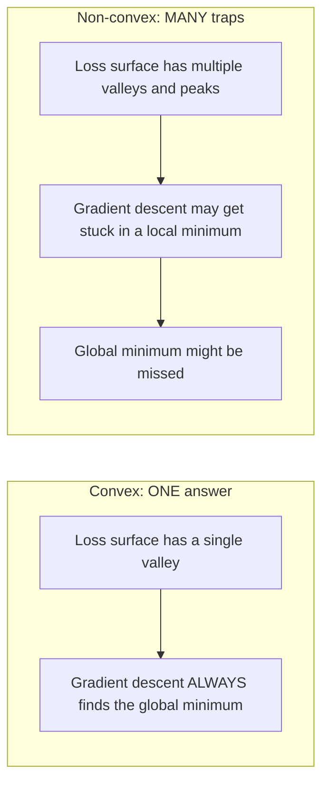
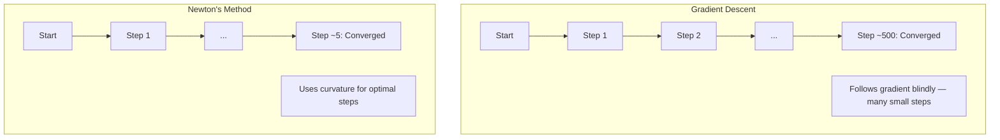
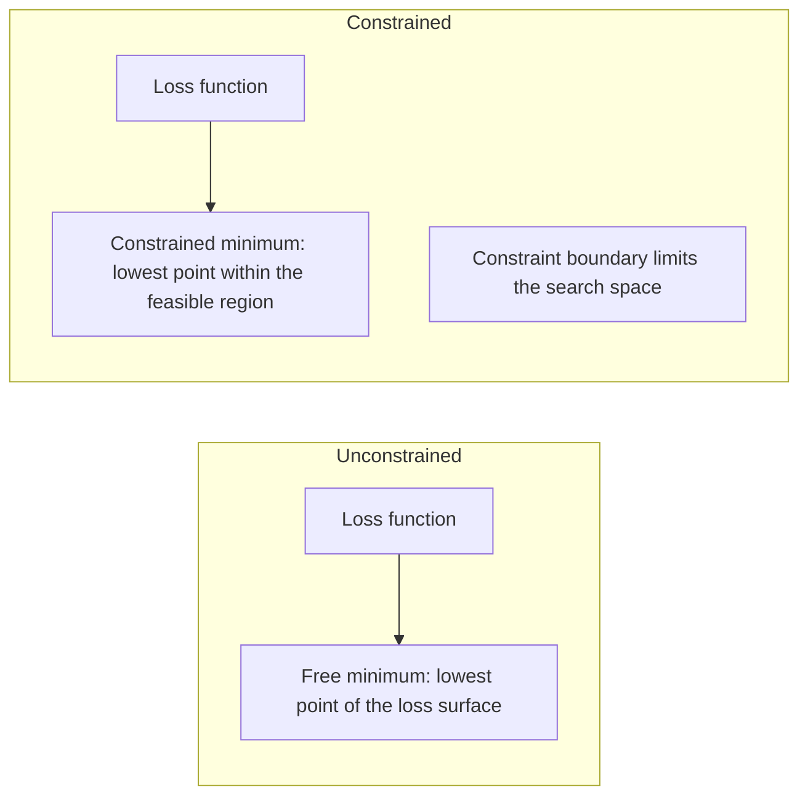
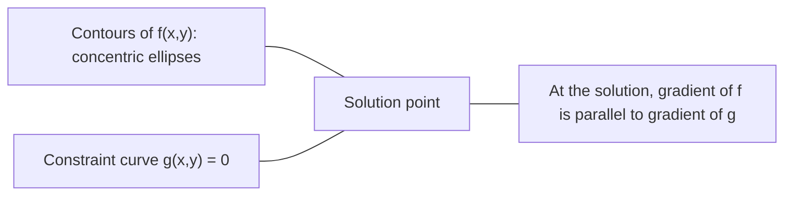

# Optymalizacja wypukła

> Problemy wypukłe mają jedną dolinę. Sieci neuronowe mają ich miliony. Znajomość różnicy ma znaczenie.

**Typ:** Build
**Język:** Python
**Wymagania wstępne:** Faza 1, Lekcje 04 (Calculus for ML), 08 (Optimization)
**Czas:** ~90 minut

## Cele nauki

- Sprawdzanie, czy funkcja jest wypukła, za pomocą definicji, drugiej pochodnej i kryteriów hesjanu
- Implementacja metody Newtona i porównanie jej kwadratowej zbieżności z gradient descent
- Rozwiązywanie problemów optymalizacji z ograniczeniami za pomocą mnożników Lagrange'a i interpretacja warunków KKT
- Wyjaśnienie, czemu krajobrazy strat sieci neuronowych są niewypukłe, a SGD wciąż znajduje dobre rozwiązania

## Problem

Lekcja 08 nauczyła cię gradient descent, momentum i Adam. Te optymalizatory schodzą w dół po dowolnej powierzchni. Ale nie dają żadnych gwarancji. Gradient descent na niewypukłym krajobrazie może wylądować w złym minimum lokalnym, zablokować się na punkcie siodłowym albo wiecznie oscylować. Korzystałeś z niego mimo to, bo sieci neuronowe są niewypukłe i nie ma alternatywy.

Ale wiele problemów w uczeniu maszynowym jest wypukłych. Regresja liniowa, regresja logistyczna, SVM, LASSO, regresja grzbietowa (ridge). Dla nich istnieje coś silniejszego: optymalizacja z matematycznymi gwarancjami. Problem wypukły ma dokładnie jedną dolinę. Każdy algorytm, który schodzi w dół, dotrze do globalnego minimum. Bez restartów. Bez harmonogramów learning rate. Bez modlitwy.

Zrozumienie wypukłości robi trzy rzeczy. Po pierwsze, mówi ci, kiedy twój problem jest łatwy (wypukły) a kiedy trudny (niewypukły). Po drugie, daje szybsze narzędzia, takie jak metoda Newtona, dla problemów wypukłych. Po trzecie, wyjaśnia koncepcje, które pojawiają się w całym ML: regularyzację jako ograniczenie, dualność w SVM oraz to, czemu deep learning działa, mimo że narusza każdą z miłych właściwości, jakie daje wypukłość.

## Koncepcja

### Zbiory wypukłe

Zbiór S jest wypukły, jeśli dla dowolnych dwóch punktów w S odcinek łączący je również w całości leży w S.

| Zbiory wypukłe | Zbiory niewypukłe |
|---|---|
| **Prostokąt**: dowolne dwa punkty wewnątrz można połączyć odcinkiem, który pozostaje wewnątrz | **Kształt gwiazdy/sierpa**: odcinek między dwoma punktami wewnętrznymi może wychodzić poza zbiór |
| **Trójkąt**: ta sama właściwość zachodzi dla wszystkich punktów wewnętrznych | **Pierścień (donut/annulus)**: dziura oznacza, że niektóre odcinki wychodzą ze zbioru |
| Odcinek między dowolnymi dwoma punktami pozostaje w zbiorze | Odcinek między pewnymi parami punktów wychodzi ze zbioru |

Test formalny: dla dowolnych punktów x, y w S i dowolnego t z [0, 1], punkt tx + (1-t)y również należy do S.

Przykłady zbiorów wypukłych:
- Linia, płaszczyzna, całe R^n
- Kula (okrąg, sfera, hipersfera)
- Półprzestrzeń: {x : a^T x <= b}
- Przecięcie dowolnej liczby zbiorów wypukłych

Przykłady zbiorów niewypukłych:
- Pierścień (annulus)
- Unia dwóch rozłącznych okręgów
- Każdy zbiór z "wgnieceniem" lub "dziurą"

### Funkcje wypukłe

Funkcja f jest wypukła, jeśli jej dziedzina jest zbiorem wypukłym i dla dowolnych dwóch punktów x, y w jej dziedzinie oraz dowolnego t z [0, 1]:

```
f(tx + (1-t)y) <= t*f(x) + (1-t)*f(y)
```

Geometrycznie: odcinek między dowolnymi dwoma punktami na wykresie leży powyżej lub na wykresie.

| Właściwość | Funkcja wypukła | Funkcja niewypukła |
|---|---|---|
| **Test odcinka** | Odcinek między dowolnymi dwoma punktami na wykresie leży **powyżej lub na** krzywej | Odcinek między pewnymi punktami na wykresie schodzi **poniżej** krzywej |
| **Kształt** | Jedna miska/dolina zakrzywiona w górę | Wiele szczytów i dolin o mieszanej krzywizny |
| **Minima lokalne** | Każde minimum lokalne jest minimum globalnym | Może istnieć wiele minimów lokalnych na różnych wysokościach |

Popularne funkcje wypukłe:
- f(x) = x^2 (parabola)
- f(x) = |x| (wartość absolutna)
- f(x) = e^x (eksponencjalna)
- f(x) = max(0, x) (ReLU, choć kawałkami liniowa)
- f(x) = -log(x) dla x > 0 (ujemny logarytm)
- Każda funkcja liniowa f(x) = a^T x + b (jest zarówno wypukła, jak i wklęsła)

### Testowanie wypukłości

Trzy praktyczne testy, od najprostszego do najbardziej rygorystycznego.

**Test 1: Test drugiej pochodnej (1D).** Jeśli f''(x) >= 0 dla wszystkich x, to f jest wypukła.

- f(x) = x^2: f''(x) = 2 >= 0. Wypukła.
- f(x) = x^3: f''(x) = 6x. Ujemna dla x < 0. Niewypukła.
- f(x) = e^x: f''(x) = e^x > 0. Wypukła.

**Test 2: Test hesjanu (wielowymiarowy).** Jeśli macierz hesjanu H(x) jest dodatnio półokreślona dla wszystkich x, to f jest wypukła. Hesjan to macierz drugich pochodnych cząstkowych.

**Test 3: Test z definicji.** Sprawdź nierówność f(tx + (1-t)y) <= t*f(x) + (1-t)*f(y) bezpośrednio. Przydatny dla funkcji, w których pochodne są trudne do obliczenia.

### Czemu wypukłość ma znaczenie

Centralny teorem optymalizacji wypukłej:

**Dla funkcji wypukłej każde minimum lokalne jest minimum globalnym.**

To oznacza, że gradient descent nie może się zablokować. Każda ścieżka schodząca w dół prowadzi do tej samej odpowiedzi. Algorytm jest zagarantowany, że zbiegnie do rozwiązania optymalnego.



Konsekwencje:
- Nie ma potrzeby losowych restartów
- Nie ma potrzeby zaawansowanych harmonogramów learning rate
- Możliwe są dowody zbieżności (tempo zależy od właściwości funkcji)
- Rozwiązanie jest unikalne (z dokładnością do płaskich obszarów)

### Wypukłe vs niewypukłe w ML

| Problem | Wypukły? | Czemu |
|---------|---------|-----|
| Regresja liniowa (MSE) | Tak | Strata jest kwadratowa względem wag |
| Regresja logistyczna | Tak | Log-loss jest wypukła względem wag |
| SVM (hinge loss) | Tak | Maksimum funkcji liniowych |
| LASSO (regresja L1) | Tak | Suma funkcji wypukłych jest wypukła |
| Regresja grzbietowa (L2) | Tak | Kwadratowa + kwadratowa = wypukła |
| Sieć neuronowa (każda strata) | Nie | Nieliniowe aktywacje tworzą niewypukły krajobraz |
| Klastrowanie k-means | Nie | Dyskretny krok przypisania |
| Faktoryzacja macierzy | Nie | Iloczyn nieznanych |

Modele liniowe z wypukłymi stratami są wypukłe. W momencie, gdy dodajesz warstwy skryte z nieliniowymi aktywacjami, wypukłość się załamuje.

### Macierz hesjanu

Hesjan H funkcji f: R^n -> R to macierz n x n drugich pochodnych cząstkowych.

```
H[i][j] = d^2 f / (dx_i dx_j)
```

Dla f(x, y) = x^2 + 3xy + y^2:

```
df/dx = 2x + 3y       d^2f/dx^2 = 2      d^2f/dxdy = 3
df/dy = 3x + 2y       d^2f/dydx = 3      d^2f/dy^2 = 2

H = [ 2  3 ]
    [ 3  2 ]
```

Hesjan informuje o krzywiźnie:
- Wszystkie wartości własne dodatnie: funkcja zakrzywia się w górę w każdym kierunku (wypukła w tym punkcie)
- Wszystkie wartości własne ujemne: zakrzywia się w dół w każdym kierunku (wklęsła, lokalne maksimum)
- Mieszane znaki: punkt siodłowy (zakrzywia się w górę w niektórych kierunkach, w dół w innych)
- Zerowa wartość własna: płaska w tym kierunku (zdegenerowana)

Aby funkcja była wypukła, hesjan musi być dodatnio półokreślony (wszystkie wartości własne >= 0) wszędzie, nie tylko w jednym punkcie.

### Metoda Newtona

Gradient descent wykorzystuje informację pierwszego rzędu (gradient). Metoda Newtona wykorzystuje informację drugiego rzędu (hesjan). Dopasowuje aproksymację kwadratową w aktualnym punkcie i przeskakuje wprost do minimum tej kwadratowej.

```
Reguła aktualizacji:
  x_new = x - H^(-1) * gradient

Porównanie z gradient descent:
  x_new = x - lr * gradient
```

Metoda Newtona zastępuje skalarny learning rate odwrotnym hesjanem. To automatycznie dopasowuje rozmiar kroku i kierunek na podstawie lokalnej krzywizny.



Zalety:
- Kwadratowa zbieżność w pobliżu minimum (błąd jest podnoszony do kwadratu w każdym kroku)
- Brak learning rate do dostosowywania
- Niezmienność skali (działa niezależnie od tego, jak parametryzujesz problem)

Wady:
- Obliczenie hesjanu kosztuje O(n^2) pamięci i O(n^3), aby go odwrócić
- Dla sieci neuronowej z 1 milionem wag to 10^12 elementów i 10^18 operacji
- Niepraktyczne dla deep learning

### Optymalizacja z ograniczeniami

Optymalizacja bez ograniczeń: minimalizuj f(x) po wszystkich x.
Optymalizacja z ograniczeniami: minimalizuj f(x) z zachowaniem ograniczeń.

Rzeczywiste problemy mają ograniczenia. Chcesz zminimalizować koszt, ale twój budżet jest ograniczony. Chcesz zminimalizować błąd, ale złożoność twojego modelu jest ograniczona.



### Mnożniki Lagrange'a

Metoda mnożników Lagrange'a przekształca problem z ograniczeniami w problem bez ograniczeń.

Problem: minimalizuj f(x) z zachowaniem g(x) = 0.

Rozwiązanie: wprowadź nową zmienną (mnożnik Lagrange'a lambda) i rozwiąż problem bez ograniczeń:

```
L(x, lambda) = f(x) + lambda * g(x)
```

W rozwiązaniu gradient L jest zerowy:

```
dL/dx = df/dx + lambda * dg/dx = 0
dL/dlambda = g(x) = 0
```

Intuicja geometryczna: w minimum z ograniczeniem gradient f musi być równoległy do gradientu ograniczenia g. Gdyby nie były równoległe, można by przemieścić się wzdłuż powierzchni ograniczenia i jeszcze bardziej zmniejszyć f.



Przykład: zminimalizuj f(x,y) = x^2 + y^2 z zachowaniem x + y = 1.

```
L = x^2 + y^2 + lambda(x + y - 1)

dL/dx = 2x + lambda = 0  =>  x = -lambda/2
dL/dy = 2y + lambda = 0  =>  y = -lambda/2
dL/dlambda = x + y - 1 = 0

Z dwóch pierwszych: x = y
Po podstawieniu: 2x = 1, więc x = y = 0.5, lambda = -1
```

Najbliższy punkt na linii x + y = 1 do początku układu współrzędnych to (0.5, 0.5).

### Warunki KKT

Warunki Karusha-Kuhna-Tuckera rozszerzają mnożniki Lagrange'a na ograniczenia w postaci nierówności.

Problem: minimalizuj f(x) z zachowaniem g_i(x) <= 0 dla i = 1, ..., m.

Warunki KKT (warunki konieczne optymalności):

```
1. Stacjonarność:        df/dx + sum(lambda_i * dg_i/dx) = 0
2. Wykonalność prymalna:  g_i(x) <= 0  dla wszystkich i
3. Wykonalność dualna:    lambda_i >= 0  dla wszystkich i
4. Komplementarne wykluczanie: lambda_i * g_i(x) = 0  dla wszystkich i
```

Komplementarne wykluczanie to kluczowa obserwacja: albo ograniczenie jest aktywne (g_i = 0, rozwiązanie znajduje się na granicy), albo mnożnik jest zerowy (ograniczenie nie ma znaczenia). Ograniczenie, które nie wpływa na rozwiązanie, ma lambda = 0.

Warunki KKT są centralne dla SVM. Wektory podpierające (support vectors) to punkty danych, dla których ograniczenie jest aktywne (lambda > 0). Wszystkie inne punkty danych mają lambda = 0 i nie wpływają na granicę decyzyjną.

### Regularyzacja jako optymalizacja z ograniczeniami

Regularyzacja L1 i L2 to nie arbitralne sztuczki. To zamaskowane problemy optymalizacji z ograniczeniami.

**Regularyzacja L2 (Ridge):**

```
minimalizuj  Loss(w)  z zachowaniem  ||w||^2 <= t

Równoważna forma bez ograniczeń:
minimalizuj  Loss(w) + lambda * ||w||^2
```

Ograniczenie ||w||^2 <= t definiuje kulę (okrąg w 2D, sfera w 3D). Rozwiązanie znajduje się tam, gdzie konturny straty po raz pierwszy stykają się z tą kulą.

**Regularyzacja L1 (LASSO):**

```
minimalizuj  Loss(w)  z zachowaniem  ||w||_1 <= t

Równoważna forma bez ograniczeń:
minimalizuj  Loss(w) + lambda * ||w||_1
```

Ograniczenie ||w||_1 <= t definiuje diament (obrócony kwadrat w 2D).

| Właściwość | Ograniczenie L2 (okrąg) | Ograniczenie L1 (diament) |
|---|---|---|
| **Kształt ograniczenia** | Okrąg (sfera w wyższych wymiarach) | Diament (obrócony kwadrat w 2D) |
| **Gdzie kontur straty się styka** | Gładka granica — dowolny punkt na okręgu | Wierzchołek — wyrównany z osią |
| **Zachowanie rozwiązania** | Wagi są małe, ale niezerowe | Niektóre wagi są dokładnie zerowe (rzadkość) |
| **Wynik** | Zmniejszanie wag | Selekcja cech |

To wyjaśnia, czemu L1 produkuje rzadkie modele (selekcja cech), a L2 tylko zmniejsza wagi. Diament ma wierzchołki wyrównane z osiami. Konturny straty częściej stykają się z wierzchołkiem, ustawiając jedną lub więcej wag dokładnie na zero.

### Dualność

Każdy problem optymalizacji z ograniczeniami (prymalny) ma towarzyszący problem (dualny). Dla problemów wypukłych prymalny i dualny mają tę samą wartość optymalną. To jest silna dualność.

Funkcja dualna Lagrange'a:

```
Prymalny: minimalizuj f(x) z zachowaniem g(x) <= 0
Lagrangian: L(x, lambda) = f(x) + lambda * g(x)
Funkcja dualna: d(lambda) = min_x L(x, lambda)
Problem dualny: maksymalizuj d(lambda) z zachowaniem lambda >= 0
```

Czemu dualność ma znaczenie:
- Problem dualny jest czasem łatwiejszy do rozwiązania niż prymalny
- SVM są rozwiązywane w formie dualnej, gdzie problem zależy od iloczynów skalarnych między punktami danych (co umożliwia trik z jądrem - kernel trick)
- Dualny dostarcza dolnej granicy optimum prymalnego, przydatnej do sprawdzania jakości rozwiązania

Dla SVM konkretnie:

```
Prymalny: znajdź w, b, które maksymalizują margines 2/||w|| z zachowaniem
        y_i(w^T x_i + b) >= 1 dla wszystkich i

Dualny:   maksymalizuj sum(alpha_i) - 0.5 * sum_ij(alpha_i * alpha_j * y_i * y_j * x_i^T x_j)
        z zachowaniem alpha_i >= 0 oraz sum(alpha_i * y_i) = 0

Dualny zawiera tylko iloczyny skalarne x_i^T x_j.
Zastąp x_i^T x_j przez K(x_i, x_j), aby uzyskać trik z jądrem (kernel trick).
```

### Czemu deep learning działa wbrew niewypukłości

Funkcje straty sieci neuronowych są niesamowicie niewypukłe. Według każdej klasycznej miary ich optymalizacja powinna się nie powieść. Mimo to stochastyczny gradient descent rzetelnie znajduje dobre rozwiązania. Kilka czynników to wyjaśnia.

**Większość minimów lokalnych jest wystarczająco dobra.** W przestrzeniach wysokowymiarowych losowe punkty krytyczne (gdzie gradient jest zerowy) są w zdecydowanej większości punktami siodłowymi, nie minimami lokalnymi. Te kilka minimów lokalnych, które istnieją, mają zwykle wartości straty bliskie globalnego minimum. Utknięcie w bardzo złym minimum lokalnym jest niezwykle nieprawdopodobne, gdy przestrzeń parametrów ma miliony wymiarów.

**Punkty siodłowe, a nie minima lokalne, są prawdziwą przeszkodą.** W funkcji z n parametrami punkt siodłowy ma mieszankę dodatnich i ujemnych kierunków krzywizny. Dla losowego punktu krytycznego w wysokich wymiarach prawdopodobieństwo, że wszystkie n wartości własnych jest dodatnich (minimum lokalne), wynosi z grubsza 2^(-n). Prawie wszystkie punkty krytyczne to punkty siodłowe. Szum SGD pomaga z nich uciec.

**Nadparametryzacja wygładza krajobraz.** Sieci z większą liczbą parametrów niż przykładów treningowych mają gładsze, lepiej połączone powierzchnie straty. Szersze sieci mają mniej złych minimów lokalnych. To kontrintuicyjne, ale empirycznie spójne.

**Struktura krajobrazu straty:**

| Właściwość | Przestrzeń niskowymiarowa | Przestrzeń wysokowymiarowa |
|---|---|---|
| **Krajobraz** | Wiele izolowanych szczytów i dolin | Gładko połączone doliny |
| **Minima** | Wiele izolowanych minimów lokalnych | Mało złych minimów lokalnych; większość jest blisko optymalnych |
| **Nawigacja** | Trudno znaleźć minimum globalne | Wiele ścieżek prowadzi do dobrych rozwiązań |
| **Punkty krytyczne** | Mieszanka minimów lokalnych i punktów siodłowych | W zdecydowanej większości punkty siodłowe, nie minima lokalne |

**Stochastyczny szum działa jak niejawna regularyzacja.** Mini-batch SGD wprowadza szum, który zapobiega osiadaniu w ostrych minimach. Ostre minima przeuczają się; płaskie minima generalizują. Szum przesuwa optymalizację w kierunku płaskich obszarów krajobrazu straty.

### Metody drugiego rzędu w praktyce

Czysta metoda Newtona jest niepraktyczna dla dużych modeli. Kilka aproksymacji sprawia, że informacja drugiego rzędu staje się użyteczna.

**L-BFGS (Limited-memory BFGS):** Aproksymuje odwrotny hesjan, korzystając z ostatnich m różnic gradientów. Wymaga O(mn) pamięci zamiast O(n^2). Działa dobrze dla problemów z do ~10 000 parametrów. Używana w klasycznym ML (regresja logistyczna, CRF), ale nie w deep learning.

**Gradient naturalny:** Wykorzystuje macierz informacji Fishera (oczekiwany hesjan log-likelihood) zamiast standardowego hesjanu. Uwzględnia geometrię rozkładów prawdopodobieństwa. K-FAC (Kronecker-Factored Approximate Curvature) aproksymuje macierz Fishera jako iloczyn Kroneckera, co sprawia, że jest praktyczna dla sieci neuronowych.

**Optymalizacja bez hesjanu (Hessian-free):** Wykorzystuje gradient sprzężony, aby rozwiązać Hx = g, nigdy nie tworząc H. Wymaga tylko produktów hesjan-wektor, które można obliczyć w czasie O(n) za pomocą automatycznego różniczkowania.

**Aproksymacje diagonalne:** Drugi moment Adam to diagonalna aproksymacja diagonali hesjanu. AdaHessian rozszerza to, używając rzeczywistych elementów diagonali hesjanu za pomocą estymatora Hutchinsona.

| Metoda | Pamięć | Koszt na krok | Kiedy używać |
|--------|--------|--------------|-------------|
| Gradient descent | O(n) | O(n) | Punkt odniesienia, duże modele |
| Metoda Newtona | O(n^2) | O(n^3) | Małe problemy wypukłe |
| L-BFGS | O(mn) | O(mn) | Średnie problemy wypukłe |
| Adam | O(n) | O(n) | Domyślny w deep learning |
| K-FAC | O(n) | O(n) na warstwę | Badania, trening z dużym batchem |

## Zbuduj to

### Krok 1: Sprawdzanie wypukłości

Zbuduj funkcję, która testuje wypukłość empirycznie, próbkując punkty i sprawdzając definicję.

```python
import random
import math

def check_convexity(f, dim, bounds=(-5, 5), samples=1000):
    violations = 0
    for _ in range(samples):
        x = [random.uniform(*bounds) for _ in range(dim)]
        y = [random.uniform(*bounds) for _ in range(dim)]
        t = random.uniform(0, 1)
        mid = [t * xi + (1 - t) * yi for xi, yi in zip(x, y)]
        lhs = f(mid)
        rhs = t * f(x) + (1 - t) * f(y)
        if lhs > rhs + 1e-10:
            violations += 1
    return violations == 0, violations
```

### Krok 2: Metoda Newtona dla 2D

Zaimplementuj metodę Newtona, korzystając z jawnego hesjanu. Porównaj prędkość zbieżności z gradient descent.

```python
def newtons_method(f, grad_f, hessian_f, x0, steps=50, tol=1e-12):
    x = list(x0)
    history = [x[:]]
    for _ in range(steps):
        g = grad_f(x)
        H = hessian_f(x)
        det = H[0][0] * H[1][1] - H[0][1] * H[1][0]
        if abs(det) < 1e-15:
            break
        H_inv = [
            [H[1][1] / det, -H[0][1] / det],
            [-H[1][0] / det, H[0][0] / det],
        ]
        dx = [
            H_inv[0][0] * g[0] + H_inv[0][1] * g[1],
            H_inv[1][0] * g[0] + H_inv[1][1] * g[1],
        ]
        x = [x[0] - dx[0], x[1] - dx[1]]
        history.append(x[:])
        if sum(gi ** 2 for gi in g) < tol:
            break
    return history
```

### Krok 3: Solver mnożników Lagrange'a

Rozwiąż optymalizację z ograniczeniami za pomocą gradient descent na Lagrangianie.

```python
def lagrange_solve(f_grad, g_val, g_grad, x0, lr=0.01,
                   lr_lambda=0.01, steps=5000):
    x = list(x0)
    lam = 0.0
    history = []
    for _ in range(steps):
        fg = f_grad(x)
        gv = g_val(x)
        gg = g_grad(x)
        x = [
            xi - lr * (fgi + lam * ggi)
            for xi, fgi, ggi in zip(x, fg, gg)
        ]
        lam = lam + lr_lambda * gv
        history.append((x[:], lam, gv))
    return history
```

### Krok 4: Porównanie pierwszego i drugiego rzędu

Uruchom gradient descent i metodę Newtona na tej samej funkcji kwadratowej. Policz kroki do zbieżności.

```python
def quadratic(x):
    return 5 * x[0] ** 2 + x[1] ** 2

def quadratic_grad(x):
    return [10 * x[0], 2 * x[1]]

def quadratic_hessian(x):
    return [[10, 0], [0, 2]]
```

Metoda Newtona zbiegnie w 1 kroku (jest dokładna dla funkcji kwadratowych). Gradient descent będzie potrzebować setek kroków, ponieważ wartości własne hesjanu różnią się o czynnik 5, tworząc wydłużoną dolinę.

## Zastosowanie

Analiza wypukłości ma bezpośrednie zastosowanie przy wyborze modeli ML i solverów.

Dla problemów wypukłych (regresja logistyczna, SVM, LASSO):
- Korzystaj z dedykowanych solverów (liblinear, CVXPY, scipy.optimize.minimize z method='L-BFGS-B')
- Oczekuj unikalnego rozwiązania globalnego
- Metody drugiego rzędu są praktyczne i szybkie

Dla problemów niewypukłych (sieci neuronowe):
- Korzystaj z metod pierwszego rzędu (SGD, Adam)
- Zaakceptuj, że rozwiązanie zależy od inicjalizacji i losowości
- Wykorzystuj nadparametryzację, szum i harmonogramy learning rate jako niejawną regularyzację
- Nie trać czasu na poszukiwanie minimum globalnego. Dobre minimum lokalne jest wystarczające.

```python
from scipy.optimize import minimize

result = minimize(
    fun=lambda w: sum((y - X @ w) ** 2) + 0.1 * sum(w ** 2),
    x0=np.zeros(d),
    method='L-BFGS-B',
    jac=lambda w: -2 * X.T @ (y - X @ w) + 0.2 * w,
)
```

Dla SVM formulacja dualna pozwala korzystać z triku z jądrem (kernel trick):

```python
from sklearn.svm import SVC

svm = SVC(kernel='rbf', C=1.0)
svm.fit(X_train, y_train)
print(f"Support vectors: {svm.n_support_}")
```

## Ćwiczenia

1. **Galeria wypukłości.** Przetestuj te funkcje pod kątem wypukłości za pomocą checkera: f(x) = x^4, f(x) = sin(x), f(x,y) = x^2 + y^2, f(x,y) = x*y, f(x) = max(x, 0). Wyjaśnij, czemu każdy wynik ma sens.

2. **Wyścig Newton vs gradient descent.** Uruchom obie metody na f(x,y) = 50*x^2 + y^2 z punktu startowego (10, 10). Ile kroków potrzebuje każda, aby osiągnąć loss < 1e-10? Co się dzieje z gradient descent, gdy wskaźnik kondycji (stosunek największej do najmniejszej wartości własnej hesjanu) wzrasta?

3. **Geometria mnożników Lagrange'a.** Zminimalizuj f(x,y) = (x-3)^2 + (y-3)^2 z zachowaniem x + 2y = 4. Zweryfikuj rozwiązanie, sprawdzając, że gradient f jest równoległy do gradientu g w rozwiązaniu.

4. **Ograniczenie regularyzacyjne.** Zaimplementuj optymalizację z ograniczeniem L1: zminimalizuj (x-3)^2 + (y-2)^2 z zachowaniem |x| + |y| <= 1. Pokaż, że rozwiązanie ma jedną współrzędną równą zero (rzadkość wynikająca z ograniczenia w postaci diamentu).

5. **Analiza wartości własnych hesjanu.** Oblicz hesjan funkcji Rosenbrocka w (1,1) i w (-1,1). Oblicz wartości własne w obu punktach. Co wartości własne mówią o krzywiźnie w minimum w porównaniu z punktem odległym od niego?

## Kluczowe terminy

| Termin | Co to oznacza |
|------|---------------|
| Zbiór wypukły (Convex set) | Zbiór, w którym odcinek między dowolnymi dwoma punktami w zbiorze pozostaje w zbiorze |
| Funkcja wypukła (Convex function) | Funkcja, w której odcinek między dowolnymi dwoma punktami na jej wykresie leży powyżej lub na wykresie. Równoważnie, hesjan jest dodatnio półokreślony wszędzie |
| Minimum lokalne (Local minimum) | Punkt niższy niż wszystkie punkty w jego okolicy. Dla funkcji wypukłych każde minimum lokalne jest minimum globalnym |
| Minimum globalne (Global minimum) | Najniższy punkt funkcji na całej jej dziedzinie |
| Macierz hesjanu (Hessian matrix) | Macierz wszystkich drugich pochodnych cząstkowych. Koduje informację o krzywiźnie |
| Dodatnio półokreślona (Positive semidefinite) | Macierz, której wszystkie wartości własne są nieujemne. Wielowymiarowy odpowiednik "druga pochodna >= 0" |
| Wskaźnik kondycji (Condition number) | Stosunek największej do najmniejszej wartości własnej hesjanu. Wysoki wskaźnik kondycji oznacza wydłużone doliny i wolny gradient descent |
| Metoda Newtona (Newton's method) | Optymalizator drugiego rzędu, który wykorzystuje odwrotny hesjan do określenia kierunku i rozmiaru kroku. Kwadratowa zbieżność w pobliżu minimum |
| Mnożnik Lagrange'a (Lagrange multiplier) | Zmienna wprowadzona, aby przekształcić problem optymalizacji z ograniczeniami w problem bez ograniczeń |
| Warunki KKT (KKT conditions) | Warunki konieczne optymalności dla ograniczeń w postaci nierówności. Uogólniają mnożniki Lagrange'a |
| Komplementarne wykluczanie (Complementary slackness) | W rozwiązaniu albo ograniczenie jest aktywne, albo jego mnożnik jest zerowy. Nigdy oba niezerowe |
| Dualność (Duality) | Każdy problem z ograniczeniami ma towarzyszący problem dualny. Dla problemów wypukłych obie mają tę samą wartość optymalną |
| Silna dualność (Strong duality) | Wartości optymalne prymalnego i dualnego są równe. Zachodzi dla problemów wypukłych spełniających warunek Slatera |
| L-BFGS | Przybliżona metoda drugiego rzędu, która przechowuje ostatnie m różnic gradientów zamiast pełnego hesjanu |
| Punkt siodłowy (Saddle point) | Punkt, w którym gradient jest zerowy, ale jest minimum w niektórych kierunkach a maksimum w innych |
| Nadparametryzacja (Overparameterization) | Użycie większej liczby parametrów niż przykładów treningowych. Wygładza krajobraz straty i redukuje liczbę złych minimów lokalnych |

## Dalsze materiały

- [Boyd & Vandenberghe: Convex Optimization](https://web.stanford.edu/~boyd/cvxbook/) - standardowy podręcznik, dostępny bezpłatnie online
- [Bottou, Curtis, Nocedal: Optimization Methods for Large-Scale Machine Learning (2018)](https://arxiv.org/abs/1606.04838) - łączy teorię optymalizacji wypukłej z praktyką deep learning
- [Choromanska et al.: The Loss Surfaces of Multilayer Networks (2015)](https://arxiv.org/abs/1412.0233) - czemu niewypukłe krajobrazy sieci neuronowych nie są tak złe, jak się wydają
- [Nocedal & Wright: Numerical Optimization](https://link.springer.com/book/10.1007/978-0-387-40065-5) - obszerne źródło na temat metody Newtona, L-BFGS i optymalizacji z ograniczeniami
