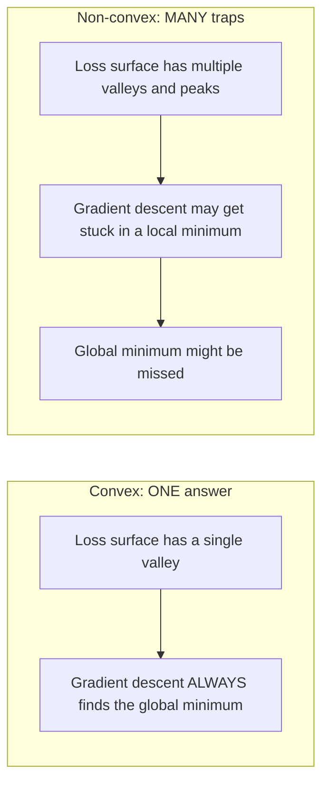
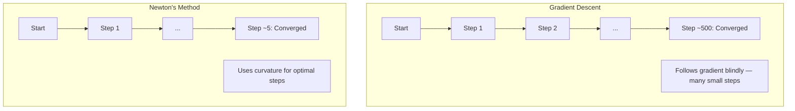
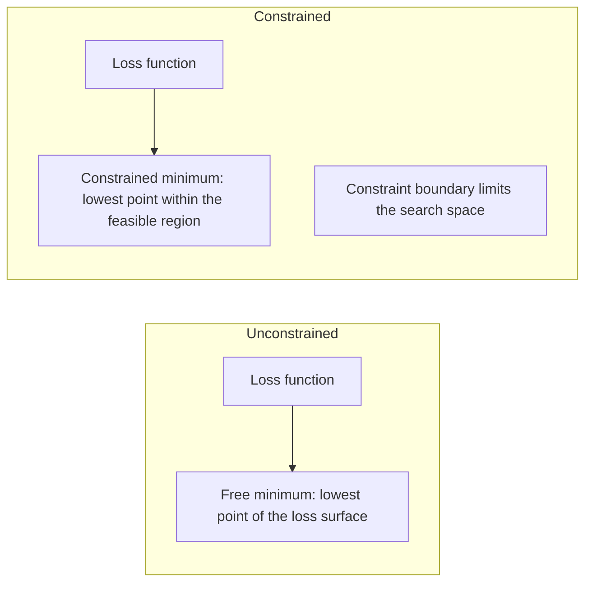
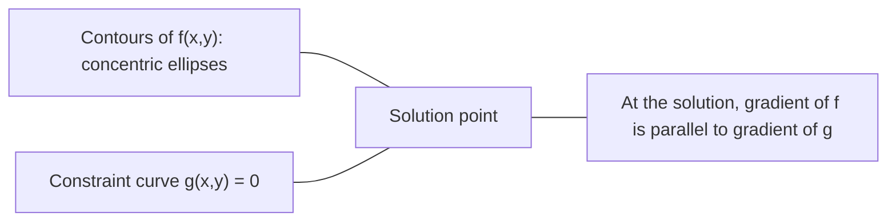

# Optymalizacja wypukła

> Problemy wypukłe mają jedną dolinę. Sieci neuronowe mają miliony. Znajomość różnicy ma znaczenie.

**Typ:** Kompilacja
**Język:** Python
**Wymagania wstępne:** Faza 1, lekcje 04 (Rachunek dla ML), 08 (Optymalizacja)
**Czas:** ~90 minut

## Cele nauczania

- Sprawdź, czy funkcja jest wypukła, korzystając z definicji, drugiej pochodnej i kryteriów Hesja
- Zastosuj metodę Newtona i porównaj jej zbieżność kwadratową z opadaniem gradientowym
- Rozwiązywać problemy optymalizacji z ograniczeniami za pomocą mnożników Lagrange'a i interpretować warunki KKT
- Wyjaśnij, dlaczego krajobrazy strat w sieciach neuronowych nie są wypukłe, a mimo to SGD wciąż znajduje dobre rozwiązania

## Problem

Lekcja 08 nauczyła Cię opadania gradientowego, pędu i Adama. Te optymalizatory schodzą w dół po każdej powierzchni. Ale nie dają żadnych gwarancji. Zejście gradientowe na niewypukłym terenie może wylądować w złym minimum lokalnym, utknąć w punkcie siodłowym lub oscylować w nieskończoność. I tak go użyłeś, ponieważ sieci neuronowe nie są wypukłe i nie ma alternatywy.

Jednak wiele problemów związanych z uczeniem maszynowym ma charakter wypukły. Regresja liniowa, regresja logistyczna, SVM, LASSO, regresja grzbietowa. Dla nich istnieje coś mocniejszego: optymalizacja z gwarancjami matematycznymi. Problem wypukły ma dokładnie jedną dolinę. Każdy algorytm, który idzie w dół, osiągnie globalne minimum. Nie ma potrzeby ponownego uruchamiania. Brak harmonogramów kursów nauki. Żadnej modlitwy.

Zrozumienie wypukłości ma trzy znaczenie. Po pierwsze, informuje Cię, kiedy problem jest łatwy (wypukły), a kiedy trudny (nie wypukły). Po drugie, zapewnia szybsze narzędzia, takie jak metoda Newtona dla problemów wypukłych. Po trzecie, wyjaśnia koncepcje pojawiające się w ML: regularyzacja jako ograniczenie, dualizm w maszynach SVM i dlaczego głębokie uczenie się działa pomimo naruszenia każdej ładnej właściwości, jaką daje wypukłość.

## Koncepcja

### Zbiory wypukłe

Zbiór S jest wypukły, jeśli dla dowolnych dwóch punktów w S odcinek między nimi również leży całkowicie w S.

| Zbiory wypukłe | Nie wypukły |
|---|---|
| **Prostokąt**: dowolne dwa punkty wewnątrz można połączyć odcinkiem linii, który pozostaje wewnątrz | **Kształt gwiazdy/półksiężyca**: linia pomiędzy dwoma punktami wewnętrznymi może przechodzić poza zestawem |
| **Trójkąt**: ta sama właściwość obowiązuje dla wszystkich punktów wewnętrznych | **Pączek/pierścień**: dziura oznacza, że ​​niektóre segmenty linii opuszczają zbiór |
| Odcinek linii pomiędzy dowolnymi dwoma punktami mieści się w zbiorze | Odcinek linii pomiędzy niektórymi parami punktów opuszcza zbiór |

Test formalny: dla dowolnych punktów x, y w S i dowolnego t w [0, 1], punkt tx + (1-t)y również znajduje się w S.

Przykłady zbiorów wypukłych:
- Linia, płaszczyzna, wszystko R^n
- Kula (okrąg, kula, hipersfera)
- Półprzestrzeń: {x : a^T x <= b}
- Przecięcie dowolnej liczby zbiorów wypukłych

Przykłady zbiorów niewypukłych:
- Pączek (pierścień)
- Połączenie dwóch rozłącznych kręgów
- Dowolny zestaw z „wgnieceniem” lub „dziurą”

### Funkcje wypukłe

Funkcja f jest wypukła, jeśli jej dziedzina jest zbiorem wypukłym oraz dla dowolnych dwóch punktów x, y w jej dziedzinie i dowolnego t w [0, 1]:

```
f(tx + (1-t)y) <= t*f(x) + (1-t)*f(y)
```

Geometrycznie: odcinek linii pomiędzy dowolnymi dwoma punktami na wykresie leży nad wykresem lub na wykresie.

| Nieruchomość | Funkcja wypukła | Funkcja niewypukła |
|---|---|---|
| **Test odcinka linii** | Linia pomiędzy dowolnymi dwoma punktami na wykresie leży **powyżej lub na** krzywej | Linia pomiędzy niektórymi punktami na wykresie opada **poniżej** krzywej |
| **Kształt** | Pojedyncza misa/dolina zakrzywiona w górę | Wiele szczytów i dolin o mieszanej krzywiźnie |
| **Minima lokalne** | Każde minimum lokalne jest minimum globalnym | Na różnych wysokościach może istnieć wiele minimów lokalnych |

Typowe funkcje wypukłe:
- f(x) = x^2 (parabola)
- f(x) = |x| (wartość bezwzględna)
- f(x) = e^x (wykładniczy)
- f(x) = max(0, x) (ReLU, choć odcinkowo liniowo)
- f(x) = -log(x) dla x > 0 (logarytm ujemny)
- Dowolna funkcja liniowa f(x) = a^T x + b (zarówno wypukła, jak i wklęsła)

### Testowanie wypukłości

Trzy praktyczne testy, od najłatwiejszego do najbardziej rygorystycznego.

**Test 1: Test drugiej pochodnej (1D).** Jeśli f''(x) >= 0 dla wszystkich x, to f jest wypukłe.

- f(x) = x^2: f''(x) = 2 >= 0. Wypukłe.
- f(x) = x^3: f''(x) = 6x. Ujemne dla x < 0. Nie wypukłe.
- f(x) = e^x: f''(x) = e^x > 0. Wypukłe.

**Test 2: Test Hessego (wieloczynnikowy).** Jeśli macierz Hessego H(x) jest dodatnia półokreślona dla wszystkich x, to f jest wypukła. Hesjan jest macierzą drugich pochodnych cząstkowych.

**Test 3: Test definicji.** Sprawdź bezpośrednio nierówność f(tx + (1-t)y) <= t*f(x) + (1-t)*f(y). Przydatne w przypadku funkcji, w przypadku których pochodne są trudne do obliczenia.

### Dlaczego wypukłość ma znaczenie

Centralne twierdzenie optymalizacji wypukłej:

**W przypadku funkcji wypukłej każde minimum lokalne jest minimum globalnym.**

Oznacza to, że zejście gradientowe nie może zostać uwięzione. Każda ścieżka w dół prowadzi do tej samej odpowiedzi. Algorytm ma gwarancję zbieżności do rozwiązania optymalnego.



Konsekwencje:
- Nie ma potrzeby losowych restartów
- Nie ma potrzeby stosowania skomplikowanych harmonogramów tempa uczenia się
- Możliwe są dowody zbieżności (szybkość zależy od właściwości funkcji)
- Rozwiązanie jest unikalne (do obszarów płaskich)

### Wypukłe i niewypukłe w ML

| Problem | Wypukły? | Dlaczego |
|--------|---------|-----|
| Regresja liniowa (MSE) | Tak | Strata jest kwadratowa w wadze |
| Regresja logistyczna | Tak | Strata loga jest wypukła w masach |
| SVM (utrata zawiasów) | Tak | Maksimum funkcji liniowych |
| LASSO (regresja L1) | Tak | Suma funkcji wypukłych jest wypukła |
| Regresja grzbietu (L2) | Tak | Kwadratowy + kwadratowy = wypukły |
| Sieć neuronowa (wszelkie straty) | Nie | Aktywacje nieliniowe tworzą niewypukły krajobraz |
| grupowanie k-średnich | Nie | Krok przypisania dyskretnego |
| Faktoryzacja macierzy | Nie | Produkt niewiadomych |

Modele liniowe ze stratami wypukłymi są wypukłe. W momencie dodania ukrytych warstw z nieliniowymi aktywacjami wypukłość zostaje przerwana.

### Macierz Hessego

Hesjan H funkcji f: R^n -> R jest macierzą n x n drugich pochodnych cząstkowych.

```
H[i][j] = d^2 f / (dx_i dx_j)
```

Dla f(x, y) = x^2 + 3xy + y^2:

```
df/dx = 2x + 3y       d^2f/dx^2 = 2      d^2f/dxdy = 3
df/dy = 3x + 2y       d^2f/dydx = 3      d^2f/dy^2 = 2

H = [ 2  3 ]
    [ 3  2 ]
```

Hesjan mówi o krzywiźnie:
- Wszystkie wartości własne są dodatnie: funkcja zakrzywia się w górę w każdym kierunku (w tym punkcie wypukła)
- Wszystkie wartości własne są ujemne: krzywe w dół w każdym kierunku (wklęsłe, lokalne maksimum)
- Znaki mieszane: punkt siodłowy (w niektórych kierunkach zakrzywiony w górę, w innych w dół)
- Zerowa wartość własna: płaska w tym kierunku (zdegenerowana)

W przypadku wypukłości hesjan musi być dodatni półokreślony (wszystkie wartości własne >= 0) wszędzie, a nie tylko w jednym punkcie.

### Metoda Newtona

Zejście gradientowe wykorzystuje informacje pierwszego rzędu (gradient). Metoda Newtona wykorzystuje informację drugiego rzędu (Hessian). Dopasowuje przybliżenie kwadratowe w bieżącym punkcie i przeskakuje bezpośrednio do minimum tego kwadratu.

```
Update rule:
  x_new = x - H^(-1) * gradient

Compare to gradient descent:
  x_new = x - lr * gradient
```

Metoda Newtona zastępuje skalarną szybkość uczenia się odwrotną wartością Hesja. To automatycznie dostosowuje wielkość i kierunek kroku w oparciu o lokalną krzywiznę.



Zalety:
- Zbieżność kwadratowa w pobliżu minimum (kwadraty błędu w każdym kroku)
- Brak szybkości uczenia się do dostrojenia
- Niezmiennik skali (działa niezależnie od tego, jak sparametryzujesz problem)

Wady:
- Obliczenie kosztu Hesja wynosi O(n^2) pamięci i O(n^3) do odwrócenia
- Dla sieci neuronowej o 1 milionie wag, czyli 10^12 wpisów i 10^18 operacji
- Niepraktyczne w przypadku głębokiego uczenia się

### Ograniczona optymalizacja

Optymalizacja nieograniczona: minimalizuj f(x) po wszystkich x.
Optymalizacja ograniczona: minimalizuj f(x) z zastrzeżeniem ograniczeń.

Prawdziwe problemy mają ograniczenia. Chcesz zminimalizować koszty, ale Twój budżet jest ograniczony. Chcesz zminimalizować błąd, ale złożoność modelu jest ograniczona.



### Mnożniki Lagrange’a

Metoda mnożników Lagrange'a przekształca problem ograniczony w problem nieograniczony.

Problem: zminimalizować f(x) pod warunkiem, że g(x) = 0.

Rozwiązanie: wprowadź nową zmienną (mnożnik Lagrange’a lambda) i rozwiąż problem nieograniczony:

```
L(x, lambda) = f(x) + lambda * g(x)
```

W rozwiązaniu gradient L wynosi zero:

```
dL/dx = df/dx + lambda * dg/dx = 0
dL/dlambda = g(x) = 0
```

Intuicja geometryczna: przy ograniczonym minimum gradient f musi być równoległy do gradientu ograniczenia g. Gdyby nie były one równoległe, można byłoby przesuwać się wzdłuż powierzchni wiązania i dalej zmniejszać f.



Przykład: minimalizuj f(x,y) = x^2 + y^2 pod warunkiem, że x + y = 1.

```
L = x^2 + y^2 + lambda(x + y - 1)

dL/dx = 2x + lambda = 0  =>  x = -lambda/2
dL/dy = 2y + lambda = 0  =>  y = -lambda/2
dL/dlambda = x + y - 1 = 0

From first two: x = y
Substituting: 2x = 1, so x = y = 0.5, lambda = -1
```

Najbliższy początek linii x + y = 1 to (0,5, 0,5).

### Warunki KKT

Warunki Karusha-Kuhna-Tuckera rozszerzają mnożniki Lagrange'a na ograniczenia nierówności.

Problem: zminimalizować f(x) pod warunkiem g_i(x) <= 0 dla i = 1, ..., m.

Warunki KKT (niezbędne dla optymalności):

```
1. Stationarity:    df/dx + sum(lambda_i * dg_i/dx) = 0
2. Primal feasibility:  g_i(x) <= 0  for all i
3. Dual feasibility:    lambda_i >= 0  for all i
4. Complementary slackness:  lambda_i * g_i(x) = 0  for all i
```

Kluczowym spostrzeżeniem jest uzupełniający luz: albo ograniczenie jest aktywne (g_i = 0, rozwiązanie znajduje się na granicy), albo mnożnik wynosi zero (ograniczenie nie ma znaczenia). Wiązanie, które nie ma wpływu na rozwiązanie, ma lambda = 0.

Warunki KKT mają kluczowe znaczenie dla maszyn SVM. Wektory podporowe to punkty danych, w których ograniczenie jest aktywne (lambda > 0). Wszystkie pozostałe punkty danych mają lambda = 0 i nie wpływają na granicę decyzji.

### Regularyzacja jako optymalizacja z ograniczeniami

Regularyzacja L1 i L2 nie jest arbitralną sztuczką. Są to ukryte problemy optymalizacyjne z ograniczeniami.

**Regularyzacja L2 (Grzbiet):**

```
minimize  Loss(w)  subject to  ||w||^2 <= t

Equivalent unconstrained form:
minimize  Loss(w) + lambda * ||w||^2
```

Więzy ||w||^2 <= t definiuje kulę (okrąg w 2D, kula w 3D). Rozwiązaniem jest miejsce, w którym kontury straty po raz pierwszy dotykają tej piłki.

**Regularyzacja L1 (LASSO):**

```
minimize  Loss(w)  subject to  ||w||_1 <= t

Equivalent unconstrained form:
minimize  Loss(w) + lambda * ||w||_1
```

Ograniczenie ||w||_1 <= t definiuje romb (obrócony kwadrat w 2D).

| Nieruchomość | Ograniczenie L2 (okrąg) | Ograniczenie L1 (romb) |
|---|---|---|
| **Kształt ograniczenia** | Okrąg (kula w wyższych przyciemnieniach) | Diament (obrócony kwadrat w 2D) |
| **Gdzie dotyka kontur straty** | Gładka granica — dowolny punkt na okręgu | Narożnik — zgodny z osią |
| **Zachowanie rozwiązania** | Wagi są małe, ale niezerowe | Niektóre wagi są dokładnie zerowe (rzadkie) |
| **Wynik** | Skurcz wagi | Wybór funkcji |

To wyjaśnia, dlaczego L1 tworzy rzadkie modele (wybór funkcji), podczas gdy L2 jedynie zmniejsza ciężary. Diament ma rogi wyrównane z osiami. Kontury strat częściej dotkną narożnika, ustawiając jedną lub więcej wag dokładnie na zero.

### Dwoistość

Każdy problem optymalizacji z ograniczeniami (pierwotny) ma problem towarzyszący (podwójny). W przypadku problemów wypukłych wartość pierwotna i podwójna mają tę samą optymalną wartość. To jest silna dwoistość.

Podwójna funkcja Lagrangianu:

```
Primal: minimize f(x) subject to g(x) <= 0
Lagrangian: L(x, lambda) = f(x) + lambda * g(x)
Dual function: d(lambda) = min_x L(x, lambda)
Dual problem: maximize d(lambda) subject to lambda >= 0
```

Dlaczego dualizm ma znaczenie:
- Problem podwójny jest czasem łatwiejszy do rozwiązania niż problem pierwotny
- Maszyny SVM są rozwiązywane w ich podwójnej formie, gdzie problem zależy od iloczynów skalarnych pomiędzy punktami danych (umożliwiając sztuczkę jądra)
- Wartość dualna zapewnia dolną granicę optymalnego pierwotnego, przydatną do sprawdzania jakości rozwiązania

W szczególności dla maszyn SVM:

```
Primal: find w, b that maximize the margin 2/||w|| subject to
        y_i(w^T x_i + b) >= 1 for all i

Dual:   maximize sum(alpha_i) - 0.5 * sum_ij(alpha_i * alpha_j * y_i * y_j * x_i^T x_j)
        subject to alpha_i >= 0 and sum(alpha_i * y_i) = 0

The dual only involves dot products x_i^T x_j.
Replace x_i^T x_j with K(x_i, x_j) to get the kernel trick.
```

### Dlaczego głębokie uczenie się działa pomimo braku wypukłości

Funkcje utraty sieci neuronowej są niezwykle niewypukłe. Według każdej klasycznej miary ich optymalizacja powinna się nie udać. Jednak stochastyczne zejście gradientowe niezawodnie znajduje dobre rozwiązania. Wyjaśnia to kilka czynników.

**Większość minimów lokalnych jest wystarczająco dobra.** W przestrzeniach wielowymiarowych losowe punkty krytyczne (gdzie gradient wynosi zero) to w przeważającej mierze punkty siodłowe, a nie minima lokalne. Nieliczne istniejące minima lokalne mają zwykle wartości strat zbliżone do minimum globalnego. Uwięzienie w strasznym minimum lokalnym jest niezwykle mało prawdopodobne, gdy przestrzeń parametrów ma miliony wymiarów.

**Prawdziwą przeszkodą są punkty siodłowe, a nie lokalne minima.** W funkcji z n parametrami punkt siodłowy ma mieszankę dodatnich i ujemnych kierunków krzywizny. W przypadku losowego punktu krytycznego w dużych wymiarach prawdopodobieństwo, że wszystkie wartości własne będą dodatnie (minimum lokalne) wynosi w przybliżeniu 2^(-n). Prawie wszystkie punkty krytyczne to punkty siodłowe. Hałas SGD pomaga im uciec.

**Nadparametryzacja wygładza krajobraz.** Sieci z większą liczbą parametrów niż przykłady szkoleniowe mają gładsze, bardziej połączone powierzchnie strat. Szersze sieci mają mniej złych minimów lokalnych. Jest to sprzeczne z intuicją, ale spójne empirycznie.

**Struktura krajobrazu strat:**

| Nieruchomość | Przestrzeń niskowymiarowa | Przestrzeń wielowymiarowa |
|---|---|---|
| **Krajobraz** | Wiele odizolowanych szczytów i dolin | Płynnie połączone doliny |
| **Minima** | Wiele izolowanych minimów lokalnych | Kilka złych minimów lokalnych; większość jest prawie optymalna |
| **Nawigacja** | Trudno znaleźć minimum globalne | Wiele ścieżek prowadzi do dobrych rozwiązań |
| **Punkty krytyczne** | Mieszanka lokalnych minimów i punktów siodłowych | W przeważającej mierze punkty siodłowe, a nie lokalne minima |

**Szum stochastyczny działa jak ukryta regularyzacja.** Mini-partia SGD dodaje szum, który zapobiega osadzaniu się w ostrych minimach. Ostre przekroczenie minimów; płaskie minima uogólniają. Szum wpływa na optymalizację w kierunku płaskich obszarów krajobrazu strat.

### Metody drugiego rzędu w praktyce

Metoda czystego Newtona jest niepraktyczna w przypadku dużych modeli. Kilka przybliżeń sprawia, że ​​informacje drugiego rzędu stają się użyteczne.

**L-BFGS (BFGS o ograniczonej pamięci):** Przybliża odwrotność Hesja przy użyciu ostatnich m różnic gradientów. Wymaga pamięci O(mn) zamiast O(n^2). Działa dobrze w przypadku problemów z maksymalnie 10 000 parametrów. Używany w klasycznym ML (regresja logistyczna, CRF), ale nie w głębokim uczeniu się.

**Naturalny gradient:** Używa matrycy informacyjnej Fishera (oczekiwanej wartości Hessianu w oparciu o logarytm wiarygodności) zamiast standardowej metody Hessian. To wyjaśnia geometrię rozkładów prawdopodobieństwa. K-FAC (przybliżona krzywizna współczynnika Kroneckera) przybliża macierz Fishera jako iloczyn Kroneckera, dzięki czemu jest praktyczna w sieciach neuronowych.

**Optymalizacja bez Hesja:** Wykorzystuje gradient sprzężony do rozwiązania Hx = g bez tworzenia H. Wymaga jedynie produktów wektora Hessego, które można obliczyć w czasie O(n) poprzez automatyczne różniczkowanie.

**Przybliżenia ukośne:** Drugi moment Adama jest ukośnym przybliżeniem przekątnej Hessjana. AdaHessian rozszerza to, używając rzeczywistych elementów przekątnych Hessego za pomocą estymatora Hutchinsona.

| Metoda | Pamięć | Koszt na krok | Kiedy używać |
|--------|--------|-------------|------------|
| Zejście gradientowe | O(n) | O(n) | Linia bazowa, duże modele |
| Metoda Newtona | O(n^2) | O(n^3) | Małe problemy wypukłe |
| L-BFGS | O(mn) | O(mn) | Problemy średnio wypukłe |
| Adama | O(n) | O(n) | Domyślne głębokie uczenie się |
| K-FAC | O(n) | O(n) na warstwę | Badania, szkolenia wielkoseryjne |

## Zbuduj to

### Krok 1: Sprawdzanie wypukłości

Zbuduj funkcję, która empirycznie testuje wypukłość, próbkując punkty i sprawdzając definicję.

```python
import random
import math

def check_convexity(f, dim, bounds=(-5, 5), samples=1000):
    violations = 0
    for _ in range(samples):
        x = [random.uniform(*bounds) for _ in range(dim)]
        y = [random.uniform(*bounds) for _ in range(dim)]
        t = random.uniform(0, 1)
        mid = [t * xi + (1 - t) * yi for xi, yi in zip(x, y)]
        lhs = f(mid)
        rhs = t * f(x) + (1 - t) * f(y)
        if lhs > rhs + 1e-10:
            violations += 1
    return violations == 0, violations
```

### Krok 2: Metoda Newtona dla 2D

Zaimplementuj metodę Newtona, używając jawnego Hesjanu. Porównaj prędkość konwergencji z opadaniem gradientowym.

```python
def newtons_method(f, grad_f, hessian_f, x0, steps=50, tol=1e-12):
    x = list(x0)
    history = [x[:]]
    for _ in range(steps):
        g = grad_f(x)
        H = hessian_f(x)
        det = H[0][0] * H[1][1] - H[0][1] * H[1][0]
        if abs(det) < 1e-15:
            break
        H_inv = [
            [H[1][1] / det, -H[0][1] / det],
            [-H[1][0] / det, H[0][0] / det],
        ]
        dx = [
            H_inv[0][0] * g[0] + H_inv[0][1] * g[1],
            H_inv[1][0] * g[0] + H_inv[1][1] * g[1],
        ]
        x = [x[0] - dx[0], x[1] - dx[1]]
        history.append(x[:])
        if sum(gi ** 2 for gi in g) < tol:
            break
    return history
```

### Krok 3: Rozwiązanie mnożnika Lagrange’a

Rozwiąż optymalizację z ograniczeniami, korzystając z opadania gradientowego na Lagrangianie.

```python
def lagrange_solve(f_grad, g_val, g_grad, x0, lr=0.01,
                   lr_lambda=0.01, steps=5000):
    x = list(x0)
    lam = 0.0
    history = []
    for _ in range(steps):
        fg = f_grad(x)
        gv = g_val(x)
        gg = g_grad(x)
        x = [
            xi - lr * (fgi + lam * ggi)
            for xi, fgi, ggi in zip(x, fg, gg)
        ]
        lam = lam + lr_lambda * gv
        history.append((x[:], lam, gv))
    return history
```

### Krok 4: porównanie pierwszego i drugiego rzędu

Uruchom zejście gradientowe i metodę Newtona na tej samej funkcji kwadratowej. Policz kroki do konwergencji.

```python
def quadratic(x):
    return 5 * x[0] ** 2 + x[1] ** 2

def quadratic_grad(x):
    return [10 * x[0], 2 * x[1]]

def quadratic_hessian(x):
    return [[10, 0], [0, 2]]
```

Metoda Newtona będzie zbieżna w 1 kroku (jest dokładna dla kwadratów). Zejście gradientowe będzie wymagało setek kroków, ponieważ wartości własne Hesji różnią się pięciokrotnie, tworząc wydłużoną dolinę.

## Użyj tego

Analiza wypukłości ma zastosowanie bezpośrednio przy wyborze modeli i solwerów ML.

Dla problemów wypukłych (regresja logistyczna, SVM, LASSO):
- Użyj dedykowanych solwerów (liblinear, CVXPY, scipy.optimize.minimize z method='L-BFGS-B')
- Oczekuj unikalnego, globalnego rozwiązania
- Metody drugiego rzędu są praktyczne i szybkie

Dla problemów niewypukłych (sieci neuronowe):
- Stosuj metody pierwszego rzędu (SGD, Adam)
- Zaakceptuj, że rozwiązanie zależy od inicjalizacji i losowości
- Użyj nadmiernej parametryzacji, szumu i harmonogramów szybkości uczenia się jako ukrytej regularyzacji
- Nie trać czasu na szukanie minimum globalnego. Wystarczy dobre minimum lokalne.

```python
from scipy.optimize import minimize

result = minimize(
    fun=lambda w: sum((y - X @ w) ** 2) + 0.1 * sum(w ** 2),
    x0=np.zeros(d),
    method='L-BFGS-B',
    jac=lambda w: -2 * X.T @ (y - X @ w) + 0.2 * w,
)
```

W przypadku maszyn SVM podwójna formuła pozwala zastosować sztuczkę jądra:

```python
from sklearn.svm import SVC

svm = SVC(kernel='rbf', C=1.0)
svm.fit(X_train, y_train)
print(f"Support vectors: {svm.n_support_}")
```

## Ćwiczenia

1. **Galeria wypukłości.** Przetestuj te funkcje pod kątem wypukłości za pomocą sprawdzania: f(x) = x^4, f(x) = sin(x), f(x,y) = x^2 + y^2, f(x,y) = x*y, f(x) = max(x, 0). Wyjaśnij, dlaczego każdy wynik ma sens.

2. **Wyścig Newtona vs gradient zniżania.** Przeprowadź obie metody na f(x,y) = 50*x^2 + y^2 od punktu początkowego (10, 10). Ile kroków musi wykonać każdy z nich, aby osiągnąć stratę < 1e-10? Co dzieje się z opadaniem gradientowym, gdy liczba warunku (stosunek największej do najmniejszej wartości własnej Hessego) wzrasta?

3. **Geometria mnożnika Lagrange’a.** Minimalizuj f(x,y) = (x-3)^2 + (y-3)^2 pod warunkiem x + 2y = 4. Sprawdź rozwiązanie sprawdzając, czy gradient f jest równoległy do ​​gradientu g w rozwiązaniu.

4. **Ograniczenie regularyzacyjne.** Zaimplementuj optymalizację ograniczoną L1: minimalizuj (x-3)^2 + (y-2)^2 z zastrzeżeniem |x| + |y| <= 1. Pokaż, że rozwiązanie ma jedną współrzędną równą zeru (rzadkość wynikająca z wiązania diamentu).

5. **Analiza wartości własnej Hesja.** Oblicz hesjan funkcji Rosenbrocka w (1,1) i w (-1,1). Oblicz wartości własne w obu punktach. Co wartości własne mówią o krzywiźnie minimalnej i dalekiej od niej?

## Kluczowe terminy

| Termin | Co to znaczy |
|------|----------------------------|
| Zestaw wypukły | Zbiór, w którym odcinek łączący dowolne dwa punkty ze zbioru pozostaje wewnątrz zbioru |
| Funkcja wypukła | Funkcja, w której linia łącząca dowolne dwa punkty na wykresie leży nad wykresem lub na wykresie. Odpowiednio, Hesjan jest wszędzie dodatni półokreślony |
| Minimum lokalne | Punkt niższy niż wszystkie pobliskie punkty. W przypadku funkcji wypukłych każde minimum lokalne jest minimum globalnym |
| Globalne minimum | Najniższy punkt funkcji w całej jej dziedzinie |
| Macierz Hessego | Macierz wszystkich drugich pochodnych cząstkowych. Koduje informacje o krzywiźnie |
| Pozytywny półokreślony | Macierz, której wszystkie wartości własne są nieujemne. Wielowymiarowy odpowiednik „drugiej pochodnej >= 0” |
| Numer warunku | Stosunek największej do najmniejszej wartości własnej Hesja. Wysoka liczba warunków oznacza wydłużone doliny i powolne zejście gradientowe |
| Metoda Newtona | Optymalizator drugiego rzędu wykorzystujący odwrotność Hesja do określenia kierunku i rozmiaru kroku. Zbieżność kwadratowa w pobliżu minimum |
| Mnożnik Lagrange'a | Zmienna wprowadzona w celu przekształcenia problemu optymalizacyjnego z ograniczeniami w problem nieograniczony |
| Warunki KKT | Warunki konieczne optymalności z ograniczeniami nierównościowymi. Uogólnij mnożniki Lagrange'a |
| Uzupełniający luz | W rozwiązaniu albo ograniczenie jest aktywne, albo jego mnożnik wynosi zero. Nigdy oba niezerowe |
| Dwoistość | Każdy ograniczony problem ma towarzyszący mu problem podwójny. W przypadku problemów wypukłych oba mają tę samą optymalną wartość |
| Silna dwoistość | Wartości optymalne pierwotne i podwójne są równe. Dotyczy problemów wypukłych spełniających warunek Slatera |
| L-BFGS | Przybliżona metoda drugiego rzędu, która przechowuje ostatnie m różnic gradientów zamiast pełnego Hessian |
| Punkt siodłowy | Punkt, w którym gradient wynosi zero, ale w niektórych kierunkach jest minimum, a w innych maksimum
| Przeparametryzacja | Używanie większej liczby parametrów niż przykładów szkoleniowych. Wygładza krajobraz strat i redukuje złe minima lokalne |

## Dalsze czytanie

- [Boyd & Vandenberghe: Convex Optimization](https://web.stanford.edu/~boyd/cvxbook/) - standardowy podręcznik, swobodnie dostępny online
- [Bottou, Curtis, Nocedal: Optimization Methods for Large-Scale Machine Learning (2018)](https://arxiv.org/abs/1606.04838) - łączy teorię optymalizacji wypukłej z praktyką głębokiego uczenia się
- [Choromanska et al.: The Loss Surfaces of Multilayer Networks (2015)](https://arxiv.org/abs/1412.0233) - dlaczego niewypukłe krajobrazy sieci neuronowych nie są tak złe, jak się wydaje
- [Nocedal & Wright: Optymalizacja numeryczna](https://link.springer.com/book/10.1007/978-0-387-40065-5) - obszerne odniesienia do metody Newtona, L-BFGS i optymalizacji z ograniczeniami