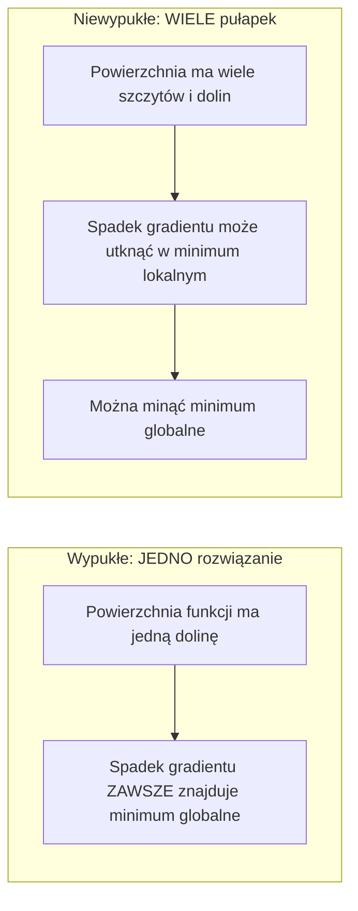
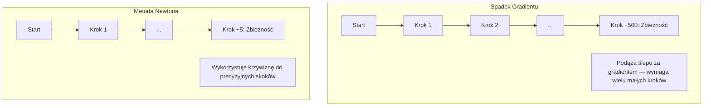
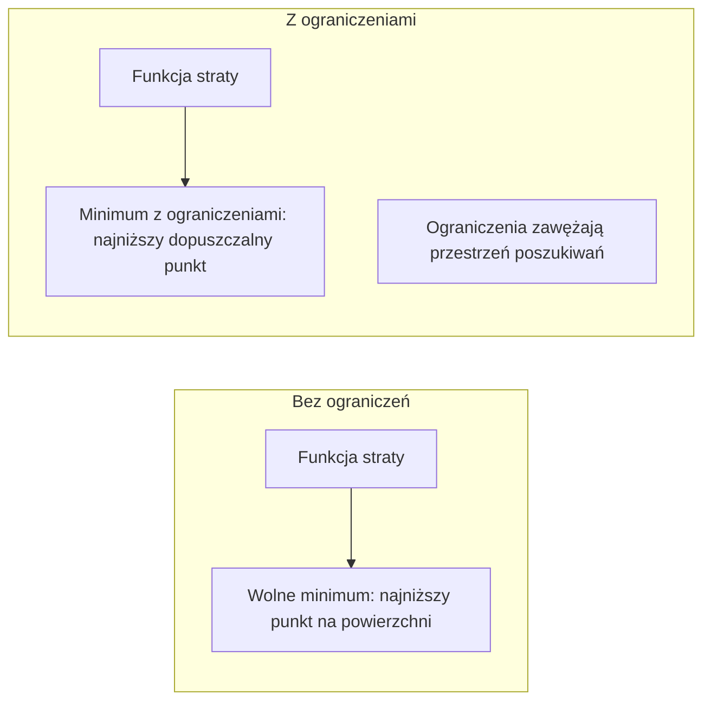
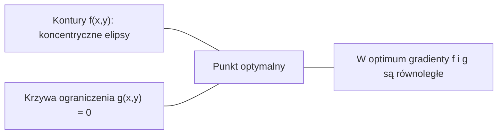

# Optymalizacja wypukła

> Problemy wypukłe posiadają tylko jedno minimum (jedną dolinę). W sieciach neuronowych występują ich miliony. Zrozumienie tej różnicy ma kluczowe znaczenie.

**Typ:** Praktyka (Zbuduj to)
**Język:** Python
**Wymagania wstępne:** Faza 1, Lekcje 04 (Rachunek różniczkowy dla ML), 08 (Optymalizacja)
**Czas:** ~90 minut

## Cele nauczania

- Weryfikowanie wypukłości funkcji za pomocą definicji, testu drugiej pochodnej oraz kryterium hesjanu.
- Zastosowanie metody Newtona i porównanie jej zbieżności kwadratowej z metodą spadku gradientu.
- Rozwiązywanie problemów optymalizacji z ograniczeniami za pomocą mnożników Lagrange'a i interpretowanie warunków KKT.
- Wyjaśnienie, dlaczego powierzchnie funkcji straty w sieciach neuronowych są niewypukłe, a mimo to algorytm SGD wciąż potrafi znaleźć dobre rozwiązania.

## Problem

W Lekcji 08 poznałeś metodę spadku gradientu (gradient descent), momentum i optymalizator Adam. Algorytmy te podążają w dół po każdej powierzchni, lecz nie dają żadnych gwarancji sukcesu. Metoda spadku gradientu na niewypukłym terenie może utknąć w suboptymalnym minimum lokalnym, zatrzymać się w punkcie siodłowym lub oscylować w nieskończoność. Stosuje się je, ponieważ sieci neuronowe są wysoce niewypukłe i często brakuje dla nich lepszej alternatywy.

Wiele problemów uczenia maszynowego ma jednak charakter wypukły: regresja liniowa, regresja logistyczna, SVM (maszyny wektorów nośnych), LASSO, regresja grzbietowa. Dla nich istnieje znacznie potężniejsze narzędzie: optymalizacja z gwarancjami matematycznymi. Problem wypukły posiada dokładnie jedno minimum globalne. Każdy algorytm podążający w dół na pewno je znajdzie. Nie ma tu potrzeby wielokrotnego restartowania algorytmu, skomplikowanych harmonogramów współczynnika uczenia ani polegania na szczęściu.

Zrozumienie wypukłości daje trzy główne korzyści. Po pierwsze, pozwala rozpoznać, kiedy problem jest łatwy do optymalizacji (wypukły), a kiedy trudny (niewypukły). Po drugie, dostarcza szybszych narzędzi, takich jak metoda Newtona. Po trzecie, rzuca światło na kluczowe koncepcje w ML, takie jak: regularyzacja jako ograniczenie, dualność w algorytmach SVM oraz powody, dla których głębokie uczenie w ogóle działa, mimo naruszania niemal wszystkich pożądanych własności optymalizacji wypukłej.

## Koncepcja

### Zbiory wypukłe

Zbiór S jest wypukły, jeśli dla dowolnych dwóch punktów w S, odcinek je łączący również znajduje się całkowicie wewnątrz S.

| Zbiory wypukłe | Zbiory niewypukłe |
|---|---|
| **Prostokąt**: dowolne dwa punkty wewnątrz można połączyć odcinkiem, który pozostaje wewnątrz. | **Kształt gwiazdy/półksiężyca**: odcinek łączący niektóre punkty wewnętrzne może wykraczać poza zbiór. |
| **Trójkąt**: ta sama własność zachodzi dla wszystkich punktów wewnątrz. | **Pączek (torus) / pierścień**: „dziura” sprawia, że pewne odcinki opuszczają zbiór. |
| Odcinek między dowolnymi dwoma punktami zawiera się w zbiorze. | Odcinek między niektórymi punktami opuszcza zbiór. |

Formalny test: dla dowolnych punktów x, y w S oraz dla dowolnego t w przedziale [0, 1], punkt tx + (1-t)y również musi należeć do S.

Przykłady zbiorów wypukłych:
- Prosta, płaszczyzna, cała przestrzeń R^n
- Kula (koło, sfera, hipersfera)
- Półprzestrzeń: {x : a^T x <= b}
- Przecięcie dowolnej liczby zbiorów wypukłych

Przykłady zbiorów niewypukłych:
- Kształt pączka (torus)
- Suma dwóch rozłącznych kół
- Dowolny zbiór z "wklęśnięciem" lub "dziurą"

### Funkcje wypukłe

Funkcja f jest wypukła, jeśli jej dziedzina jest zbiorem wypukłym oraz dla dowolnych dwóch punktów x, y w tej dziedzinie i dowolnego t w [0, 1] zachodzi:

```
f(tx + (1-t)y) <= t*f(x) + (1-t)*f(y)
```

Geometrycznie: odcinek łączący dowolne dwa punkty na wykresie funkcji leży powyżej wykresu lub dokładnie na nim.

| Własność | Funkcja wypukła | Funkcja niewypukła |
|---|---|---|
| **Test odcinka** | Odcinek łączący dwa punkty leży **powyżej lub na** krzywej. | Odcinek łączący niektóre punkty leży **poniżej** krzywej. |
| **Kształt** | Jedna miska/dolina zakrzywiona ku górze. | Wiele szczytów i dolin o zróżnicowanej krzywiźnie. |
| **Minima lokalne** | Każde minimum lokalne jest minimum globalnym. | Może istnieć wiele minimów lokalnych o różnej wartości. |

Typowe funkcje wypukłe:
- f(x) = x^2 (parabola)
- f(x) = |x| (wartość bezwzględna)
- f(x) = e^x (funkcja wykładnicza)
- f(x) = max(0, x) (ReLU – kawałkami liniowa, ale wypukła)
- f(x) = -log(x) dla x > 0 (ujemny logarytm)
- Dowolna funkcja liniowa f(x) = a^T x + b (zarówno wypukła, jak i wklęsła)

### Testowanie wypukłości

Trzy praktyczne metody sprawdzania wypukłości, uporządkowane od najprostszej:

**Test 1: Test drugiej pochodnej (1D).** Jeśli f''(x) >= 0 dla każdego x, to funkcja f jest wypukła.
- f(x) = x^2: f''(x) = 2 >= 0. Wypukła.
- f(x) = x^3: f''(x) = 6x. Ujemne dla x < 0. Niewypukła.
- f(x) = e^x: f''(x) = e^x > 0. Wypukła.

**Test 2: Test hesjanu (wiele zmiennych).** Jeśli macierz Hessego (hesjan) H(x) jest dodatnio półokreślona dla każdego x, to funkcja f jest wypukła. Hesjan to macierz drugich pochodnych cząstkowych.

**Test 3: Test z definicji.** Bezpośrednie sprawdzenie nierówności f(tx + (1-t)y) <= t*f(x) + (1-t)*f(y). Przydatne dla funkcji, dla których trudno obliczyć pochodne.

### Dlaczego wypukłość ma znaczenie

Główne twierdzenie optymalizacji wypukłej mówi:
**Dla funkcji wypukłej każde minimum lokalne jest jednocześnie minimum globalnym.**

Oznacza to, że metoda spadku gradientu nie może utknąć w suboptymalnym rozwiązaniu. Każda ścieżka prowadząca w dół dotrze do tego samego punktu docelowego. Algorytm gwarantuje zbieżność do rozwiązania optymalnego.



Konsekwencje:
- Brak konieczności stosowania wielokrotnych losowych inicjalizacji (losowych restartów).
- Brak konieczności stosowania wyrafinowanych harmonogramów współczynnika uczenia.
- Możliwość przeprowadzenia rygorystycznych dowodów zbieżności.
- Rozwiązanie jest unikalne (o ile funkcja nie jest płaska w okolicy minimum).

### Problemy wypukłe i niewypukłe w ML

| Problem | Czy jest wypukły? | Dlaczego? |
|--------|---------|-----|
| Regresja liniowa (MSE) | Tak | Funkcja straty jest kwadratowa względem wag. |
| Regresja logistyczna | Tak | Funkcja log-loss jest wypukła względem wag. |
| SVM (Hinge loss) | Tak | Maximum z funkcji liniowych jest wypukłe. |
| LASSO (regularyzacja L1) | Tak | Suma funkcji wypukłych jest wypukła. |
| Regresja grzbietowa (Ridge L2) | Tak | Funkcja kwadratowa + kwadratowa = funkcja wypukła. |
| Sieci neuronowe | Nie | Nieliniowe funkcje aktywacji tworzą niewypukły krajobraz. |
| K-średnie (K-means) | Nie | Krok dyskretnego przypisywania punktów do klastrów. |
| Faktoryzacja macierzy | Nie | Występuje w nim iloczyn niewiadomych. |

Modele liniowe z wypukłymi funkcjami straty są wypukłe. Kiedy dodasz warstwy ukryte z nieliniowymi aktywacjami, problem traci tę własność.

### Macierz Hessego (Hesjan)

Hesjan H funkcji f: R^n -> R to macierz n x n drugich pochodnych cząstkowych.

```
H[i][j] = ∂²f / (∂x_i ∂x_j)
```

Dla funkcji f(x, y) = x^2 + 3xy + y^2:

```
∂f/∂x = 2x + 3y       ∂²f/∂x² = 2      ∂²f/∂x∂y = 3
∂f/∂y = 3x + 2y       ∂²f/∂y∂x = 3      ∂²f/∂y² = 2

H = [ 2  3 ]
    [ 3  2 ]
```

Hesjan opisuje krzywiznę funkcji:
- Wszystkie wartości własne > 0: funkcja zakrzywia się w górę we wszystkich kierunkach (minimum lokalne, wypukła w tym punkcie).
- Wszystkie wartości własne < 0: funkcja zakrzywia się w dół we wszystkich kierunkach (maksimum lokalne, wklęsła).
- Różne znaki wartości własnych: punkt siodłowy (w niektórych kierunkach zakrzywia się w górę, w innych w dół).
- Wartość własna równa 0: płaska w danym kierunku (zdegenerowana krzywizna).

Aby funkcja była w pełni wypukła, hesjan musi być dodatnio półokreślony (wszystkie wartości własne >= 0) w każdym punkcie, a nie tylko w jednym.

### Metoda Newtona

Spadek gradientu wykorzystuje informacje pierwszego rzędu (gradient). Metoda Newtona opiera się na informacjach drugiego rzędu (hesjan). Dopasowuje ona aproksymację kwadratową funkcji w danym punkcie i przeskakuje bezpośrednio do minimum tej aproksymacji.

```
Reguła aktualizacji:
  x_new = x - H^(-1) * gradient

Porównaj ze spadkiem gradientu:
  x_new = x - lr * gradient
```

Metoda Newtona zastępuje skalarny współczynnik uczenia (`lr`) odwrotnością hesjanu. Skutkuje to automatycznym dostosowaniem wielkości i kierunku kroku do lokalnej krzywizny.



Zalety:
- Zbieżność kwadratowa w okolicach minimum (błąd drastycznie maleje z każdym krokiem).
- Brak konieczności ręcznego dostrajania współczynnika uczenia.
- Niezmienniczość względem skali (działa dobrze niezależnie od parametryzacji).

Wady:
- Pamięć rzędu O(n^2) oraz koszt O(n^3) związany z odwracaniem macierzy Hessego.
- Dla sieci neuronowej o milionie wag, wymaga to 10^12 komórek pamięci i 10^18 operacji.
- Całkowicie niepraktyczna w głębokim uczeniu (Deep Learning).

### Optymalizacja z ograniczeniami

Optymalizacja bez ograniczeń: minimalizacja f(x) dla dowolnego x.
Optymalizacja z ograniczeniami: minimalizacja f(x) pod pewnymi warunkami narzuconymi na x.

Większość rzeczywistych problemów posiada ograniczenia. Chcesz zminimalizować błąd, ale masz ograniczenia narzucone na złożoność modelu.



### Mnożniki Lagrange'a

Metoda mnożników Lagrange'a przekształca problem z ograniczeniami w problem bez ograniczeń.

Problem: zminimalizować f(x) pod warunkiem g(x) = 0.

Rozwiązanie: wprowadzamy nową zmienną (mnożnik Lagrange'a, lambda) i rozwiązujemy nowy problem:

```
L(x, lambda) = f(x) + lambda * g(x)
```

W rozwiązaniu optymalnym, gradient funkcji L musi być równy zero:

```
dL/dx = df/dx + lambda * dg/dx = 0
dL/dlambda = g(x) = 0
```

Intuicja geometryczna: w optimum (z ograniczeniem) gradient funkcji f musi być równoległy do gradientu funkcji g. W przeciwnym razie można by poruszać się wzdłuż krawędzi ograniczenia g i dalej minimalizować f.



Przykład: minimalizacja f(x,y) = x^2 + y^2 pod warunkiem x + y = 1.

```
L = x^2 + y^2 + lambda(x + y - 1)

dL/dx = 2x + lambda = 0  =>  x = -lambda/2
dL/dy = 2y + lambda = 0  =>  y = -lambda/2
dL/dlambda = x + y - 1 = 0

Z dwóch pierwszych: x = y
Podstawiając: 2x = 1, a więc x = y = 0.5, lambda = -1
```

Najbliższy punkt na prostej x + y = 1 do środka układu współrzędnych to (0.5, 0.5).

### Warunki KKT

Warunki Karusha-Kuhna-Tuckera to uogólnienie mnożników Lagrange'a dla ograniczeń nierównościowych.

Problem: zminimalizować f(x) pod warunkiem g_i(x) <= 0 dla i = 1, ..., m.

Warunki KKT (konieczne dla optymalności):

```
1. Stacjonarność:         df/dx + sum(lambda_i * dg_i/dx) = 0
2. Dopuszczalność pierwotna: g_i(x) <= 0  dla każdego i
3. Dopuszczalność dualna: lambda_i >= 0  dla każdego i
4. Komplementarność (równość z luzem): lambda_i * g_i(x) = 0  dla każdego i
```

Kluczem jest warunek komplementarności: albo ograniczenie jest "aktywne" (g_i(x) = 0, rozwiązanie leży na brzegu ograniczenia), albo mnożnik lambda wynosi zero (ograniczenie nie wpływa na rozwiązanie).

Warunki KKT mają kluczowe znaczenie w algorytmach SVM. Wektory nośne to punkty danych, dla których ograniczenie jest aktywne (lambda > 0). Wszystkie inne punkty mają lambda = 0 i nie wpływają na pozycję granicy decyzyjnej.

### Regularyzacja jako optymalizacja z ograniczeniami

Regularyzacja L1 i L2 nie jest tylko matematycznym trikiem. Reprezentują one niejawne problemy optymalizacji z ograniczeniami.

**Regularyzacja L2 (Ridge):**
```
Minimalizuj: Loss(w)   pod warunkiem: ||w||^2 <= t

Równoważna forma (bez ograniczeń):
Minimalizuj: Loss(w) + lambda * ||w||^2
```
Ograniczenie ||w||^2 <= t wyznacza kulę (okrąg w 2D). Rozwiązanie znajduje się w miejscu, w którym kontur funkcji straty po raz pierwszy dotyka tej kuli.

**Regularyzacja L1 (LASSO):**
```
Minimalizuj: Loss(w)   pod warunkiem: ||w||_1 <= t

Równoważna forma:
Minimalizuj: Loss(w) + lambda * ||w||_1
```
Ograniczenie ||w||_1 <= t definiuje romb (obrócony kwadrat w 2D).

| Własność | L2 (Okrąg) | L1 (Romb) |
|---|---|---|
| **Kształt ograniczenia** | Okrąg / Kula | Romb (Wielokąt wypukły) |
| **Gdzie dotyka kontur** | W dowolnym gładkim punkcie obwodu | Zazwyczaj w "ostrym" wierzchołku |
| **Charakter rozwiązania** | Wagi są małe, ale rzadko dokładnie zerowe | Część wag wynosi dokładnie zero |
| **Rezultat** | Skurcz wag (shrinkage) | Selekcja cech (rzadkość, sparsity) |

To tłumaczy, dlaczego L1 wymusza rzadkość (zerowanie wielu wag) – ostre rogi rombu (wyrównane do osi) najszybciej dotykają konturów funkcji straty.

### Dualność

Z każdym problemem optymalizacji (prymalnym) powiązany jest problem dualny. W przypadku problemów wypukłych, wartość optymalna problemu prymalnego i dualnego jest dokładnie taka sama. Nazywa się to silną dualnością.

Dualna funkcja Lagrange'a:
```
Problem prymalny: minimalizuj f(x) pod warunkiem g(x) <= 0
Lagrangian: L(x, lambda) = f(x) + lambda * g(x)
Funkcja dualna: d(lambda) = min_x L(x, lambda)
Problem dualny: maksymalizuj d(lambda) pod warunkiem lambda >= 0
```

Dlaczego dualność jest ważna:
- Często łatwiej jest rozwiązać problem dualny niż prymalny.
- Maszyny SVM są rozwiązywane w ich postaci dualnej, w której wszystko sprowadza się do iloczynów skalarnych między punktami danych (co umożliwia zastosowanie "sztuczki z jądrem" – kernel trick).
- Wartość problemu dualnego wyznacza dolne ograniczenie dla rozwiązania prymalnego, co pozwala ocenić jakość rozwiązania.

### Dlaczego głębokie uczenie działa mimo braku wypukłości?

Funkcje straty w sieciach neuronowych są wysoce niewypukłe. Z perspektywy klasycznej teorii, ich optymalizacja powinna być wręcz niemożliwa. A jednak SGD niezawodnie znajduje świetne rozwiązania. Wyjaśnia to kilka zjawisk:

**Większość minimów lokalnych jest wystarczająco dobra.** W przestrzeniach o bardzo wysokich wymiarach, zdecydowana większość punktów krytycznych (gradient=0) to punkty siodłowe, a nie lokalne minima. Minima lokalne, które faktycznie istnieją, mają tendencję do osiągania wartości bardzo zbliżonych do minimum globalnego. "Utknięcie w złym minimum lokalnym" jest w rzeczywistości mało prawdopodobne, gdy mamy miliony wymiarów.

**Prawdziwą przeszkodą są punkty siodłowe, nie minima.** W punkcie siodłowym niektóre kierunki są zakrzywione w górę, a inne w dół. W dużej przestrzeni, aby punkt krytyczny był minimum lokalnym, wszystkie z milionów kierunków musiałyby być zakrzywione w górę, co jest skrajnie nieprawdopodobne (2^(-n)). Wymuszany przez SGD szum pozwala modelowi uciec z punktów siodłowych.

**Nadmierna parametryzacja wygładza krajobraz.** Sieci posiadające znacznie więcej parametrów niż punktów w zbiorze treningowym generują gładsze, silniej połączone powierzchnie błędu. Co więcej, "szersze" i "głębsze" sieci mają mniej "złych" minimów lokalnych, co jest sprzeczne z intuicją.

**Szum stochastyczny pełni rolę niejawnej regularyzacji.** SGD pracujący na mini-batchach (paczkach danych) wprowadza szum, który utrudnia zatrzymanie się w "ostrych" (wąskich) minimach. Wąskie minima mają słabą generalizację; płaskie minima generalizują znacznie lepiej.

### Metody drugiego rzędu w praktyce

Czysta metoda Newtona jest niepraktyczna dla dużych modeli. Korzysta się z aproksymacji drugiego rzędu.

- **L-BFGS (Limited-memory BFGS):** Aproksymuje odwrotność hesjanu przechowując tylko m ostatnich różnic gradientu. Wymaga O(mn) pamięci. Świetnie sprawdza się w małym i średnim ML klasycznym (np. regresja logistyczna), ale nie w DL.
- **Naturalny gradient:** Zamiast hesjanu używa macierzy informacji Fishera. Pomaga modelować geometrię przestrzeni rozkładów prawdopodobieństwa. Algorytm K-FAC przybliża to rozwiązanie, czyniąc je stosowalnym w sieciach neuronowych.
- **Optymalizacja bez macierzy (Hessian-free):** Używa metody gradientów sprzężonych do bezpośredniego obliczania iloczynu Hx, bez materializowania całej macierzy Hessego (wymaga tylko O(n) czasu przez autodyferencjację).
- **Aproksymacje diagonalne (Adam itp.):** Optymalizator Adam oblicza drugi moment gradientu, który jest przybliżeniem przekątnej hesjanu. AdaHessian korzysta z prawdziwych wartości diagonalnych.

## Zbuduj to

### Krok 1: Weryfikator wypukłości

Zaimplementuj kod testujący wypukłość na drodze empirycznej, próbkując punkty w przestrzeni i weryfikując zachowanie nierówności z definicji:

```python
import random
import math

def check_convexity(f, dim, bounds=(-5, 5), samples=1000):
    violations = 0
    for _ in range(samples):
        x = [random.uniform(*bounds) for _ in range(dim)]
        y = [random.uniform(*bounds) for _ in range(dim)]
        t = random.uniform(0, 1)
        mid = [t * xi + (1 - t) * yi for xi, yi in zip(x, y)]
        lhs = f(mid)
        rhs = t * f(x) + (1 - t) * f(y)
        if lhs > rhs + 1e-10:
            violations += 1
    return violations == 0, violations
```

### Krok 2: Metoda Newtona w 2D

```python
def newtons_method(f, grad_f, hessian_f, x0, steps=50, tol=1e-12):
    x = list(x0)
    history = [x[:]]
    for _ in range(steps):
        g = grad_f(x)
        H = hessian_f(x)
        det = H[0][0] * H[1][1] - H[0][1] * H[1][0]
        if abs(det) < 1e-15:
            break
        # Odwrócenie macierzy 2x2
        H_inv = [
            [H[1][1] / det, -H[0][1] / det],
            [-H[1][0] / det, H[0][0] / det],
        ]
        dx = [
            H_inv[0][0] * g[0] + H_inv[0][1] * g[1],
            H_inv[1][0] * g[0] + H_inv[1][1] * g[1],
        ]
        x = [x[0] - dx[0], x[1] - dx[1]]
        history.append(x[:])
        if sum(gi ** 2 for gi in g) < tol:
            break
    return history
```

### Krok 3: Rozwiązywanie metodą Lagrange'a

```python
def lagrange_solve(f_grad, g_val, g_grad, x0, lr=0.01, lr_lambda=0.01, steps=5000):
    x = list(x0)
    lam = 0.0
    history = []
    for _ in range(steps):
        fg = f_grad(x)
        gv = g_val(x)
        gg = g_grad(x)
        # Spadek gradientu po zmiennych, wzrost po lambdzie
        x = [
            xi - lr * (fgi + lam * ggi)
            for xi, fgi, ggi in zip(x, fg, gg)
        ]
        lam = lam + lr_lambda * gv
        history.append((x[:], lam, gv))
    return history
```

### Krok 4: Porównanie pierwszego i drugiego rzędu

```python
def quadratic(x):
    return 5 * x[0] ** 2 + x[1] ** 2

def quadratic_grad(x):
    return [10 * x[0], 2 * x[1]]

def quadratic_hessian(x):
    return [[10, 0], [0, 2]]
```
Zastosowanie metody Newtona sprawi, że funkcja zbiegnie się do optimum w dokładnie 1 kroku, ponieważ precyzyjnie operuje na modelach kwadratowych. Spadek gradientu wymaga setek kroków na tej samej funkcji, z powodu asymetrycznego ("wydłużonego") kształtu doliny (nierównomierne wartości własne).

## Użyj tego

Do problemów w pełni wypukłych (Regresja logistyczna, SVM, LASSO):
- Korzystaj z gotowych rozwiązań (np. `scipy.optimize.minimize` z algorytmem `L-BFGS-B`, `liblinear`, CVXPY).
- Spodziewaj się, że zawsze otrzymasz optymalne globalne rozwiązanie.
- Zastosowanie metod drugiego rzędu (np. L-BFGS) jest powszechne i wysoce skuteczne.

Do problemów niewypukłych (Sieci Neuronowe, Głębokie Uczenie):
- Stosuj metody pierwszego rzędu (SGD, Adam, RMSprop).
- Zaakceptuj fakt, że wynik końcowy jest w dużej mierze zależny od losowej inicjalizacji wag modelu i ułożenia paczek danych (szum SGD).
- Używaj wyrafinowanych harmonogramów lr (Learning Rate), warstw Dropout i Weight Decay (regularyzacji).
- Minimum lokalne niemal zawsze okaże się całkowicie satysfakcjonujące, nie szukaj idealnego minimum globalnego.

```python
from scipy.optimize import minimize
import numpy as np

result = minimize(
    fun=lambda w: np.sum((y - X @ w) ** 2) + 0.1 * np.sum(w ** 2),
    x0=np.zeros(d),
    method='L-BFGS-B',
    jac=lambda w: -2 * X.T @ (y - X @ w) + 0.2 * w,
)
```

W przypadku SVM, postać dualna ułatwia implementację kernel tricka:

```python
from sklearn.svm import SVC

svm = SVC(kernel='rbf', C=1.0)
svm.fit(X_train, y_train)
print(f"Liczba wektorów nośnych: {svm.n_support_}")
```

## Ćwiczenia

1. **Galeria wypukłości.** Wykorzystaj funkcję sprawdzającą, aby przetestować: f(x) = x^4, f(x) = sin(x), f(x,y) = x^2 + y^2, f(x,y) = x*y, f(x) = max(x, 0). Czy wyniki są intuicyjnie zgodne z teorią?
2. **Wyścig algorytmów.** Uruchom opadanie gradientu oraz metodę Newtona dla funkcji f(x,y) = 50*x^2 + y^2 rozpoczynając od (10, 10). Ile kroków potrzebuje każdy algorytm? Jak opadanie gradientu reaguje na wysoki współczynnik uwarunkowania macierzy (stosunek największej do najmniejszej wartości własnej)?
3. **Mnożniki Lagrange'a w praktyce.** Zminimalizuj funkcję f(x,y) = (x-3)^2 + (y-3)^2 z ograniczeniem x + 2y = 4. Udowodnij matematycznie i algorytmicznie, że w optimum gradient f jest równoległy do gradientu funkcji ograniczenia.
4. **Analiza własności hesjanu.** Oblicz hesjan znanej funkcji Rosenbrocka w punktach (1, 1) oraz (-1, 1). Oblicz ich wartości własne. Co wartości własne mówią o lokalnej i globalnej krzywiźnie tej funkcji?

## Dalsze czytanie

- [Boyd & Vandenberghe: Convex Optimization](https://web.stanford.edu/~boyd/cvxbook/) - darmowy, absolutny standard w dziedzinie.
- [Bottou, Curtis, Nocedal: Optimization Methods for Large-Scale Machine Learning (2018)](https://arxiv.org/abs/1606.04838) - łączy teorię z praktyką głębokiego uczenia.
- [Choromanska et al.: The Loss Surfaces of Multilayer Networks (2015)](https://arxiv.org/abs/1412.0233) - dowód na to, dlaczego niewypukłe krajobrazy nie są tak straszne, na jakie wyglądają.
- [Nocedal & Wright: Numerical Optimization](https://link.springer.com/book/10.1007/978-0-387-40065-5) - rozbudowane referencje na temat L-BFGS i optymalizacji z ograniczeniami.
