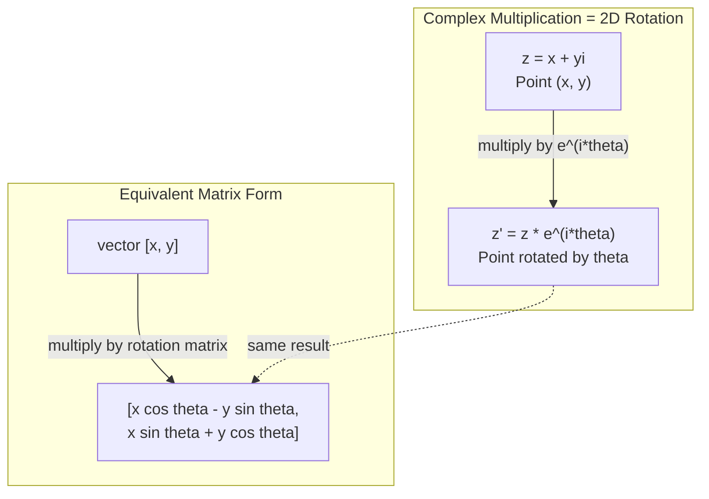
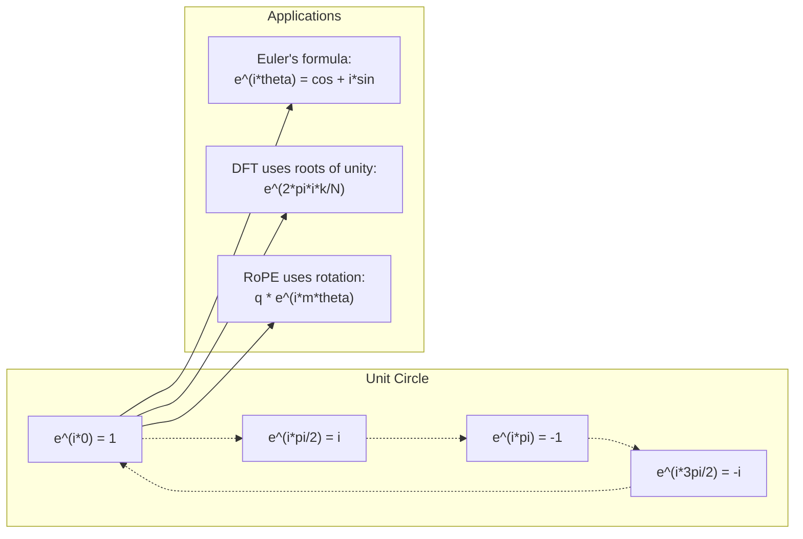

# Liczby zespolone dla AI

> Pierwiastek kwadratowy z -1 nie jest urojony. Jest kluczem do obrotów, częstotliwości i połowy przetwarzania sygnału.

**Typ:** Ucz się
**Język:** Python
**Wymagania wstępne:** Faza 1, Lekcje 01-04 (algebra liniowa, rachunek różniczkowy)
**Czas:** ~60 minut

## Cele nauczania

- Wykonuj złożoną arytmetykę (dodawanie, mnożenie, dzielenie, łączenie) zarówno w formie prostokątnej, jak i biegunowej
- Zastosuj wzór Eulera do konwersji zespolonych funkcji wykładniczych na funkcje trygonometryczne
- Zaimplementuj dyskretną transformatę Fouriera przy użyciu złożonych pierwiastków z jedności
- Wyjaśnij, w jaki sposób złożone rotacje leżą u podstaw RoPE i sinusoidalnego kodowania pozycyjnego w transformatorach

## Problem

Otwierasz artykuł o transformatach Fouriera i wszędzie widzisz `i`. Patrzysz na kodowanie pozycyjne transformatora i widzisz `sin` i `cos` przy różnych częstotliwościach — rzeczywistą i urojoną część złożonych wykładników. Czytasz o obliczeniach kwantowych i znajdujesz wszystko wyrażone w złożonych przestrzeniach wektorowych.

Liczby zespolone wydają się abstrakcyjne. System liczbowy zbudowany na pierwiastku kwadratowym z -1 wydaje się być matematyczną sztuczką. Ale to nie jest sztuczka. Jest to naturalny język rotacji i oscylacji. Za każdym razem, gdy coś się obraca, wibruje lub oscyluje, właściwym narzędziem są liczby zespolone.

Bez zrozumienia liczb zespolonych nie można zrozumieć dyskretnej transformaty Fouriera. Nie rozumiesz FFT. Nie możesz zrozumieć, jak RoPE (Rotary Position Embedding) działa we współczesnych modelach językowych. Nie możesz zrozumieć, dlaczego sinusoidalne kodowanie pozycyjne w oryginalnej pracy Transformera wykorzystuje częstotliwości, które wykorzystują.

W tej lekcji opracujemy od podstaw złożoną arytmetykę, połączymy ją z geometrią i pokażemy dokładnie, gdzie w uczeniu maszynowym pojawiają się liczby zespolone.

## Koncepcja

### Co to jest liczba zespolona?

Liczba zespolona składa się z dwóch części: części rzeczywistej i części urojonej.

```
z = a + bi

where:
  a is the real part
  b is the imaginary part
  i is the imaginary unit, defined by i^2 = -1
```

To jest to. Rozciągasz oś liczbową na płaszczyznę. Liczby rzeczywiste leżą na jednej osi. Liczby urojone znajdują się po drugiej stronie. Każda liczba zespolona jest punktem na tej płaszczyźnie.

### Złożona arytmetyka

**Dodawanie.** Dodaj do siebie części rzeczywiste i urojone.

```
(a + bi) + (c + di) = (a + c) + (b + d)i

Example: (3 + 2i) + (1 + 4i) = 4 + 6i
```

**Mnożenie.** Skorzystaj z prawa rozdzielności i pamiętaj, że i^2 = -1.

```
(a + bi)(c + di) = ac + adi + bci + bdi^2
                 = ac + adi + bci - bd
                 = (ac - bd) + (ad + bc)i

Example: (3 + 2i)(1 + 4i) = 3 + 12i + 2i + 8i^2
                            = 3 + 14i - 8
                            = -5 + 14i
```

**Koniugat.** Odwróć znak części urojonej.

```
conjugate of (a + bi) = a - bi
```

Iloczyn liczby zespolonej i jej koniugatu jest zawsze rzeczywisty:

```
(a + bi)(a - bi) = a^2 + b^2
```

**Dzielenie.** Pomnóż licznik i mianownik przez sprzężenie mianownika.

```
(a + bi) / (c + di) = (a + bi)(c - di) / (c^2 + d^2)
```

Eliminuje to część urojoną z mianownika, dając czystą liczbę zespoloną.

### Złożona płaszczyzna

Płaszczyzna zespolona odwzorowuje każdą liczbę zespoloną na punkt 2D. Oś pozioma to oś rzeczywista, oś pionowa to oś urojona.

```
z = 3 + 2i  corresponds to the point (3, 2)
z = -1 + 0i corresponds to the point (-1, 0) on the real axis
z = 0 + 4i  corresponds to the point (0, 4) on the imaginary axis
```

Liczba zespolona jest jednocześnie punktem i wektorem początku. Ta podwójna interpretacja sprawia, że ​​liczby zespolone są przydatne w geometrii.

### Forma polarna

Dowolny punkt na płaszczyźnie można opisać poprzez jego odległość od początku układu współrzędnych i kąt względem dodatniej osi rzeczywistej.

```
z = r * (cos(theta) + i*sin(theta))

where:
  r = |z| = sqrt(a^2 + b^2)     (magnitude, or modulus)
  theta = atan2(b, a)             (phase, or argument)
```

Forma prostokątna (a + bi) jest dobra do dodawania. Forma polarna (r, theta) jest dobra do mnożenia.

**Mnożenie w formie biegunowej.** Pomnóż wielkości, dodaj kąty.

```
z1 = r1 * e^(i*theta1)
z2 = r2 * e^(i*theta2)

z1 * z2 = (r1 * r2) * e^(i*(theta1 + theta2))
```

Dlatego liczby zespolone idealnie nadają się do rotacji. Mnożenie przez liczbę zespoloną o wielkości 1 jest czystym obrotem.

### Wzór Eulera

Pomost pomiędzy złożonymi wykładnikami a trygonometrią:

```
e^(i*theta) = cos(theta) + i*sin(theta)
```

Jest to najważniejsza formuła w tej lekcji. Kiedy theta = pi:

```
e^(i*pi) = cos(pi) + i*sin(pi) = -1 + 0i = -1

Therefore: e^(i*pi) + 1 = 0
```

Pięć podstawowych stałych (e, i, pi, 1, 0) połączonych w jednym równaniu.

### Dlaczego wzór Eulera ma znaczenie dla ML

Wzór Eulera mówi, że `e^(i*theta)` śledzi okrąg jednostkowy w miarę zmian theta. Przy theta = 0 jesteś w (1, 0). W theta = pi/2 jesteś w (0, 1). W punkcie theta = pi znajdujesz się w (-1, 0). Przy theta = 3*pi/2 znajdujesz się w (0, -1). Pełny obrót to theta = 2*pi.

Oznacza to, że złożone wykładniki SĄ obrotami. Rotacje są wszędzie w przetwarzaniu sygnałów i ML.

### Połączenie z obrotami 2D

Mnożenie liczby zespolonej (x + yi) przez e^(i*theta) powoduje obrót punktu (x, y) o kąt theta wokół początku układu współrzędnych.

```
Rotation via complex multiplication:
  (x + yi) * (cos(theta) + i*sin(theta))
  = (x*cos(theta) - y*sin(theta)) + (x*sin(theta) + y*cos(theta))i

Rotation via matrix multiplication:
  [cos(theta)  -sin(theta)] [x]   [x*cos(theta) - y*sin(theta)]
  [sin(theta)   cos(theta)] [y] = [x*sin(theta) + y*cos(theta)]
```

Dają identyczne rezultaty. Złożone mnożenie JEST obrotem 2D. Macierz rotacji to po prostu złożone mnożenie zapisane w notacji macierzowej.



### Fazory i sygnały obrotowe

Złożony wykładniczy e^(i*omega*t) to punkt obracający się wokół okręgu jednostkowego z częstotliwością kątową omega. Wraz ze wzrostem t punkt wyznacza okrąg.

Rzeczywista część tego punktu obrotowego to cos(omega*t). Część urojona to grzech(omega*t). Sygnał sinusoidalny jest cieniem obracającej się liczby zespolonej.

```
e^(i*omega*t) = cos(omega*t) + i*sin(omega*t)

Real part:      cos(omega*t)    -- a cosine wave
Imaginary part: sin(omega*t)    -- a sine wave
```

To jest reprezentacja wskazów. Zamiast śledzić wijącą się falę sinusoidalną, śledzisz płynnie obracającą się strzałkę. Przesunięcia fazowe stają się przesunięciami kątowymi. Zmiany amplitudy stają się zmianami wielkości. Dodawanie sygnałów staje się dodawaniem wektorowym.

### Korzenie jedności

N-te pierwiastki jedności to N punktów równomiernie rozmieszczonych na okręgu jednostkowym:

```
w_k = e^(2*pi*i*k/N)    for k = 0, 1, 2, ..., N-1
```

Dla N = 4 pierwiastki to: 1, i, -1, -i (cztery punkty kompasu).
Dla N = 8 otrzymasz cztery punkty kompasu plus cztery przekątne.

Korzenie jedności są podstawą dyskretnej transformaty Fouriera. DFT rozkłada sygnał na składowe przy N równomiernie rozmieszczonych częstotliwościach.

### Połączenie z DFT

Dyskretna transformata Fouriera sygnału x[0], x[1], ..., x[N-1] wynosi:

```
X[k] = sum_{n=0}^{N-1} x[n] * e^(-2*pi*i*k*n/N)
```

Każde X[k] mierzy stopień korelacji sygnału z k-tym pierwiastkiem z jedności – zespoloną sinusoidą o częstotliwości k. DFT dzieli sygnał na N obracających się fazorów i podaje amplitudę i fazę każdego z nich.

### Dlaczego „ja” nie jest wymyślone

Słowo „wyimaginowany” jest przypadkiem historycznym. Kartezjusz użył go lekceważąco. Ale nie jestem bardziej wyimaginowany niż liczby ujemne, gdy ludzie po raz pierwszy je odrzucili. Liczby ujemne odpowiadają na pytanie „co odejmiesz 5 od 3, aby otrzymać?” Jednostka urojona odpowiada na pytanie: „Co należy podnieść do kwadratu, aby otrzymać -1?”

Bardziej przydatne: i jest operatorem obrotu o 90 stopni. Pomnóż liczbę rzeczywistą przez i raz, a następnie obróć ją o 90 stopni w stosunku do osi urojonej. Pomnóż ponownie przez i (i^2), obróć o kolejne 90 stopni - teraz wskazujesz w kierunku ujemnym. Dlatego i^2 = -1. To nie jest tajemnicze. Jest to półobrót zbudowany z dwóch ćwierćobrotów.

Właśnie dlatego liczby zespolone są obecne w inżynierii wszędzie. Wszystko, co się obraca – fale elektromagnetyczne, stany kwantowe, oscylacje sygnałów, kodowanie pozycyjne – jest naturalnie opisywane liczbami zespolonymi.

### Złożone wykładniki a funkcje trygonometryczne

Przed wzorem Eulera inżynierowie zapisywali sygnały jako A*cos(omega*t + phi) – amplituda A, częstotliwość omega, faza phi. To działa, ale sprawia, że ​​arytmetyka jest bolesna. Dodanie dwóch cosinusów o różnych fazach wymaga tożsamości trygonometrycznych.

W przypadku złożonych wykładników ten sam sygnał to A*e^(i*(omega*t + phi)). Dodanie dwóch sygnałów jest po prostu dodaniem dwóch liczb zespolonych. Mnożenie (modulowanie) to po prostu mnożenie wielkości i dodawanie kątów. Przesunięcia fazowe stają się dodatkami kątowymi. Przesunięcia częstotliwości stają się mnożeniami przez fazory.

Cała dziedzina przetwarzania sygnałów przeszła na złożoną notację wykładniczą, ponieważ matematyka była czystsza. „Rzeczywisty sygnał” jest zawsze tylko rzeczywistą częścią złożonej reprezentacji. Część urojona jest traktowana jako księgowość, dzięki czemu cała algebra działa naturalnie.

### Podłączenie do transformatorów

**Sinusoidalne kodowanie pozycyjne** (oryginalny papier Transformer):

```
PE(pos, 2i) = sin(pos / 10000^(2i/d))
PE(pos, 2i+1) = cos(pos / 10000^(2i/d))
```

Pary sin i cos to rzeczywiste i urojone części złożonych potęg wykładniczych o różnych częstotliwościach. Każda częstotliwość zapewnia inną „rozdzielczość” pozycji kodowania. Niskie częstotliwości zmieniają się powoli (pozycja zgrubna). Wysokie częstotliwości zmieniają się szybko (dokładna pozycja). Razem nadają każdej pozycji unikalny odcisk palca częstotliwości.

**RoPE (osadzanie w pozycji obrotowej)** idzie dalej. Jawnie mnoży wektory zapytań i kluczy przez złożone macierze rotacji. Względna pozycja pomiędzy dwoma żetonami staje się kątem obrotu. Uwaga jest obliczana przy użyciu tych obróconych wektorów, dzięki czemu model jest wrażliwy na położenie względne poprzez złożone mnożenie.

| Operacja | Forma algebraiczna | Znaczenie geometryczne |
|----------|---------------|----------------------|
| Dodatek | (a+c) + (b+d)i | Dodanie wektora w samolocie |
| Mnożenie | (ac-bd) + (ad+bc)i | Obróć i skaluj |
| Koniugat | a - bi | Odbicie nad osią rzeczywistą |
| Wielkość | sqrt(a^2 + b^2) | Odległość od początku |
| Faza | atan2(b, a) | Kąt od dodatniej osi rzeczywistej |
| Podział | pomnóż przez koniugat | Odwróć obrót i przeskaluj |
| Moc | r^n * e^(i*n*theta) | Obróć n razy, skaluj o r^n |



## Zbuduj to

### Krok 1: Klasa złożona

Zbuduj klasę liczb zespolonych, która obsługuje arytmetykę, wielkość, fazę i konwersję między formami prostokątnymi i biegunowymi.

```python
import math

class Complex:
    def __init__(self, real, imag=0.0):
        self.real = real
        self.imag = imag

    def __add__(self, other):
        return Complex(self.real + other.real, self.imag + other.imag)

    def __mul__(self, other):
        r = self.real * other.real - self.imag * other.imag
        i = self.real * other.imag + self.imag * other.real
        return Complex(r, i)

    def __truediv__(self, other):
        denom = other.real ** 2 + other.imag ** 2
        r = (self.real * other.real + self.imag * other.imag) / denom
        i = (self.imag * other.real - self.real * other.imag) / denom
        return Complex(r, i)

    def magnitude(self):
        return math.sqrt(self.real ** 2 + self.imag ** 2)

    def phase(self):
        return math.atan2(self.imag, self.real)

    def conjugate(self):
        return Complex(self.real, -self.imag)
```

### Krok 2: Konwersja polarna i wzór Eulera

```python
def to_polar(z):
    return z.magnitude(), z.phase()

def from_polar(r, theta):
    return Complex(r * math.cos(theta), r * math.sin(theta))

def euler(theta):
    return Complex(math.cos(theta), math.sin(theta))
```

Sprawdź: `euler(theta).magnitude()` powinno zawsze wynosić 1.0. `euler(0)` powinien dać (1, 0). `euler(pi)` powinien dać (-1, 0).

### Krok 3: Obrót

Obracanie punktu (x, y) o kąt theta to jedno złożone mnożenie:

```python
point = Complex(3, 4)
rotated = point * euler(math.pi / 4)
```

Wielkość pozostaje taka sama. Zmienia się tylko kąt.

### Krok 4: DFT z arytmetyki zespolonej

```python
def dft(signal):
    N = len(signal)
    result = []
    for k in range(N):
        total = Complex(0, 0)
        for n in range(N):
            angle = -2 * math.pi * k * n / N
            total = total + Complex(signal[n], 0) * euler(angle)
        result.append(total)
    return result
```

To jest O(N^2) DFT. Każde wyjście X[k] jest sumą próbek sygnału pomnożoną przez pierwiastek jedności.

### Krok 5: Odwrotna DFT

Odwrotna DFT rekonstruuje oryginalny sygnał z jego widma. Jedyne zmiany w stosunku do DFT w przód: odwróć znak w wykładniku i podziel przez N.

```python
def idft(spectrum):
    N = len(spectrum)
    result = []
    for n in range(N):
        total = Complex(0, 0)
        for k in range(N):
            angle = 2 * math.pi * k * n / N
            total = total + spectrum[k] * euler(angle)
        result.append(Complex(total.real / N, total.imag / N))
    return result
```

Dzięki temu uzyskasz idealną rekonstrukcję. Zastosuj DFT, następnie IDFT, a otrzymasz oryginalny sygnał z precyzją maszynową. Żadne informacje nie zostaną utracone.

### Krok 6: Korzenie jedności

```python
def roots_of_unity(N):
    return [euler(2 * math.pi * k / N) for k in range(N)]
```

Sprawdź dwie właściwości:
- Każdy pierwiastek ma wielkość dokładnie 1.
- Suma wszystkich N pierwiastków wynosi zero (znoszą się one przez symetrię).

Te właściwości sprawiają, że DFT jest odwracalny. Pierwiastki jedności tworzą ortogonalną bazę w dziedzinie częstotliwości.

## Użyj tego

Python ma wbudowaną obsługę liczb zespolonych. Dosłowny `j` reprezentuje jednostkę urojoną.

```python
z = 3 + 2j
w = 1 + 4j

print(z + w)
print(z * w)
print(abs(z))

import cmath
print(cmath.phase(z))
print(cmath.exp(1j * cmath.pi))
```

W przypadku tablic numpy natywnie obsługuje liczby zespolone:

```python
import numpy as np

z = np.array([1+2j, 3+4j, 5+6j])
print(np.abs(z))
print(np.angle(z))
print(np.conj(z))
print(np.real(z))
print(np.imag(z))

signal = np.sin(2 * np.pi * 5 * np.linspace(0, 1, 128))
spectrum = np.fft.fft(signal)
freqs = np.fft.fftfreq(128, d=1/128)
```

## Wyślij to

Uruchom `code/complex_numbers.py`, aby wygenerować `outputs/skill-complex-arithmetic.md`.

## Ćwiczenia

1. **Ręcznie złożona arytmetyka.** Oblicz (2 + 3i) * (4 - i) i zweryfikuj za pomocą kodu. Następnie oblicz (5 + 2i) / (1 - 3i). Narysuj oba wyniki na płaszczyźnie zespolonej i sprawdź, czy mnożenie obróciło i przeskalowało pierwszą liczbę.

2. **Kolejność rotacji.** Zacznij od punktu (1, 0). Pomnóż przez e^(i*pi/6) dwanaście razy. Sprawdź, czy po 12 mnożeniach powracasz do (1, 0). Wydrukuj współrzędne na każdym etapie i potwierdź, że wyznaczają regularny 12-kąt.

3. **DFT znanego sygnału.** Utwórz sygnał będący sumą sin(2*pi*3*t) i 0,5*sin(2*pi*7*t) próbkowanych w 32 punktach. Uruchom swój DFT. Sprawdź, czy widmo wielkości ma piki przy częstotliwościach 3 i 7, przy czym pik w 7 jest połową wysokości piku w 3.

4. **Wizualizacja pierwiastków jedności.** Oblicz ósmy pierwiastek jedności. Sprawdź, czy sumują się do zera. Sprawdź, czy pomnożenie dowolnego pierwiastka przez pierwiastek pierwotny e^(2*pi*i/8) daje następny pierwiastek.

5. **równoważność macierzy rotacji.** Dla 10 losowych kątów i 10 losowych punktów sprawdź, czy zespolone mnożenie daje taki sam wynik jak mnożenie macierz-wektor z macierzą rotacji 2x2. Wydrukuj maksymalną różnicę liczbową.

## Kluczowe terminy

| Termin | Co to znaczy |
|------|----------------------------|
| Liczba zespolona | Liczba a + bi, gdzie a jest częścią rzeczywistą, b jest częścią urojoną, a i^2 = -1 |
| Jednostka urojona | Liczba i, zdefiniowana przez i^2 = -1. Nie jest to wyimaginowany w sensie filozoficznym – jest to operator rotacji |
| Złożona płaszczyzna | Płaszczyzna 2D, w której oś x jest rzeczywista, a oś y urojona. Nazywany także płaszczyzną Arganda |
| Wielkość (moduł) | Odległość od początku: sqrt(a^2 + b^2). Zapisane jako \|z\| |
| Faza (argument) | Kąt od dodatniej osi rzeczywistej: atan2(b, a). Zapisane jako arg(z) |
| Koniugat | Odbicie lustrzane na osi rzeczywistej: koniugat a + bi to a - bi |
| Forma polarna | Wyrażanie z jako r * e^(i*theta) zamiast a + bi. Ułatwia mnożenie |
| Wzór Eulera | e^(i*theta) = cos(theta) + i*sin(theta). Łączy wykładnicze z trygonometrią |
| Fazor | Obracająca się liczba zespolona e^(i*omega*t) reprezentująca sygnał sinusoidalny |
| Korzenie jedności | N liczb zespolonych e^(2*pi*i*k/N) dla k = 0 do N-1. N równomiernie rozmieszczonych punktów na okręgu jednostkowym |
| DFT | Dyskretna transformata Fouriera. Rozkłada sygnał na złożone składowe sinusoidalne przy użyciu pierwiastków z jedności |
| LINA | Osadzanie w pozycji obrotowej. Używa złożonego mnożenia do kodowania względnej pozycji w uwadze transformatora

## Dalsze czytanie

- [Wizualne wprowadzenie do wzoru Eulera](https://betterexplained.com/articles/intuitive-understanding-of-eulers-formula/) - buduje intuicję geometryczną bez ciężkiej notacji
- [Su et al.: RoFormer (2021)](https://arxiv.org/abs/2104.09864) - artykuł przedstawiający Rotary Position Embedding przy użyciu złożonych rotacji
- [Vaswani i in.: Attention Is All You Need (2017)](https://arxiv.org/abs/1706.03762) - oryginalna praca Transformera z sinusoidalnym kodowaniem pozycyjnym
- [3Blue1Brown: Wzór Eulera ze wstępną teorią grup](https://www.youtube.com/watch?v=mvmuCPvRoWQ) - wizualne wyjaśnienie, dlaczego e^(i*pi) = -1
- [Needham: Wizualna analiza złożona](https://global.oup.com/academic/product/visual-complex-analytic-9780198534464) – najlepsze wizualne przetwarzanie liczb zespolonych, pełne wglądu geometrycznego
- [Strang: Wprowadzenie do algebry liniowej, rozdz. 10](https://math.mit.edu/~gs/linearalgebra/) - liczby zespolone w kontekście algebry liniowej i wartości własnych