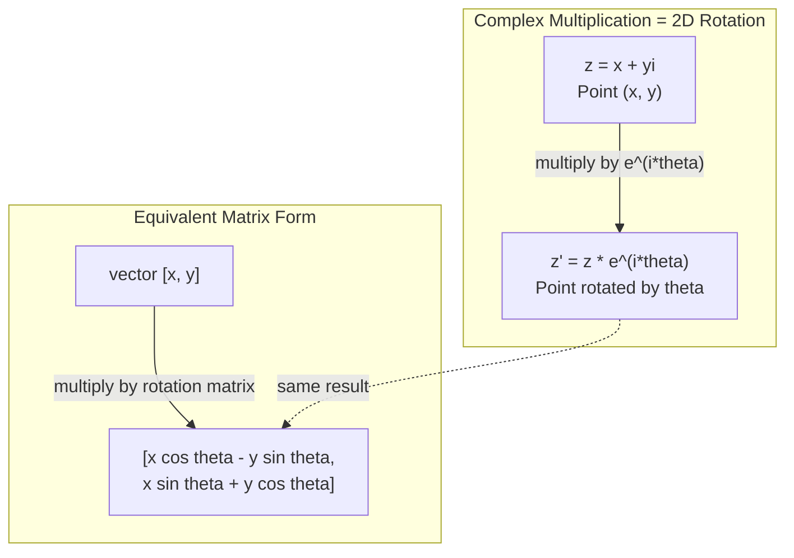
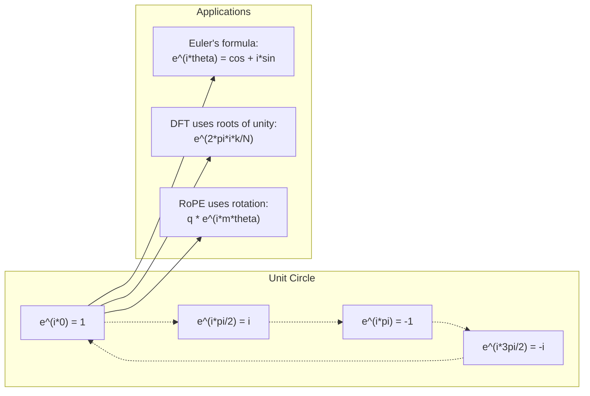

# Liczby zespolone w AI

> Pierwiastek kwadratowy z -1 nie jest "wyobrażony". To klucz do rotacji, częstotliwości i połowy przetwarzania sygnałów.

**Typ:** Nauka
**Język:** Python
**Wymagania wstępne:** Faza 1, Lekcje 01-04 (algebra liniowa, analiza matematyczna)
**Czas:** ~60 minut

## Cele nauki

- Wykonywanie operacji na liczbach zespolonych (dodawanie, mnożenie, dzielenie, sprzężenie) w postaci kartezjańskiej i biegunowej
- Zastosowanie wzoru Eulera do konwersji między eksponentami zespolonymi a funkcjami trygonometrycznymi
- Implementacja dyskretnej transformaty Fouriera za pomocą zespolonych pierwiastków z jedności
- Wyjaśnienie, jak rotacje zespolone leżą u podstaw RoPE i sinusoidalnych kodowań pozycyjnych w transformerach

## Problem

Otwierasz pracę o transformatach Fouriera i wszędzie widzisz `i`. Patrzysz na kodowania pozycyjne w transformerach i widzisz `sin` i `cos` o różnych częstotliwościach -- to części rzeczywiste i wyobrażone zespolonych eksponentów. Czytasz o obliczeniach kwantowych i okazuje się, że wszystko jest wyrażone w zespolonych przestrzeniach wektorowych.

Liczby zespolone wydają się abstrakcyjne. System liczbowy zbudowany na pierwiastku kwadratowym z -1 brzmi jak matematyczny trik. Ale to nie trik. To naturalny język rotacji i oscylacji. Każdy raz, gdy coś się obraca, wibruje lub oscyluje, liczby zespolone są właściwym narzędziem.

Bez zrozumienia liczb zespolonych nie zrozumiesz dyskretnej transformaty Fouriera. Nie zrozumiesz FFT. Nie zrozumiesz, jak działa RoPE (Rotary Position Embedding) w nowoczesnych modelach językowych. Nie zrozumiesz, czemu sinusoidalne kodowania pozycyjne w oryginalnej pracy o Transformerze używają takich częstotliwości, jakich używają.

Ta lekcja budowa arytmetykę zespoloną od podstaw, łączy ją z geometrią i pokazuje precyzyjnie, gdzie liczby zespolone występują w uczeniu maszynowym.

## Koncepcja

### Co to jest liczba zespolona?

Liczba zespolona ma dwie części: część rzeczywistą i część wyobrażoną.

```
z = a + bi

gdzie:
  a to część rzeczywista
  b to część wyobrażona
  i to jednostka wyobrażona, zdefiniowana jako i^2 = -1
```

I to wszystko. Rozszerzasz osię liczbową do płaszczyzny. Liczby rzeczywiste znajdują się na jednej osi. Liczby wyobrażone na drugiej. Każda liczba zespolona jest punktem na tej płaszczyźnie.

### Arytmetyka zespolona

**Dodawanie.** Dodaj części rzeczywiste do siebie, dodaj części wyobrażone do siebie.

```
(a + bi) + (c + di) = (a + c) + (b + d)i

Przykład: (3 + 2i) + (1 + 4i) = 4 + 6i
```

**Mnożenie.** Użyj prawa rozdzielności i pamiętaj, że i^2 = -1.

```
(a + bi)(c + di) = ac + adi + bci + bdi^2
                 = ac + adi + bci - bd
                 = (ac - bd) + (ad + bc)i

Przykład: (3 + 2i)(1 + 4i) = 3 + 12i + 2i + 8i^2
                            = 3 + 14i - 8
                            = -5 + 14i
```

**Sprzężenie.** Zamień znak części wyobrażonej.

```
sprzężenie (a + bi) = a - bi
```

Iloczyn liczby zespolonej i jej sprzężenia jest zawsze liczbą rzeczywistą:

```
(a + bi)(a - bi) = a^2 + b^2
```

**Dzielenie.** Pomnóż licznik i mianownik przez sprzężenie mianownika.

```
(a + bi) / (c + di) = (a + bi)(c - di) / (c^2 + d^2)
```

To usuwa część wyobrażoną z mianownika, dając w wyniku czystą liczbę zespoloną.

### Płaszczyzna zespolona

Płaszczyzna zespolona mapuje każdą liczbę zespoloną na punkt 2D. Osia pozioma to oś rzeczywista, osia pionowa to oś wyobrażona.

```
z = 3 + 2i  odpowiada punktowi (3, 2)
z = -1 + 0i odpowiada punktowi (-1, 0) na osi rzeczywistej
z = 0 + 4i  odpowiada punktowi (0, 4) na osi wyobrażonej
```

Liczba zespolona jest jednocześnie punktem i wektorem zaczynającym się w początku układu współrzędnych. Ta podwójna interpretacja sprawia, że liczby zespolone są użyteczne w geometrii.

### Postać biegunowa

Każdy punkt na płaszczyźnie można opisać za pomocą odległości od początku układu współrzędnych i kąta od dodatniej osi rzeczywistej.

```
z = r * (cos(theta) + i*sin(theta))

gdzie:
  r = |z| = sqrt(a^2 + b^2)     (moduł, lub wartość absolutna)
  theta = atan2(b, a)             (faza, lub argument)
```

Postać kartezjańska (a + bi) jest dobra do dodawania. Postać biegunowa (r, theta) jest dobra do mnożenia.

**Mnożenie w postaci biegunowej.** Pomnóż moduły, dodaj kąty.

```
z1 = r1 * e^(i*theta1)
z2 = r2 * e^(i*theta2)

z1 * z2 = (r1 * r2) * e^(i*(theta1 + theta2))
```

Właśnie dlatego liczby zespolone są idealne do rotacji. Mnożenie przez liczbę zespoloną o module 1 jest czystą rotacją.

### Wzór Eulera

Mostek między eksponentami zespolonymi a trygonometrią:

```
e^(i*theta) = cos(theta) + i*sin(theta)
```

To najważniejszy wzór w tej lekcji. Gdy theta = pi:

```
e^(i*pi) = cos(pi) + i*sin(pi) = -1 + 0i = -1

Stąd: e^(i*pi) + 1 = 0
```

Pięć fundamentalnych stałych (e, i, pi, 1, 0) połączonych w jednym równaniu.

### Dlaczego wzór Eulera jest ważny dla ML

Wzór Eulera mówi, że `e^(i*theta)` opisuje okrąg jednostkowy, gdy theta się zmienia. Przy theta = 0 jesteś w punkcie (1, 0). Przy theta = pi/2 jesteś w punkcie (0, 1). Przy theta = pi jesteś w punkcie (-1, 0). Przy theta = 3*pi/2 jesteś w punkcie (0, -1). Pełny obrót to theta = 2*pi.

To znaczy, że eksponenty zespolone TO rotacje. A rotacje są wszędzie w przetwarzaniu sygnałów i ML.

### Połączenie z rotacjami 2D

Mnożenie liczby zespolonej (x + yi) przez e^(i*theta) obraca punkt (x, y) o kąt theta wokół początku układu współrzędnych.

```
Rotacja poprzez mnożenie zespolone:
  (x + yi) * (cos(theta) + i*sin(theta))
  = (x*cos(theta) - y*sin(theta)) + (x*sin(theta) + y*cos(theta))i

Rotacja poprzez mnożenie macierzowe:
  [cos(theta)  -sin(theta)] [x]   [x*cos(theta) - y*sin(theta)]
  [sin(theta)   cos(theta)] [y] = [x*sin(theta) + y*cos(theta)]
```

Dają one identyczne wyniki. Mnożenie zespolone JEST rotacją 2D. Macierz rotacji to po prostu mnożenie zespolone zapisane w notacji macierzowej.



### Fazory i sygnały rotujące

Eksponent zespolony e^(i*omega*t) jest punktem rotującym wokół okręgu jednostkowego z prędkością kątową omega. Gdy t wzrasta, punkt opisuje okrąg.

Część rzeczywista tego rotującego punktu to cos(omega*t). Część wyobrażona to sin(omega*t). Sygnał sinusoidalny to "cień" rotującej liczby zespolonej.

```
e^(i*omega*t) = cos(omega*t) + i*sin(omega*t)

Część rzeczywista:   cos(omega*t)    -- fala kosinusoidalna
Część wyobrażona:    sin(omega*t)    -- fala sinusoidalna
```

To reprezentacja fazorowa. Zamiast śledzić falę sinusoidalną, śledzisz gładko rotującą strzałkę. Przesunięcia fazowe stają się przesunięciami kątowymi. Zmiany amplitudy stają się zmianami modułu. Dodawanie sygnałów staje się dodawaniem wektorów.

### Pierwiastki z jedności

N-te pierwiastki z jedności to N punktów równo rozmieszczonych na okręgu jednostkowym:

```
w_k = e^(2*pi*i*k/N)    dla k = 0, 1, 2, ..., N-1
```

Dla N = 4 pierwiastkami są: 1, i, -1, -i (cztery punkty kompasu).
Dla N = 8 otrzymujesz cztery punkty kompasu plus cztery przekątne.

Pierwiastki z jedności są fundamentem dyskretnej transformaty Fouriera. DFT rozkłada sygnał na składowe przy tych N równo rozmieszczonych częstotliwościach.

### Połączenie z DFT

Dyskretna transformata Fouriera sygnału x[0], x[1], ..., x[N-1] to:

```
X[k] = sum_{n=0}^{N-1} x[n] * e^(-2*pi*i*k*n/N)
```

Każde X[k] mierzy, jak silnie sygnał koreluje z k-tym pierwiastkiem z jedności -- zespoloną sinusoidą o częstotliwości k. DFT rozkłada sygnał na N rotujących fazorów i informuje cię o amplitudzie i fazie każdego z nich.

### Dlaczego i nie jest "wyobrażone"

Słowo "imaginary" (wyobrażone) to historyczny przypadek. Descartes użył tego określenia pejoratywnie. Ale i nie jest bardziej "wyobrażone" niż liczby ujemne były wtedy, gdy ludzie po raz pierwszy je odrzucali. Liczby ujemne odpowiadają na pytanie "co odjąć od 3, aby otrzymać -2?" Jednostka wyobrażona odpowiada na pytanie "co podnieść do kwadratu, aby otrzymać -1?"

Bardziej użytecznie: i to operator rotacji o 90 stopni. Pomnóż liczbę rzeczywistą przez i raz -- obracasz o 90 stopni do osi wyobrażonej. Pomnóż przez i jeszcze raz (i^2) -- obracasz o kolejne 90 stopni -- teraz wskazujesz w kierunku ujemnej części rzeczywistej. Dlatego i^2 = -1. To nie jest tajemnicze. To pół obrotu zbudowane z dwóch ćwiartek obrotu.

Właśnie dlaczego liczby zespolone są wszędzie w inżynierii. Wszystko, co się obraca -- fale elektromagnetyczne, stany kwantowe, oscylacje sygnałów, kodowania pozycyjne -- jest naturalnie opisywane przez liczby zespolone.

### Eksponenty zespolone vs funkcje trygonometryczne

Przed wzorem Eulera inżynierowie pisali sygnały jako A*cos(omega*t + phi) -- amplituda A, częstotliwość omega, faza phi. To działa, ale czyni arytmetykę bolesną. Dodanie dwóch kosinusoid o różnych fazach wymaga tożsamości trygonometrycznych.

Z eksponentami zespolonymi ten sam sygnał to A*e^(i*(omega*t + phi)). Dodanie dwóch sygnałów to po prostu dodanie dwóch liczb zespolonych. Mnożenie (modulacja) to po prostu mnożenie modułów i dodawanie kątów. Przesunięcia fazowe stają się dodawaniem kątów. Przesunięcia częstotliwości stają się mnożeniem przez fazory.

Cała dziedzina przetwarzania sygnałów przeszła na notację eksponentów zespolonych, bo matematyka jest czystsza. "Sygnał rzeczywisty" to zawsze tylko część rzeczywista reprezentacji zespolonej. Część wyobrażona jest przenoszona jako "księgowość", dzięki czemu cała algebra wychodzi naturalnie.

### Połączenie z transformerami

**Sinusoidalne kodowania pozycyjne** (oryginalna praca o Transformerze):

```
PE(pos, 2i) = sin(pos / 10000^(2i/d))
PE(pos, 2i+1) = cos(pos / 10000^(2i/d))
```

Pary sin i cos to części rzeczywiste i wyobrażone eksponentów zespolonych o różnych częstotliwościach. Każda częstotliwość zapewnia inną "rozdzielczość" kodowania pozycji. Niskie częstotliwości zmieniają się powoli (gruba pozycja). Wysokie częstotliwości zmieniają się szybko (dokładna pozycja). Razem dają każdej pozycji unikalny "odcisk częstotliwościowy".

**RoPE (Rotary Position Embedding)** idzie dalej. Wprost mnoży wektory zapytania i klucza przez zespolone macierze rotacji. Relatywna pozycja między dwoma tokenami staje się kątem rotacji. Uwaga jest obliczana za pomocą tych obróconych wektorów, dzięki czemu model jest czuły na pozycję relatywną poprzez mnożenie zespolone.

| Operacja | Forma algebraiczna | Znaczenie geometryczne |
|-----------|---------------|-------------------|
| Dodawanie | (a+c) + (b+d)i | Dodawanie wektorów na płaszczyźnie |
| Mnożenie | (ac-bd) + (ad+bc)i | Rotacja i skalowanie |
| Sprzężenie | a - bi | Odbicie względem osi rzeczywistej |
| Moduł | sqrt(a^2 + b^2) | Odległość od początku układu współrzędnych |
| Faza | atan2(b, a) | Kąt od dodatniej osi rzeczywistej |
| Dzielenie | mnożenie przez sprzężenie | Odwrotna rotacja i przeskalowanie |
| Potęga | r^n * e^(i*n*theta) | Rotacja n razy, skalowanie przez r^n |



## Zbuduj to

### Krok 1: Klasa Complex

Zbuduj klasę liczb zespolonych, która obsługuje arytmetykę, moduł, fazę i konwersję między postacią kartezjańską a biegunową.

```python
import math

class Complex:
    def __init__(self, real, imag=0.0):
        self.real = real
        self.imag = imag

    def __add__(self, other):
        return Complex(self.real + other.real, self.imag + other.imag)

    def __mul__(self, other):
        r = self.real * other.real - self.imag * other.imag
        i = self.real * other.imag + self.imag * other.real
        return Complex(r, i)

    def __truediv__(self, other):
        denom = other.real ** 2 + other.imag ** 2
        r = (self.real * other.real + self.imag * other.imag) / denom
        i = (self.imag * other.real - self.real * other.imag) / denom
        return Complex(r, i)

    def magnitude(self):
        return math.sqrt(self.real ** 2 + self.imag ** 2)

    def phase(self):
        return math.atan2(self.imag, self.real)

    def conjugate(self):
        return Complex(self.real, -self.imag)
```

### Krok 2: Konwersja biegunowa i wzór Eulera

```python
def to_polar(z):
    return z.magnitude(), z.phase()

def from_polar(r, theta):
    return Complex(r * math.cos(theta), r * math.sin(theta))

def euler(theta):
    return Complex(math.cos(theta), math.sin(theta))
```

Sprawdź: `euler(theta).magnitude()` powinno być zawsze równe 1.0. `euler(0)` powinno dać (1, 0). `euler(pi)` powinno dać (-1, 0).

### Krok 3: Rotacja

Obrót punktu (x, y) o kąt theta to jedno mnożenie zespolone:

```python
point = Complex(3, 4)
rotated = point * euler(math.pi / 4)
```

Moduł pozostaje taki sam. Zmienia się tylko kąt.

### Krok 4: DFT z arytmetyki zespolonej

```python
def dft(signal):
    N = len(signal)
    result = []
    for k in range(N):
        total = Complex(0, 0)
        for n in range(N):
            angle = -2 * math.pi * k * n / N
            total = total + Complex(signal[n], 0) * euler(angle)
        result.append(total)
    return result
```

To DFT o złożoności O(N^2). Każde wyjście X[k] jest sumą próbek sygnału pomnożonych przez pierwiastki z jedności.

### Krok 5: Odwrotna DFT

Odwrotna DFT odtwarza oryginalny sygnał z jego widma. Jedyne zmiany względem DFT do przodu: odwróć znak w wykładniku i podziel przez N.

```python
def idft(spectrum):
    N = len(spectrum)
    result = []
    for n in range(N):
        total = Complex(0, 0)
        for k in range(N):
            angle = 2 * math.pi * k * n / N
            total = total + spectrum[k] * euler(angle)
        result.append(Complex(total.real / N, total.imag / N))
    return result
```

To daje idealną rekonstrukcję. Zastosuj DFT, a potem IDFT, i otrzymasz oryginalny sygnał z dokładnością do precyzji maszynowej. Nie ma utraty informacji.

### Krok 6: Pierwiastki z jedności

```python
def roots_of_unity(N):
    return [euler(2 * math.pi * k / N) for k in range(N)]
```

Sprawdź dwie właściwości:
- Każdy pierwiastek ma moduł dokładnie równy 1.
- Suma wszystkich N pierwiastków jest równa zero (znoszą się przez symetrię).

Te właściwości to to, co czyni DFT odwracalnym. Pierwiastki z jedności tworzą ortogonalną bazę dla dziedziny częstotliwości.

## Użyj tego

Python ma wbudowane wsparcie dla liczb zespolonych. Literał `j` reprezentuje jednostkę wyobrażoną.

```python
z = 3 + 2j
w = 1 + 4j

print(z + w)
print(z * w)
print(abs(z))

import cmath
print(cmath.phase(z))
print(cmath.exp(1j * cmath.pi))
```

Dla tablic numpy obsługuje liczby zespolone natywnie:

```python
import numpy as np

z = np.array([1+2j, 3+4j, 5+6j])
print(np.abs(z))
print(np.angle(z))
print(np.conj(z))
print(np.real(z))
print(np.imag(z))

signal = np.sin(2 * np.pi * 5 * np.linspace(0, 1, 128))
spectrum = np.fft.fft(signal)
freqs = np.fft.fftfreq(128, d=1/128)
```

## Wypchnij to

Uruchom `code/complex_numbers.py`, aby wygenerować `outputs/skill-complex-arithmetic.md`.

## Zadania

1. **Arytmetyka zespolona ręcznie.** Oblicz (2 + 3i) * (4 - i) i zweryfikuj kodem. Następnie oblicz (5 + 2i) / (1 - 3i). Narysuj obie wartości na płaszczyźnie zespolonej i sprawdź, że mnożenie obróciło i przeskalowało pierwszą liczbę.

2. **Sekwencja rotacji.** Zacznij od punktu (1, 0). Pomnóż przez e^(i*pi/6) dwanaście razy. Zweryfikuj, że wracasz do (1, 0) po 12 mnożeniach. Wypisz współrzędne na każdym kroku i potwierdź, że opisują regularny 12-kąt.

3. **DFT znanego sygnału.** Stwórz sygnał będący sumą sin(2*pi*3*t) i 0.5*sin(2*pi*7*t) próbkowany w 32 punktach. Wykonaj swoją DFT. Zweryfikuj, że widmo amplitudy ma piki przy częstotliwościach 3 i 7, gdzie pik przy 7 ma wysokość równą połowie piku przy 3.

4. **Wizualizacja pierwiastków z jedności.** Oblicz 8 pierwiastków z jedności. Zweryfikuj, że ich suma wynosi zero. Zweryfikuj, że mnożenie któregokolwiek pierwiastka przez pierwiastek pierwotny e^(2*pi*i/8) daje następny pierwiastek.

5. **Równoważność macierzy rotacji.** Dla 10 losowych kątów i 10 losowych punktów zweryfikuj, że mnożenie zespolone daje ten sam wynik co mnożenie macierzy-wektora przez macierz rotacji 2x2. Wypisz maksymalną różnicę numeryczną.

## Kluczowe terminy

| Termin | Co oznacza |
|------|---------------|
| Liczba zespolona | Liczba a + bi, gdzie a jest częścią rzeczywistą, b jest częścią wyobrażoną, a i^2 = -1 |
| Jednostka wyobrażona | Liczba i, zdefiniowana jako i^2 = -1. Nie "wyobrażona" w filozoficznym sensie -- to operator rotacji |
| Płaszczyzna zespolona | Płaszczyzna 2D, gdzie osia x jest rzeczywista, a osia y jest wyobrażona. Zwana też płaszczyzną Arganda |
| Moduł (wartość absolutna) | Odległość od początku układu współrzędnych: sqrt(a^2 + b^2). Zapisywana jako \|z\| |
| Faza (argument) | Kąt od dodatniej osi rzeczywistej: atan2(b, a). Zapisywana jako arg(z) |
| Sprzężenie | Odbicie zwierciadlane względem osi rzeczywistej: sprzężenie a + bi to a - bi |
| Postać biegunowa | Wyrażenie z jako r * e^(i*theta) zamiast a + bi. Ułatwia mnożenie |
| Wzór Eulera | e^(i*theta) = cos(theta) + i*sin(theta). Łączy eksponenty z trygonometrią |
| Fazor | Rotująca liczba zespolona e^(i*omega*t) reprezentująca sygnał sinusoidalny |
| Pierwiastki z jedności | N liczb zespolonych e^(2*pi*i*k/N) dla k = 0 do N-1. N punktów równo rozmieszczonych na okręgu jednostkowym |
| DFT | Dyskretna transformata Fouriera. Rozkłada sygnał na zespolone składowe sinusoidalne za pomocą pierwiastków z jedności |
| RoPE | Rotary Position Embedding. Wykorzystuje mnożenie zespolone do kodowania pozycji relatywnej w mechanizmie uwagi transformera |

## Dalsze materiały

- [Visual Introduction to Euler's Formula](https://betterexplained.com/articles/intuitive-understanding-of-eulers-formula/) - budowa intuicji geometrycznej bez zbędnej notacji
- [Su et al.: RoFormer (2021)](https://arxiv.org/abs/2104.09864) - praca wprowadzająca Rotary Position Embedding wykorzystujący rotacje zespolone
- [Vaswani et al.: Attention Is All You Need (2017)](https://arxiv.org/abs/1706.03762) - oryginalna praca o Transformerze z sinusoidalnymi kodowaniami pozycyjnymi
- [3Blue1Brown: Euler's formula with introductory group theory](https://www.youtube.com/watch?v=mvmuCPvRoWQ) - wizualne wyjaśnienie, czemu e^(i*pi) = -1
- [Needham: Visual Complex Analysis](https://global.oup.com/academic/product/visual-complex-analysis-9780198534464) - najlepsze wizualne opracowanie liczb zespolonych, pełne geometrycznych spostrzeżeń
- [Strang: Introduction to Linear Algebra, Ch. 10](https://math.mit.edu/~gs/linearalgebra/) - liczby zespolone w kontekście algebry liniowej i wartości własnych
