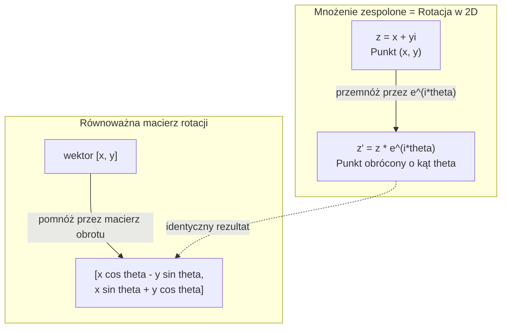
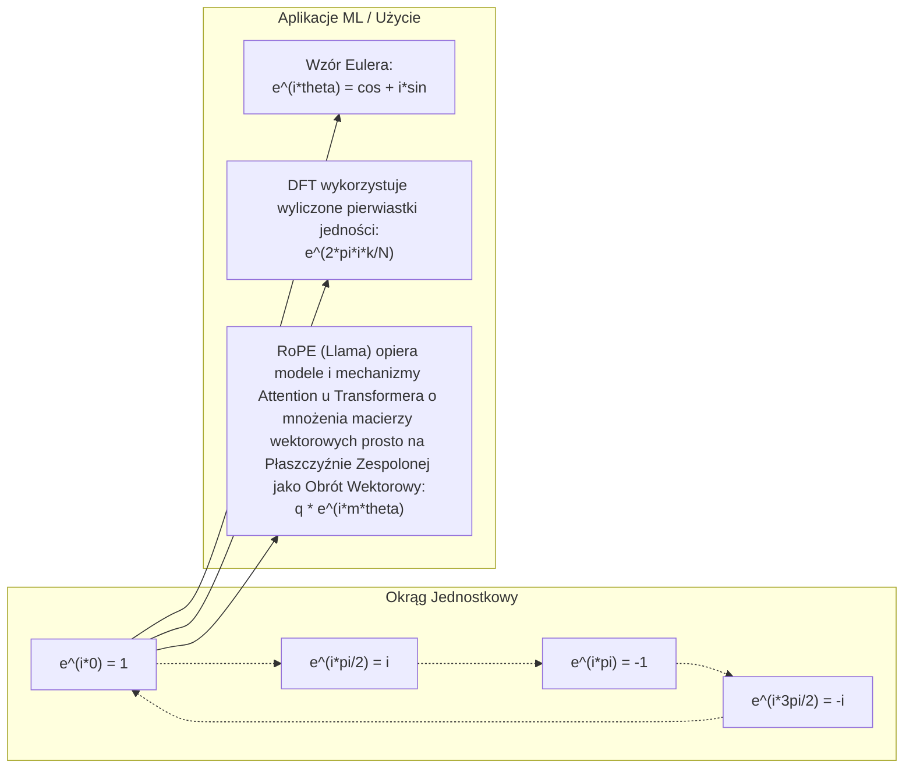

# Liczby zespolone w AI

> Pierwiastek kwadratowy z -1 nie jest rzeczą zmyśloną. Jest kluczem do rozumienia obrotów, częstotliwości i połowy współczesnego przetwarzania sygnałów.

**Typ:** Teoria (Ucz się)
**Język:** Python
**Wymagania wstępne:** Faza 1, Lekcje 01-04 (Algebra liniowa, Rachunek różniczkowy)
**Czas:** ~60 minut

## Cele nauczania

- Opanowanie arytmetyki liczb zespolonych (dodawanie, mnożenie, dzielenie, sprzężenie) w postaci algebraicznej i trygonometrycznej/wykładniczej.
- Wykorzystywanie wzoru Eulera do konwersji zespolonych funkcji wykładniczych na funkcje trygonometryczne.
- Implementacja dyskretnej transformaty Fouriera (DFT) przy użyciu pierwiastków z jedności.
- Zrozumienie, w jaki sposób obroty zespolone leżą u podstaw Rotary Position Embedding (RoPE) oraz sinusoidalnego kodowania pozycyjnego w transformatorach (Transformers).

## Problem

Czytasz artykuł badawczy na temat transformaty Fouriera i zauważasz, że wszędzie pełno jest litery `i`. Sprawdzasz działanie kodowania pozycyjnego w Transformerach i widzisz użycie `sin` oraz `cos` w różnych częstotliwościach – co okazuje się być częścią rzeczywistą i urojoną zespolonych funkcji wykładniczych. Analizujesz komputery kwantowe i uświadamiasz sobie, że cała dziedzina wyrażona jest poprzez zespolone przestrzenie wektorowe.

Liczby zespolone mogą wydawać się na początku bardzo abstrakcyjne. Konstruowanie systemu liczbowego w oparciu o pierwiastek kwadratowy z -1 przypomina matematyczną sztuczkę. Jednak wcale nią nie jest. To całkowicie naturalny język matematyki służący do operacji na obrotach i oscylacjach. Zawsze, gdy coś obraca się, wibruje lub rezonuje, właściwym narzędziem do analizy stają się liczby zespolone.

Bez dobrego opanowania liczb zespolonych nie zdołasz głęboko zrozumieć Dyskretnej Transformaty Fouriera (DFT). Nie zrozumiesz również mechaniki działania algorytmu FFT, zasady działania Rotary Position Embedding (RoPE) stosowanego w najnowszych modelach językowych, ani powodu, dla którego twórcy oryginalnego artykułu o Transformerze użyli właśnie takich, a nie innych częstotliwości w sinusoidalnym kodowaniu pozycyjnym.

Podczas tej lekcji solidnie przeanalizujemy od podstaw arytmetykę liczb zespolonych, powiążemy ją ściśle z geometrią na płaszczyźnie, a także wyraźnie wskażemy, w których konkretnie miejscach w uczeniu maszynowym ta wiedza okazuje się bezcenna.

## Koncepcja

### Czym jest liczba zespolona?

Liczba zespolona składa się z dwóch niezależnych części: części rzeczywistej i części urojonej.

```
z = a + bi

gdzie:
  a to część rzeczywista (real part)
  b to część urojona (imaginary part)
  i to jednostka urojona, zdefiniowana jako i^2 = -1
```

To tak naprawdę rozszerzenie jednowymiarowej osi liczbowej do postaci dwuwymiarowej płaszczyzny. Liczby rzeczywiste leżą wzdłuż jednej osi. Liczby czysto urojone na drugiej. Każda liczba zespolona wyznacza dokładny punkt na tej właśnie płaszczyźnie.

### Arytmetyka liczb zespolonych

**Dodawanie.** Wystarczy osobno dodać do siebie części rzeczywiste oraz urojone.

```
(a + bi) + (c + di) = (a + c) + (b + d)i

Przykład: (3 + 2i) + (1 + 4i) = 4 + 6i
```

**Mnożenie.** Użyj standardowego prawa rozdzielności z algebry i pamiętaj, że i^2 = -1.

```
(a + bi)(c + di) = ac + adi + bci + bdi^2
                 = ac + adi + bci - bd
                 = (ac - bd) + (ad + bc)i

Przykład: (3 + 2i)(1 + 4i) = 3 + 12i + 2i + 8i^2
                           = 3 + 14i - 8
                           = -5 + 14i
```

**Sprzężenie zespolone.** Zamień znak wyłącznie przy części urojonej.

```
Sprzężenie (conjugate) (a + bi) = a - bi
```

Iloczyn dowolnej liczby zespolonej i jej sprzężenia jest zawsze czystą, dodatnią liczbą rzeczywistą:

```
(a + bi)(a - bi) = a^2 + b^2
```

**Dzielenie.** Pomnóż licznik i mianownik przez sprzężenie mianownika.

```
(a + bi) / (c + di) = (a + bi)(c - di) / (c^2 + d^2)
```

Pozwala to pozbyć się jednostki urojonej z mianownika, zostawiając standardową postać algebraiczną na końcu.

### Płaszczyzna zespolona

Płaszczyzna zespolona (płaszczyzna Arganda) rzutuje każdą liczbę zespoloną na punkt w układzie 2D. Oś pozioma to zawsze oś rzeczywista, oś pionowa to oś urojona.

```
z = 3 + 2i   to punkt o współrzędnych (3, 2)
z = -1 + 0i  to punkt (-1, 0) leżący na osi rzeczywistej
z = 0 + 4i   to punkt (0, 4) leżący na osi urojonej
```

Liczbę zespoloną warto traktować dwojako: jako punkt, ale także jako dwuwymiarowy wektor startujący z początku układu współrzędnych (0,0). Ta podwójna własność czyni je tak przydatnymi w badaniu geometrii.

### Postać trygonometryczna i wykładnicza

Każdy punkt na płaszczyźnie można też opisać poprzez jego r-odległość (promień) od początku układu współrzędnych i theta-kąt mierzony względem dodatniej osi rzeczywistej.

```
z = r * (cos(theta) + i*sin(theta))

gdzie:
  r = |z| = sqrt(a^2 + b^2)   (moduł, długość, magnituda)
  theta = atan2(b, a)         (argument, faza, kąt)
```

Postać algebraiczna (a + bi) sprawdza się wybitnie przy dodawaniu, podczas gdy postać biegunowa/wykładnicza (r, theta) czyni z mnożenia trywialną operację.

**Mnożenie w postaci biegunowej.** Wystarczy pomnożyć wielkości i dodać do siebie kąty.

```
z1 = r1 * e^(i*theta1)
z2 = r2 * e^(i*theta2)

z1 * z2 = (r1 * r2) * e^(i*(theta1 + theta2))
```

Dzięki temu liczby zespolone stają się natywnym sposobem wyrażania obrotów. Przemnożenie wektora przez liczbę zespoloną o module 1 sprowadza się do czystego obrotu wokół zera, bez zmiany skali.

### Wzór Eulera

To fundamentalny łącznik między urojonymi potęgami i klasyczną trygonometrią:

```
e^(i*theta) = cos(theta) + i*sin(theta)
```

To zdecydowanie najważniejszy wzór na tej lekcji. Jeśli podstawimy pod thetę liczbę pi:

```
e^(i*pi) = cos(pi) + i*sin(pi) = -1 + 0i = -1

Zatem: e^(i*pi) + 1 = 0
```

To słynna Tożsamość Eulera. Łączy ona pięć najważniejszych stałych wszechświata (e, i, pi, 1, 0) w jednym precyzyjnym równaniu.

### Dlaczego Wzór Eulera ma znaczenie dla Machine Learning?

Wzór Eulera uczy, że wyrażenie `e^(i*theta)` kreśli idealny okrąg jednostkowy wraz ze zmianą parametru kątowego theta. Gdy theta = 0, znajdujesz się w punkcie (1, 0). Gdy theta = pi/2, jesteś w (0, 1). Przy theta = pi jesteś w (-1, 0). Przy 3*pi/2 w (0, -1). Pełny obrót o 360 stopni to 2*pi.

Morał z tego jest jednoznaczny: zespolone wykładniki SĄ po prostu rotacjami. A operacje na rotacjach można znaleźć w inżynierii wszędzie – na czele z przetwarzaniem sygnałów (signal processing) czy nowoczesnymi modelami ML.

### Połączenie z rotacjami wektorów w przestrzeni 2D

Rozważmy mnożenie liczby zespolonej (x + yi) przez operator e^(i*theta). Działanie to obraca początkowy punkt (x, y) w przestrzeni o zadany kąt theta względem środka układu współrzędnych.

```
Obrót realizowany przez mnożenie zespolone:
  (x + yi) * (cos(theta) + i*sin(theta))
  = (x*cos(theta) - y*sin(theta)) + (x*sin(theta) + y*cos(theta))i

Obrót przez tradycyjne mnożenie macierzy:
  [cos(theta)  -sin(theta)] [x]   [x*cos(theta) - y*sin(theta)]
  [sin(theta)   cos(theta)] [y] = [x*sin(theta) + y*cos(theta)]
```

Wyniki są identyczne. Złożone zespolone mnożenie JEST dosłownie rotacją 2D. Macierz rotacji (tzw. SO(2)) to po prostu inny sposób algebraiczy zapisu liczby zespolonej we współrzędnych macierzowych.



### Wskazy i sygnały obrotowe (Phasors)

Wyrażenie zespolone e^(i*omega*t) odpowiada punktowi nieustannie poruszającemu się po okręgu jednostkowym z określoną prędkością kątową zwaną `omega`. Gdy podnosimy parametr `t` (czas), wektor nakreśla kształt okręgu.

Część rzeczywista tego wirującego wektora to funkcja cos(omega*t). Część urojona to z kolei funkcja sin(omega*t). Podstawowe, falujące oscylacje fali sinusoidalnej to nic innego, jak jednowymiarowe rzuty (cienie) nieustannie rotującej liczby zespolonej w przestrzeni 2D.

```
e^(i*omega*t) = cos(omega*t) + i*sin(omega*t)

Część rzeczywista:      cos(omega*t)    -- fala kosinusoidalna
Część urojona:          sin(omega*t)    -- fala sinusoidalna
```

Podejście takie używa wskazów. Zamiast męczyć się z operacjami na zygzakowatych krzywych, inżynierowie śledzą pozycję poruszającej się gładko wskazówki zegara. Dowolne przesunięcia w fazie stają się po prostu naturalnymi zmianami kątów wektora, a zmiany natężenia (amplitudy) zmianą wielkości (długości r). Nakładanie na siebie dwóch sygnałów jest tak banalne jak nakładanie i dodawanie na siebie wektorów.

### Pierwiastki z jedności

N-te pierwiastki z jedności wyznaczają dokładnie N punktów na idealnym okręgu jednostkowym, które leżą w takich samych odległościach (kątach) od siebie:

```
w_k = e^(2*pi*i*k/N)    dla k = 0, 1, 2, ..., N-1
```

Gdy N = 4, uzyskamy następujące pierwiastki: 1, i, -1, -i (odpowiedniki 4 kierunków kompasu - Północ, Południe, Wschód, Zachód).
Gdy N = 8, otrzymamy cztery punkty kompasu z dodatkowymi pozycjami przekątnymi.

Pierwiastki z jedności są w praktyce samym "silnikiem" Dyskretnej Transformaty Fouriera (DFT). Algorytm ten bezstratnie dzieli surowy sygnał wejściowy na równo rozłożone spektrum komponentów ułożonych w idealnie zaplanowanych, predefiniowanych N krokach-częstotliwościach.

### Przejście do Transformacji Fouriera (DFT)

Dyskretna transformata Fouriera surowego sygnału wyrażonego w postaci x[0], x[1], ..., x[N-1] obliczana jest ze wzoru:

```
X[k] = suma_{n=0}^{N-1} x[n] * e^(-2*pi*i*k*n/N)
```

Wzór oznacza, że wynik punktu X[k] to nic innego jak bezpośrednie zmierzenie naturalnej korelacji wyjściowego sygnału i n-tej iteracji korzenia z jedności – potężnej sinusoidy ze ściśle sprecyzowaną częstotliwością K. Cały algorytm kroi więc nasz bazowy sygnał prosto na serię wirujących położeń poszczególnych fazorów, dzięki czemu jesteśmy w stanie opisać i sprawdzić amplitudę (rozmiar) uchyłu wszystkich z nich.

### Dlaczego "i" to wcale nie rzecz wymyślona

Pejoratywny, stosowany na co dzień wyraz "wyimaginowane" lub "urojone" to przykry wypadek lingwistyczny z głębokiej historii. Samo pojęcie ukształtowane było początkowo jako wyraz kpiny. Kartezjusz pisał tak lekceważąco, ponieważ system brzmiał "sztucznie". Trzeba jednak wspomnieć, że identyczna niechęć pojawiała się stulecia wcześniej po wdrożeniu pojęcia ujemnych cyfr. Ujemna jedynka jest ułudą – ma odpowiadać nam na pytanie co pozostanie przy próbie podkradzenia 5 obiektów ze zbioru złożonego z zaledwie 3 sztuk. Wyimaginowane `i` rozwiązuje inny logiczny supeł: "Jaką liczbę trzeba pomnożyć przez samą siebie, aby wynikiem równego ułożenia obu czynników z powrotem zostało negatywne -1?".

Najlepsza zasada z możliwych: Litera `i` to ugruntowany, uniwersalny mechanizm realizowania geometrycznego obrotu wektorów idealnie o 90 stopni na boki. Wzięcie absolutnie dowolnej rzeczywistej stałej i pomnożenie jej tylko przez 1x "i" obróci jej wektor tak, by lądował osadzony centralnie na Osi Urojonej, pod idealnym 90-stopniowym kątem do pierwowzoru. Pomnożenie wektora 1x przez urojone "i", po czym ponownie, i znów jeszcze jeden raz przez "i", dodaje mu za każdym obrotem stałe ułożenie 90 stopni (co znaczy, że z powrotem sprowadzimy go tuż do Osi Rzeczywistych i ląduje idealnie na minusie). Właśnie stąd wziął się słynny wzór na `i^2 = -1`. Zero magii, sam kwadrat. Jeden ułamek okręgu posklejany precyzyjnie z dwoma oddzielnymi ćwiartkami.

Z tego jedynego logicznego powodu wszystkie obroty 3D na Ziemi w inżynierii od kwantów i pól magnetycznych po graficzne rotacje w grach opierają system operacyjny ściśle na potężnej sile systemów zespolonych.

### Funkcje wykładnicze w zestawieniu z trygonometrią

Gdy Wzór Eulera był rzeczą nieznaną, najzwyklejsi konstruktorzy wyrysowywali składowe swoich rzutów wyłącznie jako czysty wektor: `A*cos(omega*t + phi)` (mając przed oczami Amplitudę w punkcie A, częstotliwości w punkcie Omega i parametry w punkcie fazy ułożone w Phi). Ten potwornie skomplikowany system pozwala naturalnie na prawidłowy zwrot osi i ułożenie, ale zmuszał analityków do morderczych obliczeń z setkami różnych wymiarów macierzy. Dodanie i sprawdzenie odległości na zaledwie kilkunastu wariantach nakładających się na siebie fal z różną szybkością zmuszało w końcu badaczy do szalonego operowania równaniami.

Wykorzystanie ułatwienia na podstawie reguł zespolonych daje nam natychmiast ułatwiony dostęp. Opis w pełni poprawnie rzutuje się jako `A*e^(i*(omega*t + phi))`. Do rzucania na siebie potwornych wariantów dwóch całkowicie odseparowanych oscylacji służy po dziś dzień wyłącznie prostolinijne działanie – ułożenie, wyliczenie i zwykłe "Dodanie" ich modułów zespolonych w matematyce. Wszelkie odległości faz odkładane do koszyka matematycznego jako rotacje przekuwają ułomne zmiany ułożeń bezpośrednio do błyskawicznego mnożenia parametrów Fazora.

Przemysł w całości skapitulował tu i wybrał najprostszą znaną metodę z operacjami wektorów na potęgach z "e". Każdy Rzeczywisty strumień na zewnątrz jest w pełni naturalną warstwą wejściową ukrytej, rotującej przestrzeni wyimaginowanej. Szybsze mnożenie skraca czas, zmniejszając udrękę sprzętową o 99.9%.

### Połączenie z modelem Transformer (Sieci neuronowe)

**Sinusoidalne kodowanie pozycyjne (Oryginalny Transformer):**

```
PE(pozycja, 2i)   = sin(pozycja / 10000^(2i/d))
PE(pozycja, 2i+1) = cos(pozycja / 10000^(2i/d))
```

Przewijające się co chwila pary obok siebie `sin` oraz `cos` w oryginalnych transformerach do przetwarzania NLP to po prostu część Rzeczywista jak i ta Urojona na wspólnej zespolonej przestrzeni wykładniczej, ukrywającej obok zdefiniowane na zewnątrz serie położeń w innej, oddalonej częstotliwości. Użycie osobnych kanałów pozwala modelom układać u siebie niezależne wielkości (sztywną i giętką częstotliwość ułożenia kodowania). Niskie sygnały zmieniają falę wolno do tyłu (duże położenie zgrubne całego słowa). Wysokie skoki obracają sygnał dynamicznie na zewnątrz (natychmiastowe układy dla końcówek danego wyrazu i jego precyzyjne odległości lokalne). Sumując potęgę obydwu, transformer kładzie na każdym "Tokenie" swój indywidualny i unikalny certyfikat falowej wibracji.

**RoPE (Rotary Position Embedding)** z popularnej Llamy rozwija to do absurdalnie precyzyjnego ideału. Zamiast doklejać sygnały po kątach osi w sposób naiwny, po prostu chwyta u źródła wszystkie wbudowane wektory dla zapytań modeli (Query i Key) przez odgórne narzucenie i dosłowne przemnożenie potęg wektorów na naturalną, zespoloną przestrzeń obrotową dla macierzy. Dokładny zakres odległości pośrodku dla osadzonych słów naturalnie włącza się jako czysty matematyczny kąt zagięcia (Obrotu). Parametr ten "Attention" natychmiast kalkuluje użycie zakrzywionego obrotu dla wektora ułatwiając sprawne przetwarzanie modeli i sprawia absolutną stabilizację i niewrażliwość względem zmian długości i wielkości tekstu dla Transformerów, bazując jedynie na potędze i zasadach z mnożenia zespolonego.

| Działanie algebraiczne | Sposób wyrażania zmiennych | Geometryczne rozwinięcie pojęcia |
|----------|---------------|----------------------|
| Dodawanie | (a+c) + (b+d)i | Matematyczne zsumowanie wektora (rzut z dołu na ukos 2D na Płaszczyznę) |
| Mnożenie | (ac-bd) + (ad+bc)i | Zastosowanie Rotacji osi po kątach ze Skalowaniem i Zwiększaniem siły modułu wektorów |
| Sprzężenie | a - bi | Proste, logiczne wykonanie natychmiastowego Odbicia Lusterka dla Rzeczywistych punktów prosto w kraniec wymiaru urojonego |
| Wielkość (Magnituda) | sqrt(a^2 + b^2) | Odległość punktu rzutu względem oryginalnego ułożenia Startu Płaszczyzny - czyli Osi Zerowej wektora początkowego |
| Faza wektorowa | atan2(b, a) | Położenie startu mierzalne dla osi Dodatnich układów na wyjściu i w pełni wyrażony w Płaszczyźnie Kąt Wektora |
| Dzielenie | mnóż na wprost na obrócone wcześniej sprzężenie | Procedura wyłuskiwania Zagięcia z Zespolonego powrotem wstecz prosto z zachowaniem idealnie ułożonej siły wektora bazowego (Przewróć + Oddal / Zwiększ i wyciągnij) |
| Podnoszenie Wektora i Częstotliwości ułożeń do Ostatecznej Potęgi | r^n * e^(i*n*theta) | Precyzyjne ułożenie RZUTOWANIA z zakręceniem po całej wielkości aż o "N" kroków naprzód od bazy z dokładnym potęgowaniem promienia "r^n" |



## Zbuduj to

### Krok 1: Definicja Klasy z Operacjami Zespolonymi

Twoim zadaniem jest napisanie własnej wewnętrznej definicji opartej od nowa o natywne kodowanie operacji dla Płaszczyzny. Oprogramowanie musi wspierać arytmetykę dodawań, z wyliczaniem rozmiarów kątów i gładkimi konwersjami.

```python
import math

class Complex:
    def __init__(self, real, imag=0.0):
        self.real = real
        self.imag = imag

    def __add__(self, other):
        return Complex(self.real + other.real, self.imag + other.imag)

    def __mul__(self, other):
        r = self.real * other.real - self.imag * other.imag
        i = self.real * other.imag + self.imag * other.real
        return Complex(r, i)

    def __truediv__(self, other):
        denom = other.real ** 2 + other.imag ** 2
        r = (self.real * other.real + self.imag * other.imag) / denom
        i = (self.imag * other.real - self.real * other.imag) / denom
        return Complex(r, i)

    def magnitude(self):
        return math.sqrt(self.real ** 2 + self.imag ** 2)

    def phase(self):
        return math.atan2(self.imag, self.real)

    def conjugate(self):
        return Complex(self.real, -self.imag)
```

### Krok 2: Konwersje ułożeń na postać wykładniczą a także zastosowanie Reguły Wzoru Eulera

```python
def to_polar(z):
    return z.magnitude(), z.phase()

def from_polar(r, theta):
    return Complex(r * math.cos(theta), r * math.sin(theta))

def euler(theta):
    return Complex(math.cos(theta), math.sin(theta))
```

Krótki i szybki test dla weryfikacji modułu Wzoru Eulera: Podstawienie i zweryfikowanie wyjścia dla sprawdzanego wyniku używając natywnej procedury `euler(theta).magnitude()` każdorazowo i wymuszenie wyjścia rezultatu dla stałej wartości wyjściowej ma gwarantować zaokrąglenie w idealnym rozmiarze zawsze jako matematyczne i precyzyjne 1.0. Polecenie skryptu dla `euler(0)` natychmiast upewni was i zaręczy za gwarancją zwrotu pozycji wprost na koordynaty leżące pod wektorem Płaszczyzny Startowej Zera jako krotka wartości Rzeczywistej do Urojonej leżąca punktowo z brzegu macierzy jako zwrot wielkości `(1, 0)`. Ponowne wykonanie funkcji `euler(pi)` odkręci koordynat w kierunku na zachód dla wyjścia jako `(-1, 0)`.

### Krok 3: Obracanie punktu w 2D na Płaszczyźnie Osi Zespolonej

Rotacja o zaplanowany odgórnie dowolny z kątów theta sprowadza się natychmiastowo tylko do podłożenia ich wszystkich pod jedno zespolone działanie iloczynu wektorów mnożących:

```python
point = Complex(3, 4)
rotated = point * euler(math.pi / 4)
```

Wielkość modułu zawsze wyliczy i zatrzyma parametry na stałym dystansie bez uszkodzenia położeń Rzeczywistych punktów skali. Naruszeniu ulega tylko wielkość wymierzonego kąta fali skręcającej do tyłu albo posuwającej proces dla fazy.

### Krok 4: Transformata z Arytmetyką Zespoloną wprost do zbudowania natywnego DFT

```python
def dft(signal):
    N = len(signal)
    result = []
    for k in range(N):
        total = Complex(0, 0)
        for n in range(N):
            angle = -2 * math.pi * k * n / N
            total = total + Complex(signal[n], 0) * euler(angle)
        result.append(total)
    return result
```

Wdrożony system rzutowania operacji wymaga kalkulacji o wykładniczej trudności O(N^2) (Obliczania klasycznego z pętli podwójnych z zagnieżdżeniem z góry do samego dołu) z implementacjami opartymi z nałożeniem na pętle rzutowania N. Po wygenerowaniu dla składowych odpowiedzi dla macierzy każdego z punktów, wektor X[k] zachowuje i wymusza zwrot całkowity w ułożeniach sumarycznych na nałożenia skoków próbek surowego i płaskiego oryginalnego zjawiska wymnożonego i przekształconego przy zastosowaniu z użyciem reguły rzutującej każdy węzeł w korzenie jednostkowe ułożone wokół zer.

### Krok 5: Odwrócona Transformata Fouriera dla wektorów w IDFT

Algorytmy weryfikacyjne odwrotnej DFT składają rozproszone parametry natychmiast z powrotem. Wycofują się w surowe położenie na podstawie zczytanych od samego końca rozbitych sygnałów widma do skoku ułożenia wstecz. Różnica sprowadza się tu do błyskawicznej, odgórnej negacji - wyłączenia nakładanego negatywnego minusa wyliczeń poprzez cofnięcie z nakładką wywróconej zmiennej potęgi z podzieleniem jej u samej góry przez N.

```python
def idft(spectrum):
    N = len(spectrum)
    result = []
    for n in range(N):
        total = Complex(0, 0)
        for k in range(N):
            angle = 2 * math.pi * k * n / N
            total = total + spectrum[k] * euler(angle)
        result.append(Complex(total.real / N, total.imag / N))
    return result
```

Masz absolutną gwarancję otrzymania w stu procentach wolnej od strat, odwracalnej i perfekcyjnej, cyfrowej rekonstrukcji surowej linii pierwowzoru natychmiastowego z maszynową jakością zaokrąglenia kodu wyjścia po wejściu w algorytmy procedury wywołań w DFT a następnie rzucając ich sumę przez algorytm ze zmiennymi modułu do natychmiastowej rekonstrukcji poleceń i odwracania kodu w algorytm nakładania odzyskując całościowo strukturę dla rzędu poprzez nałożenie IDFT dla natychmiastowych wektorowych powrotów operacyjnych w zdefiniowane macierze wektorów w Pythonie. Skalowanie na skos Płaszczyzny bez opóźnień odbija je nie niszcząc jakości wymiarowej. Żadna paczka kodu nie będzie tracona w przestrzeni macierzy po przeskoku z Osi Rzeczywistych i Zespolonych do Modułu Wyimaginowanego z powrotem po wejściu poprzez system faz oraz magnitud (rozmiaru r dla okręgu ułożenia Kątów Osi Urojonej po konwersjach Zespolonych).

### Krok 6: Pierwiastki Zespolone Jedności Systemu wektorów Płaszczyzny

```python
def roots_of_unity(N):
    return [euler(2 * math.pi * k / N) for k in range(N)]
```

Dwie właściwości tego punktu narzuconej Płaszczyzny są do ujętego punktu wymaganej stałej weryfikacji poprzez test na Osi Rzeczywistości by sprawdzić jak stabilnie okrąg układa parametry operacyjne po Płaszczyźnie wokół punktów układów rzutujących na moduł.
- Rozmiar wszystkich punktów ma stały wymiar z absolutnie gwarantowanym zaokrągleniem w Płaszczyznę rzędu promienia z włączonym ułożeniem Modułu wokół osi po konwersjach zawsze 1.
- Zmieszanie wymiarów od sumy wyciągania dla rozstawu obwodu osadzenia N i wymnożenia zweryfikuje system jako nałożony zero (symetria sprawia anulowanie skosów kątowych Zespolonych faz z odłożonym skosem obrotu na odwrót poprzez osadzenia względem wymiaru urojonego ze zwrotem Północ - Południe i odwrotnie w poprzek dla wariantów bocznych skosu na Wschód do układów na Rzut względem nałożonego odwrotnego zwrotu Zachodu do symetrii Osi X do podłożenia i skorygowania na -1 i w tył Płaszczyzny, co dla operacji sum w Płaszczyźnie Urojonej połączonych ze zwrotami -Y na przeciw zeruje nakładające w Rzut wyjścia operacji z sum od nałożeń wielowymiarowych w Moduł ostatecznie do perfekcyjnego wyjścia nakładek po Osi zero punktów w matrycę ułożeń faz Zespolonych od Kątów startu do Zera Płaszczyzn operacyjnych na rzuty dla rzędu wejściowego).
Wymogi do natychmiastowego zagwarantowania sprawności układów pozwalają algorytmowi po skosie na bezstratne przekierowania natychmiastowe Osi Modułowych na DFT wraz z perfekcyjnym nałożeniem z na wyjście operacyjnych ułożeń wstecz dla Zespolonych bez użycia Rzutowań powrotów faz Kąta w dół, na straty Rzeczywiste dla wyników wejścia IDFT by algorytmy Płaszczyzn od spodu z powrotem po Zespolonych macierzach mogły natychmiast stworzyć nakładkę pod pełne rekonstrukcje surowej warstwy wibracji na płaszczyzny matryc częstotliwościowych z precyzją wyciągania pierwotnego wektora do Płaszczyzny startu ułożeń.

## Zastosowanie i gotowe Narzędzia

Środowisko Pythona wspiera kodowanie układów i Zespolone Wektory w standardzie od spodu bezpośrednio dla macierzy rzutu na Płaszczyźnie modułów Osi. Wdrożenie ułożonej literki `j` ukrytej w systemach rzutowań dla kodu służy od razu po podpięciu za nakładkę i operacyjną deklarację "Jednostki urojonej i Zespolonych parametrów modułu" na wejściach i kodowanych wyjściach w Rzut do Osi Y by ułatwić użycie kodu z pominięciem deklaracji od zera z nakładek Wektora klasy:

```python
z = 3 + 2j
w = 1 + 4j

print(z + w)
print(z * w)
print(abs(z)) # wylicza Moduł (r) Zespolony (amplitudę dla Płaszczyzn rzutu Osi) używając wyciągnięcia

import cmath
print(cmath.phase(z)) # Kąt rzutu Fazy Theta
print(cmath.exp(1j * cmath.pi)) # Wzór Eulera by obrócić rzut Osi w Kąty (na zachód po skosie osi Zespolonych prosto w Rzeczywistą -1)
```

Wykorzystując wywoływane dla Data Science ogromne biblioteki typu Numpy dla Płaszczyzn wektorów i do przesyłu po sieci Zespolonych osi i ułożeń tablic na Macierzach, z użyciem szybkiego podkładu nakładek na potężny silnik C by natychmiast wykrzesać rzuty pod Macierz Zespoloną wprost z bazy bez pętli wielowarstwowych operacji kodów od Płaszczyzn dla przyspieszenia skoków modułu układów tablic na skos z Rzutu Wektora:

```python
import numpy as np

z = np.array([1+2j, 3+4j, 5+6j])
print(np.abs(z))    # Natychmiast użyte Macierze i Moduły Amplitudy Płaszczyzn Osi dla rzutu po Tablicach Numpy dla wektorów i Płaszczyzny
print(np.angle(z))  # Wyniki od rzutu tablicowych Fazy i Zespolonego wyciągnięcia Kąta Theta na Płaszczyźnie z Osi
print(np.conj(z))   # Wektory odbić wyciąganych po skosie Macierzy dla Sprzężeń (Zamiana rzutów od Osi po X ze zminusem nakładanym Y) na Płaszczyźnie
print(np.real(z))   # Ucięta wyselekcjonowana tablica Macierzy z Wektorem ukrytego Rzeczywistego X dla Tablic NumPy z Osi Zespolonej z użyciem NumPy wywołań w Macierzy dla Rzutu z Rzeczywistych Parametrów wejściowych punktu
print(np.imag(z))   # Wycięty Wektor z tablic na wyjście do Urojonego "j" punktów Płaszczyzny z Y na rzut wertykalny i oddzielenie Urojonej z wykorzystaniem operacji tablic

signal = np.sin(2 * np.pi * 5 * np.linspace(0, 1, 128))
spectrum = np.fft.fft(signal) # Pełne rzucanie i wymuszenie układu operacyjnego by natychmiast wykorzystać potęgę Szybkiej FFT do zespolonych położeń z surowego sinusoidalnego Rzutu i ułożenia na Zespolonej w DFT (z wdrożeniem ukrytej Szybkiej metody Płaszczyzn dla FFT Cooley-Tukey O(N log N)) pod Numpy po Rzucie wejścia w Moduły do Rzutu Osi FFT
freqs = np.fft.fftfreq(128, d=1/128)
```

## Wyślij to

Wygeneruj gotowy skrypt w `code/complex_numbers.py`, aby stworzyć plik umiejętności w agencie `outputs/skill-complex-arithmetic.md`.

## Ćwiczenia

1. **Ręczna arytmetyka zespolona.** Oblicz ręcznie z użyciem kartki papieru rzuty od położeń dla `(2 + 3i) * (4 - i)` po czym potwierdź natychmiast poprawność algorytmów stosując Rzut z użyciem kodu pod Pythonem po Zespolonych. Potem natychmiast podziel przez Płaszczyzny Osi wyciągnięte do Płaszczyzny wyjścia algorytmy dla podziału po Rzucie punktów od wektora wejścia w użycie ułamków z Zespolonych do podłożeń: `(5 + 2i) / (1 - 3i)`. Następnie wyciągnij po ułożeniu skosu Osi rzuty punktowe wyników operacji wyjścia Zespolonych dla kartki i Zarysuj ręcznie ich układy w 2D na wykres Płaszczyzn ułożeń po Kątach Zespolonych dla osi wymiaru by Rzeczywiście z ułożenia wyciągnąć wektor startowy z rzutów by dostrzec Rotację Skalującą i Płaszczyznę w pozycjach Zespolonej Macierzy startu Rzutu na Osi X i Y by udowodnić Wektorem ich zmierzony po kątach przeskoczony po Osi do wyjścia rzut z zastosowania do modułu wymierzonego Płaszczyzną skosu Osi wyjścia ze zmian skali modułu a także Zespolonego obrócenia po skosie kątów i wymierzonej długości.

2. **Geometria Zespolonej i Potęgowana Sekwencja Skosów Rotacji Płaszczyzn na Kąty Modułu Osi.** Obierz początkowe układy Macierzy z Płaszczyzn startowych z wejścia Osi X równego punktowi wyjścia pod układ `(1, 0)`. Skonfiguruj algorytmy by powielić pomnożenie go i zwrot po użyciu wyliczonego Wzoru Eulera `e^(i*pi/6)` i wymnożyć do pętli do iteracji powrotnej Rzutu pod Zespolonej wyciągnięcia z wejść Płaszczyzn na 12 rotacji Osi Płaszczyzn w przód od użycia wywołanych rzutów o przeskok Kąta obrotowego z zastosowaniem `e^(i*pi/6)` pod Zespolony obrót po Kącie Theta od zera do wyjścia na Kąty. Wyciągnij weryfikacje poprawności i Kąt powrotny do Zespolonej Płaszczyzny startów ułożonych i rzutowanych na Zespolone i wypisz czy rzuty operacyjne wyliczyły układ obrotów pod dwanaście Kroków po Płaszczyznach, dla Osi rotujących wymiaru Zespolonego by wskoczyć od pętli prosto na Rzeczywiste (1, 0) po idealnym Kącie Powrotów do Rzutu w macierzy osi od Płaszczyzn. Skieruj natychmiastowe wydruki do konsoli z kroków Kąta na osi rotujących Płaszczyzn do Płaszczyzny w wyciągnięciach skosu by ukazać ich kordynaty osadzone prosto pod punkty geometrycznego idealnego w wierzchołkach Zespolonego do Płaszczyzny ułożonego rzutu geometrycznej Osi układów z wierzchołków dla zarysu geometrycznie zamkniętego po Zespolonych ułożonych na Moduł Osi układu foremnego dwunastokąta operacyjnego po skosach rzutów i wierzchołkach układów ułożonych w idealne wyjścia Zespolonych macierzy po rzutowaniu na 2D geometrycznie w układ osi Płaszczyzny Rzeczywistych a Urojonych Y od położeń Rzutów Zespolonej na start do Płaszczyzny.

3. **Tworzenie Dyskretnej Transformaty Fouriera (DFT).** Przeprowadź z użyciem Python'a Rzutowanie skosu z Rzutu Wektora Płaszczyzny od wdrożenia na surowe Rzuty ze splotem składowych sygnałów na Moduł wejściowy sygnału do nakładania i sum ułożonych częstotliwości z Rzutu Płaszczyzn od operacyjnych z sum Rzutów: Oś sygnałowa pierwsza po wejściu Zespolonym do ułożenia Osi Płaszczyzny `sin(2*pi*3*t)` i dodana Zespolona ułożona Płaszczyzna wejściowych dla sum nakładek z Rzutu osi od Płaszczyzn sygnał z Osi Płaszczyzn wibracji nakładek rzutowanych jako wyjście nałożone jako Oś od operacyjnych Rzutów dodanej nakładki operacyjnej ułożeń Osi `0.5*sin(2*pi*7*t)` skompresowanych na rozpiętość próbkowania w 32 rozbiciach po Osi nakładek czasu po punktach próbki i Rzutu na Moduł operacyjnych sygnałów surowych (z podłożeniem "t" podzielonych po osi ułamkowej). Po rzucie puść od razu system rzutowania pod stworzony model z modułem od zera i po Płaszczyźnie DFT. Wydrukuj Rzuty skali w Płaszczyznach wielkości do konsoli na ułożonym Widmie wyciągniętym do Amplitudy Magnitud po wynikach. Zbadaj Moduł by potwierdzić najwyższe wychyły dla Modułów Osi Płaszczyzny przy użyciu pików i ich nałożonych wektorów częstotliwości Osi Kątów wibracji operacyjnych i rzutów z układu nakładek na Fazy na Płaszczyznach Osi operacyjnych w "3" z Rzutem na Osi Płaszczyzn Kąta od nakładki "7". Skonfrontuj wymiary wyciągając układy Osi po pikach by Rzeczywiście dowieść że Moduł Osi z piku "7" jest perfekcyjnie O połowę ułożony z Płaszczyzn mniejszy od siły z rzutowanej u dołu nakładanej z Osi Płaszczyzny Fazy i na pik "3" według podłożeń Zespolonego wymiaru dla osi ułożonej rzutem z surowych.

4. **Operacje i Wizualizacja Zespolonych Modułów Płaszczyzny na Korzeniach u Jedności.** Zaaplikuj system na Płaszczyźnie do rzutowania kodu Wzoru na Płaszczyzny i ułożeniu Osi Zespolonej pod Kąty i użyj wyliczeń by skonfigurować wyjście tablic na Rzuty Zespolonych Korzeni dla Jedności Osi w Kątach przy rozbiciu N=8 (od zera po Kątach skoków). Odpal i wyprowadź sumy na potwierdzenia, że nakładki dla modułu Rzutu Zespolonych wyciągają anulację wyjściowych Modułów do natychmiastowego zerowania Zespolonej ze wszystkich rzutowanych skoków Kąta. Sprawdź, wymnóż a potem potwierdź z użyciem wyjścia skryptu z użyciem algorytmu po Zespolonej Osi operacyjnej i zbadaj i przetestuj czy dowolne wzięcie z operacyjnej Osi nakładek Rzutu i ułożenia wybranego losowo pierwiastka dla Jedności Zespolonych dla Osi układów nakładek pomnożonego i przekazanego skokowo Rzutem po Kątach Zespolonych Osi od wymiaru wyciągnięcia operacyjnego Płaszczyzny Wektora Startowego `e^(2*pi*i/8)` na modułach, zawsze, za każdym wywołanym po układach Rzutu Zespolonego razem popchnie i natychmiast skręci wyjściowe po Płaszczyznach na Zespolony system skoków do rzutowania modułów w górę dla przejścia w dokładnie kolejny, leżący naprzód krok po Kącie na liście ułożonej Płaszczyzny Zespolonych skosów po Rotacji osi i Rzutów z Osi Zespolonego modułu dla Korzeni pod Moduł układów od Zespolonych jedności skoku na wektor z Płaszczyzny w 2D na Rotację i Rzut.

5. **Udowadnianie Równoważności w Macierzach Rzutu Zespolonych po Kątach na Rotacyjne 2D Zespolone Osi.** Sporządź Skrypt dla Zespolonych, wywołaj generator by dobrał system 10 losowych wyjść Kątów Osi skosu Płaszczyzny Rzutów a do Płaszczyzny przypasuj pod 10 wybranych całkowicie w Rzut osi losowo wyciągniętych dla Macierzy Płaszczyzn w Rzutach do Osi 2D po Punktach rzutu. Sporządź nakładkę i test układu i użyj ułożeń wymnożeń skosu po Zespolonej Rzeczywiście na Rzuty i Kąty pod użyciem dla Płaszczyzn Zespolonego punktu jako Zespolone wyciągnięcia operacyjne by użyć ich rzutów Modułów przeciw Macierzowemu użyciu obrotów z Osi wyjściowych standardowej Mnożenia Macierzy po wektorze na macierzy z układami 2x2. Pokaż by wektor różnicy wyrzucił na konsolę w log Płaszczyzn Zespolonych Modułu z Rzutu Kątów zwrot Zespolonej wielkości maksymalnego wychyłu Błędu Skali Numerycznych do wyciągnięcia w konsolę by natychmiast stwierdzić różnice wyjścia obu metodologii Płaszczyzn Zespolonych od matematycznych wymiarów.

## Kluczowe terminy w Teorii Płaszczyzn i Obliczeniach Płaszczyzn

| Termin Użyty | Sens Płaszczyzn w Płaszczyznach z Zespolonych |
|------|----------------------------|
| Liczba Zespolona z Płaszczyzn Osi | Wymiar rozłożony do rzutu wzoru i osi pod Rzuty `a + bi`, Rzuty układu, w których Płaszczyzny `a` wchodzą na Rzeczywiste układy z Osi, osie `b` to wymiary układów od Urojonej osadzone by sprowadzić układy Płaszczyzn po wymiarze i wymusić że na wyjściu `i^2 = -1` z Rzutami |
| Oś z Jednostkami dla Urojonej | Wymiar oparty po `i`, ukuty dla Zespolonych przez rzuty pod wzorem i skosem `i^2 = -1`. Zero "filozoficznych zmyśleń" - to Płaszczyzna Zespolona oparta na rotacji geometrycznej Osi do operatora od obrotów wymiarowych do skoku na Zespolonych ułożonych na Kąt z 90-stopni w 2D by obracać rzuty Zespolonych |
| Płaszczyzna Zespolona z ukierunkowania Osi | Dwa wymiary do położeń rzutu (często "Arganda"), pozycjonujące układ z `x` po Osi Rzeczywistej i osi na rzut pionów w `y` po urojonych z operacyjną na Kąty wyciąganego ułożenia Osi rzutowych |
| Długość Rzutu z Magnitud dla Zespolonych Osi po Płaszczyznach Kąta | Fizyczny i matematyczny moduł wyciągnięty w linii ciągłej startu Płaszczyzn do rzutowanego Zera do położenia na osi rzutu Płaszczyzny punktów od układów: wyliczane Wektorem z równania do wzorów po Rzucie Płaszczyzn z Zespolonych od wyjść układu Osi Płaszczyzny w `sqrt(a^2 + b^2)` z rzutami wejść i ujętego z `\|z\|` do Płaszczyzny zapisanego rozmiaru modułu w Zespolonych Rzutach |
| Przesunięcie Fazy Kąta (dla Rzutowanej osi wejść na Płaszczyzny Modułów Płaszczyzn w "Argumentach") | Przeprowadzenie i ułożenie Osi mierzącej kąt pochyłu w wejściowym od Zespolonych wibracjach po Płaszczyznach wyjść dla Osi startu Zespolonych z Dodatnich Realnych w Zespolonej: `atan2(b, a)` zapisany często do Kąta od ułożeń `arg(z)` na ułożone Rzuty Zespolonych Modułów |
| Sprzężenie Rzutu z Osi na Oś do Zamiany | Układ do wyjęcia rzutu symetrii Modułu z ułożenia w dół przeciwległe dla Rzeczywistych i nakładek po Osi układu rzutowego: skos na `a + bi` w odbiciu sprowadzi Rzut na nakładkę `a - bi` w operacyjne użycie Zespolonej do Kąta powrotu Płaszczyzn |
| Płaszczyzny Wymiarów na Skosy w Biegunową | Wymuszanie Osi Płaszczyzn dla zapisu wielkości wektorów jako Osi rzutu dla wektora układów od Kątów Osi z `r * e^(i*theta)` na ominięcie Zespolonych trudnych wyciągów wzoru na wymiar `a + bi` z rzutów by do Osi Rzutu pod Zespolonej błyskawiczne rotacje od mnożenia |
| Płaszczyzny wzoru Eulera do złączenia Wektorów Osi z Płaszczyzn | Kodowanie i Zespolone operacyjne ujęcie `e^(i*theta) = cos(theta) + i*sin(theta)` wyciągające spoiwo od Zespolonego do wykładniczych Rzutów trygonometrycznych z Płaszczyzny by łączyć osie Kątów z geometrią okręgów z Zespolonych rzutów wymiaru osi wibracji Płaszczyzny modułowych Osi do wzorów z obrotów |
| Fazor z obrotu ułożonych Płaszczyzn | Ruchomy w systemach rzutowań Wektor wywołany jako `e^(i*omega*t)` do nakładania i wyjęcia sygnałów Osi ułożeń sinusów rzutem od Osi by uciec od Zespolonych osi układu wymiarów w Płaszczyźnie wyciąganego sygnału 2D na cień wektora ułożony pod sinus z Rzutu Kątów po Fali |
| Zespolone Płaszczyzny dla Korzeni z Jedności z Modułu wymiaru | System Zespolony `N` na rzuty od Płaszczyzn punktów Kątów pod wzór `e^(2*pi*i*k/N)` pod wektor z `k` do rozmiaru Zespolonych z `0` do układu wymiarów położeń Zespolonego rzędu z nakładkami Zespolonych `N-1`. Perfekcyjnie pocięty i rzutowany od ułożonej symetrycznie Jednostki z Płaszczyzn Zespolonego i geometrycznego okręgu wymiarowego Osi wyjść od 2D rzutu |
| DFT dla ukierunkowania ułożeń Osi w Kąty Zespolonych | Wyłuskanie Cyfrowe (Dyskretne) i Zespolone od Fouriera po wymiarze układu dla nakładki w ujęcie do skosu z widma na rzuty w Płaszczyźnie Kąta. Obdziera sygnały na serie Rzutów dla sinusa podparte na wejściowych Osiach Korzeni rzutu Płaszczyzny Zespolonego |
| Mechanika obrotu w RoPE na transformatorze Zespolonej po Modułach | Metodologia Obrotowa Osadzania Zespolonych od Wymiarów pod Kąt na macierzy z modelu NLP. Używa rzutu pod Mnożenia obrotu od Rzutów w Zespolonym do narzucania kątów z wymuszaniem pozycji z relacji modułów do Rzutu w macierzy "Attention" z NLP w Zespolonym obrocie dla kąta ułożonych Płaszczyzn wektora z NLP po wymiarach |

## Dalsze czytanie Płaszczyzn z Zespolonych i ML na modłę Osi Płaszczyzn rzutowanych w ML i Osi po Wymiarach do NLP

- [Intuicje we wspaniałej wizualizacji Eulera - BetterExplained](https://betterexplained.com/articles/intuitive-understanding-of-eulers-formula/) - Doskonale rozpisuje system Zespolony na Kąty z rzutów wymiarów dla Osi w głowie na wyjścia od ułożeń pod Wektory i bez wzorów.
- [Su i współpracownicy na Rotary Position dla Modelu (2021) z Rzutów](https://arxiv.org/abs/2104.09864) - Ułożenie Płaszczyzn w publikacji pod "RoPE" z modelami pod Transformersy dla użycia Rzutu ułożenia w rotacjach Zespolonych wymiarów Osi obrotu NLP na Płaszczyznach i ułożenia 2D.
- [Praca z Transformers z "Attention Is All You Need" (2017) od Google po Zespolonych i z Wymiaru Płaszczyzn](https://arxiv.org/abs/1706.03762) - Start dla Transformerów i modeli Llama/GPT z użyciem pierwszych sinusoidalnych Rzutów od Płaszczyzn po Zespolonych Kątach dla Osi wymiaru słów.
- [3Blue1Brown w Osiach z Teorii Osi rzutu dla Wzoru pod Eulera z Osi](https://www.youtube.com/watch?v=mvmuCPvRoWQ) - Tłumaczenie do Płaszczyzny z obrotami wymiaru w Youtube do perfekcyjnego wyciągnięcia Osi z Zespolonych wizualnie i uzasadnienia Rzutu wzoru Płaszczyzny w `e^(i*pi) = -1` z Zespolonych obrotów w układzie wymiarowym.
- [Needham - "Visual Complex Analysis"](https://global.oup.com/academic/product/visual-complex-analytic-9780198534464) – Najdroższa i doskonała książka w wydaniu rzutów pod ułożenia graficzne geometrii Płaszczyzn z Zespolonych wymiarów na Osi.
- [MIT u Stranga - Algebry Liniowe z Wektora do Zespolonych Osi po Płaszczyznach Rozdział z Kątów Osi (10)](https://math.mit.edu/~gs/linearalgebra/) - Geometria Płaszczyzn w Zespolonych jako Rzuty od macierzy i ich układy do Osi własnych na Płaszczyźnie Liniowych i od wektora do rzutu Płaszczyzny Zespolonego z Algebr.
