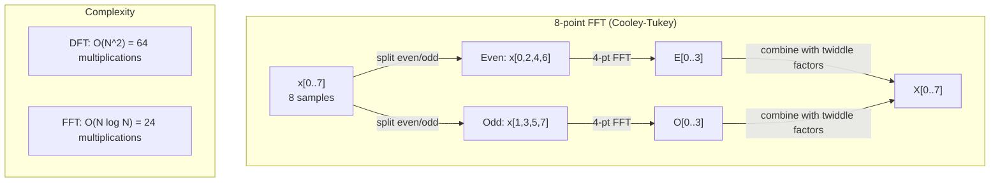
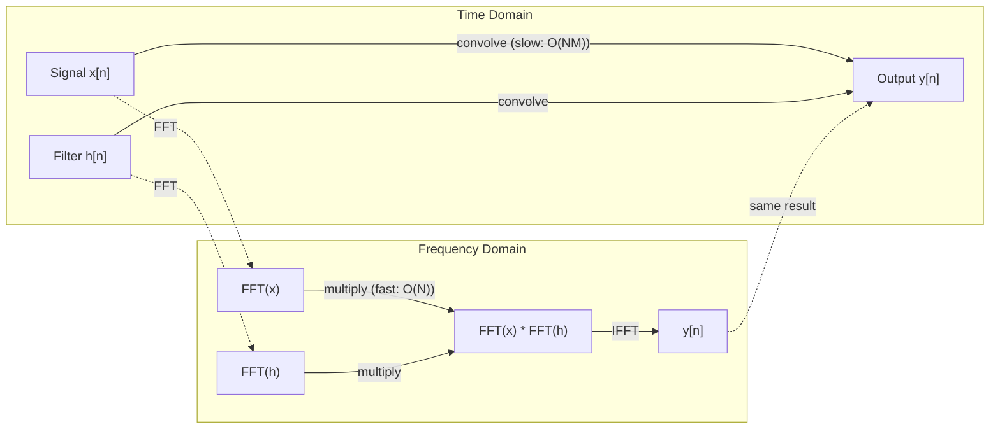

# Transformata Fouriera

> Każdy sygnał jest sumą fal sinusoidalnych. Transformata Fouriera powie Ci które.

**Typ:** Kompilacja
**Język:** Python
**Wymagania wstępne:** Faza 1, lekcje 01-04, 19 (liczby zespolone)
**Czas:** ~90 minut

## Cele nauczania

- Zaimplementuj DFT od podstaw i zweryfikuj go względem O(N log N) Cooley-Tukey FFT
- Interpretacja współczynników częstotliwości: wyodrębnienie amplitudy, fazy i widma mocy z sygnału
- Zastosuj twierdzenie o splocie, aby wykonać splot poprzez mnożenie FFT
- Połącz rozkład częstotliwości Fouriera z kodowaniem pozycyjnym transformatora i warstwami splotu CNN

## Problem

Nagranie audio to sekwencja pomiarów ciśnienia w czasie. Cena akcji to sekwencja wartości w ciągu dni. Obraz to siatka intensywności pikseli w przestrzeni. Wszystko to są dane w dziedzinie czasu (lub przestrzeni). Widzisz wartości zmieniające się w pewnym indeksie.

Jednak wiele wzorców jest niewidocznych w dziedzinie czasu. Czy ten sygnał audio jest czystym tonem czy akordem? Czy cena akcji ma cykl tygodniowy? Czy ten obraz ma powtarzającą się teksturę? Pytania te dotyczą zawartości częstotliwości, a dziedzina czasu ją ukrywa.

Transformata Fouriera konwertuje dane z dziedziny czasu na dziedzinę częstotliwości. Pobiera sygnał i rozkłada go na fale sinusoidalne o różnych częstotliwościach. Każda fala sinusoidalna ma amplitudę (jak silna jest) i fazę (gdzie się zaczyna). Transformata Fouriera mówi jedno i drugie.

Ma to znaczenie dla ML, ponieważ myślenie w dziedzinie częstotliwości pojawia się wszędzie. Konwolucyjne sieci neuronowe wykonują splot, czyli mnożenie w dziedzinie częstotliwości. Kodowanie pozycyjne transformatora wykorzystuje rozkład częstotliwości do przedstawienia położenia. Modele audio (rozpoznawanie mowy, generowanie muzyki) działają na spektrogramach – reprezentacjach częstotliwości dźwięku. Modele szeregów czasowych szukają wzorców okresowych. Zrozumienie transformacji Fouriera zapewni Ci słownictwo potrzebne do pracy z nimi wszystkimi.

## Koncepcja

### Definicja DFT

Biorąc pod uwagę N próbek x[0], x[1], ..., x[N-1], dyskretna transformata Fouriera generuje N współczynników częstotliwości X[0], X[1], ..., X[N-1]:

```
X[k] = sum_{n=0}^{N-1} x[n] * e^(-2*pi*i*k*n/N)

for k = 0, 1, ..., N-1
```

Każde X[k] jest liczbą zespoloną. Jego wielkość |X[k]| informuje o amplitudzie częstotliwości k. Jego kąt fazowy (X[k]) informuje o przesunięciu fazowym tej częstotliwości.

Kluczowy wniosek: `e^(-2*pi*i*k*n/N)` to wskaz wirujący o częstotliwości k. DFT oblicza korelację pomiędzy sygnałem i każdą z N równomiernie rozmieszczonych częstotliwości. Jeśli sygnał zawiera energię o częstotliwości k, korelacja jest duża. Jeśli nie, to jest blisko zera.

### Co oznacza każdy współczynnik

**X[0]: składowa DC.** Jest to suma wszystkich próbek – proporcjonalna do średniej. Reprezentuje stałe (zero częstotliwości) przesunięcie sygnału.

```
X[0] = sum_{n=0}^{N-1} x[n] * e^0 = sum of all samples
```

**X[k] dla 1 <= k <= N/2: częstotliwości dodatnie.** X[k] oznacza częstotliwość k cykli na N próbek. Wyższe k oznacza wyższą częstotliwość (szybsze oscylacje).

**X[N/2]: częstotliwość Nyquista.** Najwyższa częstotliwość, jaką można przedstawić za pomocą N próbek. Powyżej tego pojawia się aliasing – wysokie częstotliwości udają niskie.

**X[k] dla N/2 < k < N: częstotliwości ujemne.** Dla sygnałów o wartościach rzeczywistych X[N-k] = conj(X[k]). Częstotliwości ujemne są lustrzanym odbiciem częstotliwości dodatnich. Dlatego właśnie przydatne informacje znajdują się w pierwszych współczynnikach N/2 + 1.

### Odwrotna DFT

Odwrotna DFT rekonstruuje oryginalny sygnał na podstawie jego współczynników częstotliwości:

```
x[n] = (1/N) * sum_{k=0}^{N-1} X[k] * e^(2*pi*i*k*n/N)

for n = 0, 1, ..., N-1
```

Jedyne różnice w stosunku do forward DFT: znak w wykładniku jest dodatni (nie ujemny) i występuje współczynnik normalizacji 1/N.

Odwrotna DFT jest rekonstrukcją doskonałą. Żadne informacje nie zostaną utracone. Można przejść z domeny czasu do domeny częstotliwości i z powrotem bez żadnego błędu. DFT to zmiana podstawy - ponownie wyraża tę samą informację w innym układzie współrzędnych.

### FFT: szybkie działanie

DFT zdefiniowana powyżej to O(N^2): dla każdego z N współczynników wyjściowych sumuje się N próbek wejściowych. Dla N = 1 milion, czyli 10^12 operacji.

Szybka transformata Fouriera (FFT) oblicza ten sam wynik w O(N log N). Dla N = 1 milion oznacza to około 20 milionów operacji zamiast biliona. To właśnie sprawia, że ​​analiza częstotliwości jest praktyczna.

Algorytm Cooleya-Tukeya (najpopularniejszy FFT) działa na zasadzie dziel i zwyciężaj:

1. Podziel sygnał na próbki o indeksie parzystym i nieparzystym.
2. Oblicz rekurencyjnie DFT każdej połowy.
3. Połącz dwa DFT o połowie rozmiaru, używając „współczynników twiddle” e^(-2*pi*i*k/N).

```
X[k] = E[k] + e^(-2*pi*i*k/N) * O[k]          for k = 0, ..., N/2 - 1
X[k + N/2] = E[k] - e^(-2*pi*i*k/N) * O[k]    for k = 0, ..., N/2 - 1

where E = DFT of even-indexed samples
      O = DFT of odd-indexed samples
```

Symetria oznacza, że każdy poziom rekurencji działa O(N) i istnieją poziomy log2(N). Razem: O(N log N).



FFT wymaga, aby długość sygnału była potęgą 2. W praktyce sygnały są dopełniane zerami do następnej potęgi 2.

### Analiza spektralna

**Widmo mocy** to |X[k]|^2 — kwadrat wielkości każdego współczynnika częstotliwości. Pokazuje, ile energii znajduje się na każdej częstotliwości.

**Widmo fazowe** to kąt (X[k]) — przesunięcie fazowe każdej częstotliwości. W przypadku większości zadań analitycznych ważne jest widmo mocy i ignoruje się fazę.

```
Power at frequency k:  P[k] = |X[k]|^2 = X[k].real^2 + X[k].imag^2
Phase at frequency k:  phi[k] = atan2(X[k].imag, X[k].real)
```

### Rozdzielczość częstotliwości

Rozdzielczość częstotliwościowa DFT zależy od liczby próbek N i częstotliwości próbkowania fs.

```
Frequency of bin k:      f_k = k * fs / N
Frequency resolution:    delta_f = fs / N
Maximum frequency:       f_max = fs / 2  (Nyquist)
```

Aby rozdzielić dwie częstotliwości znajdujące się blisko siebie, potrzeba więcej próbek. Aby uchwycić wysokie częstotliwości, potrzebujesz wyższej częstotliwości próbkowania.

### Twierdzenie o splocie

Jest to jeden z najważniejszych wyników w przetwarzaniu sygnału i bezpośrednio związany z CNN.

**Splot w dziedzinie czasu jest równy punktowemu mnożeniu w dziedzinie częstotliwości.**

```
x * h = IFFT(FFT(x) . FFT(h))

where * is convolution and . is element-wise multiplication
```

Dlaczego to ma znaczenie:

- Bezpośredni splot dwóch sygnałów o długości N i M wymaga operacji O(N*M).
- Splot oparty na FFT wymaga O(N log N): przekształcenie obu, pomnożenie, przekształcenie z powrotem.
- W przypadku dużych jąder splot FFT jest znacznie szybszy.
- Dokładnie to dzieje się w warstwach splotowych z dużymi polami recepcyjnymi.

Uwaga: DFT oblicza splot kołowy (sygnał zawija się). W przypadku splotu liniowego (bez zawijania) przed obliczeniem należy ustawić oba sygnały na długości N + M - 1.



### Okno

DFT zakłada, że sygnał jest okresowy – traktuje N próbek jako jeden okres nieskończenie powtarzającego się sygnału. Jeśli sygnał nie zaczyna się i nie kończy na tej samej wartości, powoduje to nieciągłość na granicy, co objawia się fałszywą treścią o wysokiej częstotliwości. Nazywa się to wyciekiem widmowym.

Okienkowanie zmniejsza wyciek poprzez zwężenie sygnału do zera na obu końcach przed obliczeniem DFT.

Typowe okna:

| Okno | Kształt | Szerokość głównego płata | Poziom płata bocznego | Przypadek użycia |
|------------|-------|----------------|----------------|-------------|
| Prostokątny | Mieszkanie (bez okna) | Najwęższy | Najwyższy (-13 dB) | Gdy sygnał jest dokładnie okresowy w N próbkach |
| Hanna | Podniesiony cosinus | Umiarkowany | Niski (-31 dB) | Analiza spektralna ogólnego przeznaczenia |
| Hamminga | Zmodyfikowany cosinus | Umiarkowany | Niższy (-42 dB) | Przetwarzanie dźwięku, analiza mowy |
| Blackmana | Potrójny cosinus | Szeroki | Bardzo niski (-58 dB) | Kiedy tłumienie płatków bocznych jest krytyczne |

```
Hann window:    w[n] = 0.5 * (1 - cos(2*pi*n / (N-1)))
Hamming window: w[n] = 0.54 - 0.46 * cos(2*pi*n / (N-1))
```

Zastosuj okno, mnożąc je elementarnie przez sygnał przed DFT: `X = DFT(x * w)`.

### Właściwości DFT

| Nieruchomość | Domena czasu | Dziedzina częstotliwości |
|---------|------------|--------------------------------|
| Liniowość | a*x + b*y | a*X + b*Y |
| Przesunięcie czasu | x[n - k] | X[f] * e^(-2*pi*i*f*k/N) |
| Przesunięcie częstotliwości | x[n] * e^(2*pi*i*f0*n/N) | X[f - f0] |
| Splot | x * godz | X * H (punktowo) |
| Mnożenie | x * h (punktowo) | X * H (splot kołowy, skalowany co 1/N) |
| Twierdzenie Parsevala | suma \|x[n]\|^2 | (1/N) * suma \|X[k]\|^2 |
| Symetria sprzężona (wejście rzeczywiste) | x[n] prawdziwe | X[k] = spójnik(X[N-k]) |

Twierdzenie Parsevala mówi, że całkowita energia jest taka sama w obu dziedzinach. Energia jest oszczędzana poprzez transformację.

### Połączenie z kodowaniem pozycyjnym

Oryginalny Transformer wykorzystuje sinusoidalne kodowanie pozycyjne:

```
PE(pos, 2i)   = sin(pos / 10000^(2i/d_model))
PE(pos, 2i+1) = cos(pos / 10000^(2i/d_model))
```

Każda para wymiarów (2i, 2i+1) oscyluje z inną częstotliwością. Częstotliwości są geometrycznie rozmieszczone od wysokich (wymiar 0,1) do niskich (ostatni wymiar). Daje to każdej pozycji unikalny wzór we wszystkich pasmach częstotliwości – podobnie jak współczynniki Fouriera jednoznacznie identyfikują sygnał.

Kluczowe właściwości, które zapewnia:

- **Wyjątkowość:** Żadne dwie pozycje nie mają tego samego kodowania.
- **Wartości ograniczone:** sin i cos są zawsze w [-1, 1].
- **Pozycja względna:** Kodowanie pozycji p+k można wyrazić jako funkcję liniową kodowania w pozycji p. Model może nauczyć się zwracać uwagę na względne pozycje.

### Połączenie z CNN

Warstwa splotu stosuje wyuczony filtr (jądro) do wejścia, przesuwając go po sygnale lub obrazie. Matematycznie jest to operacja splotu.

Zgodnie z twierdzeniem o splocie jest to równoważne:
1. FFT wejścia
2. FFT jądro
3. Pomnóż w dziedzinie częstotliwości
4. IFFT wynik

Standardowe implementacje CNN wykorzystują splot bezpośredni (szybszy dla małych jąder 3x3). Jednak w przypadku dużych jąder lub globalnego splotu podejścia oparte na FFT są znacznie szybsze. Niektóre architektury (takie jak FNet) całkowicie zastępują uwagę FFT, osiągając konkurencyjną dokładność przy złożoności O(N log N) zamiast O(N^2).

### Spektrogramy i krótkotrwała transformata Fouriera

Pojedyncza FFT podaje zawartość częstotliwości całego sygnału, ale nie mówi nic o tym, kiedy te częstotliwości występują. Świergot (sygnał, którego częstotliwość wzrasta z upływem czasu) i akord (wszystkie częstotliwości obecne jednocześnie) mogą mieć to samo widmo wielkości.

Krótkoterminowa transformata Fouriera (STFT) rozwiązuje ten problem, obliczając FFT na nakładających się oknach sygnału. Rezultatem jest spektrogram: reprezentacja 2D z czasem na jednej osi i częstotliwością na drugiej. Intensywność w każdym punkcie pokazuje energię przy tej częstotliwości w tym czasie.

```
STFT procedure:
1. Choose a window size (e.g., 1024 samples)
2. Choose a hop size (e.g., 256 samples -- 75% overlap)
3. For each window position:
   a. Extract the windowed segment
   b. Apply a Hann/Hamming window
   c. Compute FFT
   d. Store the magnitude spectrum as one column of the spectrogram
```

Spektrogramy są standardową reprezentacją wejściową dla modeli audio ML. Modele rozpoznawania mowy (Whisper, DeepSpeech) działają na spektrogramach mel – spektrogramach z częstotliwościami odwzorowanymi w skali mel, która lepiej odpowiada ludzkiej percepcji tonu.

### Aliasing

Jeśli sygnał zawiera częstotliwości powyżej fs/2 (częstotliwość Nyquista), próbkowanie z szybkością fs spowoduje utworzenie aliasowanych kopii. Sygnał 90 Hz próbkowany przy 100 Hz wygląda identycznie jak sygnał 10 Hz. Nie ma możliwości odróżnienia ich od samych próbek.

```
Example:
  True signal: 90 Hz sine wave
  Sampling rate: 100 Hz
  Apparent frequency: 100 - 90 = 10 Hz

  The samples from the 90 Hz signal at 100 Hz sampling rate
  are identical to the samples from a 10 Hz signal.
  No amount of math can recover the original 90 Hz.
```

Właśnie dlatego przetworniki analogowo-cyfrowe zawierają filtry antyaliasingowe, które przed próbkowaniem usuwają częstotliwości powyżej Nyquista. W ML aliasing pojawia się podczas próbkowania w dół map obiektów bez odpowiedniego filtrowania dolnoprzepustowego — niektóre architektury rozwiązują ten problem za pomocą antyaliasingowych warstw łączenia.

### Dopełnienie zerami nie zwiększa rozdzielczości

Powszechne błędne przekonanie: dopełnienie sygnału zerami przed FFT poprawia rozdzielczość częstotliwości. Tak nie jest. Wypełnianie zerami interpoluje pomiędzy istniejącymi przedziałami częstotliwości, zapewniając gładsze widmo. Nie może jednak ujawnić szczegółów częstotliwości, których nie było w oryginalnych próbkach.

Rzeczywista rozdzielczość częstotliwości zależy tylko od czasu obserwacji T = N / fs. Aby rozwiązać dwie częstotliwości oddzielone delta_f, potrzebujesz co najmniej T = 1 / delta_f sekund danych. Żadna ilość dopełnienia zerami nie zmienia tego podstawowego limitu.

## Zbuduj to

### Krok 1: DFT od zera

O(N^2) DFT wynika bezpośrednio z definicji.

```python
import math

class Complex:
    ...

def dft(x):
    N = len(x)
    result = []
    for k in range(N):
        total = Complex(0, 0)
        for n in range(N):
            angle = -2 * math.pi * k * n / N
            w = Complex(math.cos(angle), math.sin(angle))
            xn = x[n] if isinstance(x[n], Complex) else Complex(x[n])
            total = total + xn * w
        result.append(total)
    return result
```

### Krok 2: Odwrotna DFT

Ta sama struktura, wykładnik dodatni, podziel przez N.

```python
def idft(X):
    N = len(X)
    result = []
    for n in range(N):
        total = Complex(0, 0)
        for k in range(N):
            angle = 2 * math.pi * k * n / N
            w = Complex(math.cos(angle), math.sin(angle))
            total = total + X[k] * w
        result.append(Complex(total.real / N, total.imag / N))
    return result
```

### Krok 3: FFT (Cooley-Tukey)

Rekurencyjna FFT wymaga długości potęgi 2. Podziel na parzyste i nieparzyste, powtórz, połącz z czynnikami twiddle.

```python
def fft(x):
    N = len(x)
    if N <= 1:
        return [x[0] if isinstance(x[0], Complex) else Complex(x[0])]
    if N % 2 != 0:
        return dft(x)

    even = fft([x[i] for i in range(0, N, 2)])
    odd = fft([x[i] for i in range(1, N, 2)])

    result = [Complex(0)] * N
    for k in range(N // 2):
        angle = -2 * math.pi * k / N
        twiddle = Complex(math.cos(angle), math.sin(angle))
        t = twiddle * odd[k]
        result[k] = even[k] + t
        result[k + N // 2] = even[k] - t
    return result
```

### Krok 4: Pomocnicy analizy spektralnej

```python
def power_spectrum(X):
    return [xk.real ** 2 + xk.imag ** 2 for xk in X]

def convolve_fft(x, h):
    N = len(x) + len(h) - 1
    padded_N = 1
    while padded_N < N:
        padded_N *= 2

    x_padded = x + [0.0] * (padded_N - len(x))
    h_padded = h + [0.0] * (padded_N - len(h))

    X = fft(x_padded)
    H = fft(h_padded)

    Y = [xk * hk for xk, hk in zip(X, H)]

    y = idft(Y)
    return [y[n].real for n in range(N)]
```

## Użyj tego

Do prawdziwej pracy użyj FFT numpy, który jest wspierany przez wysoce zoptymalizowane biblioteki C.

```python
import numpy as np

signal = np.sin(2 * np.pi * 5 * np.arange(256) / 256)
spectrum = np.fft.fft(signal)
freqs = np.fft.fftfreq(256, d=1/256)

power = np.abs(spectrum) ** 2

positive_freqs = freqs[:len(freqs)//2]
positive_power = power[:len(power)//2]
```

Do okienkowania i bardziej zaawansowanej analizy widmowej:

```python
from scipy.signal import windows, stft

window = windows.hann(256)
windowed = signal * window
spectrum = np.fft.fft(windowed)
```

Dla splotu:

```python
from scipy.signal import fftconvolve

result = fftconvolve(signal, kernel, mode='full')
```

Dla spektrogramów:

```python
from scipy.signal import stft

frequencies, times, Zxx = stft(signal, fs=sample_rate, nperseg=256)
spectrogram = np.abs(Zxx) ** 2
```

Macierz spektrogramu ma kształt (n_częstotliwości, n_ramek czasowych). Każda kolumna to widmo mocy w jednym oknie czasowym. To właśnie pobierają modele audio ML jako dane wejściowe.

## Wyślij to

Uruchom `code/fourier.py`, aby wygenerować `outputs/prompt-spectral-analyzer.md`.

## Ćwiczenia

1. **Identyfikacja czystego tonu.** Utwórz sygnał za pomocą pojedynczej fali sinusoidalnej o nieznanej częstotliwości (od 1 do 50 Hz), próbkowanej przy częstotliwości 128 Hz przez 1 sekundę. Użyj DFT, aby zidentyfikować częstotliwość. Sprawdź, czy odpowiedzi pasują. Teraz dodaj szum Gaussa z odchyleniem standardowym 0,5 i powtórz. Jak szum wpływa na widmo?

2. **Weryfikacja FFT vs DFT.** Wygeneruj losowy sygnał o długości 64. Oblicz zarówno DFT (O(N^2)), jak i FFT. Sprawdź, czy wszystkie współczynniki mieszczą się w zakresie 1e-10. Obie funkcje czasu dla sygnałów o długości 256, 512, 1024 i 2048. Wykreśl stosunek czasu DFT do czasu FFT.

3. **Dowód twierdzenia o splocie na przykładzie.** Utwórz sygnał x = [1, 2, 3, 4, 0, 0, 0, 0] i filtruj h = [1, 1, 1, 0, 0, 0, 0, 0]. Oblicz bezpośrednio ich splot kołowy (pętla zagnieżdżona). Następnie oblicz to za pomocą FFT (przekształcenie, pomnożenie, transformacja odwrotna). Sprawdź zgodność wyników. Teraz wykonaj splot liniowy, odpowiednio dopełniając zerami.

4. **Efekty okienne.** Utwórz sygnał będący sumą dwóch fal sinusoidalnych przy 10 Hz i 12 Hz (bardzo blisko). Próbka przy 128 Hz przez 1 sekundę. Oblicz widmo mocy bez okna, okna Hanna i okna Hamminga. Które okno ułatwia rozróżnienie dwóch pików? Dlaczego?

5. **Analiza kodowania pozycyjnego.** Wygeneruj sinusoidalne kodowanie pozycyjne dla d_model = 128 i max_pos = 512. Dla każdej pary pozycji (p1, p2) oblicz iloczyn skalarny ich kodowania. Pokaż, że iloczyn skalarny zależy tylko od |p1 - p2|, a nie od pozycji bezwzględnych. Co dzieje się z iloczynem skalarnym wraz ze wzrostem odległości?

## Kluczowe terminy

| Termin | Co to znaczy |
|------|----------------------------|
| DFT (dyskretna transformata Fouriera) | Konwertuje N próbek w dziedzinie czasu na N współczynników w dziedzinie częstotliwości. Każdy współczynnik jest korelacją ze złożoną sinusoidą przy tej częstotliwości |
| FFT (szybka transformata Fouriera) | Algorytm O (N log N) do obliczania DFT. Algorytm Cooleya-Tukeya rekurencyjnie dzieli indeksy parzyste/nieparzyste |
| Odwrotna DFT | Rekonstruuje sygnał w dziedzinie czasu na podstawie współczynników częstotliwości. Taki sam wzór jak DFT z odwróconym znakiem wykładnika i skalowaniem 1/N |
| Pojemnik częstotliwości | Każdy indeks k na wyjściu DFT reprezentuje częstotliwość k*fs/N Hz. „Kosz” to dyskretna szczelina częstotliwości |
| Składnik prądu stałego | X[0], współczynnik częstotliwości zerowej. Proporcjonalnie do średniej sygnału |
| Częstotliwość Nyquista | fs/2, maksymalna częstotliwość reprezentowana przy częstotliwości próbkowania fs. Częstotliwości powyżej tego aliasu |
| Spektrum mocy | \|X[k]\|^2, kwadrat wielkości każdego współczynnika częstotliwości. Pokazuje rozkład energii w różnych częstotliwościach |
| Widmo fazowe | kąt(X[k]), przesunięcie fazowe każdej składowej częstotliwości. Często ignorowane w analizach |
| Wyciek widmowy | Zawartość częstotliwości zakłócających spowodowana traktowaniem sygnału nieokresowego jako okresowego. Zmniejszone przez okienkowanie |
| Funkcja okna | Funkcja zwężająca (Hann, Hamming, Blackman) zastosowana przed DFT w celu zmniejszenia wycieku widmowego |
| Współczynnik Twiddle'a | Złożony wykładniczy e^(-2*pi*i*k/N) używany do łączenia sub-DFT w obliczeniach motyla FFT |
| Twierdzenie o splocie | Splot w dziedzinie czasu jest równy punktowemu mnożeniu w dziedzinie częstotliwości. Podstawy przetwarzania sygnałów i CNN |
| Splot kołowy | Splot, w którym sygnał się zawija. To właśnie oblicza DFT w sposób naturalny |
| Splot liniowy | Standardowy splot bez zawijania. Osiągnięto przez zerowanie przed DFT |
| Twierdzenie Parsevala | Całkowita energia jest zachowywana poprzez transformatę Fouriera. suma \|x[n]\|^2 = (1/N) suma \|X[k]\|^2 |
| Aliasowanie | Gdy częstotliwości powyżej Nyquista pojawiają się jako częstotliwości niższe z powodu niewystarczającej częstotliwości próbkowania |

## Dalsze czytanie

- [Cooley & Tukey: An Algorithm for the Machine Calculation of Complex Fourier Series (1965)] (https://www.ams.org/journals/mcom/1965-19-090/S0025-5718-1965-0178586-1/) – oryginalna praca FFT, która zmieniła oblicze komputerów
- [3Blue1Brown: Ale czym jest transformata Fouriera?](https://www.youtube.com/watch?v=spUNpyF58BY) – najlepsze wizualne wprowadzenie do transformat Fouriera
- [Lee-Thorp i in.: FNet: Mixing Tokens with Fourier Transforms (2021)](https://arxiv.org/abs/2105.03824) - zastępuje samouważność FFT w transformatorach
- [Smith: The Scientist and Engineer's Guide to Digital Signal Processing] (http://www.dspguide.com/) - bezpłatny podręcznik online obejmujący dogłębną analizę FFT, okienkowanie i analizę widmową
- [Vaswani et al.: Attention Is All You Need (2017)](https://arxiv.org/abs/1706.03762) - sinusoidalne kodowanie pozycyjne wyprowadzone z rozkładu częstotliwości Fouriera
- [Radford i in.: Whisper (2022)](https://arxiv.org/abs/2212.04356) - rozpoznawanie mowy przy użyciu spektrogramów mel jako reprezentacji wejściowej