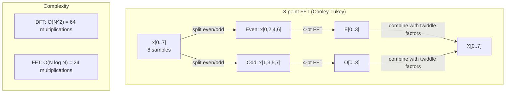
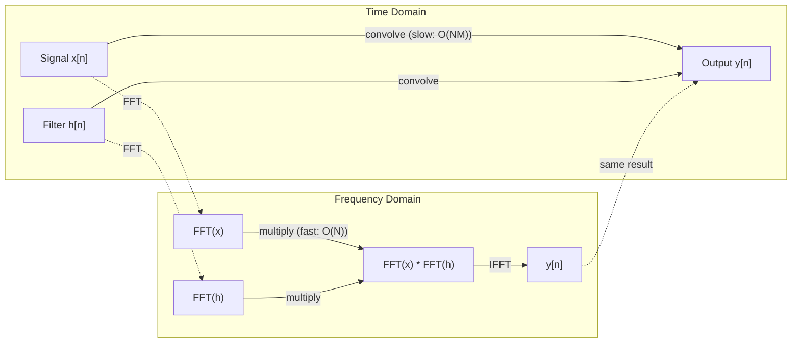

# Transformacja Fouriera

> Każdy sygnał jest sumą sinusoid. Transformacja Fouriera mówi Ci, które z nich.

**Typ:** Budowa
**Język:** Python
**Wymagania wstępne:** Faza 1, Lekcje 01-04, 19 (liczby zespolone)
**Czas:** ~90 minut

## Cele nauki

- Zaimplementować DFT od podstaw i zweryfikować je względem FFT Cooleya-Tukeya o złożoności O(N log N)
- Interpretować współczynniki częstotliwości: wyodrębnić amplitudę, fazę i widmo mocy z sygnału
- Zastosować twierdzenie o splocie do wykonania splotu za pomocą mnożenia FFT
- Połączyć dekompozycję częstotliwościową Fouriera z kodowaniami pozycyjnymi transformerów i warstwami splotowymi CNN

## Problem

Nagranie audio to sekwencja pomiarów ciśnienia w czasie. Cena akcji to sekwencja wartości w kolejnych dniach. Obraz to siatka intensywności pikseli w przestrzeni. Wszystkie te dane są danymi w domenie czasu (lub przestrzeni). Widzisz wartości zmieniające się wzdłuż pewnego indeksu.

Jednak wiele wzorców jest niewidocznych w domenie czasu. Czy ten sygnał audio to czysty ton, czy akord? Czy ta cena akcji ma tygodniowy cykl? Czy ten obraz ma powtarzającą się teksturę? Te pytania dotyczą zawartości częstotliwościowej, a domena czasu ją skrywa.

Transformacja Fouriera przekształca dane z domeny czasu do domeny częstotliwości. Bierze sygnał i rozkłada go na sinusoidy o różnych częstotliwościach. Każda sinusoida ma amplitudę (jak silna jest) i fazę (gdzie się zaczyna). Transformacja Fouriera podaje obie te informacje.

Ma to znaczenie dla ML, ponieważ myślenie w domenie częstotliwości pojawia się wszędzie. Konwolucyjne sieci neuronowe wykonują splot, który jest mnożeniem w domenie częstotliwości. Kodowania pozycyjne transformerów wykorzystują dekompozycję częstotliwościową do reprezentowania pozycji. Modele audio (rozpoznawanie mowy, generowanie muzyki) operują na spektrogramach -- reprezentacjach częstotliwościowych dźwięku. Modele szeregów czasowych poszukują wzorców okresowych. Zrozumienie transformacji Fouriera daje Ci słownictwo potrzebne do pracy z tym wszystkim.

## Koncepcja

### Definicja DFT

Mając N próbek x[0], x[1], ..., x[N-1], Dyskretna Transformacja Fouriera (DFT) produkuje N współczynników częstotliwości X[0], X[1], ..., X[N-1]:

```
X[k] = sum_{n=0}^{N-1} x[n] * e^(-2*pi*i*k*n/N)

for k = 0, 1, ..., N-1
```

Każde X[k] jest liczbą zespoloną. Jej moduł |X[k]| informuje o amplitudzie częstotliwości k. Jej kąt fazowy angle(X[k]) informuje o przesunięciu fazowym tej częstotliwości.

Kluczowa obserwacja: `e^(-2*pi*i*k*n/N)` to wirujący fazor (phasor) o częstotliwości k. DFT oblicza korelację między sygnałem a każdą z N równo rozmieszczonych częstotliwości. Jeśli sygnał zawiera energię na częstotliwości k, korelacja jest duża. Jeśli nie, jest bliska zeru.

### Co oznacza każdy współczynnik

**X[0]: składowa DC.** To suma wszystkich próbek -- proporcjonalna do średniej. Reprezentuje stałe (zerowej częstotliwości) przesunięcie sygnału.

```
X[0] = sum_{n=0}^{N-1} x[n] * e^0 = suma wszystkich próbek
```

**X[k] dla 1 <= k <= N/2: częstotliwości pozytywne.** X[k] reprezentuje częstotliwość k cykli na N próbek. Wyższe k oznacza wyższą częstotliwość (szybsze oscylacje).

**X[N/2]: częstotliwość Nyquista.** Najwyższa częstotliwość, którą można przedstawić za pomocą N próbek. Powyżej tej wartości dochodzi do aliasingu -- wysokie częstotliwości udają niskie.

**X[k] dla N/2 < k < N: częstotliwości negatywne.** Dla sygnałów rzeczywistych X[N-k] = conj(X[k]). Częstotliwości negatywne są zwierciadlanymi odbiciami częstotliwości pozytywnych. Dlatego użyteczna informacja znajduje się w pierwszych N/2 + 1 współczynnikach.

### Odwrotna DFT

Odwrotna DFT odtwarza pierwotny sygnał na podstawie jego współczynników częstotliwości:

```
x[n] = (1/N) * sum_{k=0}^{N-1} X[k] * e^(2*pi*i*k*n/N)

for n = 0, 1, ..., N-1
```

Jedyne różnice względem DFT w przód: znak w wykładniku jest pozytywny (nie negatywny) oraz pojawia się czynnik normalizujący 1/N.

Odwrotna DFT zapewnia perfekcyjną rekonstrukcję. Żadna informacja nie jest tracona. Można przejść z domeny czasu do domeny częstotliwości i z powrotem bez jakiegokolwiek błędu. DFT to zmiana bazy -- wyraża tę samą informację w innym układzie współrzędnych.

### FFT: jak to zrobić szybko

DFT zdefiniowane powyżej ma złożoność O(N^2): dla każdego z N współczynników wyjściowych sumujemy N próbek wejściowych. Dla N = 1 milion to 10^12 operacji.

Szybka Transformacja Fouriera (FFT) oblicza ten sam wynik w czasie O(N log N). Dla N = 1 milion to około 20 milionów operacji zamiast biliona. To właśnie sprawia, że analiza częstotliwościowa jest praktyczna.

Algorytm Cooleya-Tukeya (najczęstszy algorytm FFT) działa metodą dziel i zwyciężaj:

1. Podziel sygnał na próbki o indeksach parzystych i nieparzystych.
2. Oblicz DFT każdej połowy rekurencyjnie.
3. Połącz obie DFT o połowicznym rozmiarze za pomocą "współczynników obrotu" (twiddle factors) e^(-2*pi*i*k/N).

```
X[k] = E[k] + e^(-2*pi*i*k/N) * O[k]          for k = 0, ..., N/2 - 1
X[k + N/2] = E[k] - e^(-2*pi*i*k/N) * O[k]    for k = 0, ..., N/2 - 1

where E = DFT of even-indexed samples
      O = DFT of odd-indexed samples
```

Symetria oznacza, że na każdym poziomie rekurencji wykonywana jest praca O(N), a poziomów rekurencji jest log2(N). W sumie: O(N log N).



FFT wymaga, aby długość sygnału była potęgą liczby 2. W praktyce sygnały są dopełniane zerami (zero-padded) do najbliższej potęgi 2.

### Analiza spektralna

**Widmo mocy** (power spectrum) to |X[k]|^2 -- kwadrat modułu każdego współczynnika częstotliwości. Pokazuje, ile energii znajduje się na każdej częstotliwości.

**Widmo fazowe** (phase spectrum) to angle(X[k]) -- przesunięcie fazowe każdej częstotliwości. W większości zadań analitycznych interesuje nas widmo mocy, a fazę się ignoruje.

```
Power at frequency k:  P[k] = |X[k]|^2 = X[k].real^2 + X[k].imag^2
Phase at frequency k:  phi[k] = atan2(X[k].imag, X[k].real)
```

### Rozdzielczość częstotliwościowa

Rozdzielczość częstotliwościowa DFT zależy od liczby próbek N i częstotliwości próbkowania fs.

```
Frequency of bin k:      f_k = k * fs / N
Frequency resolution:    delta_f = fs / N
Maximum frequency:       f_max = fs / 2  (Nyquist)
```

Aby rozróżnić dwie częstotliwości znajdujące się blisko siebie, potrzeba więcej próbek. Aby uchwycić wysokie częstotliwości, potrzeba wyższej częstotliwości próbkowania.

### Twierdzenie o splocie

To jeden z najważniejszych wyników w przetwarzaniu sygnałów i ma bezpośrednie znaczenie dla CNN.

**Splot w domenie czasu jest równoważny mnożeniu punktowemu w domenie częstotliwości.**

```
x * h = IFFT(FFT(x) . FFT(h))

where * is convolution and . is element-wise multiplication
```

Dlaczego to ma znaczenie:

- Bezpośredni splot dwóch sygnałów o długościach N i M wymaga O(N*M) operacji.
- Splot oparty na FFT wymaga O(N log N): przekształć obie strony, pomnóż, przekształć wstecz.
- Dla dużych kerneli splot FFT jest dramatycznie szybszy.
- To dokładnie to, co dzieje się w warstwach splotowych z dużymi polami recepcyjnymi.

Uwaga: DFT oblicza splot kołowy (sygnał zawija się). Dla splotu liniowego (bez zawijania) należy dopełnić oba sygnały zerami do długości N + M - 1 przed obliczeniem.



### Okienkowanie

DFT zakłada, że sygnał jest okresowy -- traktuje N próbek jako jeden okres nieskończenie powtarzającego się sygnału. Jeśli sygnał nie zaczyna i nie kończy się na tej samej wartości, powstaje nieciągłość na granicy, która objawia się jako sztuczna zawartość wysokoczęstotliwościowa. Nazywa się to przeciekiem widmowym (spectral leakage).

Okienkowanie redukuje przeciek poprzez wygaszanie sygnału do zera na obu końcach przed obliczeniem DFT.

Popularne okna:

| Okno | Kształt | Szerokość listka głównego | Poziom listków bocznych | Zastosowanie |
|--------|-------|----------------|-----------------|----------|
| Prostokątne | Płaskie (brak okna) | Najwęższy | Najwyższy (-13 dB) | Gdy sygnał jest dokładnie okresowy w N próbkach |
| Hanna | Kosinus uniesiony | Umiarkowana | Niski (-31 dB) | Ogólna analiza spektralna |
| Hamminga | Zmodyfikowany kosinus | Umiarkowana | Niższy (-42 dB) | Przetwarzanie audio, analiza mowy |
| Blackmana | Trójkrotny kosinus | Szeroka | Bardzo niski (-58 dB) | Gdy tłumienie listków bocznych jest kluczowe |

```
Hann window:    w[n] = 0.5 * (1 - cos(2*pi*n / (N-1)))
Hamming window: w[n] = 0.54 - 0.46 * cos(2*pi*n / (N-1))
```

Zastosuj okno, mnożąc je punktowo z sygnałem przed wykonaniem DFT: `X = DFT(x * w)`.

### Właściwości DFT

| Właściwość | Domena czasu | Domena częstotliwości |
|----------|-------------|-----------------|
| Liniowość | a*x + b*y | a*X + b*Y |
| Przesunięcie czasowe | x[n - k] | X[f] * e^(-2*pi*i*f*k/N) |
| Przesunięcie częstotliwościowe | x[n] * e^(2*pi*i*f0*n/N) | X[f - f0] |
| Splot | x * h | X * H (punktowo) |
| Mnożenie | x * h (punktowo) | X * H (splot kołowy, skalowany przez 1/N) |
| Twierdzenie Parsevala | sum \|x[n]\|^2 | (1/N) * sum \|X[k]\|^2 |
| Symetria sprzężenia (wejście rzeczywiste) | x[n] rzeczywiste | X[k] = conj(X[N-k]) |

Twierdzenie Parsevala mówi, że całkowita energia jest taka sama w obu domenach. Energia jest zachowana przez transformację.

### Związek z kodowaniami pozycyjnymi

Oryginalny Transformer wykorzystuje sinusoidalne kodowania pozycyjne:

```
PE(pos, 2i)   = sin(pos / 10000^(2i/d_model))
PE(pos, 2i+1) = cos(pos / 10000^(2i/d_model))
```

Każda para wymiarów (2i, 2i+1) oscyluje z inną częstotliwością. Częstotliwości są rozmieszczone geometrycznie, od wysokich (wymiary 0, 1) do niskich (ostatnie wymiary). Daje to każdej pozycji unikalny wzorzec we wszystkich pasmach częstotliwości -- podobnie jak współczynniki Fouriera jednoznacznie identyfikują sygnał.

Kluczowe właściwości, które to zapewnia:

- **Unikalność:** Żadne dwie pozycje nie mają tego samego kodowania.
- **Ograniczone wartości:** sin i cos zawsze znajdują się w przedziale [-1, 1].
- **Pozycja relatywna:** Kodowanie pozycji p+k można wyrazić jako funkcję liniową kodowania pozycji p. Model może nauczyć się zwracać uwagę na pozycje relatywne.

### Związek z CNN

Warstwa splotowa stosuje wyuczony filtr (kernel) do wejścia, przesuwając go po sygnale lub obrazie. Matematycznie jest to operacja splotu.

Na podstawie twierdzenia o splocie jest to równoważne:
1. FFT wejścia
2. FFT kernela
3. Mnożenie w domenie częstotliwości
4. IFFT wyniku

Standardowe implementacje CNN wykorzystują splot bezpośredni (szybszy dla małych kerneli 3x3). Jednak dla dużych kerneli lub splotu globalnego podejścia oparte na FFT są znacznie szybsze. Niektóre architektury (jak FNet) całkowicie zastępują uwagę (attention) FFT, osiągając konkurencyjną dokładność ze złożonością O(N log N) zamiast O(N^2).

### Spektrogramy i Krótkookresowa Transformacja Fouriera

Pojedyncze FFT podaje zawartość częstotliwościową całego sygnału, ale nic nie mówi o tym, kiedy te częstotliwości się pojawiają. Chirp (sygnał, którego częstotliwość rośnie w czasie) i akord (wszystkie częstotliwości obecne jednocześnie) mogą mieć to samo widmo amplitudowe.

Krótkookresowa Transformacja Fouriera (Short-Time Fourier Transform, STFT) rozwiązuje ten problem, obliczając FFT na nakładających się oknach sygnału. Wynikiem jest spektrogram: dwuwymiarowa reprezentacja z czasem na jednej osi i częstotliwością na drugiej. Intensywność w każdym punkcie pokazuje energię na danej częstotliwości w danym czasie.

```
STFT procedure:
1. Choose a window size (e.g., 1024 samples)
2. Choose a hop size (e.g., 256 samples -- 75% overlap)
3. For each window position:
   a. Extract the windowed segment
   b. Apply a Hann/Hamming window
   c. Compute FFT
   d. Store the magnitude spectrum as one column of the spectrogram
```

Spektrogramy są standardową reprezentacją wejściową dla modeli ML audio. Modele rozpoznawania mowy (Whisper, DeepSpeech) operują na mel-spektrogramach -- spektrogramach z częstotliwościami zmapowanymi na skalę mel, która lepiej odpowiada percepcji wysokości tonu przez człowieka.

### Aliasing

Jeśli sygnał zawiera częstotliwości powyżej fs/2 (częstotliwości Nyquista), próbkowanie z częstotliwością fs spowoduje powstanie aliasowanych kopii. Sygnał 90 Hz próbkowany z częstotliwością 100 Hz wygląda identycznie jak sygnał 10 Hz. Nie ma sposobu, aby rozróżnić je na podstawie samych próbek.

```
Example:
  True signal: 90 Hz sine wave
  Sampling rate: 100 Hz
  Apparent frequency: 100 - 90 = 10 Hz

  The samples from the 90 Hz signal at 100 Hz sampling rate
  are identical to the samples from a 10 Hz signal.
  No amount of math can recover the original 90 Hz.
```

Z tego powodu przetworniki analogowo-cyfrowe zawierają filtry antyaliasingowe, które usuwają częstotliwości powyżej Nyquista przed próbkowaniem. W ML aliasing pojawia się przy zmniejszaniu rozdzielczości map cech bez właściwego filtrowania dolnoprzepustowego -- niektóre architektury rozwiązują to za pomocą warstw poolingu z filtrem antyaliasingowym.

### Dopełnianie zerami nie zwiększa rozdzielczości

Częste błędne przekonanie: dopełnienie sygnału zerami (zero-padding) przed FFT poprawia rozdzielczość częstotliwościową. To nieprawda. Dopełnianie zerami interpoluje pomiędzy istniejącymi binami częstotliwości, dając gładsze wyglądające widmo. Ale nie może ono ujawnić szczegółów częstotliwościowych, które nie były obecne w oryginalnych próbkach.

Prawdziwa rozdzielczość częstotliwościowa zależy tylko od czasu obserwacji T = N / fs. Aby rozróżnić dwie częstotliwości oddzielone przez delta_f, potrzeba co najmniej T = 1 / delta_f sekund danych. Żadna ilość dopełniania zerami nie zmienia tego fundamentalnego ograniczenia.

## Zbuduj to

### Krok 1: DFT od podstaw

DFT o złożoności O(N^2) wynika bezpośrednio z definicji.

```python
import math

class Complex:
    ...

def dft(x):
    N = len(x)
    result = []
    for k in range(N):
        total = Complex(0, 0)
        for n in range(N):
            angle = -2 * math.pi * k * n / N
            w = Complex(math.cos(angle), math.sin(angle))
            xn = x[n] if isinstance(x[n], Complex) else Complex(x[n])
            total = total + xn * w
        result.append(total)
    return result
```

### Krok 2: Odwrotna DFT

Ta sama struktura, dodatni wykładnik, dzielenie przez N.

```python
def idft(X):
    N = len(X)
    result = []
    for n in range(N):
        total = Complex(0, 0)
        for k in range(N):
            angle = 2 * math.pi * k * n / N
            w = Complex(math.cos(angle), math.sin(angle))
            total = total + X[k] * w
        result.append(Complex(total.real / N, total.imag / N))
    return result
```

### Krok 3: FFT (Cooley-Tukey)

Rekurencyjne FFT wymaga długości będącej potęgą 2. Podziel na parzyste i nieparzyste, wykonaj rekurencję, połącz za pomocą współczynników obrotu.

```python
def fft(x):
    N = len(x)
    if N <= 1:
        return [x[0] if isinstance(x[0], Complex) else Complex(x[0])]
    if N % 2 != 0:
        return dft(x)

    even = fft([x[i] for i in range(0, N, 2)])
    odd = fft([x[i] for i in range(1, N, 2)])

    result = [Complex(0)] * N
    for k in range(N // 2):
        angle = -2 * math.pi * k / N
        twiddle = Complex(math.cos(angle), math.sin(angle))
        t = twiddle * odd[k]
        result[k] = even[k] + t
        result[k + N // 2] = even[k] - t
    return result
```

### Krok 4: Funkcje pomocnicze analizy spektralnej

```python
def power_spectrum(X):
    return [xk.real ** 2 + xk.imag ** 2 for xk in X]

def convolve_fft(x, h):
    N = len(x) + len(h) - 1
    padded_N = 1
    while padded_N < N:
        padded_N *= 2

    x_padded = x + [0.0] * (padded_N - len(x))
    h_padded = h + [0.0] * (padded_N - len(h))

    X = fft(x_padded)
    H = fft(h_padded)

    Y = [xk * hk for xk, hk in zip(X, H)]

    y = idft(Y)
    return [y[n].real for n in range(N)]
```

## Wykorzystaj to

W rzeczywistych zastosowaniach używaj FFT z numpy, które jest oparte na wysoko zoptymalizowanych bibliotekach C.

```python
import numpy as np

signal = np.sin(2 * np.pi * 5 * np.arange(256) / 256)
spectrum = np.fft.fft(signal)
freqs = np.fft.fftfreq(256, d=1/256)

power = np.abs(spectrum) ** 2

positive_freqs = freqs[:len(freqs)//2]
positive_power = power[:len(power)//2]
```

Do okienkowania i bardziej zaawansowanej analizy spektralnej:

```python
from scipy.signal import windows, stft

window = windows.hann(256)
windowed = signal * window
spectrum = np.fft.fft(windowed)
```

Do splotu:

```python
from scipy.signal import fftconvolve

result = fftconvolve(signal, kernel, mode='full')
```

Do spektrogramów:

```python
from scipy.signal import stft

frequencies, times, Zxx = stft(signal, fs=sample_rate, nperseg=256)
spectrogram = np.abs(Zxx) ** 2
```

Matryca spektrogramu ma kształt (n_frequencies, n_time_frames). Każda kolumna to widmo mocy w jednym oknie czasowym. To właśnie konsumują jako wejście modele ML audio.

## Wypchnij to (Ship It)

Uruchom `code/fourier.py`, aby wygenerować `outputs/prompt-spectral-analyzer.md`.

## Ćwiczenia

1. **Identyfikacja czystego tonu.** Stwórz sygnał z pojedynczą sinusoidą o nieznanej częstotliwości (między 1 a 50 Hz), próbkowany z częstotliwością 128 Hz na przestrzeni 1 sekundy. Użyj swojego DFT, aby zidentyfikować częstotliwość. Zweryfikuj, czy odpowiedź się zgadza. Teraz dodaj szum gaussowski o odchyleniu standardowym 0.5 i powtórz. Jak szum wpływa na widmo?

2. **Weryfikacja FFT vs DFT.** Wygeneruj losowy sygnał o długości 64. Oblicz zarówno DFT (O(N^2)), jak i FFT. Zweryfikuj, że wszystkie współczynniki zgadzają się z dokładnością do 1e-10. Zmierz czas działania obu funkcji na sygnałach o długości 256, 512, 1024 i 2048. Wykreśl stosunek czasu DFT do czasu FFT.

3. **Dowód twierdzenia o splocie na przykładzie.** Stwórz sygnał x = [1, 2, 3, 4, 0, 0, 0, 0] oraz filtr h = [1, 1, 1, 0, 0, 0, 0, 0]. Oblicz ich splot kołowy bezpośrednio (zagnieżdżona pętla). Następnie oblicz go za pomocą FFT (transformacja, mnożenie, odwrotna transformacja). Zweryfikuj, że wyniki się zgadzają. Teraz wykonaj splot liniowy poprzez odpowiednie dopełnienie zerami.

4. **Efekty okienkowania.** Stwórz sygnał będący sumą dwóch sinusoid o częstotliwościach 10 Hz i 12 Hz (bardzo zbliżonych). Próbkuj z częstotliwością 128 Hz na przestrzeni 1 sekundy. Oblicz widmo mocy bez okna, z oknem Hanna i z oknem Hamminga. Które okno najłatwiej pozwala odróżnić dwa piki? Dlaczego?

5. **Analiza kodowań pozycyjnych.** Wygeneruj sinusoidalne kodowania pozycyjne dla d_model = 128 i max_pos = 512. Dla każdej pary pozycji (p1, p2) oblicz iloczyn skalarny ich kodowań. Pokaż, że iloczyn skalarny zależy tylko od |p1 - p2|, a nie od pozycji absolutnych. Co dzieje się z iloczynem skalarnym, gdy odległość rośnie?

## Kluczowe pojęcia

| Pojęcie | Co oznacza |
|------|---------------|
| DFT (Dyskretna Transformacja Fouriera) | Przekształca N próbek z domeny czasu w N współczynników w domenie częstotliwości. Każdy współczynnik jest korelacją z zespoloną sinusoidą o danej częstotliwości |
| FFT (Szybka Transformacja Fouriera) | Algorytm o złożoności O(N log N) do obliczania DFT. Algorytm Cooleya-Tukeya rekurencyjnie dzieli indeksy parzyste/nieparzyste |
| Odwrotna DFT | Odtwarza sygnał w domenie czasu na podstawie współczynników częstotliwości. Ten sam wzór co DFT, ale z odwróconym znakiem wykładnika i skalowaniem 1/N |
| Bin częstotliwości | Każdy indeks k na wyjściu DFT reprezentuje częstotliwość k*fs/N Hz. "Bin" to dyskretny przedział częstotliwości |
| Składowa DC | X[0], współczynnik częstotliwości zerowej. Proporcjonalny do średniej sygnału |
| Częstotliwość Nyquista | fs/2, maksymalna częstotliwość reprezentowalna przy częstotliwości próbkowania fs. Częstotliwości powyżej tej wartości ulegają aliasingowi |
| Widmo mocy | \|X[k]\|^2, kwadrat modułu każdego współczynnika częstotliwości. Pokazuje rozkład energii pomiędzy częstotliwościami |
| Widmo fazowe | angle(X[k]), przesunięcie fazowe każdej składowej częstotliwości. Często ignorowane w analizie |
| Przeciek widmowy | Sztuczna zawartość częstotliwościowa spowodowana traktowaniem sygnału nieokresowego jako okresowego. Redukowana przez okienkowanie |
| Funkcja okna | Funkcja wygaszająca (Hann, Hamming, Blackman) stosowana przed DFT w celu redukcji przecieku widmowego |
| Współczynnik obrotu (twiddle factor) | Zespolony wykładnik e^(-2*pi*i*k/N) używany do łączenia pod-DFT w obliczeniach motylkowych FFT |
| Twierdzenie o splocie | Splot w domenie czasu jest równoważny mnożeniu punktowemu w domenie częstotliwości. Fundamentalne dla przetwarzania sygnałów i CNN |
| Splot kołowy | Splot, w którym sygnał zawija się. To właśnie naturalnie obliczane jest przez DFT |
| Splot liniowy | Standardowy splot bez zawijania. Uzyskiwany poprzez dopełnianie zerami przed DFT |
| Twierdzenie Parsevala | Całkowita energia jest zachowana przez transformację Fouriera. sum \|x[n]\|^2 = (1/N) sum \|X[k]\|^2 |
| Aliasing | Sytuacja, gdy częstotliwości powyżej Nyquista pojawiają się jako niższe częstotliwości na skutek niewystarczającej częstotliwości próbkowania |

## Dalsze materiały

- [Cooley & Tukey: An Algorithm for the Machine Calculation of Complex Fourier Series (1965)](https://www.ams.org/journals/mcom/1965-19-090/S0025-5718-1965-0178586-1/) - oryginalna praca o FFT, która zmieniła informatykę
- [3Blue1Brown: But what is the Fourier Transform?](https://www.youtube.com/watch?v=spUNpyF58BY) - najlepsze wizualne wprowadzenie do transformacji Fouriera
- [Lee-Thorp et al.: FNet: Mixing Tokens with Fourier Transforms (2021)](https://arxiv.org/abs/2105.03824) - zastępuje self-attention przez FFT w transformerach
- [Smith: The Scientist and Engineer's Guide to Digital Signal Processing](http://www.dspguide.com/) - darmowy podręcznik online obszernie omawiający FFT, okienkowanie i analizę spektralną
- [Vaswani et al.: Attention Is All You Need (2017)](https://arxiv.org/abs/1706.03762) - sinusoidalne kodowania pozycyjne wywodzące się z dekompozycji częstotliwościowej Fouriera
- [Radford et al.: Whisper (2022)](https://arxiv.org/abs/2212.04356) - rozpoznawanie mowy wykorzystujące mel-spektrogramy jako reprezentację wejściową
