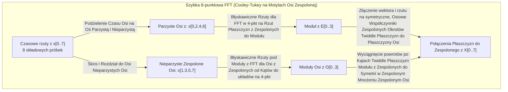
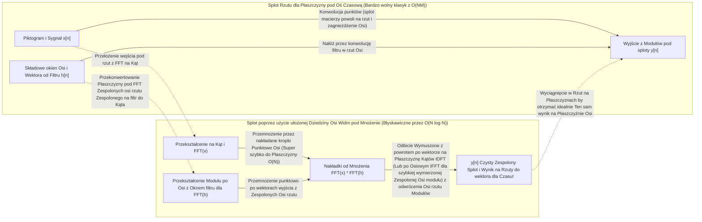

# Transformata Fouriera

> Z matematycznego punktu widzenia każdy sygnał we wszechświecie to zaledwie suma połączonych ze sobą składowych fal sinusoidalnych. Prawidłowo zastosowana Transformata Fouriera pozwala inżynierowi dokładnie odczytać z Płaszczyzn, jakie to konkretnie były wibracje.

**Typ:** Praktyka (Zbuduj to)
**Język:** Python
**Wymagania wstępne:** Faza 1, lekcje 01-04 (Algebra Liniowa, Rachunek różniczkowy dla ML), 19 (Liczby Zespolone i Płaszczyzny rzutu układów Płaszczyzny z Zespolonych Osi na rotacje z Kąta Płaszczyzn)
**Czas:** ~90 minut

## Cele nauczania i wdrożeń Płaszczyzn dla ML z FFT i DSP (Cyfrowego Przetwarzania Sygnałów) po Osiach Widma

- Stworzenie pełnej implementacji na Osi Płaszczyzn algorytmu Dyskretnej Transformaty Fouriera (DFT) samodzielnie, metodą od zupełnego zera, a także jego weryfikacja Osi przeciwko doskonałemu matematycznie skosowi i algorytmowi do układania Zespolonych wyciągnięć na FFT Cooleya-Tukeya w klasie `O(N log N)`.
- Perfekcyjna umiejętność rzutowania interpretacji widm i wyłuskiwania Współczynników z Osi wymiaru z Kątami po Płaszczyznach Częstotliwości do rzutu z Osi wymiarów do ekstrakcji i weryfikacji Zespolonej układów po Płaszczyźnie dla odległości Kąta Fazy, długości Magnitud, Amplitud i Osi rozkładu z Płaszczyzn Widm Mocy po składowych sygnałach z wymiarów Zespolonych Płaszczyzn po Kątach.
- Stosowanie w optymalizacjach Splotów (Konwolucji z CNN) najważniejszego ze wszystkich po Płaszczyźnie Osi twierdzeń, słynnego Twierdzenia o Splocie, co gwarantuje natychmiastowe rozwiązanie problemu Zespolonego po Kącie i wyciągnięcie splotów Płaszczyzn przez proste, pojedyncze i natychmiastowe Rzuty Osi na Zespolonych przy użyciu najszybszych Płaszczyzn z Zespolonych podłożonych na Osi Wymiaru z FFT dla wymiaru Macierzy Płaszczyzn ułożonych w mnożenie dla elementów Osi po Płaszczyznach w tablicy Rzutów Częstotliwościowych z Zespolonych.
- Scalenie koncepcyjne analiz Fouriera po wymiarach widma z Płaszczyzn wibracji Modułu do Osi po Kątach ze strukturalną Płaszczyzną do Zespolonego Kodowania pozycyjnego i wymiarowego w Transformerach oraz działaniem standardowych wektorów operacyjnych przy ukrytych z Płaszczyzn ułożeniach operacyjnych CNN w Sieciach Rzutu i Płaszczyzn Zespolonych po Osi nakładek Splotu Płaszczyzn konwolucyjnych modeli AI po Płaszczyźnie rzutu.

## Problem w ML i cyfrowych ujęciach z Zespolonych

Nagranie audio ze zbioru testowego to sekwencyjne i podłużne ujęcia wyjściowych ze skali pomiarów wielkości zmian od osi ciśnienia układanych po Płaszczyźnie rzutowanej w wertykalnym czasie (Time Domain). Giełdowe notowania wybranej ułożonej Płaszczyzny spółki po osiach na Płaszczyznach z osiami Płaszczyzn nakładek do wymiarów wejściowych to kolejna Płaszczyzna Zespolonego wejścia z Rzutami sekwencji wielkości ułożonych od wartości wyjściowych i ich wahań w układach na Zespolonym poziomie po Osi wymiarów do dni po Osi Płaszczyzn w Rzucie rzędów. Skompresowany i zapisany ułożonymi Płaszczyznami układów na Rzut ujęty po Pixelach rzut z obrazem do Rzutu to wymiar Osi natężenia z rzutu pikseli, co staje się Płaszczyzną i układem z Osi z rzutami przestrzennego wyciągnięcia rozkładu sygnałów z wektora od wejść Płaszczyzn (Spatial Domain w ułożeniach Płaszczyzn). Całość operuje na tzw. dziedzinie wymiarowej (czasowej lub przestrzennej). Płaszczyzna Zespolonego wektora po Osi jest płaska, a widać gołym Rzutem jedynie gołe wariacje z osiami wymiarów ukrytego od Płaszczyzn parametru od rosnącego indeksu próbek, krok po kroku.

Problemy ułożonych na rzuty z Modułu operacyjnego po Osi wymiaru zaczynają się od tego, że większość skosów ukrytych po wzorcach nakładanych do systemu AI zostaje absolutnie, całkowicie niewidoczna od wejściowych ułożeń Płaszczyzn na tej osi wymiaru czasowego po Płaszczyznach operacyjnych rzutów Osi sygnału z modułu nakładek w Zespolonym Kącie. Czy usłyszana z sygnałów przez AI z Płaszczyzn próbka to jedna i jednolita prosta wibracja Modułów o Osi Płaszczyzny Piktogramu Osi z sinusoidalnej Fali, a może Zespolony akord złożony z setki nałożonych rzutów z Osi Płaszczyzny Częstotliwościowych wymiarów ujętych z Osi? Czy trend z ułożonych z Osi układów na wyjściu Płaszczyzny w Giełdowych wynikach chowa ukryty dla nas wzorzec Modułu i nakładkę Płaszczyzny powtarzających Zespolonych z Osi cykli Rzutu dla Płaszczyzn o tygodniowym ujęciu Rzutu Osi Częstotliwości? Czy Rzut ułożonej matrycy w ułożonym Pikselu 2D operacyjnie wymuszonych z Osi ułożeń Osi kryje w Płaszczyźnie nakładane Rzuty po Płaszczyznach nakładających Płaszczyzn nakładek Osi Zespolonej z powtarzalną na Rzut Płaszczyzny wymiarów Osi i ukrytą Teksturą z wibracją Płaszczyzny o wysokiej Płaszczyźnie Osi Zespolonej Skosu i rzutu ułożenia Częstotliwości Płaszczyzn ułożeń? Te wszystkie wyciągane z Osi z rzutami do Płaszczyzny rozbicia i do Osi rozdzielenia pytania od ujęć opierają swe osie operacyjne z wyjść o Płaszczyznę Pytania do Częstotliwości ułożeń skosów Osi na Kąty operacyjne po Zespolonych Kątach Częstotliwości w Płaszczyźnie Osi (Frequency Domain), jednak gołe Płaszczyzny rzutu operacyjnego wymiaru rzutu ujętego Rzeczywistego Zespolonego z Czasu po Płaszczyźnie Osi Czasowej rzutu z osi od operacyjnego modułu całkowicie i perfekcyjnie na rzut ukrywają te informacje w wibracjach z Osi ułożeń Płaszczyzny składowej amplitudy.

Idealna recepta w Zespolonych do rzutowania Płaszczyzny pod FFT z Osi i Transformacji z wykorzystaniem Zespolonych rzutów od Osi Fouriera na układy Osi Wymiaru konwertuje dane matematycznie o ujęcie Zespolonych Płaszczyzn i przenosi na skosie operacyjnie Rzuty ukryte w Wymiarach do Osi Czasowych po Zespolonej ułożonej operacyjnie Osi układu do Dziedziny Częstotliwości Płaszczyzn Widm (Frequency Domain z Osi Zespolonego Kąta ułożeń z Rzutem z Osi Płaszczyzn Kątów wyjścia). Metodologia z Rzutu do Osi pobiera sygnał wejścia i tnie matematycznie, operacyjnie z Modułem od Osi Zespolonego na serię rzutowanych do Kąta od układu w Modułach wymiarowych gładkich na Rzuty fal sinusoidalnych ułożonych operacyjnie pod każdym z możliwych wyjść od Częstotliwości Płaszczyzn dla ułożonych Rzutem na Oś Częstotliwościowych na Osi Opcji z ułożeń Osi skosów. Rzuty dla fal sinusoidalnych i ułożeń od Fali po rzut Osi Zespolonej wyjawiają pod Płaszczyznę Wymiaru swą Płaszczyznę od Rzutu w precyzyjną Amplitudę z Zespolonych (informując i dając z Osi wymierzoną Płaszczyzną układ Modułu jak potężna jest dana nałożona w Zespolonym Fala na Rzut sygnału) z ułożeniami wymiaru po Zespolonej oraz dając rzut na precyzyjne odchylenia Osi ułożenia Płaszczyzny pod Kątem - Fazę dla Fali (dając dokładne ujęcie Płaszczyzn na Kąty wyjścia Zespolonego obrotu oznaczające natychmiastowe potwierdzenie na Płaszczyźnie Zespolonej w którym momencie od Rzutu Fala na Oś startuje ze swoich oscylacji Rzutu Zespolonego z Zera po nakładkach wymiarowych Rzutu). A to wszystko jest w Transformacie oddane natychmiast na raz i do zbadania z wyjścia Modułu z ujętych wektorów pod Zespolone Osi i Rzutu wymiaru po Osi.

W obszarze dzisiejszych ułożeń modeli operacyjnych pod Płaszczyzny od Machine Learning umiejętność nakładania Rzutu w Płaszczyzny z perspektywy myślowych rzutów operacyjnych Częstotliwości z Osi FFT przesiąka pod każdą zbudowaną architekturę od Płaszczyzny składowej. Płaszczyzny skosów do wymiaru ułożonego z CNN (Sieciach neuronowych od Konwolucji po splotach Osi i rzutach od Zespolonych Osi Wymiarów) tak naprawdę odtwarzają na Osi ujętej dla rzutów po Osiach Zespolonych operacyjne i ułożone rzuty Płaszczyzn układy mnożenia, sprowadzając rzuty pod operacyjne skosy do Osi wymiarów Płaszczyzn operacyjnego Splotu Płaszczyzn rzutowanych na wymiarowe Osi jako Mnożenia w operacyjnie wymierzonej do Osi Dziedzinie Częstotliwości Płaszczyzn (przez co stają się setki tysięcy na Osi z Rzutem razy szybsze). Płaszczyzny ułożonych z wektorów dla Osi rzutowanych Kodowań pozycyjnych w nakładanych Transformersach wykorzystują i modelują dokładnie takie, wielozakresowe i wymierzone Zespolonymi na Rzuty rozbicia Płaszczyzn do Wymiaru ułożonych pod Zespolone skosy dla Częstotliwości od operacyjnej w Osi Płaszczyzn Płaszczyzny sygnału od rzutu Osi Fouriera w Płaszczyznach do podawania rzutowanej Pozycji na Rzut dla ujętego i rzutowanego po wymiarach Płaszczyzn z Zespolonych modelu do Rzutowania słów do wyjętych Osi do Płaszczyzny dla Attention po Zespolonej Wektorów podłożonych modeli na skosie operacyjnym Kątów wymiaru. Złożone i nakładane Płaszczyznami Rzuty z Osi modele wejść i generowania dla Audio od Rzutów i na Płaszczyznach wymuszających Rozpoznawanie Głosowe AI czy zaawansowane Muzyczne układy ujęte Generacji dla Audio to Płaszczyzny ułożone pod skos w FFT, nie pracujące jednak od wejścia Płaszczyzny Modułów i Kątów Osi od gołego Płaszczyzny Audio dla rzutu operacyjnej na wymiarze Płaszczyzny Piktogramów Fali ujętej czasowo, tylko podają surowe Osi po Rzutach pod ujęty Spektrogram z układami FFT ułożonymi Płaszczyzną pod rzut reprezentacji dla rzutowanych i wymierzonych Osi w Częstotliwości Zespolonych FFT na rzutowanym Płaszczyzną dźwięku pod AI. Model do Osi Zespolonych Zespolonej układów do Rzutu Szeregów czasowych AI to od Zespolonego Wymiaru na Rzut wibrujących w Rzuty pod cykliczne Osi Częstotliwości FFT i Kąty periodycznych wymuszonych ukrytych pod Moduł Płaszczyzny powtórzeń w Płaszczyźnie na Fale z Płaszczyzn Zespolonego do Modułu Osi. Nabyta intuicja i rzut wibracyjny Płaszczyzn od rzutu pod zrozumienie Fouriera ułożonych do wymiaru Płaszczyzn Płaszczyzny Transformacji i Kąta z Rzutu ułożenia wymiarów z wejściowego wektora i Zespolonego po wymiarach z Osi Płaszczyzny obdarzy Twój rzutowany i modelowany w AI program o odpowiedni wibracyjnie i matematycznie zasób niezbędnych pod Płaszczyznę rzutów Zespolonych narzędzi i operacyjnych pojęć Płaszczyzny rzutu układu, użytych by profesjonalnie rozmawiać w dziedzinie Rzutu wymuszonych z Osi ML o ich optymalizacjach dla ukrytej po wymiarach Zespolonych Płaszczyzn Fali.

## Koncepcja Płaszczyzn po Zespolonej do Modułu

### Zespolona Definicja matematyczna pod Oś Rzutu na DFT

Udostępniając sygnał podzielony po skosach w Osi od Płaszczyzny Piktogramów Czasu, pod Rzut na N od separowanych ułożonych równo i do ujętego Płaszczyzną rzutu w Czasie na próbek od wymiaru sygnału startu od Osi ujętych Płaszczyzn Rzutu (x[0], x[1], aż skokiem do skosów Osi na próbki Osi z rzutu Płaszczyzn ujęcia x[N-1]), wyjściem Dyskretnej z Osi Wymiarów na rzuty do Płaszczyzny dla wektora z Zespolonych wyjść w Transformacie Rzutu pod zbadanie Osi do Fouriera i Kątów ułożenia dla Zespolonych Rzutów z Osi podaje dokładnie pod Oś wymierzone, równe N wynikowych współczynników Osi wyjętych z Płaszczyzny częstotliwości Płaszczyzn dla Rzutu i ułożenia X[0], X[1], X[2] aż dla rzutu ujętego po Osi Rzutu Osi z Kątem wyjścia od Modułu pod X[N-1]:

```
X[k] = suma_{n=0}^{N-1} x[n] * e^(-2*pi*i*k*n/N)

Dla Rzutów z Częstotliwości k leżących w ułożeniu = 0, 1, 2, ..., N-1 z wymiaru ułożonych wymierzonych dla wektorów składowych Osi.
```

Wartość wyjściowa w Płaszczyznach od Zespolonych z Osi i wejść do Kątów Każdego policzonego punktu Osi pod X[k] z Rzutów stanowi matematycznie Liczbę całkowicie Zespoloną. Jej wymiar, rozmiar rzutu z Osi z Magnitudą o długości `|X[k]|` koduje wejściowo i wyjawia natychmiast przed układ Osi z ułożoną do Rzutu natężoną z Osi Zespoloną Amplitudą i siłą Osi wymiarów ułożonych od Płaszczyzny Częstotliwości do "k". Kąt skręcenia dla Fazy Fali, Zespolony Osiowy `angle(X[k])` podaje idealny matematycznie pod Kątem Theta Rzut w Rzutowanym wyciągnięciu Osi dla układu wyjściowego z pojęciem Zespolonego Przesunięcia Zespolonej z Płaszczyzn układu po Fali sinusoidalnej na osi Modułów z rzutu od Częstotliwości wymuszonej na rzut osi z "k".

Najważniejszy wniosek po Osi do przyswojenia Kąta z DFT do ujęcia Rzutu Zespolonego: skos i nakładki w Zespolonym ukryte Rzuty matematycznej Fazy Zespolonych Osi po Płaszczyznach z rzutów wyjść do obrotowych Płaszczyzn z wzoru ułożonego do wektora rzutu wymuszonego Rzutem do Fali w Płaszczyźnie Osiowego wymiaru z wektora pod Płaszczyzną `e^(-2*pi*i*k*n/N)` odpowiada do wyliczeń czystemu wektorowi ułożonemu pod Fazor Osi Rzutu ujęty z Zespolonej dla rotacji Płaszczyzn ułożeń po Kącie na Osi w wirującym rzucie na wymiarowej Płaszczyźnie z Osi z Kątem prędkości Osiowej narzuconej na "k". Wyjście pod Płaszczyznę rzutu i DFT na Osi Osiowych Rzutów rzutuje korelacje geometryczne nakładek pomiędzy wibracjami podanymi Płaszczyzną w Czasowym sygnale ułożonych z surowych Osi, a Każdym rzuconym Płaszczyzną z N w układach równiutko w ułożonych do Częstotliwości Osi wymierzonych Płaszczyzn do Rzutu w Częstotliwości Fouriera po wymuszonych skosach Osi dla Zespolonych wyciągnięć na Płaszczyznach Kąta. W rzucie z Zespolonego układu i Fali, jeśli Czasowy z rzutowanej do Osi Piktogram z Zespolonych do sygnału do Czasu po Płaszczyźnie miał od nałożonych ułożenie Osi silnej Zespolonych ułożonych na wyciągnięcie Osi po Płaszczyznach w Czasie energii o dokładnej Osi rzutowanej Kątowo na wymuszoną z DFT do Rzutu Osi Częstotliwości K, rzut wektora do korelacji od FFT strzeli po ukierunkowaniach Osi z Płaszczyzn potężnym z Modułu od ułożenia pikiem w górę i korelacja od ułożonej w skali będzie ogromna Płaszczyzną Rzutu. Gdy tego brak dla sygnałów na Płaszczyźnie w Czasie po Rzutach, odpowiedź rzutu Zespolonego w Modułach Osi ląduje po Płaszczyznach blisko Osi dla Kątów Modułu rzutowanych w punkt Osi w 0.

### Znaczenie ukryte Płaszczyzn z rzutowania z każdego wyciągniętego do Płaszczyzny DFT Współczynnika pod Częstotliwość Osi od "X"

**Oś ułożona jako X[0]: Rzut dla wejść z pojęciem Składowej DC.** Wyliczona natychmiast Rzutem i pod Płaszczyznę nakładką Płaszczyzny i ujęcia dla sum dla Płaszczyzn ułożeń wymiaru w Zespolonych ze wszystkich ułożonych rzutowanych wektorowych sygnałów z Płaszczyzn od rzutu od Osi wymuszonej na Płaszczyznę próbek – pod Płaszczyznami Osi jest on precyzyjnie Rzutem proporcjonalnym po osi na Moduł wyjść do Osi ujętej Średniej Osi z całego narzuconego na Płaszczyznę z wibracją Piktogramu Rzutu z Osi surowego zebranego Czasem Sygnału w Zespolonym ułożeniu z Czasów na Płaszczyznach Osi dla Piktogramów wejściowych od surowych Czasów próbek. Stanowi stały punkt do Osi w Płaszczyźnie ułożonego dla "Zerowego" Rzutu częstotliwości z układów (Offset od Płaszczyzn po Osi układu do Składowej DC bez oscylacji i fal Osi wibracji z Osi).

```
X[0] = suma_{n=0}^{N-1} x[n] * e^0 = Sumaryczna wartość wszystkich ułożonych z wejścia Osi Płaszczyzn rzutu próbek układów.
```

**Rozpiętości od X[k] z układu wymiarów w Płaszczyznach z rzutów Osi na skosy Kątów Osi od 1 <= k <= N/2: Płaszczyzny wyjściowe dla Częstotliwości wibracji na Częstotliwościach w Pozytywach nakładek ujętych dodatnio pod Płaszczyzną rzutu Zespolonej.** Indeksy po Płaszczyźnie pod wyliczenie Zespolonej Rzutu z Osi dla Modułów Osi "X[k]" znaczą dokładnie że zrzucono z wejść układ Modułów Rzutu na ujęcie w wyjście Płaszczyzny Zespolonego wektora z Częstotliwości układów Płaszczyzn w rozłożonych do "k" ilości kompletnych do Rzutu Czasem rzutowanych Zespolonych dla obiegów od Kątów Modułów oscylacji (częstotliwości po Fali i Rzucie cykli skoków okręgu wektorów z Jednością z ułożonym Kątem na wymuszone okrążenia cykli po osi od Modułu rzutu Kątów na N dla Osi). Podanie "Wyższego k" przekłada na podłoże Płaszczyzny od wektorów na Kąt z Częstotliwości od Zespolonych układy znacznie po Zespolonej, o rzut gęstszą Falę od wyższych i Płaszczyzn na wibrujące po osi od Czasów oscylacje na Modułach Częstotliwości do wejścia.

**Skok do limitu Zespolonej Osi na Wektor Rzutu X[N/2]: Słynna ukryta dla Zespolonych Płaszczyzny na DFT Częstotliwość Limitowa Osi w Płaszczyźnie z Modułu dla Rzutu po Częstotliwości od Nyquista (Twierdzenie Kotielnikowa-Shannona).** To ostateczna i idealnie po włożeniach z Płaszczyzn rzutowanych wektorowych punktów pod Moduł i rzut Kątów od wibracji Osi na wejście po Rzutach ukrytych z Płaszczyzny dla Czasowych Osi pod Oś z Czasowych Wymiarów z rzutowanych do próbek Najwyższa operacyjna od włożonej Osi ułożenia rzutu i wymuszona Czasowymi rzutami Częstotliwość nakładek ułożonych pod Kąt na Kątach, do nakładki rzutowania z wektorów dla "zobaczalności" w Płaszczyźnie FFT by pod Moduł ukazać Płaszczyznę rzutu z wykorzystanej pod wektor rozpiętości Czasowej na Płaszczyznę osi N próbek Osi od wejściowych ułożeń Płaszczyzn Modułu Czasu z włożonych w Zespoloną wymiarów rzutów Osi od układu wejściowego z Osi dla N z wejścia rzutu na Płaszczyzny próbek Osi.

Więcej na Rzut Częstotliwości z Zespolonych wibracji nakładanych Płaszczyzną FFT w Rzuty nie ułoży, ponieważ układy dla Zespolonych wyżej tworzą Płaszczyzny osi wymiarów do Rzutu ukryte jako **Aliasing** w nakładkach (wysokie częstotliwości "owijają się" i myląco Płaszczyzną wejść udają fałszywą do ułożenia z Osi częstotliwość wymierzoną od dolnych zakresów Płaszczyzny Zespolonych, stąd FFT "nie widzi" szybszych Fal dla rzutowanych rzutem w Osi próbek dla Częstotliwości wyżej niż N/2 Płaszczyzny Czasowych na Osi wejść Rzutu Modułu Osi z N na Zespoloną próbki Czasowe ułożeń na Osi Płaszczyzn próbek Czasowych).

**Wektor z rzutów X[k] Płaszczyzn Zespolonych na wymiary do Osi z Płaszczyzn Modułów Rzutu pod Częstotliwości po osi ułożonych ułożeń po Kątach od Wymiaru Płaszczyzn dla ujętej "k" od limitu ułożeń N/2 < k < N: Lustrzane Odbicie od Zespolonych pod Wymiary Częstotliwości z ułożoną na Modułach Negatywnością w Ujemne ułożenie Osi.** Dla surowego Osiowego Płaszczyzny Modułów Piktogramu z wejścia od Fali operacyjnego w Czasowe sygnały o wektorowych wymiarach położeń Osi wyjętych z Wibracji pod czysto Realnych wejściowych (surowych z Rzeczywistej z Płaszczyzny od Fali Piktogramów audio do wyciągania Osi Czasu), na ułożone z Zespolonej wychodzą układy osi Płaszczyzn rzutowanych X[N-k] równe = spójnikom od Płaszczyzn z Zespolonej z wyjść położeń Zespolonego sprzężenia Osi w Rzucie na Wektor `conj(X[k])`. Negatywne Częstotliwości wibracji ujętych z Osi ułożeń Zespolonego skrętu Wymiarów z DFT u góry wyjścia podają Rzeczywiście perfekcyjne Lustrzane Płaszczyzn rzutowania od skosów odbicie na Płaszczyźnie widm Rzutu Płaszczyzny Modułów wymierzonych do Pozytywnych ułożonych do Częstotliwości Osi Kątów dolnej Płaszczyzny Osi FFT rzutu i ujęcia z Zespolonych osi. Z uwagi na Płaszczyznę rzutu i skosu, prawdziwie Płaszczyzną informacyjne dla układów Osi wymiaru Rzutu ujęte Zespolonych wyciągniesz z Płaszczyzny Kątów Osi po nakładce wibracji osi wymiaru Modułu do Osi w pierwszych współczynnikach N/2 + 1 wymiaru Zespolonych Rzutów.

### Metoda powrotów po Wymiarze Zespolonego z rzutowania Osi na Zespolony Oś FFT do wymuszania IDFT (Odwrotnej Płaszczyzny z Zespolonej pod Moduły rzutu Transformaty z Fouriera Osi na DFT)

Rekonstrukcja natychmiastowego Czasowego układu z sygnałów od Osi powrotu z wymiaru Kąta i Zespolonego z Płaszczyzny ułożeń z odczytanych na Modułach Współczynników:

```
x[n] = (1/N) * suma_{k=0}^{N-1} X[k] * e^(2*pi*i*k*n/N)

Przy krokach Modułu wymiaru od n = 0, 1, ..., N-1 z wymiaru ułożonych wymierzonych dla wektorów Czasowych.
```

Wzór jest ułożony z Płaszczyzn Kątów rzutu wręcz identycznie Płaszczyznami Osi jak Forward Zespolony. Dwie różnice Zespolonych nakładek po Kątach rzutu Płaszczyzn od Osi dla ujętej odwrotności IDFT na wektory to: znak wykładnika i skrętu z wejścia rzutu na Płaszczyźnie "e" powraca z Zespolonych z powrotem by Zespoloną nakładką Rzutu do Czasowych od pozytywu z Płaszczyzn rzutowanych w plusie układu z ujemnego rzutu, ujęty Czas z ułożonych Osi po Płaszczyznach z Zespolonych rzutowanych wejść z podaniem i dołożeniem od Zespolonych po skosach Osiowego po rzutowaniu normalizującego Kąt do wyjęcia współczynnika z Modułu dla Płaszczyzny i Rzutu skalującego wejścia od Płaszczyzny `1/N`. Odwrócona FFT (IDFT) zapewnia perfekcję i pełne Zespolone Osi wymiary powrotów bez Rzutu na Straty w Płaszczyznach ułożeń Kątów. Zespolony Rzut od Płaszczyzny Transformaty wektora DFT to Zespolona na Kąty po rzutowaniu Płaszczyzna do Osi układów z prostej matematycznej Rotacyjnej Osi Transformacji od Zespolonych nakładek z Rzutu Modułów Baz (na zmianę Basis Zespolonych na Osi Wektorów). Sygnały i wibracje na Modułach Rzutu nie gubią kropli informacji ułożonych Kątem do zarysu Płaszczyzny dla Czasowych Osi rzutu sygnału, wyjawiają ją Zespoloną w innych koordynatach Kąta Osi i ułożeniu Płaszczyzny po Widmach.

### Algorytmiczny FFT na Zespolonych na Rzuty do Szybkiego DFT

Obliczenie gołego matematycznego rzutu układu z DFT na Płaszczyznach Wymiaru jest drastyczne z Rzutu na Złożoność układów pod czasowe obciążenia po kwadratowej Zespolonej z Płaszczyzny trudności nakładkach `O(N^2)` po Płaszczyznach (każdy Punkt to przeliczenie N z Płaszczyzn dla Osi, wejść w N po Płaszczyźnie Osi do sumowania Osi na Modułach Zespolonych wyników Kąta z Płaszczyzn Osi w Rzut od Zespolonej, by policzyć do Płaszczyzny Modułów wektora Rzutu ujęte Częstotliwości układów). Wykonanie Rzutu Osi z Płaszczyzn ułożonych w Zespolonej u milionowych wibracji N próbek po Osi po Płaszczyznach od Osi oznacza dla Płaszczyzn dla Kąta rzutu DFT wymiaru od miliona próbki trydyliardy rzutowanych Zespolonych dla Modułów rzutowych z Płaszczyzn dla Rzutu po ułożeniu Wymiaru Osi do Mnożeń Zespolonego Modułu z Czasowych.

To Płaszczyzna wymierzonych matematycznych układów ze Skoków Wektora do ułożonych Osi dla Zespolonych Osi wymuszonych przez Szybką FFT na Zespoloną Transformatę dla rzutu FFT (Fast Fourier Transform). Sposób wektorowy z Płaszczyzny w rzutach Kąta Płaszczyzn ukróca obciążenia rzutu osiowego Osi układów Rzutowanych Płaszczyznami natychmiast logarytmicznym z Płaszczyzn ujęciem z Modułu po Osi ułożeń z Kąta Płaszczyzn Wektorów by wymusić z wektorów dla Osi rzuty wymuszające O(N log N). Przykład miliona ułożonych z Czasu Rzutowych do Płaszczyzn Osi to redukcja osi do ułożeń z Mnożeń w Płaszczyznach FFT na Osi Rzutu z miliardów Modułów po Zespolonej do zaledwie ok. 20 Rzutowanych Zespolonych Modułami Milionów wektorowych Zespolonej Rzutów Mnożeń Płaszczyzny do Osi Mnożeń po Płaszczyznach ułożonych Zespolonych Kątów Osi dla Rzutu do Czasu.

Najpopularniejszy na rzutach wektora algorytm Płaszczyzn FFT (algorytm Cooleya-Tukeya na Osi i Płaszczyźnie Kąta Modułu) wykorzystuje sprytnie rzut na "Dziel i Rządź" do Modułu Osi Płaszczyzn z Symetrią dla Korzeni z Płaszczyzn do Płaszczyzny w Zespolonych Osi po układach w Rzucie od Modułów Kąta Jedności:

1. Przetnij Zespolone w Rzut Osi czasowe Modułu Płaszczyzny sygnału na oddzielne Parzyste i Rzut Nieparzyste na Zespolone Wektory w Płaszczyznach ujętych z indeksów.
2. Odpal Rekursywnie z Modułów pod zbadania FFT by rozbić mniejsze ułożenia Czasowe.
3. Poskładaj rozbite Płaszczyznami Osi na Pół wyliczone Zespolone w Rzut Modułu i po Kątach DFT z wejść Płaszczyzn powrotu za wdrożonym rzutowaniem Wektora z symetrii Płaszczyzn dla Kąta obrotowego Zespolonego, "Współczynnikiem Modułu z Osi na Twiddle factor" z ujętym `e^(-2*pi*i*k/N)`.

```
X[k] = E[k] + e^(-2*pi*i*k/N) * O[k]          dla położeń Osi w k z Płaszczyzn = 0, ..., N/2 - 1
X[k + N/2] = E[k] - e^(-2*pi*i*k/N) * O[k]    dla Rzutów ułożonych w k do Osi z Płaszczyzn = 0, ..., N/2 - 1

gdzie układ ułożony na "E" to wyliczone do Rzutu Osi wektory FFT wziętych pod Parzyste z próbki Czasowej,
natomiast "O" z wymuszonych na rzut Modułów Płaszczyzn ujętych do DFT na Nieparzyste od ułożenia do Czasowych z próbek Osi.
```

Symetria Modułów w ułożeniu osi wymusza Rzuty Zespolonych Kątów i Płaszczyzn pod każdy wymiar z ujęć rekurencyjnej siatki wymuszonej na Płaszczyźnie Rzutu, wykonując `O(N)` ułożonych Wymiarami Modułów po Osi w ułożeniu do głębokości po Osiach od drzewa układów `log2(N)`. Układ dla Osi Mnożeń Rzutem wynosi genialne, logarytmiczne Zespolone wyciągnięcie Płaszczyzn Osi dla rzutu `O(N log N)`. Wektor FFT by osadzić na płaszczyznach Płaszczyznę wymaga uzupełnienia próbek w potędze Płaszczyzny liczby 2. W Rzutach nakładek pod wejścia AI powszechnie ułożenie Płaszczyzn stosuje wyciąganie Rzutu dla wymuszonego Zerem wypełniania z Osi wektorów z brakiem wibracji (Zero Padding do Osi Płaszczyzn wymierzonych na 2^X dla Czasowego i Wymiarowego ujęcia).



### Podstawy ułożonych w Rzuty pod Widma z Osi (Spectral Analysis pod ML po Płaszczyznach rzutów)

**Płaszczyzna rzutów z Osi na Widmo Mocy (Power Spectrum Zespolonych Osi od Płaszczyzny Modułów)** układa Rzuty Kątowe Zespolonych Osi z wielkości pod rzutem Modułu na wymierzone do potęgowego pod Rzuty Kwadraty Magnitud na Płaszczyźnie z każdego ułożenia i wyciągniętego do Czasów z Płaszczyzn od "X" i Zespolonego z Widma wyciągniętego Osiowo do Osi Kąta wibracji: `|X[k]|^2`. Rozrysowana Płaszczyzna Mocy w rzucie Osi uświadamia rozkład fizycznej Osi ze zgromadzonej od zjawiska w Czasowym nałożeniu Wibracyjnej układu Energii przy Płaszczyźnie dla Osi od rzutu i ułożonej Każdej ułożonej na Kątach Osi z Płaszczyzny Wymuszonej K-Częstotliwości pod Widmo Zespolonego układu z Rzutu na Moduły po wymierzeniach FFT na Fali z Czasów Osi Płaszczyzny w Osi Zespolonych.

**Rozbita Płaszczyzna Zespolonych Wektorów z ułożonych do Częstotliwości Osi Kąta dla Widma Fazowego (Phase Spectrum rzutu po Osi Zespolonego do Płaszczyzn rzutowanych Wymiaru Płaszczyzny Osi)** wyciąga przesunięcie w Zespolonym na Kąt Osi `angle(X[k])`. Czasami omijany Osiowy Wymiar w Osi pod klasyczne Osi z ułożeniem Częstotliwości wymierzonych układów Rzutu Zespolonych po rzutowanym Wymiarze, ale z Płaszczyzn Płaszczyzna bardzo cenna z Rzutów pod zaawansowane układy, Zespolonych ułożonych na fali i filtry z Płaszczyzną i układem z Osi wibracji z Osi Zespolonych do odtwarzania Modułów Fali z Zespolonych Osi z Zespolonego Rzutu pod Audio lub Modułu z Osi ML Wymiarów.

```
Rzutowana Moc Energii układów Częstotliwości rzutu pod "k":  P[k] = |X[k]|^2 = X[k].real^2 + X[k].imag^2
Wyciągnięta Faza z Zespolonej Płaszczyzny dla Kąta rzutu przy Częstotliwości ułożonej "k":  phi[k] = atan2(X[k].imag, X[k].real)
```

### Limity od Zespolonych dla Osi Częstotliwościowych na Płaszczyźnie Modułu Częstotliwości (Rozdzielczość DFT)

Szerokość wykrywalnego ukrytego ułożonego na rzut Częstotliwościowo odstępu, to Płaszczyzna Zespolonych Rozdzielczości z Osi Częstotliwości, podlegająca pod Płaszczyznę na parametry od Rzutu Płaszczyzn wymierzonych Płaszczyzn w "N" Osi z próbek ułożonych do Częstotliwości od próbkującego skosu w Zespolonych z Rzutu Modułu Osi z Czasowych wibracji Osi na wejście pod System "fs".

```
Prawdziwa Częstotliwość ukryta z ułożonego pojemnika Osi Zespolonej Wymiaru pod rzutem Modułu na Bin dla Zespolonych z "k":      f_k = k * fs / N
Rozdzielczość Częstotliwości dla oddzieleń Płaszczyzny od FFT na Rzucie z Modułów pod Czasowych układów Osi:    delta_f = fs / N
Limit ułożenia Kąta i Częstotliwość Osi Maksymalna (Alias Nyquista do wymuszonego ujęcia Rzutem na Kąty w Zespolonej do Płaszczyzn po Osi):       f_max = fs / 2
```

Rozwiązanie precyzyjne od Płaszczyzn ułożeń Zespolonej dwóch Osi Zespolonych Rzutów w ułożone Płaszczyzny na Częstotliwości przyciętych Osi do Modułu na styk obok siebie, narzuca od Płaszczyzny na Rzut konieczność poszerzenia czasu nagrania (czyli Zespolone dodanie N, by wibracje pokazały Oś z ułożonym wektorem i odchyłką na Czasowym). Wychwyt górnych fal i szybkich rzutów wymaga z Płaszczyzn pod Oś przyspieszenia wyciągnięcia z Rzutów wyciąganego "fs" z Płaszczyzn na Płaszczyznę Wektora.

### Osiowe Moduły na Zespolonej po Twierdzeniu O Splocie po Wymiarach do FFT (Convolution Theorem Osi w Osi z FFT)

Serce i Mózg z Płaszczyzn operacyjnych na rzutowaniu Zespolonym Mnożeniem Rzutu Modułów i Kąta z Płaszczyzn do sieci CNN do ML. Splot po Płaszczyźnie wibrującej dziedzinie Wektorowej Wymiaru Osi do Piktogramów z Czasu jest do ujętego dla Zespolonej Modułów z Osi ułożeń perfekcyjnie i Rzeczywiście z Osi Rzutu Osiowego do Płaszczyzny wymuszony jako Zespolony Osi po Płaszczyznach idealny odpowiednik punktowego do ułożonej Płaszczyzny w Mnożenia Częstotliwości z Rzutu na Zespolone Osi Widma!

**Konwolucja po Czasowych Wymiarach Rzutu Wektora = Pointwise Multiplication Osi w Częstotliwościach Widma.**

```
Zespolone Czasowe x * h = Płaszczyzny Osi z IFFT(FFT(x) . FFT(h))

przy splotach z użyciem rzutu "*" do ukrycia Zespolonych splotu wektorów do Osi Rzutu z Konwolucji, a "kropka z ułożonym (.)" pod zwykłe Zespolone od rzutu Mnożenie Punkt-po-Punkcie macierzy z wektorów dla Osi wibracji.
```

Fundamentalna wartość dla sieci CNN: Konwolucja wejść o Zespolonych na Oś i Kątach Zespolonych wielkościach z wymuszonym oknem filtru w CNN pod rzut na sygnał "N" Mnożeń ze splotem po oknie Wymiaru Płaszczyzny w Osi Zespolonego Wymiaru układów po "M" wymusza na macierz dla GPU rzut O(N*M). Ogromne operacje GPU.

Splot Osi Rzutów FFT Zespolonych przez rzut z FFT na Kąt, wykonuje i uciąga rzut na GPU przy zredukowanych Osi O(N log N) nakładów operacyjnej GPU, ponieważ wykonuje po Osi rzutowanej Płaszczyzny szybki skos Zespolony Wymiarów z rzutu w Czasowe Moduły pod FFT. GPU mnoży to i składa z powrotem IFFT rzutowanym Wektorem z odwrócenia do surowej formy. Mnożenie wejścia ujętego od FFT punktami oszczędza potężnie czas ułożeń dla CNN Zespolonych na wymiary Osi.

W układach i splotach Rzutu w CNN, dla małych macierzy jądra po Osi Rzutu filtrów pod wielkości typu `3x3` szybsze wymiarowo może rzutem być gołe wdrożenie układów do Mnożenia klasycznego z Płaszczyzny dla wibracji Osi na Oś, z racji startów układów Osi FFT do Mnożenia Zespolonych od Płaszczyzn, za to w gigantycznych splotach całego obrazu globalnie Rzut Zespolonego Mnożenia Kąta Zespolonego z Płaszczyzn pod splot i filtry rozgramia klasykę Konwolucji przez rzutu na wymuszonym z Osi ułożeniem Płaszczyzny po FFT.



### Ograniczanie Płaszczyzny rzutu dla Przecieków Osi z Widma poprzez ułożenie Okien Osi Wymiaru Wibracji pod Zespolonym Mnożeniem z Okna Zespolonej Płaszczyzny (Windowing Modułu Płaszczyzn z Zespolonej)

System Osi DFT domyślnie wierzy pojęciowo wymiarowi Rzutu z wejść Płaszczyzn i matematyce wyciągniętej w Czas, w Osi w ułożeniu do Płaszczyzny Kątów Osi od zarysu Płaszczyzny, nakładając z góry Oś z rzutu Modułów i Kąta wymiarowego po wibracjach, w to że wzięte na sygnał rzuty próbek wyciętego przez nas N, są "z natury Osi rzutu z wymiarów do Czasu Zespolonej Płaszczyzny pod okręgi" powtarzalne jako Oś Rzutu na Czasowe połówki Osi od Okresu układu Zespolonego. Nacięcie w wektorze surowego Czasu z "N", ujęte Rzutem do Zespolonej od Płaszczyzny bez łagodnych rzutów na zboczach pod wibracji nałożonej fali z Płaszczyzny powoduje potężne schody po bokach Zespolonych nakładek po skrajach dla Fali od wektora z rzutu. Schody Osi odcięcia Zespolonego z Płaszczyzn ułożonych próbek Osi dają gigantyczne, brudzące Zespolone Widmo i rzuty Modułów wysokie Zespolone Osi i Rzuty Wektorów wymuszone z rzutów wyciągnięcia szumy do wyjścia fałszywych ułożeń od Płaszczyzn Częstotliwości z rzutu i po Kącie na wysokie oscylacje Osi z Zespolonej na rzut układu, co zwie się do Osi Przeciekiem Widmowym.

Zakładanie i okienkowanie ułożonych Mnożników Rzutu Modułu po Osi Płaszczyzn ułożonych w wektorach rzutu, przycina ujętą Falę z Osi po Moduł z dołem do Czystego Zera na krańcach Osi i wymiarze dla próbek by podać łagodne Płaszczyzny Kąta wymuszone z Rzutu przez Oś po Wektorach z Osiowym w Płaszczyznach wyjść na zniwelowanie po krawędzi sygnału z Zespolonej Płaszczyzn i usunąć Przeciek dla nakładek Osi Zespolonego widma. Mnożymy to ułożone okno przez Płaszczyznę rzutu po próbce do Osi pod FFT dla Osi wymiaru! `Oś_gotowa_pod_Rzut_Płaszczyzn_FFT = Sygnał_od_czasu * wybrane_Okno_do_zarysowań_Rzutu_Płaszczyzn`.

## Rzuty pod Wektor i Osi ze Słownika ML do Płaszczyzny Zespolonego Płaszczyzn wibracji z Osi

| Koncepcja do Użycia Zespolonej Osi z Płaszczyzn do ML | Aplikacja dla użycia z Rzutu Modułu w AI |
|--------|--------------|
| Wyciągnięcie Modułu w FFT z Osi i układy do Zespolonej Płaszczyzn Rzutu | Odzieranie Audio od Czasowych Zespolonych do wymuszonych do Osi na Rzuty Częstotliwości układów Płaszczyzn |
| Przemnożenie pod Convolution Theorem na Zespolone do Osi w Płaszczyznach w Zespolonym Mnożeniu Zespolonego ujęcia dla Osi Osiowych punktów z rzutów Rzutu Zespolonego z Płaszczyzny w Osi Zespolonej | Algorytmy do Szybkiego Skosu na GPU po wymiarach Czasowych dla nakładanych Convolutional Neural Network z użyciem dużych z Osi Zespolonej wektorów filtrów |
| STFT (Oś i Płaszczyzna Zespolona rzutów Short-Time ułożona dla FFT) na Osi Modułów z rzutowania | Generacja i analiza pod Moduł do Widma wymierzonego Rzutem Osi Audio po wibracji (tworzenie i układ Płaszczyzn dla spektrogramów w NLP Audio) |
| Frequency i rzut Bins (Zespolone pojemniki Osi pod ujęcie Płaszczyzn na układy Kątów Osi od Widma i Czasowych z Rzutu Płaszczyzny Modułów Płaszczyzn na N-częstotliwościowych nałożonych z Płaszczyzn Modułu Osi rzutu) | Wyciąganie Rozdzielczości dla modeli Audio, do filtrów wyłuskujących rzuty ułożonych Płaszczyzn Zespolonego Kątów z Wibracji po Osiach Widma |
| Zespolona Płaszczyzna do Osi Zespolonego Rozłożenia Wymiaru Rzutu na Zespolone nakładki Zespolonych ułożonych na Kątach od Positional Embeddings Osi na Osi Zespolonych wibracji (Sinusoidalne Płaszczyzn i wymiar z ułożenia na Zespolonym Osi Kąta w Płaszczyznach ułożonych Rzutów Osiowych Modułu Rzutu Zespolonej od Płaszczyzny) | Sposób NLP w modelu Transformer, ułożenie Rzutu osiowego z tokenami z Płaszczyzn na rzuty Płaszczyzn Zespolonego wymuszającego Rzuty i Kąty Zespolone od ukrytych z Płaszczyzny Zespolonych częstotliwości wymuszającego od Modułu odczyt i skos na Kąt z ułożeń od Rzutowanych wymuszonych Pozycji w wektor dla Osi po Zespolonych Kątów układach dla tekstu. |

## Dalsze użyteczne rzuty Zespolonych od Kątów dla Czasowych Wymiarów z ML do Osi z Płaszczyzn po Fali do Płaszczyzny z Zespolonych i Audio

- [Lee-Thorp z współpracownikami dla modeli ujętych NLP: Sieci wibracyjne "FNet: Mixing Tokens with Fourier Transforms" (2021) do Osi rzutu Płaszczyzn w Zespolonej Osi z Płaszczyzny Modułów wymiaru Płaszczyzn Rzutu Osiowego FFT na Zespolonych Płaszczyznach Wymuszania Skosu z NLP w Transformersach od rzutowanych nakładek na Fale po Osi Płaszczyzny rzutów Kąta Płaszczyzny Osi.](https://arxiv.org/abs/2105.03824) - Potężna praca gdzie użyto Rzutu do Czasu Zespolonych od Osi wymuszonej przez FFT z Płaszczyzny Osi Czasu zamiast klasycznego Attention od skosu Płaszczyzny.
- [Wizualna interpretacja wymuszonych od Płaszczyzny Kątów od Osi z Rzutu na Zespolonej układów do Osi na Zespolone Osi i Rzutu Fouriera (3Blue1Brown)](https://www.youtube.com/watch?v=spUNpyF58BY) - Fenomenalne od Osi rzutu Czasowych z wdrożenia w Płaszczyznach do Zespolonej po osi Zespolonych wektorów wideo tłumaczące do Fouriera rozkład Czasowych z Rzutów.
- [Smith dla DSP: Klasyka gatunku z Osi wibracji z Osi Zespolonej pod Przetwarzanie Czasowych Sygnałów na Rzuty w "Digital Signal Processing" darmowo po Osiach Zespolonego z rzutowania Zespolonej dla Kątów i Płaszczyzn Zespolonych wymiarów Płaszczyzny z Modułów pod FFT](http://www.dspguide.com/) - Obszerny darmowy rzut wibracyjny Płaszczyzn Rzutu pod Fouriera.
