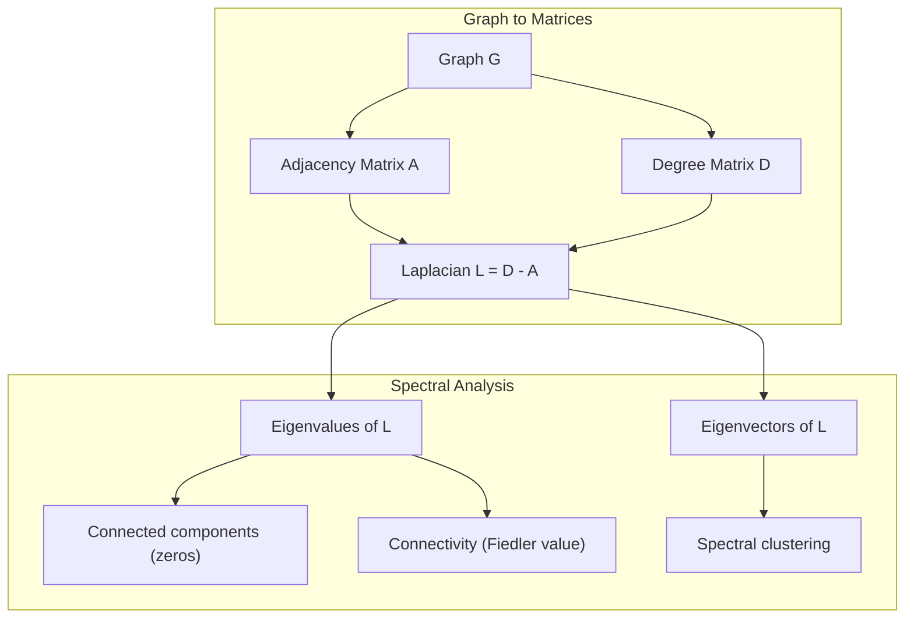
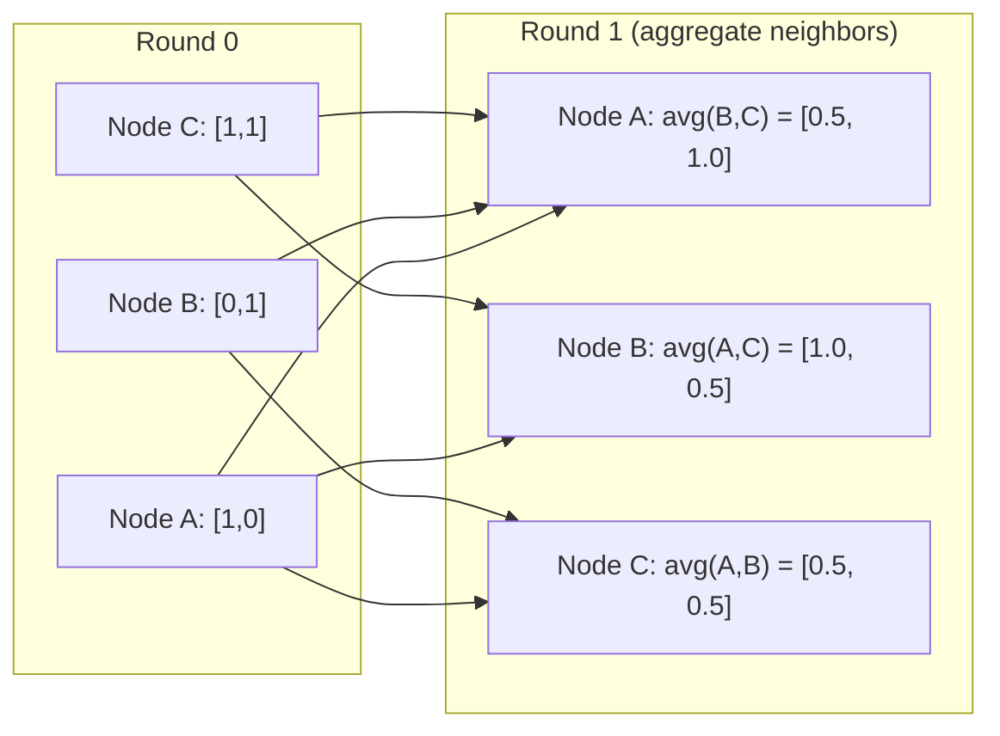

# Teoria grafów w uczeniu maszynowym

> Wykresy są strukturą danych relacji. Jeśli Twoje dane mają połączenia, potrzebujesz teorii grafów.

**Typ:** Kompilacja
**Język:** Python
**Wymagania wstępne:** Faza 1, Lekcje 01-03 (algebra liniowa, macierze)
**Czas:** ~90 minut

## Cele nauczania

- Zbuduj klasę grafów z reprezentacjami macierzy/listy sąsiedztwa i zaimplementuj przejścia BFS i DFS
- Oblicz graf Laplaciana i wykorzystaj jego wartości własne do wykrycia połączonych komponentów i węzłów klastrów
- Zaimplementuj jedną rundę przekazywania wiadomości w stylu GNN jako znormalizowane mnożenie macierzy sąsiedztwa
- Zastosuj grupowanie widmowe, aby podzielić graf za pomocą wektora Fiedlera

## Problem

Sieci społecznościowe, cząsteczki, bazy wiedzy, sieci cytatów, mapy drogowe – wszystko to jest wykresem. Tradycyjne ML traktuje dane jak płaskie tabele. Każdy rząd jest niezależny. Każdy obiekt jest kolumną. Kiedy jednak liczy się struktura połączeń, tabele zawodzą.

Weź pod uwagę sieć społecznościową. Chcesz przewidzieć, jaki produkt kupi użytkownik. Historia ich zakupów ma znaczenie. Jednak historia zakupów ich znajomych ma większe znaczenie. Połączenia przenoszą sygnał.

Lub rozważ cząsteczkę. Chcesz przewidzieć, czy wiąże się z białkiem. Atomy mają znaczenie, ale tak naprawdę liczy się sposób, w jaki atomy są ze sobą powiązane. Struktura to dane.

Graficzne sieci neuronowe (GNN) to najszybciej rozwijający się obszar głębokiego uczenia się. Wspierają odkrywanie leków, rekomendacje społeczne, wykrywanie oszustw i rozumowanie oparte na wykresach wiedzy. Każdy GNN opiera się na tym samym fundamencie: podstawowej teorii grafów.

Potrzebujesz czterech rzeczy:
1. Sposób przedstawiania wykresów w postaci macierzy (dzięki czemu można je pomnożyć)
2. Algorytmy przechodzenia do badania struktury grafów
3. Laplacian - najważniejsza macierz w teorii grafów spektralnych
4. Przekazywanie wiadomości – operacja, która sprawia, że sieci GNN działają

## Koncepcja

### Wykresy: węzły i krawędzie

Graf G = (V, E) składa się z wierzchołków (węzłów) V i krawędzi E. Każda krawędź łączy dwa węzły.

**Skierowany vs. nieskierowany.** W grafie nieskierowanym krawędź (u, v) oznacza, że ​​u łączy się z v ORAZ v łączy się z u. W grafie skierowanym (digrafie) krawędź (u, v) oznacza, że ​​u wskazuje v, ale niekoniecznie odwrotnie.

**Ważone i nieważone.** Na wykresie nieważonym krawędzie albo istnieją, albo ich nie ma. Na wykresie ważonym każda krawędź ma wagę liczbową – odległość, koszt, siłę.

| Typ wykresu | Przykład |
|----------|---------|
| Nieskierowany, nieważony | Sieć przyjaźni na Facebooku |
| Wyreżyserowany, nieważony | Sieć śledzenia na Twitterze |
| Nieskierowany, ważony | Mapa drogowa (odległości) |
| Reżyseria, ważona | Linki do stron internetowych (wyniki PageRank) |

### Macierz sąsiedztwa

Macierz sąsiedztwa A jest reprezentacją rdzenia. Dla grafu z n węzłami:

```
A[i][j] = 1    if there is an edge from node i to node j
A[i][j] = 0    otherwise
```

W przypadku grafów nieskierowanych A jest symetryczne: A[i][j] = A[j][i]. W przypadku grafów ważonych A[i][j] = waga krawędzi (i, j).

**Przykład — trójkąt:**

```
Nodes: 0, 1, 2
Edges: (0,1), (1,2), (0,2)

A = [[0, 1, 1],
     [1, 0, 1],
     [1, 1, 0]]
```

Macierz sąsiedztwa jest danymi wejściowymi każdego GNN. Operacje na macierzy A odpowiadają operacjom na wykresie.

### Stopień

Stopień węzła to liczba połączonych z nim krawędzi. W przypadku grafów skierowanych mamy stopień wejściowy (krawędzie wchodzące) i stopień wyjściowy (krawędzie wychodzące).

Macierz stopni D jest diagonalna:

```
D[i][i] = degree of node i
D[i][j] = 0    for i != j
```

Dla przykładu trójkąta: D = diag(2, 2, 2), ponieważ każdy węzeł łączy się z dwoma innymi.

Stopień informuje o znaczeniu węzła. Wysoki stopień = węzeł piasty. Rozkład stopni sieci ujawnia jej strukturę. Sieci społecznościowe podlegają prawom władzy (kilka węzłów, wiele węzłów liściowych). Losowe wykresy mają stopnie o rozkładzie Poissona.

### BFS i DFS

Dwa podstawowe algorytmy poruszania się po grafach. Potrzebujesz obu.

**Wyszukiwanie wszerz (BFS):** Najpierw przeszukaj wszystkich sąsiadów, a następnie sąsiadów. Używa kolejki (FIFO).

```
BFS from node 0:
  Visit 0
  Queue: [1, 2]        (neighbors of 0)
  Visit 1
  Queue: [2, 3]        (add neighbors of 1)
  Visit 2
  Queue: [3]           (neighbors of 2 already visited)
  Visit 3
  Queue: []            (done)
```

BFS znajduje najkrótsze ścieżki na grafach nieważonych. Odległość od początku do dowolnego węzła jest równa poziomowi BFS, na którym ten węzeł zostaje wykryty po raz pierwszy. Dlatego właśnie BFS jest używany do pomiaru odległości w sieciach społecznościowych.

**Wyszukiwanie w głąb (DFS):** Przed cofnięciem sięgnij tak głęboko, jak to możliwe. Używa stosu (LIFO) lub rekurencji.

```
DFS from node 0:
  Visit 0
  Stack: [1, 2]        (neighbors of 0)
  Visit 2               (pop from stack)
  Stack: [1, 3]         (add neighbors of 2)
  Visit 3               (pop from stack)
  Stack: [1]
  Visit 1               (pop from stack)
  Stack: []             (done)
```

DFS jest przydatny do:
- Znajdowanie połączonych komponentów (uruchom DFS z nieodwiedzonych węzłów)
- Wykrywanie cykli (tylne krawędzie w drzewie DFS)
- Sortowanie topologiczne (odwrotna kolejność zakończenia DFS)

| Algorytm | Struktura danych | Znajduje | Przypadek użycia |
|----------|---------------|-------|--------------|
| BFS | Kolejka | Najkrótsze ścieżki | Odległość sieci społecznościowej, przejście wykresu wiedzy |
| DFS | Stos | Komponenty, cykle | Łączność, sortowanie topologiczne |

### Wykres Laplaciana

L = D - A. Najważniejsza macierz w teorii grafów spektralnych.

Dla trójkąta:

```
D = [[2, 0, 0],    A = [[0, 1, 1],    L = [[2, -1, -1],
     [0, 2, 0],         [1, 0, 1],         [-1, 2, -1],
     [0, 0, 2]]         [1, 1, 0]]         [-1, -1,  2]]
```

Laplacian ma niezwykłe właściwości:

1. **L jest dodatnie, półokreślone.** Wszystkie wartości własne wynoszą >= 0.

2. **Liczba zerowych wartości własnych jest równa liczbie połączonych elementów.** Spójny graf ma dokładnie jedną zerową wartość własną. Wykres z trzema rozłączonymi składowymi ma trzy zerowe wartości własne.

3. **Najmniejsza niezerowa wartość własna (wartość Fiedlera) mierzy łączność.** Duża wartość Fiedlera oznacza, że ​​graf jest dobrze połączony. Mała wartość Fiedlera oznacza, że ​​wykres ma słaby punkt – wąskie gardło.

4. **Wektor własny wartości Fiedlera (wektor Fiedlera) pokazuje najlepszy podział.** Węzły z wartościami dodatnimi trafiają do jednej grupy, węzły z wartościami ujemnymi do drugiej. To jest skupienie widmowe.



### Właściwości widmowe

Wartości własne macierzy sąsiedztwa i Laplacianu ujawniają właściwości strukturalne bez żadnego przejścia.

**Grupowanie widmowe** działa w następujący sposób:
1. Oblicz Laplaciana L
2. Znajdź k najmniejszych wektorów własnych L (pomiń pierwszy, który w przypadku spójnych grafów oznacza same jedynki)
3. Użyj tych wektorów własnych jako nowych współrzędnych dla każdego węzła
4. Oblicz k-średnie na tych współrzędnych

Dlaczego to działa? Wektory własne L kodują „najgładsze” funkcje na wykresie. Węzły, które są dobrze połączone, uzyskują podobne wartości wektorów własnych. Węzły oddzielone wąskim gardłem otrzymują różne wartości. Wektory własne w naturalny sposób oddzielają klastry.

**Połączenie błądzenia losowego.** Znormalizowany Laplacian odnosi się do spacerów losowych na wykresie. Rozkład stacjonarny spaceru losowego jest proporcjonalny do stopnia węzła. Czas mieszania (jak szybko zbiega się spacer) zależy od przerwy widmowej.

### Przekazywanie wiadomości

Podstawowe działanie grafowych sieci neuronowych. Każdy węzeł zbiera wiadomości od swoich sąsiadów, agreguje je i aktualizuje swój własny stan.

```
h_v^(k+1) = UPDATE(h_v^(k), AGGREGATE({h_u^(k) : u in neighbors(v)}))
```

W najprostszej formie AGGREGATE = średnia i UPDATE = transformacja liniowa + aktywacja:

```
h_v^(k+1) = sigma(W * mean({h_u^(k) : u in neighbors(v)}))
```

To jest mnożenie macierzy w przebraniu. Jeśli H jest macierzą wszystkich cech węzłów, a A jest macierzą sąsiedztwa:

```
H^(k+1) = sigma(A_norm * H^(k) * W)
```

gdzie A_norm jest znormalizowaną macierzą sąsiedztwa (każdy wiersz sumuje się do 1).

Jedna runda przekazywania wiadomości pozwala każdemu węzłowi „zobaczyć” swoich bezpośrednich sąsiadów. Dwie rundy pozwalają mu zobaczyć sąsiadów sąsiadów. K rund daje każdemu węzłowi informacje z jego otoczenia K-hop.



### Koncepcje i zastosowania uczenia maszynowego

| Koncepcja | Aplikacja ML |
|--------|--------------|
| Macierz sąsiedztwa | Reprezentacja wejściowa GNN |
| Wykres Laplaciana | Grupowanie widmowe, wykrywanie społeczności |
| BFS/DFS | Przechodzenie po grafie wiedzy, odnajdywanie ścieżki |
| Dystrybucja stopni | Znaczenie węzła, inżynieria cech |
| Wiadomość przekazana | Warstwy GNN (GCN, GAT, GraphSAGE) |
| Wartości własne L | Wykrywanie społeczności, partycjonowanie wykresów |
| Grupowanie widmowe | Grupowanie węzłów bez nadzoru |
| PageRank | Znaczenie węzła, wyszukiwanie w Internecie |

## Zbuduj to

### Krok 1: Klasa grafów od zera

```python
class Graph:
    def __init__(self, n_nodes, directed=False):
        self.n = n_nodes
        self.directed = directed
        self.adj = {i: {} for i in range(n_nodes)}

    def add_edge(self, u, v, weight=1.0):
        self.adj[u][v] = weight
        if not self.directed:
            self.adj[v][u] = weight

    def neighbors(self, node):
        return list(self.adj[node].keys())

    def degree(self, node):
        return len(self.adj[node])

    def adjacency_matrix(self):
        import numpy as np
        A = np.zeros((self.n, self.n))
        for u in range(self.n):
            for v, w in self.adj[u].items():
                A[u][v] = w
        return A

    def degree_matrix(self):
        import numpy as np
        D = np.zeros((self.n, self.n))
        for i in range(self.n):
            D[i][i] = self.degree(i)
        return D

    def laplacian(self):
        return self.degree_matrix() - self.adjacency_matrix()
```

Lista sąsiedztwa (`self.adj`) skutecznie przechowuje sąsiadów. Konwersja macierzy sąsiedztwa wykorzystuje numpy, ponieważ potrzebują tego wszystkie operacje widmowe.

### Krok 2: BFS i DFS

```python
from collections import deque

def bfs(graph, start):
    visited = set()
    order = []
    distances = {}
    queue = deque([(start, 0)])
    visited.add(start)
    while queue:
        node, dist = queue.popleft()
        order.append(node)
        distances[node] = dist
        for neighbor in graph.neighbors(node):
            if neighbor not in visited:
                visited.add(neighbor)
                queue.append((neighbor, dist + 1))
    return order, distances

def dfs(graph, start):
    visited = set()
    order = []
    stack = [start]
    while stack:
        node = stack.pop()
        if node in visited:
            continue
        visited.add(node)
        order.append(node)
        for neighbor in reversed(graph.neighbors(node)):
            if neighbor not in visited:
                stack.append(neighbor)
    return order
```

BFS używa deque (kolejki dwustronnej) dla poppleft O(1). DFS używa listy jako stosu. Obydwa odwiedzają każdy węzeł dokładnie raz – czas O(V + E).

### Krok 3: Połączone komponenty i wartości własne Laplaciana

```python
def connected_components(graph):
    visited = set()
    components = []
    for node in range(graph.n):
        if node not in visited:
            order, _ = bfs(graph, node)
            visited.update(order)
            components.append(order)
    return components

def laplacian_eigenvalues(graph):
    import numpy as np
    L = graph.laplacian()
    eigenvalues = np.linalg.eigvalsh(L)
    return eigenvalues
```

`eigvalsh` dotyczy macierzy symetrycznych — Laplacian jest zawsze symetryczny dla grafów nieskierowanych. Zwraca wartości własne w kolejności rosnącej. Policz zera, aby znaleźć liczbę połączonych komponentów.

### Krok 4: Grupowanie widmowe

```python
def spectral_clustering(graph, k=2):
    import numpy as np
    L = graph.laplacian()
    eigenvalues, eigenvectors = np.linalg.eigh(L)
    features = eigenvectors[:, 1:k+1]

    labels = np.zeros(graph.n, dtype=int)
    for i in range(graph.n):
        if features[i, 0] >= 0:
            labels[i] = 0
        else:
            labels[i] = 1
    return labels
```

Dla k=2 znak wektora Fiedlera dzieli wykres na dwa skupienia. Dla k>2, uruchomiłbyś k-średnie na pierwszych k wektorach własnych (z wyłączeniem trywialnego wektora własnego jedynek).

### Krok 5: Przekazywanie wiadomości

```python
def message_passing(graph, features, weight_matrix):
    import numpy as np
    A = graph.adjacency_matrix()
    row_sums = A.sum(axis=1, keepdims=True)
    row_sums[row_sums == 0] = 1
    A_norm = A / row_sums
    aggregated = A_norm @ features
    output = aggregated @ weight_matrix
    return output
```

Jest to jedna runda przekazywania komunikatu GNN. Nowe cechy każdego węzła są średnią ważoną cech jego sąsiadów, przekształconą przez macierz wag. Układaj wiele rund, aby dalej rozpowszechniać informacje.

## Użyj tego

W przypadku networkx i numpy te same operacje są jednowierszowe:

```python
import networkx as nx
import numpy as np

G = nx.karate_club_graph()

A = nx.adjacency_matrix(G).toarray()
L = nx.laplacian_matrix(G).toarray()

eigenvalues = np.linalg.eigvalsh(L.astype(float))
print(f"Smallest eigenvalues: {eigenvalues[:5]}")
print(f"Connected components: {nx.number_connected_components(G)}")

communities = nx.community.greedy_modularity_communities(G)
print(f"Communities found: {len(communities)}")

pr = nx.pagerank(G)
top_nodes = sorted(pr.items(), key=lambda x: x[1], reverse=True)[:5]
print(f"Top 5 PageRank nodes: {top_nodes}")
```

networkx obsługuje wykresy dowolnej wielkości dzięki zoptymalizowanym backendom C. Użyj go w produkcji. Skorzystaj z implementacji od podstaw, aby zrozumieć, do czego służy.

### numpy analiza widmowa

```python
import numpy as np

A = np.array([
    [0, 1, 1, 0, 0],
    [1, 0, 1, 0, 0],
    [1, 1, 0, 1, 0],
    [0, 0, 1, 0, 1],
    [0, 0, 0, 1, 0]
])

D = np.diag(A.sum(axis=1))
L = D - A

eigenvalues, eigenvectors = np.linalg.eigh(L)
print(f"Eigenvalues: {np.round(eigenvalues, 4)}")
print(f"Fiedler value: {eigenvalues[1]:.4f}")
print(f"Fiedler vector: {np.round(eigenvectors[:, 1], 4)}")

fiedler = eigenvectors[:, 1]
group_a = np.where(fiedler >= 0)[0]
group_b = np.where(fiedler < 0)[0]
print(f"Cluster A: {group_a}")
print(f"Cluster B: {group_b}")
```

Wektor Fiedlera wykonuje najcięższe zadanie. Pozytywne wpisy w jednym skupieniu, negatywne w drugim. Nie jest wymagana żadna iteracyjna optymalizacja — wystarczy jeden rozkład własny.

## Wyślij to

Ta lekcja daje:
- `outputs/skill-graph-analysis.md` – podręcznik umiejętności dotyczący analizowania danych o strukturze graficznej

## Połączenia

| Koncepcja | Gdzie się pojawia |
|--------|--------------------------------|
| Macierz sąsiedztwa | Wejście GCN, GAT, GraphSAGE |
| Laplazja | Grupowanie widmowe, filtry ChebNet |
| BFS | Przechodzenie przez graf wiedzy, zapytania o najkrótszą ścieżkę |
| Wiadomość przekazana | Każda warstwa GNN, przekaz wiadomości neuronowych |
| Przerwa widmowa | Wykres łączności, mieszania czasu przypadkowych spacerów |
| Dystrybucja stopni | Sieci potęgowe, inżynieria cech węzłów |
| Połączone komponenty | Przetwarzanie wstępne, obsługa rozłączonych wykresów |
| PageRank | Ranking ważności węzłów, inicjalizacja uwagi |

Na szczególną uwagę zasługują GNN. Operacja splotu wykresu w GCN (Kipf i Welling, 2017) wykorzystuje macierz sąsiedztwa z dodanymi pętlami własnymi, A_hat = A + I:

```text
H^(l+1) = sigma(D_hat^(-1/2) * A_hat * D_hat^(-1/2) * H^(l) * W^(l))
```

gdzie A_hat = A + I (sąsiedztwo plus pętle własne), a D_hat jest macierzą stopni A_hat. Pętle własne zapewniają, że każdy węzeł uwzględnia własne funkcje podczas agregacji. To jest dokładnie przekazywanie wiadomości z normalizacją symetryczną. D_hat^(-1/2) * A_hat * D_hat^(-1/2) to znormalizowana macierz sąsiedztwa. Laplacian pojawia się, ponieważ ta normalizacja jest powiązana z L_sym = I - D^(-1/2) * A * D^(-1/2). Zrozumienie Laplaciana oznacza zrozumienie, dlaczego działają GCN.

## Ćwiczenia

1. **Wdrażaj PageRank od zera.** Zacznij od jednolitych wyników. Na każdym kroku: wynik(v) = (1-d)/n + d * suma(wynik(u)/out_stopień(u)) dla wszystkich u wskazujących na v. Użyj d=0,85. Biegnij aż do zbieżności (zmiana < 1e-6). Przetestuj na małym wykresie internetowym.

2. **Znajdź społeczności za pomocą grupowania widmowego.** Utwórz graf z dwoma wyraźnie oddzielonymi skupieniami (np. dwiema klikami połączonymi pojedynczą krawędzią). Uruchom grupowanie widmowe i sprawdź, czy znalazł właściwy podział. Co się stanie po dodaniu większej liczby krawędzi klastrów krzyżowych?

3. **Zaimplementuj algorytm Dijkstry** dla najkrótszych ścieżek w grafach ważonych. Porównaj wyniki z BFS na tym samym wykresie z jednakowymi wagami.

4. **Zbuduj dwuwarstwową sieć przekazywania komunikatów.** Zastosuj przekazywanie komunikatów dwukrotnie z różnymi macierzami wag. Pokaż, że po 2 rundach każdy węzeł ma informacje ze swojego sąsiedztwa z 2 przeskokami.

5. **Przeanalizuj wykres świata rzeczywistego.** Skorzystaj z wykresu Klubu Karate (34 węzły, 78 krawędzi). Obliczanie rozkładu stopni, wartości własnych Laplaciana i grupowania widmowego. Porównaj wynik grupowania widmowego ze znanym podstawowym podziałem prawdy.

## Kluczowe terminy

| Termin | Co ludzie mówią | Co to właściwie oznacza |
|------|----------------|----------------------|
| Wykres | „Węzły i krawędzie” | Struktura matematyczna G=(V,E) kodująca relacje parami |
| Macierz sąsiedztwa | „Tabela połączeń” | Macierz n x n, w której A[i][j] = 1, jeśli węzły i oraz j są połączone |
| Stopień | „Jak połączony jest węzeł” | Liczba krawędzi stykających się z węzłem |
| Laplazja | „D minus A” | L = D - A, macierz, której wartości własne ujawniają strukturę grafu |
| Wartość Fiedlera | „Łączność algebraiczna” | Najmniejsza niezerowa wartość własna L, mierząca stopień połączenia wykresu |
| BFS | „Wyszukiwanie poziom po poziomie” | Traversal, który odwiedza wszystkich sąsiadów przed pójściem głębiej, znajduje najkrótsze ścieżki |
| DFS | „Najpierw zejdź głęboko” | Przejście, które prowadzi jedną ścieżką do końca przed cofnięciem się |
| Wiadomość przekazana | „Węzły rozmawiają z sąsiadami” | Każdy węzeł agreguje informacje od swoich sąsiadów, czyli rdzenia sieci GNN
| Grupowanie widmowe | „Skupienie według wektorów własnych” | Podziel graf na partycje za pomocą wektorów własnych jego Laplacianu |
| Połączony komponent | „Oddzielny kawałek” | Maksymalny podgraf, w którym każdy węzeł może dotrzeć do każdego innego węzła |

## Dalsze czytanie

- **Kipf & Welling (2017)** — „Klasyfikacja częściowo nadzorowana z wykorzystaniem grafowych sieci konwolucyjnych”. Artykuł, który zapoczątkował nowoczesne sieci GNN. Pokazuje, że sploty wykresów widmowych upraszczają przekazywanie wiadomości.
- **Spielman (2012)** -- Notatki z wykładów „Teoria grafów spektralnych”. Ostateczne wprowadzenie do Laplacianów, przerw widmowych i podziału grafów.
- **Hamilton (2020)** -- „Nauka reprezentacji wykresów”. Książka obejmująca sieci GNN od podstaw po zastosowania.
- **Bronstein i in. (2021)** – „Głębokie uczenie się geometryczne: siatki, grupy, wykresy, geodezja i mierniki”. Jednoczący dokument ramowy.
- **Veličković i in. (2018)** — „Wykresowe sieci uwagi”. Rozszerza przekazywanie komunikatów o mechanizmy uwagi.