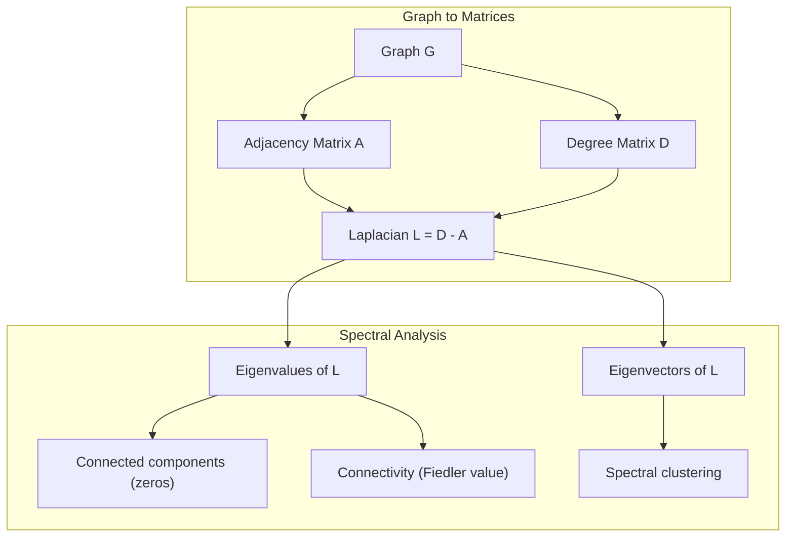
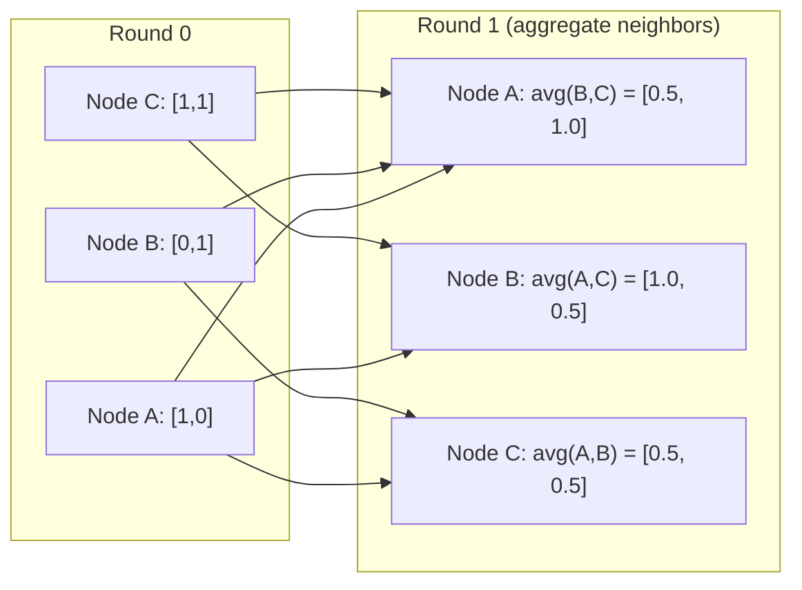

# Teoria grafów dla uczenia maszynowego

> Grafy to struktura danych reprezentująca relacje. Jeśli Twoje dane mają połączenia, potrzebujesz teorii grafów.

**Typ:** Build
**Język:** Python
**Wymagania wstępne:** Faza 1, lekcje 01-03 (algebra liniowa, macierze)
**Czas:** ~90 minut

## Cele nauki

- Zbudować klasę grafu z reprezentacjami macierzy/listy sąsiedztwa i zaimplementować przejścia BFS i DFS
- Obliczyć Laplasjan grafu i wykorzystać jego wartości własne do wykrywania składowych spójnych oraz klastrowania węzłów
- Zaimplementować jedną rundę propagacji wiadomości w stylu GNN jako mnożenie znormalizowanej macierzy sąsiedztwa
- Zastosować klastrowanie spektralne do podziału grafu za pomocą wektora Fiedlera

## Problem

Sieci społeczne, molekuły, bazy wiedzy, sieci cytowań, mapy dróg -- wszystkie to grafy. Tradycyjne ML traktuje dane jako płaskie tabele. Każdy wiersz jest niezależny. Każda cecha jest kolumną. Ale gdy struktura połączeń ma znaczenie, tabele zawodzą.

Rozważmy sieć społeczną. Chcesz przewidzieć, jaki produkt kupi użytkownik. Historia jego zakupów ma znaczenie. Ale historia zakupów jego znajomych ma większe znaczenie. Połączenia niosą sygnał.

Albo rozważmy molekułę. Chcesz przewidzieć, czy wiąże się z białkiem. Atomy mają znaczenie, ale to, co naprawdę się liczy, to sposób, w jaki atomy są ze sobą połączone wiązaniami. Struktura jest danymi.

Sieci neuronowe grafowe (Graph Neural Networks, GNN) to najszybciej rozwijający się obszar w deep learningu. Napędzają odkrywanie leków, rekomendacje społeczne, wykrywanie oszustw oraz wnioskowanie na grafach wiedzy. Każda sieć GNN bazuje na tym samym fundamencie: podstawowej teorii grafów.

Potrzebujesz czterech rzeczy:
1. Sposobu na reprezentowanie grafów jako macierzy (aby można je było mnożyć)
2. Algorytmów przejścia do eksploracji struktury grafu
3. Laplasjanu -- jednej, najważniejszej macierzy w spektralnej teorii grafów
4. Propagacji wiadomości (message passing) -- operacji, która sprawia, że GNN działają

## Koncepcja

### Grafy: węzły i krawędzie

Graf G = (V, E) składa się z wierzchołków (węzłów) V oraz krawędzi E. Każda krawędź łączy dwa węzły.

**Skierowane vs nieskierowane.** W grafie nieskierowanym krawędź (u, v) oznacza, że u łączy się z v ORAZ v łączy się z u. W grafie skierowanym (digraf) krawędź (u, v) oznacza, że u wskazuje na v, ale niekoniecznie odwrotnie.

**Z wagami vs bez wag.** W grafie nieważonym krawędzie albo istnieją, albo nie. W grafie ważonym każda krawędź ma wartość liczbową -- odległość, koszt, siłę.

| Typ grafu | Przykład |
|-----------|---------|
| Nieskierowany, nieważony | Sieć znajomości na Facebooku |
| Skierowany, nieważony | Sieć obserwowania na Twitterze |
| Nieskierowany, ważony | Mapa dróg (odległości) |
| Skierowany, ważony | Linki między stronami WWW (oceny PageRank) |

### Macierz sąsiedztwa

Macierz sąsiedztwa A jest podstawową reprezentacją. Dla grafu z n węzłami:

```
A[i][j] = 1    jeśli istnieje krawędź z węzła i do węzła j
A[i][j] = 0    w przeciwnym przypadku
```

W przypadku grafów nieskierowanych A jest symetryczna: A[i][j] = A[j][i]. Dla grafów ważonych A[i][j] = waga krawędzi (i, j).

**Przykład -- trójkąt:**

```
Węzły: 0, 1, 2
Krawędzie: (0,1), (1,2), (0,2)

A = [[0, 1, 1],
     [1, 0, 1],
     [1, 1, 0]]
```

Macierz sąsiedztwa jest danymi wejściowymi do każdej sieci GNN. Operacje macierzowe na A odpowiadają operacjom na grafie.

### Stopień (degree)

Stopień węzła to liczba krawędzi z nim połączonych. W grafach skierowanych mamy stopień wejściowy (in-degree, krawędzie przychodzące) i stopień wyjściowy (out-degree, krawędzie wychodzące).

Macierz stopni D jest diagonalna:

```
D[i][i] = stopień węzła i
D[i][j] = 0    dla i != j
```

Dla przykładu trójkąta: D = diag(2, 2, 2), ponieważ każdy węzeł łączy się z dwoma innymi.

Stopień mówi o ważności węzła. Wysoki stopień = węzeł centralny (hub). Rozkład stopni sieci ujawnia jej strukturę. Sieci społeczne podlegają rozkładom potęgowym (kilka hubów, wiele węzłów-listków). Grafy losowe mają stopnie o rozkładzie Poissona.

### BFS i DFS

Dwa podstawowe algorytmy przeszukiwania grafu. Potrzebujesz obu.

**Przeszukiwanie wszerz (Breadth-First Search, BFS):** Najpierw eksploruje wszystkich sąsiadów, potem sąsiadów sąsiadów. Wykorzystuje kolejkę (FIFO).

```
BFS od węzła 0:
  Odwiedź 0
  Kolejka: [1, 2]        (sąsiedzi 0)
  Odwiedź 1
  Kolejka: [2, 3]        (dodaj sąsiadów 1)
  Odwiedź 2
  Kolejka: [3]           (sąsiedzi 2 już odwiedzeni)
  Odwiedź 3
  Kolejka: []            (koniec)
```

BFS znajduje najkrótsze ścieżki w grafach nieważonych. Odległość od punktu startowego do dowolnego węzła jest równa poziomowi BFS, na którym ten węzeł zostaje odkryty po raz pierwszy. To dlatego BFS jest używany do obliczania odległości w liczbie "skoków" (hop-count) w sieciach społecznych.

**Przeszukiwanie w głąb (Depth-First Search, DFS):** Idzie jak najgłębiej, zanim zacznie się wycofywać. Wykorzystuje stos (LIFO) lub rekurencję.

```
DFS od węzła 0:
  Odwiedź 0
  Stos: [1, 2]        (sąsiedzi 0)
  Odwiedź 2               (zdejmij ze stosu)
  Stos: [1, 3]         (dodaj sąsiadów 2)
  Odwiedź 3               (zdejmij ze stosu)
  Stos: [1]
  Odwiedź 1               (zdejmij ze stosu)
  Stos: []             (koniec)
```

DFS jest przydatne do:
- Znajdowania składowych spójnych (uruchamiaj DFS od nieodwiedzonych węzłów)
- Wykrywania cykli (krawędzie powrotne w drzewie DFS)
- Sortowania topologicznego (odwrócony porządek zakończenia DFS)

| Algorytm | Struktura danych | Znajduje | Zastosowanie |
|-----------|---------------|-------|----------|
| BFS | Kolejka | Najkrótsze ścieżki | Odległości w sieciach społecznych, przeszukiwanie grafów wiedzy |
| DFS | Stos | Składowe, cykle | Spójność, sortowanie topologiczne |

### Laplasjan grafu

L = D - A. Najważniejsza macierz w spektralnej teorii grafów.

Dla trójkąta:

```
D = [[2, 0, 0],    A = [[0, 1, 1],    L = [[2, -1, -1],
     [0, 2, 0],         [1, 0, 1],         [-1, 2, -1],
     [0, 0, 2]]         [1, 1, 0]]         [-1, -1,  2]]
```

Laplasjan ma niezwykłe właściwości:

1. **L jest dodatnio półokreślona (positive semi-definite).** Wszystkie wartości własne są >= 0.

2. **Liczba zerowych wartości własnych jest równa liczbie składowych spójnych.** Graf spójny ma dokładnie jedną zerową wartość własną. Graf z 3 niespójnymi składowymi ma trzy zerowe wartości własne.

3. **Najmniejsza niezerowa wartość własna (wartość Fiedlera) mierzy spójność.** Duża wartość Fiedlera oznacza, że graf jest dobrze połączony. Mała wartość Fiedlera oznacza, że graf ma słaby punkt -- wąskie gardło (bottleneck).

4. **Wektor własny odpowiadający wartości Fiedlera (wektor Fiedlera) ujawnia najlepszy podział.** Węzły o wartościach dodatnich trafiają do jednej grupy, węzły o wartościach ujemnych -- do drugiej. To jest klastrowanie spektralne.



### Właściwości spektralne

Wartości własne macierzy sąsiedztwa i Laplasjanu ujawniają właściwości strukturalne bez konieczności przeszukiwania grafu.

**Klastrowanie spektralne** działa tak:
1. Oblicz Laplasjan L
2. Znajdź k najmniejszych wektorów własnych L (pomijając pierwszy, który dla grafów spójnych jest wektorem jedynek)
3. Użyj tych wektorów własnych jako nowych współrzędnych dla każdego węzła
4. Uruchom k-means na tych współrzędnych

Dlaczego to działa? Wektory własne L kodują "najgładsze" funkcje na grafie. Węzły dobrze połączone otrzymują podobne wartości wektora własnego. Węzły rozdzielone wąskim gardłem otrzymują różne wartości. Wektory własne naturalnie rozdzielają klastry.

**Związek z błądzeniem losowym (random walk).** Znormalizowany Laplasjan jest związany z błądzeniem losowym na grafie. Rozkład stacjonarny błądzenia losowego jest proporcjonalny do stopnia węzła. Czas mieszania (jak szybko błądzenie zbiega) zależy od przerwy spektralnej (spectral gap).

### Propagacja wiadomości (Message Passing)

Podstawowa operacja sieci neuronowych grafowych. Każdy węzeł zbiera wiadomości od swoich sąsiadów, agreguje je i aktualizuje swój własny stan.

```
h_v^(k+1) = UPDATE(h_v^(k), AGGREGATE({h_u^(k) : u in neighbors(v)}))
```

W najprostszej formie AGGREGATE = średnia, a UPDATE = transformacja liniowa + funkcja aktywacji:

```
h_v^(k+1) = sigma(W * mean({h_u^(k) : u in neighbors(v)}))
```

To jest mnożenie macierzy w przebraniu. Jeśli H jest macierzą wszystkich cech węzłów, a A jest macierzą sąsiedztwa:

```
H^(k+1) = sigma(A_norm * H^(k) * W)
```

gdzie A_norm jest znormalizowaną macierzą sąsiedztwa (każdy wiersz sumuje się do 1).

Jedna runda propagacji wiadomości pozwala każdemu węzłowi "zobaczyć" swoich bezpośrednich sąsiadów. Dwie rundy pozwalają zobaczyć sąsiadów sąsiadów. K rund daje każdemu węzłowi informacje z jego K-skokowego sąsiedztwa.



### Koncepcje i zastosowania w ML

| Koncepcja | Zastosowanie w ML |
|---------|---------------|
| Macierz sąsiedztwa | Reprezentacja wejściowa GNN |
| Laplasjan grafu | Klastrowanie spektralne, wykrywanie społeczności |
| BFS/DFS | Przeszukiwanie grafów wiedzy, znajdowanie ścieżek |
| Rozkład stopni | Ważność węzłów, inżynieria cech |
| Propagacja wiadomości | Warstwy GNN (GCN, GAT, GraphSAGE) |
| Wartości własne L | Wykrywanie społeczności, partycjonowanie grafu |
| Klastrowanie spektralne | Nienadzorowane grupowanie węzłów |
| PageRank | Ważność węzłów, wyszukiwanie internetowe |

## Zbuduj to

### Krok 1: Klasa grafu od zera

```python
class Graph:
    def __init__(self, n_nodes, directed=False):
        self.n = n_nodes
        self.directed = directed
        self.adj = {i: {} for i in range(n_nodes)}

    def add_edge(self, u, v, weight=1.0):
        self.adj[u][v] = weight
        if not self.directed:
            self.adj[v][u] = weight

    def neighbors(self, node):
        return list(self.adj[node].keys())

    def degree(self, node):
        return len(self.adj[node])

    def adjacency_matrix(self):
        import numpy as np
        A = np.zeros((self.n, self.n))
        for u in range(self.n):
            for v, w in self.adj[u].items():
                A[u][v] = w
        return A

    def degree_matrix(self):
        import numpy as np
        D = np.zeros((self.n, self.n))
        for i in range(self.n):
            D[i][i] = self.degree(i)
        return D

    def laplacian(self):
        return self.degree_matrix() - self.adjacency_matrix()
```

Lista sąsiedztwa (`self.adj`) przechowuje sąsiadów efektywnie. Konwersja na macierz sąsiedztwa wykorzystuje numpy, ponieważ wszystkie operacje spektralne tego wymagają.

### Krok 2: BFS i DFS

```python
from collections import deque

def bfs(graph, start):
    visited = set()
    order = []
    distances = {}
    queue = deque([(start, 0)])
    visited.add(start)
    while queue:
        node, dist = queue.popleft()
        order.append(node)
        distances[node] = dist
        for neighbor in graph.neighbors(node):
            if neighbor not in visited:
                visited.add(neighbor)
                queue.append((neighbor, dist + 1))
    return order, distances


def dfs(graph, start):
    visited = set()
    order = []
    stack = [start]
    while stack:
        node = stack.pop()
        if node in visited:
            continue
        visited.add(node)
        order.append(node)
        for neighbor in reversed(graph.neighbors(node)):
            if neighbor not in visited:
                stack.append(neighbor)
    return order
```

BFS wykorzystuje deque (kolejkę dwukierunkową) dla operacji popleft o złożoności O(1). DFS używa listy jako stosu. Oba algorytmy odwiedzają każdy węzeł dokładnie raz -- czas O(V + E).

### Krok 3: Składowe spójne i wartości własne Laplasjanu

```python
def connected_components(graph):
    visited = set()
    components = []
    for node in range(graph.n):
        if node not in visited:
            order, _ = bfs(graph, node)
            visited.update(order)
            components.append(order)
    return components


def laplacian_eigenvalues(graph):
    import numpy as np
    L = graph.laplacian()
    eigenvalues = np.linalg.eigvalsh(L)
    return eigenvalues
```

`eigvalsh` jest przeznaczone dla macierzy symetrycznych -- Laplasjan jest zawsze symetryczny dla grafów nieskierowanych. Zwraca wartości własne w porządku rosnącym. Zlicz zera, aby znaleźć liczbę składowych spójnych.

### Krok 4: Klastrowanie spektralne

```python
def spectral_clustering(graph, k=2):
    import numpy as np
    L = graph.laplacian()
    eigenvalues, eigenvectors = np.linalg.eigh(L)
    features = eigenvectors[:, 1:k+1]

    labels = np.zeros(graph.n, dtype=int)
    for i in range(graph.n):
        if features[i, 0] >= 0:
            labels[i] = 0
        else:
            labels[i] = 1
    return labels
```

Dla k=2 znak wektora Fiedlera dzieli graf na dwa klastry. Dla k>2 należałoby uruchomić k-means na pierwszych k wektorach własnych (z wyłączeniem trywialnego wektora złożonego z samych jedynek).

### Krok 5: Propagacja wiadomości

```python
def message_passing(graph, features, weight_matrix):
    import numpy as np
    A = graph.adjacency_matrix()
    row_sums = A.sum(axis=1, keepdims=True)
    row_sums[row_sums == 0] = 1
    A_norm = A / row_sums
    aggregated = A_norm @ features
    output = aggregated @ weight_matrix
    return output
```

To jedna runda propagacji wiadomości w stylu GNN. Nowe cechy każdego węzła to ważona średnia cech jego sąsiadów, przekształcona przez macierz wag. Złóż wiele rund, aby propagować informacje dalej.

## Użyj tego

Z networkx i numpy te same operacje stają się jednolinijkowcami:

```python
import networkx as nx
import numpy as np

G = nx.karate_club_graph()

A = nx.adjacency_matrix(G).toarray()
L = nx.laplacian_matrix(G).toarray()

eigenvalues = np.linalg.eigvalsh(L.astype(float))
print(f"Smallest eigenvalues: {eigenvalues[:5]}")
print(f"Connected components: {nx.number_connected_components(G)}")

communities = nx.community.greedy_modularity_communities(G)
print(f"Communities found: {len(communities)}")

pr = nx.pagerank(G)
top_nodes = sorted(pr.items(), key=lambda x: x[1], reverse=True)[:5]
print(f"Top 5 PageRank nodes: {top_nodes}")
```

networkx obsługuje grafy każdej wielkości, korzystając ze zoptymalizowanych backendów C. Używaj go w produkcji. Korzystaj z własnej implementacji od zera, aby zrozumieć, co się dzieje pod maską.

### Analiza spektralna w numpy

```python
import numpy as np

A = np.array([
    [0, 1, 1, 0, 0],
    [1, 0, 1, 0, 0],
    [1, 1, 0, 1, 0],
    [0, 0, 1, 0, 1],
    [0, 0, 0, 1, 0]
])

D = np.diag(A.sum(axis=1))
L = D - A

eigenvalues, eigenvectors = np.linalg.eigh(L)
print(f"Eigenvalues: {np.round(eigenvalues, 4)}")
print(f"Fiedler value: {eigenvalues[1]:.4f}")
print(f"Fiedler vector: {np.round(eigenvectors[:, 1], 4)}")

fiedler = eigenvectors[:, 1]
group_a = np.where(fiedler >= 0)[0]
group_b = np.where(fiedler < 0)[0]
print(f"Cluster A: {group_a}")
print(f"Cluster B: {group_b}")
```

Wektor Fiedlera wykonuje całą pracę. Wartości dodatnie w jednym klastrze, ujemne w drugim. Żadnej iteracyjnej optymalizacji -- wystarczy jedna dekompozycja własna.

## Dostarcz to

Ta lekcja produkuje:
- `outputs/skill-graph-analysis.md` -- referencyjny skill do analizy danych o strukturze grafowej

## Połączenia

| Koncepcja | Gdzie się pojawia |
|---------|------------------|
| Macierz sąsiedztwa | Wejście GCN, GAT, GraphSAGE |
| Laplasjan | Klastrowanie spektralne, filtry ChebNet |
| BFS | Przeszukiwanie grafów wiedzy, zapytania o najkrótszą ścieżkę |
| Propagacja wiadomości | Każda warstwa GNN, neuronowa propagacja wiadomości |
| Przerwa spektralna | Spójność grafu, czas mieszania błądzenia losowego |
| Rozkład stopni | Sieci o rozkładzie potęgowym, inżynieria cech węzłów |
| Składowe spójne | Preprocessing, obsługa grafów niespójnych |
| PageRank | Ranking ważności węzłów, inicjalizacja atencji |

GNN-y zasługują na szczególną wzmiankę. Operacja splotu grafowego w GCN (Kipf & Welling, 2017) wykorzystuje macierz sąsiedztwa z dodanymi pętlami własnymi (self-loops), A_hat = A + I:

```text
H^(l+1) = sigma(D_hat^(-1/2) * A_hat * D_hat^(-1/2) * H^(l) * W^(l))
```

gdzie A_hat = A + I (macierz sąsiedztwa plus pętle własne), a D_hat jest macierzą stopni A_hat. Pętle własne zapewniają, że każdy węzeł uwzględnia własne cechy podczas agregacji. To jest dokładnie propagacja wiadomości z symetryczną normalizacją. D_hat^(-1/2) * A_hat * D_hat^(-1/2) to znormalizowana macierz sąsiedztwa. Laplasjan pojawia się tutaj, ponieważ ta normalizacja jest związana z L_sym = I - D^(-1/2) * A * D^(-1/2). Zrozumienie Laplasjanu oznacza zrozumienie, dlaczego GCN-y działają.

## Ćwiczenia

1. **Zaimplementuj PageRank od zera.** Zacznij od jednorodnych wyników (uniform scores). W każdym kroku: score(v) = (1-d)/n + d * sum(score(u)/out_degree(u)) dla wszystkich u wskazujących na v. Użyj d=0.85. Uruchamiaj do momentu zbieżności (zmiana < 1e-6). Przetestuj na małym grafie sieci WWW.

2. **Znajdź społeczności za pomocą klastrowania spektralnego.** Stwórz graf z dwoma jasno oddzielonymi klastrami (np. dwie kliki połączone jedną krawędzią). Uruchom klastrowanie spektralne i zweryfikuj, że znajduje właściwy podział. Co się dzieje, gdy dodajesz więcej krawędzi międzyklastrowych?

3. **Zaimplementuj algorytm Dijkstry** do znajdowania najkrótszych ścieżek w grafach ważonych. Porównaj wyniki z BFS na tym samym grafie z jednorodnymi wagami.

4. **Zbuduj 2-warstwową sieć propagacji wiadomości.** Zastosuj propagację wiadomości dwukrotnie, z różnymi macierzami wag. Pokaż, że po 2 rundach każdy węzeł ma informacje z jego 2-skokowego sąsiedztwa.

5. **Przeanalizuj rzeczywisty graf.** Użyj grafu Karate Club (34 węzły, 78 krawędzi). Oblicz rozkład stopni, wartości własne Laplasjanu oraz klastrowanie spektralne. Porównaj wynik klastrowania spektralnego ze znanym podziałem referencyjnym (ground truth).

## Kluczowe terminy

| Termin | Co mówią ludzie | Co to faktycznie znaczy |
|------|----------------|----------------------|
| Graf | "Węzły i krawędzie" | Struktura matematyczna G=(V,E) kodująca relacje parami |
| Macierz sąsiedztwa | "Tabela połączeń" | Macierz n x n, gdzie A[i][j] = 1, jeśli węzły i oraz j są połączone |
| Stopień | "Jak bardzo połączony jest węzeł" | Liczba krawędzi dotykających węzła |
| Laplasjan | "D minus A" | L = D - A, macierz, której wartości własne ujawniają strukturę grafu |
| Wartość Fiedlera | "Spójność algebraiczna" | Najmniejsza niezerowa wartość własna L, mierząca, jak dobrze połączony jest graf |
| BFS | "Przeszukiwanie poziom po poziomie" | Przejście odwiedzające wszystkich sąsiadów przed zejściem głębiej, znajduje najkrótsze ścieżki |
| DFS | "Idź najpierw w głąb" | Przejście, które śledzi jedną ścieżkę do końca, zanim się wycofa |
| Propagacja wiadomości | "Węzły rozmawiają z sąsiadami" | Każdy węzeł agreguje informacje od swoich sąsiadów, podstawa GNN |
| Klastrowanie spektralne | "Klastrowanie według wektorów własnych" | Podział grafu za pomocą wektorów własnych jego Laplasjanu |
| Składowa spójna | "Odrębny fragment" | Maksymalny podgraf, w którym każdy węzeł może dotrzeć do każdego innego |

## Dalsze materiały

- **Kipf & Welling (2017)** -- "Semi-Supervised Classification with Graph Convolutional Networks." Praca, która zapoczątkowała współczesne GNN. Pokazuje, że spektralne splotu grafowe sprowadzają się do propagacji wiadomości.
- **Spielman (2012)** -- notatki z wykładu "Spectral Graph Theory". Klasyczne wprowadzenie do Laplasjanów, przerw spektralnych i partycjonowania grafów.
- **Hamilton (2020)** -- "Graph Representation Learning." Książka obejmująca GNN od podstaw po zastosowania.
- **Bronstein et al. (2021)** -- "Geometric Deep Learning: Grids, Groups, Graphs, Geodesics, and Gauges." Praca przedstawiająca ujednolicony framework.
- **Veličković et al. (2018)** -- "Graph Attention Networks." Rozszerza propagację wiadomości za pomocą mechanizmów atencji.
