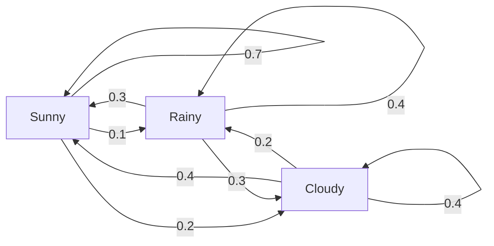
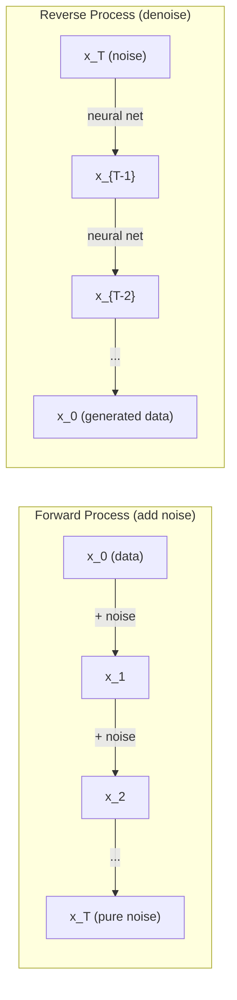

# Procesy stochastyczne

> Losowość ze strukturą. Matematyka przypadkowych spacerów, łańcuchów Markowa i modeli dyfuzji.

**Typ:** Ucz się
**Język:** Python
**Wymagania wstępne:** Faza 1, lekcje 06-07 (prawdopodobieństwo, Bayes)
**Czas:** ~75 minut

## Cele nauczania

- Symuluj spacery losowe 1D i 2D i sprawdź skalowanie przemieszczenia sqrt(n).
- Zbuduj symulator łańcucha Markowa i oblicz jego rozkład stacjonarny poprzez rozkład własny
- Zaimplementuj dynamikę Metropolis-Hastings MCMC i Langevina do próbkowania z rozkładów docelowych
- Połączyć proces dyfuzji do przodu z ruchami Browna i wyjaśnić, w jaki sposób proces odwrotny generuje dane

## Problem

Wiele systemów sztucznej inteligencji charakteryzuje się losowością, która ewoluuje w czasie. Nie losowość statyczna – losowość uporządkowana, sekwencyjna, w której każdy krok zależy od tego, co wydarzyło się wcześniej.

Modele językowe generują tokeny pojedynczo. Każdy token zależy od poprzedniego kontekstu. Model wyprowadza rozkład prawdopodobieństwa, pobiera z niego próbki i kontynuuje. To jest proces stochastyczny.

Modele dyfuzyjne stopniowo dodają szum do obrazu, aż stanie się on całkowicie statyczny. Następnie odwracają ten proces, odszumiając krok po kroku, aż pojawi się nowy obraz. Proces naprzód to łańcuch Markowa. Proces odwrotny to wyuczony łańcuch Markowa działający wstecz.

Agenci uczenia się przez wzmocnienie podejmują działania w środowisku. Każde działanie z pewnym prawdopodobieństwem prowadzi do nowego stanu. Agent kieruje się losową polityką w losowym świecie. Całość jest procesem decyzyjnym Markowa.

Próbkowanie MCMC – podstawa wnioskowania bayesowskiego – konstruuje łańcuch Markowa, którego rozkład stacjonarny jest rozkładem późniejszym, z którego chcesz próbkować.

Wszystkie opierają się na czterech podstawowych ideach:
1. Spacery losowe – najprostszy proces stochastyczny
2. Łańcuchy Markowa -- losowość strukturalna z macierzą przejścia
3. Dynamika Langevina – opadanie gradientowe z szumem
4. Metropolis-Hastings – próbkowanie z dowolnej dystrybucji

## Koncepcja

### Losowe spacery

Zacznij od pozycji 0. Na każdym kroku rzuć uczciwą monetą. Głowy: przesuń się w prawo (+1). Ogony: ruch w lewo (-1).

Po n krokach Twoja pozycja jest sumą n losowych wartości +/-1. Oczekiwana pozycja to 0 (przejście jest bezstronne). Ale oczekiwana odległość od początku rośnie wraz z kwadratem (n).

To jest sprzeczne z intuicją. Spacer jest równy, bez dryfu w żadną stronę. Jednak z czasem wędruje coraz dalej od miejsca, w którym się rozpoczął. Odchylenie standardowe po n krokach wynosi sqrt(n).

```
Step 0:  Position = 0
Step 1:  Position = +1 or -1
Step 2:  Position = +2, 0, or -2
...
Step 100: Expected distance from origin ~ 10 (sqrt(100))
Step 10000: Expected distance from origin ~ 100 (sqrt(10000))
```

**W 2D** spacer porusza się w górę, w dół, w lewo lub w prawo z równym prawdopodobieństwem. To samo skalowanie sqrt(n) dotyczy odległości od początku. Ścieżka rysuje wzór przypominający fraktal.

**Dlaczego sqrt(n)?** Każdy krok ma +1 lub -1 z równym prawdopodobieństwem. Po n krokach pozycja S_n = X_1 + X_2 + ... + X_n, gdzie każde X_i wynosi +/-1. Wariancja każdego kroku wynosi 1, a kroki są niezależne, więc Var(S_n) = n. Odchylenie standardowe = sqrt(n). Dzięki centralnemu twierdzeniu granicznemu S_n / sqrt(n) zbiega się do standardowego rozkładu normalnego.

To skalowanie sqrt(n) pojawia się wszędzie w ML. Szum SGD skaluje się jako 1/sqrt(batch_size). Osadzanie skali wymiarów jako sqrt(d). Pierwiastek kwadratowy jest sygnaturą niezależnych losowych dodatków.

**Połączenie z ruchami Browna.** Wybierz losowy spacer z krokiem o rozmiarze 1/sqrt(n) i n krokami na jednostkę czasu. Gdy n zmierza do nieskończoności, spacer zbiega się do ruchu Browna B(t) – procesu w czasie ciągłym, w którym B(t) ma rozkład normalny ze średnią 0 i wariancją t.

Ruchy Browna są matematyczną podstawą dyfuzji. Modeluje losowe drgania cząstek w płynie, wahania cen akcji i – co najważniejsze – proces szumu w modelach dyfuzyjnych.

**Ruina hazardzisty.** Losowy wędrowiec zaczynający od pozycji k, z barierami pochłaniającymi w punktach 0 i N. Jakie jest prawdopodobieństwo dotarcia do N przed 0? Dla uczciwego spaceru: P(zasięg N) = k/N. To zaskakująco proste i eleganckie. Łączy się to z teorią martyngałów – sprawiedliwy błądzenie losowe to martyngał (oczekiwana wartość przyszła = wartość bieżąca).

### Łańcuchy Markowa

Łańcuch Markowa to układ, który przechodzi między stanami według ustalonych prawdopodobieństw. Kluczowa właściwość: następny stan zależy tylko od bieżącego stanu, a nie od historii.

```
P(X_{t+1} = j | X_t = i, X_{t-1} = ...) = P(X_{t+1} = j | X_t = i)
```

To jest własność Markowa. Oznacza to, że całą dynamikę można opisać macierzą przejść P:

```
P[i][j] = probability of going from state i to state j
```

Każdy wiersz P sumuje się do 1 (musisz gdzieś iść).

**Przykład — Pogoda:**

```
States: Sunny (0), Rainy (1), Cloudy (2)

P = [[0.7, 0.1, 0.2],    (if sunny: 70% sunny, 10% rainy, 20% cloudy)
     [0.3, 0.4, 0.3],    (if rainy: 30% sunny, 40% rainy, 30% cloudy)
     [0.4, 0.2, 0.4]]    (if cloudy: 40% sunny, 20% rainy, 40% cloudy)
```

Rozpocznij w dowolnym stanie. Po wielu przejściach rozkład stanów zbiega się do rozkładu stacjonarnego pi, gdzie pi*P = pi. To jest lewy wektor własny P o wartości własnej 1.

W przypadku łańcucha pogodowego rozkład stacjonarny może wynosić [0,53, 0,18, 0,29] — na dłuższą metę słonecznie jest przez 53% czasu, niezależnie od stanu początkowego.



**Obliczanie rozkładu stacjonarnego.** Istnieją dwa podejścia:

1. **Metoda mocy**: pomnóż dowolny rozkład początkowy przez P wielokrotnie. Po wystarczającej liczbie iteracji jest zbieżny.
2. **Metoda wartości własnej**: znajdź lewy wektor własny P o wartości własnej 1. To jest wektor własny P^T o wartości własnej 1.

Obydwa podejścia wymagają, aby łańcuch spełniał warunki zbieżności.

**Warunki zbieżności.** Łańcuch Markowa zbiega się do unikalnego rozkładu stacjonarnego, jeśli jest:
- **Nieredukowalne**: każdy stan jest osiągalny z każdego innego stanu
- **Aperiodyczny**: łańcuch nie pracuje cyklicznie w ustalonym okresie

Większość sieci, które napotkasz w ML, spełnia oba warunki.

**Stany absorbujące.** Stan jest absorbujący, jeśli raz w niego wejdziesz, już nigdy go nie opuścisz (P[i][i] = 1). Absorbowanie Markowa łączy procesy modelowe ze stanami końcowymi – grą, która się kończy, klientem, który odchodzi, sekwencją tokenów, która trafia w token końca tekstu.

**Czas mieszania.** Ile kroków zanim łańcuch zbliży się do rozkładu stacjonarnego? Formalnie liczba kroków, zanim całkowita odległość zmiany od stacjonarności spadnie poniżej pewnego progu. Szybkie mieszanie = potrzeba kilku kroków. Odstęp widmowy P (1 minus druga co do wielkości wartość własna) kontroluje czas mieszania. Większa szczelina = szybsze mieszanie.

### Połączenie z modelami językowymi

Generowanie tokenów w modelu językowym jest w przybliżeniu procesem Markowa. Biorąc pod uwagę bieżący kontekst, model generuje rozkład na następny token. Temperatura kontroluje ostrość:

```
P(token_i) = exp(logit_i / temperature) / sum(exp(logit_j / temperature))
```

- Temperatura = 1,0: rozkład standardowy
- Temperatura < 1,0: ostrzejsza (bardziej deterministyczna)
- Temperatura > 1,0: bardziej płaska (bardziej losowa)
- Temperatura -> 0: argmax (chciwy)

Próbkowanie z góry k jest obcinane do k tokenów o najwyższym prawdopodobieństwie. Próbkowanie z góry p (jądro) jest obcinane do najmniejszego zestawu tokenów, których skumulowane prawdopodobieństwo przekracza p. Obydwa modyfikują prawdopodobieństwa przejścia Markowa.

### Ruchy Browna

Ciągły limit czasu błądzenia losowego. Pozycja B(t) ma trzy właściwości:
1. B(0) = 0
2. B(t) – B(s) ma rozkład normalny ze średnią 0 i wariancją t – s (dla t > s)
3. Przyrosty w nienakładających się na siebie przedziałach są niezależne

Ruchy Browna są ciągłe, ale nigdzie nie da się ich różniczkować – drgają w każdej skali. Ścieżka ma wymiar fraktalny 2 na płaszczyźnie.

W symulacji dyskretnej przybliżasz ruchy Browna poprzez:

```
B(t + dt) = B(t) + sqrt(dt) * z,    where z ~ N(0, 1)
```

Skalowanie sqrt(dt) jest ważne. Wywodzi się z centralnego twierdzenia granicznego stosowanego do spacerów losowych.

### Dynamika Langevina

Zejście gradientowe pozwala znaleźć minimum funkcji. Dynamika Langevina stwierdza, że ​​rozkład prawdopodobieństwa jest proporcjonalny do exp(-U(x)/T), gdzie U jest funkcją energii, a T jest temperaturą.

```
x_{t+1} = x_t - dt * gradient(U(x_t)) + sqrt(2 * T * dt) * z_t
```

Na cząstkę działają dwie siły:
1. **Siła gradientu** (-dt * gradient(U)): popycha w kierunku niskiej energii (jak opadanie gradientu)
2. **Losowa siła** (sqrt(2*T*dt) * z): pchnięcia w losowych kierunkach (eksploracja)

W temperaturze T = 0 jest to opadanie w czystym gradiencie. W wysokiej temperaturze jest to niemal przypadkowy spacer. W odpowiedniej temperaturze cząstka eksploruje krajobraz energetyczny i spędza więcej czasu w obszarach o niskim zużyciu energii.

**Połączenie z modelami dyfuzyjnymi.** Postępowy proces modelu dyfuzyjnego jest następujący:

```
x_t = sqrt(alpha_t) * x_{t-1} + sqrt(1 - alpha_t) * noise
```

Jest to łańcuch Markowa, który stopniowo miesza dane z szumem. Po wystarczającej liczbie kroków x_T jest czystym szumem Gaussa.

Proces odwrotny – przejście od szumu z powrotem do danych – również jest łańcuchem Markowa, ale prawdopodobieństw jego przejścia uczy się sieć neuronowa. Sieć uczy się przewidywać szum dodany na każdym etapie, a następnie odejmuje go.



### MCMC: Łańcuch Markowa Monte Carlo

Czasami konieczne jest próbkowanie z rozkładu p(x), który można oszacować (aż do stałej), ale nie można z niego bezpośrednio pobierać próbki. Klasycznym przykładem są posterunki bayesowskie — znasz prawdopodobieństwo razy poprzednie, ale stała normalizująca jest niemożliwa do pokonania.

**Metropolis-Hastings** konstruuje łańcuch Markowa, którego rozkład stacjonarny wynosi p(x):

1. Zacznij od jakiejś pozycji x
2. Zaproponuj nową pozycję x' z rozkładu propozycji Q(x'|x)
3. Oblicz współczynnik akceptacji: a = p(x') * Q(x|x') / (p(x) * Q(x'|x))
4. Zaakceptuj x' z prawdopodobieństwem min(1, a). W przeciwnym razie pozostań przy x.
5. Powtórz.

Jeśli Q jest symetryczne (np. Q(x'|x) = Q(x|x') = N(x, sigma^2)), stosunek upraszcza się do a = p(x') / p(x). Potrzebujesz tylko stosunku prawdopodobieństw - stała normalizująca znosi.

Łańcuch ma gwarancję zbieżności do p(x) w łagodnych warunkach. Jednak konwergencja może przebiegać powoli, jeśli propozycja jest zbyt mała (błąd losowy) lub zbyt duża (wysoki poziom odrzucenia). Dostosowanie propozycji to sztuka MCMC.

**Dlaczego to działa.** Współczynnik akceptacji zapewnia szczegółową równowagę: prawdopodobieństwo znalezienia się w x i przejścia do x' jest równe prawdopodobieństwu znalezienia się w x' i przejścia do x. Bilans szczegółowy implikuje, że p(x) jest rozkładem stacjonarnym łańcucha. Zatem po wystarczającej liczbie kroków próbki pochodzą z p(x).

**Względy praktyczne:**
- **Wypalenie**: odrzucić pierwszych N próbek. Łańcuch potrzebuje czasu, aby dotrzeć do dystrybucji stacjonarnej od punktu początkowego.
- **Rozrzedzenie**: zachowaj każdą k-tą próbkę, aby zmniejszyć autokorelację.
- **Wiele łańcuchów**: uruchom kilka łańcuchów z różnych punktów początkowych. Jeśli zbiegają się do tego samego rozkładu, masz dowód zbieżności.
- **Wskaźnik akceptacji**: dla propozycji Gaussa w wymiarach d optymalny współczynnik akceptacji wynosi około 23% (Roberts i Rosenthal, 2001). Zbyt wysoka oznacza, że ​​łańcuch ledwo się porusza. Zbyt niski oznacza, że ​​odrzuca wszystko.

### Procesy stochastyczne w AI

| Proces | Aplikacja AI |
|--------|--------------|
| Przypadkowy spacer | Eksploracja w RL, osadzanie Node2Vec |
| Łańcuch Markowa | Generowanie tekstu, próbkowanie MCMC |
| Ruchy Browna | Modele dyfuzji (proces forward) |
| Dynamika Langevina | Modele generatywne oparte na punktacji, SGLD |
| Proces decyzyjny Markowa | Uczenie się przez wzmacnianie |
| Metropolis-Hastings | Wnioskowanie bayesowskie, próbkowanie późniejsze |

## Zbuduj to

### Krok 1: Symulator losowego spaceru

```python
import numpy as np

def random_walk_1d(n_steps, seed=None):
    rng = np.random.RandomState(seed)
    steps = rng.choice([-1, 1], size=n_steps)
    positions = np.concatenate([[0], np.cumsum(steps)])
    return positions

def random_walk_2d(n_steps, seed=None):
    rng = np.random.RandomState(seed)
    directions = rng.choice(4, size=n_steps)
    dx = np.zeros(n_steps)
    dy = np.zeros(n_steps)
    dx[directions == 0] = 1   # right
    dx[directions == 1] = -1  # left
    dy[directions == 2] = 1   # up
    dy[directions == 3] = -1  # down
    x = np.concatenate([[0], np.cumsum(dx)])
    y = np.concatenate([[0], np.cumsum(dy)])
    return x, y
```

Spacer 1D przechowuje sumy skumulowane. Każdy krok to +1 lub -1. Po n krokach pozycja jest sumą. Wariancja rośnie liniowo wraz z n, więc odchylenie standardowe rośnie wraz z sqrt(n).

### Krok 2: Łańcuch Markowa

```python
class MarkovChain:
    def __init__(self, transition_matrix, state_names=None):
        self.P = np.array(transition_matrix, dtype=float)
        self.n_states = len(self.P)
        self.state_names = state_names or [str(i) for i in range(self.n_states)]

    def step(self, current_state, rng=None):
        if rng is None:
            rng = np.random.RandomState()
        probs = self.P[current_state]
        return rng.choice(self.n_states, p=probs)

    def simulate(self, start_state, n_steps, seed=None):
        rng = np.random.RandomState(seed)
        states = [start_state]
        current = start_state
        for _ in range(n_steps):
            current = self.step(current, rng)
            states.append(current)
        return states

    def stationary_distribution(self):
        eigenvalues, eigenvectors = np.linalg.eig(self.P.T)
        idx = np.argmin(np.abs(eigenvalues - 1.0))
        stationary = np.real(eigenvectors[:, idx])
        stationary = stationary / stationary.sum()
        return np.abs(stationary)
```

Rozkład stacjonarny to lewy wektor własny P o wartości własnej 1. Znajdujemy go obliczając wektory własne P^T (transpozycja zamienia lewe wektory własne na prawe wektory własne).

### Krok 3: Dynamika Langevina

```python
def langevin_dynamics(grad_U, x0, dt, temperature, n_steps, seed=None):
    rng = np.random.RandomState(seed)
    x = np.array(x0, dtype=float)
    trajectory = [x.copy()]
    for _ in range(n_steps):
        noise = rng.randn(*x.shape)
        x = x - dt * grad_U(x) + np.sqrt(2 * temperature * dt) * noise
        trajectory.append(x.copy())
    return np.array(trajectory)
```

Gradient popycha x w kierunku niskiej energii. Hałas zapobiega utknięciu. W stanie równowagi rozkład próbek jest proporcjonalny do exp(-U(x)/temperatura).

### Krok 4: Metropolis-Hastings

```python
def metropolis_hastings(target_log_prob, proposal_std, x0, n_samples, seed=None):
    rng = np.random.RandomState(seed)
    x = np.array(x0, dtype=float)
    samples = [x.copy()]
    accepted = 0
    for _ in range(n_samples - 1):
        x_proposed = x + rng.randn(*x.shape) * proposal_std
        log_ratio = target_log_prob(x_proposed) - target_log_prob(x)
        if np.log(rng.rand()) < log_ratio:
            x = x_proposed
            accepted += 1
        samples.append(x.copy())
    acceptance_rate = accepted / (n_samples - 1)
    return np.array(samples), acceptance_rate
```

Algorytm proponuje nowy punkt, sprawdza, czy ma on większe prawdopodobieństwo (lub akceptuje z prawdopodobieństwem proporcjonalnym do stosunku) i powtarza. Aby zapewnić dobre wymieszanie, współczynnik akceptacji powinien wynosić około 23-50%.

## Użyj tego

W praktyce do tych algorytmów używasz ustalonych bibliotek. Jednak zrozumienie mechaniki ma znaczenie przy debugowaniu i dostrajaniu.

```python
import numpy as np

rng = np.random.RandomState(42)
walk = np.cumsum(rng.choice([-1, 1], size=10000))
print(f"Final position: {walk[-1]}")
print(f"Expected distance: {np.sqrt(10000):.1f}")
print(f"Actual distance: {abs(walk[-1])}")
```

### numpy dla macierzy przejścia

```python
import numpy as np

P = np.array([[0.7, 0.1, 0.2],
              [0.3, 0.4, 0.3],
              [0.4, 0.2, 0.4]])

distribution = np.array([1.0, 0.0, 0.0])
for _ in range(100):
    distribution = distribution @ P

print(f"Stationary distribution: {np.round(distribution, 4)}")
```

Pomnóż początkowy rozkład przez P wielokrotnie. Po wystarczającej liczbie iteracji zbiega się do rozkładu stacjonarnego, niezależnie od tego, gdzie zacząłeś. Jest to metoda potęgowania służąca do znajdowania dominującego lewego wektora własnego.

### Połączenia z prawdziwymi frameworkami

- **Rozpowszechnianie PyTorch:** `DDPMScheduler` w Hugging Face `diffusers` implementuje łańcuchy Markowa do przodu i do tyłu
- **NumPyro / PyMC:** Użyj MCMC (sampler NUTS, który jest ulepszony w Metropolis-Hastings) do wnioskowania bayesowskiego
- **Gymnasium (RL):** Funkcja kroku środowiska definiuje proces decyzyjny Markowa

### Weryfikacja zbieżności łańcucha Markowa

```python
import numpy as np

P = np.array([[0.9, 0.1], [0.3, 0.7]])

eigenvalues = np.linalg.eigvals(P)
spectral_gap = 1 - sorted(np.abs(eigenvalues))[-2]
print(f"Eigenvalues: {eigenvalues}")
print(f"Spectral gap: {spectral_gap:.4f}")
print(f"Approximate mixing time: {1/spectral_gap:.1f} steps")
```

Szczelina widmowa informuje, jak szybko łańcuch zapomina o swoim stanie początkowym. Odstęp 0,2 oznacza około 5 etapów mieszania. Odstęp 0,01 oznacza około 100 kroków. Zawsze sprawdzaj to przed uruchomieniem długich symulacji – powolny łańcuch mieszania marnuje obliczenia.

## Wyślij to

Ta lekcja daje:
- `outputs/prompt-stochastic-process-advisor.md` — podpowiedź pomagająca określić, która struktura procesu stochastycznego ma zastosowanie do danego problemu

## Połączenia

| Koncepcja | Gdzie się pojawia |
|--------|--------------------------------|
| Przypadkowy spacer | Osadzanie grafów Node2Vec, eksploracja w RL |
| Łańcuch Markowa | Generowanie tokenów w LLM, pobieranie próbek MCMC |
| Ruchy Browna | Proces dyfuzji w przód w modelach opartych na DDPM, SDE |
| Dynamika Langevina | Modele generatywne oparte na punktacji, gradient stochastyczny, dynamika Langevina (SGLD) |
| Dystrybucja stacjonarna | Cel konwergencji MCMC, PageRank |
| Metropolis-Hastings | Pobieranie próbek bayesowskich z tyłu, symulowane wyżarzanie |
| Temperatura | Pobieranie próbek LLM, eksploracja Boltzmanna w RL, symulowane wyżarzanie |
| Czas mieszania | Szybkość zbieżności MCMC, analiza przerwy widmowej |
| Stan pochłaniający | Token końca sekwencji, stany końcowe w RL |
| Bilans szczegółowy | Gwarancja poprawności próbników MCMC |

Na szczególną uwagę zasługują modele dyfuzyjne. DDPM (Ho et al., 2020) definiuje forwardowy łańcuch Markowa:

```
q(x_t | x_{t-1}) = N(x_t; sqrt(1-beta_t) * x_{t-1}, beta_t * I)
```

gdzie beta_t jest harmonogramem szumów. Po T krokach x_T wynosi w przybliżeniu N(0, I). Proces odwrotny jest parametryzowany przez sieć neuronową, która przewiduje hałas:

```
p_theta(x_{t-1} | x_t) = N(x_{t-1}; mu_theta(x_t, t), sigma_t^2 * I)
```

Każdy etap generacji jest krokiem w wyuczonym łańcuchu Markowa. Zrozumienie łańcuchów Markowa oznacza zrozumienie, w jaki sposób i dlaczego modele dyfuzyjne generują dane.

SGLD (Stochastic Gradient Langevin Dynamics) łączy w sobie mini-wsadowe opadanie gradientowe z szumem Langevina. Zamiast obliczać pełny gradient, używasz oszacowania stochastycznego i dodajesz skalibrowany szum. W miarę spadku szybkości uczenia się, SGLD przechodzi od optymalizacji do próbkowania - bezpłatnie otrzymujesz przybliżone próbki tylne Bayesa. Jest to jeden z najprostszych sposobów uzyskania szacunków niepewności z sieci neuronowej.

Kluczowy wniosek dotyczący wszystkich tych powiązań: procesy stochastyczne to nie tylko narzędzia teoretyczne. Są to mechanizmy obliczeniowe we współczesnych systemach sztucznej inteligencji. Dostrajając temperaturę LLM, regulujesz łańcuch Markowa. Trenując model dyfuzji, uczysz się odwracać proces podobny do ruchu Browna. Kiedy uruchamiasz wnioskowanie bayesowskie, konstruujesz łańcuch zbiegający się do tyłu.

## Ćwiczenia

1. **Symuluj 1000 losowych spacerów po 10000 kroków.** Narysuj rozkład pozycji końcowych. Sprawdź, czy jest to w przybliżeniu Gaussa ze średnią 0 i odchyleniem standardowym sqrt(10000) = 100.

2. **Zbuduj generator tekstu przy użyciu łańcucha Markowa.** Trenuj na małym korpusie: dla każdego słowa policz przejścia do następnego słowa. Zbuduj macierz przejścia. Generuj nowe zdania, próbkując z łańcucha.

3. **Wdrożenie symulowanego wyżarzania** przy użyciu Metropolis-Hastings. Zacznij od wysokiej temperatury (zaakceptuj prawie wszystko) i stopniowo schładzaj (akceptuj tylko ulepszenia). Użyj go, aby znaleźć minimum funkcji z wieloma minimami lokalnymi.

4. **Porównaj dynamikę Langevina w różnych temperaturach.** Próbka z potencjału podwójnej studzienki U(x) = (x^2 - 1)^2. W niskiej temperaturze próbki gromadzą się w jednym dołku. W wysokiej temperaturze rozprzestrzeniają się po obu stronach. Znajdź temperaturę krytyczną, w której łańcuch miesza się pomiędzy studzienkami.

5. **Wdrożenie procesu dyfuzji do przodu.** Zacznij od sygnału 1D (np. fali sinusoidalnej). Dodawaj szum stopniowo w odstępach 100 kroków, korzystając z liniowego harmonogramu szumów. Pokaż, jak sygnał ulega degradacji do czystego szumu. Następnie zaimplementuj prosty środek odszumiający, który odwraca proces (nawet naiwny, który po prostu odejmuje szacowany szum).

## Kluczowe terminy

| Termin | Co ludzie mówią | Co to właściwie oznacza |
|------|----------------|----------------------|
| Przypadkowy spacer | „Rzut monetą” | Proces, w którym pozycja zmienia się losowo na każdym etapie |
| Własność Markowa | „Bez pamięci” | Przyszłość zależy tylko od stanu teraźniejszego, a nie od historii |
| Macierz przejść | „Tabela prawdopodobieństwa” | P[i][j] = prawdopodobieństwo przejścia ze stanu i do stanu j |
| Dystrybucja stacjonarna | „Średnia długoterminowa” | Rozkład pi gdzie pi*P = pi -- równowaga łańcucha |
| Ruchy Browna | „Losowe poruszanie się” | Ciągły limit czasu błądzenia losowego, B(t) ~ N(0, t) |
| Dynamika Langevina | „Zejście gradientowe z szumem” | Reguła aktualizacji, która łączy gradient deterministyczny i zaburzenie losowe |
| MCMC | „Idąc w stronę celu” | Konstruowanie łańcucha Markowa, którego rozkład stacjonarny jest taki, jaki chcesz |
| Metropolis-Hastings | „Zaproponuj i zaakceptuj/odrzuć” | Algorytm MCMC wykorzystujący współczynniki akceptacji w celu zapewnienia zbieżności |
| Temperatura | „Pokrętło losowości” | Parametr kontrolujący kompromis pomiędzy poszukiwaniem i wydobyciem |
| Proces dyfuzji | „Szum w środku, hałas na zewnątrz” | Do przodu: stopniowo dodawaj szum. Rewers: stopniowo usuwaj. Generuje dane. |

## Dalsze czytanie

- **Ho, Jain, Abbeel (2020)** -- „Modele probabilistyczne odszumiania dyfuzji”. Artykuł DDPM, który zapoczątkował rewolucję w modelu dyfuzji. Jasne wyprowadzenie przednich i odwrotnych łańcuchów Markowa.
- **Song & Ermon (2019)** -- „Modelowanie generatywne poprzez szacowanie gradientów rozkładu danych”. Podejście punktowe wykorzystujące dynamikę Langevina do próbkowania.
- **Roberts i Rosenthal (2004)** -- „Łańcuchy Markowa w ogólnej przestrzeni stanu i algorytmy MCMC”. Teoria, kiedy i dlaczego MCMC działa.
- **Norris (1997)** – „Łańcuchy Markowa”. Standardowy podręcznik. Obejmuje zbieżność, rozkłady stacjonarne i czasy trafień.
- **Welling i Teh (2011)** -- „Uczenie się bayesowskie poprzez dynamikę Langevina z gradientem stochastycznym”. Łączy dynamikę SGD z Langevinem w celu uzyskania skalowalnego wnioskowania bayesowskiego.