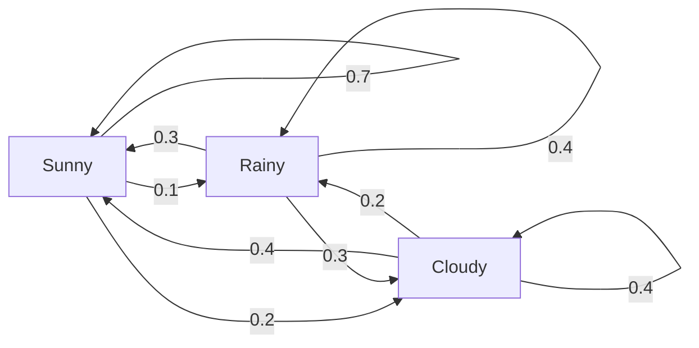
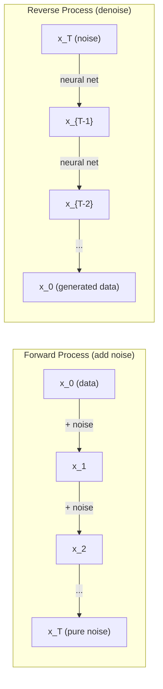

# Procesy stochastyczne

> Losowość ze strukturą. Matematyka stojąca za błądzeniem losowym, łańcuchami Markowa i modelami dyfuzyjnymi.

**Typ:** Nauka
**Język:** Python
**Wymagania wstępne:** Faza 1, Lekcje 06-07 (prawdopodobieństwo, Bayes)
**Czas:** ~75 minut

## Cele nauki

- Symulowanie 1D i 2D błądzeń losowych oraz weryfikacja skalowania sqrt(n) dla przemieszczenia
- Budowa symulatora łańcucha Markowa i obliczanie jego rozkładu stacjonarnego za pomocą dekompozycji na wartości własne
- Implementacja algorytmu Metropolis-Hastings MCMC oraz dynamiki Langevina do próbkowania z rozkładów docelowych
- Połączenie procesu dyfuzji w przód (forward diffusion) z ruchem Browna i wyjaśnienie, jak proces odwrotny generuje dane

## Problem

Wiele systemów AI obejmuje losowość, która zmienia się w czasie. Nie jest to statyczna losowość -- to ustrukturyzowana, sekwencyjna losowość, w której każdy krok zależy od tego, co było wcześniej.

Modele językowe generują tokeny jeden po drugim. Każdy token zależy od poprzedniego kontekstu. Model wyprowadza rozkład prawdopodobieństwa, próbkuje z niego i przechodzi dalej. To jest proces stochastyczny.

Modele dyfuzyjne dodają szum do obrazu krok po kroku, aż stanie się on czystym szumem. Następnie odwracają ten proces, odszumiając krok po kroku, aż wyłoni się nowy obraz. Proces w przód jest łańcuchem Markowa. Proces odwrotny jest wyuczonym łańcuchem Markowa działającym wstecz.

Agenci uczenia ze wzmocnieniem (reinforcement learning) wykonują akcje w środowisku. Każda akcja prowadzi do nowego stanu z pewnym prawdopodobieństwem. Agent stosuje losową politykę w losowym świecie. Całość jest procesem decyzyjnym Markowa.

Próbkowanie MCMC -- podstawa wnioskowania bayesowskiego -- konstruuje łańcuch Markowa, którego rozkład stacjonarny jest rozkładem posterior, z którego chcemy próbkować.

Wszystkie te zagadnienia opierają się na czterech fundamentalnych ideach:
1. Błądzenie losowe -- najprostszy proces stochastyczny
2. Łańcuchy Markowa -- ustrukturyzowana losowość z macierzą przejść
3. Dynamika Langevina -- spadek gradientowy z szumem
4. Metropolis-Hastings -- próbkowanie z dowolnego rozkładu

## Koncepcja

### Błądzenie losowe (Random Walks)

Zaczynamy w pozycji 0. W każdym kroku rzucamy uczciwą monetą. Orzeł: ruch w prawo (+1). Reszka: ruch w lewo (-1).

Po n krokach twoja pozycja jest sumą n losowych wartości +/-1. Oczekiwana pozycja to 0 (błądzenie jest nieobciążone). Ale oczekiwana odległość od początku rośnie jak sqrt(n).

To jest sprzeczne z intuicją. Błądzenie jest sprawiedliwe -- nie ma dryftu w żadnym kierunku. Ale w czasie wędruje coraz dalej od miejsca startu. Odchylenie standardowe po n krokach wynosi sqrt(n).

```
Step 0:  Position = 0
Step 1:  Position = +1 or -1
Step 2:  Position = +2, 0, or -2
...
Step 100: Expected distance from origin ~ 10 (sqrt(100))
Step 10000: Expected distance from origin ~ 100 (sqrt(10000))
```

**W 2D** błądzenie przesuwa się w górę, w dół, w lewo lub w prawo z równym prawdopodobieństwem. Takie samo skalowanie sqrt(n) dotyczy odległości od początku. Ścieżka rysuje wzór przypominający fraktal.

**Dlaczego sqrt(n)?** Każdy krok wynosi +1 lub -1 z równym prawdopodobieństwem. Po n krokach pozycja S_n = X_1 + X_2 + ... + X_n, gdzie każde X_i to +/-1. Wariancja każdego kroku to 1, a kroki są niezależne, więc Var(S_n) = n. Odchylenie standardowe = sqrt(n). Z centralnego twierdzenia granicznego S_n / sqrt(n) zbiega do standardowego rozkładu normalnego.

To skalowanie sqrt(n) pojawia się wszędzie w ML. Szum SGD skaluje się jako 1/sqrt(batch_size). Wymiary embeddingów skalują się jako sqrt(d). Pierwiastek kwadratowy jest sygnaturą niezależnych losowych przyrostów.

**Związek z ruchem Browna.** Weźmy błądzenie losowe o rozmiarze kroku 1/sqrt(n) i n kroków na jednostkę czasu. Gdy n dąży do nieskończoności, błądzenie zbiega do ruchu Browna B(t) -- procesu w czasie ciągłym, w którym B(t) ma rozkład normalny o średniej 0 i wariancji t.

Ruch Browna jest matematycznym fundamentem dyfuzji. Modeluje losowe drgania cząstek w płynie, fluktuacje cen akcji oraz -- co kluczowe -- proces szumu w modelach dyfuzyjnych.

**Ruina hazardzisty (Gambler's ruin).** Losowy wędrowiec zaczynający w pozycji k, z barierami absorbującymi w 0 i N. Jakie jest prawdopodobieństwo osiągnięcia N przed 0? Dla sprawiedliwego błądzenia: P(reach N) = k/N. Jest to zaskakująco proste i elegancie. Łączy się to z teorią martyngałów -- sprawiedliwe błądzenie losowe jest martyngałem (oczekiwana wartość przyszła = wartość bieżąca).

### Łańcuchy Markowa

Łańcuch Markowa to system, który przechodzi między stanami zgodnie z ustalonymi prawdopodobieństwami. Kluczowa właściwość: następny stan zależy tylko od stanu obecnego, nie od historii.

```
P(X_{t+1} = j | X_t = i, X_{t-1} = ...) = P(X_{t+1} = j | X_t = i)
```

To jest własność Markowa. Oznacza ona, że całą dynamikę można opisać za pomocą macierzy przejść P:

```
P[i][j] = probability of going from state i to state j
```

Każdy wiersz P sumuje się do 1 (musisz dokąd przejść).

**Przykład -- pogoda:**

```
States: Sunny (0), Rainy (1), Cloudy (2)

P = [[0.7, 0.1, 0.2],    (if sunny: 70% sunny, 10% rainy, 20% cloudy)
     [0.3, 0.4, 0.3],    (if rainy: 30% sunny, 40% rainy, 30% cloudy)
     [0.4, 0.2, 0.4]]    (if cloudy: 40% sunny, 20% rainy, 40% cloudy)
```

Zacznij w dowolnym stanie. Po wielu przejściach rozkład stanów zbiega do rozkładu stacjonarnego pi, gdzie pi * P = pi. Jest to lewy wektor własny P z wartością własną 1.

Dla łańcucha pogodowego rozkład stacjonarny może wynosić [0.53, 0.18, 0.29] -- w długim okresie jest słonecznie 53% czasu, niezależnie od stanu początkowego.



**Obliczanie rozkładu stacjonarnego.** Istnieją dwa podejścia:

1. **Metoda potęgowa**: pomnóż dowolny rozkład początkowy przez P wielokrotnie. Po wystarczającej liczbie iteracji zbiega.
2. **Metoda wartości własnych**: znajdź lewy wektor własny P z wartością własną 1. Jest to wektor własny P^T z wartością własną 1.

Oba podejścia wymagają, aby łańcuch spełniał warunki zbieżności.

**Warunki zbieżności.** Łańcuch Markowa zbiega do unikalnego rozkładu stacjonarnego, jeśli jest:
- **Nieprzywiedlny (irreducible)**: każdy stan jest osiągalny z każdego innego stanu
- **Aperiodyczny**: łańcuch nie cykluje się z ustalonym okresem

Większość łańcuchów spotykanych w ML spełnia oba warunki.

**Stany absorbujące.** Stan jest absorbujący, jeśli po wejściu w niego nigdy go nie opuszczasz (P[i][i] = 1). Łańcuchy Markowa z absorbcją modelują procesy ze stanami końcowymi -- gra, która się kończy, klient, który odchodzi, sekwencja tokenów, która trafia w token końca tekstu.

**Czas miksowania (mixing time).** Ile kroków potrzeba, aby łańcuch był "bliski" rozkładowi stacjonarnemu? Formalnie -- liczba kroków, po której odległość w całkowitej wariancji od stacjonarności spada poniżej pewnego progu. Szybkie miksowanie = potrzeba mało kroków. Przerwa spektralna (spectral gap) P (1 minus druga największa wartość własna) kontroluje czas miksowania. Większa przerwa = szybsze miksowanie.

### Związek z modelami językowymi

Generowanie tokenów w modelu językowym jest w przybliżeniu procesem Markowa. Mając obecny kontekst, model wyprowadza rozkład nad kolejnym tokenem. Temperatura kontroluje ostrość rozkładu:

```
P(token_i) = exp(logit_i / temperature) / sum(exp(logit_j / temperature))
```

- Temperatura = 1.0: standardowy rozkład
- Temperatura < 1.0: ostrzejszy (bardziej deterministyczny)
- Temperatura > 1.0: bardziej płaski (bardziej losowy)
- Temperatura -> 0: argmax (zachłanny)

Próbkowanie top-k obcina do k tokenów o najwyższym prawdopodobieństwie. Próbkowanie top-p (nucleus) obcina do najmniejszego zbioru tokenów, którego skumulowane prawdopodobieństwo przekracza p. Obie metody modyfikują prawdopodobieństwa przejść Markowa.

### Ruch Browna

Granica w czasie ciągłym błądzenia losowego. Pozycja B(t) ma trzy właściwości:
1. B(0) = 0
2. B(t) - B(s) ma rozkład normalny o średniej 0 i wariancji t - s (dla t > s)
3. Przyrosty na nienakładających się przedziałach są niezależne

Ruch Browna jest ciągły, ale nigdzie nie jest różniczkowalny -- drga na każdej skali. Ścieżka ma wymiar fraktalny 2 na płaszczyźnie.

W symulacji dyskretnej przybliżasz ruch Browna w następujący sposób:

```
B(t + dt) = B(t) + sqrt(dt) * z,    where z ~ N(0, 1)
```

Skalowanie sqrt(dt) jest ważne. Wynika ono z centralnego twierdzenia granicznego zastosowanego do błądzeń losowych.

### Dynamika Langevina

Spadek gradientowy znajduje minimum funkcji. Dynamika Langevina znajduje rozkład prawdopodobieństwa proporcjonalny do exp(-U(x)/T), gdzie U jest funkcją energii, a T jest temperaturą.

```
x_{t+1} = x_t - dt * gradient(U(x_t)) + sqrt(2 * T * dt) * z_t
```

Na cząstkę działają dwie siły:
1. **Siła gradientowa** (-dt * gradient(U)): popycha w stronę niskiej energii (jak spadek gradientowy)
2. **Siła losowa** (sqrt(2*T*dt) * z): popycha w losowych kierunkach (eksploracja)

Przy temperaturze T = 0 jest to czysty spadek gradientowy. Przy wysokiej temperaturze jest to praktycznie błądzenie losowe. Przy odpowiedniej temperaturze cząstka eksploruje krajobraz energii i spędza więcej czasu w obszarach niskiej energii.

**Związek z modelami dyfuzyjnymi.** Proces w przód modelu dyfuzyjnego jest następujący:

```
x_t = sqrt(alpha_t) * x_{t-1} + sqrt(1 - alpha_t) * noise
```

Jest to łańcuch Markowa, który stopniowo miesza dane z szumem. Po wystarczającej liczbie kroków x_T jest czystym szumem gaussowskim.

Proces odwrotny -- przejście od szumu z powrotem do danych -- jest również łańcuchem Markowa, ale jego prawdopodobieństwa przejść są wyuczone przez sieć neuronową. Sieć uczy się przewidywać szum, który został dodany w każdym kroku, a następnie go odejmuje.



### MCMC: Markov Chain Monte Carlo

Czasem trzeba próbkować z rozkładu p(x), który można obliczyć (do stałej), ale z którego nie można próbkować bezpośrednio. Klasycznym przykładem są rozkłady posterior bayesowskie -- znasz prawdopodobieństwo wiarygodności (likelihood) razy prior, ale stała normalizująca jest nieobliczalna.

**Metropolis-Hastings** konstruuje łańcuch Markowa, którego rozkład stacjonarny jest p(x):

1. Zacznij w pewnej pozycji x
2. Zaproponuj nową pozycję x' z rozkładu propozycji Q(x'|x)
3. Oblicz współczynnik akceptacji: a = p(x') * Q(x|x') / (p(x) * Q(x'|x))
4. Zaakceptuj x' z prawdopodobieństwem min(1, a). W przeciwnym razie pozostań w x.
5. Powtórz.

Jeśli Q jest symetryczne (np. Q(x'|x) = Q(x|x') = N(x, sigma^2)), współczynnik upraszcza się do a = p(x') / p(x). Potrzebujesz tylko stosunku prawdopodobieństw -- stała normalizująca się redukuje.

Łańcuch jest zagwarantowany do zbiegania do p(x) pod łagodnymi warunkami. Ale zbieżność może być powolna, jeśli propozycja jest zbyt mała (błądzenie losowe) lub zbyt duża (wysoki odrzut). Dostosowanie propozycji jest sztuką MCMC.

**Dlaczego to działa.** Współczynnik akceptacji zapewnia szczegółową równowagę (detailed balance): prawdopodobieństwo bycia w x i przejścia do x' jest równe prawdopodobieństwu bycia w x' i przejścia do x. Szczegółowa równowaga implikuje, że p(x) jest rozkładem stacjonarnym łańcucha. Tak więc po wystarczającej liczbie kroków próbki pochodzą z p(x).

**Praktyczne uwagi:**
- **Burn-in (rozgrzewka)**: odrzuć pierwsze N próbek. Łańcuch potrzebuje czasu, aby dotrzeć do rozkładu stacjonarnego ze swojego punktu startowego.
- **Thinning (przerzedzanie)**: zachowaj co k-tą próbkę, aby zmniejszyć autokorelację.
- **Wiele łańcuchów**: uruchom kilka łańcuchów z różnych punktów startowych. Jeśli zbiegają do tego samego rozkładu, masz dowód zbieżności.
- **Współczynnik akceptacji**: dla propozycji gaussowskich w d wymiarach optymalny współczynnik akceptacji wynosi około 23% (Roberts & Rosenthal, 2001). Zbyt wysoki oznacza, że łańcuch praktycznie się nie przesuwa. Zbyt niski oznacza, że odrzuca wszystko.

### Procesy stochastyczne w AI

| Proces | Zastosowanie w AI |
|---------|---------------|
| Błądzenie losowe | Eksploracja w RL, embeddingi Node2Vec |
| Łańcuch Markowa | Generowanie tekstu, próbkowanie MCMC |
| Ruch Browna | Modele dyfuzyjne (proces w przód) |
| Dynamika Langevina | Modele generatywne oparte na score, SGLD |
| Proces decyzyjny Markowa | Uczenie ze wzmocnieniem (Reinforcement learning) |
| Metropolis-Hastings | Wnioskowanie bayesowskie, próbkowanie posterior |

## Zbuduj to

### Krok 1: Symulator błądzenia losowego

```python
import numpy as np

def random_walk_1d(n_steps, seed=None):
    rng = np.random.RandomState(seed)
    steps = rng.choice([-1, 1], size=n_steps)
    positions = np.concatenate([[0], np.cumsum(steps)])
    return positions


def random_walk_2d(n_steps, seed=None):
    rng = np.random.RandomState(seed)
    directions = rng.choice(4, size=n_steps)
    dx = np.zeros(n_steps)
    dy = np.zeros(n_steps)
    dx[directions == 0] = 1   # right
    dx[directions == 1] = -1  # left
    dy[directions == 2] = 1   # up
    dy[directions == 3] = -1  # down
    x = np.concatenate([[0], np.cumsum(dx)])
    y = np.concatenate([[0], np.cumsum(dy)])
    return x, y
```

Błądzenie 1D przechowuje sumy skumulowane. Każdy krok to +1 lub -1. Po n krokach pozycja jest sumą. Wariancja rośnie liniowo z n, więc odchylenie standardowe rośnie jak sqrt(n).

### Krok 2: Łańcuch Markowa

```python
class MarkovChain:
    def __init__(self, transition_matrix, state_names=None):
        self.P = np.array(transition_matrix, dtype=float)
        self.n_states = len(self.P)
        self.state_names = state_names or [str(i) for i in range(self.n_states)]

    def step(self, current_state, rng=None):
        if rng is None:
            rng = np.random.RandomState()
        probs = self.P[current_state]
        return rng.choice(self.n_states, p=probs)

    def simulate(self, start_state, n_steps, seed=None):
        rng = np.random.RandomState(seed)
        states = [start_state]
        current = start_state
        for _ in range(n_steps):
            current = self.step(current, rng)
            states.append(current)
        return states

    def stationary_distribution(self):
        eigenvalues, eigenvectors = np.linalg.eig(self.P.T)
        idx = np.argmin(np.abs(eigenvalues - 1.0))
        stationary = np.real(eigenvectors[:, idx])
        stationary = stationary / stationary.sum()
        return np.abs(stationary)
```

Rozkład stacjonarny jest lewym wektorem własnym P z wartością własną 1. Znajdujemy go, obliczając wektory własne P^T (transpozycja zamienia lewe wektory własne na prawe wektory własne).

### Krok 3: Dynamika Langevina

```python
def langevin_dynamics(grad_U, x0, dt, temperature, n_steps, seed=None):
    rng = np.random.RandomState(seed)
    x = np.array(x0, dtype=float)
    trajectory = [x.copy()]
    for _ in range(n_steps):
        noise = rng.randn(*x.shape)
        x = x - dt * grad_U(x) + np.sqrt(2 * temperature * dt) * noise
        trajectory.append(x.copy())
    return np.array(trajectory)
```

Gradient przesuwa x w stronę niskiej energii. Szum zapobiega zablokowaniu. W stanie równowagi rozkład próbek jest proporcjonalny do exp(-U(x)/temperature).

### Krok 4: Metropolis-Hastings

```python
def metropolis_hastings(target_log_prob, proposal_std, x0, n_samples, seed=None):
    rng = np.random.RandomState(seed)
    x = np.array(x0, dtype=float)
    samples = [x.copy()]
    accepted = 0
    for _ in range(n_samples - 1):
        x_proposed = x + rng.randn(*x.shape) * proposal_std
        log_ratio = target_log_prob(x_proposed) - target_log_prob(x)
        if np.log(rng.rand()) < log_ratio:
            x = x_proposed
            accepted += 1
        samples.append(x.copy())
    acceptance_rate = accepted / (n_samples - 1)
    return np.array(samples), acceptance_rate
```

Algorytm proponuje nowy punkt, sprawdza, czy ma wyższe prawdopodobieństwo (lub akceptuje z prawdopodobieństwem proporcjonalnym do współczynnika) i powtarza. Współczynnik akceptacji powinien wynosić około 23-50% dla dobrego miksowania.

## Użyj tego

W praktyce do tych algorytmów używa się sprawdzonych bibliotek. Ale rozumienie mechaniki ma znaczenie dla debugowania i dostosowywania.

```python
import numpy as np

rng = np.random.RandomState(42)
walk = np.cumsum(rng.choice([-1, 1], size=10000))
print(f"Final position: {walk[-1]}")
print(f"Expected distance: {np.sqrt(10000):.1f}")
print(f"Actual distance: {abs(walk[-1])}")
```

### numpy dla macierzy przejść

```python
import numpy as np

P = np.array([[0.7, 0.1, 0.2],
              [0.3, 0.4, 0.3],
              [0.4, 0.2, 0.4]])

distribution = np.array([1.0, 0.0, 0.0])
for _ in range(100):
    distribution = distribution @ P

print(f"Stationary distribution: {np.round(distribution, 4)}")
```

Pomnóż rozkład początkowy przez P wielokrotnie. Po wystarczającej liczbie iteracji zbiega do rozkładu stacjonarnego, niezależnie od miejsca startu. To jest metoda potęgowa do znajdowania dominującego lewego wektora własnego.

### Połączenia z rzeczywistymi frameworkami

- **PyTorch diffusion:** `DDPMScheduler` w Hugging Face `diffusers` implementuje łańcuchy Markowa w przód i odwrotny
- **NumPyro / PyMC:** Używają MCMC (próbnik NUTS, który ulepsza Metropolis-Hastings) do wnioskowania bayesowskiego
- **Gymnasium (RL):** Funkcja step środowiska definiuje proces decyzyjny Markowa

### Weryfikacja zbieżności łańcucha Markowa

```python
import numpy as np

P = np.array([[0.9, 0.1], [0.3, 0.7]])

eigenvalues = np.linalg.eigvals(P)
spectral_gap = 1 - sorted(np.abs(eigenvalues))[-2]
print(f"Eigenvalues: {eigenvalues}")
print(f"Spectral gap: {spectral_gap:.4f}")
print(f"Approximate mixing time: {1/spectral_gap:.1f} steps")
```

Przerwa spektralna mówi, jak szybko łańcuch "zapomina" stan początkowy. Przerwa 0.2 oznacza około 5 kroków do miksowania. Przerwa 0.01 oznacza około 100 kroków. Zawsze sprawdzaj to przed uruchomieniem długich symulacji -- słabo miksujący łańcuch zużywa moc obliczeniową na darmo.

## Zastosuj to

Ta lekcja produkuje:
- `outputs/prompt-stochastic-process-advisor.md` -- prompt, który pomaga zidentyfikować, który framework procesu stochastycznego odpowiada danemu problemowi

## Połączenia

| Koncepcja | Gdzie się pojawia |
|---------|------------------|
| Błądzenie losowe | Embeddingi grafowe Node2Vec, eksploracja w RL |
| Łańcuch Markowa | Generowanie tokenów w LLM, próbkowanie MCMC |
| Ruch Browna | Proces dyfuzji w przód w DDPM, modele oparte na SDE |
| Dynamika Langevina | Modele generatywne oparte na score, stochastyczna dynamika Langevina z gradientem (SGLD) |
| Rozkład stacjonarny | Cel zbieżności MCMC, PageRank |
| Metropolis-Hastings | Próbkowanie posterior bayesowskie, symulowane wyżarzanie (simulated annealing) |
| Temperatura | Próbkowanie LLM, eksploracja Boltzmanna w RL, symulowane wyżarzanie |
| Czas miksowania | Szybkość zbieżności MCMC, analiza przerwy spektralnej |
| Stan absorbujący | Token końca sekwencji, stany terminalne w RL |
| Szczegółowa równowaga (detailed balance) | Gwarancja poprawności dla próbników MCMC |

Modele dyfuzyjne zasługują na szczególną uwagę. DDPM (Ho et al., 2020) definiuje łańcuch Markowa w przód:

```
q(x_t | x_{t-1}) = N(x_t; sqrt(1-beta_t) * x_{t-1}, beta_t * I)
```

gdzie beta_t jest harmonogramem szumu. Po T krokach x_T jest w przybliżeniu N(0, I). Proces odwrotny jest parametryzowany przez sieć neuronową, która przewiduje szum:

```
p_theta(x_{t-1} | x_t) = N(x_{t-1}; mu_theta(x_t, t), sigma_t^2 * I)
```

Każdy krok generacji jest krokiem w wyuczonym łańcuchu Markowa. Zrozumienie łańcuchów Markowa oznacza zrozumienie, jak i dlaczego modele dyfuzyjne generują dane.

SGLD (Stochastic Gradient Langevin Dynamics) łączy spadek gradientowy mini-batch z szumem Langevina. Zamiast obliczać pełny gradient, używasz stochastycznego estymatora i dodajesz skalibrowany szum. Gdy współczynnik uczenia (learning rate) zanika, SGLD przechodzi od optymalizacji do próbkowania -- otrzymujesz przybliżone próbki posterior bayesowskiego za darmo. Jest to jeden z najprostszych sposobów uzyskania oszacowań niepewności z sieci neuronowej.

Kluczowa intuicja łącząca wszystkie te zagadnienia: procesy stochastyczne nie są wyłącznie narzędziami teoretycznymi. Są mechanizmami obliczeniowymi wewnątrz nowoczesnych systemów AI. Kiedy dostosowujesz temperaturę LLM, modyfikujesz łańcuch Markowa. Kiedy trenujesz model dyfuzyjny, uczysz się odwracać proces podobny do ruchu Browna. Kiedy uruchamiasz wnioskowanie bayesowskie, konstruujesz łańcuch, który zbiega do rozkładu posterior.

## Ćwiczenia

1. **Symuluj 1000 błądzeń losowych po 10000 kroków.** Narysuj rozkład pozycji końcowych. Zweryfikuj, że jest on w przybliżeniu gaussowski o średniej 0 i odchyleniu standardowym sqrt(10000) = 100.

2. **Zbuduj generator tekstu wykorzystujący łańcuch Markowa.** Wytrenuj go na małym korpusie: dla każdego słowa zlicz przejścia do następnego słowa. Zbuduj macierz przejść. Generuj nowe zdania, próbkując z łańcucha.

3. **Zaimplementuj symulowane wyżarzanie (simulated annealing)** wykorzystując Metropolis-Hastings. Zacznij od wysokiej temperatury (akceptuj prawie wszystko) i stopniowo schładzaj (akceptuj tylko poprawy). Użyj go do znalezienia minimum funkcji z wieloma minimami lokalnymi.

4. **Porównaj dynamikę Langevina przy różnych temperaturach.** Próbkuj z potencjału dwustudniowego (double-well potential) U(x) = (x^2 - 1)^2. Przy niskiej temperaturze próbki skupiają się w jednej studni. Przy wysokiej temperaturze rozprzestrzeniają się po obu. Znajdź krytyczną temperaturę, przy której łańcuch miksuje się między studniami.

5. **Zaimplementuj proces dyfuzji w przód.** Zacznij od sygnału 1D (np. sinusoidy). Dodaj szum progresywnie w 100 krokach z liniowym harmonogramem szumu. Pokaż, jak sygnał degraduje się do czystego szumu. Następnie zaimplementuj prosty odszumiacz (denoiser), który odwraca ten proces (nawet naiwny, który po prostu odejmuje oszacowany szum).

## Kluczowe pojęcia

| Termin | Co się mówi | Co to faktycznie oznacza |
|------|----------------|----------------------|
| Błądzenie losowe (Random walk) | "Ruch z rzutu monetą" | Proces, w którym pozycja zmienia się o losowe przyrosty w każdym kroku |
| Własność Markowa | "Bez pamięci" | Przyszłość zależy tylko od obecnego stanu, nie od historii |
| Macierz przejść | "Tabela prawdopodobieństw" | P[i][j] = prawdopodobieństwo przejścia ze stanu i do stanu j |
| Rozkład stacjonarny | "Średnia długookresowa" | Rozkład pi, gdzie pi*P = pi -- stan równowagi łańcucha |
| Ruch Browna | "Losowe drganie" | Granica błądzenia losowego w czasie ciągłym, B(t) ~ N(0, t) |
| Dynamika Langevina | "Spadek gradientowy z szumem" | Reguła aktualizacji łącząca deterministyczny gradient i losowe zaburzenie |
| MCMC | "Idąc w stronę celu" | Konstruowanie łańcucha Markowa, którego rozkład stacjonarny jest tym, którego chcesz |
| Metropolis-Hastings | "Proponuj i akceptuj/odrzuć" | Algorytm MCMC, który wykorzystuje współczynniki akceptacji do zapewnienia zbieżności |
| Temperatura | "Pokrętło losowości" | Parametr kontrolujący kompromis między eksploracją i eksploatacją |
| Proces dyfuzji | "Szum na wejściu, szum na wyjściu" | W przód: stopniowo dodaje szum. Odwrotnie: stopniowo go usuwa. Generuje dane. |

## Dalsza lektura

- **Ho, Jain, Abbeel (2020)** -- "Denoising Diffusion Probabilistic Models." Praca DDPM, która zapoczątkowała rewolucję modeli dyfuzyjnych. Jasne wyprowadzenie łańcuchów Markowa w przód i odwrotnego.
- **Song & Ermon (2019)** -- "Generative Modeling by Estimating Gradients of the Data Distribution." Podejście oparte na score, wykorzystujące dynamikę Langevina do próbkowania.
- **Roberts & Rosenthal (2004)** -- "General state space Markov chains and MCMC algorithms." Teoria stojąca za tym, kiedy i dlaczego MCMC działa.
- **Norris (1997)** -- "Markov Chains." Standardowy podręcznik. Omawia zbieżność, rozkłady stacjonarne i czasy trafienia (hitting times).
- **Welling & Teh (2011)** -- "Bayesian Learning via Stochastic Gradient Langevin Dynamics." Łączy SGD z dynamiką Langevina dla skalowalnego wnioskowania bayesowskiego.
