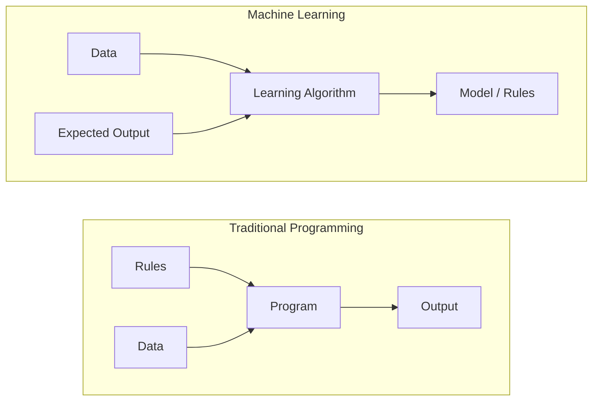
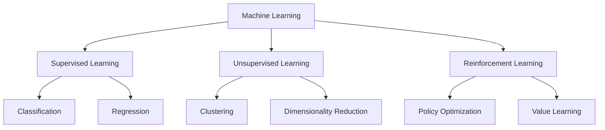
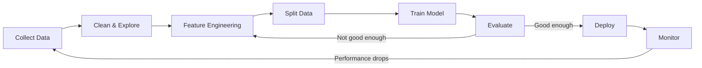
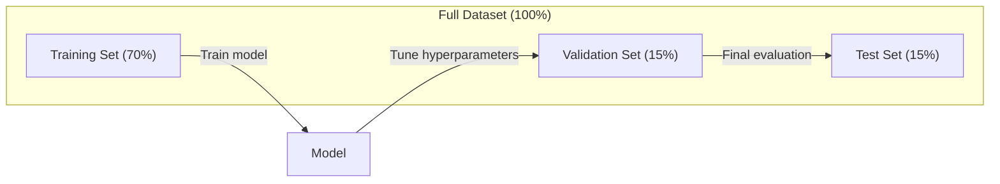
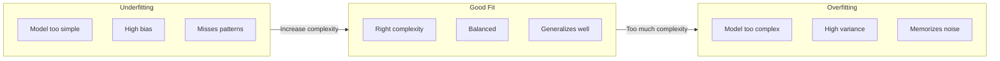
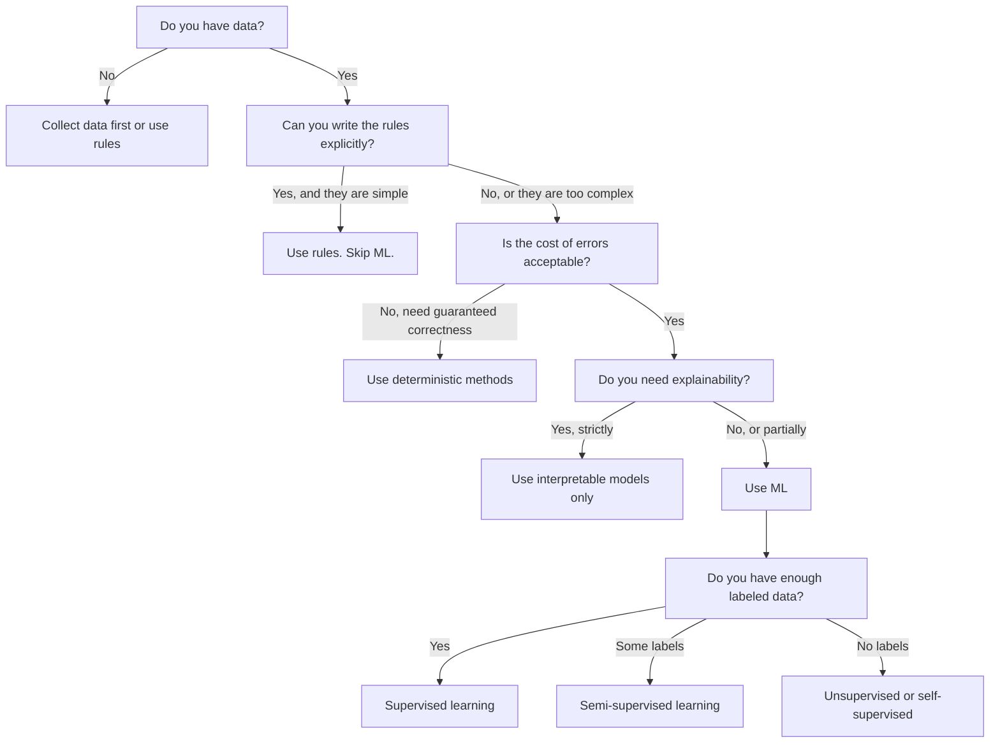

# Czym jest uczenie maszynowe

> Uczenie maszynowe uczy komputery znajdowania wzorców w danych zamiast ręcznego pisania reguł.

**Typ:** Teoria
**Języki:** Python
**Wymagania wstępne:** Faza 1 (Podstawy matematyki)
**Czas trwania:** ~45 minut

## Cele dydaktyczne

- Wyjaśnienie różnicy pomiędzy uczeniem nadzorowanym, nienadzorowanym oraz uczeniem ze wzmocnieniem, a także określenie, który z tych typów ma zastosowanie do danego problemu
- Samodzielna implementacja klasyfikatora najbliższego centroidu i jego ewaluacja w odniesieniu do losowego modelu bazowego
- Odróżnianie zadań klasyfikacji od regresji oraz dobór odpowiedniej funkcji straty dla każdego z nich
- Ocena, czy dany problem biznesowy nadaje się do rozwiązania za pomocą ML, czy też lepiej zastosować reguły deterministyczne

## Problem

Chcesz zbudować filtr spamu. Tradycyjne podejście: usiądź i napisz setki reguł. „Jeśli wiadomość e-mail zawiera słowo „DARMOWE PIENIĄDZE”, oznacz ją jako spam. Jeśli zawiera więcej niż 3 wykrzykniki, oznacz ją jako spam.” Spędzasz tygodnie na pisaniu zasad. Następnie spamerzy zmieniają sformułowania. Twoje zasady łamią się. Piszesz więcej zasad. Cykl nigdy się nie kończy.

Uczenie maszynowe odwraca tę sytuację. Zamiast pisać reguły, dajesz komputerowi tysiące e-maili z etykietami („spam” lub „nie spam”) i pozwalasz mu samodzielnie wymyślić reguły. Komputer znajduje wzorce, o których nigdy byś nie pomyślał. Kiedy spamerzy zmieniają taktykę, zamiast przepisywać kod, szkolisz go na nowych danych.

To przejście od „zasad programowania” do „uczenia się na podstawie danych” jest podstawą uczenia maszynowego. Każdy silnik rekomendacji, asystent głosowy, samochód autonomiczny i model językowy działa w ten sposób.

## Koncepcje

### Uczenie się na podstawie danych, a nie reguł

Tradycyjne programowanie i uczenie maszynowe rozwiązują problemy w przeciwnych kierunkach.



Programowanie tradycyjne: piszesz zasady. Program stosuje je do danych w celu uzyskania wyników.

Uczenie maszynowe: dostarczasz dane i oczekiwane wyniki. Algorytm odkrywa reguły.

„Model”, który wychodzi ze szkolenia, JEST zbiorem reguł zakodowanych jako liczby (wagi, parametry). Uogólnia na podstawie znanych przykładów, aby przewidywać dane, których nigdy nie widział.

### Trzy typy uczenia maszynowego



**Uczenie nadzorowane**: Masz pary wejście-wyjście. Model uczy się mapować dane wejściowe na wyjścia.
- „Oto 10 000 zdjęć oznaczonych jako kot lub pies. Naucz się je rozróżniać.”
- „Oto cechy domu i ceny. Naucz się przewidywać cenę.”

**Uczenie nienadzorowane**: Masz tylko dane wejściowe. Brak etykiet. Model sam znajduje strukturę.
- „Oto historie zakupów klientów 10 000. Znajdź naturalne pogrupowania.”
- „Oto 1000 wymiarowych punktów danych. Zmniejsz do 2 wymiarów, zachowując strukturę.”

**Uczenie ze wzmocnieniem**: Agent podejmuje działania w środowisku i otrzymuje nagrody lub kary. Uczy się strategii (polityki) maksymalizacji całkowitej nagrody.
- „Zagraj w tę grę. +1 za wygraną, -1 za przegraną. Wymyśl strategię.”
- „Kontroluj ramię robota. +1 za podniesienie przedmiotu, -0,01 za każdą zmarnowaną sekundę”.

Większość praktycznych zastosowań wykorzystuje uczenie nadzorowane. Uczenie nienadzorowane jest powszechne w przypadku przetwarzania wstępnego i eksploracji. Uczenie ze wzmocnieniem wspomaga sztuczną inteligencję gier, robotykę i RLHF w modelach językowych.

### Poza Wielką Trójką

Trzy powyższe kategorie są jasne, ale ML w świecie rzeczywistym często zaciera granice.

**Uczenie się częściowo nadzorowane** wykorzystuje mały zestaw oznakowanych danych i duży zestaw danych nieoznaczonych. Możesz mieć 100 oznaczonych obrazów medycznych i 100 000 nieoznaczonych. Techniki obejmują:

- **Propagacja etykiet:** Stwórz wykres łączący podobne punkty danych. Etykiety rozprzestrzeniają się od oznaczonych węzłów do nieoznaczonych sąsiadów poprzez graf.
– **Pseudo-etykietowanie:** trenuj model na danych oznaczonych etykietami, używaj go do przewidywania etykiet dla danych nieoznaczonych etykietami, a następnie ponownie ucz się wszystkiego. Model ładuje własny zestaw treningowy.
- **Regularyzacja spójności:** Model powinien dawać tę samą prognozę dla danych wejściowych i lekko zaburzoną wersję tych danych wejściowych. Działa to nawet bez etykiet.

**Uczenie samonadzorowane** tworzy nadzór na podstawie samych danych. Żadne ludzkie etykiety nie są potrzebne. Model tworzy własne zadanie predykcyjne na podstawie struktury danych.

- **Modelowanie języka maskowanego (BERT):** Ukryj 15% słów w zdaniu, wytrenuj model, aby przewidywał brakujące słowa. „Etykiety” pochodzą z tekstu oryginalnego.
- **Uczenie kontrastowe (SimCLR):** Zrób zdjęcie i utwórz dwie rozszerzone wersje. Naucz model rozpoznawać, że pochodzą z tego samego obrazu, jednocześnie odróżniając go od rozszerzonych wersji innych obrazów.
- **Przewidywanie kolejnego tokenu (GPT):** Wytypuj następne słowo, biorąc pod uwagę wszystkie poprzednie słowa. Każdy dokument tekstowy staje się przykładem szkoleniowym.

Nie są to kategorie odrębne od wielkiej trójki. Są to strategie łączące pomysły nadzorowane i nienadzorowane. Uczenie samonadzorowane jest z definicji nadzorowane (model coś przewiduje), ale etykiety są generowane automatycznie, a nie przez ludzi.

### Klasyfikacja a regresja

Są to dwa główne zadania uczenia nadzorowanego.

| Aspekt | Klasyfikacja | Regresja |
|--------|-------------------|------------|
| Wyjście | Kategorie dyskretne | Liczby ciągłe |
| Przykład | „Czy ten e-mail jest spamem?” | „Jaka będzie cena domu?” |
| Przestrzeń wyjściowa | {kot, pies, ptak} | Dowolna liczba rzeczywista |
| Funkcja straty | Entropia krzyżowa, dokładność | Średni błąd kwadratowy, MAE |
| Decyzja | Granice między klasami | Krzywa pasująca do danych |

Klasyfikacja odpowiada na pytanie: „Jaka kategoria?” Regresja odpowiada na pytanie „ile?”

Niektóre problemy można ująć w dowolny sposób. Przewidywanie, czy akcje pójdą w górę, czy w dół, to klasyfikacja. Przewidywanie dokładnej ceny to regresja.

### Przebieg pracy z systemem uczenia maszynowego

Każdy projekt uczenia maszynowego przebiega według tego samego potoku, niezależnie od algorytmu.



**Zbieraj dane**: Zbieraj surowe dane. Więcej danych prawie zawsze oznacza lepiej, ale jakość jest ważniejsza niż ilość.

**Czyszczenie i eksploracja danych**: zarządzaj brakującymi wartościami, usuwaj duplikaty, wizualizuj rozkłady, wykrywaj anomalie. Ten krok często zajmuje 60–80% całkowitego czasu projektu.

**Inżynieria cech**: Przekształcaj surowe dane w funkcje, z których może korzystać model. Zamień daty na dni tygodnia. Normalizuj kolumny liczbowe. Zakoduj zmienne jakościowe. Dobre funkcje są ważniejsze niż fantazyjne algorytmy.

**Podział danych**: Podziel dane na zbiory szkoleniowe, walidacyjne i testowe. Model szkoli się na danych szkoleniowych, dostraja parametry na danych walidacyjnych i raportuje ostateczną wydajność na danych testowych.

**Trenowanie modelu**: Podaj dane szkoleniowe do algorytmu. Algorytm dostosowuje parametry wewnętrzne, aby zminimalizować funkcję straty.

**Ocena**: Zmierz wydajność na podstawie danych z walidacji/testów. Jeśli wydajność jest nie do zaakceptowania, wróć i wypróbuj inne funkcje, algorytmy lub hiperparametry.

**Wdrożenie**: Wprowadź model do środowiska produkcyjnego, gdzie będzie on dokonywał prognoz na podstawie nowych danych.

**Monitorowanie**: śledzenie wydajności w czasie. Rozkłady danych zmieniają się (dryf danych), a modele ulegają degradacji. Gdy wydajność spadnie, przeprowadź ponowne trenowanie.

### Podział na zbiór treningowy, walidacyjny i testowy

To najważniejsza koncepcja, którą początkujący mylą. Musisz ocenić swój model na danych, których nigdy nie widział podczas uczenia. W przeciwnym razie mierzysz zapamiętywanie, a nie uczenie się.



| Podział | Cel | Kiedy jest używany | Typowy rozmiar |
|-------|--------|-----------|------------|
| Treningowy | Model uczy się na podstawie tych danych | Podczas treningu | 60-80% |
| Walidacyjny | Dostosuj hiperparametry, porównaj modele | Po każdym biegu treningowym | 10-20% |
| Testowy | Ostateczne, obiektywne oszacowanie wyników | Raz, na samym końcu | 10-20% |

Zestaw testowy jest święty. Patrzysz na niego dokładnie raz. Jeśli będziesz stale dostosowywać swój model w oparciu o wyniki testów, efektywnie trenujesz na zestawie testowym, a raportowane liczby są bez znaczenia.

W przypadku małych zbiorów danych użyj k-krotnej walidacji krzyżowej: podziel dane na k części, trenuj na k-1 częściach, zweryfikuj pozostałą część, obróć i uśrednij wyniki.

### Przeuczenie i niedouczenie (Overfitting vs Underfitting)



**Niedouczenie**: Model jest zbyt prosty, aby uchwycić wzorce w danych. Linia prosta próbująca dopasować się do zakrzywionej relacji. Błąd w szkoleniu jest wysoki. Błąd testu jest wysoki.

**Przeuczenie**: Model jest zbyt złożony i zapamiętuje dane treningowe, w tym szum. Falista krzywa, która przechodzi przez każdy punkt treningowy, ale nie sprawdza się w przypadku nowych danych. Błąd szkolenia jest niski. Błąd testu jest wysoki.

**Dobre dopasowanie**: Model rejestruje rzeczywiste wzory bez zapamiętywania szumu. Zarówno błąd uczenia, jak i błąd testu są stosunkowo niskie.

Oznaki przeuczenia:
- Dokładność szkolenia jest znacznie wyższa niż dokładność walidacji
- Model działa dobrze na danych szkoleniowych, ale słabo na nowych danych
- Dodanie większej ilości danych treningowych poprawia wydajność (model zapamiętywał, a nie uczył się)

Rozwiązania dotyczące przeuczenia:
- Uzyskaj więcej danych treningowych
- Zmniejsz złożoność modelu (mniej parametrów, prostsza architektura)
- Regularyzacja (dodaj karę za duże wagi)
- Dropout (losowe zerowanie neuronów podczas treningu)
- Wczesne zatrzymanie (przerwanie treningu, gdy błąd walidacji zaczyna rosnąć)

Rozwiązania dotyczące niedouczenia:
- Użyj bardziej złożonego modelu
- Dodaj więcej cech
- Ogranicz regularyzację
- Trenuj dłużej

### Kompromis obciążenia i wariancji (Bias-Variance Tradeoff)

Oto ramy matematyczne opisujące przeuczenie i niedouczenie.

**Obciążenie**: Błąd wynikający z błędnych założeń modelu. Model liniowy ma duże obciążenie, gdy prawdziwa zależność jest nieliniowa. Wysokie obciążenie prowadzi do niedouczenia.

**Wariancja**: Błąd wynikający z wrażliwości na małe wahania danych treningowych. Model o dużej wariancji daje bardzo różne przewidywania, gdy jest szkolony na różnych podzbiorach danych. Duża wariancja prowadzi do przeuczenia.

| Złożoność modelu | Obciążenie | Wariancja | Wynik |
|----------------------|------|----------|--------|
| Za niska (model liniowy dla danych zakrzywionych) | Wysokie | Niska | Niedouczenie |
| W sam raz | Średnie | Średnia | Dobre uogólnienie |
| Za wysoka (wielomian stopnia 20 na 10 punktów) | Niskie | Wysoka | Przeuczenie |

Błąd całkowity = obciążenie^2 + wariancja + nieredukowalny szum

Nie można zredukować nieredukowalnego szumu (jest to losowość samych danych). Chcesz znaleźć optymalny punkt, w którym obciążenie^2 + wariancja jest zminimalizowana.

### Twierdzenie o braku darmowych obiadów (No Free Lunch Theorem)

Nie ma jednego algorytmu, który działałby najlepiej w przypadku każdego problemu. Algorytm, który dobrze radzi sobie z jedną klasą problemów, będzie słabo radził sobie z inną. Właśnie dlatego analitycy danych wypróbowują wiele algorytmów i porównują wyniki.

W praktyce wybór zależy od:
- Ile masz danych
- Ile jest cech
- Czy zależność jest liniowa czy nieliniowa
- Czy potrzebujesz możliwości interpretacji
- Na ile mocy obliczeniowej możesz sobie pozwolić

### Kiedy NIE używać uczenia maszynowego

ML to potężne narzędzie, ale nie zawsze właściwe. Zanim sięgniesz po dany model, zapytaj, czy faktycznie go potrzebujesz.

**Nie używaj ML, gdy:**

- **Zasady są proste i dobrze zdefiniowane.** Obliczanie podatku, algorytmy sortowania, przeliczanie jednostek. Jeśli potrafisz zapisać logikę w kilku instrukcjach if, model zwiększa złożoność bez żadnych korzyści.
- **Nie masz danych lub masz ich bardzo mało.** ML potrzebuje przykładów, z których może się uczyć. Mając 10 punktów danych, nie można wytrenować niczego znaczącego. Najpierw zbierz dane.
- **Koszt błędu jest katastrofalny i potrzebujesz gwarancji poprawności.** Obliczanie dawek medycznych, kontrola reaktora jądrowego, weryfikacja kryptograficzna. Modele ML są probabilistyczne. Czasem się mylą. Jeśli „czasami źle” jest niedopuszczalne, użyj metod deterministycznych.
- **Tabela przeglądowa lub heurystyka rozwiązuje problem.** Jeśli prosty próg lub tabela obejmuje 99% przypadków, dodanie ML zwiększa koszty utrzymania bez znaczącej poprawy.
- **Nie można wyjaśnić decyzji i wymagane jest jej wyjaśnienie.** Branże regulowane (kredyty, ubezpieczenia, wymiar sprawiedliwości w sprawach karnych) czasami wymagają, aby każda decyzja była w pełni możliwa do wyjaśnienia. Niektóre modele ML można interpretować (regresja liniowa, małe drzewa decyzyjne). Większość nie.
- **Problem zmienia się szybciej, niż możesz się przeszkolić.** Jeśli zasady zmieniają się codziennie, a przekwalifikowanie trwa tydzień, model jest zawsze przestarzały.

Skorzystaj z tego schematu podejmowania decyzji:



## Implementacja

Kod w `code/ml_intro.py` implementuje od podstaw klasyfikator najbliższego centroidu, czyli najprostszy możliwy algorytm ML. Pokazuje podstawową ideę: uczyć się na podstawie danych, a następnie przewidywać na podstawie nowych danych.

### Krok 1: Klasyfikator najbliższego centroidu od podstaw

Klasyfikator najbliższego centroidu oblicza środek (średnią) każdej klasy w danych szkoleniowych. Aby przewidzieć, przypisuje każdy nowy punkt klasie, której środek jest najbliżej.

```python
class NearestCentroid:
    def fit(self, X, y):
        self.classes = np.unique(y)
        self.centroids = np.array([
            X[y == c].mean(axis=0) for c in self.classes
        ])

    def predict(self, X):
        distances = np.array([
            np.sqrt(((X - c) ** 2).sum(axis=1))
            for c in self.centroids
        ])
        return self.classes[distances.argmin(axis=0)]
```

To jest cały algorytm. Fit oblicza dwie średnie. Przewidywanie oblicza odległości. Bez spadku gradientu, bez iteracji, bez hiperparametrów.

### Krok 2: Trenuj na danych syntetycznych

Generujemy zbiór danych klasyfikacyjnych 2D z dwiema klasami, które nieznacznie się pokrywają. Klasyfikator centroidów rysuje liniową granicę decyzyjną pomiędzy ośrodkami klas.

```python
rng = np.random.RandomState(42)
X_class0 = rng.randn(100, 2) + np.array([1.0, 1.0])
X_class1 = rng.randn(100, 2) + np.array([-1.0, -1.0])
X = np.vstack([X_class0, X_class1])
y = np.array([0] * 100 + [1] * 100)
```

### Krok 3: Porównanie z modelem bazowym

Każdy model ML należy porównać z trywialną wartością bazową. Tutaj linia bazowa przewiduje losową klasę. Jeśli Twój model ML nie pokonuje losowego zgadywania, coś jest nie tak.

```python
baseline_preds = rng.choice([0, 1], size=len(y_test))
baseline_acc = np.mean(baseline_preds == y_test)
```

Klasyfikator centroidów powinien uzyskać około 90% + dokładność w tym czystym zbiorze danych. Losowa wartość bazowa wynosi około 50%.

### Dlaczego to ma znaczenie

Klasyfikator najbliższego centroidu jest banalnie prosty. Nie ma hiperparametrów, iteracji ani spadku gradientu. Jednak oddaje podstawowy wzorzec ML:

1. **Naucz się** reprezentacji na podstawie danych szkoleniowych (centroidy)
2. **Przewiduj** nowe dane przy użyciu tej reprezentacji (najbliższa odległość)
3. **Oceń** względem modelu bazowego (losowe zgadywanie)

Każdy algorytm ML, od regresji logistycznej po transformatory, opiera się na tym samym trzyetapowym schemacie. Reprezentacja staje się bardziej złożona, ale przepływ pracy pozostaje ten sam.

### Krok 4: Czego nie może zrobić klasyfikator centroidów

Klasyfikator najbliższego centroidu zakłada, że każda klasa tworzy pojedynczą plamkę. Rysuje liniowe granice decyzji. Nie udaje się, gdy:

- Klasy mają wiele skupień (np. cyfrę „1” można zapisać na kilka różnych sposobów)
- Granica decyzji jest nieliniowa (np. jedna klasa zawija się wokół drugiej)
- Obiekty mają bardzo różne skale (odległość jest zdominowana przez obiekt o największej skali)

Te ograniczenia motywują każdy inny algorytm, którego się nauczysz. K-najbliżsi sąsiedzi obsługują wiele klastrów. Drzewa decyzyjne obsługują granice nieliniowe. Skalowanie cech rozwiązuje problem skali. Każda lekcja opiera się na ograniczeniach poprzedniej.

## Praktyczne zastosowanie

sklearn udostępnia `NearestCentroid` i generatory danych syntetycznych:

```python
from sklearn.neighbors import NearestCentroid
from sklearn.datasets import make_classification
from sklearn.model_selection import train_test_split

X, y = make_classification(
    n_samples=500, n_features=2, n_redundant=0,
    n_clusters_per_class=1, random_state=42
)
X_train, X_test, y_train, y_test = train_test_split(X, y, test_size=0.3)

clf = NearestCentroid()
clf.fit(X_train, y_train)
print(f"Accuracy: {clf.score(X_test, y_test):.3f}")
```

## Wynik lekcji

Ta lekcja generuje `outputs/prompt-ml-problem-framer.md` — monit, który zamienia niejasne problemy biznesowe w konkretne zadania ML. Podaj opis problemu („chcemy zmniejszyć odpływ pracowników” lub „przewiduj popyt na następny kwartał”), a on zidentyfikuje typ uczenia się, zdefiniuje cel prognozy, wylistuje potencjalne cechy, wybierze miernik sukcesu, ustali punkt odniesienia i wskaże pułapki, takie jak wyciek danych lub brak równowagi klas. Użyj go na początku dowolnego projektu ML, aby uniknąć zbudowania niewłaściwej rzeczy.

## Kluczowe pojęcia

| Termin | Co ludzie mówią | Co to właściwie oznacza |
|------|----------------|----------------------|
| Model | „AI” | Funkcja matematyczna z możliwymi do nauczenia się parametrami, która odwzorowuje wejścia na wyjścia |
| Trenowanie | „Nauczanie sztucznej inteligencji” | Uruchamianie algorytmu optymalizacji w celu dostosowania parametrów modelu, aby przewidywania odpowiadały znanym wynikom |
| Cecha | „Kolumna wejściowa” | Mierzalna właściwość danych wykorzystywana przez model do prognozowania |
| Etykieta | „Odpowiedź” | Znane dane wyjściowe dla przykładu szkoleniowego, użyte do obliczenia sygnału błędu |
| Hiperparametr | „Ustawienie, które możesz dostosować” | Parametr ustawiony przed treningiem kontrolujący proces uczenia się (szybkość uczenia się, liczba warstw) |
| Funkcja straty | „Jak błędny jest model” | Funkcja mierząca różnicę między przewidywanymi a rzeczywistymi wynikami, którą uczenie stara się zminimalizować |
| Przeuczenie | „Zapamiętał test” | Model nauczył się szumu specyficznego dla treningu zamiast ogólnych wzorców, więc nie radzi sobie z nowymi danymi |
| Niedouczenie | „Niczego się nie nauczyło” | Model jest zbyt prosty, aby uchwycić rzeczywiste wzorce w danych |
| Uogólnienie | „Działa na nowych danych” | Zdolność modelu do dokonywania dokładnych przewidywań na podstawie danych, na których nie był trenowany |
| Walidacja krzyżowa | „Testowanie na różnych fragmentach” | Wielokrotne dzielenie danych na części treningowe/testowe i uśrednianie wyników, dając bardziej wiarygodne oszacowanie wydajności |
| Regularyzacja | „Utrzymywanie małych wag” | Dodanie warunku kary do funkcji straty, która zniechęca do stosowania zbyt skomplikowanych modeli |
| Dryf danych | „Świat się zmienił” | Rozkład statystyczny napływających danych zmienia się w czasie, pogarszając wydajność modelu |

## Ćwiczenia

1. Weź dowolny zbiór danych (np. Iris, Titanic). Podziel to 70/15/15 na trening/walidację/test. Wyjaśnij, dlaczego nie należy dostrajać hiperparametrów na zestawie testowym.
2. Wymień trzy problemy występujące w świecie rzeczywistym. Dla każdego z nich określ, czy jest to klasyfikacja, regresja czy grupowanie oraz czy jest nadzorowany, czy nienadzorowany.
3. Model uzyskuje 99% dokładności w przypadku danych szkoleniowych i 60% w przypadku danych testowych. Zdiagnozuj problem i wypisz trzy rzeczy, które chciałbyś spróbować naprawić.

## Dodatkowe materiały

- [Wprowadzenie do uczenia się statystycznego](https://www.statlearning.com/) - bezpłatny podręcznik obejmujący wszystkie klasyczne metody ML z praktycznymi przykładami
- [Kurs awaryjny Google Machine Learning](https://developers.google.com/machine-learning/crash-course) - zwięzłe wizualne wprowadzenie do koncepcji ML
- [Podręcznik użytkownika Scikit-learn](https://scikit-learn.org/stable/user_guide.html) - praktyczne informacje dotyczące implementacji ML w Pythonie
