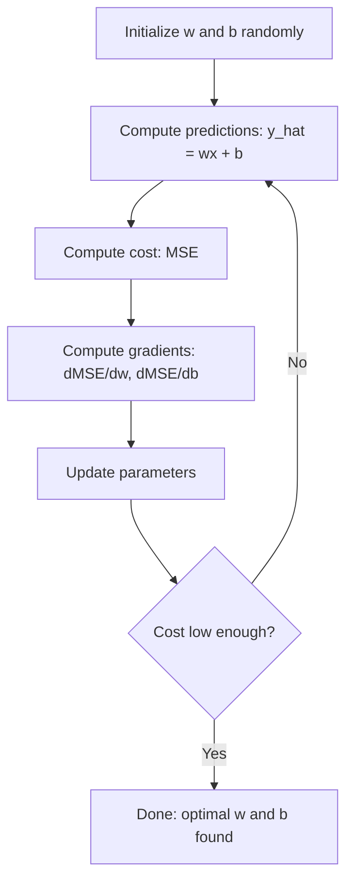

# Regresja liniowa

> Regresja liniowa rysuje najlepszą linię prostą przez dane. To „witaj świecie” uczenia maszynowego.

**Typ:** Kompilacja
**Języki:** Python
**Wymagania wstępne:** Faza 1 (algebra liniowa, rachunek różniczkowy, optymalizacja), faza 2, lekcja 1
**Czas:** ~90 minut

## Cele nauczania

- Wyprowadź reguły aktualizacji opadania gradientu dla błędu średniokwadratowego i zaimplementuj regresję liniową od podstaw
- Porównaj spadek gradientu i równanie normalne pod względem złożoności obliczeniowej i kiedy należy je zastosować
- Zbuduj model wielokrotnej regresji liniowej ze standaryzacją cech i zinterpretuj poznane wagi
- Wyjaśnij, w jaki sposób regresja Ridge'a (regularyzacja L2) zapobiega nadmiernemu dopasowaniu poprzez karanie dużych wag

## Problem

Masz dane: rozmiary domów i ich ceny sprzedaży. Chcesz przewidzieć cenę nowego domu, biorąc pod uwagę jego wielkość. Można to zobaczyć na wykresie punktowym, ale potrzebna jest formuła. Potrzebujesz linii, która najlepiej pasuje do danych, abyś mógł podłączyć dowolny rozmiar i uzyskać prognozę ceny.

Regresja liniowa daje tę linię. Co ważniejsze, wprowadza całą pętlę uczenia ML: zdefiniuj model, zdefiniuj funkcję kosztu, zoptymalizuj parametry. Każdy algorytm ML ma ten sam wzór. Opanuj go tutaj w najprostszym przypadku, a rozpoznasz go wszędzie.

Nie dotyczy to tylko prostych problemów. Regresja liniowa jest wykorzystywana w systemach produkcyjnych do prognozowania popytu, analizy testów A/B, modelowania finansowego oraz jako punkt odniesienia dla każdego zadania regresji.

## Koncepcja

### Modelka

Regresja liniowa zakłada liniową zależność pomiędzy danymi wejściowymi (x) i wynikami (y):

```
y = wx + b
```

- `w` (waga/nachylenie): o ile zmienia się y, gdy x wzrasta o 1
- `b` (odchylenie/przecięcie): wartość y, gdy x = 0

W przypadku wielu wejść (funkcji) obejmuje to:

```
y = w1*x1 + w2*x2 + ... + wn*xn + b
```

Lub w formie wektorowej: `y = w^T * x + b`

Cel: znaleźć wartości w i b, które sprawiają, że przewidywane y jest jak najbardziej zbliżone do rzeczywistego y we wszystkich przykładach szkoleniowych.

### Funkcja kosztu (średni błąd kwadratowy)

Jak zmierzyć „jak najbliżej”? Potrzebujesz jednej liczby, która odzwierciedli, jak błędne są Twoje przewidywania. Najczęstszym wyborem jest błąd średniokwadratowy (MSE):

```
MSE = (1/n) * sum((y_predicted - y_actual)^2)
```

Dlaczego do kwadratu? Dwa powody. Po pierwsze, karze większe błędy niż małe błędy (błąd 10 jest 100 razy gorszy niż błąd 1, a nie 10x). Po drugie, funkcja kwadratowa jest gładka i różniczkowalna wszędzie, co sprawia, że ​​optymalizacja jest prosta.

Funkcja kosztu tworzy powierzchnię. Dla pojedynczego ciężaru w i odchylenia b powierzchnia MSE wygląda jak miska (wypukła paraboloida). Dno miski to miejsce, w którym MSE jest zminimalizowane. Trening oznacza znalezienie tego dna.

### Zejście gradientowe

Zejście gradientowe pozwala znaleźć dno miski, schodząc po schodach.



Gradienty informują o dwóch rzeczach: w jakim kierunku przesunąć każdy parametr i o ile.

Dla MSE z y_hat = wx + b:

```
dMSE/dw = (2/n) * sum((y_hat - y) * x)
dMSE/db = (2/n) * sum(y_hat - y)
```

Zasada aktualizacji:

```
w = w - learning_rate * dMSE/dw
b = b - learning_rate * dMSE/db
```

Szybkość uczenia się kontroluje wielkość kroku. Za duży: przekraczasz minimum i rozchodzisz się. Za mały: szkolenie trwa wiecznie. Typowe wartości początkowe: 0,01, 0,001 lub 0,0001.

### Równanie normalne (rozwiązanie w formie zamkniętej)

W szczególności w przypadku regresji liniowej istnieje bezpośredni wzór, który podaje optymalne wagi bez żadnej iteracji:

```
w = (X^T * X)^(-1) * X^T * y
```

To odwraca macierz, aby rozwiązać w w jednym kroku. Działa doskonale w przypadku małych zbiorów danych. W przypadku dużych zbiorów danych (miliony wierszy lub tysiące obiektów) preferowane jest opadanie gradientowe, ponieważ inwersja macierzy wynosi O(n^3) liczby obiektów.

### Wielokrotna regresja liniowa

Dzięki wielu funkcjom model staje się:

```
y = w1*x1 + w2*x2 + ... + wn*xn + b
```

Wszystko działa tak samo: MSE to funkcja kosztu, gradient opadania aktualizuje wszystkie wagi jednocześnie. Jedyna różnica polega na tym, że zamiast linii dopasowujesz hiperpłaszczyznę.

Skalowanie funkcji ma tutaj znaczenie. Jeśli jedna cecha mieści się w zakresie od 0 do 1, a inna w zakresie od 0 do 1 000 000, opadanie gradientu będzie utrudnione, ponieważ powierzchnia kosztu ulegnie wydłużeniu. Standaryzuj cechy (odejmij średnią, podziel przez odchylenie standardowe) przed szkoleniem.

### Regresja wielomianowa

A co jeśli zależność nie jest liniowa? Nadal możesz używać regresji liniowej, tworząc cechy wielomianowe:

```
y = w1*x + w2*x^2 + w3*x^3 + b
```

Jest to nadal regresja „liniowa”, ponieważ model ma liniowe wagi (w1, w2, w3). Po prostu używasz nieliniowych cech x.

Wielomiany wyższego stopnia mogą pasować do bardziej złożonych krzywych, ale wiążą się z ryzykiem nadmiernego dopasowania. Wielomian stopnia 10 przejdzie przez każdy punkt 10-punktowego zbioru danych, ale będzie słabo przewidywał na podstawie nowych danych.

### Wynik R-kwadrat

MSE powie ci, jak bardzo się mylisz, ale liczba zależy od skali y. R-kwadrat (R^2) daje miarę niezależną od skali:

```
R^2 = 1 - (sum of squared residuals) / (sum of squared deviations from mean)
    = 1 - SS_res / SS_tot
```

- R^2 = 1,0: doskonałe przewidywania
- R^2 = 0,0: model nie jest lepszy od przewidywania średniej za każdym razem
- R^2 < 0,0: model jest gorszy od przewidywania średniej

### Podgląd regularyzacji (regresja grzbietu)

Jeśli masz wiele cech, model może zostać przeuczony poprzez przypisanie mu dużych wag. Regresja grzbietu (regularyzacja L2) dodaje karę:

```
Cost = MSE + lambda * sum(w_i^2)
```

Termin kary zniechęca do dużych ciężarów. Hiperparametr lambda kontroluje kompromis: wyższa lambda oznacza mniejsze wagi i większą regularyzację. Omówimy to szczegółowo w późniejszej lekcji. Na razie wiedz, że istnieje i dlaczego pomaga.

## Zbuduj to

### Krok 1: Wygeneruj przykładowe dane

```python
import random
import math

random.seed(42)

TRUE_W = 3.0
TRUE_B = 7.0
N_SAMPLES = 100

X = [random.uniform(0, 10) for _ in range(N_SAMPLES)]
y = [TRUE_W * x + TRUE_B + random.gauss(0, 2.0) for x in X]

print(f"Generated {N_SAMPLES} samples")
print(f"True relationship: y = {TRUE_W}x + {TRUE_B} (+ noise)")
print(f"First 5 points: {[(round(X[i], 2), round(y[i], 2)) for i in range(5)]}")
```

### Krok 2: Regresja liniowa od podstaw z opadaniem gradientowym

```python
class LinearRegression:
    def __init__(self, learning_rate=0.01):
        self.w = 0.0
        self.b = 0.0
        self.lr = learning_rate
        self.cost_history = []

    def predict(self, X):
        return [self.w * x + self.b for x in X]

    def compute_cost(self, X, y):
        predictions = self.predict(X)
        n = len(y)
        cost = sum((pred - actual) ** 2 for pred, actual in zip(predictions, y)) / n
        return cost

    def compute_gradients(self, X, y):
        predictions = self.predict(X)
        n = len(y)
        dw = (2 / n) * sum((pred - actual) * x for pred, actual, x in zip(predictions, y, X))
        db = (2 / n) * sum(pred - actual for pred, actual in zip(predictions, y))
        return dw, db

    def fit(self, X, y, epochs=1000, print_every=200):
        for epoch in range(epochs):
            dw, db = self.compute_gradients(X, y)
            self.w -= self.lr * dw
            self.b -= self.lr * db
            cost = self.compute_cost(X, y)
            self.cost_history.append(cost)
            if epoch % print_every == 0:
                print(f"  Epoch {epoch:4d} | Cost: {cost:.4f} | w: {self.w:.4f} | b: {self.b:.4f}")
        return self

    def r_squared(self, X, y):
        predictions = self.predict(X)
        y_mean = sum(y) / len(y)
        ss_res = sum((actual - pred) ** 2 for actual, pred in zip(y, predictions))
        ss_tot = sum((actual - y_mean) ** 2 for actual in y)
        return 1 - (ss_res / ss_tot)

print("=== Training Linear Regression (Gradient Descent) ===")
model = LinearRegression(learning_rate=0.005)
model.fit(X, y, epochs=1000, print_every=200)
print(f"\nLearned: y = {model.w:.4f}x + {model.b:.4f}")
print(f"True:    y = {TRUE_W}x + {TRUE_B}")
print(f"R-squared: {model.r_squared(X, y):.4f}")
```

### Krok 3: Równanie normalne (rozwiązanie w formie zamkniętej)

```python
class LinearRegressionNormal:
    def __init__(self):
        self.w = 0.0
        self.b = 0.0

    def fit(self, X, y):
        n = len(X)
        x_mean = sum(X) / n
        y_mean = sum(y) / n
        numerator = sum((X[i] - x_mean) * (y[i] - y_mean) for i in range(n))
        denominator = sum((X[i] - x_mean) ** 2 for i in range(n))
        self.w = numerator / denominator
        self.b = y_mean - self.w * x_mean
        return self

    def predict(self, X):
        return [self.w * x + self.b for x in X]

    def r_squared(self, X, y):
        predictions = self.predict(X)
        y_mean = sum(y) / len(y)
        ss_res = sum((actual - pred) ** 2 for actual, pred in zip(y, predictions))
        ss_tot = sum((actual - y_mean) ** 2 for actual in y)
        return 1 - (ss_res / ss_tot)

print("\n=== Normal Equation (Closed-Form) ===")
model_normal = LinearRegressionNormal()
model_normal.fit(X, y)
print(f"Learned: y = {model_normal.w:.4f}x + {model_normal.b:.4f}")
print(f"R-squared: {model_normal.r_squared(X, y):.4f}")
```

### Krok 4: Wielokrotna regresja liniowa

```python
class MultipleLinearRegression:
    def __init__(self, n_features, learning_rate=0.01):
        self.weights = [0.0] * n_features
        self.bias = 0.0
        self.lr = learning_rate
        self.cost_history = []

    def predict_single(self, x):
        return sum(w * xi for w, xi in zip(self.weights, x)) + self.bias

    def predict(self, X):
        return [self.predict_single(x) for x in X]

    def compute_cost(self, X, y):
        predictions = self.predict(X)
        n = len(y)
        return sum((pred - actual) ** 2 for pred, actual in zip(predictions, y)) / n

    def fit(self, X, y, epochs=1000, print_every=200):
        n = len(y)
        n_features = len(X[0])
        for epoch in range(epochs):
            predictions = self.predict(X)
            errors = [pred - actual for pred, actual in zip(predictions, y)]
            for j in range(n_features):
                grad = (2 / n) * sum(errors[i] * X[i][j] for i in range(n))
                self.weights[j] -= self.lr * grad
            grad_b = (2 / n) * sum(errors)
            self.bias -= self.lr * grad_b
            cost = self.compute_cost(X, y)
            self.cost_history.append(cost)
            if epoch % print_every == 0:
                print(f"  Epoch {epoch:4d} | Cost: {cost:.4f}")
        return self

    def r_squared(self, X, y):
        predictions = self.predict(X)
        y_mean = sum(y) / len(y)
        ss_res = sum((actual - pred) ** 2 for actual, pred in zip(y, predictions))
        ss_tot = sum((actual - y_mean) ** 2 for actual in y)
        return 1 - (ss_res / ss_tot)

random.seed(42)
N = 100
X_multi = []
y_multi = []
for _ in range(N):
    size = random.uniform(500, 3000)
    bedrooms = random.randint(1, 5)
    age = random.uniform(0, 50)
    price = 50 * size + 10000 * bedrooms - 1000 * age + 50000 + random.gauss(0, 20000)
    X_multi.append([size, bedrooms, age])
    y_multi.append(price)

def standardize(X):
    n_features = len(X[0])
    means = [sum(X[i][j] for i in range(len(X))) / len(X) for j in range(n_features)]
    stds = []
    for j in range(n_features):
        variance = sum((X[i][j] - means[j]) ** 2 for i in range(len(X))) / len(X)
        stds.append(variance ** 0.5)
    X_scaled = []
    for i in range(len(X)):
        row = [(X[i][j] - means[j]) / stds[j] if stds[j] > 0 else 0 for j in range(n_features)]
        X_scaled.append(row)
    return X_scaled, means, stds

y_mean_val = sum(y_multi) / len(y_multi)
y_std_val = (sum((yi - y_mean_val) ** 2 for yi in y_multi) / len(y_multi)) ** 0.5
y_scaled = [(yi - y_mean_val) / y_std_val for yi in y_multi]

X_scaled, x_means, x_stds = standardize(X_multi)

print("\n=== Multiple Linear Regression (3 features) ===")
print("Features: house size, bedrooms, age")
multi_model = MultipleLinearRegression(n_features=3, learning_rate=0.01)
multi_model.fit(X_scaled, y_scaled, epochs=1000, print_every=200)

print(f"\nWeights (standardized): {[round(w, 4) for w in multi_model.weights]}")
print(f"Bias (standardized): {multi_model.bias:.4f}")
print(f"R-squared: {multi_model.r_squared(X_scaled, y_scaled):.4f}")
```

### Krok 5: Regresja wielomianowa

```python
class PolynomialRegression:
    def __init__(self, degree, learning_rate=0.01):
        self.degree = degree
        self.weights = [0.0] * degree
        self.bias = 0.0
        self.lr = learning_rate

    def make_features(self, X):
        return [[x ** (d + 1) for d in range(self.degree)] for x in X]

    def predict(self, X):
        features = self.make_features(X)
        return [sum(w * f for w, f in zip(self.weights, row)) + self.bias for row in features]

    def fit(self, X, y, epochs=1000, print_every=200):
        features = self.make_features(X)
        n = len(y)
        for epoch in range(epochs):
            predictions = [sum(w * f for w, f in zip(self.weights, row)) + self.bias for row in features]
            errors = [pred - actual for pred, actual in zip(predictions, y)]
            for j in range(self.degree):
                grad = (2 / n) * sum(errors[i] * features[i][j] for i in range(n))
                self.weights[j] -= self.lr * grad
            grad_b = (2 / n) * sum(errors)
            self.bias -= self.lr * grad_b
            if epoch % print_every == 0:
                cost = sum(e ** 2 for e in errors) / n
                print(f"  Epoch {epoch:4d} | Cost: {cost:.6f}")
        return self

    def r_squared(self, X, y):
        predictions = self.predict(X)
        y_mean = sum(y) / len(y)
        ss_res = sum((actual - pred) ** 2 for actual, pred in zip(y, predictions))
        ss_tot = sum((actual - y_mean) ** 2 for actual in y)
        return 1 - (ss_res / ss_tot)

random.seed(42)
X_poly = [x / 10.0 for x in range(0, 50)]
y_poly = [0.5 * x ** 2 - 2 * x + 3 + random.gauss(0, 1.0) for x in X_poly]

x_max = max(abs(x) for x in X_poly)
X_poly_norm = [x / x_max for x in X_poly]
y_poly_mean = sum(y_poly) / len(y_poly)
y_poly_std = (sum((yi - y_poly_mean) ** 2 for yi in y_poly) / len(y_poly)) ** 0.5
y_poly_norm = [(yi - y_poly_mean) / y_poly_std for yi in y_poly]

print("\n=== Polynomial Regression (degree 2 vs degree 5) ===")
print("True relationship: y = 0.5x^2 - 2x + 3")

print("\nDegree 2:")
poly2 = PolynomialRegression(degree=2, learning_rate=0.1)
poly2.fit(X_poly_norm, y_poly_norm, epochs=2000, print_every=500)
print(f"  R-squared: {poly2.r_squared(X_poly_norm, y_poly_norm):.4f}")

print("\nDegree 5:")
poly5 = PolynomialRegression(degree=5, learning_rate=0.1)
poly5.fit(X_poly_norm, y_poly_norm, epochs=2000, print_every=500)
print(f"  R-squared: {poly5.r_squared(X_poly_norm, y_poly_norm):.4f}")

print("\nDegree 2 fits the true curve well. Degree 5 fits training data slightly better")
print("but risks overfitting on new data.")
```

### Krok 6: Regresja grzbietu (regularyzacja L2)

```python
class RidgeRegression:
    def __init__(self, n_features, learning_rate=0.01, alpha=1.0):
        self.weights = [0.0] * n_features
        self.bias = 0.0
        self.lr = learning_rate
        self.alpha = alpha

    def predict_single(self, x):
        return sum(w * xi for w, xi in zip(self.weights, x)) + self.bias

    def predict(self, X):
        return [self.predict_single(x) for x in X]

    def fit(self, X, y, epochs=1000, print_every=200):
        n = len(y)
        n_features = len(X[0])
        for epoch in range(epochs):
            predictions = self.predict(X)
            errors = [pred - actual for pred, actual in zip(predictions, y)]
            mse = sum(e ** 2 for e in errors) / n
            reg_term = self.alpha * sum(w ** 2 for w in self.weights)
            cost = mse + reg_term
            for j in range(n_features):
                grad = (2 / n) * sum(errors[i] * X[i][j] for i in range(n))
                grad += 2 * self.alpha * self.weights[j]
                self.weights[j] -= self.lr * grad
            grad_b = (2 / n) * sum(errors)
            self.bias -= self.lr * grad_b
            if epoch % print_every == 0:
                print(f"  Epoch {epoch:4d} | Cost: {cost:.4f} | L2 penalty: {reg_term:.4f}")
        return self

print("\n=== Ridge Regression (L2 Regularization) ===")
print("Same data as multiple regression, with alpha=0.1")
ridge = RidgeRegression(n_features=3, learning_rate=0.01, alpha=0.1)
ridge.fit(X_scaled, y_scaled, epochs=1000, print_every=200)
print(f"\nRidge weights: {[round(w, 4) for w in ridge.weights]}")
print(f"Plain weights: {[round(w, 4) for w in multi_model.weights]}")
print("Ridge weights are smaller (shrunk toward zero) due to the L2 penalty.")
```

## Użyj tego

Teraz to samo z scikit-learn, czyli tym, czego faktycznie będziesz używać w produkcji.

```python
from sklearn.linear_model import LinearRegression as SklearnLR
from sklearn.linear_model import Ridge
from sklearn.preprocessing import PolynomialFeatures, StandardScaler
from sklearn.model_selection import train_test_split
from sklearn.metrics import mean_squared_error, r2_score
import numpy as np

np.random.seed(42)
X_sk = np.random.uniform(0, 10, (100, 1))
y_sk = 3.0 * X_sk.squeeze() + 7.0 + np.random.normal(0, 2.0, 100)

X_train, X_test, y_train, y_test = train_test_split(X_sk, y_sk, test_size=0.2, random_state=42)

lr = SklearnLR()
lr.fit(X_train, y_train)
y_pred = lr.predict(X_test)

print("=== Scikit-learn Linear Regression ===")
print(f"Coefficient (w): {lr.coef_[0]:.4f}")
print(f"Intercept (b): {lr.intercept_:.4f}")
print(f"R-squared (test): {r2_score(y_test, y_pred):.4f}")
print(f"MSE (test): {mean_squared_error(y_test, y_pred):.4f}")

poly = PolynomialFeatures(degree=2, include_bias=False)
X_poly_sk = poly.fit_transform(X_train)
X_poly_test = poly.transform(X_test)

lr_poly = SklearnLR()
lr_poly.fit(X_poly_sk, y_train)
print(f"\nPolynomial degree 2 R-squared: {r2_score(y_test, lr_poly.predict(X_poly_test)):.4f}")

scaler = StandardScaler()
X_train_scaled = scaler.fit_transform(X_train)
X_test_scaled = scaler.transform(X_test)

ridge = Ridge(alpha=1.0)
ridge.fit(X_train_scaled, y_train)
print(f"Ridge R-squared: {r2_score(y_test, ridge.predict(X_test_scaled)):.4f}")
print(f"Ridge coefficient: {ridge.coef_[0]:.4f}")
```

Twoja implementacja od podstaw i nauka scikit dają takie same wyniki. Różnica: scikit-learn obsługuje przypadki Edge, stabilność numeryczną i optymalizację wydajności. Użyj biblioteki do produkcji. Użyj wersji od podstaw, aby zrozumieć, co się dzieje.

## Wyślij to

Ta lekcja daje:
- `outputs/skill-regression.md` - umiejętność wyboru odpowiedniego podejścia regresyjnego w zależności od problemu

## Ćwiczenia

1. Zaimplementuj opadanie w gradiencie wsadowym, opadanie w gradiencie stochastycznym (SGD) i opadanie w gradiencie mini-wsadowym. Porównaj prędkość konwergencji w tym samym zestawie danych. Które zbiega się najszybciej? Która krzywa kosztów jest najłagodniejsza?
2. Wygeneruj dane z funkcji sześciennej (y = ax^3 + bx^2 + cx + d + szum). Dopasuj wielomiany stopnia 1, 3 i 10. Porównaj trenowanie R^2 i testowanie R^2. W jakim stopniu nadmierne dopasowanie staje się oczywiste?
3. Zaimplementuj regresję Lasso (regularyzacja L1: kara = alfa * suma(|w_i|)). Trenuj na wielofunkcyjnych danych mieszkaniowych. Porównaj, które ciężary spadają do zera z Ridgem. Dlaczego L1 generuje rzadkie rozwiązania, a L2 nie?

## Kluczowe terminy

| Termin | Co ludzie mówią | Co to właściwie oznacza |
|------|----------------|----------------------|
| Regresja liniowa | „Narysuj linię poprzez dane” | Znajdź wagę w i odchylenie b, które minimalizują sumę kwadratów różnic między wx+b i rzeczywistymi wartościami y |
| Funkcja kosztu | „Jak zły jest ten model” | Funkcja odwzorowująca parametry modelu na pojedynczą liczbę mierzącą błąd przewidywania, którego optymalizacja minimalizuje |
| Średni błąd kwadratowy | „Średnia kwadratów błędów” | (1/n) * suma (przewidywana - rzeczywista)^2, karająca za duże błędy nieproporcjonalnie |
| Zejście gradientowe | „Idź w dół” | Iteracyjnie dopasowuj parametry w kierunku zmniejszającym funkcję kosztu, używając pochodnych cząstkowych |
| Szybkość uczenia się | „Rozmiar kroku” | Skalar kontrolujący zmianę parametrów na krok opadania gradientu |
| Równanie normalne | „Rozwiąż to bezpośrednio” | Rozwiązanie w formie zamkniętej w = (X^T X)^-1 X^T y dające optymalne wagi bez iteracji |
| R-kwadrat | „Jak dobre jest dopasowanie” | Część wariancji y wyjaśniona przez model, w zakresie od ujemnej nieskończoności do 1,0 |
| Skalowanie funkcji | „Spraw, aby funkcje były porównywalne” | Przekształcanie cech w podobne zakresy (np. średnią zerową, wariancję jednostkową), aby opadanie gradientu było szybsze |
| Regularyzacja | „Karaj złożoność” | Dodanie członu do funkcji kosztu, który zmniejsza ciężary, zapobiegając nadmiernemu dopasowaniu |
| Regresja grzbietu | „Regularyzacja L2” | Regresja liniowa z karą lambda * sum(w_i^2) dodana do MSE |
| Regresja wielomianowa | „Dopasowywanie krzywych za pomocą matematyki liniowej” | Regresja liniowa cech wielomianowych (x, x^2, x^3, ...), nadal liniowa w wagach |
| Nadmierne dopasowanie | „Zapamiętywanie danych treningowych” | Używanie modelu tak złożonego, że pasuje do danych szkoleniowych i zawodzi w przypadku nowych danych |

## Dalsze czytanie

- [Wprowadzenie do uczenia się statystycznego (ISLR)](https://www.statlearning.com/) - bezpłatny plik PDF, rozdziały 3 i 6 omawiają regresję liniową i regularyzację z praktycznymi przykładami języka R
– [Elementy uczenia się statystycznego (ESL)](https://hastie.su.domains/ElemStatLearn/) – darmowy plik PDF, bardziej matematyczny towarzysz ISLR z głębszym omówieniem grzbietu i lassa
– [Stanford CS229 Notatki z wykładów na temat regresji liniowej](https://cs229.stanford.edu/main_notes.pdf) – Notatki Andrew Ng wyprowadzające równanie normalne i opadanie gradientu z pierwszych zasad
- [dokumentacja scikit-learn LinearRegression](https://scikit-learn.org/stable/modules/linear_model.html) -- praktyczne informacje o LinearRegression, Ridge, Lasso i ElasticNet z przykładami kodu