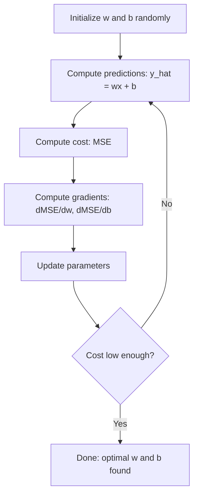

# Regresja liniowa

> Regresja liniowa rysuje najlepszą linię prostą przez dane. To „hello world” uczenia maszynowego.

**Typ:** Implementacja
**Języki:** Python
**Wymagania wstępne:** Faza 1 (algebra liniowa, rachunek różniczkowy, optymalizacja), Faza 2, lekcja 1
**Czas trwania:** ~90 minut

## Cele dydaktyczne

- Wyprowadzenie reguł aktualizacji spadku gradientu dla błędu średniokwadratowego i zaimplementowanie regresji liniowej od podstaw
- Porównanie spadku gradientu i równania normalnego pod względem złożoności obliczeniowej oraz określenie, kiedy należy je zastosować
- Budowa modelu wielokrotnej regresji liniowej ze standaryzacją cech i interpretacja wyuczonych wag
- Wyjaśnienie, w jaki sposób regresja grzbietowa (regularyzacja L2) zapobiega przeuczeniu poprzez karanie dużych wag

## Problem

Masz dane: rozmiary domów i ich ceny sprzedaży. Chcesz przewidzieć cenę nowego domu, biorąc pod uwagę jego wielkość. Można to zobaczyć na wykresie punktowym, ale potrzebna jest formuła. Potrzebujesz linii, która najlepiej pasuje do danych, abyś mógł podać dowolny rozmiar i uzyskać predykcję ceny.

Regresja liniowa wyznacza tę linię. Co ważniejsze, wprowadza całą pętlę uczenia ML: definiowanie modelu, zdefiniowanie funkcji kosztu, optymalizacja parametrów. Każdy algorytm ML wykorzystuje ten sam wzorzec. Jeśli opanujesz go tutaj w najprostszym przypadku, rozpoznasz go wszędzie indziej.

Nie dotyczy to tylko prostych problemów. Regresja liniowa jest wykorzystywana w systemach produkcyjnych do prognozowania popytu, analizy testów A/B, modelowania finansowego oraz jako punkt odniesienia (model bazowy) dla każdego zadania regresji.

## Koncepcje

### Model

Regresja liniowa zakłada liniową zależność pomiędzy cechami wejściowymi (x) i wartością docelową (y):

```
y = wx + b
```

- `w` (waga/nachylenie): o ile zmienia się y, gdy x wzrasta o 1
- `b` (obciążenie/wyraz wolny): wartość y, gdy x = 0

W przypadku wielu wejść (cech) przyjmuje to postać:

```
y = w1*x1 + w2*x2 + ... + wn*xn + b
```

Lub w formie wektorowej: `y = w^T * x + b`

Cel: znaleźć wartości `w` i `b`, które sprawiają, że przewidywane `y` jest jak najbardziej zbliżone do rzeczywistego `y` we wszystkich przykładach szkoleniowych.

### Funkcja kosztu (Błąd średniokwadratowy - MSE)

Jak zmierzyć, „jak blisko” są predykcje? Potrzebujesz pojedynczej liczby, która odzwierciedli wielkość błędu predykcji. Najczęstszym wyborem jest błąd średniokwadratowy (MSE):

```
MSE = (1/n) * sum((y_predicted - y_actual)^2)
```

Dlaczego do kwadratu? Dwa powody. Po pierwsze, silniej karze duże błędy niż małe (błąd 10 jest 100 razy gorszy niż błąd 1, a nie 10-krotnie). Po drugie, funkcja kwadratowa jest wszędzie gładka i różniczkowalna, co znacząco ułatwia optymalizację.

Funkcja kosztu tworzy powierzchnię. Dla pojedynczej wagi `w` i obciążenia `b` powierzchnia MSE wygląda jak misa (wypukła paraboloida). Dno tej misy to miejsce, w którym MSE jest zminimalizowane. Trenowanie polega na znalezieniu tego dna.

### Spadek gradientu (Gradient Descent)

Spadek gradientu pozwala znaleźć dno misy poprzez "schodzenie w dół".



Gradienty informują o dwóch rzeczach: w jakim kierunku przesunąć każdy parametr i o jak dużą wartość.

Dla MSE z y_hat = wx + b gradienty to:

```
dMSE/dw = (2/n) * sum((y_hat - y) * x)
dMSE/db = (2/n) * sum(y_hat - y)
```

Reguła aktualizacji wag:

```
w = w - learning_rate * dMSE/dw
b = b - learning_rate * dMSE/db
```

Szybkość uczenia (learning rate) kontroluje wielkość kroku. Zbyt duża: przeskoczysz minimum, a algorytm zacznie rozbiegać (dywergować). Zbyt mała: proces uczenia będzie trwał bardzo długo. Typowe wartości początkowe to: 0.1, 0.01 lub 0.001.

### Równanie normalne (rozwiązanie w postaci zamkniętej)

Szczególnie dla regresji liniowej istnieje bezpośredni wzór, który pozwala wyznaczyć optymalne wagi bez użycia iteracji:

```
w = (X^T * X)^(-1) * X^T * y
```

Wzór ten wykorzystuje odwracanie macierzy, by znaleźć wagi w jednym kroku. Działa doskonale dla małych zbiorów danych. W przypadku ogromnych zbiorów (miliony wierszy lub tysiące cech), preferowany jest spadek gradientu, ponieważ złożoność odwracania macierzy wynosi O(n^3) względem liczby cech.

### Wielokrotna regresja liniowa

W przypadku dodania wielu cech wejściowych model ewoluuje do postaci:

```
y = w1*x1 + w2*x2 + ... + wn*xn + b
```

Wszystko działa na podobnej zasadzie: MSE to funkcja kosztu, a spadek gradientu aktualizuje wszystkie wagi jednocześnie. Jedyna różnica polega na tym, że zamiast linii, dopasowujemy hiperpłaszczyznę.

W tym scenariuszu ogromne znaczenie ma skalowanie cech. Jeżeli jedna z cech przyjmuje wartości w przedziale od 0 do 1, a inna od 0 do 1 000 000, spadek gradientu napotka trudności, gdyż topologia funkcji kosztu ulegnie znacznemu rozciągnięciu. Przed procesem uczenia należy wystandaryzować cechy (odjąć średnią i podzielić przez odchylenie standardowe).

### Regresja wielomianowa

Co zrobić w sytuacji, gdy zależność nie ma charakteru liniowego? Regresja liniowa jest nadal użyteczna, poprzez wygenerowanie cech wielomianowych:

```
y = w1*x + w2*x^2 + w3*x^3 + b
```

W dalszym ciągu określamy to mianem regresji "liniowej", jako że model wykazuje liniowość w odniesieniu do parametrów wag (w1, w2, w3). Korzystamy jedynie z nieliniowych transformacji zmiennej `x`.

Wielomiany wyższego stopnia pozwalają na modelowanie bardziej skomplikowanych zależności krzywoliniowych, niosą jednak ze sobą ryzyko nadmiernego dopasowania (overfittingu). Wielomian 10. stopnia idealnie dopasuje się do każdego z 10 punktów zbioru uczącego, ale jego zdolność predykcyjna na nowych danych będzie znikoma.

### Współczynnik determinacji (R-kwadrat)

Błąd średniokwadratowy (MSE) komunikuje poziom błędu w skali zmiennej `y`. Współczynnik R-kwadrat (R^2) dostarcza natomiast miarę niezależną od tej skali:

```
R^2 = 1 - (sum of squared residuals) / (sum of squared deviations from mean)
    = 1 - SS_res / SS_tot
```

- R^2 = 1.0: perfekcyjna trafność predykcji
- R^2 = 0.0: model przewiduje wartości równe wskaźnikowi predykcji opartej zawsze na średniej
- R^2 < 0.0: model radzi sobie gorzej niż proste przewidywanie na podstawie średniej

### Wstęp do regularyzacji (Regresja grzbietowa / Ridge)

Obecność wielu cech sprawia, że model może ulec przeuczeniu (overfitting) poprzez przypisanie niektórym z nich bardzo dużych wartości wag. Regresja grzbietowa (regularyzacja L2) wprowadza dodatkową karę do funkcji kosztu:

```
Cost = MSE + lambda * sum(w_i^2)
```

Termin kary (penalty term) efektywnie zniechęca model do przyjmowania wysokich wartości wag. Hiperparametr lambda umożliwia kontrolę tego zjawiska: większa wartość lambda skutkuje mniejszymi wartościami wag i intensywniejszą regularyzacją. Dokładniejsza analiza tego zagadnienia pojawi się w dalszych etapach kursu. Na tym etapie istotne jest, by być świadomym istnienia tego mechanizmu i jego użyteczności.

## Implementacja

### Krok 1: Generowanie przykładowych danych

```python
import random
import math

random.seed(42)

TRUE_W = 3.0
TRUE_B = 7.0
N_SAMPLES = 100

X = [random.uniform(0, 10) for _ in range(N_SAMPLES)]
y = [TRUE_W * x + TRUE_B + random.gauss(0, 2.0) for x in X]

print(f"Generated {N_SAMPLES} samples")
print(f"True relationship: y = {TRUE_W}x + {TRUE_B} (+ noise)")
print(f"First 5 points: {[(round(X[i], 2), round(y[i], 2)) for i in range(5)]}")
```

### Krok 2: Regresja liniowa od podstaw ze spadkiem gradientu

```python
class LinearRegression:
    def __init__(self, learning_rate=0.01):
        self.w = 0.0
        self.b = 0.0
        self.lr = learning_rate
        self.cost_history = []

    def predict(self, X):
        return [self.w * x + self.b for x in X]

    def compute_cost(self, X, y):
        predictions = self.predict(X)
        n = len(y)
        cost = sum((pred - actual) ** 2 for pred, actual in zip(predictions, y)) / n
        return cost

    def compute_gradients(self, X, y):
        predictions = self.predict(X)
        n = len(y)
        dw = (2 / n) * sum((pred - actual) * x for pred, actual, x in zip(predictions, y, X))
        db = (2 / n) * sum(pred - actual for pred, actual in zip(predictions, y))
        return dw, db

    def fit(self, X, y, epochs=1000, print_every=200):
        for epoch in range(epochs):
            dw, db = self.compute_gradients(X, y)
            self.w -= self.lr * dw
            self.b -= self.lr * db
            cost = self.compute_cost(X, y)
            self.cost_history.append(cost)
            if epoch % print_every == 0:
                print(f"  Epoch {epoch:4d} | Cost: {cost:.4f} | w: {self.w:.4f} | b: {self.b:.4f}")
        return self

    def r_squared(self, X, y):
        predictions = self.predict(X)
        y_mean = sum(y) / len(y)
        ss_res = sum((actual - pred) ** 2 for actual, pred in zip(y, predictions))
        ss_tot = sum((actual - y_mean) ** 2 for actual in y)
        return 1 - (ss_res / ss_tot)

print("=== Training Linear Regression (Gradient Descent) ===")
model = LinearRegression(learning_rate=0.005)
model.fit(X, y, epochs=1000, print_every=200)
print(f"\nLearned: y = {model.w:.4f}x + {model.b:.4f}")
print(f"True:    y = {TRUE_W}x + {TRUE_B}")
print(f"R-squared: {model.r_squared(X, y):.4f}")
```

### Krok 3: Równanie normalne (rozwiązanie w formie zamkniętej)

```python
class LinearRegressionNormal:
    def __init__(self):
        self.w = 0.0
        self.b = 0.0

    def fit(self, X, y):
        n = len(X)
        x_mean = sum(X) / n
        y_mean = sum(y) / n
        numerator = sum((X[i] - x_mean) * (y[i] - y_mean) for i in range(n))
        denominator = sum((X[i] - x_mean) ** 2 for i in range(n))
        self.w = numerator / denominator
        self.b = y_mean - self.w * x_mean
        return self

    def predict(self, X):
        return [self.w * x + self.b for x in X]

    def r_squared(self, X, y):
        predictions = self.predict(X)
        y_mean = sum(y) / len(y)
        ss_res = sum((actual - pred) ** 2 for actual, pred in zip(y, predictions))
        ss_tot = sum((actual - y_mean) ** 2 for actual in y)
        return 1 - (ss_res / ss_tot)

print("\n=== Normal Equation (Closed-Form) ===")
model_normal = LinearRegressionNormal()
model_normal.fit(X, y)
print(f"Learned: y = {model_normal.w:.4f}x + {model_normal.b:.4f}")
print(f"R-squared: {model_normal.r_squared(X, y):.4f}")
```

### Krok 4: Wielokrotna regresja liniowa

```python
class MultipleLinearRegression:
    def __init__(self, n_features, learning_rate=0.01):
        self.weights = [0.0] * n_features
        self.bias = 0.0
        self.lr = learning_rate
        self.cost_history = []

    def predict_single(self, x):
        return sum(w * xi for w, xi in zip(self.weights, x)) + self.bias

    def predict(self, X):
        return [self.predict_single(x) for x in X]

    def compute_cost(self, X, y):
        predictions = self.predict(X)
        n = len(y)
        return sum((pred - actual) ** 2 for pred, actual in zip(predictions, y)) / n

    def fit(self, X, y, epochs=1000, print_every=200):
        n = len(y)
        n_features = len(X[0])
        for epoch in range(epochs):
            predictions = self.predict(X)
            errors = [pred - actual for pred, actual in zip(predictions, y)]
            for j in range(n_features):
                grad = (2 / n) * sum(errors[i] * X[i][j] for i in range(n))
                self.weights[j] -= self.lr * grad
            grad_b = (2 / n) * sum(errors)
            self.bias -= self.lr * grad_b
            cost = self.compute_cost(X, y)
            self.cost_history.append(cost)
            if epoch % print_every == 0:
                print(f"  Epoch {epoch:4d} | Cost: {cost:.4f}")
        return self

    def r_squared(self, X, y):
        predictions = self.predict(X)
        y_mean = sum(y) / len(y)
        ss_res = sum((actual - pred) ** 2 for actual, pred in zip(y, predictions))
        ss_tot = sum((actual - y_mean) ** 2 for actual in y)
        return 1 - (ss_res / ss_tot)

random.seed(42)
N = 100
X_multi = []
y_multi = []
for _ in range(N):
    size = random.uniform(500, 3000)
    bedrooms = random.randint(1, 5)
    age = random.uniform(0, 50)
    price = 50 * size + 10000 * bedrooms - 1000 * age + 50000 + random.gauss(0, 20000)
    X_multi.append([size, bedrooms, age])
    y_multi.append(price)

def standardize(X):
    n_features = len(X[0])
    means = [sum(X[i][j] for i in range(len(X))) / len(X) for j in range(n_features)]
    stds = []
    for j in range(n_features):
        variance = sum((X[i][j] - means[j]) ** 2 for i in range(len(X))) / len(X)
        stds.append(variance ** 0.5)
    X_scaled = []
    for i in range(len(X)):
        row = [(X[i][j] - means[j]) / stds[j] if stds[j] > 0 else 0 for j in range(n_features)]
        X_scaled.append(row)
    return X_scaled, means, stds

y_mean_val = sum(y_multi) / len(y_multi)
y_std_val = (sum((yi - y_mean_val) ** 2 for yi in y_multi) / len(y_multi)) ** 0.5
y_scaled = [(yi - y_mean_val) / y_std_val for yi in y_multi]

X_scaled, x_means, x_stds = standardize(X_multi)

print("\n=== Multiple Linear Regression (3 features) ===")
print("Features: house size, bedrooms, age")
multi_model = MultipleLinearRegression(n_features=3, learning_rate=0.01)
multi_model.fit(X_scaled, y_scaled, epochs=1000, print_every=200)

print(f"\nWeights (standardized): {[round(w, 4) for w in multi_model.weights]}")
print(f"Bias (standardized): {multi_model.bias:.4f}")
print(f"R-squared: {multi_model.r_squared(X_scaled, y_scaled):.4f}")
```

### Krok 5: Regresja wielomianowa

```python
class PolynomialRegression:
    def __init__(self, degree, learning_rate=0.01):
        self.degree = degree
        self.weights = [0.0] * degree
        self.bias = 0.0
        self.lr = learning_rate

    def make_features(self, X):
        return [[x ** (d + 1) for d in range(self.degree)] for x in X]

    def predict(self, X):
        features = self.make_features(X)
        return [sum(w * f for w, f in zip(self.weights, row)) + self.bias for row in features]

    def fit(self, X, y, epochs=1000, print_every=200):
        features = self.make_features(X)
        n = len(y)
        for epoch in range(epochs):
            predictions = [sum(w * f for w, f in zip(self.weights, row)) + self.bias for row in features]
            errors = [pred - actual for pred, actual in zip(predictions, y)]
            for j in range(self.degree):
                grad = (2 / n) * sum(errors[i] * features[i][j] for i in range(n))
                self.weights[j] -= self.lr * grad
            grad_b = (2 / n) * sum(errors)
            self.bias -= self.lr * grad_b
            if epoch % print_every == 0:
                cost = sum(e ** 2 for e in errors) / n
                print(f"  Epoch {epoch:4d} | Cost: {cost:.6f}")
        return self

    def r_squared(self, X, y):
        predictions = self.predict(X)
        y_mean = sum(y) / len(y)
        ss_res = sum((actual - pred) ** 2 for actual, pred in zip(y, predictions))
        ss_tot = sum((actual - y_mean) ** 2 for actual in y)
        return 1 - (ss_res / ss_tot)

random.seed(42)
X_poly = [x / 10.0 for x in range(0, 50)]
y_poly = [0.5 * x ** 2 - 2 * x + 3 + random.gauss(0, 1.0) for x in X_poly]

x_max = max(abs(x) for x in X_poly)
X_poly_norm = [x / x_max for x in X_poly]
y_poly_mean = sum(y_poly) / len(y_poly)
y_poly_std = (sum((yi - y_poly_mean) ** 2 for yi in y_poly) / len(y_poly)) ** 0.5
y_poly_norm = [(yi - y_poly_mean) / y_poly_std for yi in y_poly]

print("\n=== Polynomial Regression (degree 2 vs degree 5) ===")
print("True relationship: y = 0.5x^2 - 2x + 3")

print("\nDegree 2:")
poly2 = PolynomialRegression(degree=2, learning_rate=0.1)
poly2.fit(X_poly_norm, y_poly_norm, epochs=2000, print_every=500)
print(f"  R-squared: {poly2.r_squared(X_poly_norm, y_poly_norm):.4f}")

print("\nDegree 5:")
poly5 = PolynomialRegression(degree=5, learning_rate=0.1)
poly5.fit(X_poly_norm, y_poly_norm, epochs=2000, print_every=500)
print(f"  R-squared: {poly5.r_squared(X_poly_norm, y_poly_norm):.4f}")

print("\nDegree 2 fits the true curve well. Degree 5 fits training data slightly better")
print("but risks overfitting on new data.")
```

### Krok 6: Regresja grzbietowa (regularyzacja L2)

```python
class RidgeRegression:
    def __init__(self, n_features, learning_rate=0.01, alpha=1.0):
        self.weights = [0.0] * n_features
        self.bias = 0.0
        self.lr = learning_rate
        self.alpha = alpha

    def predict_single(self, x):
        return sum(w * xi for w, xi in zip(self.weights, x)) + self.bias

    def predict(self, X):
        return [self.predict_single(x) for x in X]

    def fit(self, X, y, epochs=1000, print_every=200):
        n = len(y)
        n_features = len(X[0])
        for epoch in range(epochs):
            predictions = self.predict(X)
            errors = [pred - actual for pred, actual in zip(predictions, y)]
            mse = sum(e ** 2 for e in errors) / n
            reg_term = self.alpha * sum(w ** 2 for w in self.weights)
            cost = mse + reg_term
            for j in range(n_features):
                grad = (2 / n) * sum(errors[i] * X[i][j] for i in range(n))
                grad += 2 * self.alpha * self.weights[j]
                self.weights[j] -= self.lr * grad
            grad_b = (2 / n) * sum(errors)
            self.bias -= self.lr * grad_b
            if epoch % print_every == 0:
                print(f"  Epoch {epoch:4d} | Cost: {cost:.4f} | L2 penalty: {reg_term:.4f}")
        return self

print("\n=== Ridge Regression (L2 Regularization) ===")
print("Same data as multiple regression, with alpha=0.1")
ridge = RidgeRegression(n_features=3, learning_rate=0.01, alpha=0.1)
ridge.fit(X_scaled, y_scaled, epochs=1000, print_every=200)
print(f"\nRidge weights: {[round(w, 4) for w in ridge.weights]}")
print(f"Plain weights: {[round(w, 4) for w in multi_model.weights]}")
print("Ridge weights are smaller (shrunk toward zero) due to the L2 penalty.")
```

## Praktyczne zastosowanie

A teraz to samo przy użyciu `scikit-learn` – biblioteki, z której będziesz korzystać w środowisku produkcyjnym.

```python
from sklearn.linear_model import LinearRegression as SklearnLR
from sklearn.linear_model import Ridge
from sklearn.preprocessing import PolynomialFeatures, StandardScaler
from sklearn.model_selection import train_test_split
from sklearn.metrics import mean_squared_error, r2_score
import numpy as np

np.random.seed(42)
X_sk = np.random.uniform(0, 10, (100, 1))
y_sk = 3.0 * X_sk.squeeze() + 7.0 + np.random.normal(0, 2.0, 100)

X_train, X_test, y_train, y_test = train_test_split(X_sk, y_sk, test_size=0.2, random_state=42)

lr = SklearnLR()
lr.fit(X_train, y_train)
y_pred = lr.predict(X_test)

print("=== Scikit-learn Linear Regression ===")
print(f"Coefficient (w): {lr.coef_[0]:.4f}")
print(f"Intercept (b): {lr.intercept_:.4f}")
print(f"R-squared (test): {r2_score(y_test, y_pred):.4f}")
print(f"MSE (test): {mean_squared_error(y_test, y_pred):.4f}")

poly = PolynomialFeatures(degree=2, include_bias=False)
X_poly_sk = poly.fit_transform(X_train)
X_poly_test = poly.transform(X_test)

lr_poly = SklearnLR()
lr_poly.fit(X_poly_sk, y_train)
print(f"\nPolynomial degree 2 R-squared: {r2_score(y_test, lr_poly.predict(X_poly_test)):.4f}")

scaler = StandardScaler()
X_train_scaled = scaler.fit_transform(X_train)
X_test_scaled = scaler.transform(X_test)

ridge = Ridge(alpha=1.0)
ridge.fit(X_train_scaled, y_train)
print(f"Ridge R-squared: {r2_score(y_test, ridge.predict(X_test_scaled)):.4f}")
print(f"Ridge coefficient: {ridge.coef_[0]:.4f}")
```

Zbudowana przez Ciebie od podstaw implementacja i wersja z biblioteki `scikit-learn` przynoszą identyczne wyniki. Skąd więc wynika różnica? Otóż `scikit-learn` oferuje niezawodne mechanizmy zapobiegające błędom, lepszą stabilność numeryczną oraz zoptymalizowaną wydajność. To właśnie z gotowych bibliotek należy korzystać przy wdrożeniach na środowiskach produkcyjnych. Niemniej, przećwiczenie samodzielnego programowania tych algorytmów od zera jest najlepszą metodą, aby dogłębnie przyswoić sposób ich funkcjonowania.

## Wynik lekcji

Oto rezultat, który uzyskasz na podstawie tej lekcji:
- `outputs/skill-regression.md` - poradnik pomagający wybrać odpowiednie podejście regresyjne w zależności od problemu

## Ćwiczenia

1. Zaimplementuj standardowy (wsadowy) spadek gradientu (Batch Gradient Descent), stochastyczny spadek gradientu (SGD) i spadek gradientu oparty o mini-wsady (Mini-batch Gradient Descent). Porównaj prędkość konwergencji w tym samym zestawie danych. Który z nich jest zbieżny najszybciej? Która krzywa kosztu wykazuje największą łagodność?
2. Wygeneruj dane korzystając z funkcji sześciennej (y = ax^3 + bx^2 + cx + d + szum). Dopasuj wielomiany stopnia 1, 3 oraz 10. Porównaj współczynniki R^2 dla zbioru treningowego i testowego. Od jakiego stopnia wielomianu przeuczenie (overfitting) staje się bezsprzecznie widoczne?
3. Zaimplementuj regresję Lasso (regularyzacja L1: kara = alfa * suma(|w_i|)). Wytrenuj model przy użyciu wielowymiarowych danych mieszkaniowych (z wykorzystaniem wielu cech). Porównaj, które z badanych wag redukują się do zera w porównaniu do modelu Ridge. Zastanów się, z jakiego powodu to właśnie regularyzacja L1 pozwala na generowanie tzw. "rzadkich rozwiązań" (sparse solutions), podczas gdy regularyzacja L2 tego nie robi.

## Kluczowe pojęcia

| Termin | Co ludzie mówią | Co to właściwie oznacza |
|------|----------------|----------------------|
| Regresja liniowa | „Narysuj linię poprzez dane” | Wyznaczenie optymalnych wartości wagi `w` oraz obciążenia `b`, których zastosowanie minimalizuje sumę kwadratów różnic między predykcją (wx+b) a rzeczywistymi wartościami `y` |
| Funkcja kosztu | „Jak zły jest ten model” | Matematyczna formuła przekształcająca zestaw parametrów modelu w pojedynczą wartość liczbową odzwierciedlającą błąd predykcji. Głównym celem procesu optymalizacji jest minimalizacja wyniku tejże funkcji. |
| Błąd średniokwadratowy (MSE) | „Średnia kwadratów błędów” | Wyrażony wzorem: (1/n) * suma (wartość_przewidywana - wartość_rzeczywista)^2. Taki zapis sprawia, że wystąpienie znaczących błędów podlega rygorystycznym karom, nieproporcjonalnie wysokim w stosunku do błędów błahych. |
| Spadek gradientu | „Idź w dół” | Iteracyjne dostosowywanie parametrów w kierunku, który gwarantuje obniżenie wartości funkcji kosztu. Proces bazuje na wykorzystaniu pochodnych cząstkowych. |
| Szybkość uczenia (Learning Rate) | „Rozmiar kroku” | Skalar kontrolujący wielkość zmiany parametrów na każdy krok spadku gradientu |
| Równanie normalne | „Rozwiąż to bezpośrednio” | Rozwiązanie w formie zamkniętej `w = (X^T X)^-1 X^T y` dające optymalne wagi bez stosowania iteracji |
| Współczynnik R-kwadrat (R^2) | „Jak dobre jest dopasowanie” | Część wariancji `y` wyjaśniona przez model, w zakresie od ujemnej nieskończoności do 1.0 |
| Skalowanie cech | „Spraw, aby cechy były porównywalne” | Proces matematyczny transformujący poszczególne cechy na wartości mieszczące się w zbliżonych do siebie zakresach (np. dążąc do ujednolicenia ich pod kątem zerowej średniej i jednostkowej wariancji). Zabieg ten znacząco przyśpiesza proces spadku gradientu. |
| Regularyzacja | „Karaj złożoność” | Mechanizm polegający na dodaniu odpowiedniego warunku do funkcji kosztu, którego implementacja wymusza zredukowanie wartości wag, uniemożliwiając zaistnienie zjawiska przeuczenia (overfittingu). |
| Regresja grzbietowa (Ridge) | „Regularyzacja L2” | Klasyczna regresja liniowa uzupełniona o nałożenie kary w postaci parametru `lambda * suma(w_i^2)` zaimplementowanej na poziomie MSE. |
| Regresja wielomianowa | „Dopasowywanie krzywych za pomocą matematyki liniowej” | Klasyczna forma regresji liniowej zaimplementowana do przetworzenia uprzednio przekształconych na wielomiany cech w postaci (x, x^2, x^3...). Konstrukcja tego narzędzia, mimo nieliniowych transformacji wejść wektorowych, opiera swoje funkcjonowanie w oparciu o czysto liniowy charakter zaaplikowanych dla nich wag, pozostając tym samym regresją ewidentnie liniową. |
| Przeuczenie | „Zapamiętywanie danych treningowych” | Budowa modelu odznaczającego się tak daleko idącą złożonością, iż w fenomenalny wręcz sposób przyswaja strukturę przygotowanych w toku badań danych uczących, nie potrafiąc jednocześnie wygenerować adekwatnej konstrukcji dla nowych, wcześniej niewidzianych punktów danych. |

## Dodatkowe materiały

- [Wprowadzenie do uczenia się statystycznego (ISLR)](https://www.statlearning.com/) - bezpłatny plik PDF, rozdziały 3 i 6 omawiają regresję liniową i regularyzację z praktycznymi przykładami języka R
- [Elementy uczenia się statystycznego (ESL)](https://hastie.su.domains/ElemStatLearn/) - darmowy plik PDF, bardziej matematyczny towarzysz ISLR z głębszym omówieniem regresji Ridge i Lasso
- [Stanford CS229: Notatki z wykładów na temat regresji liniowej](https://cs229.stanford.edu/main_notes.pdf) - Notatki Andrew Ng wyprowadzające równanie normalne i spadek gradientu od podstaw
- [Dokumentacja scikit-learn: LinearRegression](https://scikit-learn.org/stable/modules/linear_model.html) -- praktyczne informacje o modelach LinearRegression, Ridge, Lasso i ElasticNet z przykładami kodu
