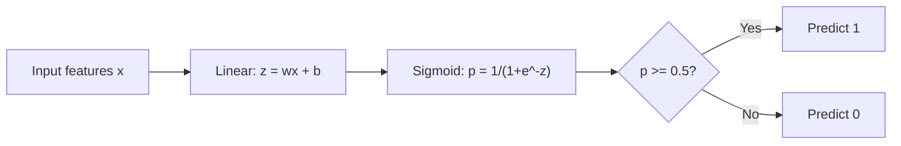
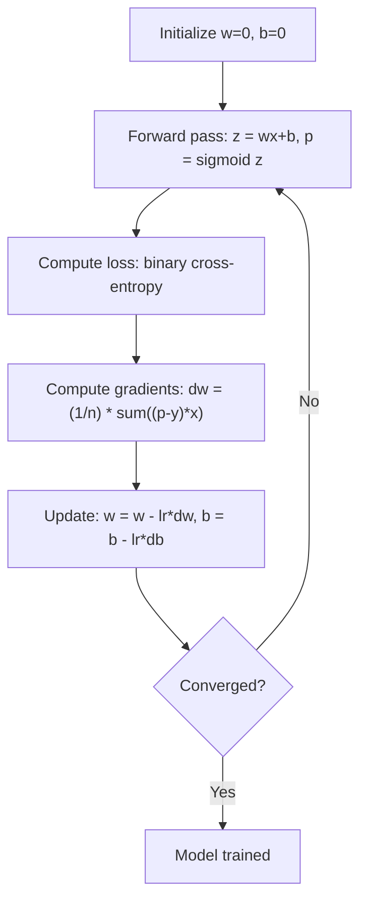

# Regresja logistyczna

> Regresja logistyczna zagina linię prostą w krzywą S, aby odpowiedzieć na pytania typu „tak” lub „nie” z prawdopodobieństwem.

**Typ:** Kompilacja
**Języki:** Python
**Wymagania wstępne:** Faza 2, lekcja 1-2 (Co to jest ML, regresja liniowa)
**Czas:** ~90 minut

## Cele nauczania

- Zaimplementuj regresję logistyczną od podstaw, korzystając z funkcji sigmoidalnej i binarnej utraty entropii krzyżowej
- Oblicz i zinterpretuj precyzję, zapamiętywanie, wynik F1 i macierz pomyłek dla klasyfikacji binarnej
- Wyjaśnij, dlaczego metoda MSE nie pozwala na klasyfikację i dlaczego binarna entropia krzyżowa tworzy wypukłą powierzchnię kosztów
- Zbuduj model regresji softmax dla klasyfikacji wieloklasowej i oceń kompromisy w zakresie dostrajania progów

## Problem

Chcesz przewidzieć, czy guz jest złośliwy czy łagodny, biorąc pod uwagę jego wielkość. Spróbuj regresji liniowej. Wyświetla liczby takie jak 0,3, 1,7 lub -0,5. Co one oznaczają? Czy 1,7 jest „bardzo złośliwy”? Czy -0,5 jest „bardzo łagodne”? Regresja liniowa generuje nieograniczone liczby. Klasyfikacja wymaga ograniczonych prawdopodobieństw od 0 do 1 i jasnej decyzji: tak lub nie.

Regresja logistyczna rozwiązuje ten problem. Bierze tę samą kombinację liniową (wx + b) i przepuszcza ją przez funkcję sigmoidalną, która zgniata dowolną liczbę do zakresu (0, 1). Wynik jest prawdopodobieństwem. Ustalasz próg (zwykle 0,5) i podejmujesz decyzję.

Jest to jeden z najczęściej stosowanych algorytmów w praktyce. Pomimo swojej nazwy regresja logistyczna jest algorytmem klasyfikacji, a nie algorytmem regresji. Nazwa pochodzi od funkcji logistycznej (esigmoidalnej), której używa.

## Koncepcja

### Dlaczego regresja liniowa nie pozwala na klasyfikację

Wyobraź sobie przewidywanie zaliczenia/niezaliczenia (1/0) na podstawie godzin nauki. Regresja liniowa dopasowuje linię poprzez dane:

```
hours:  1   2   3   4   5   6   7   8   9   10
actual: 0   0   0   0   1   1   1   1   1   1
```

Dopasowanie liniowe może dać prognozy takie jak -0,2 w godzinie 1 i 1,3 w godzinie 10. Wartości te nie są prawdopodobieństwem. Schodzą poniżej 0 i powyżej 1. Co gorsza, pojedyncza wartość odstająca (ktoś, kto studiował 50 godzin) przeciągnęłaby całą linię, zmieniając prognozy dla wszystkich.

Klasyfikacja wymaga funkcji, która:
- Wyświetla wartości od 0 do 1 (prawdopodobieństwa)
- Tworzy ostre przejście (granica decyzyjna)
- Nie jest zniekształcony przez wartości odstające znajdujące się daleko od granicy

### Funkcja sigmoidalna

Funkcja sigmoidalna robi dokładnie to:

```
sigmoid(z) = 1 / (1 + e^(-z))
```

Właściwości:
- Gdy z jest duże i dodatnie, sigmoid(z) zbliża się do 1
- Gdy z jest duże i ujemne, sigmoid(z) zbliża się do 0
- Gdy z = 0, sigmoida(z) = 0,5
- Wartość wyjściowa zawsze mieści się w przedziale od 0 do 1
- Funkcja jest gładka i różniczkowalna wszędzie

Pochodna ma dogodną postać: sigmoid'(z) = sigmoid(z) * (1 - sigmoid(z)). Dzięki temu obliczenia gradientowe są wydajne.

### Regresja logistyczna = model liniowy + sigmoida

Model oblicza z = wx + b (tak samo jak w regresji liniowej), a następnie stosuje sigmoidę:



Wynik p jest interpretowany jako P(y=1 | x), prawdopodobieństwo, że wejście należy do klasy 1. Granica decyzji to miejsce, w którym wx + b = 0, co daje wynik sigmoidalny dokładnie 0,5.

### Binarna strata entropii krzyżowej

Nie można używać MSE do regresji logistycznej. MSE z sigmoidą tworzy niewypukłą powierzchnię kosztową z wieloma lokalnymi minimami. Zamiast tego użyj binarnej entropii krzyżowej (utrata logu):

```
Loss = -(1/n) * sum(y * log(p) + (1-y) * log(1-p))
```

Dlaczego to działa:
- Gdy y=1 i p jest bliskie 1: log(1) = 0, więc strata jest bliska 0 (poprawnie, niski koszt)
- Gdy y=1 i p jest bliskie 0: log(0) zbliża się do ujemnej nieskończoności, więc strata jest ogromna (źle, wysoki koszt)
- Gdy y=0 i p jest bliskie 0: log(1) = 0, więc strata jest bliska 0 (poprawnie, niski koszt)
- Gdy y=0 i p jest bliskie 1: log(0) zbliża się do ujemnej nieskończoności, więc strata jest ogromna (źle, wysoki koszt)

Ta funkcja straty jest wypukła dla regresji logistycznej, gwarantując jedno globalne minimum.

### Zejście gradientowe dla regresji logistycznej

Gradienty dla binarnej entropii krzyżowej z sigmoidą mają czystą postać:

```
dL/dw = (1/n) * sum((p - y) * x)
dL/db = (1/n) * sum(p - y)
```

Wyglądają one identycznie jak gradienty regresji liniowej. Różnica polega na tym, że p = sigmoid(wx + b) zamiast p = wx + b. Sigmoida wprowadza nieliniowość, ale zasada aktualizacji gradientu pozostaje taka sama.



### Granica decyzji

W przypadku danych wejściowych 2D (dwie cechy) granicą decyzyjną jest linia, gdzie:

```
w1*x1 + w2*x2 + b = 0
```

Punkty po jednej stronie są klasyfikowane jako 1, punkty po drugiej stronie jako 0. Regresja logistyczna zawsze tworzy liniową granicę decyzyjną. Jeśli potrzebujesz zakrzywionej granicy, możesz dodać elementy wielomianowe lub użyć modelu nieliniowego.

### Klasyfikacja wieloklasowa za pomocą Softmax

Binarna regresja logistyczna obsługuje dwie klasy. Dla klas k użyj funkcji softmax:

```
softmax(z_i) = e^(z_i) / sum(e^(z_j) for all j)
```

Każda klasa ma swój własny wektor wagi. Model oblicza wynik z_i dla każdej klasy, następnie Softmax konwertuje wyniki na prawdopodobieństwa, które sumują się do 1. Przewidywana klasa to ta z największym prawdopodobieństwem.

Funkcja straty staje się kategoryczną entropią krzyżową:

```
Loss = -(1/n) * sum(sum(y_k * log(p_k)))
```

gdzie y_k wynosi 1 dla prawdziwej klasy i 0 dla wszystkich pozostałych (kodowanie jednokrotne).

### Metryki oceny

Sama dokładność nie wystarczy. W przypadku zbioru danych zawierającego 95% wartości ujemnych i 5% wartości dodatnich model, który zawsze przewiduje wartości ujemne, uzyskuje dokładność na poziomie 95%, ale jest bezużyteczny.

**Macierz zamieszania**:

| | Przewidywany pozytywny | Przewidywany wynik negatywny |
|---|---|---|
| Właściwie pozytywne | Prawdziwie pozytywny (TP) | Fałszywie ujemny (FN) |
| Właściwie negatywne | Fałszywie pozytywny (FP) | Prawdziwie ujemny (TN) |

**Precyzja**: Ile z przewidywanych pozytywnych wyników jest faktycznie pozytywnych?

```
Precision = TP / (TP + FP)
```

**Przypomnienie** (Czułość): Ile udało nam się złapać ze wszystkich pozytywów?

```
Recall = TP / (TP + FN)
```

**Wynik F1**: Średnia harmoniczna precyzji i zapamiętywania. Równoważy oba wskaźniki.

```
F1 = 2 * (Precision * Recall) / (Precision + Recall)
```

Kiedy nadać priorytet:
- **Precyzja**: gdy fałszywe alarmy są kosztowne (filtr spamu, nie chcesz blokować legalnych wiadomości e-mail)
- **Przypomnijmy**: gdy wyniki fałszywie ujemne są kosztowne (badania przesiewowe w kierunku raka, nie chcesz przegapić guza)
- **F1**: gdy potrzebujesz pojedynczej zrównoważonej metryki

## Zbuduj to

### Krok 1: Funkcja sigmoidalna i generowanie danych

```python
import random
import math

def sigmoid(z):
    z = max(-500, min(500, z))
    return 1.0 / (1.0 + math.exp(-z))

random.seed(42)
N = 200
X = []
y = []

for _ in range(N // 2):
    X.append([random.gauss(2, 1), random.gauss(2, 1)])
    y.append(0)

for _ in range(N // 2):
    X.append([random.gauss(5, 1), random.gauss(5, 1)])
    y.append(1)

combined = list(zip(X, y))
random.shuffle(combined)
X, y = zip(*combined)
X = list(X)
y = list(y)

print(f"Generated {N} samples (2 classes, 2 features)")
print(f"Class 0 center: (2, 2), Class 1 center: (5, 5)")
print(f"First 5 samples:")
for i in range(5):
    print(f"  Features: [{X[i][0]:.2f}, {X[i][1]:.2f}], Label: {y[i]}")
```

### Krok 2: Regresja logistyczna od zera

```python
class LogisticRegression:
    def __init__(self, n_features, learning_rate=0.01):
        self.weights = [0.0] * n_features
        self.bias = 0.0
        self.lr = learning_rate
        self.loss_history = []

    def predict_proba(self, x):
        z = sum(w * xi for w, xi in zip(self.weights, x)) + self.bias
        return sigmoid(z)

    def predict(self, x, threshold=0.5):
        return 1 if self.predict_proba(x) >= threshold else 0

    def compute_loss(self, X, y):
        n = len(y)
        total = 0.0
        for i in range(n):
            p = self.predict_proba(X[i])
            p = max(1e-15, min(1 - 1e-15, p))
            total += y[i] * math.log(p) + (1 - y[i]) * math.log(1 - p)
        return -total / n

    def fit(self, X, y, epochs=1000, print_every=200):
        n = len(y)
        n_features = len(X[0])
        for epoch in range(epochs):
            dw = [0.0] * n_features
            db = 0.0
            for i in range(n):
                p = self.predict_proba(X[i])
                error = p - y[i]
                for j in range(n_features):
                    dw[j] += error * X[i][j]
                db += error
            for j in range(n_features):
                self.weights[j] -= self.lr * (dw[j] / n)
            self.bias -= self.lr * (db / n)
            loss = self.compute_loss(X, y)
            self.loss_history.append(loss)
            if epoch % print_every == 0:
                print(f"  Epoch {epoch:4d} | Loss: {loss:.4f} | w: [{self.weights[0]:.3f}, {self.weights[1]:.3f}] | b: {self.bias:.3f}")
        return self

    def accuracy(self, X, y):
        correct = sum(1 for i in range(len(y)) if self.predict(X[i]) == y[i])
        return correct / len(y)

split = int(0.8 * N)
X_train, X_test = X[:split], X[split:]
y_train, y_test = y[:split], y[split:]

print("\n=== Training Logistic Regression ===")
model = LogisticRegression(n_features=2, learning_rate=0.1)
model.fit(X_train, y_train, epochs=1000, print_every=200)

print(f"\nTrain accuracy: {model.accuracy(X_train, y_train):.4f}")
print(f"Test accuracy:  {model.accuracy(X_test, y_test):.4f}")
print(f"Weights: [{model.weights[0]:.4f}, {model.weights[1]:.4f}]")
print(f"Bias: {model.bias:.4f}")
```

### Krok 3: Matryca zamieszania i wskaźniki od podstaw

```python
class ClassificationMetrics:
    def __init__(self, y_true, y_pred):
        self.tp = sum(1 for t, p in zip(y_true, y_pred) if t == 1 and p == 1)
        self.tn = sum(1 for t, p in zip(y_true, y_pred) if t == 0 and p == 0)
        self.fp = sum(1 for t, p in zip(y_true, y_pred) if t == 0 and p == 1)
        self.fn = sum(1 for t, p in zip(y_true, y_pred) if t == 1 and p == 0)

    def accuracy(self):
        total = self.tp + self.tn + self.fp + self.fn
        return (self.tp + self.tn) / total if total > 0 else 0

    def precision(self):
        denom = self.tp + self.fp
        return self.tp / denom if denom > 0 else 0

    def recall(self):
        denom = self.tp + self.fn
        return self.tp / denom if denom > 0 else 0

    def f1(self):
        p = self.precision()
        r = self.recall()
        return 2 * p * r / (p + r) if (p + r) > 0 else 0

    def print_confusion_matrix(self):
        print(f"\n  Confusion Matrix:")
        print(f"                  Predicted")
        print(f"                  Pos   Neg")
        print(f"  Actual Pos     {self.tp:4d}  {self.fn:4d}")
        print(f"  Actual Neg     {self.fp:4d}  {self.tn:4d}")

    def print_report(self):
        self.print_confusion_matrix()
        print(f"\n  Accuracy:  {self.accuracy():.4f}")
        print(f"  Precision: {self.precision():.4f}")
        print(f"  Recall:    {self.recall():.4f}")
        print(f"  F1 Score:  {self.f1():.4f}")

y_pred_test = [model.predict(x) for x in X_test]
print("\n=== Classification Report (Test Set) ===")
metrics = ClassificationMetrics(y_test, y_pred_test)
metrics.print_report()
```

### Krok 4: Analiza granic decyzji

```python
print("\n=== Decision Boundary ===")
w1, w2 = model.weights
b = model.bias
print(f"Decision boundary: {w1:.4f}*x1 + {w2:.4f}*x2 + {b:.4f} = 0")
if abs(w2) > 1e-10:
    print(f"Solved for x2:     x2 = {-w1/w2:.4f}*x1 + {-b/w2:.4f}")

print("\nSample predictions near the boundary:")
test_points = [
    [3.0, 3.0],
    [3.5, 3.5],
    [4.0, 4.0],
    [2.5, 2.5],
    [5.0, 5.0],
]
for point in test_points:
    prob = model.predict_proba(point)
    pred = model.predict(point)
    print(f"  [{point[0]}, {point[1]}] -> prob={prob:.4f}, class={pred}")
```

### Krok 5: Wieloklasowość z softmax

```python
class SoftmaxRegression:
    def __init__(self, n_features, n_classes, learning_rate=0.01):
        self.n_features = n_features
        self.n_classes = n_classes
        self.lr = learning_rate
        self.weights = [[0.0] * n_features for _ in range(n_classes)]
        self.biases = [0.0] * n_classes

    def softmax(self, scores):
        max_score = max(scores)
        exp_scores = [math.exp(s - max_score) for s in scores]
        total = sum(exp_scores)
        return [e / total for e in exp_scores]

    def predict_proba(self, x):
        scores = [
            sum(self.weights[k][j] * x[j] for j in range(self.n_features)) + self.biases[k]
            for k in range(self.n_classes)
        ]
        return self.softmax(scores)

    def predict(self, x):
        probs = self.predict_proba(x)
        return probs.index(max(probs))

    def fit(self, X, y, epochs=1000, print_every=200):
        n = len(y)
        for epoch in range(epochs):
            grad_w = [[0.0] * self.n_features for _ in range(self.n_classes)]
            grad_b = [0.0] * self.n_classes
            total_loss = 0.0
            for i in range(n):
                probs = self.predict_proba(X[i])
                for k in range(self.n_classes):
                    target = 1.0 if y[i] == k else 0.0
                    error = probs[k] - target
                    for j in range(self.n_features):
                        grad_w[k][j] += error * X[i][j]
                    grad_b[k] += error
                true_prob = max(probs[y[i]], 1e-15)
                total_loss -= math.log(true_prob)
            for k in range(self.n_classes):
                for j in range(self.n_features):
                    self.weights[k][j] -= self.lr * (grad_w[k][j] / n)
                self.biases[k] -= self.lr * (grad_b[k] / n)
            if epoch % print_every == 0:
                print(f"  Epoch {epoch:4d} | Loss: {total_loss / n:.4f}")
        return self

    def accuracy(self, X, y):
        correct = sum(1 for i in range(len(y)) if self.predict(X[i]) == y[i])
        return correct / len(y)

random.seed(42)
X_3class = []
y_3class = []

centers = [(1, 1), (5, 1), (3, 5)]
for label, (cx, cy) in enumerate(centers):
    for _ in range(50):
        X_3class.append([random.gauss(cx, 0.8), random.gauss(cy, 0.8)])
        y_3class.append(label)

combined = list(zip(X_3class, y_3class))
random.shuffle(combined)
X_3class, y_3class = zip(*combined)
X_3class = list(X_3class)
y_3class = list(y_3class)

split_3 = int(0.8 * len(X_3class))
X_train_3 = X_3class[:split_3]
y_train_3 = y_3class[:split_3]
X_test_3 = X_3class[split_3:]
y_test_3 = y_3class[split_3:]

print("\n=== Multi-class Softmax Regression (3 classes) ===")
softmax_model = SoftmaxRegression(n_features=2, n_classes=3, learning_rate=0.1)
softmax_model.fit(X_train_3, y_train_3, epochs=1000, print_every=200)
print(f"\nTrain accuracy: {softmax_model.accuracy(X_train_3, y_train_3):.4f}")
print(f"Test accuracy:  {softmax_model.accuracy(X_test_3, y_test_3):.4f}")

print("\nSample predictions:")
for i in range(5):
    probs = softmax_model.predict_proba(X_test_3[i])
    pred = softmax_model.predict(X_test_3[i])
    print(f"  True: {y_test_3[i]}, Predicted: {pred}, Probs: [{', '.join(f'{p:.3f}' for p in probs)}]")
```

### Krok 6: Strojenie progu

```python
print("\n=== Threshold Tuning ===")
print("Default threshold: 0.5. Adjusting the threshold trades precision for recall.\n")

thresholds = [0.3, 0.4, 0.5, 0.6, 0.7]
print(f"{'Threshold':>10} {'Accuracy':>10} {'Precision':>10} {'Recall':>10} {'F1':>10}")
print("-" * 52)

for t in thresholds:
    y_pred_t = [1 if model.predict_proba(x) >= t else 0 for x in X_test]
    m = ClassificationMetrics(y_test, y_pred_t)
    print(f"{t:>10.1f} {m.accuracy():>10.4f} {m.precision():>10.4f} {m.recall():>10.4f} {m.f1():>10.4f}")
```

## Użyj tego

Teraz to samo z scikit-learn.

```python
from sklearn.linear_model import LogisticRegression as SklearnLR
from sklearn.metrics import accuracy_score, precision_score, recall_score, f1_score
from sklearn.metrics import confusion_matrix, classification_report
from sklearn.model_selection import train_test_split
from sklearn.preprocessing import StandardScaler
import numpy as np

np.random.seed(42)
X_0 = np.random.randn(100, 2) + [2, 2]
X_1 = np.random.randn(100, 2) + [5, 5]
X_sk = np.vstack([X_0, X_1])
y_sk = np.array([0] * 100 + [1] * 100)

X_tr, X_te, y_tr, y_te = train_test_split(X_sk, y_sk, test_size=0.2, random_state=42)

scaler = StandardScaler()
X_tr_sc = scaler.fit_transform(X_tr)
X_te_sc = scaler.transform(X_te)

lr = SklearnLR()
lr.fit(X_tr_sc, y_tr)
y_pred = lr.predict(X_te_sc)

print("=== Scikit-learn Logistic Regression ===")
print(f"Accuracy:  {accuracy_score(y_te, y_pred):.4f}")
print(f"Precision: {precision_score(y_te, y_pred):.4f}")
print(f"Recall:    {recall_score(y_te, y_pred):.4f}")
print(f"F1:        {f1_score(y_te, y_pred):.4f}")
print(f"\nConfusion Matrix:\n{confusion_matrix(y_te, y_pred)}")
print(f"\nClassification Report:\n{classification_report(y_te, y_pred)}")
```

Implementacja od podstaw zapewnia te same granice decyzji i metryki. Scikit-learn dodaje opcje solwerów (liblinear, lbfgs, saga), automatyczną regularyzację, strategie wieloklasowe (jeden kontra reszta, wielomian) i optymalizacje stabilności numerycznej.

## Wyślij to

Ta lekcja daje:
- `code/logistic_regression.py` – regresja logistyczna od zera z metrykami

## Ćwiczenia

1. Wygeneruj zbiór danych, którego NIE można rozdzielić liniowo (np. dwa koncentryczne okręgi). Trenuj regresję logistyczną i obserwuj jej niepowodzenie. Następnie dodaj funkcje wielomianowe (x1^2, x2^2, x1*x2) i trenuj ponownie. Pokaż, że poprawia się dokładność.
2. Zaimplementuj wieloklasową macierz zamieszania dla 3-klasowego modelu softmax. Oblicz precyzję i pamięć dla poszczególnych klas. Którą klasę najtrudniej sklasyfikować?
3. Zbuduj od podstaw krzywą ROC. Dla 100 wartości progowych od 0 do 1 oblicz odsetek prawdziwie dodatni i odsetek fałszywie dodatni. Oblicz AUC (powierzchnię pod krzywą) korzystając z reguły trapezów.

## Kluczowe terminy

| Termin | Co ludzie mówią | Co to właściwie oznacza |
|------|----------------|----------------------|
| Regresja logistyczna | „Regresja dla klasyfikacji” | Model liniowy, po którym następuje funkcja sigmoidalna, która oblicza prawdopodobieństwa klas |
| Funkcja sigmoidalna | „Krzywa S” | Funkcja 1/(1+e^(-z)) odwzorowująca dowolną liczbę rzeczywistą na zakres (0, 1) |
| Binarna entropia krzyżowa | „Utrata dziennika” | Funkcja straty -[y*log(p) + (1-y)*log(1-p)], która surowo karze pewne błędne przewidywania |
| Granica decyzji | „Linia podziału” | Powierzchnia, na której prawdopodobieństwo wyjściowe modelu wynosi 0,5, oddzielająca przewidywane klasy |
| Softmax | „Sigmoida wieloklasowa” | Funkcja konwertująca wektor wyników na prawdopodobieństwa, których suma wynosi 1 |
| Precyzja | „Ile wybranych jest istotnych” | TP / (TP + FP), ułamek pozytywnych przewidywań, które są faktycznie pozytywne |
| Przypomnijmy | „Ile odpowiednich zostało wybranych” | TP / (TP + FN), ułamek rzeczywistych pozytywów, który model poprawnie identyfikuje |
| Wynik F1 | „Zrównoważona dokładność” | Średnia harmoniczna precyzji i przypomnienia: 2*P*R / (P+R) |
| Matryca zamieszania | „Podział błędów” | Tabela pokazująca liczniki TP, TN, FP, FN dla każdej pary klas |
| Próg | „Odcięcie” | Wartość prawdopodobieństwa, powyżej której model przewiduje klasę 1 (domyślnie 0,5, możliwość dostosowania) |
| Jednorazowe kodowanie | „Kolumny binarne dla kategorii” | Reprezentowanie klasy k jako wektora zer z jedynką na pozycji k |
| Kategoryczna entropia krzyżowa | „Utrata dziennika wielu klas” | Rozszerzenie binarnej entropii krzyżowej na k klas przy użyciu etykiet kodowanych na gorąco |