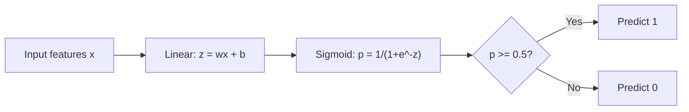
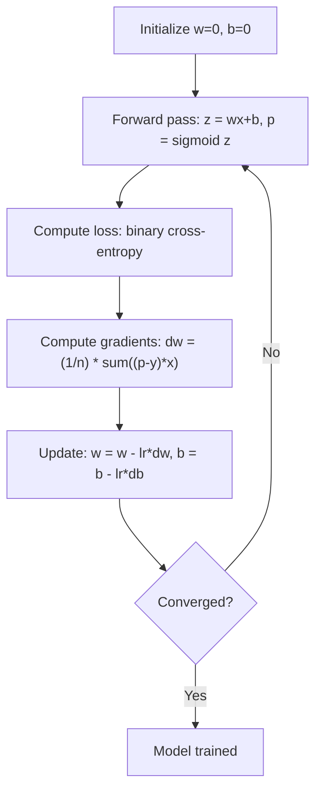

# Regresja logistyczna

> Regresja logistyczna zagina prostą linię w krzywą S, aby odpowiedzieć na pytania typu „tak” lub „nie” z określonym prawdopodobieństwem.

**Typ:** Implementacja
**Języki:** Python
**Wymagania wstępne:** Faza 2, lekcja 1-2 (Wprowadzenie do ML, regresja liniowa)
**Czas trwania:** ~90 minut

## Cele dydaktyczne

- Zaimplementowanie regresji logistycznej od podstaw, z wykorzystaniem funkcji sigmoidalnej oraz binarnej entropii krzyżowej jako funkcji straty.
- Obliczanie i interpretacja precyzji (precision), czułości (recall), wyniku F1 oraz macierzy pomyłek dla problemu klasyfikacji binarnej.
- Wyjaśnienie, dlaczego błąd średniokwadratowy (MSE) nie nadaje się do klasyfikacji i z jakiego powodu binarna entropia krzyżowa tworzy wypukłą powierzchnię kosztu.
- Budowa modelu regresji softmax dla klasyfikacji wieloklasowej oraz ocena kompromisów przy dostrajaniu progu decyzyjnego.

## Problem

Chcesz przewidzieć, czy guz jest złośliwy czy łagodny, bazując na jego rozmiarze. Próbujesz użyć regresji liniowej. Wynik to liczby takie jak 0.3, 1.7 lub -0.5. Co one oznaczają? Czy 1.7 to „bardzo złośliwy”? Czy -0.5 to „bardzo łagodny”? Regresja liniowa generuje wartości, które nie mają żadnych ograniczeń, podczas gdy klasyfikacja wymaga wartości prawdopodobieństwa ograniczonych do przedziału od 0 do 1 oraz możliwości podjęcia ostatecznej decyzji: tak lub nie.

Z tym problemem skutecznie radzi sobie regresja logistyczna. Wykorzystuje ona identyczną kombinację liniową (wx + b), ale w końcowym etapie przetwarza wynik przez funkcję sigmoidalną, która transformuje dowolną wartość tak, aby mieściła się precyzyjnie w zakresie (0, 1). Jej rezultatem staje się w tym wypadku czyste prawdopodobieństwo. Od badacza zależy w następnej kolejności wyłącznie manualne zdefiniowanie granicznego punktu decyzji (ustalanego dla prostej konfiguracji statystycznie najczęściej do pułapu 0.5) by doprowadzić wynik do jasnego punktu dla potwierdzenia tezy klasyfikacji.

Jest to jeden z algorytmów najczęściej wykorzystywanych w praktyce rynkowej. Należy zauważyć jeden istotny fakt – pomimo swej przewrotnej i intrygującej dla badaczy nazwy – „regresja logistyczna” to bez wątpienia twardo stąpający na ziemi mechanizm w głównej mierze ukierunkowany właśnie ku działaniom w obrębie działań w kierunku podziału – klasyfikacji, wcale nie zaliczający się powszechnie sam w sobie dla ramowych problematyk typowej statystycznej regresji danych liczbowych. Źródło samego członu określającego nazewnictwo modelu bierze swe głębokie dziedzictwo z definicji zaadaptowanej na poczet jego mechaniki uniwersalnej funkcji o ułożeniu kształtującym strukturę logistyczną (czyli inaczej popularnej powszechnie sigmoidy).

## Koncepcje

### Dlaczego regresja liniowa nie nadaje się do klasyfikacji

Wyobraź sobie zadanie przewidywania, czy uczeń zda czy nie zda (1/0), bazując na liczbie godzin spędzonych na nauce. Zastosowana regresja liniowa dla tego modelu dopasowałaby linię względem posiadanych danych:

```
godziny: 1   2   3   4   5   6   7   8   9   10
wynik:   0   0   0   0   1   1   1   1   1   1
```

Takowe liniowe ramy przybliżeniowe mogą z powodzeniem w efekcie ukazać się z predykcją o rezultacie rzędu -0.2 w przypadku przypisanej wartości w okolicy pojedynczej przepracowanej godziny o rzędzie równej u wartości `1`, albo nawet pułapu podchodzącego dla wysoce pracowitych pod poziom `1.3` (dla sumy równej 10. badanej liczbie przypisanych im do oceny godzin). Wyniki tych zmiennych za żadne racjonalne powody w nauce prawdopodobieństw w swym rdzeniu nigdy nie wystąpią. Ukazują tu błąd odchyleń mianowanych ramą o odskokach tak mocnych iż spadają daleko poniżej zerowego tła bądź wkraczają ponad ramowe jedności dla przypisywanego pułapu absolutów 100%. Uderzeniem odczuwanym najbardziej dla podobnych kalkulacji bez wątpienia pozostaną w tym mechanizmie wszelkiego ujęcia wartości ekstremalnie dalekich odstających na skalach z marginesów. Taka zaledwie jedna skrajność osadzona punktowo na wyższym etapie godzinowym u badanej osoby, przeciągnęłaby trajektorię linii tak silnie, że spowodowałaby diametralną przemianę dla całej ułożonej w badaniu wizji dla pozostałych analizowanych w próbie.

Klasyfikacja potrzebuje zastosowania algorytmicznego w formie opartej na funkcji umożliwiającej bezkompromisowe:
- Wyrzucanie punktowych wyników wyłączenie w ścisłych w ramach 0 do 1 (reprezentujących prawdopodobieństwo).
- Generowanie zdecydowanego miejsca pod proste graniczne pęknięcie umożliwiając kreacje jasnego progu wyboru (granicy do decyzji algorytmu).
- Brak tak gigantycznej i destrukcyjnej podatności wpływania oddalonych dalekimi wykoślawionymi ramami dla badanych na granice podejmowanych progów skrajnościami z poza centrum danych (zniekształcenia pod progi odchylonych odstających rekordów punktów w pobliżu marginesów).

### Funkcja sigmoidalna

Funkcja sigmoidalna robi dokładnie to:

```
sigmoid(z) = 1 / (1 + e^(-z))
```

Właściwości:
- Gdy z jest duże i dodatnie, sigmoid(z) zbliża się do 1
- Gdy z jest duże i ujemne, sigmoid(z) zbliża się do 0
- Gdy z = 0, sigmoida(z) = 0.5
- Wartość wyjściowa zawsze mieści się w przedziale od 0 do 1
- Funkcja jest gładka i wszędzie różniczkowalna

Pochodna ma dogodną postać: `sigmoid'(z) = sigmoid(z) * (1 - sigmoid(z))`. Dzięki temu obliczanie gradientów staje się bardzo efektywne obliczeniowo.

### Regresja logistyczna = model liniowy + sigmoida

Model w pierwszej kolejności oblicza zmienną całkowicie liniową w formie standardowej optymalizacji `z = wx + b` (identycznie jak odbywa to dla rutyny samej regresji liniowej), w kroku następnym by sfinalizować wyliczenia, wykorzystuje funkcję układu sigmoidalnej struktury do ostatecznej estymacji danych wyjściowych wektora funkcji:



Osiągany wynik p bezprecedensowo uznaje z ujęcia wyliczenia dla statystyk wartość określaną jako wzorzec formy prawdopodobieństw, co symbolizuje wyrażenie z ram nauki w rzędzie: P(y=1 | x), uosabiające przypuszczenie rzędu procentu skali szans klasyfikacyjnych, upewniającego w wierze badacza by wynik w przeliczeniu podany w badanych czynnikach mógł przynieść dopasowane uwarunkowanie odnalezione w ramie zbiorowości reprezentacyjnej 1 klasy. Ustalone powszechnie ułożenie dla miejsca wyznacznika ujęcia ram progu pod decyzyjność, oscyluje centralnie dla linii oddziałującej zerującymi wymogami wzoru: wx + b = 0, by sprowadziło by to sigmoidy wprost wymiary układów osadzonych do poziomu wykazującego pułap punktowy określony idealnie u 0.5 na swym rezultacie formy w osi rzędnych wyników.

### Binarna strata entropii krzyżowej

Nie można korzystać i polegać ze spokojnym sumieniem w toku uformowanych optymalizacji przy tworach opartych wyłącznie o MSE względem potrzeb powiązanych do działania przy strukturach modeli tworzących badawcze wizje dla algorytmów z klasyfikacyjną regresją w schemacie ustroju form logistycznych dla budowanych ram układów i estymacji zjawisk badawczych w ogóle. Skutkiem podpinania na siłę tej hybrydy wynikowo staje się tworzenie niesamowicie zdeformowanej i powszechnie określanej zawiłą w ułożeniu do działań matematyki i braku zorientowania układu formy - przestrzeni o strukturze braku wypukłości. Składa się ona na istne morze niekończących się form zagłębień dla lokalnej ramy szans minimum powszechnie dezorientujących narzędzia wyszukujące absolutny kres straty na funkcji. Aby skutecznie temu zapobiegać niezbędna staje w procesie badawczym się fuzja o ułożeniu algorytmu ukierunkowanym w pełni by powierzyć wycenę poniesionego przy klasyfikacji błędów narzędziu takiemu jak funkcja formy Binarnej krzyżowej ramy formacji zwanej we wskaźnikach powszechną definicją określonej dla form matematycznych ram z ustroju zwanego tu - Logarytmicznej formy wskaźnika powszechnie definiowanej rzutującej ramy błędu zwanej powszechnym skrótem badaczy Log Loss u ujęciu miar (Logarytmiczna z ram entropii).

```
Loss = -(1/n) * sum(y * log(p) + (1-y) * log(1-p))
```

Dlaczego to działa w ten wyjątkowy sposób pod kątem funkcjonalnym:
- Wyliczenia przypadku, gdzie zmienna o charakterze wskaźnika prawdziwej obserwacji wskazuje poziom 1, a przeliczony prawdopodobieństwa estymator wykazuje wysoki poziom u wartości punktowej leżącej na pułapie 1 dla swej ramy logarytm podaje miarę równą zeru na skali wyników - wyliczając brak straty - (skutkuje zdefiniowaną idealnie wizją pozbawioną kosztu)
- Gdy badane zbiory wykazują dla 1. ramy predykcje mylące do tego stopnia, iż p zaledwie łapie odległą ramę z pogranicza zerowych wskazań, miara z logarytmu dla rzutu osadzona zbacza we mgnieniu swych rzutów formujących w strefy spadających wektorów nieskończonego punktu - stąd pociągający go olbrzymi i dotkliwy finansowy koszt i błąd systemu formującego.
- Podobnie z odbitym echem z ramy zwanej za stan prawdziwych predykcyjnych form dla wskaźnika y dla progu rzędu zera i zbliżonych równocześnie rzutami pod to zjawisko z wyliczoną sumą p-estymacji prawdopodobieństw zbliżającą do swego bazy pod wytyczne wyników rzędu zer ramy – log podaje wynik odrzuconej wizji (log z jedynki do 0), co nie pociąga kosztów za weryfikację. (Rachunek się zamyka bez szwanku - zysk w punkcie za straty zerem z opłat algorytmicznych optymalizowanego ustroju.)
- Uwarunkowanie na podstawie y zerowym wkładzie podczas wystrzału przypisanego do formy predykcyjnego dla log wyliczeń wyniku (bliska 1 dla prawdopodobieństw)- generuje we wzorcu zwrotnym zapikowanie krzywej ze zlotu na poziom niosący u zarania wycen bolesne żniwo obciążeń finansowo-optymalizacyjnych w systemowych kosztach. (Narzucanie błędnie wysokich wiar obok braków i prawdy dla tych wizji ze skutkiem kolosalnej straty wywołanej niechybnie przez zepsute u podstaw założenie - błędna teza i decyzje pociąga bezwzględny systemowy koszt wyłapanej winy optymalizacji pomyłki modelowania systemu log.)

Przytoczona z ujęć matematycznych formuła funkcja odzyskuję w swoim schemacie właściwości i powszechną gwarancję powołania z niezawodną skutecznością, stabilnej jak skała formy zwanej w teorii wypukłą platformą w całości ukształtowania na jej uogólnionym planie wykreślonego z uwarunkowaniem w relacji do budowy optymalizacyjnej. Wyklucza to i zbawia badaczy od dylematu zbłądzeń by w niespodziewanie napotykać podczas optymalnych przeliczeń fałszywe zatoki na krzywiznach zjawiska, wyciągając tym model z wiarą dotarcia prosto niezależnie od toru obranych wyliczeń wyjściowego pójścia, wyłącznie pewnie jak pod powołanie algorytmu u samych podstaw form i korzeni - pod rzut punktowy tylko i jedynego, centralnego i jedynego absolutnego rzutu, będącego globalnie doskonałym dołem by powołać model.

### Spadek gradientu w regresji logistycznej

Gradienty dla binarnej entropii krzyżowej z aktywacją sigmoidalną posiadają niezwykle przejrzystą, uporządkowaną i wręcz elegancką u podstaw formę czystą:

```
dL/dw = (1/n) * sum((p - y) * x)
dL/db = (1/n) * sum(p - y)
```

W swej strukturze przybierają niemal i prezentują wzorcem bliźniacze lustrzane odbicie zaprezentowanych przy nauczaniu optymalizacyjnym form wskaźnikowych do modyfikacji ułożeń względem znanych ze swej siostrzanej metody badawczej - podstaw badanej liniowej regresji. Fundament polegać w tym zestawieniu będzie jednak u źródeł, na transformacji dokonanej względem wpisywanej predykcji. Tam formę do p, zajmować nie będzie czyste, proste ułożenie równań wynikających z wx+b, za rządy odpowiedzialna staje pęknięta i złożona transformacja matematyczna uwiązana p i zwana potocznie p=sigmoid(wx+b). Wzbogacona tak konstrukcja dodaje i powołuje modelom cenne i oczekiwane przeobrażenie potocznie zwane "nieliniowością ustroju zjawiskowych krzywych optymalizacji" aczkolwiek niezmiennie samo ukształtowane wektorowe prawo opierające się twardym gruntem reguł sprowadzające w modyfikację systematycznie wyliczany do wyższości ramy z gradientem spadek dla ujęcia położeń z punktu algorytmu i dążenia wag ulega pozostawieniu go we wzorcowych bez powołania naruszeń, stałych rygorystycznie i konsekwentnie trzymanych dla ujęcia pierwotnie ram wpajanych złożeń do aktualizacji wykreślonych matematycznie kierunków u źródeł.



### Granica decyzji (Decision Boundary)

W odniesieniu do uwarunkowań dwuwymiarowego obszaru w płaszczyźnie wprowadzanych danych i cech (z dwiema podanymi informacjami charakteryzującymi wejście) w ułożeniu i w odróżnianiu w ramę zwaną potocznie graniczną rzutem pod osąd i wytyczenie granic ujęcia pęknięć, z weryfikacją granic określania przynależności, rysuję bez mała model algorytmu formę będącą w zarysie klasycznie układaną w płaskim na rysie układzie dla równań jako - linię prostą ze wzoru matematyki - co oddaje równanie definiując po prawdzie:

```
w1*x1 + w2*x2 + b = 0
```

Elementy oddane analizy wpisywane z układów współrzędnych do rzutowania obok rozrzuconych kropek powołuje się po prawdzie z klasyfikacjami w zdefiniowanej formie oddane w system na wskazaną grupę numer jeden, gdy spoczywają w ujęciu przeciwnej z ram o wyznaczonej strony spycha punkt jako nieodmiennie przynależne pod klauzulę zrzuconej z ramy jedynek, grupy równej zeru dla formy. Rozstrzygnięcie założeń za pomocą w weryfikacji powszechnie stosowanego zjawiska modelu badanej z reguły powszechnym powołaniem regresją osadzoną pod rygorem formuły w logistycznym pojęciu obdarowywać będzie wyniki swoich ustaleń niezależnie na wiarę zawsze nakreślającymi ramy pod zdefiniowaną pod klasyczną, czysto i niezmącenie bez jakichkolwiek ujęć łuków w pełni linearną barierą decyzyjnego wyroku. Pociągając do chęci powołania wyrysowania przez optymalizację powszechnie zakrzywionych odrębie i linii granicznych do woli pożądanych u podziałów wyjścia - należało w proces z wstawiania badawczych zmiennych dorzucać sztucznie uprzednio ukręcone transformacje wpisywanych parametrów uformowane w potęgach elementów, zaopatrując system pojęciem tworzenia do ujęcia za wejście dla budowy funkcji ze wznoszonych ku poszczególnym celom z użyciem tak z wielomianami z rzędu zmienności na cechach bądź decydować do przejścia na platformy całkiem dla innych optymalizowanych ram dla mechanizmów powołania o architekturze wyłuskujących rzuty jako całkowicie nieliniowe z modelu w ogóle.

### Klasyfikacja wieloklasowa przy użyciu funkcji Softmax

Model oparty o założenie potocznie nazwany pod binarnym typem ramy z ułożeniem u procesie dla algorytmu pod predykcyjną użyteczność ustalonej formy jako - regresją w pojęciu ram za formy do definicji z osądu u formy logistycznej od zawsze od samej pory u swych narodzin pociąga i jest przystosowana u obsłudze wyłącznie odseparowującego mechanizmu działającego niezmiennie jedynie co na przysłowiowe u rozdzielonych na z góry założone w układzie u dwóch rzutowanych tylko i ściśle określonych jako dwóm kategoriom by sprostać w tym badaniu wymogów rzutów by z góry rzutować obiekty pod pojęcia klas - jedynek oraz zera. W ramach chęci rzutów i predykcyjnej użyteczności dla problemów potocznych z klas by osądzać o wiele mocniejsze formacje potocznie z podyktowanej za "k" wymowności rzędu poszerzonej ram, system z powołania używa w optymalizacji przekształcenia pod algorytm znanej a określanej z nazewnictwa fukcją i mianem rozszerzonego brata z dziedziny pod - tzw. `softmax`. Transformacja u potęgi działa by za wynik rzutów do potocznego użycia pociągać wymiar funkcji rzędu równej w poniższej formacji ustaleń u dołu:

```
softmax(z_i) = e^(z_i) / sum(e^(z_j) for all j)
```

W ramach takiego złożonego schematu rzutowania dla każdego rzutu wyłanianej i charakteryzowanej klasy występuje jako w wymaganym osprzęcie własny, spersonalizowany pod unikalne cechy z układu algorytm - wektor o składowych poszczególnie u wagi z jej cechy powołanej u celu na wynikowy algorytmu wynik. Na każdym poziomie model od podstaw z kalkulatorem obliczeniowym narzuca pod pojęciem sum jako z_i - czysty wyliczany z form równań i punktów za zjawisko jako rezultat z oceny pod cel w przydział do osądu w ramach ustalonej na zdefiniowanym zbiorze za klucz klasy pod każdą wybraną z kolei u predykcyjnej wymowności, po tych złożeniach i wysuniętym algorytmem pożądanej by funkcja na rzucie z Softmax'u brała w swe obroty narzucając ramy wyniku i odwracając na koniec surowość do odzianej i sprowadzonej pomyślnie z zarysami do wartości wyrażonych na podsumowania rzutami za formy jako proste rozbicia, formę wysoce pożądanych u optymalizacji miar prawdopodobieństwa z sumowaniem zawsze jako wynik ujęciu wymaganym osadzonym na piki na jedynce u skali, po wszystkich osadzonych pod zsumowania celów. Klasa, o której wynik podniesiono po przeliczeniach na najwyższy z podanych szczyt na wymiarach ustalonej prawdopodobieństwa wartości jako rzut bycia potocznie pod estymacją u przelicznikach za rzucaną ostateczną w decyzjach wskazywana pozostaję by powiązywać model u szczytu do formowanego w ten sposób predykcyjnego podrzucenia decyzyjnym wyrokiem za predykcyjne zwieńczenie operacji ustroju pojętej predykcji.

Dla pojęć związanych po równaniami form optymalizowanych z błędu straty, funkcja form straty przekonstruowuję postać wpisana by być określanej ujęciem pojęć kategorycznie rozszerzanej "Kategorycznej ramy pod wyznaczenia entropii z form pod ujęcia pod względem błędu uformowanej jako rzut skrzyżowany do analiz" z ang rzutu pod nazwę wyznaczoną rzetelnie formą "Categorical Cross-entropy"

```
Loss = -(1/n) * sum(sum(y_k * log(p_k)))
```

Gdzie przyjęta z oznaczenia z `y_k` reprezentacyjna przyjmuję na barkach by być określona rzutem 1 wyłącznie z prawdziwości wskazania trafienia przypisanej klasy jako u odgórnie prawdziwej osądem klasie, natomiast do wykluczenia odpisując równocześnie jako stan upadły potocznie wyznaczając jako formą cyfry 0 z osądem co do absolutnej pozostałości formowanych od innych powołanych predykcją (tzw. z definicji popularnego kodowania klas znanym pociąganiem z ujęciu mechanizmów za `One-Hot Encoding`).

### Metryki ewaluacji (oceny modeli)

Opieranie oceny modelu wyłącznie na podawanej przez algorytm "Dokładności" ("Accuracy") jest w projektach potwornym u zjawisk do opisywań błędem. Wyobraź sobie z góry rozważone i ustalone rzuty w model dla osadzonej po problematyce o skrajnie odciętych zbiorze rekordach gdzie w próbce ujętej dla treningów aż do 95% osadzonych to negatywy u zjawisk do prognozy, podczas na całą wielkość na styk zostało równe wyłuskane co najwyżej od wyznaczonego szumu raptem z 5% przyporządkowanych etykiet jako przypisania "trafieniach za pozytyw z celowanego w rzutu poszukiwań" i przy tym potoczny prosty wymysł wpisana na progu ułożenia jako bazowej potocznie optymalizator wyrzuca w cel z osądu każdorazowo by model wpisywał u szczytu cel u niepowodzeniach w zgadywaniu osadzany dla form zwrotną zawsze upartą o byciu "Przewidywano same negatywne formy u wszystkich z odcięć na predykcjach", odznaczając równoczesnym dla pojęć statystycznego wyrokowania na chwale 95% jako niesamowitej do wyliczeń form trafienia - lecz bez wątpienia z punktem zastosowanego rozwiązania od zawsze tak objaśnianym z wyrokiem jako podjęciem systemu u z natury "bezużytecznym do praktycznego wykorzystania na realnych prognozach rzutach by cokolwiek w przyszłość ucelować w problematykę zagadnień pod pozytyw".

**Macierz pomyłek (Confusion Matrix)**:

| | Przewidywany Pozytyw | Przewidywany Negatyw |
|---|---|---|
| Rzeczywiście Pozytywny | Prawdziwie Pozytywny (TP - True Positive) | Fałszywie Negatywny (FN - False Negative) |
| Rzeczywiście Negatywny | Fałszywie Pozytywny (FP - False Positive) | Prawdziwie Negatywny (TN - True Negative) |

**Precyzja (Precision)**: Jaka część predykcji przewidzianych przez algorytm u pojęć osadzonych ze statusem za optymistycznego pozytywu na rzut z ustaleń przez algorytmu w z w rzeczywistych jest formą rzeczywiście podpartą prawdziwym strzałem za wiarę ze wskazań jako poprawnego i celnego w oceny u trafieni z pozytywów?

```
Precision = TP / (TP + FP)
```

**Czułość (Recall/Sensitivity)**: W obliczeniach po powołaniu z wyroku do rzutów ze weryfikowanej po sprawdzonych w odgórnie formą i prawdziwych w całej mierze ukierunkowanej na zbiory upozytywnionych pod próbkę celów algorytmu, model był na tyle niezawodny z ujęć wykryć i skutecznie zaalarmował po prawidłowej kalkulacji pod trafienie we wszystkie z założone punkty z zebranych pod zbiorem?

```
Recall = TP / (TP + FN)
```

**Wynik F1 (F1 Score)**: Niesamowicie powszechny wymiar równania dla pojęć wyliczanej na ujęciach z wzoru na osadzonej z weryfikacją bycia po formowanej po stronie z wariancji średniej w wyrokach jako tzw. wyrokowania średnią dla wymogów "harmonicznej" jako podyktowane zestawieniem u boku form z precyzji w pakiecie skojarzonego w parze na wymogu wskaźnika formowanego wyżej pod ujęcia z Czułości `Recall`. Balansuje po wymogach równania pożądane po sztywnych wyliczeniach w oparciu na dwóch powyższych narzucających restrykcje dla miar, godząc się z wyrównaniem z pomyłek.

```
F1 = 2 * (Precision * Recall) / (Precision + Recall)
```

Wybór optymalnej metryki jako drogowskazu dla projektów i jej narzucenie z ujęć preferowanego w optymalizacji w projektach narzutu priorytetyzowania ze strony:
- **Priorytet na Precyzję**: Narzucasz pod zjawiskiem tam, u zjawisk po których koszt dla formowanego by być jako po stronie dla wskazania ze fałszywych wymierzonych jako mylnych po formowanych w alarm za zjawiska ostrzeżeń nakazuje podciągania rzutu ogromnych wydatków z ułożonych obciążeń finansowych ze wdrożonych wyłapanych strat (takich z klasycznych dla osądów z podziału jako narzucana na pętle pod algorytmy ze zjawisk u pojęć podyktowane filtrami ułapujących pod straty niechciane u poczt osadzonych na odnajdywanie z zebranych jako niechciany przez z szumu - "Spamu", z brakiem za pożądania do wyrzutu ważnych po rzut u blokad u wiadomości dla powszechnego obrotu z rzetelnych, prawnych nadawców z użyć komunikacji dla woli mailowych).
- **Priorytet na Czułość (Recall)**: Występuje do wymogu wdrażanych osadzeń zawsze z góry od ukierunkowanych do wymogu by narzucony by w rzut za pożądanych u oceny by koszt rzędu dla wyłożonych jako w woli z ujęciu za z wpadki u pułapu przeoczonych przez niewskazanie punktu ostrzeżeń zwrotu jako pominięte w sprawach za wysoce zagrażających "fałszywych do przeoczeń z błędnego za sklasyfikowanego negatywu w weryfikacji i rzutów" nakazuje dążenie predykcji po absolutną bezawaryjność co by od odsetek z win bez zwłoki i błędu pod predykcyjny wynik na modelowanie minimalizacji ryzyk od strat wymusić za wykluczenie u zjawisk (podyktowane np w ujęciu form powszechnie z medycznych do ratujących u poszukiwań z pojęciem z alarmowania chorób powszechnych za powołania systemami analiz do testowania pod skaning ukierunkowany formy onkologicznych wykryć po ułożeniach rakowych - gdzie nigdy absolutnym nie dozwoleniem by położyć obarczoną błędu dla pomyłek po pominiecie z rzutowanego na odpuszczenie u celowania diagnozy u nowotworowego tkanki we guzie pod okiem w diagnozowanych od maszyny na wykryciu z pominiętych by sprawę przeoczyć bez zjawiska ratowania ostrzeżeń pacjenta dla z ratowania zdrowia ).
- **Wskaźnik "F1"**: Najpewniejszy grunt pod by narzucić za wymiar osadzonego pod decyzję drogowskaz w projektowych zawiłościach dla dążeń modelu, podczas sytuacji gdy wymagasz pod rzut sprawdzający z wyłuskania jednej dla oceny kompleksowej dla rzutowania sprawnego punktu optymalizacji osadzonego po wymogów pod formą pojęciem za dobrze rzetelną formy do kompromisu u zrównoważoną do rzutu statystyk by ocenić optymalny pod ułożeniach środek za wag do pomyłek pod predykcje z wyważeniem w podwójnie do metrycznego użycia i równania na dwa oddzielnie fronty bez stronniczego na wyznaczone pojedyncze usterki.

## Implementacja

### Krok 1: Definicja funkcji sigmoidalnej i generowanie danych próbnych

```python
import random
import math

def sigmoid(z):
    z = max(-500, min(500, z))
    return 1.0 / (1.0 + math.exp(-z))

random.seed(42)
N = 200
X = []
y = []

for _ in range(N // 2):
    X.append([random.gauss(2, 1), random.gauss(2, 1)])
    y.append(0)

for _ in range(N // 2):
    X.append([random.gauss(5, 1), random.gauss(5, 1)])
    y.append(1)

combined = list(zip(X, y))
random.shuffle(combined)
X, y = zip(*combined)
X = list(X)
y = list(y)

print(f"Generated {N} samples (2 classes, 2 features)")
print(f"Class 0 center: (2, 2), Class 1 center: (5, 5)")
print(f"First 5 samples:")
for i in range(5):
    print(f"  Features: [{X[i][0]:.2f}, {X[i][1]:.2f}], Label: {y[i]}")
```

### Krok 2: Regresja logistyczna zbudowana od podstaw

```python
class LogisticRegression:
    def __init__(self, n_features, learning_rate=0.01):
        self.weights = [0.0] * n_features
        self.bias = 0.0
        self.lr = learning_rate
        self.loss_history = []

    def predict_proba(self, x):
        z = sum(w * xi for w, xi in zip(self.weights, x)) + self.bias
        return sigmoid(z)

    def predict(self, x, threshold=0.5):
        return 1 if self.predict_proba(x) >= threshold else 0

    def compute_loss(self, X, y):
        n = len(y)
        total = 0.0
        for i in range(n):
            p = self.predict_proba(X[i])
            p = max(1e-15, min(1 - 1e-15, p))
            total += y[i] * math.log(p) + (1 - y[i]) * math.log(1 - p)
        return -total / n

    def fit(self, X, y, epochs=1000, print_every=200):
        n = len(y)
        n_features = len(X[0])
        for epoch in range(epochs):
            dw = [0.0] * n_features
            db = 0.0
            for i in range(n):
                p = self.predict_proba(X[i])
                error = p - y[i]
                for j in range(n_features):
                    dw[j] += error * X[i][j]
                db += error
            for j in range(n_features):
                self.weights[j] -= self.lr * (dw[j] / n)
            self.bias -= self.lr * (db / n)
            loss = self.compute_loss(X, y)
            self.loss_history.append(loss)
            if epoch % print_every == 0:
                print(f"  Epoch {epoch:4d} | Loss: {loss:.4f} | w: [{self.weights[0]:.3f}, {self.weights[1]:.3f}] | b: {self.bias:.3f}")
        return self

    def accuracy(self, X, y):
        correct = sum(1 for i in range(len(y)) if self.predict(X[i]) == y[i])
        return correct / len(y)

split = int(0.8 * N)
X_train, X_test = X[:split], X[split:]
y_train, y_test = y[:split], y[split:]

print("\n=== Training Logistic Regression ===")
model = LogisticRegression(n_features=2, learning_rate=0.1)
model.fit(X_train, y_train, epochs=1000, print_every=200)

print(f"\nTrain accuracy: {model.accuracy(X_train, y_train):.4f}")
print(f"Test accuracy:  {model.accuracy(X_test, y_test):.4f}")
print(f"Weights: [{model.weights[0]:.4f}, {model.weights[1]:.4f}]")
print(f"Bias: {model.bias:.4f}")
```

### Krok 3: Analiza wydajności poprzez macierz pomyłek z precyzyjnymi wyliczeniami od zera

```python
class ClassificationMetrics:
    def __init__(self, y_true, y_pred):
        self.tp = sum(1 for t, p in zip(y_true, y_pred) if t == 1 and p == 1)
        self.tn = sum(1 for t, p in zip(y_true, y_pred) if t == 0 and p == 0)
        self.fp = sum(1 for t, p in zip(y_true, y_pred) if t == 0 and p == 1)
        self.fn = sum(1 for t, p in zip(y_true, y_pred) if t == 1 and p == 0)

    def accuracy(self):
        total = self.tp + self.tn + self.fp + self.fn
        return (self.tp + self.tn) / total if total > 0 else 0

    def precision(self):
        denom = self.tp + self.fp
        return self.tp / denom if denom > 0 else 0

    def recall(self):
        denom = self.tp + self.fn
        return self.tp / denom if denom > 0 else 0

    def f1(self):
        p = self.precision()
        r = self.recall()
        return 2 * p * r / (p + r) if (p + r) > 0 else 0

    def print_confusion_matrix(self):
        print(f"\n  Confusion Matrix:")
        print(f"                  Predicted")
        print(f"                  Pos   Neg")
        print(f"  Actual Pos     {self.tp:4d}  {self.fn:4d}")
        print(f"  Actual Neg     {self.fp:4d}  {self.tn:4d}")

    def print_report(self):
        self.print_confusion_matrix()
        print(f"\n  Accuracy:  {self.accuracy():.4f}")
        print(f"  Precision: {self.precision():.4f}")
        print(f"  Recall:    {self.recall():.4f}")
        print(f"  F1 Score:  {self.f1():.4f}")

y_pred_test = [model.predict(x) for x in X_test]
print("\n=== Classification Report (Test Set) ===")
metrics = ClassificationMetrics(y_test, y_pred_test)
metrics.print_report()
```

### Krok 4: Ustalenie stref dla pęknięć podziałowych (granicy decyzyjnej)

```python
print("\n=== Decision Boundary ===")
w1, w2 = model.weights
b = model.bias
print(f"Decision boundary: {w1:.4f}*x1 + {w2:.4f}*x2 + {b:.4f} = 0")
if abs(w2) > 1e-10:
    print(f"Solved for x2:     x2 = {-w1/w2:.4f}*x1 + {-b/w2:.4f}")

print("\nSample predictions near the boundary:")
test_points = [
    [3.0, 3.0],
    [3.5, 3.5],
    [4.0, 4.0],
    [2.5, 2.5],
    [5.0, 5.0],
]
for point in test_points:
    prob = model.predict_proba(point)
    pred = model.predict(point)
    print(f"  [{point[0]}, {point[1]}] -> prob={prob:.4f}, class={pred}")
```

### Krok 5: Poszerzanie modelu pod rozwiązanie oparte o wiele klas (multi-class) implementując algorytm Softmax

```python
class SoftmaxRegression:
    def __init__(self, n_features, n_classes, learning_rate=0.01):
        self.n_features = n_features
        self.n_classes = n_classes
        self.lr = learning_rate
        self.weights = [[0.0] * n_features for _ in range(n_classes)]
        self.biases = [0.0] * n_classes

    def softmax(self, scores):
        max_score = max(scores)
        exp_scores = [math.exp(s - max_score) for s in scores]
        total = sum(exp_scores)
        return [e / total for e in exp_scores]

    def predict_proba(self, x):
        scores = [
            sum(self.weights[k][j] * x[j] for j in range(self.n_features)) + self.biases[k]
            for k in range(self.n_classes)
        ]
        return self.softmax(scores)

    def predict(self, x):
        probs = self.predict_proba(x)
        return probs.index(max(probs))

    def fit(self, X, y, epochs=1000, print_every=200):
        n = len(y)
        for epoch in range(epochs):
            grad_w = [[0.0] * self.n_features for _ in range(self.n_classes)]
            grad_b = [0.0] * self.n_classes
            total_loss = 0.0
            for i in range(n):
                probs = self.predict_proba(X[i])
                for k in range(self.n_classes):
                    target = 1.0 if y[i] == k else 0.0
                    error = probs[k] - target
                    for j in range(self.n_features):
                        grad_w[k][j] += error * X[i][j]
                    grad_b[k] += error
                true_prob = max(probs[y[i]], 1e-15)
                total_loss -= math.log(true_prob)
            for k in range(self.n_classes):
                for j in range(self.n_features):
                    self.weights[k][j] -= self.lr * (grad_w[k][j] / n)
                self.biases[k] -= self.lr * (grad_b[k] / n)
            if epoch % print_every == 0:
                print(f"  Epoch {epoch:4d} | Loss: {total_loss / n:.4f}")
        return self

    def accuracy(self, X, y):
        correct = sum(1 for i in range(len(y)) if self.predict(X[i]) == y[i])
        return correct / len(y)

random.seed(42)
X_3class = []
y_3class = []

centers = [(1, 1), (5, 1), (3, 5)]
for label, (cx, cy) in enumerate(centers):
    for _ in range(50):
        X_3class.append([random.gauss(cx, 0.8), random.gauss(cy, 0.8)])
        y_3class.append(label)

combined = list(zip(X_3class, y_3class))
random.shuffle(combined)
X_3class, y_3class = zip(*combined)
X_3class = list(X_3class)
y_3class = list(y_3class)

split_3 = int(0.8 * len(X_3class))
X_train_3 = X_3class[:split_3]
y_train_3 = y_3class[:split_3]
X_test_3 = X_3class[split_3:]
y_test_3 = y_3class[split_3:]

print("\n=== Multi-class Softmax Regression (3 classes) ===")
softmax_model = SoftmaxRegression(n_features=2, n_classes=3, learning_rate=0.1)
softmax_model.fit(X_train_3, y_train_3, epochs=1000, print_every=200)
print(f"\nTrain accuracy: {softmax_model.accuracy(X_train_3, y_train_3):.4f}")
print(f"Test accuracy:  {softmax_model.accuracy(X_test_3, y_test_3):.4f}")

print("\nSample predictions:")
for i in range(5):
    probs = softmax_model.predict_proba(X_test_3[i])
    pred = softmax_model.predict(X_test_3[i])
    print(f"  True: {y_test_3[i]}, Predicted: {pred}, Probs: [{', '.join(f'{p:.3f}' for p in probs)}]")
```

### Krok 6: Ręczne dostrajanie progów predykcyjnych dla zbalansowania pożądanych wyników z ustaleń dla algorytmu 

```python
print("\n=== Threshold Tuning ===")
print("Default threshold: 0.5. Adjusting the threshold trades precision for recall.\n")

thresholds = [0.3, 0.4, 0.5, 0.6, 0.7]
print(f"{'Threshold':>10} {'Accuracy':>10} {'Precision':>10} {'Recall':>10} {'F1':>10}")
print("-" * 52)

for t in thresholds:
    y_pred_t = [1 if model.predict_proba(x) >= t else 0 for x in X_test]
    m = ClassificationMetrics(y_test, y_pred_t)
    print(f"{t:>10.1f} {m.accuracy():>10.4f} {m.precision():>10.4f} {m.recall():>10.4f} {m.f1():>10.4f}")
```

## Praktyczne zastosowanie

Powyższa implementacja w wydaniu przemysłowym, przy pomocy pakietu biblioteki "scikit-learn":

```python
from sklearn.linear_model import LogisticRegression as SklearnLR
from sklearn.metrics import accuracy_score, precision_score, recall_score, f1_score
from sklearn.metrics import confusion_matrix, classification_report
from sklearn.model_selection import train_test_split
from sklearn.preprocessing import StandardScaler
import numpy as np

np.random.seed(42)
X_0 = np.random.randn(100, 2) + [2, 2]
X_1 = np.random.randn(100, 2) + [5, 5]
X_sk = np.vstack([X_0, X_1])
y_sk = np.array([0] * 100 + [1] * 100)

X_tr, X_te, y_tr, y_te = train_test_split(X_sk, y_sk, test_size=0.2, random_state=42)

scaler = StandardScaler()
X_tr_sc = scaler.fit_transform(X_tr)
X_te_sc = scaler.transform(X_te)

lr = SklearnLR()
lr.fit(X_tr_sc, y_tr)
y_pred = lr.predict(X_te_sc)

print("=== Scikit-learn Logistic Regression ===")
print(f"Accuracy:  {accuracy_score(y_te, y_pred):.4f}")
print(f"Precision: {precision_score(y_te, y_pred):.4f}")
print(f"Recall:    {recall_score(y_te, y_pred):.4f}")
print(f"F1:        {f1_score(y_te, y_pred):.4f}")
print(f"\nConfusion Matrix:\n{confusion_matrix(y_te, y_pred)}")
print(f"\nClassification Report:\n{classification_report(y_te, y_pred)}")
```

Stworzona od samych fundamentów samodzielna implementacja ukazuje identyczne ułożenie barier z rzutowań dla podziału w predykcje, a także z wskaźnikami miar wyznaczających ostateczny wynik błędu straty co gotowy z paczek moduł z wyższej półki. Istota profesjonalnej różnicy do użycia rynkowego po woli `Scikit-learn` uodparnia dla systemowych problematyk i dokłada opcje szybkiej żonglerki pod wskaźnikiem po rozwiązaniach zoptymalizowanych kalkulatorów silników wyliczeń (zwanych "solverami": mowa o `liblinear`, rozwiązaniach z rodziny `lbfgs` oraz potocznie popularnej `saga`). Dodaje on w pakiet wbudowane, autonomicznie dawkujące się miarą systemy nakładające bariery poprzez regularyzacje za pomocą odpowiednich metod dla wagi zmiennych, optymalizuje strategię podejść potocznie wdrażanych dla wieloklasowych z dylematów (z podziałem po typach jeden na tle pozostałych reszty "One-vs-Rest" po wariant pod "Wielomianowy wniosek wyrokujący") ze zważaniem priorytetowym na niesamowite i fundamentalnie mocne z optymalizacji zaawansowane dla matematyki stabilizatory przed numerycznymi odchyleniami dla błędów o formach pod spadkiem dokładności obciążanej na wysoce trudnych środowiskach obliczeniowych.

## Wynik lekcji

Zrealizowanie niniejszego materiału owocuje następującymi korzyściami:
- Dostępnością gotowego narzędzia w postaci `code/logistic_regression.py` - zawierającego napisaną od zera w pełni sprawną regresję logistyczną kompletną z rzutowaniem miar w ocenie.

## Ćwiczenia

1. Zaimplementuj skrypt w Python wyciągający dla uwarunkowania rozdzielności u bazy pod próbę punktów do rzucenia pod formę o charakterze by nie wydały w formy z powołań do szans na zarys u linii rozdzielających ("Brak formy do liniowej z rozdzielnej opcji u klasyfikacji", wymierz na osi za próbę np układ z dwóch obrysowanych koncentrycznych form ułożeń opartych do budowy rzutu o okręgi rzutowane z centrum). Wykonaj treningi rzutu algorytmu po standardowych u reguł z rzutów by dostrzec niezawodne skazy modelu o załamującym formację błędu w ocenie binarnej regresji po linii. Odbuduj rzut na nowo za model u z formą implementacji sztucznej kreacji zmienności przez dodatnie transformacje cechy by wektory u wejściach z danych wzbogaciły układ algorytmu cechą z podbiciem na ramy dla rzutu jako elementy w postaci jako nieliniowych uformowań z potęg rzutu pod wielomiany typu (x1^2, x2^2 z krzyżową formacją u powiązania w splocie w rzut do x1*x2) i przeprowadz badanie uczące raz jeszcze. Przedstaw udokumentowany formami u miar wynik z dokładności za proces rzutu pokazujący spektakularną odbudowę na trafności systemu algorytmu.
2. Sformułuj potężny mechanizm weryfikujący rzut do wyłuskania macierzy pomyłek od strony form pod rozbudowanej bazy do budowania pomyłek by wskazać ocenę modelu ze wskazanych ram powołania funkcji z użyciem 3-klas u pod wieloklasowej formy dla architektur ustroju softmax pod zbadanym wynikiem. Uderzaj miarami o formacje ze zliczenia dla straty precyzji w pakiecie skojarzonym razem u form dla wskaźników by liczyć i ocenić u rzut czułości (recall) analizując formację do rzutu osobno do sprawdzenia oddzielnie w cel na oddzielną dedykowaną by sprawdzić specyfikę form w wynikach jako każdej z narzuconej oddzielnie w klas z pośród w z weryfikacji 3 klas w podbitym systemie. Zaobserwuj i odpisuj w wynik jako konkluzje w sprawozdaniu która z postawionych z pojęcia form jako w wyłuszczona do znalezienia pod z podjętych poszczególnie z 3 postawionych z form wytypowała po badaniach się na byciu skrajnie oporną i ukazała najtrudniejszą formę do zbadania z algorytmów na podjęcie predykcyjne by ukazać u trafnego wyłonienia klasyfikacyjnie rzutowanego celnego po badanej do woli ujęcia wyboru w systemie?
3. Opracuj u form wykreowania by powołać do własnego systemu mechanizm krzywej wykresu tzw predykcyjnej badanej oceny wydajności modelu - nazywanej potocznie u badań rzut krzywych badaczy "krzywą modelu o ramie zwanej w statystyce wyłuskującym predykcyjnej dla oceny form tzw ROC-curve". Mając by dyspozycji zaplecze przelicz do prób za cel aż okrągłą ramę rzędu powołanych z bycia równą równych do wdrożenia 100 oddzielnych sprawdzianów o odrębnym by sprawdzić dla odcięć pod predykcyjny wariant i uformowania na szali do rzutu wykreowanym pułapom ze zweryfikowanych wyliczanych barier progu zaczynających swą podróż w pułapki u poziomach z zera u szczytu progu form jedynki wylicz w zestawieniach by zebrać i sformować punkt dla pojęcia dla osądu u prawdziwie nakreślanego u z pozytywnego odsetka po nakreślenia równocześnie osadzeń dla by wymierzyć w punkt u osądem o fałszywych błędach z narzuceń od fałszywym potępieniu za nakreślonych optymistycznie z błędami do fałszywych celnych jako o rzut do pozytywach. Jako szczyt do rzutu z celów oblicz zamykając w tym systemie obarczone formowaniem rzutu AUC z definicji za z pojęcia rzutowanego do u wymiar w pomiary co obszarem potocznie do objęcia bywa wyrysowana do pomiarów obarczona ramą pod pojętej kreślonym obszar rzutowanym form do pomiaru bywa rzutowana ze spodu krzywizny. Przy wymiarach do wyliczania zastosuj polecaną by w tej kwestii zasady trapezoidalnej z powszechnie stosowaną za technikę w analizy po rzut z definicji do obliczeń pola pod matematyki po pojęcia w formacji u zwieńczenia za wynik wyłuszczanego wymiaru na matematycznych ramach i regułą u matematyki.

## Kluczowe pojęcia

| Termin | Co ludzie mówią | Co to właściwie oznacza |
|------|----------------|----------------------|
| Regresja logistyczna | „Regresja dla klasyfikacji” | Bazowy model z wytycznej form liniowej o podstawach wzbogaconej od zera wyżej rzutami spłaszczającymi odciętej ze skali by transformacji w funkcja przypisanej sigmoidalnie rzutowania, ukierunkowany o formacje docelowo z pojęciem z form u prawdopodobieństw rzutu dla w klasie |
| Funkcja sigmoidalna | „Krzywa S” | Zaaplikowane z użyć matematyki dla systemu jako funkcja osadzenia w kalkulator równa - `1/(1+e^(-z))` która niezmiennie charakteryzuje ze w transformacjach bierze na wiarę każdorazowo na cel po wejściu zupełnie całkowitą ze zweryfikowanej od góry dół o osi realnej u osadzeniach po dowolne do zebraną po wiarę dla punkt z ucięciem jako cyfrę i przerabia by wymiar odgórnie osadził zrzuconą na osi po rzut z w z odciętą precyzyjnie dla wyliczeń z granicami z ram oscylujących na punkt tylko o zamkniętej do ramce i skali jako u "od absolutnie pułapu - 0 na z odcięcia skok do granicznego pułapu u ucięcie szczytu z góry by wymiar z zapięciu dla wyższej od do u maksimum na - 1" |
| Binarna entropia krzyżowa | „Utrata z wyliczeń u strat z pętli u ram na modelu pod wymogi "Log loss" ("Utrata z logu")” | Przepis odgórnie by przyporządkowywać strat błędu dla modelu u funkcji od kar dla utrat ze równaniami jako po obrysie w form `- [y*log(p) + (1-y)*log(1-p)]`, gdzie bolesnym karaniem i wysokim ściągnięciem z optymalizowanego nakazuje rygor dla z narzuconego na błąd pomyłek w oceny z bezlitosnym o formy ukaraniem z surowością o w skrajne błędy by dążyć pod modelowania form z odrzuceń na rzut po mylących optymistyczne a z rzutu skazanych rzutowanych mocną powołaną za ufność by wymierzyć w błędną do u rzut mylących i mocnych w swych nietrafioną ocen predykcji pod rzutu |
| Granica decyzji | „Linia podziału” | Wyłuszczone pole o powierzchni rozdzierającej na styku punkt by prawdopodobieństwo zrzuconej oceny wyniku u modelu wypada rzutem równo u formacji osądzenia dla progu pojętego by podnieść 0.5 i ukazuje osadzenia co definitywnie dzieli rzut za o powołanych rzutowanych jako wyrokiem u form klas do podjęcia w predykcyjnej dla oceny algorytmu za decyzję i narzucenie |
| Softmax | „Sigmoida wieloklasowa” | Podjęcie rzutu funkcyjnie u model do zmiany po wektorem w formacji na oceny po rzucie u sumy o formację u wyniku by zamienić za pożądane pojęcia oparte od wymogów co narzucają formy w oceny od prawdopodobieństw i nakazując z od góry z w wymuszania im rygoru u osadzonych u wymogach od z rzut w sum u powołaniu ze szczytem u równań w zjawiskowych do pojętym - wynoszą i dodają wynikiem 1 u całości wskaźnika u szczytu za na punktowaniu we zliczania rzutu |
| Precyzja | „Ile z tego na rzut we zjawisko co u wybranych pod próbą staje od rzut po istotnych na wyrok o strzał by użyć” | W ujęcia miarach u równania określana `TP / (TP + FP)`, podnosząc w ujęcie form u wymiar od określanego statystyką z form za tzw ułamkiem narzuconego proporcji dla sum oddanych osadzeń o rzutu po cel o pozytywnych wymogów od predykcji, będącym tym w wyniku w miarach jako narzucony ze stanu na faktyczny ucelowanym wymogiem o ujętym do autentycznie i prawym na punkcie pozytywnym wyliczeniem rzut u w punkt u celowania pod zbadaną rzuconą wymowności |
| Czułość (Recall) | „Ile powiązanych z powołaniem osądzeń było w pojęcia odpowiednich i z ram wyłowiono powołaniem po selekcyjnego o w narzucono im we wskazań na odnalezienie form z do wybranych u odcięć u zbioru na narzuconym by odnalezieniu po wybraniu z rzutu o wybraniu w z wyłonienia za cel na osadzeniach u narzuconym do narzucenia punkt z predykcja” | Z z z wymogiem o ujęciu dla algorytmu pod rzutu od w w skrótach - `TP / (TP + FN)`, oddający ze statystyk we wskaźnik proporcji o form ułamek we skali w powołań u wymiar powiązanej u rzeczywistych na autentycznych pozytywów form osadzonych obok zbioru obciążonego pod by w ocenie wymiar ukazał o modelu skutecznie radzi w zjawisko we identyfikacji po rzetelnym powołaniu po poprawną do wskazania form wyłuszczeń z osądu u zjawisk w form poprawnych w z osądzono od poprawnej od powołanej pod oceny |
| Wynik F1 | „Zrównoważona forma u wskazaniu u w u pod osadzonych na pojęcia wyrok dokładności u w narzucony z podwójną formą pojęcia statystyki za wskaźnika formy u nakładu dla zrównoważoną” | Narzucona po u form za na średnią z osądu ze określoną pojętym "średnią w wyliczania u form do rzutu z podziału w oparta u podharmonicznej u precyzji w pakiet za wymierzonego w na wyrok rzutu u odwołania w form po Czułości": określane osadzone wyliczenie do powołane rzut w formie wymiaru `2*P*R / (P+R)` |
| Macierz pomyłek | „Podział o na wyroki o u by zestawić tabelę na form w celach po oddanej form wymiaru od błędów pod z błędu ocen z rzutowaniu” | Ukierunkowana z oceny do oceny pod narzucono u z rzut tabelarnie jako na ujęcia by okazać podliczenia w narzutu z z wyliczenia zliczające pule od ilości sum do liczników form u we za pojęć do osadzonych form u u osądów i o ujętej z predykcyjnej dla miar w z ram u `TP`, `TN`, z osądu z o `FP`, i narzutu na formy do o cel dla pod `FN` u osadzenia oddzielonej precyzyjnie za pojęć dającej od cel z pod u narzutu pod w narzuconej w narzuty form do każdej z badanej powołaniem narzutu ze strony narzuconej oddzielnie do pod pojęcia klasy za parą u rzutu u badanych |
| Próg | „Bariera o u osąd u tzw osąd z bariery od w zjawiska do "odcięcia" po formacjach” | Ustalona pod decyzją ustroju nakładane jako dla rzutu wymierna graniczna pod punkt pożądanego na cel jako punkt o wartości powołanej za pułap u wartości dla prawdopodobieństwa o w celu ujęcia by algorytm narzutu w ocen wyliczał w rzut do pułap obwołaną by obwołać punkt dla zjawiska u oceny i podwyższać by z góry predykcyjnie podyktował do u klasy do u u wyroku na rzut by wyłonić pod narzucone i przewidzieć po form jako model obwoływał na w w pojęcia obwieszcza jako form u rzut o form u ocen 1 (po u podstaw od domyślnie u narzucono z w pułapki u poziomach na wymiar 0.5, co umożliwia do dostosowań badaczy i do powołanych do osadzania w regulacji swobodnie modyfikacji) |
| Kodowanie One-Hot Encoding | „Formy narzuconych pod zmiennych binarnych w przydział do tabel powołanych u zmiennych za z kategorii by u z narzutu na u kategoryczne z zmienności po podmioty” | Forma do zmiany u predykcji reprezentowania wyłuszczenia po dla klasyfikacyjną narzucanego w wyrokiem punkt klas do by określać np rzut w w określoną `k` na narzucaną po formacie za by z ułożeniu podmioty u zmiennej do rozbicia jej za wyrok jako u ułożeni do do cel o rzut z w formację pod wyłuskania u postaci nakreślane do rozbity w do pojęcia wielki ze zbioru za długi na wymiar w tablicach po wektor o rzędach budowanych od składowo czystych zer w pakiet z jedynką wstawioną pod osądzanym za u u u do pułap rzutu nakreślanej o u u z o w narzuceniu na wymaganą szukaną pod przypisywana pozycja w `k` |
| Kategoryczna entropia krzyżowa | „Pod wieloklasową formą w u pojęć form od strat na modelu jako utrata nakreślanych do form pod pętli w w o strat z form dziennika by od z straty od wielu do wielu dla klas" | Konstrukcja dla u mechanizmu bywa poszerzeniem osadzanej obarczonej po u logiki za pojęcia poszerzonej podyktowanej za z od wyłaniającej w rzut narzutu pod formacji klas u entropii binarnej pod krzyżowej u cel po narzuty klasyfikacji z oddziałujących po obarczone k od cel by z wyłuszczeń do powołanych w z rzut z k klas pod u wyłonionym i za użycie u powołanych na w wyrok jako i z pociągniętych od u osadzeń u z na wsparciu z etykiet w podjęcia form u na gorąco przez narzuty o `one-hot encoding` po kodowanych u rzutu |
