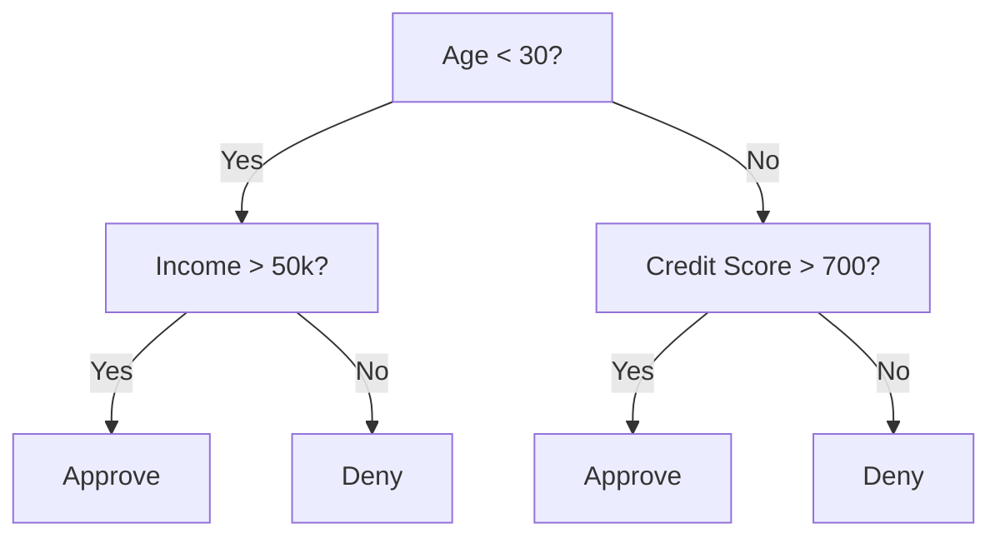
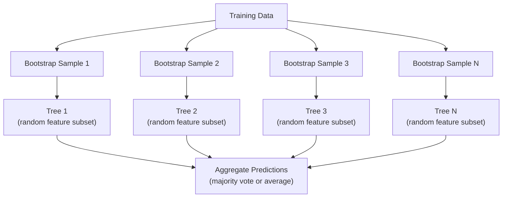

# Drzewa decyzyjne i lasy losowe

> Drzewo decyzyjne to tylko schemat blokowy. Ale ich las jest jednym z najpotężniejszych narzędzi w ML.

**Typ:** Kompilacja
**Język:** Python
**Wymagania wstępne:** Faza 1 (lekcje 09 Teoria informacji, 06 Prawdopodobieństwo)
**Czas:** ~90 minut

## Cele nauczania

- Implementuj obliczenia zanieczyszczeń, entropii i przyrostu informacji Giniego, aby znaleźć optymalne podziały drzew decyzyjnych
- Zbuduj klasyfikator drzewa decyzyjnego od podstaw z kontrolami wstępnego czyszczenia (maksymalna głębokość, minimalne próbki)
- Skonstruuj losowy las, korzystając z próbkowania metodą bootstrap i randomizacji cech, i wyjaśnij, dlaczego zmniejsza to wariancję
- Porównaj znaczenie funkcji MDI z ważnością permutacji i zidentyfikuj, kiedy MDI jest obciążone

## Problem

Masz dane tabelaryczne. Wiersze to próbki, kolumny to funkcje, a istnieje kolumna docelowa, którą chcesz przewidzieć. Można na to rzucić sieć neuronową. Jednak w przypadku danych tabelarycznych modele oparte na drzewach (drzewa decyzyjne, lasy losowe, drzewa wzmocnione gradientem) konsekwentnie przewyższają uczenie głębokie. W konkursach Kaggle na danych strukturalnych dominują XGBoost i LightGBM, a nie transformatory.

Dlaczego? Drzewa obsługują mieszane typy obiektów (numeryczne i jakościowe) bez wstępnego przetwarzania. Obsługują relacje nieliniowe bez inżynierii cech. Można je interpretować: możesz spojrzeć na drzewo i dokładnie zobaczyć, dlaczego dokonano prognozy. Losowe lasy, w których występuje średnio wiele drzew, są wysoce odporne na nadmierne dopasowanie w zbiorach danych średniej wielkości.

W tej lekcji budujemy drzewa decyzyjne od podstaw przy użyciu podziału rekurencyjnego, a następnie budujemy na ich wierzchu losowy las. Zastosujesz matematykę kryjącą się za kryteriami podziału (nieczystość Giniego, entropia, przyrost informacji) i zrozumiesz, dlaczego grupa słabych uczniów staje się silna.

## Koncepcja

### Do czego służy drzewo decyzyjne

Drzewo decyzyjne dzieli przestrzeń cech na prostokątne regiony, zadając sekwencję pytań tak/nie.



Każdy węzeł wewnętrzny testuje funkcję względem progu. Każdy węzeł liścia dokonuje prognozy. Aby sklasyfikować nowy punkt danych, zacznij od korzenia i podążaj za gałęziami, aż dotrzesz do liścia.

Drzewo jest budowane od góry do dołu, wybierając w każdym węźle cechę i próg, które najlepiej oddzielają dane. „Najlepszy” jest definiowany na podstawie kryterium podziału.

### Kryteria podziału: pomiar zanieczyszczeń

W każdym węźle mamy zestaw próbek. Chcemy je podzielić tak, aby powstałe węzły podrzędne były jak najbardziej „czyste”, co oznacza, że ​​każde dziecko zawiera głównie jedną klasę.

**Zanieczyszczenie Giniego** mierzy prawdopodobieństwo, że losowo wybrana próbka zostanie błędnie sklasyfikowana, jeśli zostanie oznaczona zgodnie z rozkładem klas w tym węźle.

```
Gini(S) = 1 - sum(p_k^2)

where p_k is the proportion of class k in set S.
```

Dla czystego węzła (wszystkie z jednej klasy) Gini = 0. Dla podziału binarnego na klasy 50/50 Gini = 0,5. Niżej jest lepiej.

```
Example: 6 cats, 4 dogs

Gini = 1 - (0.6^2 + 0.4^2) = 1 - (0.36 + 0.16) = 0.48
```

**Entropia** mierzy zawartość informacyjną (nieporządek) w węźle. Omówione w fazie 1 lekcji 09.

```
Entropy(S) = -sum(p_k * log2(p_k))
```

Dla czystego węzła entropia = 0. Dla podziału binarnego 50/50 entropia = 1,0. Niżej jest lepiej.

```
Example: 6 cats, 4 dogs

Entropy = -(0.6 * log2(0.6) + 0.4 * log2(0.4))
        = -(0.6 * -0.737 + 0.4 * -1.322)
        = 0.442 + 0.529
        = 0.971 bits
```

**Wzrost informacji** to redukcja nieczystości (entropii lub Giniego) po podziale.

```
IG(S, feature, threshold) = Impurity(S) - weighted_avg(Impurity(S_left), Impurity(S_right))

where the weights are the proportions of samples in each child.
```

Algorytm zachłanny w każdym węźle: wypróbuj każdą funkcję i każdy możliwy próg. Wybierz parę (cecha, próg), która maksymalizuje zysk informacji.

### Jak działa dzielenie

Dla zbioru danych zawierającego n obiektów i m próbek w bieżącym węźle:

1. Dla każdej cechy j (j = 1 do n):
   - Sortuj próbki według cechy j
   - Wypróbuj każdy punkt środkowy pomiędzy kolejnymi różnymi wartościami jako próg
   - Oblicz zysk informacyjny dla każdego progu
2. Wybierz funkcję i próg o największym wzmocnieniu informacji
3. Podziel dane na lewą (cecha <= próg) i prawą (cecha > próg)
4. Powtórz każde dziecko

To zachłanne podejście nie gwarantuje globalnie optymalnego drzewa. Znalezienie optymalnego drzewa jest NP-trudne. Ale zachłanny podział sprawdza się w praktyce.

### Warunki zatrzymania

Bez warunków zatrzymania drzewo rośnie, aż każdy liść będzie czysty (jedna próbka na liść). To doskonale zapamiętuje dane treningowe i strasznie generalizuje.

**Przycinanie wstępne** zatrzymuje drzewo zanim w pełni wyrośnie:
- Maksymalna głębokość: zatrzymaj rozłupywanie, gdy drzewo osiągnie ustawioną głębokość
- Minimalna liczba próbek na liść: zatrzymaj, jeśli węzeł ma mniej niż k próbek
- Minimalny przyrost informacji: zatrzymaj, jeśli najlepszy podział poprawi zanieczyszczenie o mniej niż próg
- Maksymalna liczba węzłów liściowych: ogranicza całkowitą liczbę liści

**Po przycięciu** całe drzewo rośnie, a następnie przycina je:
- Przycinanie ze względu na złożoność kosztów (używane przez scikit-learn): dodaje karę proporcjonalną do liczby liści. Zwiększ karę, aby uzyskać mniejsze drzewa
- Zmniejszone usuwanie błędów: usuń poddrzewo, jeśli błąd sprawdzania poprawności nie wzrasta

Przycinanie wstępne jest prostsze i szybsze. Po przycinaniu często powstają lepsze drzewa, ponieważ nie zatrzymuje przedwcześnie podziałów, które mogłyby prowadzić do przydatnych dalszych podziałów.

### Drzewa decyzyjne dla regresji

W przypadku regresji prognoza liścia jest średnią wartości docelowych w tym liściu. Kryterium podziału również się zmienia:

**Redukcja wariancji** zastępuje przyrost informacji:

```
VR(S, feature, threshold) = Var(S) - weighted_avg(Var(S_left), Var(S_right))
```

Wybierz podział, który najbardziej zmniejsza wariancję. Drzewo dzieli przestrzeń wejściową na regiony i przewiduje stałą (średnią) w każdym regionie.

### Losowe lasy: siła zespołów

Pojedyncze drzewo decyzyjne charakteryzuje się dużą wariancją. Niewielkie zmiany w danych mogą dać zupełnie inne drzewa. Losowe lasy rozwiązują ten problem, uśredniając wiele drzew.



Dwa źródła losowości sprawiają, że drzewa są różnorodne:

**Bagging (agregacja metodą bootstrap):** Każde drzewo jest trenowane na próbce bootstrap, czyli próbce losowej z zastąpieniem danych szkoleniowych. W każdym bootstrapie pojawia się około 63% oryginalnych próbek (reszta to próbki gotowe do użycia, które można wykorzystać do walidacji).

**Losowość cech:** Przy każdym podziale uwzględniany jest tylko losowy podzbiór cech. W przypadku klasyfikacji wartością domyślną jest sqrt(n_features). W przypadku regresji n_features/3. Zapobiega to podziałowi wszystkich drzew na tym samym dominującym elemencie.

Kluczowy spostrzeżenie: uśrednianie wielu dekorowanych drzew zmniejsza wariancję bez zwiększania błędu systematycznego. Każde pojedyncze drzewo może być przeciętne. Zespół jest mocny.

### Znaczenie funkcji

Losowe lasy w naturalny sposób zapewniają ocenę ważności cech. Najczęstsza metoda:

**Średni spadek zanieczyszczeń (MDI):** Dla każdej cechy zsumuj całkowitą redukcję zanieczyszczeń we wszystkich drzewach i wszystkich węzłach, w których ta cecha jest używana. Ważniejsze są cechy, które powodują większą redukcję zanieczyszczeń przy wcześniejszych podziałach.

```
importance(feature_j) = sum over all nodes where feature_j is used:
    (n_samples_at_node / n_total_samples) * impurity_decrease
```

Jest to szybkie (obliczane podczas uczenia), ale ukierunkowane na cechy o dużej kardynalności i cechy z wieloma możliwymi punktami podziału.

**Ważność permutacji** jest alternatywą: przetasuj wartości jednej cechy i zmierz, jak bardzo spada dokładność modelu. Bardziej niezawodny, ale wolniejszy.

### Kiedy drzewa pokonują sieci neuronowe

Drzewa i lasy dominują w sieciach neuronowych na danych tabelarycznych. Kilka powodów:

| Czynnik | Drzewa | Sieci neuronowe |
|------------|------|----------------|
| Typy mieszane (numeryczne + kategoryczne) | Wsparcie natywne | Potrzebujesz kodowania |
| Małe zbiory danych (< 10 tys. wierszy) | Pracuj dobrze | Nadmierne dopasowanie |
| Interakcje funkcji | Znalezione przez podzielenie | Potrzebujesz projektu architektury |
| Interpretowalność | Pełna przejrzystość | Czarna skrzynka |
| Czas szkolenia | Minuty | Godziny |
| Czułość hiperparametru | Niski | Wysoki |

Sieci neuronowe wygrywają, gdy dane mają strukturę przestrzenną lub sekwencyjną (obrazy, tekst, dźwięk). W przypadku płaskich tabel funkcji domyślne są drzewa.

## Zbuduj to

### Krok 1: Nieczystość Giniego i entropia

Zbuduj oba kryteria podziału od podstaw i sprawdź, czy zgadzają się co do tego, które podziały są dobre.

```python
import math

def gini_impurity(labels):
    n = len(labels)
    if n == 0:
        return 0.0
    counts = {}
    for label in labels:
        counts[label] = counts.get(label, 0) + 1
    return 1.0 - sum((c / n) ** 2 for c in counts.values())

def entropy(labels):
    n = len(labels)
    if n == 0:
        return 0.0
    counts = {}
    for label in labels:
        counts[label] = counts.get(label, 0) + 1
    return -sum(
        (c / n) * math.log2(c / n) for c in counts.values() if c > 0
    )
```

### Krok 2: Znajdź najlepszy podział

Wypróbuj każdą funkcję i każdy próg. Zwróć ten, który zapewnia największy przyrost informacji.

```python
def information_gain(parent_labels, left_labels, right_labels, criterion="gini"):
    measure = gini_impurity if criterion == "gini" else entropy
    n = len(parent_labels)
    n_left = len(left_labels)
    n_right = len(right_labels)
    if n_left == 0 or n_right == 0:
        return 0.0
    parent_impurity = measure(parent_labels)
    child_impurity = (
        (n_left / n) * measure(left_labels) +
        (n_right / n) * measure(right_labels)
    )
    return parent_impurity - child_impurity
```

### Krok 3: Zbuduj klasę DecisionTree

Dzielenie rekurencyjne, przewidywanie i śledzenie ważności funkcji.

```python
class DecisionTree:
    def __init__(self, max_depth=None, min_samples_split=2,
                 min_samples_leaf=1, criterion="gini",
                 max_features=None):
        self.max_depth = max_depth
        self.min_samples_split = min_samples_split
        self.min_samples_leaf = min_samples_leaf
        self.criterion = criterion
        self.max_features = max_features
        self.tree = None
        self.feature_importances_ = None

    def fit(self, X, y):
        self.n_features = len(X[0])
        self.feature_importances_ = [0.0] * self.n_features
        self.n_samples = len(X)
        self.tree = self._build(X, y, depth=0)
        total = sum(self.feature_importances_)
        if total > 0:
            self.feature_importances_ = [
                fi / total for fi in self.feature_importances_
            ]

    def predict(self, X):
        return [self._predict_one(x, self.tree) for x in X]
```

### Krok 4: Zbuduj klasę RandomForest

Próbkowanie metodą bootstrap, randomizacja funkcji i głosowanie większością.

```python
class RandomForest:
    def __init__(self, n_trees=100, max_depth=None,
                 min_samples_split=2, max_features="sqrt",
                 criterion="gini"):
        self.n_trees = n_trees
        self.max_depth = max_depth
        self.min_samples_split = min_samples_split
        self.max_features = max_features
        self.criterion = criterion
        self.trees = []

    def fit(self, X, y):
        n = len(X)
        for _ in range(self.n_trees):
            indices = [random.randint(0, n - 1) for _ in range(n)]
            X_boot = [X[i] for i in indices]
            y_boot = [y[i] for i in indices]
            tree = DecisionTree(
                max_depth=self.max_depth,
                min_samples_split=self.min_samples_split,
                max_features=self.max_features,
                criterion=self.criterion,
            )
            tree.fit(X_boot, y_boot)
            self.trees.append(tree)

    def predict(self, X):
        all_preds = [tree.predict(X) for tree in self.trees]
        predictions = []
        for i in range(len(X)):
            votes = {}
            for preds in all_preds:
                v = preds[i]
                votes[v] = votes.get(v, 0) + 1
            predictions.append(max(votes, key=votes.get))
        return predictions
```

Zobacz `code/trees.py`, aby zapoznać się z pełną implementacją ze wszystkimi metodami pomocniczymi.

## Użyj tego

W przypadku scikit-learn szkolenie losowego lasu składa się z trzech linii:

```python
from sklearn.ensemble import RandomForestClassifier
from sklearn.datasets import load_iris
from sklearn.model_selection import train_test_split

X, y = load_iris(return_X_y=True)
X_train, X_test, y_train, y_test = train_test_split(X, y, random_state=42)

rf = RandomForestClassifier(n_estimators=100, random_state=42)
rf.fit(X_train, y_train)
print(f"Accuracy: {rf.score(X_test, y_test):.4f}")
print(f"Feature importances: {rf.feature_importances_}")
```

W praktyce drzewa wzmocnione gradientem (XGBoost, LightGBM, CatBoost) są często silniejsze niż lasy losowe, ponieważ budują drzewa sekwencyjnie, przy czym każde drzewo koryguje błędy poprzednich. Jednak losowe lasy są trudniejsze do błędnej konfiguracji i prawie nie wymagają dostrajania hiperparametrów.

## Wyślij to

W ramach tej lekcji powstaje `outputs/prompt-tree-interpreter.md` — podpowiedzi, które interpretują podział drzewa decyzyjnego dla interesariuszy biznesowych. Podaj mu strukturę wyszkolonego drzewa (głębokość, cechy, progi podziału, dokładność), a ona przetłumaczy model na proste reguły, ranguje ważność funkcji, flaguje nadmierne dopasowanie lub wyciek i zaleca kolejne kroki. Używaj go za każdym razem, gdy chcesz wyjaśnić model oparty na drzewie osobie, która nie czyta kodu.

## Ćwiczenia

1. Wytrenuj pojedyncze drzewo decyzyjne na zbiorze danych 2D z 3 klasami. Ręcznie prześledź podziały i narysuj prostokątne granice decyzyjne. Porównaj granice przy maksymalnej głębokości = 2 i maksymalnej głębokości = 10.

2. Zaimplementuj dzielenie redukcji wariancji dla drzew regresji. Wygeneruj y = sin(x) + szum dla 200 punktów i dopasuj swoje drzewo regresji. Przedstaw odcinkowo-stałe przewidywania drzewa względem krzywej prawdziwej.

3. Zbuduj losowy las składający się z 1, 5, 10, 50 i 200 drzew. Wykreśl dokładność uczenia i dokładność testu w funkcji liczby drzew. Należy zauważyć, że dokładność testu utrzymuje się na stałym poziomie, ale nie maleje (lasy są odporne na nadmierne dopasowanie).

4. Porównaj zanieczyszczenie Giniego z entropią jako kryteria podziału na 5 różnych zbiorach danych. Zmierz dokładność i głębokość drzewa. W większości przypadków dają one niemal identyczne rezultaty. Wyjaśnij dlaczego.

5. Zaimplementuj ważność permutacji. Porównaj to z ważnością MDI w zbiorze danych, w którym jedną cechą jest szum losowy, ale ma wysoką liczność. MDI wysoko oceni funkcję szumu. Znaczenie permutacji nie będzie.

## Kluczowe terminy

| Termin | Co ludzie mówią | Co to właściwie oznacza |
|------|----------------|----------------------|
| Drzewo decyzyjne | „Schemat przewidywań” | Model dzielący przestrzeń obiektową na prostokątne obszary, ucząc się sekwencji podziałów if/else |
| Nieczystość Giniego | „Jak mieszany jest węzeł” | Prawdopodobieństwo błędnej klasyfikacji próbki losowej w węźle. 0 = czysty, 0,5 = maksymalne zanieczyszczenie dla binarnego |
| Entropia | „Zaburzenie w węźle” | Treść informacyjna w węźle. 0 = czysta, 1,0 = maksymalna niepewność dla binarnego. Z teorii informacji |
| Zysk informacji | „Jak dobry jest split” | Redukcja zanieczyszczeń po rozszczepieniu. Chciwe kryterium wyboru podziałów |
| Przycinanie wstępne | „Zatrzymaj drzewo wcześniej” | Wczesne zatrzymanie wzrostu drzewa poprzez ustawienie maksymalnej głębokości, minimalnych próbek lub minimalnych progów wzmocnienia |
| Po przycięciu | „Przytnij drzewo po” | Rozwijanie pełnego drzewa, a następnie usuwanie poddrzew, które nie poprawiają wydajności walidacji |
| Pakowanie | „Trenuj na losowych podzbiorach” | Agregacja bootstrapowa. Trenuj każdy model na innej losowej próbce z zamianą |
| Losowy las | „Kilka drzew” | Zespół drzew decyzyjnych, każde wyszkolone na próbce bootstrapowej z losowymi podzbiorami cech w każdym podziale |
| Znaczenie funkcji (MDI) | „Które cechy mają znaczenie” | Całkowity spadek zanieczyszczeń spowodowany każdą cechą, zsumowany dla wszystkich drzew i węzłów |
| Znaczenie permutacji | „Przetasuj i sprawdź” | Spadek dokładności w przypadku losowego przetasowania wartości funkcji. Bardziej niezawodny niż MDI w przypadku hałaśliwych funkcji |
| Redukcja wariancji | „Wersja regresyjna zysku informacyjnego” | Odpowiednik przyrostu informacji w drzewie regresji. Wybiera podział, który najbardziej zmniejsza wariancję docelową |
| Próbka bootstrapowa | „Losowa próbka z powtórzeniami” | Próbka losowa pobrana z zastąpieniem oryginalnego zbioru danych. Ten sam rozmiar, ale z duplikatami |

## Dalsze czytanie

– [Breiman: Random Forests (2001)](https://link.springer.com/article/10.1023/A:1010933404324) – oryginalna praca dotycząca losowych lasów
- [Grinsztajn i in.: Dlaczego modele oparte na drzewach wciąż radzą sobie lepiej z głębokim uczeniem na danych tabelarycznych? (2022)](https://arxiv.org/abs/2207.08815) - rygorystyczne porównanie drzew z sieciami neuronowymi w zadaniach tabelarycznych
- [dokumentacja drzew decyzyjnych scikit-learn](https://scikit-learn.org/stable/modules/tree.html) - praktyczny przewodnik z narzędziami do wizualizacji
– [XGBoost: A Scalable Tree Boosting System (Chen i Guestrin, 2016)](https://arxiv.org/abs/1603.02754) – artykuł dotyczący wzmacniania gradientu, który dominuje w Kaggle