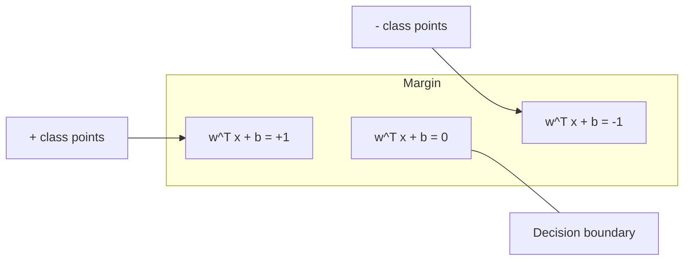
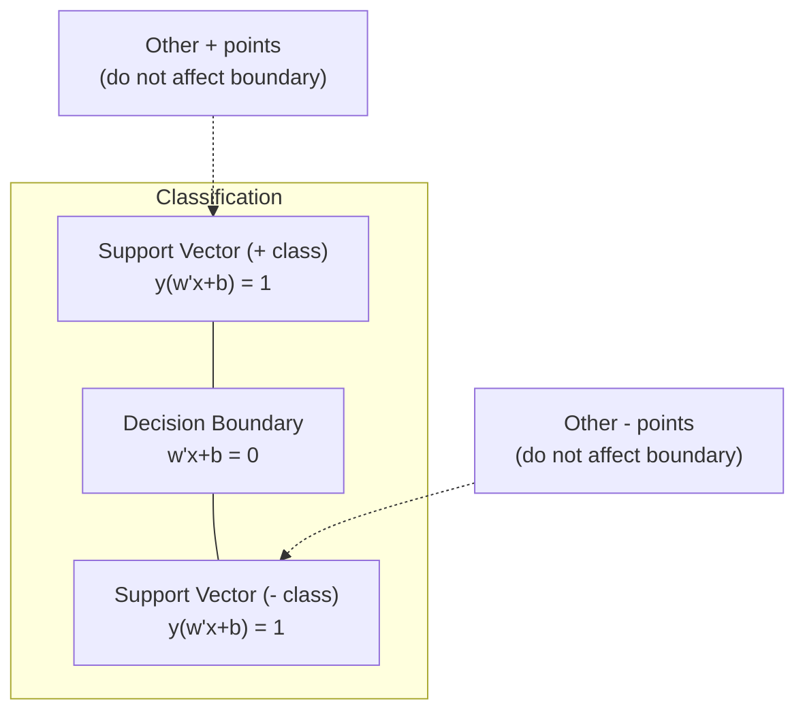
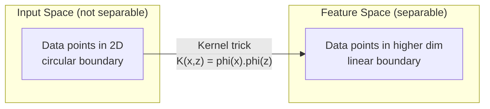

# Maszyny wektorowe wsparcia

> Znajdź najszerszą ulicę pomiędzy dwiema klasami. To jest cały pomysł.

**Typ:** Kompilacja
**Język:** Python
**Wymagania wstępne:** Faza 1 (lekcje 08 Optymalizacja, 14 Normy i odległości, 18 Optymalizacja wypukła)
**Czas:** ~90 minut

## Cele nauczania

- Zaimplementuj od podstaw liniową maszynę SVM, wykorzystując utratę zawiasów i opadanie gradientu w pierwotnej formule
- Wyjaśnij zasadę maksymalnego marginesu i zidentyfikuj wektory wsparcia na podstawie przeszkolonego modelu
- Porównaj jądra liniowe, wielomianowe i RBF i wyjaśnij, w jaki sposób sztuczka z jądrem pozwala uniknąć jawnego mapowania wielowymiarowego
- Oceń kompromis kontrolowany przez parametr C pomiędzy szerokością marginesu a błędami klasyfikacji

## Problem

Masz dwie klasy punktów danych i musisz narysować linię (lub hiperpłaszczyznę) oddzielającą je. Nieskończenie wiele linii mogłoby działać. Który wybrać?

Ten z największą marżą. Margines to odległość między granicą decyzji a najbliższymi punktami danych po każdej stronie. Większy margines oznacza, że ​​klasyfikator jest pewniejszy i lepiej uogólnia dane, których nie widać.

Ta intuicja prowadzi do maszyn wektorów nośnych, jednego z najbardziej eleganckich matematycznie algorytmów w uczeniu maszynowym. Maszyny SVM były dominującą metodą klasyfikacji przed głębokim uczeniem się i pozostają najlepszym wyborem w przypadku małych zbiorów danych, danych wielowymiarowych i problemów, w przypadku których potrzebny jest dobrze zrozumiany model oparty na zasadach z gwarancjami teoretycznymi.

Maszyny SVM łączą się bezpośrednio z fazą 1: optymalizacja jest wypukła (lekcja 18), margines jest mierzony za pomocą norm (lekcja 14), a sztuczka jądra wykorzystuje iloczyny skalarne do obsługi nieliniowych granic bez konieczności wykonywania obliczeń w przestrzeni wielowymiarowej.

## Koncepcja

### Klasyfikator maksymalnej marży

Biorąc pod uwagę liniowo separowane dane z etykietami y_i w {-1, +1} i wektorami cech x_i, chcemy hiperpłaszczyzny w^T x + b = 0, która oddziela klasy.

Odległość punktu x_i od hiperpłaszczyzny wynosi:

```
distance = |w^T x_i + b| / ||w||
```

Dla poprawnie sklasyfikowanego punktu: y_i * (w^T x_i + b) > 0. Margines jest dwukrotnością odległości od hiperpłaszczyzny do najbliższego punktu po obu stronach.



Problem optymalizacji:

```
maximize    2 / ||w||     (the margin width)
subject to  y_i * (w^T x_i + b) >= 1  for all i
```

Odpowiednio (minimalizacja ||w||^2 jest łatwiejsza do optymalizacji):

```
minimize    (1/2) ||w||^2
subject to  y_i * (w^T x_i + b) >= 1  for all i
```

Jest to wypukły program kwadratowy. Posiada unikalne, światowe rozwiązanie. Punkty danych znajdujące się dokładnie na granicach marginesów (gdzie y_i * (w^T x_i + b) = 1) są wektorami wsparcia. Są to jedyne punkty wyznaczające granicę decyzji. Przesuń lub usuń dowolny punkt niebędący wektorem podporowym, a granica nie ulegnie zmianie.

### Wektory wsparcia: kilka krytycznych



Większość punktów treningowych jest nieistotna. Liczą się tylko wektory wsparcia. Właśnie dlatego maszyny SVM są wydajne pod względem pamięci w czasie przewidywania: wystarczy przechowywać tylko wektory wsparcia, a nie cały zestaw treningowy.

Liczba wektorów nośnych wyznacza również granicę błędu uogólnienia. Mniej wektorów wsparcia w stosunku do rozmiaru zbioru danych oznacza lepszą generalizację.

### Miękki margines: obsługa szumu za pomocą parametru C

Prawdziwe dane rzadko dają się idealnie oddzielić. Niektóre punkty mogą znajdować się po niewłaściwej stronie granicy lub wewnątrz marginesu. Formuła miękkiego marginesu pozwala na naruszenia poprzez wprowadzenie zmiennych luzu.

```
minimize    (1/2) ||w||^2 + C * sum(xi_i)
subject to  y_i * (w^T x_i + b) >= 1 - xi_i
            xi_i >= 0  for all i
```

Zmienna luzu xi_i mierzy, w jakim stopniu punkt i narusza margines. C kontroluje kompromis:

| Wartość C | Zachowanie |
|--------|----------|
| Duże C | Surowo karze naruszenia. Wąski margines, mniej błędnych klasyfikacji. Overfits |
| Małe C | Pozwala na więcej naruszeń. Szeroki margines, więcej błędnych klasyfikacji. Niedopasowanie |

C to siła regularyzacji, odwrócona. Duże C = mniejsza regularyzacja. Małe C = większa regularyzacja.

### Strata zawiasu: funkcja straty SVM

Miękki margines SVM można przepisać jako optymalizację bez ograniczeń:

```
minimize    (1/2) ||w||^2 + C * sum(max(0, 1 - y_i * (w^T x_i + b)))
```

Termin max(0, 1 - y_i * f(x_i)) oznacza utratę zawiasu. Wynosi zero, gdy punkt jest poprawnie sklasyfikowany i poza marginesem. Ma charakter liniowy, gdy punkt znajduje się wewnątrz marginesu lub jest błędnie sklasyfikowany.

```
Hinge loss for a single point:

loss
  |
  | \
  |  \
  |   \
  |    \
  |     \_______________
  |
  +-----|-----|-------->  y * f(x)
       0     1

Zero loss when y*f(x) >= 1 (correctly classified, outside margin).
Linear penalty when y*f(x) < 1.
```

Porównaj ze stratą logistyczną (regresja logistyczna):

```
Hinge:     max(0, 1 - y*f(x))          Hard cutoff at margin
Logistic:  log(1 + exp(-y*f(x)))        Smooth, never exactly zero
```

Strata zawiasu daje rzadkie rozwiązania (tylko wektory nośne mają niezerowy udział). Straty logistyczne wykorzystują wszystkie punkty danych. Dzięki temu maszyny SVM są bardziej wydajne pod względem pamięci w czasie przewidywania.

### Trenowanie liniowego SVM z opadaniem gradientowym

Możesz trenować liniową SVM, używając gradientowego opadania na utracie zawiasu i regularyzacji L2, bez rozwiązywania ograniczonego QP:

```
L(w, b) = (lambda/2) * ||w||^2 + (1/n) * sum(max(0, 1 - y_i * (w^T x_i + b)))

Gradient with respect to w:
  If y_i * (w^T x_i + b) >= 1:  dL/dw = lambda * w
  If y_i * (w^T x_i + b) < 1:   dL/dw = lambda * w - y_i * x_i

Gradient with respect to b:
  If y_i * (w^T x_i + b) >= 1:  dL/db = 0
  If y_i * (w^T x_i + b) < 1:   dL/db = -y_i
```

Nazywa się to formułą pierwotną. Działa w O(n * d) na epokę, gdzie n to liczba próbek, a d to liczba cech. W przypadku dużych, rzadkich i wielowymiarowych danych (klasyfikacja tekstu) jest to szybkie.

### Podwójna formuła i sztuczka z jądrem

Dwoistość Lagrangianu problemu SVM (z fazy 1, lekcji 18, warunki KKT) to:

```
maximize    sum(alpha_i) - (1/2) * sum_ij(alpha_i * alpha_j * y_i * y_j * (x_i . x_j))
subject to  0 <= alpha_i <= C
            sum(alpha_i * y_i) = 0
```

Podwójny dotyczy tylko iloczynów skalarnych x_i . x_j pomiędzy punktami danych. To jest kluczowy spostrzeżenie. Zamień każdy iloczyn skalarny na funkcję jądra K(x_i, x_j), a SVM może nauczyć się granic nieliniowych bez bezpośredniego obliczania transformacji.

```
Linear kernel:      K(x, z) = x . z
Polynomial kernel:  K(x, z) = (x . z + c)^d
RBF (Gaussian):     K(x, z) = exp(-gamma * ||x - z||^2)
```

Jądro RBF odwzorowuje dane w nieskończonej przestrzeni wymiarowej. Punkty, które są blisko w przestrzeni wejściowej, mają wartość jądra bliską 1. Punkty, które są daleko od siebie, mają wartość jądra bliską 0. Może uczyć się dowolnej gładkiej granicy decyzyjnej.



Sztuczka z jądrem oblicza iloczyn skalarny w przestrzeni wielowymiarowej, bez konieczności wchodzenia tam. Dla jądra wielomianu stopnia d w wymiarach D jawna przestrzeń cech ma wymiary O(D^d). Ale K(x, z) oblicza się w czasie O(D).

### SVM dla regresji (SVR)

Regresja wektora nośnego dopasowuje rurkę o szerokości epsilon wokół danych. Punkty wewnątrz rurki mają zerową stratę. Punkty poza tubą są karane liniowo.

```
minimize    (1/2) ||w||^2 + C * sum(xi_i + xi_i*)
subject to  y_i - (w^T x_i + b) <= epsilon + xi_i
            (w^T x_i + b) - y_i <= epsilon + xi_i*
            xi_i, xi_i* >= 0
```

Parametr epsilon steruje szerokością rury. Szersza rura = mniej wektorów podparcia = gładsze dopasowanie. Węższa rurka = więcej wektorów podparcia = mocniejsze dopasowanie.

### Dlaczego maszyny SVM przegrały z głębokim uczeniem się (i kiedy nadal wygrywają)

Maszyny SVM zdominowały ML od końca lat 90. do początku 2010 r. Głębokie uczenie wyprzedziło je z kilku powodów:

| Czynnik | SVM | Głębokie uczenie się |
|------------|------|--------------|
| Inżynieria funkcji | Wymaga tego | Uczy się funkcji |
| Skalowalność | O(n^2) do O(n^3) dla jądra | O(n) na epokę z SGD |
| Obraz/tekst/audio | Potrzebuje funkcji wykonanych ręcznie | Uczy się na podstawie surowych danych |
| Duże zbiory danych (>100 tys.) | Powolny | Dobrze się skaluje |
| Przyspieszenie GPU | Ograniczona korzyść | Ogromne przyspieszenie |

Maszyny SVM nadal wygrywają w następujących sytuacjach:
- Małe zbiory danych (od setek do tysięcy próbek)
- Wysokowymiarowe, rzadkie dane (tekst z funkcjami TF-IDF)
- Gdy potrzebujesz gwarancji matematycznych (ograniczenia depozytu zabezpieczającego)
- Gdy czas szkolenia musi być minimalny (liniowy SVM jest bardzo szybki)
- Klasyfikacja binarna z przejrzystą strukturą marginesów
- Wykrywanie anomalii (SVM jednej klasy)

## Zbuduj to

### Krok 1: Utrata zawiasu i nachylenie

Fundament. Oblicz utratę zawiasów dla partii i jej gradientu.

```python
def hinge_loss(X, y, w, b):
    n = len(X)
    total_loss = 0.0
    for i in range(n):
        margin = y[i] * (dot(w, X[i]) + b)
        total_loss += max(0.0, 1.0 - margin)
    return total_loss / n
```

### Krok 2: Liniowy SVM poprzez opadanie gradientowe

Trenuj, minimalizując regularną utratę zawiasów. Nie jest potrzebny moduł QP.

```python
class LinearSVM:
    def __init__(self, lr=0.001, lambda_param=0.01, n_epochs=1000):
        self.lr = lr
        self.lambda_param = lambda_param
        self.n_epochs = n_epochs
        self.w = None
        self.b = 0.0

    def fit(self, X, y):
        n_features = len(X[0])
        self.w = [0.0] * n_features
        self.b = 0.0

        for epoch in range(self.n_epochs):
            for i in range(len(X)):
                margin = y[i] * (dot(self.w, X[i]) + self.b)
                if margin >= 1:
                    self.w = [wj - self.lr * self.lambda_param * wj
                              for wj in self.w]
                else:
                    self.w = [wj - self.lr * (self.lambda_param * wj - y[i] * X[i][j])
                              for j, wj in enumerate(self.w)]
                    self.b -= self.lr * (-y[i])

    def predict(self, X):
        return [1 if dot(self.w, x) + self.b >= 0 else -1 for x in X]
```

### Krok 3: Funkcje jądra

Implementuj jądra liniowe, wielomianowe i RBF.

```python
def linear_kernel(x, z):
    return dot(x, z)

def polynomial_kernel(x, z, degree=3, c=1.0):
    return (dot(x, z) + c) ** degree

def rbf_kernel(x, z, gamma=0.5):
    diff = [xi - zi for xi, zi in zip(x, z)]
    return math.exp(-gamma * dot(diff, diff))
```

### Krok 4: Identyfikacja wektora marginesu i wsparcia

Po treningu określ, które punkty są wektorami wsparcia i oblicz szerokość marginesu.

```python
def find_support_vectors(X, y, w, b, tol=1e-3):
    support_vectors = []
    for i in range(len(X)):
        margin = y[i] * (dot(w, X[i]) + b)
        if abs(margin - 1.0) < tol:
            support_vectors.append(i)
    return support_vectors
```

Zobacz `code/svm.py`, aby zapoznać się z pełną implementacją ze wszystkimi wersjami demonstracyjnymi.

## Użyj tego

Z scikit-learn:

```python
from sklearn.svm import SVC, LinearSVC, SVR
from sklearn.preprocessing import StandardScaler
from sklearn.pipeline import Pipeline

clf = Pipeline([
    ("scaler", StandardScaler()),
    ("svm", SVC(kernel="rbf", C=1.0, gamma="scale")),
])
clf.fit(X_train, y_train)
print(f"Accuracy: {clf.score(X_test, y_test):.4f}")
print(f"Support vectors: {clf['svm'].n_support_}")
```

Ważne: zawsze skaluj swoje funkcje przed szkoleniem SVM. Maszyny SVM są wrażliwe na wielkości obiektów, ponieważ margines zależy od ||w||, a obiekty nieskalowane zniekształcają geometrię.

W przypadku dużych zbiorów danych użyj `LinearSVC` (sformułowanie pierwotne, O(n) na epokę) zamiast `SVC` (sformułowanie podwójne, O(n^2) do O(n^3)):

```python
from sklearn.svm import LinearSVC

clf = Pipeline([
    ("scaler", StandardScaler()),
    ("svm", LinearSVC(C=1.0, max_iter=10000)),
])
```

## Ćwiczenia

1. Wygeneruj liniowo separowany zbiór danych 2D. Wytrenuj LinearSVM i zidentyfikuj wektory wsparcia. Sprawdź, czy wektory wsparcia są punktami położonymi najbliżej granicy decyzyjnej.

2. Zmieniaj C od 0,001 do 1000 w przypadku zaszumionego zbioru danych. Wykreśl granicę decyzji dla każdej wartości C. Obserwuj przejście od szerokiego marginesu (niedopasowanie) do wąskiego marginesu (nadmierne dopasowanie).

3. Utwórz zbiór danych, w którym granice klas są kołowe (nie liniowe). Pokaż, że liniowa maszyna SVM zawodzi. Oblicz macierz jądra RBF i pokaż, że klasy stają się rozdzielne w przestrzeni cech indukowanej przez jądro.

4. Porównaj utratę zawiasów ze stratą logistyczną w tym samym zbiorze danych. Trenuj liniową SVM i regresję logistyczną. Policz, ile punktów szkoleniowych składa się na granicę decyzyjną każdego modelu (wektory wsparcia vs wszystkie punkty).

5. Zastosuj SVR (strata niewrażliwa na epsilon). Dopasuj do y = sin(x) + szum. Narysuj rurkę epsilon wokół przewidywań i zaznacz wektory podporowe (punkty na zewnątrz rurki).

## Kluczowe terminy

| Termin | Co to właściwie oznacza |
|------|----------------------|
| Wektory pomocnicze | Punkty szkoleniowe znajdujące się najbliżej granicy decyzji. Jedyne punkty wyznaczające hiperpłaszczyznę |
| Margines | Odległość pomiędzy granicą decyzyjną a najbliższymi wektorami wsparcia. SVM maksymalizują to |
| Utrata zawiasu | max(0, 1 - y*f(x)). Zero przy prawidłowej klasyfikacji i poza marginesem. Inaczej kara liniowa |
| Parametr C | Kompromis między szerokością marginesu a błędami klasyfikacji. Duże C = wąski margines, małe C = szeroki margines |
| Miękki margines | Sformułowanie SVM umożliwiające naruszenie marginesu poprzez zmienne luzu. Obsługuje dane nierozdzielne |
| Sztuczka z jądrem | Obliczanie iloczynów skalarnych w wielowymiarowej przestrzeni cech bez wyraźnego mapowania na tę przestrzeń |
| Jądro liniowe | K(x, z) = x . z. Odpowiednik standardowego iloczynu punktowego. Dla danych separowalnych liniowo |
| Jądro RBF | K(x, z) = exp(-gamma * \|\|x-z\|\|^2). Mapy do nieskończonych wymiarów. Uczy się dowolnej gładkiej granicy |
| Jądro wielomianowe | K(x, z) = (x. z + c)^d. Odwzorowuje przestrzeń cech kombinacji wielomianów |
| Podwójna formuła | Przeformułowanie problemu SVM, który zależy tylko od iloczynów skalarnych pomiędzy punktami danych. Włącza jądra |
| SVR | Regresja wektora pomocniczego. Pasuje do rurki epsilon wokół danych. Punkty wewnątrz rurki mają zerową stratę |
| Luźne zmienne | xi_i: mierzy, jak bardzo punkt narusza margines. Zero dla prawidłowo sklasyfikowanych punktów poza marginesem |
| Maksymalna marża | Zasada wyboru hiperpłaszczyzny maksymalizującej odległość do najbliższych punktów każdej klasy |

## Dalsze czytanie

- [Vapnik: The Nature of Statistical Learning Theory (1995)](https://link.springer.com/book/10.1007/978-1-4757-3264-1) - podstawowy tekst na temat SVM i uczenia się statystycznego
- [Cortes i Vapnik: Sieci wektorów nośnych (1995)] (https://link.springer.com/article/10.1007/BF00994018) – oryginalna praca SVM
- [Platt: Sequential Minimal Optimization (1998)] (https://www.microsoft.com/en-us/research/publication/sequential-minimal-optimization-a-fast-algorithm-for-training-support-vector-machines/) - algorytm SMO, który uczynił szkolenie SVM praktycznym
- [dokumentacja SVM scikit-learn](https://scikit-learn.org/stable/modules/svm.html) - praktyczny przewodnik ze szczegółami implementacji
- [LIBSVM: Biblioteka dla maszyn wektorów pomocniczych](https://www.csie.ntu.edu.tw/~cjlin/libsvm/) - biblioteka C++ stojąca za większością implementacji SVM