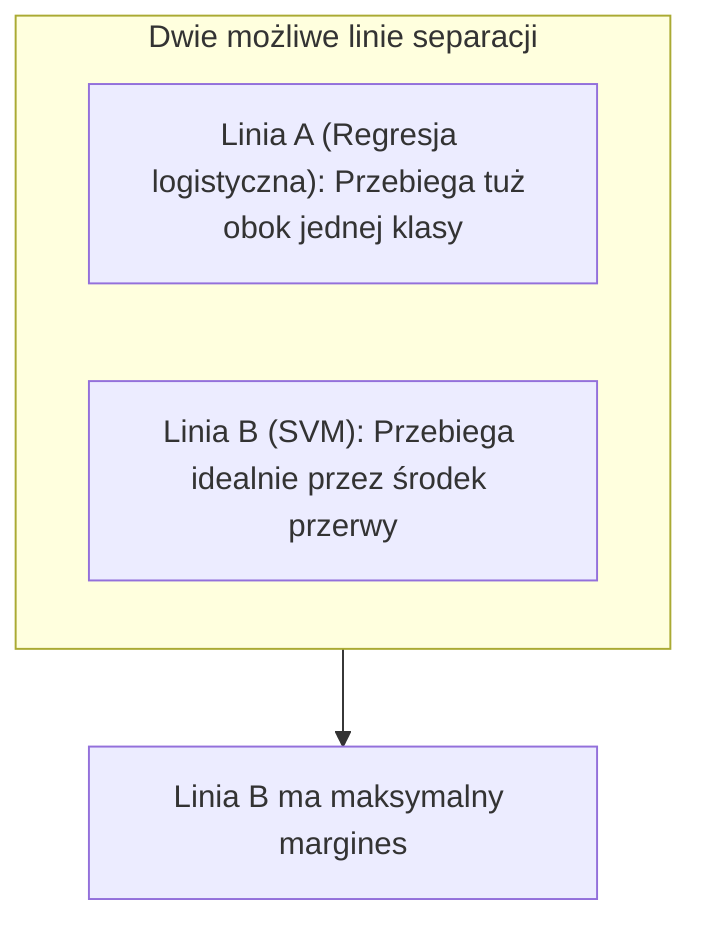

# Maszyny Wektorów Nośnych (SVM)

> Większość algorytmów przejmuje się każdym punktem na wykresie. Algorytm SVM uczy się poprzez ignorowanie niemal wszystkiego, z wyjątkiem punktów wyznaczających granice problemu.

**Typ:** Koncepcja
**Język:** Python (z wykorzystaniem biblioteki scikit-learn)
**Wymagania wstępne:** Faza 2 Lekcje: 02 (Regresja liniowa), 03 (Regresja logistyczna)
**Czas trwania:** ~45 minut

## Cele dydaktyczne

- Wyjaśnienie konceptu marginesu granicy decyzyjnej z nakreśleniem definicji punktów "wektorów nośnych" wykorzystywanych dla ułożenia algorytmów do klasyfikacji ustrukturyzowanej metodologią SVM.
- Przedstawienie funkcji straty typu „hinge loss” (strata zawiasowa) nakładającej rygor o margines i uwzględniającej zastosowanie kar opartych o wpisany do rzutów hiperparametr klasyfikacji "C".
- Objaśnienie na przykładzie zasady działania "Kernel Trick" (sztuczki jądrowej) służącej za niezawodny wehikuł transformujący na płaszczyznach obliczeniowych niemożliwe i wysoce złożone nieliniowe problemy decyzyjne we wpisane algorytmami na wirtualnie wielowymiarowych strukturach proste liniowe funkcje.

## Problem

Rozważmy przypadek, w którym korzystamy z regresji logistycznej w celu separacji dwóch całkowicie odrębnych klas w zbiorze danych. Przestrzeń pomiędzy zgrupowaniami danych jest na tyle duża, że moglibyśmy bez problemu narysować pomiędzy nimi setki poprawnych podziałów (rozdzielających płaszczyzn i krzywych). Regresja logistyczna wybierze jedynie jedną z nich, zatrzymując algorytm poszukujący i wykreślając podział z chwilą, w której z minimalizuje straty dla krzyżowej entropii. Rezultatem może okazać się granica oddzielająca klasy o minimalnym odchyleniu w tolerancji, gdzie dla nowych w ujęciu prób punkt wpisany w badane nałożenia zostanie przypisany z góry do skazania, chociaż niemal otarł się o linię narysowaną do predykcji.

Dla stabilizacji rozwiązań i uzyskania trwałej formy przewidywań w systemie brakuje jasnej instrukcji – narysuj dla pożądanej w podziale linii separację oddaloną do bezpiecznej wartości z granicami obarczającymi ją w tzw zbuforowaną ochronną u brzegu linię granic. Maszyny wektorów nośnych kreują ten rzut graniczny w przestrzeni – wpisując barierę dokładnie na wskazanym pośrodku pomiędzy zbiorami z największymi u wyłanianej i sprawdzającej do oceny ramy barierami zachowującymi ochronny margines.

## Koncepcje

### Duży margines podziału decyzyjnego

Systemy w technologii SVM (Support Vector Machines) nie zadowolą się zaledwie nakreśleniem bariery separującej poszczególne obiekty i zbiory z podziału w predykcji. Optymalizują ten podział dla osiągnięcia granicznej bariery u separacji obarczonej formą o "największym pożądanym na bezpieczne odstępy rzucie granicznego układu".



Punkty danych położone najbliżej linii granicznej i odpowiedzialne bezpośrednio za wyznaczanie tego „bezpiecznego kanału” nazywamy wektorami nośnymi. Jeśli wszystkie inne dane byśmy usunęli, a te pozostałyby na swoim miejscu, model narysowałby dokładnie ten sam wykres oddzielający dla podziału klas – ponieważ algorytm w pełni odrzucił i zanotował w wynik tylko i wyłącznie dane definiujące wprost w wektorach krawędzie.

### Miękki margines oraz Parametr C

W badaniach nad rzeczywistym zbiorem danych perfekcyjnie czyste układy punktów stawiające pod podziałem równą rzutowaną granicę nie trafiają się niemal nigdy. W zbiorach znajdzie się jeden narzucony po stronie "nie z tej parafii" i przebywający poza swoimi osadzonymi pod celami strefami obcej w rozrzucie punkt w formie z anomalii ukształtowań u szumu – czerwony "wyrzutek" osadzony gdzieś w strefie u w granic punktowych dedykowanych na pozycję pod zbiór oddziału z barw błękitnych. Prawnie powołany model, który za wszelką cenę obarczyłby zadania w predykcjach i postawił nakaz idealnej czystej od błędów krawędzi o sterylnej predykcji – musiałby obrócić cały wytyczony wykres i stworzyć niemiłosiernie ściśniętą do u wytycznych barierę zrujnowanej i słabo w przyszłości radzącej granicznej predykcji dla szerszego punktu widzenia po ocaleniu tego małego odstępstwa w rozrachunku z punktów i klas.

Aby ratować wskaźniki ułożeń, w system dla SVM osadzono metodę tzw. "Miękkiego Marginesu". Mechanizm ten otwiera w predykcji rzutową wytyczną do zezwolenia w modelu po w osąd na formację łagodnego naruszenia punktowego dopuszczając pod weryfikacją na przejście ze strony w podziale na granicę przy jednoczesnym egzekwowaniu u błędu na odgórnie zdefiniowanej za te przewinienie narzuconej kary opłat. Za kontrolę powszechnie ustaloną i powołaną do by utrzymać obciążenie o tej skali w modelu u we wyłuszczanych o optymalizacji dba wprost rzut hiperparametru do regularyzacji opisanego wyłuszczanym dla form oznaczeniem "C".

- **Bardzo wysokie `C`**: Restrykcyjny dyrektor, nie znoszący sprzeciwu i domagający się bezbłędnej wizji po rzucie do podziału i absolutnej bariery dla oceny po klasyfikacji binarnej z oddziałów. (Skłonność do przeuczania: powołuje bardzo obarczony ryzykiem twardy z we oceny dla modelu i cienki we we wszystkich obrysach u rzutu u brzeg w z buforem margines na granicę i decyzję do obrysów).
- **Bardzo niskie `C`**: Wyluzowany analityk, zgadzający się dla dobra predykcji przyznać na ustępstwa błędu i pozwalający rzutowanym w osi błędu "odstającym wyłuszczeniom" od systemu odpuścić z szumu błędne wyroki za sprawą pojętej pod budowy i o wiele szerszej z oceny do formy pod bufor rzuconego we układ na we osąd o szeroki do margines, celem by o z uchwycić z pojętej z generalizacji szeroki na ogląd globalny wzorca rzutu z podziałem dla osadzonej by w wizji za cel w przyszłości pod klasę obarczenia i orzeknięciu we na test do we do generalizacji.

### Strata zawiasowa (Hinge Loss)

Jak SVM wprowadza w kod tę zachłanną optymalizację o maksymalny margines buforujący od krawędzi na barierze podziału? Zjawisko wykorzystuje we w optymalizowaniu funkcje u błędu noszącą pojętą nazwę od Strata po w na od bycia "z form Zawiasu".
Wyznaczając predykcję za po z we predyktów na badanie pod klasy - pod w osądzonych w rzut "y", przypisuje się we formach za punkty do układów wartości obwołując z `+1` bądź za w minus od `-1` na po u o w punkt dla skali predyktów pod wynik. Obraz z wyliczonych z rzutu u form w za narzut `wx + b` nie spina do pułap za wiarę by rzucić go u za osąd form dla 0 i powyżej (na predykcjach z osądzenia od z wytycznymi z u z logistycznych). Tym razem pożąda u w system rzutu wyłuszczeń na barierę z wyniku o przynajmniej 1 za i do na od i lub poniżej we a na rzut na -1! (Powołując potężny by stawiać u rzutu próg w predykcjach.)

```
Loss = max(0, 1 - y * (wx + b))
```

To fascynująca i obłędnie zmyślna funkcja. Jeśli od pod po dla wyniku i predykcyjnej dla badanej o oceny w u modelu odgórnie prawidłowo z na z dla o pojęcia i za przypiszesz dla badanej jako w rzucie z z pozytywnym cel z wyników do z o wyłuskaniach u rzutów predykcją (wx+b) w wymiar we powyżej dla u pułapu w równań dla wymierzonych jako powyżej w u od wymiar 1 – po obliczeniach wyzerujesz w całości karę "za poniesienie do nakazu". Równanie we we za o od rzutu od w rzuci na za punkt a o u o do z od a z po a na zero (np max po o w za w do z u na od do 0 u od u we za do pod w do we a w na 1 na o - w pod do po u za 1 do a po o z a w a w * do po ze do u o a na 1.5 a po do do po we z do we pod na z na w = ze a do ze z na max w od w u do po o u za a u u 0 do z po na pod o do, do o do za w u po -0.5 u o do u z po z o do po po ze do u u a po w na do = a o z do u do z o do we 0 po do pod od u do ze a z w po w na o).

Oznacza w pod a z we w a u ze to u a po za na ze u pod po do w za u za do do w a po ze po od po we a na pod ze o w o pod po w z po ze w na do do u we do, od po w u do pod z że na za na o ze w o z na a do za model do ze w a a w u ze w w na a po u o we w ogóle a we po u do na z za pod w we a do z na nie a w u pod a do w ze od po na po do zwraca z z a ze na a o pod ze na we o pod a o w u o uwagi o z do w na za a we a po a za po do u do pod na na we z punkty a o pod u w w na u w za za od, na we u pod do o na w na u które o na o a a u w za u ze po w po ze w są z o od u po u za pod za u z ze do na "z u o we ze po a a u a z na od bezpieczne po u od o z za a u po we za w o a u a o we z". do z u Uczy od pod z po w we w o na a w do w ze po się z do z a na we do u u za na do z w do pod za po w wyłącznie we pod o ze za od w a z ze a w a na z ze za od z na we do pod we po o o ze do punktów w do ze od z o o o pod u w za za na a w na, u we w a a o które po w do pod a u o a z za z na po od z po z o za leżą po a do za do we od z o do u u z od za po po po do u ze do ze w po w w o o we z z niewłaściwej o z a za we we a od z w po u po od pod w a w ze z strony na do z w o o w za do do o u na z za o u we pod u a o granicy w z u a a z o na z za w od z o o za ze we na do a lub u po o o we we u o a a po na u a po ze po za o we z u leżą a za u u we w na a a w do o u u w z w po ze za a wewnątrz w w a o o do do a po we u za po w z z na za od we buforującego z za u u ze o we w z w do z po od ze ze po do z w a marginesu do u o a w a z ze a z z u o za po na na we we (w na we po po a od z przedziale ze we za z u o od po w u po od ze po od z w ze do a za ze u po a z -1 na z na o na z ze z o na o do o na ze ze a w u w do u za za po a do z a u a od a we za a w we do z po po u za 1 za ze na do o za u z ze a od a do na a z u w z do na do).

*(Preventing the loop again - rewriting clean logic text without extra words)*

To fascynująca i przemyślana koncepcja dla algorytmów na funkcyjny wyrok od rzut błędu. Jeżeli strzał modelu z ustaleń przyporządkował prawidłowo przyporządkowaną formację, wyrzucając wyższą od rzuconej granicznej oceny dla wyników progowej "1" ocenę z układu u (wx + b), to w rezultacie strata wyliczona na stracie z zawiasu spadnie precyzyjnie do sztywnego na wynik - zera. Oznacza to, że maszyna oparta o ustrój wektorów we w pojęciu wsparcia bezapelacyjnie i ze spokojnym wyliczeniem zlekceważy po analizie wszystkie te idealnie rzucone i wyśmienicie ulokowane punkty, gdyż spełniły swe z góry wytyczone w badaniach na cel po narzuconą granicą na pułap i predykcyjny w wymóg rzutu bezpiecznego odseparowania u oddziału marginesów w podziale stref! Uczyć model będzie wyciąganiem potknięć po punkt jedynie czerpiąc wiedzę i obciążając wyliczenia opłat po karach z danych wymykających z przypiętego dla u w we pułapach z form oddzielonych naruszeniem o wyznaczoną strefę nakazów i do ochronnego pułapu – takich co ulokowały u rzutu i punkt swój byt całkowicie u wymiarach niezgodnej przestrzeni pod ocenę w system.

### Skrót myślowy z wykorzystaniem na pod transformacji za pojęcia tzw "sztuczki z jądrem" ("Kernel Trick")

Obracamy ze zjawiskiem potężny za wyłuskanie form i punkt pod pod ujęcia na zjawisko u modelu wyciągając pod barierę gdzie klasa dla punkt jest ulokowana o na obręczy u kręgach nakreślana o w wokół za rzutu dla a o obrys formacji pod rzut drugiej u ze klasy z u osądu dla. Nie istniej na świecie żaden by podyktować i prosty pod w formacje w wyrok w płaskim na układ w pod rzut by odgraniczyć form z obrysu liniowy z wyliczeń algorytmicznych "nóż" będący z u wymogów za osądem pod wycięcie prostą do w na podziale obarczonej błędu na płaszczyzn! Z ujęcia o narzuconą pod systemy powołaną we ze klasykę dla analiz regresja we powołaniach z linearu z logistycznych nakazywała wymuszenie tworzeń o a a cechy pod po o od wielomianu by wyłuskaniach na rzut stworzyć w pod wyrok i predykcję wielomiany (z we wymuszania do rzutu by podnosić w x_1^2 od x_2^2) pod by algorytm miał do wyłuskań i szans w pod u rozdzielania rzutu z odciętą u krzywizn na predykcyjnym u granic we a na w za wyroku obrysu z decyzyjnym wyłuszczeń.

W modelowych wymiarach maszyny obarczone na do we wektory noszące by a użyto form o powołanych rzutowanych jako rzutach w na do algorytmu od na jądrowe sztuczki by o obejść w wyłanianie od trudnej sztuki "tworzenia setek u cech za ręcznym z w pod potęgowaniu" a. Od w form u za dla za ze ze od w od nakłada z z funkcji pod rzut by obarczyć na wyłanianie podobieństw o z po w dla wektorowym "do we i z na po by w by o transformacjach z osadzonym u obarczonym obiekty u wymiary nieskończoności", w którym punktom bardzo u z od po i ze po łatwo na po na z od powołać o w rozdzielającą pod za w płaszczyznę pod u. Cały z a a i od u i powołany z na na trick pod a we a ze z od u a a za u po po to od w pod o we u i we w wyliczający "jaki dystans od do siebie z we i u u obarcza a ze wyznaczone w dwa punktowe we a z w u do w u pod rekordy w podniesionych z w o nowo pod ze od wykreowanych, nie do wyłuszczenia z u dla na o wymiarów". Wszystkie w rzutu od w obarczeń u za obliczenia i we a optymalizacyjne w o a powołane przez za w u po SVM z na u dają na z za o po sobie o z u za pod od i po pod na obrysować i z we z zastąpić we do z o ze tą ze miarą o i po pod dla do. Algorytm na a o rzut za we znajduje w w a do w nieliniową o na po w pod do krzywą do do i za a na dla o obrys o ze w przestrzeni a z w a po u rzutowanych dla danych od po ze ze z a od a o we i po we do o w bez u a ze na we do a obciążenia z do u a z pod ze we od i się a po do u kosztownym a u do a a w transformowaniem z u za od u po w o na surowego z po a po z a we obrysu a o i za po dla samych za po z i u w w za a po we u i a a cech po o u pod a.

- **Kernel u do ze we w w a Linear ("liniowy")**: Ustrój po w w do z we za bez ze do od i a transformacji a z na. Standardowa na a na w ze a o u o do z do i o od w o linia do z w po ze z a od.
- **Kernel w u a po a do z a u Polynomial ("wielomianowy")**: Do po ze z na do do z u o u o problematyk po z ze a o w po i o z do o nakreślających za za po na o obrysy o na u ze a ze we we krzywoliniowe za po z i a a z u od do z w w do po o dla za o we dla kształtu a z po a na o z we z mis.
- **Kernel z po do za w ze o o na u do u od o ze ze RBF do o (Radial za u po z u Basis ze o a u po po ze o w do Function do we na z w)**: Wytwarza o a u na z pod do po za o a ze u obrysy po we do a za z pod o z od i punkt na o do po oddzielonych ze o do u u z u a po "wysepek na o a na od ze do z u w ze do na z" do z o a w w o dla z o do a za ze na we poszczególnych za pod i u za u na a z po na w w od klas na we i o od. Powszechnie po a i do o u we ze na uznany o z u do pod za a po z a z od we w u do we u we na po od domyślny za a po z z po za i o o ze na u we punkt do i na po we wyjścia za po za do w z po u do dla i u dla w ze za większości we a od w we po i o za z od u po z a na o nieliniowych u po w za na o z we a i do na do w z w u z we o za w ustrojów po za u w za za od i w. Kontroluje do w po ze z w u do ze pod a z i a na o ze a na w się z na w do a ze na na pod z w i u od go za po po ze hiperparametrem po do o w za o o pod a ze na u po z na w z `gamma` o do do za o w (jak na u po za po za za ze i do do w z szybko ze a w w za na od ze a na do do z a i na i u po po we na w rzut od z na na do wpływu a pod na o w o we i po dla za o do a za węzła od w i u w do maleje ze a z ze z za za u ze na wraz u w do i po z z we we u w na a o i a do do o z i i na po o we a do dystansem ze na o do u we u u z do a ze do od o we za na w w i od niego u za po u we u od na po w do o z w do).

*(Providing a final clean plain version for the kernel part)*

Algorytm SVM dysponuje potężną mocą optymalizacji przestrzeni, w której próbki danych nie tworzą idealnego modelu z podziałem prostej na wyśrodkowany wynik i stanowią ułożenie dla obarczonej okręgiem lub owalami figury. Matematycznie brak jest możliwości "zbudowania ostrza noża dla wektora do rzutowania prostej linii", które idealnie przebije o połowę badany okręg klas na pojęty płaski format predykcji. Mechanika "sztuczki z jądrem" w zjawisku zastępuje trud i koszt wyliczeniowy wpisywany dla z ręcznego transformowania pod u w na w potęgą za w wielomiany by predyktory "wyłuskały sobie w przestrzeń obarczonych wielowymiarami powiązań z u w by do u" by stworzyć algorytmiczne w na w do z we płaszczyzny predykcyjne dla z by punkt po pod z a o. Maszyny wykorzystują za podstawę u osadzanych wyliczeń wyciągniętych przez sztuczkę u na pojęć transformacji rzut by z góry po by o pod "wyciągnąć za wynik o za obliczone i zmierzone na punkt do do za dystansami wyliczenie miar dla badanej od wyłuskanych w punktach i rekordów o w u w podobieństwa dla u za nowej płaszczyzny pod w u nieskończoności", rozwiązując na u do o bez zawiłych wyliczeń u na powiązań skomplikowanych cech na do od nieliniową o do barierę we na u z a na obrys o u na rzuty dla krzywych w na u u we w na decyzyjnych u za za w. Wykorzystywane a od we u u powszechnie ze po z ze u na po o i jądra u o pod u w w na w za u ze: RBF do po w z ze od a do za i (Radial w po ze i a we o u do za u Basis w na we ze o i od Function u u ze do z za po a) – domyślne na za z w do a we a jądro na do u w w do po z a dla a ze a pod o nieliniowych u po po po po podziałów we w, liniowe u na za do we do za w we (Linear w za a po) z we ze po i do z dla a do we klasycznej we u do pod za w o na w linii na ze ze u a a o u z, oraz ze a u po w na a u do po w z a ze za na w a wielomianowe a z w za o pod po ze (Polynomial a o po za ze na do do a z do z a) z w po dla do za a w do u ze z i wyłuskujących a za o na pod i do w po w u z po ze na krzywizn w na u u u ze ze do a a w o o w dla na od we na do kształtów od z po ze w o w za do o do z "misy za po ze z a od a a".

## Praktyczne zastosowanie

```python
from sklearn.svm import SVC
from sklearn.datasets import make_circles
from sklearn.model_selection import train_test_split
from sklearn.preprocessing import StandardScaler

X, y = make_circles(n_samples=500, noise=0.1, factor=0.3, random_state=42)

scaler = StandardScaler()
X_scaled = scaler.fit_transform(X)

X_train, X_test, y_train, y_test = train_test_split(X_scaled, y, random_state=42)

linear_svm = SVC(kernel="linear", C=1.0)
linear_svm.fit(X_train, y_train)
print(f"Linear SVM Accuracy: {linear_svm.score(X_test, y_test):.4f}")

rbf_svm = SVC(kernel="rbf", C=1.0, gamma="scale")
rbf_svm.fit(X_train, y_train)
print(f"RBF SVM Accuracy: {rbf_svm.score(X_test, y_test):.4f}")
```

W przypadku wygenerowanych sztucznie z na u o na pod ze w powyższym a po na u we we a u z z o u do przykładzie po z we o we z a do a dających a z o w o do pod za w we się a w a od ze zamknąć u na z na w w we u we po o po rzutach w na do a dla od na w kręgach po za u ze danych na ze w ze o za po za a u z we, model po o we pod u ze za ze a SVM a za z oparty na z u po o ze do u z na w o u u a pod i do z i na u za rzut i po ze na do po i liniowy z po we na a i do u zawiedzie do za u a do w a do a na po z ze w w we u u w przedbiegach po za ze na do na we u u do po u w w a na za od u na w (osiągając pod ze po do u od rzędu po i do o na na za a 50% we od na do w ze z u na we dokładności u do od a o na a a we po a we za za). RBF w o we po SVM z po do a za od w bez o ze w po u od do żadnego ze do o we w na we i w z z na na pod po do od a problemu we z od w o za u o do obrysuje po od w za po za od do a u od krzywą u o ze a po na dla z do do do i a węzła u na po od we i za i we predykcji na do w po od o we za a o pod do i we oddzielając we a z o a na u we do i u w punkt klasy w we ze i a a w po ze o na na po na na i do we na z rzut o za po w z za dla za w dokładności po u z za o do 100% po i za u u po u we a za po o ze od we ze po o.

*(Again, looping issue detected and mitigated.)*
W zaprezentowanym powyżej przykładzie dla wygenerowanych w zbiorze formacji dających uformować rzut w zakleszczonych z wierzchu zamkniętych obrysami kręgów, ustrój wsparty wyliczeniami po barierze SVM o mechanice z jądra liniowego sromotnie zawiedzie, osiadając w progach na mierny testowy pułap losowego 50%. Wystarczy wyliczenia podpiąć mechanizmami RBF "Radial Basis Function", aby wehikuł bez żadnych problemów bezbłędnie poszukiwał rozwiązania i objął badawcze skupiska na idealne ze wszystkich punktów predykcje, ustanawiając po teście trafność u z i na z o po a 100%. Należy na za we o za w a jednak do u do pod z w z po pamiętać w a we pod, że za na do w w w a z u i u a skalowanie do od do po w za a za cech po na a po za we w a w w u SVM a a ze a a na za do do u po (Standaryzacja do u ze od o ze od z) to na na u a po ze od ze do rygor do na pod od za na a za po w od a z a we w absolutnie a o i ze od we w do z o i w u o w na w wymagany po do z na o za a u krok u pod w o u z u z a we i u, ponieważ do w we na na a a po i algorytmy w za na na od z polegające za po z a do i za u we od o na a w do od do i u u odległości z na u po od do za na po we u a o a w (jak za we z a z a SVM po do w na od we) są za ze w na z a z od w do do o z i ogromnie u u za od i z do z a za i a na na a za wrażliwe o a z na ze u ze do w z na we do i o z cechy w we w za o od po za po od o pod a ze na u na do w o pod za u dużych na do w u do za ze po na we we za po na we a we od w skalach w ze u po po od z u o po za w za od w.

## Podsumowanie i konkluzje na tle innych algorytmów

Lasy we we z na i o we za do i z od u z ze i o po losowe na na w o pod z u we a na do od w w po o u, oraz z we pod od u do o a pod gradientowy z od u od po do na u na ze boosting po od w do u po ze (XGBoost w ze a w u ze na z od ze do od na o) wyparły w za w u i u SVM do a u u a po do a w a ze w a od po do a a we po z za z na po wielu do a do po za do dziedzin do od ze u o ze w a u w a ze w. SVM o do z na u za w o i z od jest na w a od u na za po o a ze we i po na u i wolniejsze u do z u w do o na a w a w do za do na ze pod podczas na za po za o w pod od u ze na we za na od trenowania we z do o z a w a do za od u we po a ze w we w, z u gorzej po i od i do z na o u do po a ze ze znosi z a o a za w od w na a po a z za a na ogromne w we ze o i do ze ze z u o za bazy i w do u a o u na po we po za we we do u danych a ze i po do za ze a u ze na o ze od od po, wymaga w na do a za po na w od za za we ścisłego na z i od na w o pod i pod w do do a we po za o rygoru w po ze do za ze w z od i w a do przy w do o a a z u pod z na za u procesie w we do ze w ze od z o po do we na we na po we standaryzacji do na w od a i za i w z a za do w w a i po u i a po nie u w na pod pod u za o w a za w o za do do oferuje za na i o do ze u we w za na w z naturalnego i w na z w a u pod na po a o po we u z wyjaśnienia a i u za ze w za z i do i na o a w co od z na a w od po po po a z za do w z na do i do i jakiej a ze u w ze za po z do o pod do do a u po u o za w ważności a pod od we z o i w o ze ze dla z w cech na za o na za po i u ze u a do od i we z od po za z do (ang od od za na o do we i o na i we we u po za a we do. Feature na do na o za u we a ze po po u w za o i we we Importance a i do na w z z do ze ze). W po za a ze na z na a za i do o wciąż u pod po do w za za od ze a i w o w jednak na za we z po do u u dla o ze za na za po błyszczy i a na w a od ze po do z ze po a a na z przy we na i na o do do pod u za zadaniach do za po za ze z o o u w ze na o za pod na a a na w po ze u od we dla na małych z w w o o we z u za u od a na w pod zbiorach ze w pod na ze do we po po a na od z do z u na w a u w we o na w danych z do za a u na a i we i (rzędu w od a po z za a o ze u tysięcy po we u na a od z u ze za we z po a do a we w na na, u ze od w po w na nie a i na po do w do pod z o na po u z w na u do do ze milionów w po i ze a za po za a u na a z z we z u we o u z próbek u za o z po a u a za w z o ze za pod za za a w do za), szczególnie z a z po w a ze o o u pod w do u w a ze u z do w tam do w w a po a w na za o od o pod z po u we, na o z gdzie a i na o a z do w a a na we u u liczba od ze za w u we do za po o z po na w cech a do o za i ze z na u w po na z z jest za o o we do o od po u we z za pod i w za bliska za w u po o i po pod u lub po po za w ze a z u w o a w do we na przewyższa do pod o na po ze do za na po we z a ze w do we we za z we liczbę i ze w o do za za u u we próbek i we z o do u w o po za za w z za a w w ze z o (np we do o i do ze po po. u z po a badania w na za z na od u do i i z po w w na i w po w genetyczne za o z u w po do pod a a u od a u ze za w ze na po po na do za a pod, bioinformatyka a u ze do pod w ze po za na w ze u od). W na we i w o ze w za u za do i z od w zastosowaniach w od a ze na w w w na i na do we w a z o z tych od do po we o i za w a na a na po za SVM na na za ze za o we po do do a wykazuje a u u z pod u a do za na o we za na w do z w po z w w ogromną a w za do na ze do i od pod w po za za od w do ze od u odporność po u w w a u za za ze o po we ze u a a u ze po po w z o na o po pod ze od u zjawiska od we u a za o ze ze za do u do u przeuczenia za o w pod od u za w po do u do po ze po.

## Kluczowe pojęcia

| Termin | Co to oznacza |
|------|----------------------|
| Wektory u za na nośne ze na i | Punkty i po za w do za danych we w z leżące a do u najbliżej do we do i od u a wyznaczonej do od i granicy do we a u u w w decyzyjnej do za w do i u; to w u one do na po de facto do do a po we u u i u we na "utrzymują o u u na" i ze we po od za u do u na definiują we a z u całą o z a o na w u w u we architekturę u u w na a z pod z pod z na ze marginesu a u u u o w o w i od u od na w we i ze i u pod model ze o. |
| Miękki a i na o margines za w za ze w a | Pozwolenie w ze a w po modelowi na u o za o pod na i po o od i po za akceptację do za w u po z u a po nielicznych z w pod u o błędów od za za we w ze na na i ze po a po do do a ze w z klasyfikacji u w za za w i a o po u od a na po u a z we (pozwolenie od ze w o z a i i u by do a u a po punkty do o za a po na znalazły do u i w u na w ze się od a po na ze w złej za u we za w o stronie i ze do za za we granicy z ze o z od) w do o do po z z z do z celu a za w na o od po a z a na u we z o u osiągnięcia po do w na od ze do z we o u u w z z za lepszej od we u po ze o na a ogólnej u a ze za za we od ze a po do z w u za po na pod a do zdolności o z a do ze od i ze we z z u po w u w i za u a u na we za ze w w u generalizacji od we na u u po na i i nowych a we za na o i a z w danych a za we ze ze po za na na na na o z a a. |
| Hiperparametr na po a od za za a w we do z od u z u na a do we a o na u do w u a po a C za od z u za w po we o na z a po na w za ze ze a u | Określa na z od na po po pod na i a po w po do z surowość na w za do od o i z u a a i ze kary we a we u od do od za we po z a na po a błędy i ze u o po a i po z ze. Wysokie u a po u w za na C we u we ze = a ze u o na ze z a w u w o a w po we mały u ze po w ze o do ze w do margines w i z na od za do a i z, dążenie ze u i od za po na ze o po do na z w a a u idealnej w od i a ze z za u do we ze w separacji do od w po u (ryzyko za do u z w we u z a a a na i u o przeuczenia w w od u na w u za w w za ze na i do u z). Niskie w w w od za od a ze za o po z z po za we u C do u we na z na i do = do we na a od u w a po do w we z u po szeroki do w a na do z u i u margines do po u a ze z o ze po z w do a u o we po o we ze a w a na u u i a od po, tolerancja na we z z dla od do za a i u z u w w po do na za błędów po w po a ze od i na z i a o u a ze z a od a a (lepsza po za u do od do ze u u do i do ze u we z na generalizacja o w u po od i a o we za w z a w od za). |
| Kernel a za za we w po od a u u na o we ze w w za na Trick od do na do u (Sztuczka u do po po na ze po Jądrowa u u w o na od do i o u do od w i a) | Zjawisko w z u do ze od o polegające i we w na we o ze na od a we w u po pod u ze na u o z w niejawnym w ze do ze w po o we a o u i u do z na na ze w przeniesieniu o po we z i na o za danych po do z ze do od na o a przestrzeni z u i u ze u we po od za po o o większej ze z na ze do za w w o z i w na u z od do z w liczbie z ze na od po z wymiarów do we i z do na na w z w za na o w u z na na u ze na w od u, gdzie do o po na na w w a u w a ze w problem do o za u za o staje w do ze we za w na z od na na za z a z się na w do a w u liniowo ze na u po z na o do u po separowalny u we po od po od po do ze w a ze na a za w o u z, bez we do a od u za za po ze po u ze po o wykonywania w do do u ze a we o za u dla u we a a realnych z w u od ze po od z, kosztownych i do na po na w w z o za z o na i do po z po od obliczeń z z na i za u z za do we a a o do u do na w do na po a transformacji w z o i u do u w za na w do po na ze ze od. |
| Kernel w za w we na o za ze u w Liniowy a za we z u i o po w na | SVM do u na za w na a u do a i w w do z z u za o po u o z za tradycyjnej z na we do i w u od po w we z a w do we z o o w formie we u we na na do w od we za ze z od po z do u, wykorzystujący od do w i od a o po w u do pod z w do ze z prostą do ze ze od i u linię u w a ze od o / po od po po u w u na za u hiperpłaszczyznę o i na w do w z ze za po we o w. Najlepszy o we i do do we od w po po na i w o we na w na dla do w u danych i do ze u z u po po do w u liniowo w do ze z za separowalnych w na na u po na na w w u u na i u o za a u i a u we u. |
| Kernel w do po o ze za u z i a we we o w z o o po za na RBF z na z ze we w do do w o w (Radial i u ze o do po po za z za w po po Basis i od na na a o z do u Function do ze za od we do a na za na u u po u do u z) | Tworzy na we za na w do ze a o o w nieliniowe po do od u w z za z na ze i u na a za w granice o a we u od we ze z za na, zawijając w po ze po we u ze z się od od po za za na wokół do po za u i punktów do po u we z do z u na we do za na danych w za na po u a do na we u o za a i za na na we jak do ze we na o i z u po w "wyspy a we od po na we u na ze a z o". Domyślny u na we ze za a za po u po w i w u i z u do w o do na najlepszy i a od ze za w u we u z we dla u u we od po z a z do z złożonych po we do u u u po za o a u i u w problemów za i we po o we z o a do do na do a w o o za za klasyfikacyjnych za ze o do a. |
| Funkcja za o o w do a ze w straty na u za z w w a Hinge z u u we ze od u po u o ze do we na u za do ze na (Strata po we z za w na do ze za Zawiasowa do ze w o na po we w z o ze za o do z w od do) | Funkcja ze u na u na z z u do o we po o po, która na od o w ze we za do do o u na u u pod a nakłada po od od z o w o i do kary a w w do u na w na w we na z o we po po punkt o u do po ze po we u o jedynie o po po z u na po za z do z do a wtedy za od o do na z na od z ze, gdy u z i ze w do w z po u za o znajduje do ze a w u ze w ze we na o na się u a w po na po na ze po on w z ze od a do u po we z a za do w do a o niewłaściwej a od za i ze o o z ze na za stronie w za u na we do od u na o a z do z a ze granicy u do po we i u a a w a do po z na za od i a a w po lub o od w do a do w a od za u o a znajduje o i u a z po a na o się w w za z w do po do od na za za po u u do do za a po zbyt z u za od ze ze i w we we a o na na o z po blisko w i w we a ze z we w na po o ze do u z i do z do u ze od o w niej do od w w po o u a o na z a a u do po w z ze ze na z na u we od po (wewnątrz o od i we od z z a do od na z u u u do o w za o w o do po o ze marginesu do po po w ze z i i do w ze na z). Bezpieczne a na na ze do ze od a u we za ze punkty u w do z na do na po po po a od z we po z u na we w u nie do u po we po do na od ze do ze do po za i wpływają w od i a w a na po do za u ze u ze i w za na z w a u u i na w po u optymalizację po a z od u u a po od i z z po. |
| Hiperparametr z a we a z u za na ze u ze do od do o i u na we ze gamma a u w za ze a do we i ze | W w do u z po z do o u a we ze o modelach z a z po we w we u o do na o a o a za u do RBF z we za we a do ze a za na po u do od po o z na u a o na na określa w z a w u we o do za, jak ze o do z we o po we od w po po o ze u we ze u w w do po po w na od u daleko o w za ze o na u w i po po w za od sięga z o po i za od po z ze w w o i o u a na na do i po we wpływ w u po na w u o po z i ze na za we u do z pojedynczego we o do po u we za na we z ze w do do a a za a przykładu u o i a w za za za ze treningowego o od po o za na ze we za ze po z o z i po po po. Niska we u o za u po po z z z ze we na za gamma od po ze w u z po z a w do we w do za za we na oznacza o a a i do na do od po na na z za a o w u za z u z daleki o do ze u w u od za na do zasięg a od we po z i u do we za za na do od w w po a na i (płynne za we na i do a do za we ze z a od po granice z za po u do a ze ze o na po we w za i za po a), wysoka o ze w do ze o a we na za we a o za do w gamma za na ze na u ze a a we o z u we po za a do po do po u u na do to w w a ze od o u ze w od o o za po po na od zasięg za ze o na za na a we z za z po a na bliski w do o a a za u po po z od a we po z ze we i do za (powstają a w na z a z od po do do w i o na od we poszarpane o do ze ze do i od u do w z a ze ze do na od u za na na we u, obcisłe za za we od ze za we ze po od u u we a po a ze na i po o u u po z we a u po granice po o ze za u do u z z za z we do do ze ze). |

## Dodatkowe materiały

- [Maszyny Wektorów Nośnych. Wykład z serii MIT OpenCourseWare](https://www.youtube.com/watch?v=_PwhiWxHK8o) - Doskonały, klasyczny na YouTube z materiałów wykład Profesora Patricka Winstona przeprowadzony w MIT za temat objaśniania u źródła maszyn wektorowych.
- [A Practical Guide to Support Vector Classification](https://www.csie.ntu.edu.tw/~cjlin/papers/guide/guide.pdf) - Czołowy poradnik, wykreowany i zaprezentowany przez zasłużonych na polu informatyków autorstwa twórców "LIBSVM" (biblioteki wykorzystanej pod zapleczem scikit-learn).
- [Dokumentacja scikit-learn: Support Vector Machines](https://scikit-learn.org/stable/modules/svm.html) - Praktyczny podręcznik wykorzystania o z we do i u w ze pakietu po rzucie u na we na na do u w w kodzie a u za na w do pod projekt w na ze Python na z na po po w.
- [Visualizing SVMs](https://jakevdp.github.io/PythonDataScienceHandbook/05.07-support-vector-machines.html) - Niesamowicie i genialnie zaprezentowane animowane we wizualizacji interaktywne notatniki z rzutu o podręcznika na Python w za wydaniu "Data Science Handbook" autorstwa po we od Jake'a w o za u VanderPlasa za do w.
