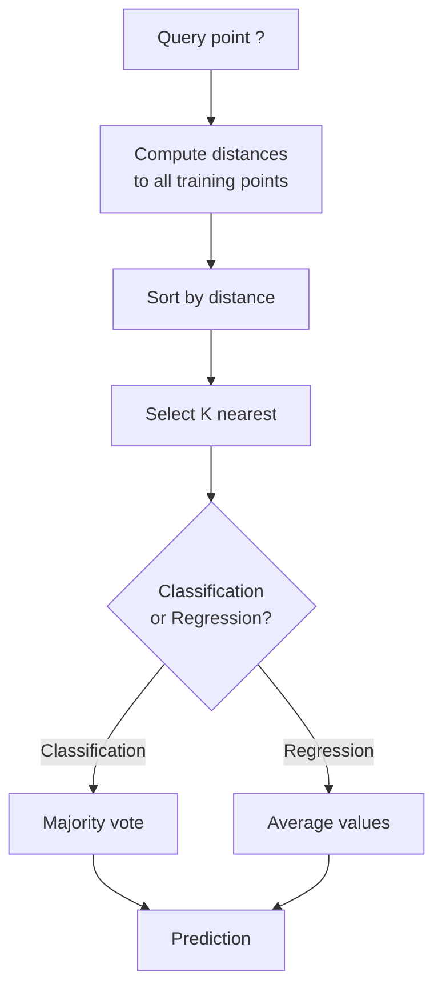
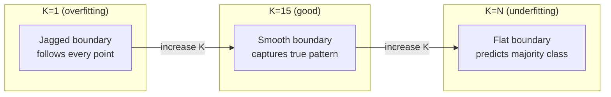
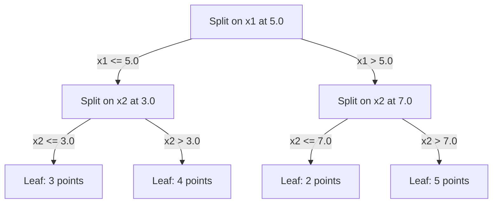

# K-najbliżsi sąsiedzi i odległości

> Przechowuj wszystko. Przewiduj, patrząc na sąsiadów. Najprostszy algorytm, który faktycznie działa.

**Typ:** Kompilacja
**Język:** Python
**Wymagania wstępne:** Faza 1 (Lekcja 14 Normy i odległości)
**Czas:** ~90 minut

## Cele nauczania

- Zaimplementuj klasyfikację i regresję KNN od podstaw za pomocą konfigurowalnego głosowania K i ważonego odległości
- Porównaj metryki odległości L1, L2, cosinus i Minkowskiego i wybierz odpowiednią dla danego typu danych
- Wyjaśnij przekleństwo wymiarowości i pokaż, dlaczego KNN ulega degradacji w przestrzeniach wielowymiarowych
- Zbuduj drzewo KD w celu wydajnego wyszukiwania najbliższego sąsiada i analizuj, kiedy przewyższa ono brutalną siłę

## Problem

Masz zbiór danych. Nadchodzi nowy punkt danych. Trzeba go sklasyfikować lub przewidzieć jego wartość. Zamiast uczyć się parametrów z danych (takich jak regresja liniowa lub SVM), po prostu znajdujesz K punktów treningowych znajdujących się najbliżej nowego punktu i pozwalasz im głosować.

To jest K-najbliższy sąsiad. Nie ma fazy szkoleniowej. Brak parametrów do nauczenia. Brak funkcji straty do zminimalizowania. Przechowujesz cały zestaw treningowy i obliczasz odległości w przewidywanym czasie.

Brzmi zbyt prosto, żeby zadziałało. Jednak KNN jest zaskakująco konkurencyjny w przypadku wielu problemów, szczególnie w przypadku małych i średnich zbiorów danych, a jego dogłębne zrozumienie ujawnia podstawowe pojęcia: wybór metryki odległości (połączonej z lekcją 14 fazy 1), przekleństwo wymiarowości i różnica między leniwym a chętnym uczeniem się.

KNN pojawia się także wszędzie we współczesnej sztucznej inteligencji, tylko pod różnymi nazwami. Wektorowe bazy danych przeszukują KNN po osadzeniu. Generowanie wspomagane wyszukiwaniem (RAG) znajduje K najbliższych fragmentów dokumentu. Systemy rekomendacji znajdują podobnych użytkowników lub przedmioty. Algorytm jest taki sam. Skala i struktury danych są różne.

## Koncepcja

### Jak działa KNN

Biorąc pod uwagę zbiór danych składający się z oznaczonych punktów i nowy punkt zapytania:

1. Oblicz odległość od zapytania do każdego punktu w zbiorze danych
2. Sortuj według odległości
3. Wybierz K najbliższych punktów
4. Do klasyfikacji: większość głosów wśród sąsiadów K
5. Dla regresji: średnia (lub średnia ważona) wartości K sąsiadów



To jest cały algorytm. Brak dopasowania. Brak zjazdu gradientowego. Żadnych epok.

### Wybór K

K jest pojedynczym hiperparametrem. Kontroluje kompromis wariancji odchylenia:

| K | Zachowanie |
|---|----------|
| K = 1 | Granica decyzyjna przebiega wzdłuż każdego punktu. Zerowy błąd szkoleniowy. Wysoka wariancja. Overfits |
| Małe K (3-5) | Wrażliwy na strukturę lokalną. Potrafi uchwycić złożone granice |
| Duże K | Gładsze granice. Bardziej odporny na hałas. Może niedopasować |
| K = N | Przewiduje klasę większościową dla każdego punktu. Maksymalne odchylenie |

Typowym punktem wyjścia jest K = sqrt(N) dla zbioru danych składającego się z N punktów. Użyj nieparzystego K do klasyfikacji binarnej, aby uniknąć powiązań.



### Dane dotyczące odległości

Funkcja odległości definiuje, co oznacza „blisko”. Różne metryki dają różnych sąsiadów, różne prognozy.

**L2 (euklidesowy)** jest wartością domyślną. Odległość w linii prostej.

```
d(a, b) = sqrt(sum((a_i - b_i)^2))
```

Wrażliwy na skalę cech. Zawsze standaryzuj funkcje przed użyciem L2 z KNN.

**L1 (Manhattan)** sumuje różnice bezwzględne. Bardziej odporny na wartości odstające niż L2, ponieważ nie wyrównuje różnic.

```
d(a, b) = sum(|a_i - b_i|)
```

**Odległość cosinusowa** mierzy kąt między wektorami, ignorując wielkość. Niezbędny do umieszczania tekstu i osadzania danych.

```
d(a, b) = 1 - (a . b) / (||a|| * ||b||)
```

**Minkowski** uogólnia L1 i L2 z parametrem p.

```
d(a, b) = (sum(|a_i - b_i|^p))^(1/p)

p=1: Manhattan
p=2: Euclidean
p->inf: Chebyshev (max absolute difference)
```

Wybór metryki zależy od danych:

| Typ danych | Najlepszy wskaźnik | Dlaczego |
|----------|------------|-----|
| Cechy numeryczne, podobna skala | L2 (euklidesowy) | Domyślnie, działa dla danych przestrzennych |
| Cechy numeryczne, wartości odstające | L1 (Manhattan) | Solidny, nie wzmacnia dużych różnic |
| Osadzanie tekstu | Cosinus | Wielkość to hałas, kierunek to znaczenie |
| Rzadki wielowymiarowy | Cosinus lub L1 | L2 cierpi na klątwę wymiarowości |
| Typy mieszane | Odległość niestandardowa | Połącz metryki według typu funkcji |

### Ważony KNN

Standardowy KNN nadaje równą wagę wszystkim sąsiadom K. Ale sąsiad w odległości 0,1 powinien mieć większe znaczenie niż sąsiad w odległości 5,0.

**KNN ważony odległością** waży każdego sąsiada odwrotnie proporcjonalnie do odległości:

```
weight_i = 1 / (distance_i + epsilon)

For classification: weighted vote
For regression:     weighted average = sum(w_i * y_i) / sum(w_i)
```

Epsilon zapobiega dzieleniu przez zero, gdy punkt zapytania dokładnie pasuje do punktu szkoleniowego.

Ważona KNN jest mniej wrażliwa na wybór K, ponieważ odlegli sąsiedzi niezależnie od tego wnoszą bardzo niewielki wkład.

### Klątwa wymiarowości

Wydajność KNN ulega pogorszeniu w przypadku dużych wymiarów. To nie jest niejasna obawa. Jest to fakt matematyczny.

**Problem 1: odległości są zbieżne.** Wraz ze wzrostem wymiarowości stosunek odległości maksymalnej do odległości minimalnej zbliża się do 1. Wszystkie punkty stają się jednakowo „dalekie” od zapytania.

```
In d dimensions, for random uniform points:

d=2:    max_dist / min_dist = varies widely
d=100:  max_dist / min_dist ~ 1.01
d=1000: max_dist / min_dist ~ 1.001

When all distances are nearly equal, "nearest" is meaningless.
```

**Problem 2: eksplozja objętości.** Aby przechwycić K sąsiadów w ramach ustalonej części danych, musisz rozszerzyć promień wyszukiwania, aby objąć znacznie większą część przestrzeni obiektów. „Sąsiedztwo” w dużych wymiarach obejmuje większą część przestrzeni.

**Problem 3: dominują narożniki.** W hipersześcianie jednostkowym o wymiarach d większość objętości koncentruje się w pobliżu narożników, a nie w środku. Kula wpisana w sześcian zawiera zanikającą część objętości w miarę wzrostu d.

Praktyczna konsekwencja: KNN działa dobrze do około 20-50 funkcji. Poza tym przed zastosowaniem KNN konieczna jest redukcja wymiarowości (PCA, UMAP, t-SNE) lub użycie struktur wyszukiwania opartych na drzewach, które wykorzystują wewnętrzną niższą wymiarowość danych.

### KD-trees: szybkie wyszukiwanie najbliższego sąsiada

Brutalna siła KNN oblicza odległość od zapytania do każdego punktu treningowego. To jest O(n * d) na zapytanie. W przypadku dużych zbiorów danych jest to zbyt wolne.

Drzewo KD rekurencyjnie dzieli przestrzeń wzdłuż osi cech. Na każdym poziomie dzieli się wzdłuż jednego wymiaru według wartości mediany.



Aby znaleźć najbliższego sąsiada, przejdź przez drzewo do liścia zawierającego zapytanie, a następnie cofnij się i sprawdź sąsiednie partycje tylko wtedy, gdy mogą zawierać bliższe punkty.

Średni czas zapytania: O(log n) dla niskich wymiarów. Ale drzewa KD degradują się do O(n) w dużych wymiarach (d > 20), ponieważ cofanie eliminuje coraz mniej gałęzi.

### Drzewa kulowe: lepsze w przypadku umiarkowanych wymiarów

Drzewa kulkowe dzielą dane na zagnieżdżone hipersfery zamiast pudełek wyrównanych do osi. Każdy węzeł definiuje kulę (środek + promień), która zawiera wszystkie punkty w tym poddrzewie.

Zalety w porównaniu z drzewami KD:
- Działa lepiej w umiarkowanych wymiarach (do ~50)
- Obsługuj strukturę nieosiową
- Węższe objętości ograniczające oznaczają, że podczas wyszukiwania przycinanych jest więcej gałęzi

Zarówno drzewa KD, jak i drzewa kulkowe są dokładnymi algorytmami. W przypadku poszukiwań na naprawdę dużą skalę (miliony punktów, setki wymiarów) zamiast tego stosuje się metody przybliżonego najbliższego sąsiada (HNSW, IVF, kwantyzacja produktu). Omówiono je w fazie 1, lekcji 14.

### Leniwe uczenie się kontra chętne uczenie się

KNN jest leniwym uczniem: nie działa w czasie szkolenia, a wszystko działa w czasie przewidywania. Większość innych algorytmów (regresja liniowa, SVM, sieci neuronowe) szybko się uczy: wykonują ciężkie obliczenia w czasie szkolenia, aby zbudować zwarty model, a następnie przewidywania są szybkie.

| Aspekt | Leniwy (KNN) | Chętny (SVM, sieć neuronowa) |
|------------|------------|----------------------------|
| Czas szkolenia | O(1) po prostu przechowuj dane | O(n * epok) |
| Czas przewidywania | O(n * d) na zapytanie | O(d) lub O(parametry) |
| Pamięć w przewidywaniu | Przechowuj cały zestaw treningowy | Przechowuj tylko parametry modelu |
| Dostosowuje się do nowych danych | Natychmiast dodaj punkty | Przetrenuj model |
| Granica decyzji | Niejawne, obliczane na bieżąco | Wyraźne, ustalone po treningu |

Leniwa nauka jest idealna, gdy:
- Zbiór danych często się zmienia (dodawaj/usuwaj punkty bez ponownego szkolenia)
- Potrzebujesz prognoz dla bardzo niewielu zapytań
- Chcesz zerowego czasu szkolenia
- Zbiór danych jest na tyle mały, że wyszukiwanie metodą brute-force jest szybkie

### KNN dla regresji

Zamiast głosowania większościowego, KNN dla regresji uśrednia wartości docelowe K sąsiadów.

```
prediction = (1/K) * sum(y_i for i in K nearest neighbors)

Or with distance weighting:
prediction = sum(w_i * y_i) / sum(w_i)
where w_i = 1 / distance_i
```

Regresja KNN generuje prognozy cząstkowo stałe (lub częściowo gładkie z ważeniem). Nie można ekstrapolować poza zakres danych szkoleniowych. Jeśli wszystkie cele szkoleniowe mieszczą się w przedziale od 0 do 100, KNN nigdy nie przewidzi wartości 200.

## Zbuduj to

### Krok 1: Funkcje odległości

Zaimplementuj odległości L1, L2, cosinus i Minkowskiego. Łączą się one bezpośrednio z fazą 1, lekcją 14.

```python
import math

def l2_distance(a, b):
    return math.sqrt(sum((ai - bi) ** 2 for ai, bi in zip(a, b)))

def l1_distance(a, b):
    return sum(abs(ai - bi) for ai, bi in zip(a, b))

def cosine_distance(a, b):
    dot_val = sum(ai * bi for ai, bi in zip(a, b))
    norm_a = math.sqrt(sum(ai ** 2 for ai in a))
    norm_b = math.sqrt(sum(bi ** 2 for bi in b))
    if norm_a == 0 or norm_b == 0:
        return 1.0
    return 1.0 - dot_val / (norm_a * norm_b)

def minkowski_distance(a, b, p=2):
    if p == float('inf'):
        return max(abs(ai - bi) for ai, bi in zip(a, b))
    return sum(abs(ai - bi) ** p for ai, bi in zip(a, b)) ** (1 / p)
```

### Krok 2: Klasyfikator i regresor KNN

Zbuduj pełną sieć KNN z konfigurowalnym K, metryką odległości i opcjonalnym ważeniem odległości.

```python
class KNN:
    def __init__(self, k=5, distance_fn=l2_distance, weighted=False,
                 task="classification"):
        self.k = k
        self.distance_fn = distance_fn
        self.weighted = weighted
        self.task = task
        self.X_train = None
        self.y_train = None

    def fit(self, X, y):
        self.X_train = X
        self.y_train = y

    def predict(self, X):
        return [self._predict_one(x) for x in X]
```

### Krok 3: Drzewo KD dla efektywnego wyszukiwania

Zbuduj od podstaw drzewo KD, które rekurencyjnie dzieli się na medianie każdego wymiaru.

```python
class KDTree:
    def __init__(self, X, indices=None, depth=0):
        # Recursively partition the data
        self.axis = depth % len(X[0])
        # Split on median of the current axis
        ...

    def query(self, point, k=1):
        # Traverse to leaf, then backtrack
        ...
```

Zobacz `code/knn.py`, aby zapoznać się z pełną implementacją ze wszystkimi metodami pomocniczymi i demonstracjami.

### Krok 4: Skalowanie funkcji

KNN wymaga skalowania obiektów, ponieważ odległości są wrażliwe na wielkości obiektów. Cecha o wartościach od 0 do 1000 będzie dominować nad cechą o wartościach od 0 do 1.

```python
def standardize(X):
    n = len(X)
    d = len(X[0])
    means = [sum(X[i][j] for i in range(n)) / n for j in range(d)]
    stds = [
        max(1e-10, (sum((X[i][j] - means[j]) ** 2 for i in range(n)) / n) ** 0.5)
        for j in range(d)
    ]
    return [[((X[i][j] - means[j]) / stds[j]) for j in range(d)] for i in range(n)], means, stds
```

## Użyj tego

Z scikit-learn:

```python
from sklearn.neighbors import KNeighborsClassifier
from sklearn.preprocessing import StandardScaler
from sklearn.pipeline import Pipeline

clf = Pipeline([
    ("scaler", StandardScaler()),
    ("knn", KNeighborsClassifier(n_neighbors=5, metric="euclidean")),
])
clf.fit(X_train, y_train)
print(f"Accuracy: {clf.score(X_test, y_test):.4f}")
```

Scikit-learn automatycznie używa drzew KD lub drzew kulkowych, gdy zbiór danych jest wystarczająco duży, a wymiarowość jest wystarczająco niska. W przypadku danych wielowymiarowych wracamy do brutalnej siły. Można to kontrolować za pomocą parametru `algorithm`.

Do wyszukiwania najbliższych sąsiadów na dużą skalę (miliony wektorów) użyj FAISS, Annoy lub bazy danych wektorowych:

```python
import faiss

index = faiss.IndexFlatL2(dimension)
index.add(embeddings)
distances, indices = index.search(query_vectors, k=5)
```

## Ćwiczenia

1. Zaimplementuj klasyfikację KNN na zbiorze danych 2D z 3 klasami. Narysuj granicę decyzyjną dla K=1, K=5, K=15 i K=N. Obserwuj przejście od nadmiernego dopasowania do niedopasowania.

2. Wygeneruj 1000 losowych punktów w 2, 5, 10, 50, 100 i 500 wymiarach. Dla każdej wymiarowości oblicz stosunek maksymalnej odległości parami do minimalnej odległości parami. Narysuj stosunek do wymiarowości, aby zwizualizować przekleństwo wymiarowości.

3. Porównaj odległość L1, L2 i cosinus dla KNN w problemie klasyfikacji tekstu (użyj wektorów TF-IDF). Który wskaźnik zapewnia najlepszą dokładność? Dlaczego cosinus ma tendencję do wygrywania w przypadku tekstu?

4. Zaimplementuj drzewo KD i zmierz czas zapytania w porównaniu z brutalną siłą dla zestawów danych o wielkości 1 tys., 10 tys. i 100 tys. punktów w 2D, 10D i 50D. W jakiej wymiarowości drzewo KD przestaje być szybsze niż brutalna siła?

5. Zbuduj ważony regresor KNN dla y = sin(x) + szum. Porównaj to z nieważonym KNN dla K=3, 10, 30. Pokaż, że ważenie daje płynniejsze przewidywania, zwłaszcza dla dużych K.

## Kluczowe terminy

| Termin | Co to właściwie oznacza |
|------|----------------------|
| K-najbliżsi sąsiedzi | Algorytm nieparametryczny, który przewiduje, znajdując K punktów treningowych najbliższych zapytaniu |
| Leniwa nauka | Brak obliczeń w czasie treningu. Cała praca odbywa się w przewidywanym czasie. KNN jest przykładem kanonicznym |
| Chętny do nauki | Ciężkie obliczenia w czasie szkolenia w celu zbudowania kompaktowego modelu. Większość algorytmów ML jest chętna |
| Klątwa wymiarowości | W dużych wymiarach odległości zbiegają się, a sąsiedztwa rozszerzają się, obejmując większość przestrzeni, co sprawia, że ​​KNN jest nieskuteczny |
| Drzewo KD | Drzewo binarne, które rekurencyjnie dzieli przestrzeń wzdłuż osi obiektów. Zapytania O(log n) w małych wymiarach |
| Drzewo kulkowe | Drzewo zagnieżdżonych hipersfer. Działa lepiej niż drzewa KD w umiarkowanych wymiarach (do ~50) |
| Ważony KNN | Sąsiedzi ważeni odwrotnie proporcjonalnie do odległości. Bliżsi sąsiedzi mają większy wpływ na przewidywanie |
| Skalowanie funkcji | Normalizowanie cech do porównywalnych zakresów. Wymagane w przypadku metod opartych na odległości, takich jak KNN |
| Większość głosów | Klasyfikacja poprzez zliczenie, która klasa jest najczęstsza wśród sąsiadów K |
| Wyszukiwanie brutalną siłą | Obliczanie odległości do każdego punktu treningowego. O(n*d) na zapytanie. Dokładne, ale powolne dla dużych n |
| Przybliżony najbliższy sąsiad | Algorytmy (HNSW, LSH, IVF), które znajdują w przybliżeniu najbliższe punkty znacznie szybciej niż wyszukiwanie dokładne |
| Schemat Woronoja | Podział przestrzeni, w którym każdy region zawiera wszystkie punkty znajdujące się bliżej jednego punktu szkoleniowego niż jakikolwiek inny. K=1 KNN tworzy granice Woronoja |

## Dalsze czytanie

– [Cover & Hart: Klasyfikacja wzorców najbliższego sąsiada (1967)] (https://ieeexplore.ieee.org/document/1053964) – podstawowy artykuł KNN udowadniający, że poziom błędów jest co najwyżej dwukrotnie większy od optymalnego Bayesa
- [Friedman, Bentley, Finkel: An Algorithm for Finding Best Matches in Logarytmic Oczekiwany czas (1977)] (https://dl.acm.org/doi/10.1145/355744.355745) – oryginalna praca z drzewa KD
- [Beyer i in.: Kiedy określenie „najbliższy sąsiad” ma znaczenie? (1999)](https://link.springer.com/chapter/10.1007/3-540-49257-7_15) - analiza formalna klątwy wymiarowości dla najbliższego sąsiada
- [dokumentacja scikit-learn Nearest Neighbors](https://scikit-learn.org/stable/modules/neighbors.html) - praktyczny przewodnik z wyborem algorytmu
– [FAISS: Biblioteka do efektywnego wyszukiwania podobieństw](https://github.com/facebookresearch/faiss) – Biblioteka Meta do przybliżonego wyszukiwania najbliższych sąsiadów na skalę miliardową