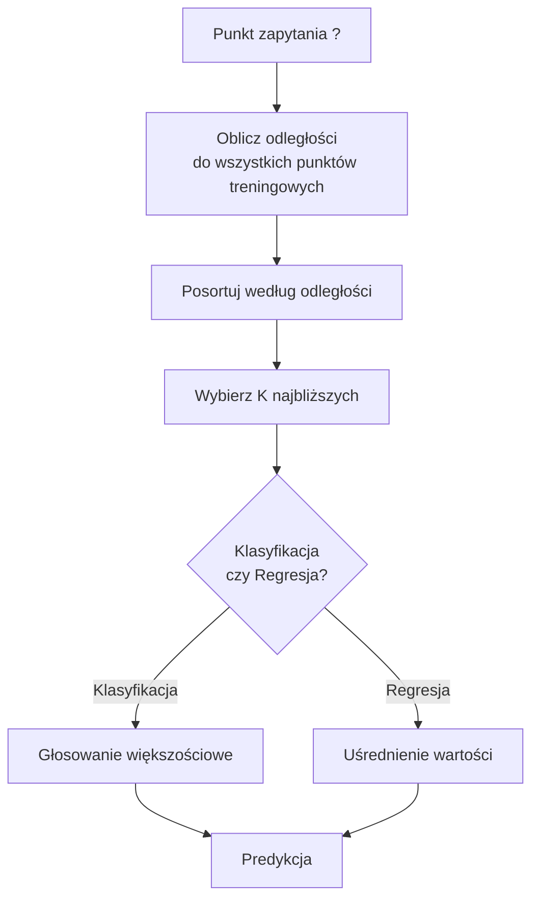
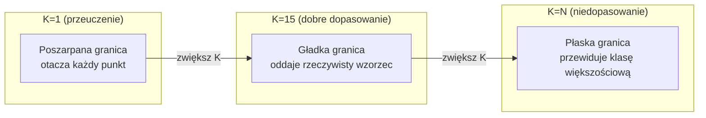
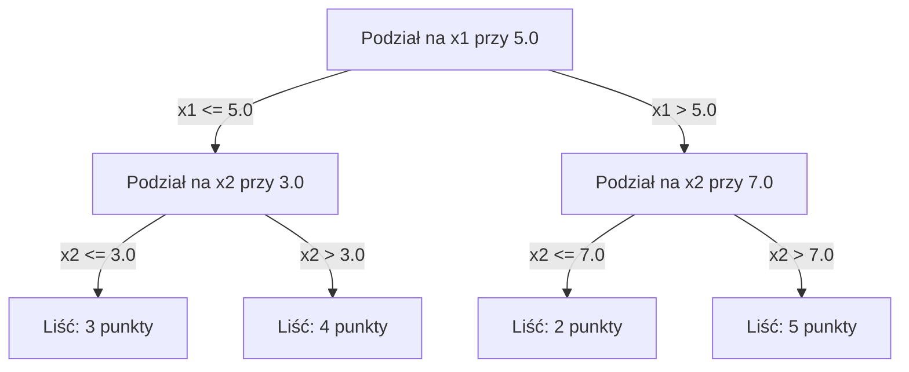

# K-najbliższych sąsiadów (KNN) i metryki odległości

> Zapamiętaj wszystko. Przewiduj na podstawie sąsiadów. Najprostszy algorytm, który naprawdę działa.

**Typ:** Kompilacja
**Język:** Python
**Wymagania wstępne:** Faza 1 (Lekcja 14: Normy i odległości)
**Czas:** ~90 minut

## Cele nauczania

- Implementacja klasyfikacji i regresji KNN od podstaw, z możliwością konfiguracji parametru K oraz ważenia odległości.
- Porównanie metryk odległości (L1, L2, kosinusowa, Minkowskiego) i wybór odpowiedniej dla danego typu danych.
- Zrozumienie zjawiska "przekleństwa wymiarowości" i wyjaśnienie, dlaczego skuteczność KNN spada w wielowymiarowych przestrzeniach.
- Zbudowanie drzewa KD (k-d tree) w celu wydajnego wyszukiwania najbliższych sąsiadów oraz analiza, kiedy takie podejście jest lepsze od metody siłowej (brute-force).

## Problem

Masz zbiór danych. Pojawia się nowy punkt danych. Musisz go sklasyfikować lub przewidzieć jego wartość. Zamiast uczyć się parametrów na podstawie danych (jak w przypadku regresji liniowej czy SVM), po prostu znajdujesz K punktów treningowych znajdujących się najbliżej nowego punktu i pozwalasz im "zagłosować".

Na tym polega algorytm K-najbliższych sąsiadów (KNN). Nie ma tu etapu trenowania w klasycznym sensie. Nie ma parametrów do wyuczenia. Nie ma funkcji straty do minimalizacji. Przechowujesz po prostu cały zbiór treningowy i obliczasz odległości na etapie wnioskowania (predykcji).

Brzmi to zbyt prosto, żeby mogło działać. Jednak KNN radzi sobie zaskakująco dobrze w wielu problemach, szczególnie przy małych i średnich zbiorach danych. Dogłębne zrozumienie tego algorytmu pozwala przyswoić kluczowe koncepcje uczenia maszynowego: wybór metryki odległości (co łączy się z Lekcją 14 z Fazy 1), przekleństwo wymiarowości oraz różnicę między uczeniem "leniwym" (lazy learning) a "gorliwym" (eager learning).

Metody oparte na KNN są obecnie powszechne w nowoczesnych systemach AI, choć często pod innymi nazwami. Wektorowe bazy danych wykorzystują wyszukiwanie KNN na osadzeniach (embeddings). Systemy RAG (Retrieval-Augmented Generation) znajdują K najbardziej zbliżonych fragmentów dokumentów. Systemy rekomendacyjne wyszukują podobnych użytkowników lub produkty. Algorytm pozostaje ten sam; zmienia się jedynie skala i wykorzystywane struktury danych.

## Koncepcja

### Jak działa algorytm KNN

Mając dany zbiór danych z oznaczonymi (etykietowanymi) punktami oraz nowy punkt zapytania (query):

1. Oblicz odległość od punktu zapytania do każdego punktu w zbiorze treningowym.
2. Posortuj punkty rosnąco według odległości.
3. Wybierz K najbliższych punktów.
4. Klasyfikacja: wybierz klasę, która zdobyła większość głosów wśród K sąsiadów.
5. Regresja: oblicz średnią (lub średnią ważoną) wartości od K sąsiadów.



To cały algorytm. Brak optymalizacji, brak spadku wzdłuż gradientu (gradient descent), żadnych epok.

### Wybór parametru K

K to jedyny hiperparametr. Kontroluje on kompromis między obciążeniem a wariancją (bias-variance tradeoff):

| K | Zachowanie |
|---|----------|
| K = 1 | Granica decyzyjna dopasowuje się do każdego punktu. Zerowy błąd na zbiorze treningowym. Bardzo wysoka wariancja. Ryzyko silnego przeuczenia (overfitting). |
| Małe K (3-5) | Model jest wrażliwy na lokalną strukturę. Potrafi uchwycić skomplikowane i nieliniowe granice decyzyjne. |
| Duże K | Granice decyzyjne są gładsze. Model staje się bardziej odporny na szum, ale może wystąpić niedopasowanie (underfitting). |
| K = N | Model zawsze przewiduje klasę większościową w całym zbiorze danych. Maksymalne obciążenie (bias). |

Dobrym punktem wyjścia jest zazwyczaj ustawienie K = sqrt(N), gdzie N to liczba próbek w zbiorze treningowym. Przy klasyfikacji binarnej warto używać nieparzystego K, by unikać remisów w głosowaniu.



### Metryki odległości

Funkcja odległości definiuje, co w naszym przypadku oznacza "być blisko". Różne metryki wyznaczają innych sąsiadów, co prowadzi do różnych prognoz.

**L2 (Euklidesowa)** to metryka domyślna. Oznacza po prostu odległość w linii prostej.

```
d(a, b) = sqrt(sum((a_i - b_i)^2))
```

Jest bardzo wrażliwa na skalę poszczególnych cech, dlatego przed użyciem L2 z algorytmem KNN zawsze należy ustandaryzować dane.

**L1 (Manhattan)** suma wartości bezwzględnych różnic. Jest bardziej odporna na wartości odstające (outliery) niż L2, ponieważ nie podnosi dużych różnic do kwadratu.

```
d(a, b) = sum(|a_i - b_i|)
```

**Odległość kosinusowa** mierzy kąt pomiędzy wektorami, całkowicie ignorując ich wielkość (długość). Jest to kluczowa miara w przypadku pracy z tekstem i osadzeniami (embeddings).

```
d(a, b) = 1 - (a . b) / (||a|| * ||b||)
```

**Odległość Minkowskiego** uogólnia metryki L1 i L2 przy użyciu parametru p.

```
d(a, b) = (sum(|a_i - b_i|^p))^(1/p)

p=1: Manhattan
p=2: Euklidesowa
p->inf: Czebyszewa (maksymalna różnica bezwzględna)
```

Wybór odpowiedniej metryki silnie zależy od posiadanych danych:

| Typ danych | Najlepsza metryka | Dlaczego |
|----------|------------|-----|
| Cechy numeryczne, podobna skala | L2 (Euklidesowa) | Wybór domyślny, dobrze sprawdza się w przypadku danych przestrzennych. |
| Cechy numeryczne, występują outliery | L1 (Manhattan) | Metryka odporna na szum, nie wzmacnia pojedynczych, dużych różnic. |
| Osadzenia tekstu (text embeddings) | Kosinusowa | Długość wektora może być traktowana jako szum, kluczowy jest "kierunek" oznaczający semantykę. |
| Rzadkie dane wielowymiarowe | Kosinusowa lub L1 | Metryka L2 mocno cierpi z powodu przekleństwa wymiarowości. |
| Typy mieszane | Niestandardowa odległość (np. Gowera) | Wymaga połączenia różnych metryk w zależności od typu cechy. |

### KNN ważony odległością

Standardowy algorytm KNN nadaje taką samą wagę głosom wszystkich K sąsiadów. Jednak intuicyjnie, sąsiad znajdujący się w odległości 0.1 powinien mieć większe znaczenie przy podejmowaniu decyzji niż ten w odległości 5.0.

**KNN ważony odległością** przypisuje każdemu sąsiadowi wagę odwrotnie proporcjonalną do jego odległości:

```
weight_i = 1 / (distance_i + epsilon)

Dla klasyfikacji: głosowanie ważone
Dla regresji: średnia ważona = sum(w_i * y_i) / sum(w_i)
```

Dodanie `epsilon` chroni przed dzieleniem przez zero w przypadku, gdy punkt zapytania pokrywa się z punktem treningowym.

Ważony KNN jest zwykle mniej wrażliwy na wybór parametru K, ponieważ bardzo oddaleni sąsiedzi wnoszą minimalny wkład w ostateczną predykcję.

### Przekleństwo wymiarowości

Wydajność algorytmu KNN drastycznie spada wraz ze wzrostem liczby wymiarów (cech). To nie jest jedynie teoretyczny problem, ale udowodniony fakt matematyczny.

**Problem 1: Odległości stają się do siebie zbliżone.** W miarę wzrostu wymiarowości, stosunek maksymalnej do minimalnej odległości między punktami zbliża się do 1. Innymi słowy, wszystkie punkty stają się niemal równie "dalekie" od zapytania.

```
W wymiarze d, dla losowych, równomiernie rozłożonych punktów:

d=2:    max_dist / min_dist = (bardzo zróżnicowane)
d=100:  max_dist / min_dist ~ 1.01
d=1000: max_dist / min_dist ~ 1.001

Gdy wszystkie odległości są niemal identyczne, pojęcie "najbliższego" traci sens.
```

**Problem 2: Eksplozja objętości przestrzeni.** Aby odnaleźć K sąsiadów stanowiących stały ułamek całego zbioru, musisz znacząco zwiększyć promień wyszukiwania. W przestrzeniach wielowymiarowych "sąsiedztwo" musi obejmować ogromną część całej przestrzeni.

**Problem 3: Narożniki dominują.** W hipersześcianie o wymiarze d zdecydowana większość objętości koncentruje się w narożnikach, a nie w środku. Kula wpisana w sześcian zajmuje znikomy ułamek jego całkowitej objętości przy rosnącym d.

Praktyczne wnioski: Algorytm KNN sprawdza się dobrze dla maksymalnie 20-50 cech. W przypadku danych o większej liczbie wymiarów konieczne jest wcześniejsze zastosowanie technik redukcji wymiarowości (takich jak PCA, UMAP, t-SNE) lub wykorzystanie struktur opartych na drzewach, które optymalizują wyszukiwanie, opierając się na niższej wewnętrznej (ukrytej) wymiarowości danych.

### Drzewa KD (k-d trees): Szybkie wyszukiwanie najbliższego sąsiada

Standardowe podejście siłowe (brute-force) w KNN wymaga obliczenia odległości od punktu zapytania do każdego punktu w zbiorze treningowym. Daje to złożoność O(n * d) na jedno zapytanie, co jest niedopuszczalnie wolne dla dużych zbiorów danych.

Rozwiązaniem jest użycie struktur takich jak drzewo KD (k-d tree), które rekurencyjnie dzieli przestrzeń cech. Na każdym poziomie drzewa przestrzeń jest dzielona wzdłuż jednego wymiaru (osi), bazując na wartości mediany.



Aby znaleźć najbliższego sąsiada, algorytm przemierza drzewo aż do liścia zawierającego punkt zapytania, a następnie cofa się (backtracking) i przeszukuje sąsiednie węzły (obszary) tylko wtedy, gdy istnieje szansa, że mogą one zawierać bliższe punkty.

Średni czas wyszukiwania wynosi O(log n) dla przestrzeni o niskiej liczbie wymiarów. Niestety, przy dużej wymiarowości (d > 20) drzewa KD stają się równie wolne co wyszukiwanie siłowe (złożoność powraca do O(n)), ponieważ algorytm cofania jest zmuszony przeszukiwać niemal wszystkie gałęzie.

### Drzewa sferyczne (Ball trees): Lepsze dla średnich wymiarów

Drzewa sferyczne (ball trees) organizują dane, używając hierarchii zagnieżdżonych hipersfer zamiast hiperprostokątów. Każdy węzeł definiuje kulę (środek i promień), która w całości zawiera wszystkie punkty znajdujące się w poddrzewie tego węzła.

Zalety w porównaniu do drzew KD:
- Znacznie lepiej sprawdzają się dla średniej liczby wymiarów (nawet do d ~ 50).
- Skuteczniej radzą sobie z klastrami, które nie są wyrównane wzdłuż osi układu współrzędnych.
- Mniejsze obszary ograniczające pozwalają na skuteczniejsze odrzucanie (pruning) gałęzi podczas wyszukiwania.

Obydwie metody (drzewa KD i drzewa sferyczne) są algorytmami dokładnymi (zwracają zawsze prawdziwego najbliższego sąsiada). W przypadku operacji na ogromną skalę (np. miliony punktów i setki wymiarów) stosuje się algorytmy przybliżonego wyszukiwania sąsiadów (Approximate Nearest Neighbors - ANN), takie jak HNSW, IVF czy kwantyzacja wektorowa (Product Quantization). Technologie te omówiono szerzej w Fazie 1, w Lekcji 14.

### Uczenie leniwe (Lazy Learning) vs Uczenie gorliwe (Eager Learning)

KNN to algorytm leniwy (lazy learner): nie wykonuje żadnej pracy na etapie trenowania, odkładając wszystkie obliczenia do momentu predykcji. Większość innych algorytmów uczenia maszynowego (takich jak regresja liniowa, SVM, sieci neuronowe) to algorytmy "gorliwe" (eager learners): podczas etapu trenowania angażują znaczne zasoby obliczeniowe, aby zbudować kompaktowy i zoptymalizowany model, ale dzięki temu faza predykcji jest niezwykle szybka.

| Cecha | Uczenie leniwe (np. KNN) | Uczenie gorliwe (np. SVM, Sieci neuronowe) |
|------------|------------|----------------------------|
| Czas trenowania | O(1) – polega wyłącznie na zapisaniu danych w pamięci. | O(n * liczba_epok) – może być bardzo długi. |
| Czas predykcji | O(n * d) na każde zapytanie. | Zwykle O(d) lub O(liczba_parametrów) – bardzo szybki. |
| Pamięć podczas wnioskowania | Wymaga przechowywania całego zbioru treningowego. | Wymaga pamięci jedynie do przechowywania wyuczonych parametrów (wag). |
| Adaptacja do nowych danych | Wystarczy natychmiastowo dodać nowy punkt do bazy. | Wymaga ponownego przetrenowania modelu na zaktualizowanym zbiorze. |
| Granica decyzyjna | Ukryta, obliczana i wyznaczana w locie. | Jawna i jednoznacznie ustalona na etapie treningu. |

Uczenie leniwe sprawdza się doskonale, gdy:
- Zbiór danych bardzo często ulega zmianom i aktualizacjom (dodawanie lub usuwanie danych nie wymaga kosztownego retrenowania).
- Potrzebujesz prognoz tylko dla sporadycznych, pojedynczych zapytań.
- Wymagasz natychmiastowej gotowości modelu (zerowy czas treningu).
- Zbiór danych jest na tyle mały, że wyszukiwanie siłowe nie stanowi problemu wydajnościowego.

### Regresja przy pomocy KNN

W przypadku problemów regresji, zamiast przeprowadzania głosowania większościowego, algorytm KNN uśrednia wartości numeryczne dla K wybranych sąsiadów.

```
predykcja = (1/K) * sum(y_i dla i z K najbliższych sąsiadów)

Lub w przypadku wersji z ważeniem:
predykcja = sum(w_i * y_i) / sum(w_i)
gdzie w_i = 1 / distance_i
```

Regresja przy użyciu KNN generuje prognozy o charakterze przedziałami stałym (lub przedziałami gładkim, w przypadku użycia ważenia odległości). Algorytm KNN nie posiada zdolności do ekstrapolacji – jeśli wszystkie docelowe wartości w zbiorze treningowym mieszczą się w przedziale od 0 do 100, KNN nigdy nie przewidzi wartości 200, niezależnie od odległości.

## Implementacja

### Krok 1: Definicja funkcji odległości

Na początek zaimplementujmy podstawowe funkcje odległości: L1, L2, kosinusową oraz Minkowskiego. Wiążą się one bezpośrednio z materiałem z Fazy 1, Lekcji 14.

```python
import math

def l2_distance(a, b):
    return math.sqrt(sum((ai - bi) ** 2 for ai, bi in zip(a, b)))

def l1_distance(a, b):
    return sum(abs(ai - bi) for ai, bi in zip(a, b))

def cosine_distance(a, b):
    dot_val = sum(ai * bi for ai, bi in zip(a, b))
    norm_a = math.sqrt(sum(ai ** 2 for ai in a))
    norm_b = math.sqrt(sum(bi ** 2 for bi in b))
    if norm_a == 0 or norm_b == 0:
        return 1.0
    return 1.0 - dot_val / (norm_a * norm_b)

def minkowski_distance(a, b, p=2):
    if p == float('inf'):
        return max(abs(ai - bi) for ai, bi in zip(a, b))
    return sum(abs(ai - bi) ** p for ai, bi in zip(a, b)) ** (1 / p)
```

### Krok 2: Klasyfikator i regresor KNN

Teraz zbuduj w pełni funkcjonalną klasę KNN. Pozwala ona na konfigurację wartości K, miary odległości oraz włączenie ważenia sąsiadów (zależnego od odległości).

```python
class KNN:
    def __init__(self, k=5, distance_fn=l2_distance, weighted=False, task="classification"):
        self.k = k
        self.distance_fn = distance_fn
        self.weighted = weighted
        self.task = task
        self.X_train = None
        self.y_train = None

    def fit(self, X, y):
        self.X_train = X
        self.y_train = y

    def predict(self, X):
        return [self._predict_one(x) for x in X]
```

### Krok 3: Optymalizacja z wykorzystaniem drzewa KD

Aby przyspieszyć wyszukiwanie, warto napisać własne drzewo KD (k-d tree), które rekurencyjnie podzieli zbiór danych na podstawie mediany na każdej osi wymiarów.

```python
class KDTree:
    def __init__(self, X, indices=None, depth=0):
        # Rekurencyjny podział przestrzeni i danych
        self.axis = depth % len(X[0])
        # Podziel bazując na wartości mediany z bieżącej osi
        ...

    def query(self, point, k=1):
        # Zejdź do odpowiedniego liścia, a następnie cofnij się (backtrack) sprawdzając inne gałęzie
        ...
```

Zajrzyj do pliku `code/knn.py`, aby zapoznać się z kompletną, w pełni zoptymalizowaną implementacją i demonstracją działania tych algorytmów.

### Krok 4: Standaryzacja i skalowanie cech

Algorytm KNN absolutnie wymaga przeskalowania danych wejściowych. Ponieważ opiera się na odległości, nieprzeskalowana cecha przyjmująca wartości rzędu 0–1000 całkowicie zdominuje odległość, ignorując cechę o wartościach rzędu 0–1.

```python
def standardize(X):
    n = len(X)
    d = len(X[0])
    means = [sum(X[i][j] for i in range(n)) / n for j in range(d)]
    stds = [
        max(1e-10, (sum((X[i][j] - means[j]) ** 2 for i in range(n)) / n) ** 0.5)
        for j in range(d)
    ]
    return [[((X[i][j] - means[j]) / stds[j]) for j in range(d)] for i in range(n)], means, stds
```

## Wykorzystanie w praktyce

Jak używać algorytmu korzystając z biblioteki `scikit-learn`:

```python
from sklearn.neighbors import KNeighborsClassifier
from sklearn.preprocessing import StandardScaler
from sklearn.pipeline import Pipeline

clf = Pipeline([
    ("scaler", StandardScaler()),
    ("knn", KNeighborsClassifier(n_neighbors=5, metric="euclidean")),
])
clf.fit(X_train, y_train)
print(f"Accuracy: {clf.score(X_test, y_test):.4f}")
```

Biblioteka `scikit-learn` automatycznie dobierze odpowiednią strukturę danych, decydując o użyciu drzewa KD lub drzewa sferycznego, gdy zbiór jest wystarczająco duży, a liczba wymiarów optymalnie mała. Jeśli przekażesz algorytmowi dane bardzo wielowymiarowe, cicho powróci on do siłowego wyszukiwania (brute-force). Możesz też kontrolować tę decyzję jawnie, modyfikując parametr `algorithm`.

Jeżeli zależy Ci na masowym i potężnie optymalizowanym wyszukiwaniu najbliższych sąsiadów na wielką skalę (np. dla osadzeń tekstowych czy obrazów idących w dziesiątki lub setki milionów rekordów), skorzystaj z biblioteki takiej jak FAISS, Annoy, lub specjalistycznej wektorowej bazy danych:

```python
import faiss

index = faiss.IndexFlatL2(dimension)
index.add(embeddings)
distances, indices = index.search(query_vectors, k=5)
```

## Ćwiczenia praktyczne

1. Zaimplementuj klasyfikator KNN działający na prostym 2-wymiarowym zbiorze danych z 3 klasami. Stwórz wykres przedstawiający wyznaczoną granicę decyzyjną dla K=1, K=5, K=15 i K=N. Przeanalizuj zjawisko przechodzenia z przeuczenia (overfitting) w niedopasowanie (underfitting).
2. Wygeneruj losowy zbiór 1000 punktów osadzonych odpowiednio w 2, 5, 10, 50, 100 i 500 wymiarach. Dla każdej takiej konfiguracji policz stosunek maksymalnej odległości pomiędzy parami do minimalnej odległości pomiędzy parami. Przedstaw na wykresie, jak ten współczynnik zachowuje się w funkcji rosnącej wymiarowości. Czy dostrzegasz "przekleństwo wymiarowości"?
3. Zastosuj implementację KNN, sprawdzając jak zachowują się metryki L1, L2 oraz odległość kosinusowa w problemie klasyfikacji tekstu (np. po uprzednim zwektoryzowaniu przy pomocy TF-IDF). Która miara daje najlepsze wyniki z punktu widzenia dokładności i dlaczego to często właśnie odległość kosinusowa wygrywa w tym obszarze?
4. Zaimplementuj i przetestuj ręcznie napisaną logikę drzewa KD (k-d tree). Wykonaj dokładne testy porównawcze i zmierz jak długo trwają zapytania do drzewa KD, zestawiając to z szybkością metody `brute-force` na zestawach wielkości 1 tys., 10 tys. i 100 tys. punktów, używając danych 2D, 10D oraz 50D. Po przekroczeniu jakiej wymiarowości drzewo KD przestaje przynosić widoczne korzyści czasowe w stosunku do zwykłego siłowego wyszukiwania?
5. Zbuduj i przetestuj działanie ważonego modelu KNN operującego dla prostej funkcji (np. na krzywej $y = \sin(x)$ zasymulowanej z dodatkowym, losowym szumem wejściowym). Użyj wartości K równych 3, 10, 30. Zademonstruj w praktyce, w jaki sposób ważenie redukuje błędy oraz tworzy gładszą (i w konsekwencji bardziej wyidealizowaną) prognozę, w szczególności przy wyższych wartościach K.

## Słownik i kluczowe terminy

| Termin | Czego on tak naprawdę dotyczy i co oznacza? |
|------|----------------------|
| Algorytm K-najbliższych sąsiadów (KNN) | Całkowicie nieparametryczny algorytm uczący się na podstawie instancji. Predykcji dokonuje oceniając K "najbliżej zlokalizowanych" w sensie przestrzennym sąsiadujących punktów w stosunku do punktu dla którego realizowane jest zapytanie. |
| Uczenie leniwe (Lazy Learning) | Klasa algorytmów opóźniająca fazę modelowania oraz uogólniania do czasu wykonania zapytania predykcyjnego. Model ten nie optymalizuje parametrów wewnętrznych. Typowym przedstawicielem jest KNN. |
| Uczenie gorliwe (Eager Learning) | Podejście tradycyjne, oparte na wykonywaniu dużej ilości obciążającej komputer analityki (treningu), podczas której sieć modyfikuje wagi (np. parametry sieci w SVM czy sieciach neuronowych), co w rezultacie przekłada się na szybkie wyniki fazy wnioskującej (predykcyjnej). |
| Przekleństwo wymiarowości (Curse of Dimensionality) | Ogólna zasada ilustrująca fenomen przestrzeni wielowymiarowych. Punkty "rozmywają się", stając się pozornie tak samo odległe względem innych. W takich środowiskach algorytmy szukające bliskości (jak KNN) drastycznie tracą na efektywności. |
| Drzewo KD (k-d tree) | Drzewo BST modyfikujące koncepcję zwykłych węzłów, rekurencyjnie izolujące zbiory danych poprzez k-wymiarowe obszary i tworzące k-wymiarowe osie podziału. W praktyce jest idealne by ograniczać czasy szukania zapytaniami z O(n) w wymiarach niskich (np. od 2D) dając wynik wyszukiwania w złożoności O(log n). |
| Drzewo sferyczne (Ball tree) | Drzewo metryczne tworzące strukturę zagnieżdżonych i odizolowanych od siebie "kul" (hipersfer). Konstrukt użyteczniejszy niż drzewo KD gdy system bada średnie ilości wymiarowości (np. d do ~50). |
| KNN z ważeniem (Weighted KNN) | Rozwiązanie modyfikujące, w którym sąsiadujący punkt otrzymuje wagę stanowiącą ułamek wartości bazowej zdefiniowanej dla bliskości z innym zapytaniem punktowym. Czymś bliżej w przestrzeni tym większy jego wkład. |
| Skalowanie cech (Feature Scaling) | Wymuszanie normalizacji każdej kolumny do identycznych skali min-max. Bezwzględnie obligatoryjne do wdrożenia przed zaprzęgnięciem do użytku modeli polegających i bazujących na badaniu geometrii ułożenia obiektów (a więc np. dla KNN i SVM). |
| Głosowanie większościowe (Majority Vote) | Technika rozwiązywania zagadnień związanych z klasyfikacją danych poprzez szacowanie tego, z jakich klas pochodzi wybrana sub-reprezentacja K i przydzielaniu danemu punktowi klasy dominującej w tejże puli zapytania. |
| Wyszukiwanie siłowe (Brute-force) | Pełne (brute) szacowanie odległości między jednym wybranym z zapytania węzłem a resztą układu punktów i wybieranie z niej najkorzystniejszych wartości po zastosowaniu funkcji sortujących, działające wg. zależności czasowej O(n*d). |
| Zbliżony najbliższy sąsiad (Approximate Nearest Neighbor - ANN) | Zbiór algorytmów stosowanych na szeroką skalę (LSH, HNSW), rezygnujących z odrobiny dokładności po to by wyciągnąć od strony zapytań ogromny zysk optymalizacyjny czasowy rzędu od kilku w górę ułamków wielokrotności szukania klasycznego (z użyciem algorytmów ścisłych typu drzew). |
| Schemat Woronoja (Voronoi Diagram) | Specjalny sposób partycjonowania sfer na obszary tak, że pojedynczy węzeł dla KNN gdzie K=1 znajduje w swoim zasięgu i na swojej powierzchni wszystko co jest najbliżej względem tegoż jedynego wybranego punktu uczącego. |

## Dalsza lektura (i przydatne linki)

– [Cover & Hart: Nearest neighbor pattern classification (1967)](https://ieeexplore.ieee.org/document/1053964) – Klasyczna praca i podwaliny pod matematykę dla algorytmów używających K. Dowód, iż jakość dopasowań z KNN od dołu jest minimalnie gorsza od rygorystycznego modelowania błędów Bayesa.
- [Friedman, Bentley, Finkel: An Algorithm for Finding Best Matches in Logarithmic Expected Time (1977)](https://dl.acm.org/doi/10.1145/355744.355745) – Praca źródłowa definiująca pierwsze algorytmy do drzew k-wymiarowych (KD-trees).
- [Beyer et al.: When Is "Nearest Neighbor" Meaningful? (1999)](https://link.springer.com/chapter/10.1007/3-540-49257-7_15) - Doskonały opis "przekleństwa wymiarowości" i formalna weryfikacja skuteczności systemów KNN w środowiskach wielowymiarowych.
- [Dokumentacja modułu Nearest Neighbors w bibliotece scikit-learn](https://scikit-learn.org/stable/modules/neighbors.html) - Świetnie opisane algorytmy Nearest Neighbors i struktura używana do szukania klasyfikatorów do wdrożeń w środowisku komercyjnym.
– [FAISS: A Library for Efficient Similarity Search](https://github.com/facebookresearch/faiss) – Biblioteka wypuszczona przez firmę Meta jako złoty branżowy standard do wyszukiwania sąsiedztw bliskich (ANN) w gigantycznych wielomilionowych zbiorach osadzonych na skalę wektorową.
