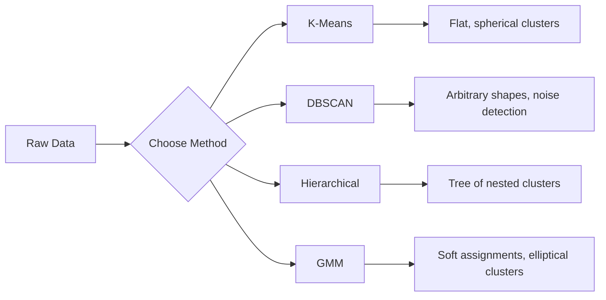

# Uczenie się bez nadzoru

> Żadnych etykiet, żadnego nauczyciela. Algorytm samodzielnie znajduje strukturę.

**Typ:** Kompilacja
**Języki:** Python
**Wymagania wstępne:** Faza 1 (Normy i odległości, prawdopodobieństwo i rozkłady), Faza 2, lekcje 1-6
**Czas:** ~90 minut

## Cele nauczania

- Wdrażaj od podstaw modele K-średnie, DBSCAN i mieszaniny Gaussa i porównuj ich zachowanie w klastrach
- Ocenić jakość klastra za pomocą wyniku sylwetki i metody łokcia, aby wybrać optymalny K
- Wyjaśnij, kiedy DBSCAN przewyższa K-średnie i określ, który algorytm obsługuje niesferyczne klastry i wartości odstające
- Zbuduj potok wykrywania anomalii, korzystając z metod grupowania, aby oznaczyć punkty odbiegające od normalnych wzorców

## Problem

Każda dotychczasowa lekcja ML zakładała oznaczone dane: „tutaj jest wejście, tu jest poprawny wynik”. W prawdziwym świecie etykiety są drogie. W szpitalu znajdują się miliony danych pacjentów, ale nikt nie przypisał każdemu z nich ręcznie kategorii choroby. Witryna e-commerce ma miliony sesji użytkowników, ale nikt nie ma ręcznie oznaczonych segmentów klientów. Zespół ds. bezpieczeństwa ma dzienniki sieciowe, ale nikt nie oznaczył każdej anomalii.

Uczenie się bez nadzoru znajduje wzorce, nie wiedząc, czego szukać. Grupuje podobne punkty danych, odkrywa ukryte struktury i ujawnia anomalie. Jeśli uczenie się nadzorowane to uczenie się z podręcznika zawierającego klucz odpowiedzi, uczenie się bez nadzoru polega na wpatrywaniu się w surowe dane do momentu ujawnienia się wzorców.

Haczyk: bez etykiet nie można bezpośrednio zmierzyć „dobrze” lub „źle”. Potrzebujesz różnych narzędzi, aby ocenić, czy struktura znaleziona przez algorytm ma znaczenie.

## Koncepcja

### Klastrowanie: grupowanie podobnych rzeczy razem

Grupowanie przypisuje każdy punkt danych do grupy (klastra), dzięki czemu punkty w tej samej grupie są do siebie bardziej podobne niż do punktów w innych grupach. Zawsze pojawia się pytanie: co oznacza „podobny”?



### K-średnie: koń pociągowy

K-średnie dzieli dane na dokładnie K klastrów. Każda gromada ma środek ciężkości (jego środek masy), a każdy punkt należy do najbliższego środka ciężkości.

Algorytm Lloyda:

1. Jako początkowe centroidy wybierz K losowych punktów
2. Przypisz każdy punkt danych do najbliższej centroidy
3. Oblicz ponownie każdy centroid jako średnią przypisanych mu punktów
4. Powtarzaj kroki 2-3, aż przypisania przestaną się zmieniać

Funkcja celu (bezwładność) mierzy całkowitą kwadratową odległość od każdego punktu do przypisanej mu środka ciężkości. K-średnie minimalizuje to, ale znajduje tylko lokalne minimum. Różne inicjalizacje mogą dawać różne wyniki.

### Wybór K

Dwie standardowe metody:

**Metoda łokcia:** Oblicz średnie K dla K = 1, 2, 3, ..., n. Wykreśl bezwładność względem K. Poszukaj „łokcia”, w którym dodanie większej liczby klastrów przestaje znacząco zmniejszać bezwładność.

**Wynik sylwetki:** Dla każdego punktu zmierz jego podobieństwo do własnego skupienia (a) w porównaniu z najbliższym innym skupieniem (b). Współczynnik sylwetki wynosi (b - a) / max (a, b) i waha się od -1 (złe skupienie) do +1 (dobre skupienie). Średnia ze wszystkich punktów dla wyniku globalnego.

### DBSCAN: Klastrowanie oparte na gęstości

Średnie K zakładają, że klastry są kuliste i wymagają wybrania K z góry. DBSCAN nie przyjmuje żadnego założenia. Znajduje klastry jako gęste regiony oddzielone regionami rzadkimi.

Dwa parametry:
- **eps**: promień sąsiedztwa
- **min_samples**: minimalna liczba punktów potrzebna do utworzenia gęstego regionu

Trzy rodzaje punktów:
- **Punkt główny**: ma co najmniej punkty min_samples w odległości eps
- **Punkt graniczny**: w obrębie eps od punktu rdzenia, ale sam w sobie nie jest punktem rdzenia
- **Punkt szumu**: ani rdzeń, ani granica. To są wartości odstające.

DBSCAN łączy główne punkty, które znajdują się w obrębie eps od siebie, w ten sam klaster. Punkty graniczne łączą się z klastrem pobliskiego punktu podstawowego. Punkty szumu nie należą do żadnego klastra.

Mocne strony: znajduje skupienia o dowolnym kształcie, automatycznie określa liczbę skupień, identyfikuje wartości odstające. Słabość: zmaga się ze skupiskami o różnej gęstości.

### Klastrowanie hierarchiczne

Tworzy drzewo (dendrogram) zagnieżdżonych klastrów.

Aglomeracyjne (oddolne):
1. Zacznij od każdego punktu jako osobnego klastra
2. Połącz dwa najbliższe skupienia
3. Powtarzaj, aż pozostanie tylko jeden klaster
4. Przytnij dendrogram do żądanego poziomu, aby uzyskać skupiska K

„Bliskość” między klastrami można mierzyć jako:
- **Pojedyncze połączenie**: minimalna odległość pomiędzy dowolnymi dwoma punktami w dwóch klastrach
- **Całkowite połączenie**: maksymalna odległość pomiędzy dowolnymi dwoma punktami
- **Średnie powiązanie**: średnia odległość pomiędzy wszystkimi parami
- **Metoda Warda**: połączenie, które powoduje najmniejszy wzrost całkowitej wariancji wewnątrz skupień

### Modele mieszaniny Gaussa (GMM)

K-średnie dają trudne przypisania: każdy punkt należy do dokładnie jednego skupienia. GMM daje miękkie przypisania: każdy punkt ma prawdopodobieństwo przynależności do każdego klastra.

GMM zakłada, że ​​dane są generowane na podstawie mieszaniny rozkładów K Gaussa, każdy z własną średnią i kowariancją. Algorytm maksymalizacji oczekiwań (EM) wykorzystuje na zmianę:

- **E-krok**: oblicz prawdopodobieństwo, że każdy punkt należy do każdego Gaussa
- **Krok M**: aktualizacja średniej, kowariancji i wagi mieszania każdego Gaussa, aby zmaksymalizować prawdopodobieństwo danych

GMM może modelować klastry eliptyczne (a nie tylko kuliste jak K-średnie) i naturalnie radzi sobie z nakładającymi się klastrami.

### Kiedy używać „które”.

| Metoda | Najlepsze dla | Unikaj, gdy |
|--------|----------|------------|
| K-Średnie | Duże zbiory danych, klastry kuliste, znane K | Nieregularne kształty, obecne wartości odstające |
| DBSCAN | Nieznane K, dowolne kształty, wykrywanie wartości odstających | Różne gęstości, bardzo duże wymiary |
| Hierarchiczny | Małe zbiory danych, potrzebny dendrogram, nieznany K | Duże zbiory danych (pamięć O(n^2)) |
| GMM | Nakładające się klastry, potrzebne miękkie przypisania | Bardzo duże zbiory danych, zbyt wiele wymiarów |

### Wykrywanie anomalii za pomocą klastrowania

Klastrowanie w naturalny sposób wspiera wykrywanie anomalii:
- **K-Średnie**: punkty oddalone od środka ciężkości są anomaliami
- **DBSCAN**: punkty szumu są z definicji anomaliami
- **GMM**: punkty o niskim prawdopodobieństwie poniżej wszystkich Gaussów są anomaliami

## Zbuduj to

### Krok 1: K-średnie od zera

```python
import math
import random

def euclidean_distance(a, b):
    return math.sqrt(sum((ai - bi) ** 2 for ai, bi in zip(a, b)))

def kmeans(data, k, max_iterations=100, seed=42):
    random.seed(seed)
    n_features = len(data[0])

    centroids = random.sample(data, k)

    for iteration in range(max_iterations):
        clusters = [[] for _ in range(k)]
        assignments = []

        for point in data:
            distances = [euclidean_distance(point, c) for c in centroids]
            nearest = distances.index(min(distances))
            clusters[nearest].append(point)
            assignments.append(nearest)

        new_centroids = []
        for cluster in clusters:
            if len(cluster) == 0:
                new_centroids.append(random.choice(data))
                continue
            centroid = [
                sum(point[j] for point in cluster) / len(cluster)
                for j in range(n_features)
            ]
            new_centroids.append(centroid)

        if all(
            euclidean_distance(old, new) < 1e-6
            for old, new in zip(centroids, new_centroids)
        ):
            print(f"  Converged at iteration {iteration + 1}")
            break

        centroids = new_centroids

    return assignments, centroids
```

### Krok 2: Metoda łokcia i ocena sylwetki

```python
def compute_inertia(data, assignments, centroids):
    total = 0.0
    for point, cluster_id in zip(data, assignments):
        total += euclidean_distance(point, centroids[cluster_id]) ** 2
    return total

def silhouette_score(data, assignments):
    n = len(data)
    if n < 2:
        return 0.0

    clusters = {}
    for i, c in enumerate(assignments):
        clusters.setdefault(c, []).append(i)

    if len(clusters) < 2:
        return 0.0

    scores = []
    for i in range(n):
        own_cluster = assignments[i]
        own_members = [j for j in clusters[own_cluster] if j != i]

        if len(own_members) == 0:
            scores.append(0.0)
            continue

        a = sum(euclidean_distance(data[i], data[j]) for j in own_members) / len(own_members)

        b = float("inf")
        for cluster_id, members in clusters.items():
            if cluster_id == own_cluster:
                continue
            avg_dist = sum(euclidean_distance(data[i], data[j]) for j in members) / len(members)
            b = min(b, avg_dist)

        if max(a, b) == 0:
            scores.append(0.0)
        else:
            scores.append((b - a) / max(a, b))

    return sum(scores) / len(scores)

def find_best_k(data, max_k=10):
    print("Elbow method:")
    inertias = []
    for k in range(1, max_k + 1):
        assignments, centroids = kmeans(data, k)
        inertia = compute_inertia(data, assignments, centroids)
        inertias.append(inertia)
        print(f"  K={k}: inertia={inertia:.2f}")

    print("\nSilhouette scores:")
    for k in range(2, max_k + 1):
        assignments, centroids = kmeans(data, k)
        score = silhouette_score(data, assignments)
        print(f"  K={k}: silhouette={score:.4f}")

    return inertias
```

### Krok 3: DBSCAN od zera

```python
def dbscan(data, eps, min_samples):
    n = len(data)
    labels = [-1] * n
    cluster_id = 0

    def region_query(point_idx):
        neighbors = []
        for i in range(n):
            if euclidean_distance(data[point_idx], data[i]) <= eps:
                neighbors.append(i)
        return neighbors

    visited = [False] * n

    for i in range(n):
        if visited[i]:
            continue
        visited[i] = True

        neighbors = region_query(i)

        if len(neighbors) < min_samples:
            labels[i] = -1
            continue

        labels[i] = cluster_id
        seed_set = list(neighbors)
        seed_set.remove(i)

        j = 0
        while j < len(seed_set):
            q = seed_set[j]

            if not visited[q]:
                visited[q] = True
                q_neighbors = region_query(q)
                if len(q_neighbors) >= min_samples:
                    for nb in q_neighbors:
                        if nb not in seed_set:
                            seed_set.append(nb)

            if labels[q] == -1:
                labels[q] = cluster_id

            j += 1

        cluster_id += 1

    return labels
```

### Krok 4: Model mieszaniny Gaussa (algorytm EM)

```python
def gmm(data, k, max_iterations=100, seed=42):
    random.seed(seed)
    n = len(data)
    d = len(data[0])

    indices = random.sample(range(n), k)
    means = [list(data[i]) for i in indices]
    variances = [1.0] * k
    weights = [1.0 / k] * k

    def gaussian_pdf(x, mean, variance):
        d = len(x)
        coeff = 1.0 / ((2 * math.pi * variance) ** (d / 2))
        exponent = -sum((xi - mi) ** 2 for xi, mi in zip(x, mean)) / (2 * variance)
        return coeff * math.exp(max(exponent, -500))

    for iteration in range(max_iterations):
        responsibilities = []
        for i in range(n):
            probs = []
            for j in range(k):
                probs.append(weights[j] * gaussian_pdf(data[i], means[j], variances[j]))
            total = sum(probs)
            if total == 0:
                total = 1e-300
            responsibilities.append([p / total for p in probs])

        old_means = [list(m) for m in means]

        for j in range(k):
            r_sum = sum(responsibilities[i][j] for i in range(n))
            if r_sum < 1e-10:
                continue

            weights[j] = r_sum / n

            for dim in range(d):
                means[j][dim] = sum(
                    responsibilities[i][j] * data[i][dim] for i in range(n)
                ) / r_sum

            variances[j] = sum(
                responsibilities[i][j]
                * sum((data[i][dim] - means[j][dim]) ** 2 for dim in range(d))
                for i in range(n)
            ) / (r_sum * d)
            variances[j] = max(variances[j], 1e-6)

        shift = sum(
            euclidean_distance(old_means[j], means[j]) for j in range(k)
        )
        if shift < 1e-6:
            print(f"  GMM converged at iteration {iteration + 1}")
            break

    assignments = []
    for i in range(n):
        assignments.append(responsibilities[i].index(max(responsibilities[i])))

    return assignments, means, weights, responsibilities
```

### Krok 5: Wygeneruj dane testowe i uruchom wszystko

```python
def make_blobs(centers, n_per_cluster=50, spread=0.5, seed=42):
    random.seed(seed)
    data = []
    true_labels = []
    for label, (cx, cy) in enumerate(centers):
        for _ in range(n_per_cluster):
            x = cx + random.gauss(0, spread)
            y = cy + random.gauss(0, spread)
            data.append([x, y])
            true_labels.append(label)
    return data, true_labels

def make_moons(n_samples=200, noise=0.1, seed=42):
    random.seed(seed)
    data = []
    labels = []
    n_half = n_samples // 2
    for i in range(n_half):
        angle = math.pi * i / n_half
        x = math.cos(angle) + random.gauss(0, noise)
        y = math.sin(angle) + random.gauss(0, noise)
        data.append([x, y])
        labels.append(0)
    for i in range(n_half):
        angle = math.pi * i / n_half
        x = 1 - math.cos(angle) + random.gauss(0, noise)
        y = 1 - math.sin(angle) - 0.5 + random.gauss(0, noise)
        data.append([x, y])
        labels.append(1)
    return data, labels

if __name__ == "__main__":
    centers = [[2, 2], [8, 3], [5, 8]]
    data, true_labels = make_blobs(centers, n_per_cluster=50, spread=0.8)

    print("=== K-Means on 3 blobs ===")
    assignments, centroids = kmeans(data, k=3)
    print(f"  Centroids: {[[round(c, 2) for c in cent] for cent in centroids]}")
    sil = silhouette_score(data, assignments)
    print(f"  Silhouette score: {sil:.4f}")

    print("\n=== Elbow Method ===")
    find_best_k(data, max_k=6)

    print("\n=== DBSCAN on 3 blobs ===")
    db_labels = dbscan(data, eps=1.5, min_samples=5)
    n_clusters = len(set(db_labels) - {-1})
    n_noise = db_labels.count(-1)
    print(f"  Found {n_clusters} clusters, {n_noise} noise points")

    print("\n=== GMM on 3 blobs ===")
    gmm_assignments, gmm_means, gmm_weights, _ = gmm(data, k=3)
    print(f"  Means: {[[round(m, 2) for m in mean] for mean in gmm_means]}")
    print(f"  Weights: {[round(w, 3) for w in gmm_weights]}")
    gmm_sil = silhouette_score(data, gmm_assignments)
    print(f"  Silhouette score: {gmm_sil:.4f}")

    print("\n=== DBSCAN on moons (non-spherical clusters) ===")
    moon_data, moon_labels = make_moons(n_samples=200, noise=0.1)
    moon_db = dbscan(moon_data, eps=0.3, min_samples=5)
    n_moon_clusters = len(set(moon_db) - {-1})
    n_moon_noise = moon_db.count(-1)
    print(f"  Found {n_moon_clusters} clusters, {n_moon_noise} noise points")

    print("\n=== K-Means on moons (will fail to separate) ===")
    moon_km, moon_centroids = kmeans(moon_data, k=2)
    moon_sil = silhouette_score(moon_data, moon_km)
    print(f"  Silhouette score: {moon_sil:.4f}")
    print("  K-Means splits moons poorly because they are not spherical")

    print("\n=== Anomaly detection with DBSCAN ===")
    anomaly_data = list(data)
    anomaly_data.append([20.0, 20.0])
    anomaly_data.append([-5.0, -5.0])
    anomaly_data.append([15.0, 0.0])
    anomaly_labels = dbscan(anomaly_data, eps=1.5, min_samples=5)
    anomalies = [
        anomaly_data[i]
        for i in range(len(anomaly_labels))
        if anomaly_labels[i] == -1
    ]
    print(f"  Detected {len(anomalies)} anomalies")
    for a in anomalies[-3:]:
        print(f"    Point {[round(v, 2) for v in a]}")
```

## Użyj tego

W przypadku scikit-learn te same algorytmy są jednowierszowe:

```python
from sklearn.cluster import KMeans, DBSCAN, AgglomerativeClustering
from sklearn.mixture import GaussianMixture
from sklearn.metrics import silhouette_score as sklearn_silhouette

km = KMeans(n_clusters=3, random_state=42).fit(data)
db = DBSCAN(eps=1.5, min_samples=5).fit(data)
agg = AgglomerativeClustering(n_clusters=3).fit(data)
gmm_model = GaussianMixture(n_components=3, random_state=42).fit(data)
```

Wersje od podstaw pokazują dokładnie, co obliczają te biblioteki. K-średnie iteruje pomiędzy przypisywaniem i ponownym obliczaniem. DBSCAN hoduje grona z gęstych nasion. GMM na zmianę oczekuje i maksymalizuje. Wersje bibliotek dodają stabilność numeryczną, inteligentniejszą inicjalizację (K-Means++) i przyspieszenie GPU, ale podstawowa logika jest taka sama.

## Wyślij to

Ta lekcja przedstawia od podstaw działające implementacje K-Means, DBSCAN i GMM. Kod klastrowy można ponownie wykorzystać jako podstawę dla bardziej zaawansowanych metod nienadzorowanych.

## Ćwiczenia

1. Zaimplementuj inicjalizację K-Means++: zamiast wybierać losowe centroidy, wybierz losowo pierwszą i każdą kolejną centroidę z prawdopodobieństwem proporcjonalnym do kwadratu odległości od najbliższej istniejącej centroidy. Porównaj prędkość konwergencji z losową inicjalizacją.
2. Dodaj do kodu hierarchiczne grupowanie aglomeracyjne. Zaimplementuj powiązanie Warda i utwórz dendrogram (jako zagnieżdżoną listę połączeń). Wytnij go na różnych poziomach i porównaj z wynikami K-średnich.
3. Zbuduj prosty potok wykrywania anomalii: uruchom DBSCAN i GMM na tych samych danych, zaznacz punkty, które zgodnie z obiema metodami są wartościami odstającymi (szum w DBSCAN, niskie prawdopodobieństwo w GMM). Zmierz nakładanie się metod i omów, jeśli metody się nie zgadzają.

## Kluczowe terminy

| Termin | Co ludzie mówią | Co to właściwie oznacza |
|------|----------------|----------------------|
| Klastrowanie | „Grupowanie podobnych rzeczy” | Podział danych na podzbiory, w przypadku których podobieństwo wewnątrzgrupowe przekracza podobieństwo międzygrupowe, mierzone za pomocą określonej metryki odległości |
| Centroid | „Centrum gromady” | Średnia wszystkich punktów przypisanych do klastra; używany przez K-Means jako przedstawiciela klastra |
| Bezwładność | „Jak ciasne są skupiska” | Suma kwadratów odległości od każdego punktu do przypisanej mu centroidy; niżej jest ciaśniej |
| Wynik sylwetki | „Jak dobrze oddzielone są klastry” | Dla każdego punktu (b - a) / max(a, b) gdzie a to średnia odległość wewnątrz gromady, a b to średnia odległość do najbliższej gromady |
| Kluczowy punkt | „Punkt w gęstym regionie” | Punkt z sąsiadami co najmniej min_samples w odległości eps, w DBSCAN |
| Algorytm EM | „Miękkie średnie K” | Maksymalizacja oczekiwań: iteracyjnie obliczaj prawdopodobieństwa członkostwa (krok E) i aktualizuj parametry rozkładu (krok M) |
| Dendrogram | „Drzewo klastrów” | Diagram drzewa przedstawiający kolejność i odległość, w jakiej klastry zostały połączone w hierarchiczne grupowanie |
| Anomalia | „Odstający” | Punkt danych niezgodny z oczekiwanym wzorcem, zidentyfikowany jako szum przez DBSCAN lub o niskim prawdopodobieństwie przez GMM |

## Dalsze czytanie

– [Stanford CS229 – Uczenie się bez nadzoru](https://cs229.stanford.edu/notes2022fall/main_notes.pdf) – notatki z wykładów Andrew Ng na temat klastrowania i EM
- [scikit-learn Clustering Guide](https://scikit-learn.org/stable/modules/clustering.html) - praktyczne porównanie wszystkich algorytmów klastrowania z przykładami wizualnymi
- [oryginalna praca DBSCAN (Ester et al., 1996)](https://www.aaai.org/Papers/KDD/1996/KDD96-037.pdf) - praca, która wprowadziła klastrowanie oparte na gęstości