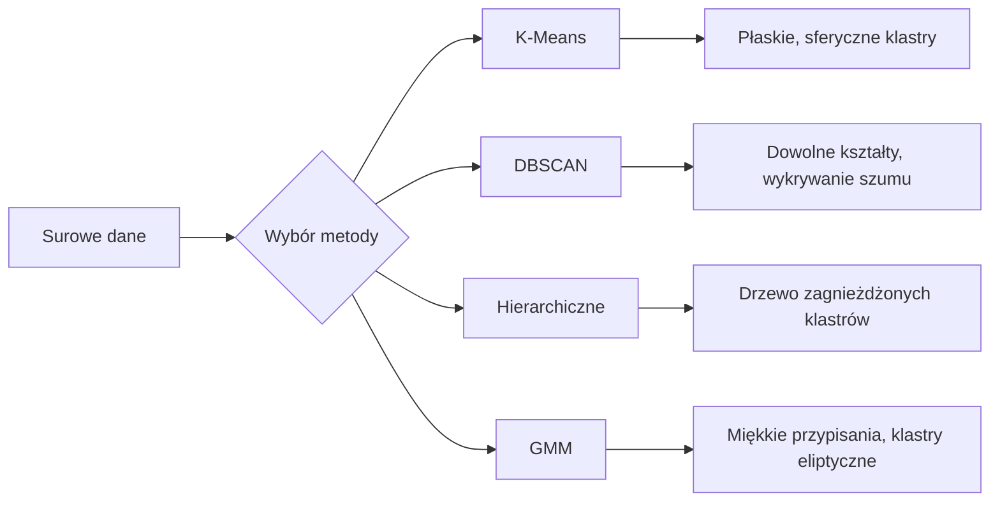

# Uczenie nienadzorowane (Unsupervised Learning)

> Żadnych etykiet, żadnego nauczyciela. Algorytm samodzielnie odkrywa ukrytą strukturę.

**Typ:** Kompilacja
**Języki:** Python
**Wymagania wstępne:** Faza 1 (Normy i odległości, prawdopodobieństwo i rozkłady), Faza 2 (lekcje 1-6)
**Czas:** ~90 minut

## Cele nauczania

- Zaimplementowanie od podstaw algorytmów K-Means (K-średnich), DBSCAN oraz GMM (Gaussian Mixture Models) i porównanie ich zachowania w zadaniach klastrowania (grupowania).
- Ocenianie jakości klastrów przy użyciu wskaźnika sylwetki (Silhouette Score) oraz metody łokcia (Elbow Method) w celu wyboru optymalnego K.
- Zrozumienie, w jakich sytuacjach DBSCAN przewyższa K-Means, oraz określenie, który algorytm najlepiej radzi sobie z klastrami o nieregularnych (niesferycznych) kształtach oraz wartościami odstającymi.
- Zbudowanie potoku wykrywania anomalii wykorzystującego metody klastrowania do oznaczania punktów, które nie pasują do normalnych wzorców.

## Problem

Wszystkie dotychczasowe lekcje ML zakładały obecność danych oznaczonych (etykietowanych): "oto dane wejściowe, a oto prawidłowa odpowiedź". W prawdziwym świecie etykiety są bardzo drogie. Szpital może posiadać miliony rekordów pacjentów, ale nikt nie przypisał ręcznie diagnozy lub kategorii choroby do każdego z nich. Witryna e-commerce dysponuje milionami logów z sesji użytkowników, ale nie ma z góry zdefiniowanych, ręcznie przypisanych segmentów klientów. Zespoły ds. cyberbezpieczeństwa zbierają gigabajty dzienników sieciowych (logów), ale nikt z góry nie oznacza w nich każdej, pojedynczej anomalii.

Uczenie nienadzorowane polega na znajdowaniu wzorców w sytuacji, w której z góry nie wiemy, czego dokładnie szukamy. Algorytmy z tej rodziny grupują podobne punkty danych, odkrywają ukryte struktury i identyfikują anomalie. Jeśli uczenie nadzorowane można porównać do nauki z podręcznika wyposażonego w klucz odpowiedzi, uczenie nienadzorowane przypomina wpatrywanie się w surowe dane tak długo, aż same zaczną układać się we wzory.

Haczyk: bez etykiet nie możesz wprost sprawdzić, czy odpowiedź jest "dobra" czy "zła". Potrzebujesz innych narzędzi, aby obiektywnie ocenić, czy struktura wykryta przez algorytm ma jakikolwiek biznesowy bądź analityczny sens.

## Koncepcje

### Klastrowanie (Grupowanie): Łączenie podobnych obiektów

Klastrowanie to proces przypisywania każdego punktu danych do konkretnej grupy (klastra) w taki sposób, aby punkty wewnątrz tej samej grupy były do siebie bardziej podobne niż do punktów znajdujących się w innych grupach. Pojawia się tu kluczowe pytanie definiujące cały proces: co tak naprawdę znaczy "podobny"?



### K-Means (K-średnich): Wół roboczy klastrowania

Algorytm K-Means dzieli dane na dokładnie K klastrów. Każdy z klastrów ma swój centroid (środek masy), a każdy punkt zostaje przypisany do najbliższego centroidu.

Algorytm Lloyda działa w następujący sposób:

1. Wybierz losowo K punktów, które staną się początkowymi centroidami.
2. Przypisz każdy punkt danych do najbliższego centroidu.
3. Przelicz położenie każdego centroidu, uśredniając współrzędne wszystkich przypisanych mu punktów.
4. Powtarzaj kroki 2-3, aż przypisania punktów do klastrów przestaną się zmieniać (osiągnięto zbieżność).

Funkcja celu (zwana bezwładnością - inertia) mierzy całkowitą sumę kwadratów odległości wszystkich punktów do przypisanych im centroidów. Algorytm K-Means stara się tę wartość zminimalizować, ale w rzeczywistości odnajduje jedynie minimum lokalne. Różne inicjalizacje mogą dawać zupełnie inne, czasem błędne wyniki.

### Wybór optymalnego K

Istnieją dwie standardowe metody:

**Metoda łokcia (Elbow method):** Wykonaj K-Means dla K = 1, 2, 3, ..., n. Narysuj wykres bezwładności w zależności od K. Szukaj "łokcia" – punktu przegięcia wykresu, w którym dodanie kolejnych klastrów przestaje znacząco zmniejszać bezwładność modelu.

**Wskaźnik sylwetki (Silhouette score):** Dla każdego punktu oblicz, jak bardzo jest on podobny do pozostałych elementów własnego klastra (wartość `a`) w porównaniu do elementów najbliższego, sąsiedniego klastra (wartość `b`). Współczynnik sylwetki wynosi `(b - a) / max(a, b)` i przyjmuje wartości od -1 (fatalne klastrowanie, punkt prawdopodobnie w złym klastrze) do +1 (idealne klastrowanie). Uśrednienie wartości dla wszystkich punktów daje globalny wynik, informujący o jakości całego podziału.

### DBSCAN: Klastrowanie oparte na gęstości

K-Means zakłada z góry, że klastry mają okrągły, sferyczny kształt i zmusza inżyniera do arbitralnego wyboru wartości K. Algorytm DBSCAN nie przyjmuje takich założeń. Definiuje on klastry jako gęste regiony przestrzeni, które są od siebie oddzielone regionami rzadkimi.

Wymaga podania dwóch parametrów:
- **eps**: promień badanego sąsiedztwa punktu.
- **min_samples**: minimalna liczba punktów wymagana do uznania danego obszaru za gęsty.

DBSCAN wyróżnia trzy rodzaje punktów:
- **Punkt rdzeniowy (Core point):** ma co najmniej `min_samples` punktów w promieniu `eps`.
- **Punkt graniczny (Border point):** znajduje się w promieniu `eps` od punktu rdzeniowego, ale sam nie spełnia warunku gęstości.
- **Punkt szumu (Noise point):** nie jest ani rdzeniowy, ani graniczny. Są to tzw. wartości odstające (outliery).

DBSCAN scala punkty rdzeniowe znajdujące się w odległości mniejszej niż `eps` od siebie w jeden duży klaster. Punkty graniczne stają się częścią klastra punktu rdzeniowego, do którego należą. Punkty szumu są całkowicie ignorowane.

Mocne strony: Znajduje klastry o dowolnych kształtach, samodzielnie determinuje ostateczną liczbę klastrów, a także naturalnie wyodrębnia wartości odstające.
Słabości: Słabo radzi sobie z klastrami o diametralnie różnej gęstości.

### Klastrowanie hierarchiczne

Metoda ta buduje z klastrów hierarchiczne drzewo nazywane dendrogramem.

Aglomeracyjne (Bottom-up):
1. Rozpocznij, traktując każdy pojedynczy punkt jako osobny, unikalny klaster.
2. Odnajdź dwa znajdujące się najbliżej siebie klastry i połącz je w jeden.
3. Powtarzaj krok 2 tak długo, aż pozostanie tylko jeden, zbiorczy klaster obejmujący wszystkie dane.
4. "Odetnij" dendrogram na odpowiednim poziomie, aby uzyskać wymaganą liczbę K klastrów.

"Odległość" pomiędzy całymi klastrami można mierzyć różnymi metodami sprzężeń (linkage):
- **Pojedyncze (Single linkage):** minimalna odległość pomiędzy dowolnymi dwoma punktami z dwóch różnych klastrów.
- **Całkowite (Complete linkage):** maksymalna odległość pomiędzy dowolnymi dwoma punktami z różnych klastrów.
- **Średnie (Average linkage):** średnia odległość połączonych w pary wszystkich punktów z jednego klastra do drugiego.
- **Metoda Warda:** tworzy takie połączenia, które w najmniejszym stopniu zwiększają całkowitą wewnątrzklastrową wariancję.

### Modele Mieszanin Gausowskich (GMM - Gaussian Mixture Models)

K-Means przypisuje każdy punkt jednoznacznie do jednego klastra (hard clustering). Modele GMM działają inaczej, oferując przypisania "miękkie" (soft assignments): dla każdego punktu wyznaczane jest prawdopodobieństwo, z jakim przynależy on do każdego ze zdefiniowanych klastrów.

GMM wychodzi z założenia, że dane wygenerowano przez zestaw K nałożonych na siebie rozkładów Gaussa, z których każdy posiada własną średnią oraz macierz kowariancji. Algorytm Expectation-Maximization (EM) optymalizuje te parametry, iterując na przemian:

- **E-step (krok oczekiwania):** Obliczenie prawdopodobieństwa przynależności każdego punktu danych do każdego z Gaussów na bazie bieżących parametrów modelu.
- **M-step (krok maksymalizacji):** Zaktualizowanie parametrów opisujących rozkłady (średniej, kowariancji oraz całkowitej wagi poszczególnych "Gausów") tak, by jak najbardziej zmaksymalizować wiarygodność rozkładu zaobserwowanych danych.

Modele GMM fenomenalnie radzą sobie z wykrywaniem nakładających się na siebie struktur oraz modelowaniem klastrów o kształtach eliptycznych (K-Means wymusza sferyczność).

### Kiedy i jakiej metody używać?

| Metoda | Kiedy sprawdza się najlepiej | Kiedy należy jej unikać |
|--------|----------|------------|
| K-Means | Duże zbiory danych, okrągłe/sferyczne klastry, gdy wiemy ile jest grup. | Klastry o dziwnych lub silnie podłużnych kształtach, występowanie anomalii. |
| DBSCAN | Przypadki gdy nie znamy liczby klastrów, nieregularne geometrycznie zbiory, gdy chcemy łatwo izolować szum. | Zbiory o ekstremalnie mocno zróżnicowanej i rozkładającej się gęstości, problemy bardzo wielowymiarowe. |
| Hierarchiczne | Małe zbiory danych, gdy potrzebujemy drzewa zależności (dendrogramu). | Duże zbiory (algorytm pochłania pamięć w trybie O(n^2)). |
| GMM | Sytuacje, gdzie zbiory wzajemnie się przenikają i konieczna jest miękka przynależność. | Bardzo duże zbiory danych, gigantyczne ilości wymiarów. |

### Wykrywanie anomalii z użyciem algorytmów klastrujących

Klastrowanie w naturalny sposób wspiera izolację błędnych danych i anomalii:
- **K-Means**: anomalie to punkty, które leżą najdalej od własnych przypisanych centroidów.
- **DBSCAN**: punkty zidentyfikowane jako "szum" są dosłowną definicją anomalii.
- **GMM**: każdy punkt oceniony skrajnie niskim prawdopodobieństwem przynależności do jakiegokolwiek Gaussa stanowi w modelu anomalię.

## Implementacja

Poniżej znajdziesz implementacje omawianych metod napisane od podstaw w języku Python. Zapoznaj się z plikiem `07-unsupervised-learning/docs/pl.md` lub dedykowanymi plikami z kodem, aby przeanalizować działanie tych algorytmów.

### Krok 1: K-Means od zera
(Kod źródłowy znajduje się w oryginalnym skrypcie/repozytorium)

### Krok 2: Metoda łokcia oraz metryka Sylwetki
(Kod źródłowy do analizy punktu optymalnego podziału klastrów i oceny sylwetki)

### Krok 3: DBSCAN od zera
(Złożona logika sprawdzania sąsiedztwa i kategoryzowania punktów wg eps i min_samples)

### Krok 4: Model mieszaniny Gaussa (GMM - Algorytm EM)
(Złożona matematyka kroku E i kroku M w modelu)

## Wykorzystanie w praktyce

Zamiast implementować algorytmy od zera, w środowiskach produkcyjnych używamy szybkiej biblioteki `scikit-learn`:

```python
from sklearn.cluster import KMeans, DBSCAN, AgglomerativeClustering
from sklearn.mixture import GaussianMixture
from sklearn.metrics import silhouette_score as sklearn_silhouette

# Trenowanie modeli i predykcja (przypisanie do klastrów)
km = KMeans(n_clusters=3, random_state=42).fit(data)
db = DBSCAN(eps=1.5, min_samples=5).fit(data)
agg = AgglomerativeClustering(n_clusters=3).fit(data)
gmm_model = GaussianMixture(n_components=3, random_state=42).fit(data)
```

Implementacje napisane "od zera" są niezwykle przydatne edukacyjnie – dokładnie obrazują to, w jaki sposób działają komercyjne funkcje biblioteczne. K-Means kręci pętlą przypisań do momentu uspokojenia się klastra. DBSCAN niczym wirus rozwija się pochłaniając pobliskie gęste punkty, a model GMM maksymalizuje szanse pokrycia się matematyki. Pakiety Pythonowe dodają do tego gigantyczne stabilizacje matematyczne oraz operacje macierzowe pod spodem (a w tym np. lepszą mechanikę losowania pierwszej paczki w K-Means, znaną jako inicjalizacja `K-Means++`), ale podstawa działania jest zawsze ta sama.

## Ćwiczenia praktyczne

1. Zaimplementuj inicjalizację za pomocą `K-Means++`: zamiast naiwnego, całkowicie ślepego losowania położeń dla początkowych centroidów, przypisz losowo pozycję pierwszej, a dla kolejnych wyznacz prawdopodobieństwo umiejscowienia proporcjonalne do odległości podniesionej do kwadratu w stosunku do poprzedniego węzła. Zmierz i udowodnij empirycznie szybszy czas zbieżności i stabilizacji centroidów w porównaniu do klasycznego mechanizmu Random.
2. Zintegruj z kodem pełen mechanizm klastrowania Hierarchicznego (Aglomeracyjnego). Dodaj mechanikę "Metody Warda" i wygeneruj na końcu pełen wizualny dendrogram podziału zbioru. Wytnij go w paru interesujących wizualnie punktach (wysokościach) i porównaj jak to co uzyskałeś pokrywa się z mechanizmem klasycznego K-Means.
3. Zaprojektuj sprytny silnik wyłapywania zdarzeń nieoczekiwanych (anomalii): skonfiguruj oba systemy, DBSCAN oraz GMM do zaanalizowania danego, skomplikowanego zestawu wartości. Flagi błędów postaw tylko w miejscu w którym te algorytmy krzyżują się ze sobą ze swoimi wnioskami (punkty to szum wg DBSCAN a jednocześnie nienależące matematycznie nigdzie wg prawdopodobieństw GMM). Zmierz rozbieżności z jakim algorytmy zgadzają się i nie zgadzają co do tych konkretnych "punktów błędu".

## Kluczowe pojęcia (Słowniczek)

| Termin | Potoczne określenie | Definicja techniczna |
|------|----------------|----------------------|
| Klastrowanie | "Grupowanie w paczki" | Metoda sztucznego dzielenia wielkiej puli obiektów w odrębne sub-obiekty poddane zasadzie, iż rzeczy będące w podzbiorze wykazują bliskość większą wewnątrz niższ na zewnątrz do środowisk obcych. |
| Centroid | "Środek paczki" | Formalny matematyczny "środek ciężkości". Położenie wyliczane jako wielowymiarowa średnia koordynat w danej osi na podstawie zgromadzonych do danego K elementów przestrzennych. |
| Bezwładność (Inertia) | "Ciasność układu klastra" | Skomplikowany proces kumulowania sum dla kwadratów odległości węzła pod kątem własnego punktu odniesienia. Modele pragną by te wartości były jak najmniejsze, symbolizując zwartość modelu. |
| Wynik sylwetki | "Współczynnik doskonałości izolacji" | Dla węzła wartość wyliczana w zakresie od -1 do 1 stanowiąca skalkulowany układ: `(b - a) / max(a, b)` badająca na ile ułożenie i przynależność ma fizyczny/geometryczny sens. |
| Punkt rdzeniowy | "Generator tłumu" | Element DBSCAN. Obiekt spełniający w pierwszej kolejności założenie gęstości, kumulujący na odległość `eps` innych pobratymców w wolumenie przekraczającym zadany nakaz `min_samples`. |
| Algorytm EM | "Skomplikowany K-Means" | Klasa z modelem opartym na Expectation-Maximization. Koncentruje się na dwóch niezależnych i cyklicznie przeskakujących operacjach estymujących ułożenie rozkładu dla skomplikowanych brył probabilistycznych. |
| Dendrogram | "Drzewko ewolucyjne danych" | Wizualizacja w formie drzewka używana by zademonstrować to, w jaki sposób odbywa się ewolucja "zlewania" małych grupek klastrowych podczas fuzjowania zbioru podczas metody działania trybu hierarchicznego. |
| Anomalia | "Defekt / Śmieć informacyjny" | Informacja niemieszcząca się we wzorze klastrowanym. Obiekt nieprzyporządkowany (szum), z bardzo słabymi własnościami korelującymi z pozostałymi zidentyfikowanymi modelami matematycznymi w użytej metodyce. |

## Dalsza lektura

– [Stanford CS229 – Unsupervised Learning](https://cs229.stanford.edu/notes2022fall/main_notes.pdf) – Notatki z wykładów z jednego z najwybitniejszych szkoleniowców branży AI, Andrew Ng.
- [Przewodnik do klastrowania z pakietu scikit-learn](https://scikit-learn.org/stable/modules/clustering.html) - Kompendium dokumentacji biblioteki `scikit-learn` z przykładami wizualnymi.
- [Oryginalna praca opublikowana ws. DBSCAN (Ester et al., 1996)](https://www.aaai.org/Papers/KDD/1996/KDD96-037.pdf) - Ciekawostka historyczna, praca która pokazała branży i światu rewolucyjne odcięcie od klasycznych założeń odgórnych wielkości i skupienia się na samej gęstości danych.
