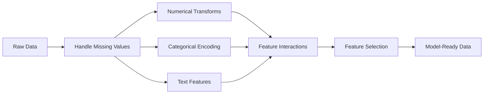

# Inżynieria i wybór funkcji

> Dobra funkcja jest warta tysiąca punktów danych.

**Typ:** Kompilacja
**Języki:** Python
**Wymagania wstępne:** Faza 1 (statystyka dla ML, algebra liniowa), faza 2, lekcje 1-7
**Czas:** ~90 minut

## Cele nauczania

- Wdrażaj transformacje numeryczne (standaryzacja, skalowanie min-max, transformacja logarytmiczna, kategoryzacja) i wyjaśniaj, kiedy każda z nich jest odpowiednia
- Twórz kodowanie typu one-hot, label i target dla funkcji kategorycznych i identyfikuj ryzyko wycieku danych w kodowaniu docelowym
- Skonstruuj od podstaw wektoryzator TF-IDF i wyjaśnij, dlaczego przewyższa on liczbę surowych słów w klasyfikacji tekstu
- Zastosuj selekcję cech w oparciu o filtry (próg wariancji, korelacja, wzajemne informacje), aby zmniejszyć wymiarowość

## Problem

Masz zbiór danych. Wybierasz algorytm. Trenujesz to. Wyniki są mierne. Próbujesz bardziej wyszukanego algorytmu. Nadal przeciętny. Spędzasz tydzień na dostrajaniu hiperparametrów. Marginalna poprawa.

Następnie ktoś przekształca surowe dane w lepsze funkcje, a prosta regresja logistyczna pokonuje dostrojony zespół wzmocniony gradientem.

To się dzieje ciągle. W klasycznym ML reprezentacja danych ma większe znaczenie niż wybór algorytmu. Model ceny domu zawierający „powierzchnię kwadratową” i „liczbę sypialni” przebije model z „adresem w postaci nieprzetworzonego ciągu znaków”, niezależnie od tego, jak zaawansowany jest uczeń. Algorytm może działać tylko z tym, co mu dasz.

Inżynieria cech to proces przekształcania surowych danych w reprezentacje, które ułatwiają modelom znalezienie wzorców. Wybór funkcji to proces odrzucania funkcji, które dodają szum, bez dodawania sygnału. Razem stanowią one działalność o najwyższej dźwigni w klasycznym ML.

## Koncepcja

### Potok funkcji



### Funkcje numeryczne

Surowe liczby rzadko są gotowe do użycia w modelu. Typowe transformacje:

**Skalowanie:** Umieść obiekty w tym samym zakresie, aby algorytmy oparte na odległości (K-średnie, KNN, SVM) traktowały wszystkie obiekty jednakowo. Skalowanie min-max jest odwzorowywane na [0, 1]. Standaryzacja (z-score) odwzorowuje średnią=0, std=1.

**Transformacja logu:** Kompresuje rozkłady prawoskośne (dochód, populacja, liczba słów). Zamienia relacje multiplikatywne w addytywne.

**Binning:** Konwertuje wartości ciągłe na kategorie. Przydatne, gdy związek między cechą a celem jest nieliniowy, ale stopniowy (np. grupy wiekowe).

**Cechy wielomianowe:** Tworzy wyrazy x^2, x^3, x1*x2. Umożliwia modelom liniowym uchwycenie zależności nieliniowych kosztem większej liczby funkcji.

### Cechy kategoryczne

Modele potrzebują numerów. Kategorie wymagają kodowania.

**Kodowanie One-Hot:** Tworzy kolumnę binarną dla każdej kategorii. „kolor = czerwony/niebieski/zielony” staje się trzema kolumnami: is_red, is_blue, is_green. Działa dobrze w przypadku funkcji o niskiej kardynalności, ale eksploduje w przypadku wielu kategorii.

**Kodowanie etykiet:** Mapuje każdą kategorię na liczbę całkowitą: czerwony=0, niebieski=1, zielony=2. Wprowadza fałszywą kolejność (model może myśleć, że zielony > niebieski > czerwony). Odpowiednie tylko dla modeli opartych na drzewie, które dzielą się na poszczególne wartości.

**Kodowanie docelowe:** Zastępuje każdą kategorię średnią zmiennej docelowej dla tej kategorii. Potężny, ale niebezpieczny: wysokie ryzyko wycieku danych. Należy obliczyć wyłącznie na danych szkoleniowych i zastosować do danych testowych.

### Funkcje tekstowe

**Wektoryzator zliczania:** zlicza, ile razy każde słowo pojawia się w dokumencie. „kot usiadł na macie” staje się {the: 2, cat: 1, sat: 1, on: 1, mat: 1}.

**TF-IDF:** Częstotliwość terminu – odwrotna częstotliwość dokumentu. Waży słowa według ich wyjątkowości w dokumentach. Popularne słowa, takie jak „the”, mają niską wagę. Rzadkie, charakterystyczne słowa zyskują dużą wagę.

```
TF(word, doc) = count(word in doc) / total words in doc
IDF(word) = log(total docs / docs containing word)
TF-IDF = TF * IDF
```

### Brakujące wartości

Prawdziwe dane mają dziury. Strategie:

- **Usuń wiersze:** Tylko wtedy, gdy brakujące dane są rzadkie i losowe
- **Przypisanie średniej/mediany:** Proste, zachowuje kształt rozkładu (mediana jest bardziej odporna na wartości odstające)
- **Przypisanie trybu:** Dla cech kategorycznych
- **Kolumna wskaźnikowa:** Przed przypisaniem dodaj kolumnę binarną „was_this_missing”. Sam fakt braku danych może mieć charakter informacyjny
- **Wypełnianie do przodu/do tyłu:** Dla danych szeregów czasowych

### Interakcja funkcji

Czasami związek tkwi w połączeniu. Same „wzrost” i „waga” są mniej przewidywalne niż „BMI = waga / wzrost^2”. Interakcje funkcji zwielokrotniają przestrzeń funkcji, więc skorzystaj z wiedzy dziedzinowej, aby wybrać właściwe.

### Wybór funkcji

Więcej funkcji nie zawsze oznacza lepiej. Nieistotne funkcje powodują hałas, wydłużają czas szkolenia i mogą powodować nadmierne dopasowanie.

**Metody filtrowania (przed modelem):**
- Korelacja: usuń cechy silnie ze sobą skorelowane (nadmiarowe)
- Wzajemne informacje: mierzy, w jakim stopniu znajomość danej cechy zmniejsza niepewność co do celu
- Próg wariancji: usuń funkcje, które prawie się nie różnią

**Metody opakowujące (oparte na modelu):**
- Regularyzacja L1 (Lasso): ustawia wagi nieistotnych cech dokładnie na zero
- Eliminacja funkcji rekurencyjnej: trenuj, usuń najmniej ważną funkcję, powtórz

**Dlaczego wybór ma znaczenie:** Model z 10 dobrymi funkcjami zwykle będzie działał lepiej niż model z 10 dobrymi funkcjami i 90 hałaśliwymi. Zaszumione funkcje dają modelowi możliwość nadmiernego dopasowania do wzorców danych szkoleniowych, które nie generalizują.

## Zbuduj to

### Krok 1: Transformacje numeryczne od zera

```python
import math

def min_max_scale(values):
    min_val = min(values)
    max_val = max(values)
    if max_val == min_val:
        return [0.0] * len(values)
    return [(v - min_val) / (max_val - min_val) for v in values]

def standardize(values):
    n = len(values)
    mean = sum(values) / n
    variance = sum((v - mean) ** 2 for v in values) / n
    std = math.sqrt(variance) if variance > 0 else 1.0
    return [(v - mean) / std for v in values]

def log_transform(values):
    return [math.log(v + 1) for v in values]

def bin_values(values, n_bins=5):
    min_val = min(values)
    max_val = max(values)
    bin_width = (max_val - min_val) / n_bins
    if bin_width == 0:
        return [0] * len(values)
    result = []
    for v in values:
        bin_idx = int((v - min_val) / bin_width)
        bin_idx = min(bin_idx, n_bins - 1)
        result.append(bin_idx)
    return result

def polynomial_features(row, degree=2):
    n = len(row)
    result = list(row)
    if degree >= 2:
        for i in range(n):
            result.append(row[i] ** 2)
        for i in range(n):
            for j in range(i + 1, n):
                result.append(row[i] * row[j])
    return result
```

### Krok 2: Kodowanie kategoryczne od zera

```python
def one_hot_encode(values):
    categories = sorted(set(values))
    cat_to_idx = {cat: i for i, cat in enumerate(categories)}
    n_cats = len(categories)

    encoded = []
    for v in values:
        row = [0] * n_cats
        row[cat_to_idx[v]] = 1
        encoded.append(row)

    return encoded, categories

def label_encode(values):
    categories = sorted(set(values))
    cat_to_int = {cat: i for i, cat in enumerate(categories)}
    return [cat_to_int[v] for v in values], cat_to_int

def target_encode(feature_values, target_values, smoothing=10):
    global_mean = sum(target_values) / len(target_values)

    category_stats = {}
    for feat, target in zip(feature_values, target_values):
        if feat not in category_stats:
            category_stats[feat] = {"sum": 0.0, "count": 0}
        category_stats[feat]["sum"] += target
        category_stats[feat]["count"] += 1

    encoding = {}
    for cat, stats in category_stats.items():
        cat_mean = stats["sum"] / stats["count"]
        weight = stats["count"] / (stats["count"] + smoothing)
        encoding[cat] = weight * cat_mean + (1 - weight) * global_mean

    return [encoding[v] for v in feature_values], encoding
```

### Krok 3: Funkcje tekstowe od zera

```python
def count_vectorize(documents):
    vocab = {}
    idx = 0
    for doc in documents:
        for word in doc.lower().split():
            if word not in vocab:
                vocab[word] = idx
                idx += 1

    vectors = []
    for doc in documents:
        vec = [0] * len(vocab)
        for word in doc.lower().split():
            vec[vocab[word]] += 1
        vectors.append(vec)

    return vectors, vocab

def tfidf(documents):
    n_docs = len(documents)

    vocab = {}
    idx = 0
    for doc in documents:
        for word in doc.lower().split():
            if word not in vocab:
                vocab[word] = idx
                idx += 1

    doc_freq = {}
    for doc in documents:
        seen = set()
        for word in doc.lower().split():
            if word not in seen:
                doc_freq[word] = doc_freq.get(word, 0) + 1
                seen.add(word)

    vectors = []
    for doc in documents:
        words = doc.lower().split()
        word_count = len(words)
        tf_map = {}
        for word in words:
            tf_map[word] = tf_map.get(word, 0) + 1

        vec = [0.0] * len(vocab)
        for word, count in tf_map.items():
            tf = count / word_count
            idf = math.log(n_docs / doc_freq[word])
            vec[vocab[word]] = tf * idf
        vectors.append(vec)

    return vectors, vocab
```

### Krok 4: Przypisanie brakującej wartości od zera

```python
def impute_mean(values):
    present = [v for v in values if v is not None]
    if not present:
        return [0.0] * len(values), 0.0
    mean = sum(present) / len(present)
    return [v if v is not None else mean for v in values], mean

def impute_median(values):
    present = sorted(v for v in values if v is not None)
    if not present:
        return [0.0] * len(values), 0.0
    n = len(present)
    if n % 2 == 0:
        median = (present[n // 2 - 1] + present[n // 2]) / 2
    else:
        median = present[n // 2]
    return [v if v is not None else median for v in values], median

def impute_mode(values):
    present = [v for v in values if v is not None]
    if not present:
        return values, None
    counts = {}
    for v in present:
        counts[v] = counts.get(v, 0) + 1
    mode = max(counts, key=counts.get)
    return [v if v is not None else mode for v in values], mode

def add_missing_indicator(values):
    return [0 if v is not None else 1 for v in values]
```

### Krok 5: Wybór funkcji od podstaw

```python
def correlation(x, y):
    n = len(x)
    mean_x = sum(x) / n
    mean_y = sum(y) / n
    cov = sum((xi - mean_x) * (yi - mean_y) for xi, yi in zip(x, y)) / n
    std_x = math.sqrt(sum((xi - mean_x) ** 2 for xi in x) / n)
    std_y = math.sqrt(sum((yi - mean_y) ** 2 for yi in y) / n)
    if std_x == 0 or std_y == 0:
        return 0.0
    return cov / (std_x * std_y)

def mutual_information(feature, target, n_bins=10):
    feat_min = min(feature)
    feat_max = max(feature)
    bin_width = (feat_max - feat_min) / n_bins if feat_max != feat_min else 1.0
    feat_binned = [
        min(int((f - feat_min) / bin_width), n_bins - 1) for f in feature
    ]

    n = len(feature)
    target_classes = sorted(set(target))

    feat_bins = sorted(set(feat_binned))
    p_feat = {}
    for b in feat_bins:
        p_feat[b] = feat_binned.count(b) / n

    p_target = {}
    for t in target_classes:
        p_target[t] = target.count(t) / n

    mi = 0.0
    for b in feat_bins:
        for t in target_classes:
            joint_count = sum(
                1 for fb, tv in zip(feat_binned, target) if fb == b and tv == t
            )
            p_joint = joint_count / n
            if p_joint > 0:
                mi += p_joint * math.log(p_joint / (p_feat[b] * p_target[t]))

    return mi

def variance_threshold(features, threshold=0.01):
    n_features = len(features[0])
    n_samples = len(features)
    selected = []

    for j in range(n_features):
        col = [features[i][j] for i in range(n_samples)]
        mean = sum(col) / n_samples
        var = sum((v - mean) ** 2 for v in col) / n_samples
        if var >= threshold:
            selected.append(j)

    return selected

def remove_correlated(features, threshold=0.9):
    n_features = len(features[0])
    n_samples = len(features)

    to_remove = set()
    for i in range(n_features):
        if i in to_remove:
            continue
        col_i = [features[r][i] for r in range(n_samples)]
        for j in range(i + 1, n_features):
            if j in to_remove:
                continue
            col_j = [features[r][j] for r in range(n_samples)]
            corr = abs(correlation(col_i, col_j))
            if corr >= threshold:
                to_remove.add(j)

    return [i for i in range(n_features) if i not in to_remove]
```

### Krok 6: Pełny potok i wersja demonstracyjna

```python
import random

def make_housing_data(n=200, seed=42):
    random.seed(seed)
    data = []
    for _ in range(n):
        sqft = random.uniform(500, 5000)
        bedrooms = random.choice([1, 2, 3, 4, 5])
        age = random.uniform(0, 50)
        neighborhood = random.choice(["downtown", "suburbs", "rural"])
        has_pool = random.choice([True, False])

        sqft_with_missing = sqft if random.random() > 0.05 else None
        age_with_missing = age if random.random() > 0.08 else None

        price = (
            50 * sqft
            + 20000 * bedrooms
            - 1000 * age
            + (50000 if neighborhood == "downtown" else 10000 if neighborhood == "suburbs" else 0)
            + (15000 if has_pool else 0)
            + random.gauss(0, 20000)
        )

        data.append({
            "sqft": sqft_with_missing,
            "bedrooms": bedrooms,
            "age": age_with_missing,
            "neighborhood": neighborhood,
            "has_pool": has_pool,
            "price": price,
        })
    return data

if __name__ == "__main__":
    data = make_housing_data(200)

    print("=== Raw Data Sample ===")
    for row in data[:3]:
        print(f"  {row}")

    sqft_raw = [d["sqft"] for d in data]
    age_raw = [d["age"] for d in data]
    prices = [d["price"] for d in data]

    print("\n=== Missing Value Handling ===")
    sqft_missing = sum(1 for v in sqft_raw if v is None)
    age_missing = sum(1 for v in age_raw if v is None)
    print(f"  sqft missing: {sqft_missing}/{len(sqft_raw)}")
    print(f"  age missing: {age_missing}/{len(age_raw)}")

    sqft_indicator = add_missing_indicator(sqft_raw)
    age_indicator = add_missing_indicator(age_raw)
    sqft_imputed, sqft_fill = impute_median(sqft_raw)
    age_imputed, age_fill = impute_mean(age_raw)
    print(f"  sqft filled with median: {sqft_fill:.0f}")
    print(f"  age filled with mean: {age_fill:.1f}")

    print("\n=== Numerical Transforms ===")
    sqft_scaled = standardize(sqft_imputed)
    age_scaled = min_max_scale(age_imputed)
    sqft_log = log_transform(sqft_imputed)
    age_binned = bin_values(age_imputed, n_bins=5)
    print(f"  sqft standardized: mean={sum(sqft_scaled)/len(sqft_scaled):.4f}, std={math.sqrt(sum(v**2 for v in sqft_scaled)/len(sqft_scaled)):.4f}")
    print(f"  age min-max: [{min(age_scaled):.2f}, {max(age_scaled):.2f}]")
    print(f"  age bins: {sorted(set(age_binned))}")

    print("\n=== Categorical Encoding ===")
    neighborhoods = [d["neighborhood"] for d in data]

    ohe, ohe_cats = one_hot_encode(neighborhoods)
    print(f"  One-hot categories: {ohe_cats}")
    print(f"  Sample encoding: {neighborhoods[0]} -> {ohe[0]}")

    le, le_map = label_encode(neighborhoods)
    print(f"  Label encoding map: {le_map}")

    te, te_map = target_encode(neighborhoods, prices, smoothing=10)
    print(f"  Target encoding: {({k: round(v) for k, v in te_map.items()})}")

    print("\n=== Text Features ===")
    descriptions = [
        "large modern house with pool",
        "small cozy cottage near downtown",
        "spacious family home with large yard",
        "modern apartment downtown with view",
        "rustic cabin in rural area",
    ]
    cv, cv_vocab = count_vectorize(descriptions)
    print(f"  Vocabulary size: {len(cv_vocab)}")
    print(f"  Doc 0 non-zero features: {sum(1 for v in cv[0] if v > 0)}")

    tf, tf_vocab = tfidf(descriptions)
    print(f"  TF-IDF vocabulary size: {len(tf_vocab)}")
    top_words = sorted(tf_vocab.keys(), key=lambda w: tf[0][tf_vocab[w]], reverse=True)[:3]
    print(f"  Doc 0 top TF-IDF words: {top_words}")

    print("\n=== Polynomial Features ===")
    sample_row = [sqft_scaled[0], age_scaled[0]]
    poly = polynomial_features(sample_row, degree=2)
    print(f"  Input: {[round(v, 4) for v in sample_row]}")
    print(f"  Polynomial: {[round(v, 4) for v in poly]}")
    print(f"  Features: [x1, x2, x1^2, x2^2, x1*x2]")

    print("\n=== Feature Selection ===")
    feature_matrix = [
        [sqft_scaled[i], age_scaled[i], float(sqft_indicator[i]), float(age_indicator[i])]
        + ohe[i]
        for i in range(len(data))
    ]

    print(f"  Total features: {len(feature_matrix[0])}")

    surviving_var = variance_threshold(feature_matrix, threshold=0.01)
    print(f"  After variance threshold (0.01): {len(surviving_var)} features kept")

    surviving_corr = remove_correlated(feature_matrix, threshold=0.9)
    print(f"  After correlation filter (0.9): {len(surviving_corr)} features kept")

    binary_prices = [1 if p > sum(prices) / len(prices) else 0 for p in prices]
    print("\n  Mutual information with target:")
    feature_names = ["sqft", "age", "sqft_missing", "age_missing"] + [f"neigh_{c}" for c in ohe_cats]
    for j in range(len(feature_matrix[0])):
        col = [feature_matrix[i][j] for i in range(len(feature_matrix))]
        mi = mutual_information(col, binary_prices, n_bins=10)
        print(f"    {feature_names[j]}: MI={mi:.4f}")

    print("\n  Correlation with price:")
    for j in range(len(feature_matrix[0])):
        col = [feature_matrix[i][j] for i in range(len(feature_matrix))]
        corr = correlation(col, prices)
        print(f"    {feature_names[j]}: r={corr:.4f}")
```

## Użyj tego

Dzięki scikit-learn te transformacje są potokami, które można komponować:

```python
from sklearn.preprocessing import StandardScaler, OneHotEncoder, PolynomialFeatures
from sklearn.impute import SimpleImputer
from sklearn.feature_extraction.text import TfidfVectorizer
from sklearn.feature_selection import mutual_info_classif, VarianceThreshold
from sklearn.compose import ColumnTransformer
from sklearn.pipeline import Pipeline

numeric_pipe = Pipeline([
    ("imputer", SimpleImputer(strategy="median")),
    ("scaler", StandardScaler()),
])

categorical_pipe = Pipeline([
    ("encoder", OneHotEncoder(sparse_output=False)),
])

preprocessor = ColumnTransformer([
    ("num", numeric_pipe, ["sqft", "age"]),
    ("cat", categorical_pipe, ["neighborhood"]),
])
```

Wersje od podstaw pokazują dokładnie, co dzieje się wewnątrz każdej transformacji. Wersje bibliotek dodają obsługę przypadków brzegowych, obsługę macierzy rzadkich i kompozycję potoków, ale matematyka jest taka sama.

## Wyślij to

Ta lekcja daje:
- `outputs/prompt-feature-engineer.md` – zachęta do systematycznego projektowania funkcji na podstawie surowych danych

## Ćwiczenia

1. Dodaj solidne skalowanie (używając mediany i rozstępu międzykwartylowego zamiast średniej i odchylenia standardowego) do przekształceń numerycznych. Porównaj to ze standardowym skalowaniem danych z ekstremalnymi wartościami odstającymi.
2. Zaimplementuj kodowanie docelowe z pominięciem jednego wyjścia: dla każdego wiersza oblicz średnią docelową, wykluczając własną wartość docelową tego wiersza. Pokaż, jak zmniejsza to nadmierne dopasowanie w porównaniu z naiwnym kodowaniem docelowym.
3. Zbuduj zautomatyzowany potok selekcji cech, który łączy próg wariancji, filtrowanie korelacji i ranking wzajemnych informacji. Zastosuj go do zbioru danych mieszkaniowych i porównaj wydajność modelu (użyj prostej regresji liniowej) ze wszystkimi cechami i wybranymi cechami.

## Kluczowe terminy

| Termin | Co ludzie mówią | Co to właściwie oznacza |
|------|----------------|----------------------|
| Inżynieria funkcji | „Tworzenie nowych kolumn” | Przekształcanie surowych danych w reprezentacje ujawniające wzorce w modelu |
| Standaryzacja | „Sprawić, żeby było normalnie” | Odejmowanie średniej i dzielenie przez odchylenie standardowe, tak aby cecha miała średnią=0 i std=1 |
| Jednorazowe kodowanie | „Tworzenie fikcyjnych zmiennych” | Tworzenie jednej kolumny binarnej na kategorię, gdzie dokładnie jedna kolumna to 1 w każdym wierszu |
| Kodowanie docelowe | „Używanie odpowiedzi do kodowania” | Zastąpienie każdej kategorii średnią wartością docelową dla tej kategorii, z wygładzeniem, aby zapobiec nadmiernemu dopasowaniu |
| TF-IDF | „Liczą się fantazyjne słowa” | Termin Częstotliwość razy Odwrotna częstotliwość dokumentu: słowa ważone według stopnia ich odróżnienia w całym korpusie |
| Przypisanie | „Wypełnianie luk” | Zastępowanie brakujących wartości wartościami szacunkowymi (średnia, mediana, tryb lub przewidywane przez model) |
| Wybór funkcji | „Wyrzucanie złych kolumn” | Usuwanie funkcji, które dodają szum lub redundancję, pozostawiając tylko te, które mają sygnał o celu |
| Wzajemne informacje | „Jak wiele jedna rzecz mówi ci o drugiej” | Miara zmniejszenia niepewności co do zmiennej Y uzyskanej poprzez obserwację zmiennej X |
| Wyciek danych | „Przypadkowe oszukiwanie” | Wykorzystanie w trakcie szkolenia informacji, które nie byłyby dostępne w momencie przewidywania, dając fałszywie optymistyczne wyniki |

## Dalsze czytanie

- [Inżynieria funkcji i wybór (Max Kuhn i Kjell Johnson)] (http://www.feat.engineering/) - bezpłatna książka internetowa obejmująca pełny krajobraz inżynierii cech
- [scikit-learn Przewodnik po przetwarzaniu wstępnym](https://scikit-learn.org/stable/modules/preprocessing.html) - praktyczne odniesienie do wszystkich standardowych transformacji
- [Dokładne kodowanie docelowe (Micci-Barreca, 2001)] (https://dl.acm.org/doi/10.1145/507533.507538) - oryginalna praca na temat kodowania docelowego z wygładzaniem