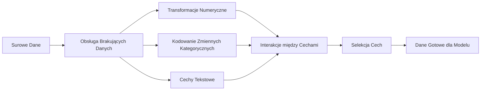

# Inżynieria i selekcja cech (Feature Engineering & Selection)

> Dobra cecha (feature) jest warta tysiąca punktów danych.

**Typ:** Kompilacja
**Języki:** Python
**Wymagania wstępne:** Faza 1 (statystyka dla ML, algebra liniowa), Faza 2 (lekcje 1-7)
**Czas:** ~90 minut

## Cele nauczania

- Zrozumienie i implementacja transformacji numerycznych (standaryzacja, skalowanie min-max, transformacja logarytmiczna, dyskretyzacja) i wyjaśnianie, kiedy stosować każdą z nich.
- Zastosowanie kodowania One-Hot, kodowania etykiet (Label Encoding) oraz kodowania docelowego (Target Encoding) dla zmiennych kategorycznych, z uwzględnieniem ryzyka wycieku danych (data leakage) przy tym ostatnim.
- Skonstruowanie od podstaw wektoryzatora TF-IDF i zrozumienie, dlaczego w klasyfikacji tekstu jest on skuteczniejszy niż zwykłe zliczanie wystąpień słów.
- Przeprowadzanie selekcji cech za pomocą metod filtrowania (próg wariancji, korelacja, informacja wzajemna) w celu redukcji wymiarowości.

## Problem

Masz zbiór danych. Wybierasz algorytm. Trenujesz model. Wyniki są mierne. Próbujesz bardziej zaawansowanego algorytmu. Wyniki wciąż są przeciętne. Spędzasz kolejny tydzień na żmudnym dostrajaniu hiperparametrów. Osiągasz jedynie marginalną poprawę.

I wtedy ktoś inny bierze te same surowe dane, przekształca je w o wiele lepsze cechy, uruchamia najprostszą regresję logistyczną i jego model całkowicie deklasuje twój wymyślny i doskonale dostrojony zespół drzew wzmacnianych gradientowo (Gradient Boosting).

Taka sytuacja to w Data Science codzienność. W klasycznym uczeniu maszynowym odpowiednia reprezentacja danych ma znacznie większe znaczenie niż wybór samego algorytmu. Model wyceny nieruchomości zasilony cechami "powierzchnia w metrach" i "liczba sypialni" zawsze pokona model, do którego wciśniemy "adres w formie długiego tekstu", niezależnie od tego, jak potężnej architektury użyjemy. Model uczy się tylko tego, co jesteś w stanie mu poprawnie przekazać.

Inżynieria cech (Feature Engineering) to proces przekształcania surowych, brudnych danych we wskaźniki, które ułatwiają modelom odnajdywanie ukrytych wzorców. Z kolei selekcja cech to sztuka odrzucania atrybutów, które wprowadzają jedynie szum, nie wnosząc żadnego użytecznego sygnału. Obie te czynności połączone razem to działania o zdecydowanie najwyższej stopie zwrotu inwestycji czasowej w całym procesie klasycznego uczenia maszynowego.

## Koncepcje

### Potok przetwarzania cech (Feature Pipeline)



### Cechy numeryczne

Surowe wartości liczbowe rzadko kiedy są od razu gotowe do użycia przez model. Najpopularniejsze transformacje to:

**Skalowanie (Scaling):** Sprowadzenie cech do podobnego zakresu, aby algorytmy oparte na odległości (jak K-Means, KNN czy SVM) traktowały każdy wymiar z taką samą wagą. Skalowanie Min-Max transformuje wartości do przedziału `[0, 1]`. Standaryzacja (Z-score) mapuje dane tak, aby średnia wynosiła 0, a odchylenie standardowe 1.

**Transformacja logarytmiczna:** Kompresuje rozkłady silnie prawoskośne (np. dochód, wielkość populacji, liczba słów). Konwertuje relacje multyplikatywne w relacje addytywne.

**Dyskretyzacja (Binning):** Zamienia wartości ciągłe w odrębne koszyki (kategorie). Bardzo przydatna, gdy relacja między cechą a celem (targetem) nie jest liniowa, ale zmienia się stopniowo (np. przedziały wiekowe: młody, dorosły, starszy).

**Cechy wielomianowe (Polynomial Features):** Algorytmiczne tworzenie nowych kolumn np. $x^2$, $x^3$, $x_1 \times x_2$. Technika ta pozwala prostym modelom liniowym na uchwycenie wysoce nieliniowych relacji, odbywa się to jednak potężnym kosztem poszerzenia całej przestrzeni zmiennych.

### Cechy kategoryczne

Modele uczenia maszynowego rozumieją wyłącznie liczby. Wartości kategoryczne muszą zostać zakodowane w formie wektorów matematycznych.

**Kodowanie One-Hot (One-Hot Encoding):** Tworzy całkowicie nową binarną (0 lub 1) kolumnę dla każdej oddzielnej podkategorii wejściowej. Kolumna z napisem "kolor: czerwony/niebieski/zielony" rozszerza się w 3 odrębne zmienne: `jest_czerwony`, `jest_niebieski`, `jest_zielony`. Metoda wyśmienicie działa tam, gdzie zmienna posiada niewiele odrębnych unikalnych typów. Przy kategoriach mocno zróżnicowanych rozdmuchuje zestaw w drastyczny, negatywny sposób.

**Kodowanie etykiet (Label Encoding):** Zamienia wybraną grupę wartości pod odpowiednią, rosnącą liczbę całkowitą (czerwony=0, niebieski=1, zielony=2). W tym miejscu wprowadzamy do mechanizmu silnie wymuszoną sztuczną relacyjność (system weźmie dosłownie pod uwagę logikę tego, że zielony > niebieski > czerwony). Bezpieczne we wdrożeniach w modelach decyzyjnych rozbijających się hierarchicznie na mniejsze zbiory (Modele oparte na Drzewach).

**Kodowanie docelowe (Target Encoding):** Całkowicie zamienia surowy wejściowy napis i klasę zmiennej kategorycznej w konkretną wartość średnią wyliczoną w stosunku do kolumny wyników docelowych (zmiennej objaśnianej) z próby treningowej. Jest to genialnie potężne rozwiązanie dla drzew, lecz mocno ryzykowne z uwagi na wycieki i szum. Z tego powodu bezwzględnie przelicza się je zawsze w oddzielnej separacji treningowej, docinając mechanikę odpowiednią funkcją wygładzania wariantowego.

### Cechy tekstowe

**Wektoryzacja przez zliczanie (Count Vectorizer):** Dosłowne policzenie częstotliwości słów i ułożenie ich w macierz. Posiada gigantyczną wadę - wywyższa i premiuje najczęstsze w słowniku pospolite i powtarzalne słowa, marginalizując ważne hasła dziedzinowe.

**TF-IDF:** Częstotliwość występowania terminu w dokumencie w stosunku do odwrotności częstości występowania w całkowitej populacji dokumentów. Potężny fundament NLP. Zwiększa i winduje w górę wagę terminów charakterystycznych w danym pliku, a gasi wagi często używanych i powszechnych zaimków oraz partykuł w mowie i piśmie.

```text
TF(slowo, dok) = liczba_wystapien(slowo w dok) / liczba_slow w dok
IDF(slowo) = log(liczba_wszystkich_dok / liczba_dok_zawierajacych_slowo)
TF-IDF = TF * IDF
```

### Brakujące wartości

Świat nigdy nie produkuje idealnie doskonałych tabel i zawsze generuje jakieś drobne bądź rzadsze luki (NaN). Strategie postępowania:

- **Usuwanie wierszy:** Kategorycznie polecane i bezpieczne, ale wyłącznie jeśli ubytków brakuje skrajnie niewiele (np. do paru promili z pełnego, szerokiego zjawiska) oraz ubytki wydarzyły się całkowicie z czynników absolutnie losowych (MCAR).
- **Imputacja średnią / medianą:** Bardzo bezpieczny z punktu statystycznego algorytm w pełni zabezpieczający wyjściowy kształt krzywych Gaussa bez ich zakrzywiania (mediana nie psuje się w stosunku do ostrych punktów ekstremalnych).
- **Imputacja modą (wartością najczęstszą):** Rekomendowana wyłącznie dla brakujących elementów na polach skategoryzowanych (np. tekst).
- **Tworzenie zmiennych wskaźnikowych:** Zanim uciekniesz się w bezrefleksyjne łatane i wrzucanie "środkowej" wartości z kolumny, wrzuć modelowi informację, dopisując dodatkową kolumnę logiczną (np. `brakowało_informacji_o_wieku`). Czasem sam fenomen "pustej rubryki" zawiera w sobie genialny sygnał wyjaśniający rozpatrywane zjawisko ukryte.
- **Wypełnianie naprzód/wstecz (Forward/Backward fill):** Techniki specyficzne jedynie dla obszarów pracujących z ubytkami wygenerowanymi na ciągach w czasie (Szeregi czasowe).

### Interakcja pomiędzy cechami

Dobre modele można jeszcze bardziej wspierać, budując dla nich autorskie reguły logiczne łączące po kilka surowych sygnałów w logiczne konglomeraty biznesowe lub fizyczne. Rozrzucone jako 2 proste kolumny informacje "Masa" oraz "Wzrost" są o wiele ciężej obrabialne do modelu przewidującego ryzyko wieńcowe, niż celowo wyprowadzona pod to pojedyncza, autorska formuła "Współczynnik BMI = Masa / Wzrost^2". Nie bój się korzystać z pełnej ekspertyzy i dziedzinowego wsparcia eksperta, pod warunkiem odpowiedniego nadzorowania ilości tworzonych struktur (aby nie wpaść w pułapkę uwikłania przestrzennego).

### Wybór (Selekcja) Cech

Zasada jest brutalna i prosta - model dysponujący pulą dziesięciu cech wysokiej rangi matematycznej będzie we wszystkim przebijał układ tych samych genialnych dziesięciu kolumn poszerzony dodatkowo o gigabajt beznadziejnych, zaszumionych i rozciągniętych kolumn-śmieci. Hałas doprowadza w sieciach i modelach ML do wyłapywania znikomych prawidłowości z tabeli próbnej. Model ten nie poradzi sobie na środowisku surowym - po prostu zostanie zjawiskowo przepalony i przeuczony na śmietniku.

**Techniki Filtrowania (niezależne od doboru sieci):**
- Korelacja bazowa - odrzucanie skrajnie nadmiarowych kolumn, które na poziomie wskaźników korelacji Pearsona/Spearmana nakładają się w przedziałach > 0.8 / 0.9.
- Próg wariancji - natychmiastowe blokowanie do przepływu kolumn operujących przez cały zakres identyczną z niezmienną wartością logiczną, o wariancji 0 lub dążącej blisko ku zeru.
- Badanie informacji wzajemnej - bardzo dokładna analiza tego na ile posiadanie wybranego fragmentu zmniejszy całościowy wskaźnik entropii do obiektywnego faktu względem układu wyjściowego.

**Metody Modelowe (wbudowane i iteracyjne):**
- Modele z karami (Regularyzacja L1 Lasso): Narzuca do modelu bardzo specyficzne i mordercze współczynniki nakazujące matematycznie zerowanie najsłabszym informacyjnie i sygnałowo filtrom.
- Rekurencyjna Odrzutnia Cech (RFE): Cykliczne i ciężkie iteracje, polegające na trenowaniu modelu i ślepym wycinaniu za burtę atrybutów radzących sobie najgorzej - do punktu całkowitego pogorszenia systemu jako spójnej jednostki przewidywań.

## Implementacja

Przejrzyj sekcje kodowe poniżej (w kodzie źródłowym dokumentu), aby zapoznać się z fundamentalnymi transformatorami dla wektorów w natywnym Pythonie. Pozwoli ci to zrozumieć, co kryje się pod maską gigantycznych wywołań w scikit-learn.

### Krok 1: Numeryczne Formaty i Transformery
(Szczegółowa logika dla standardowych funkcji konwertujących i rozciągających granice tablicy)

### Krok 2: Transformacje i rzutowanie z wykorzystaniem logiki dla napisów (One-hot, Target i Label Encodery)
(Rozkładanie wymiaru unikatów na osie 0/1, pakowanie pod ciąg i skomplikowany, ale skuteczny układ targetowany dla regresji oparty o wartość zmiennej Y)

### Krok 3: Analiza sekwencji pisanych (CountVectorizer i solidny generator wag dla NLP: TF-IDF)
(Izolowanie i pakowanie tokenów w struktury listowe oraz generatory częstotliwości bazujące na globalnej bazie korpusu dokumentacyjnego)

### Krok 4: Wypełniacze do ubytków (Imputers)
(Kompaktowe funkcje pakujące braki danymi odfiltrowywanymi ze zmierzonych trendów w wierszach sąsiadujących)

### Krok 5: Skrypty odsiewające (Feature Selection)
(Metody oceniające siłę wariancji i sprzężenia wzajemnego pomiędzy dwoma wskazanymi osiami zmiennych niezależnych i ich rzut na wektor warunkowy)

## Wykorzystanie w praktyce

Zestawy narzędzi `scikit-learn` to gotowe bloki pozwalające natychmiastowo zestawiać wyżej opisane rozwiązania we w pełni spersonalizowane, przemysłowe układy produkcyjne (Potoki – Pipelines).

```python
from sklearn.preprocessing import StandardScaler, OneHotEncoder, PolynomialFeatures
from sklearn.impute import SimpleImputer
from sklearn.feature_extraction.text import TfidfVectorizer
from sklearn.feature_selection import mutual_info_classif, VarianceThreshold
from sklearn.compose import ColumnTransformer
from sklearn.pipeline import Pipeline

# Tworzenie rurki przerobowej na danych liczbowych z uzupełnianiem braków
numeric_pipe = Pipeline([
    ("imputer", SimpleImputer(strategy="median")),
    ("scaler", StandardScaler()),
])

# Rurka pod czyste kategoryczne przeroby w locie
categorical_pipe = Pipeline([
    ("encoder", OneHotEncoder(sparse_output=False)),
])

# Główny koordynator łączący logikę pod konkretne atrybuty (kolumny z tabeli)
preprocessor = ColumnTransformer([
    ("num", numeric_pipe, ["sqft", "age"]),
    ("cat", categorical_pipe, ["neighborhood"]),
])
```

Działanie skryptów wewnątrz modułu niczym nie różni się matematycznie od zaimplementowanych i wyeksponowanych kroków z poprzedniej sekcji. Pod spodem scikit-learn dostarcza jednakże silne poprawki uwzględniające kompresje i obsługę błędów zerowania dzielników, wycieków podczas cross-validacji i kompatybilność typowania.

## Co znajdziesz na koniec?

Lekcja ta udostępnia ci cenną rzecz do skrzyneczki narzędzi inżynieryjnych:
- `outputs/prompt-feature-engineer.md` – Zaawansowany i strukturalny mechanizm do sterowania dużymi i zaawansowanymi algorytmami generatywnymi, który wymusi na systemach klasy LLM genialne projektowanie architektury i doboru w inżynierii cech z wykorzystaniem twoich czystych paczek brudnych plików przed obróbką.

## Ćwiczenia praktyczne

1. Spróbuj przepisać logikę operującą na standardowym przeliczniku wskaźnikowym (odejmowanie od średniej przez wariancję) stosując bezpieczną mechanikę na "twardych" wartościach brzegowych (Solidne/Robust skalowanie). Użyj zamiast tego wyliczenia i zbijania wokół wartości medianowych rozrzuconych względem skali i ramy rozstępów międzykwartylowych (IQR). Podepnij na koniec pod wektor ekstremalnie duże skoki zakłóceń numerycznych i przekonaj się o fenomenie tej modyfikacji.
2. Spróbuj rozwinąć silnik kodowania dla targetu w formie omijania z zostawianiem w tyle poszczególnych rekordów. Kiedy operujesz ułożeniem wag wiersz po wierszu, wyłącz wejściową odpowiedź dla przeliczenia od układu referencyjnego dla reszty kolumny. Skutecznie uodporni to model na naiwne kodowanie i zmniejszy bardzo potężne w inżynierii danych przeuczenie pod kątem docelowego wskaźnika kodowań.
3. Utwórz mocarny kod odrzucający najmniej ważące cechy w zbiorze poprzez zintegrowanie trzystopniowej logiki przepustowej: odsiewu pod względem bezwzględnej wariancji statystycznej z filtrem szukającym ekstremów w korelacyjności między punktami. Całość przefiltruj na sam koniec silnikiem testującym powiązania MI (Mutual Information) do wartości granicznej.

## Kluczowe pojęcia (Słowniczek)

| Termin | Potoczne określenie | Definicja techniczna |
|------|----------------|----------------------|
| Inżynieria cech | "Tworzenie nowych kolumn" | Przepisywanie i przelewanie natywnych brudnych pakietów w struktury logiczne o wyśrubowanym dla optymalizatora matematycznego i analitycznego natężeniu w wyliczaniu. |
| Standaryzacja | "Wpychanie w dzwon gaussa" | Brutalne modyfikowanie kolumny gdzie odejmujemy wynik średni od całości, łamiąc wszystko przez wskaźnik statystyczny (odchylenia w dół) dając rozrzut celujący obustronnie gdzie idealnym środkiem jest okrągłe zero a std wynosi jeden. |
| Kodowanie One-Hot | "Zerowanie flag / Fikcyjne zmienne" | Przebijanie wartości jednej pod-danej w n oddzielnych rubryk tabeli posiadającej własności wyłącznie zer i jedynek z całkowitym uwarunkowaniem w logice boolowskiej "czy wystąpiła" na tak lub nie. |
| Kodowanie docelowe | "Przelewanie i kodowanie z podglądu odpowiedzi" | Rozpakowanie poszczególnych atrybutów względem rzutowanych uśrednień uwarunkowań rzędnych w rozkładzie całej wejściowej linii z parametru wektora na koniec trenowanej macierzy w formacie numerycznym skorelowanym by bronić przed overfittingiem. |
| TF-IDF | "Wskaźnik i radar na wyszukane rzadkości językowe" | Baza mechaniki wyszukiwarki słownikowej windująca w górę wartości dla bardzo odciętych i charakterystycznych wpisów semantycznych z równoczesnym ubijaniem znaczeń standardowych dołując wagowo masowy zasób całego zbiorczego bagażu tekstów. |
| Imputacja | "Łatanie informacyjnych dziur" | Wkroczenie algorytmu ze śmiałą predykcyjnie interwencją maskującą niewiadome nan rzuty statystycznym tłem pochodzącym w naturalnym ułożeniu logiki matematycznej reszty wierszów rzędu zbiorczego (najczęściej opierając sztukowanie braków wyliczoną w tym celu średnią lub wartością opartą wprost na medianie rzędu). |
| Selekcja cech | "Koszenie zdegenerowanego hałasu i zrzucanie martwego balastu" | Bezkompromisowe ogałacanie szerokich i płaskich przestrzeni tabel z kolumn psujących algorytmy i dodających gigantyczne natężenie pętli wykonawczych nic nienoszących w końcowy zysk wyników. |
| Informacja Wzajemna (Mutual Information) | "Zysk wprost skorelowany na bazie bytu drugiej osi" | Obliczany ułamek wskaźnikujący i dający miarę stopnia zmniejszania natężenia niewiedzy przy uwarunkowaniu X patrząc bezwzględnie rzutem osiowym w zidentyfikowane właściwości w atrybucie wektora Y. |
| Wyciek danych (Data Leakage) | "Przewidywanie po odkryciu kart / Naiwne oszustwo do wewnątrz" | Katastrofalne zdarzenie rzutujące fatalnie w zysk całego cyklu programistycznego kiedy przeliczając coś przy pre-procesowaniu na froncie operacji wrzucimy do statystyk uwarunkowania pobrane kategorycznie z pakietów treningowych które w trybie produkcyjnym po prostu nie wystąpią przed podaniem rezultatu do silnika docelowego z racji faktu logiki. |

## Dalsza lektura

- [Feature Engineering and Selection (Max Kuhn and Kjell Johnson)](http://www.feat.engineering/) - Genialna i w pełni darmowa pozycja webowa rzucająca ogromne wnikliwe ujęcie nad architekturami formowania cech w modelach konwencjonalnych.
- [Przewodnik do Preprocessingu z repozytorium scikit-learn](https://scikit-learn.org/stable/modules/preprocessing.html) - Szybki i przejrzysty katalog standardowych i powszechnie zaakceptowanych na rynku rozwiązań kaskadowych pod typowanie do transformacji pakietów kolumn.
- [A Preprocessing Scheme for High-Cardinality Categorical Attributes in Classification and Prediction Problems (Micci-Barreca, 2001)](https://dl.acm.org/doi/10.1145/507533.507538) - Formalna, akademicka publikacja dogłębnie drążąca logikę używania systematyki Target-Encoding z odpowiednimi zabezpieczeniami i wygładzaniem (smoothing).
