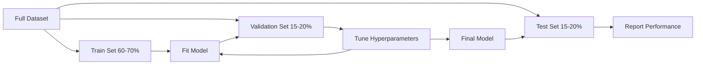

# Ocena modelu

> Model jest tak dobry, jak sposób go mierzy.

**Typ:** Kompilacja
**Języki:** Python
**Wymagania wstępne:** Faza 1 (Prawdopodobieństwo i rozkłady, statystyki dla ML), Faza 2, Lekcje 1-8
**Czas:** ~90 minut

## Cele nauczania

- Zaimplementuj od podstaw K-krotną i warstwową K-krotną walidację krzyżową i wyjaśnij, dlaczego stratyfikacja ma znaczenie w przypadku niezrównoważonych danych
- Oblicz precyzję, przywołanie, F1, AUC-ROC i metryki regresji (MSE, RMSE, MAE, R-kwadrat) od podstaw
- Interpretuj krzywe uczenia się, aby zdiagnozować, czy model ma duże obciążenie czy dużą wariancję
- Identyfikacja typowych błędów w ocenie, w tym wycieku danych, złego wyboru metryk i zanieczyszczenia zestawu testowego

## Problem

Szkoliłeś modelkę. Zapewnia dokładność danych wynoszącą 95%. Czy to dobrze?

Może. Może nie. Jeśli 95% danych należy do jednej klasy, model, który zawsze przewiduje, że klasa uzyska 95% dokładności, a jednocześnie będzie całkowicie bezużyteczna. Jeśli oceniałeś na tych samych danych, na których trenowałeś, liczba 95% nie ma znaczenia, ponieważ model po prostu zapamiętał odpowiedzi. Jeśli zbiór danych zawiera składnik czasu, a przed podziałem dokonano losowego przetasowania, model może wykorzystywać przyszłe dane do przewidywania przeszłości.

Ocena modelu to miejsce, w którym większość projektów ML kończy się niepowodzeniem. Niewłaściwa metryka sprawia, że ​​zły model wygląda dobrze. Zły podział pozwala modelowi oszukiwać. Błędne porównanie powoduje, że wybierasz gorszy model. Właściwa ewaluacja nie jest opcjonalna. To jest różnica pomiędzy modelem, który sprawdza się w produkcji, a takim, który zawodzi w momencie, gdy zobaczy prawdziwe dane.

## Koncepcja

### Trenuj, sprawdzaj, testuj



Trzy podziały, trzy cele:

- **Zbiór uczący**: model uczy się na podstawie tych danych. Widzi te przykłady podczas szkolenia.
- **Zestaw walidacyjny**: używany do dostrajania hiperparametrów i wybierania pomiędzy modelami. Model nigdy nie trenuje na tych danych, ale wpływają one na Twoje decyzje.
- **Zestaw testowy**: dotknięty dokładnie raz, na samym końcu, w celu sprawdzenia końcowego działania. Jeśli spojrzysz na wydajność testu, a następnie wrócisz, aby zmienić model, nie będzie to już zbiór testowy. Stał się drugim zestawem walidacyjnym.

Zestaw testowy stanowi gwarancję, że raportowana wydajność odzwierciedla zachowanie modelu na naprawdę niewidocznych danych.

### Walidacja krzyżowa typu K

W przypadku małych zbiorów danych pojedynczy podział pociągu/walidacji marnuje dane i daje zaszumione szacunki. K-krotna walidacja krzyżowa wykorzystuje wszystkie dane zarówno do szkolenia, jak i walidacji:

```mermaid
flowchart TB
    subgraph Fold1["Fold 1"]
        direction LR
        V1["Val"] --- T1a["Train"] --- T1b["Train"] --- T1c["Train"] --- T1d["Train"]
    end
    subgraph Fold2["Fold 2"]
        direction LR
        T2a["Train"] --- V2["Val"] --- T2b["Train"] --- T2c["Train"] --- T2d["Train"]
    end
    subgraph Fold3["Fold 3"]
        direction LR
        T3a["Train"] --- T3b["Train"] --- V3["Val"] --- T3c["Train"] --- T3d["Train"]
    end
    subgraph Fold4["Fold 4"]
        direction LR
        T4a["Train"] --- T4b["Train"] --- T4c["Train"] --- V4["Val"] --- T4d["Train"]
    end
    subgraph Fold5["Fold 5"]
        direction LR
        T5a["Train"] --- T5b["Train"] --- T5c["Train"] --- T5d["Train"] --- V5["Val"]
    end
    Fold1 --> R["Average scores"]
    Fold2 --> R
    Fold3 --> R
    Fold4 --> R
    Fold5 --> R
```



1. Podziel dane na K równych części
2. Dla każdego fałdu ćwicz na fałdach K-1 i sprawdzaj na pozostałych fałdach
3. Uśrednij wyniki walidacji K

K=5 lub K=10 to standardowe opcje. Każdy punkt danych jest używany do walidacji dokładnie raz. Średni wynik jest bardziej stabilnym szacunkiem niż jakikolwiek pojedynczy podział.

**Warstwowe składanie K**: zachowuje rozkład klas w każdym zgięciu. Jeśli Twój zbiór danych składa się w 70% z klasy A i 30% z klasy B, każde zagięcie będzie miało mniej więcej taki sam stosunek. Jest to ważne w przypadku niezrównoważonych zbiorów danych, w których losowy podział może umieścić wszystkie próbki mniejszości w jednym miejscu.

### Metryki klasyfikacji

**Matryca zamieszania**: podstawa. Dla klasyfikacji binarnej:

|  | Przewidywany pozytywny | Przewidywany wynik negatywny |
|--|---|---|
| Właściwie pozytywne | Prawdziwie pozytywny (TP) | Fałszywie ujemny (FN) |
| Właściwie negatywne | Fałszywie pozytywny (FP) | Prawdziwie ujemny (TN) |

Z tej macierzy wynikają wszystkie pozostałe metryki:

- **Dokładność** = (TP + TN) / (TP + TN + FP + FN). Część prawidłowych przewidywań. Wprowadzanie w błąd, gdy zajęcia są niezrównoważone.
- **Precyzja** = TP / (TP + FP). Ze wszystkich rzeczy, które przewidywano pozytywnie, ile faktycznie było? Używaj, gdy fałszywe alarmy są kosztowne (np. filtr spamu oznaczający prawdziwe wiadomości e-mail jako spam).
- **Przywołanie** (czułość) = TP / (TP + FN). Ze wszystkich pozytywów, ile złapaliśmy? Stosować, gdy wyniki fałszywie negatywne są kosztowne (np. badania przesiewowe w kierunku raka, podczas których nie stwierdza się guza).
- **Wynik F1** = 2 * precyzja * przywołanie / (precyzja + przywołanie). Harmoniczna średnia precyzji i zapamiętywania. Równoważy oba, gdy żadne z nich wyraźnie nie dominuje.
- **AUC-ROC**: Obszar pod krzywą charakterystyki działania odbiornika. Wykresuje odsetek wyników prawdziwie dodatnich w porównaniu z odsetkami wyników fałszywie dodatnich przy różnych progach klasyfikacji. AUC = 0,5 oznacza losowe zgadywanie, AUC = 1,0 oznacza doskonałą separację. Niezależny od progu: mierzy, jak dobrze model plasuje wartości pozytywne w stosunku do negatywnych, niezależnie od wybranej wartości odcięcia.

### Metryki regresji

- **MSE** (błąd średniokwadratowy) = średnia((y_true - y_pred)^2). Karze kwadratowo duże błędy. Wrażliwy na wartości odstające.
- **RMSE** (średnia kwadratowa błędu) = sqrt(MSE). Te same jednostki, co zmienna docelowa. Łatwiejsze do interpretacji niż MSE.
- **MAE** (Średni błąd bezwzględny) = średnia(|y_true - y_pred|). Traktuje wszystkie błędy liniowo. Bardziej odporny na wartości odstające niż MSE.
- **R-kwadrat** = 1 - SS_res / SS_tot, gdzie SS_res = suma((y_true - y_pred)^2) i SS_tot = suma((y_true - y_mean)^2). Ułamek wariancji wyjaśniony przez model. R^2 = 1,0 jest idealne. R^2 = 0,0 oznacza, że ​​model nie jest lepszy niż zawsze przewidujący średnią. R^2 może być ujemne, jeśli model jest gorszy od średniej.

### Krzywe uczenia się

Wykreśl wyniki uczenia i walidacji jako funkcję rozmiaru zestawu treningowego:

- **Wysokie odchylenie (niedopasowanie)**: obie krzywe zbiegają się, dając niski wynik. Dodanie większej ilości danych nie pomoże. Potrzebujesz bardziej złożonego modelu.
- **Wysoka wariancja (nadmierne dopasowanie)**: wynik treningu jest wysoki, ale wynik walidacji jest znacznie niższy. Przepaść między nimi jest duża. Dodanie większej ilości danych powinno pomóc.

### Krzywe walidacyjne

Wykreśl wyniki uczenia i walidacji jako funkcję hiperparametru:

- Przy niskiej złożoności: oba wyniki są niskie (niedopasowanie)
- Przy odpowiedniej złożoności: oba wyniki są wysokie i zbliżone do siebie
- Przy dużej złożoności: wynik szkolenia pozostaje wysoki, ale wynik walidacji spada (przeuczenie)

Optymalna wartość hiperparametru to miejsce, w którym wynik walidacji osiąga szczyt.

### Typowe błędy w ocenie

**Wyciek danych**: informacje ze zbioru testowego wyciekają do treningu. Przykłady: dopasowanie skalera do pełnego zbioru danych przed podziałem, w tym przyszłych danych w przewidywaniu szeregów czasowych, przy użyciu funkcji wywodzącej się z wartości docelowej. Zawsze najpierw dziel, a potem przetwarzaj wstępnie.

**Nierównowaga klas**: 99% transakcji jest legalnych, 1% to oszustwa. Model, który zawsze przewiduje „uzasadniony”, uzyskuje 99% dokładności. Zamiast tego użyj precyzji, przywołania, F1 lub AUC-ROC.

**Niewłaściwy wskaźnik**: optymalizacja dokładności, gdy należy zoptymalizować przypominanie (diagnoza medyczna), lub optymalizacja RMSE, gdy dane zawierają duże wartości odstające (zamiast tego użyj MAE).

**Bez stosowania podziałów warstwowych**: w przypadku niezrównoważonych danych, losowy podział może spowodować, że do walidacji trafi bardzo niewiele próbek mniejszościowych, co doprowadzi do niestabilnych szacunków.

**Testowanie zbyt często**: za każdym razem, gdy patrzysz na wydajność testu i dostosowujesz go, oznacza to, że nadmiernie dopasowujesz się do zbioru testowego. Zestaw testowy jest jednorazowy.

## Zbuduj to

### Krok 1: Podział pociągu/walidacji/testu

```python
import random
import math

def train_val_test_split(X, y, train_ratio=0.6, val_ratio=0.2, seed=42):
    random.seed(seed)
    n = len(X)
    indices = list(range(n))
    random.shuffle(indices)

    train_end = int(n * train_ratio)
    val_end = int(n * (train_ratio + val_ratio))

    train_idx = indices[:train_end]
    val_idx = indices[train_end:val_end]
    test_idx = indices[val_end:]

    X_train = [X[i] for i in train_idx]
    y_train = [y[i] for i in train_idx]
    X_val = [X[i] for i in val_idx]
    y_val = [y[i] for i in val_idx]
    X_test = [X[i] for i in test_idx]
    y_test = [y[i] for i in test_idx]

    return X_train, y_train, X_val, y_val, X_test, y_test
```

### Krok 2: K-krotna i warstwowa weryfikacja krzyżowa K-krotna

```python
def kfold_split(n, k=5, seed=42):
    random.seed(seed)
    indices = list(range(n))
    random.shuffle(indices)

    fold_size = n // k
    folds = []

    for i in range(k):
        start = i * fold_size
        end = start + fold_size if i < k - 1 else n
        val_idx = indices[start:end]
        train_idx = indices[:start] + indices[end:]
        folds.append((train_idx, val_idx))

    return folds

def stratified_kfold_split(y, k=5, seed=42):
    random.seed(seed)

    class_indices = {}
    for i, label in enumerate(y):
        class_indices.setdefault(label, []).append(i)

    for label in class_indices:
        random.shuffle(class_indices[label])

    folds = [{"train": [], "val": []} for _ in range(k)]

    for label, indices in class_indices.items():
        fold_size = len(indices) // k
        for i in range(k):
            start = i * fold_size
            end = start + fold_size if i < k - 1 else len(indices)
            val_part = indices[start:end]
            train_part = indices[:start] + indices[end:]
            folds[i]["val"].extend(val_part)
            folds[i]["train"].extend(train_part)

    return [(f["train"], f["val"]) for f in folds]

def cross_validate(X, y, model_fn, k=5, metric_fn=None, stratified=False):
    n = len(X)

    if stratified:
        folds = stratified_kfold_split(y, k)
    else:
        folds = kfold_split(n, k)

    scores = []
    for train_idx, val_idx in folds:
        X_train = [X[i] for i in train_idx]
        y_train = [y[i] for i in train_idx]
        X_val = [X[i] for i in val_idx]
        y_val = [y[i] for i in val_idx]

        model = model_fn()
        model.fit(X_train, y_train)
        predictions = [model.predict(x) for x in X_val]

        if metric_fn:
            score = metric_fn(y_val, predictions)
        else:
            score = sum(1 for yt, yp in zip(y_val, predictions) if yt == yp) / len(y_val)
        scores.append(score)

    return scores
```

### Krok 3: Macierz zamieszania i metryki klasyfikacji

```python
def confusion_matrix(y_true, y_pred):
    tp = sum(1 for yt, yp in zip(y_true, y_pred) if yt == 1 and yp == 1)
    tn = sum(1 for yt, yp in zip(y_true, y_pred) if yt == 0 and yp == 0)
    fp = sum(1 for yt, yp in zip(y_true, y_pred) if yt == 0 and yp == 1)
    fn = sum(1 for yt, yp in zip(y_true, y_pred) if yt == 1 and yp == 0)
    return tp, tn, fp, fn

def accuracy(y_true, y_pred):
    tp, tn, fp, fn = confusion_matrix(y_true, y_pred)
    total = tp + tn + fp + fn
    return (tp + tn) / total if total > 0 else 0.0

def precision(y_true, y_pred):
    tp, tn, fp, fn = confusion_matrix(y_true, y_pred)
    return tp / (tp + fp) if (tp + fp) > 0 else 0.0

def recall(y_true, y_pred):
    tp, tn, fp, fn = confusion_matrix(y_true, y_pred)
    return tp / (tp + fn) if (tp + fn) > 0 else 0.0

def f1_score(y_true, y_pred):
    p = precision(y_true, y_pred)
    r = recall(y_true, y_pred)
    return 2 * p * r / (p + r) if (p + r) > 0 else 0.0

def roc_curve(y_true, y_scores):
    thresholds = sorted(set(y_scores), reverse=True)
    tpr_list = []
    fpr_list = []

    total_positives = sum(y_true)
    total_negatives = len(y_true) - total_positives

    for threshold in thresholds:
        y_pred = [1 if s >= threshold else 0 for s in y_scores]
        tp = sum(1 for yt, yp in zip(y_true, y_pred) if yt == 1 and yp == 1)
        fp = sum(1 for yt, yp in zip(y_true, y_pred) if yt == 0 and yp == 1)

        tpr = tp / total_positives if total_positives > 0 else 0.0
        fpr = fp / total_negatives if total_negatives > 0 else 0.0

        tpr_list.append(tpr)
        fpr_list.append(fpr)

    return fpr_list, tpr_list, thresholds

def auc_roc(y_true, y_scores):
    fpr_list, tpr_list, _ = roc_curve(y_true, y_scores)

    pairs = sorted(zip(fpr_list, tpr_list))
    fpr_sorted = [p[0] for p in pairs]
    tpr_sorted = [p[1] for p in pairs]

    area = 0.0
    for i in range(1, len(fpr_sorted)):
        width = fpr_sorted[i] - fpr_sorted[i - 1]
        height = (tpr_sorted[i] + tpr_sorted[i - 1]) / 2
        area += width * height

    return area
```

### Krok 4: Metryki regresji

```python
def mse(y_true, y_pred):
    n = len(y_true)
    return sum((yt - yp) ** 2 for yt, yp in zip(y_true, y_pred)) / n

def rmse(y_true, y_pred):
    return math.sqrt(mse(y_true, y_pred))

def mae(y_true, y_pred):
    n = len(y_true)
    return sum(abs(yt - yp) for yt, yp in zip(y_true, y_pred)) / n

def r_squared(y_true, y_pred):
    mean_y = sum(y_true) / len(y_true)
    ss_res = sum((yt - yp) ** 2 for yt, yp in zip(y_true, y_pred))
    ss_tot = sum((yt - mean_y) ** 2 for yt in y_true)
    if ss_tot == 0:
        return 0.0
    return 1.0 - ss_res / ss_tot
```

### Krok 5: Krzywe uczenia się

```python
def learning_curve(X, y, model_fn, metric_fn, train_sizes=None, val_ratio=0.2, seed=42):
    random.seed(seed)
    n = len(X)
    indices = list(range(n))
    random.shuffle(indices)

    val_size = int(n * val_ratio)
    val_idx = indices[:val_size]
    pool_idx = indices[val_size:]

    X_val = [X[i] for i in val_idx]
    y_val = [y[i] for i in val_idx]

    if train_sizes is None:
        train_sizes = [int(len(pool_idx) * r) for r in [0.1, 0.2, 0.4, 0.6, 0.8, 1.0]]

    train_scores = []
    val_scores = []

    for size in train_sizes:
        subset = pool_idx[:size]
        X_train = [X[i] for i in subset]
        y_train = [y[i] for i in subset]

        model = model_fn()
        model.fit(X_train, y_train)

        train_pred = [model.predict(x) for x in X_train]
        val_pred = [model.predict(x) for x in X_val]

        train_scores.append(metric_fn(y_train, train_pred))
        val_scores.append(metric_fn(y_val, val_pred))

    return train_sizes, train_scores, val_scores
```

### Krok 6: Prosty klasyfikator do testów plus pełna wersja demonstracyjna

```python
class SimpleLogistic:
    def __init__(self, lr=0.1, epochs=100):
        self.lr = lr
        self.epochs = epochs
        self.weights = None
        self.bias = 0.0

    def sigmoid(self, z):
        z = max(-500, min(500, z))
        return 1.0 / (1.0 + math.exp(-z))

    def fit(self, X, y):
        n_features = len(X[0])
        self.weights = [0.0] * n_features
        self.bias = 0.0

        for _ in range(self.epochs):
            for xi, yi in zip(X, y):
                z = sum(w * x for w, x in zip(self.weights, xi)) + self.bias
                pred = self.sigmoid(z)
                error = yi - pred
                for j in range(n_features):
                    self.weights[j] += self.lr * error * xi[j]
                self.bias += self.lr * error

    def predict_proba(self, x):
        z = sum(w * xi for w, xi in zip(self.weights, x)) + self.bias
        return self.sigmoid(z)

    def predict(self, x):
        return 1 if self.predict_proba(x) >= 0.5 else 0

class SimpleLinearRegression:
    def __init__(self, lr=0.001, epochs=200):
        self.lr = lr
        self.epochs = epochs
        self.weights = None
        self.bias = 0.0

    def fit(self, X, y):
        n_features = len(X[0])
        self.weights = [0.0] * n_features
        self.bias = 0.0
        n = len(X)

        for _ in range(self.epochs):
            for xi, yi in zip(X, y):
                pred = sum(w * x for w, x in zip(self.weights, xi)) + self.bias
                error = yi - pred
                for j in range(n_features):
                    self.weights[j] += self.lr * error * xi[j] / n
                self.bias += self.lr * error / n

    def predict(self, x):
        return sum(w * xi for w, xi in zip(self.weights, x)) + self.bias

def standardize(values):
    n = len(values)
    mean = sum(values) / n
    var = sum((v - mean) ** 2 for v in values) / n
    std = math.sqrt(var) if var > 0 else 1.0
    return [(v - mean) / std for v in values], mean, std

def make_classification_data(n=300, seed=42):
    random.seed(seed)
    X = []
    y = []
    for _ in range(n):
        x1 = random.gauss(0, 1)
        x2 = random.gauss(0, 1)
        label = 1 if (x1 + x2 + random.gauss(0, 0.5)) > 0 else 0
        X.append([x1, x2])
        y.append(label)
    return X, y

def make_regression_data(n=200, seed=42):
    random.seed(seed)
    X = []
    y = []
    for _ in range(n):
        x1 = random.uniform(0, 10)
        x2 = random.uniform(0, 5)
        target = 3 * x1 + 2 * x2 + random.gauss(0, 2)
        X.append([x1, x2])
        y.append(target)
    return X, y

def make_imbalanced_data(n=300, minority_ratio=0.05, seed=42):
    random.seed(seed)
    X = []
    y = []
    for _ in range(n):
        if random.random() < minority_ratio:
            x1 = random.gauss(3, 0.5)
            x2 = random.gauss(3, 0.5)
            label = 1
        else:
            x1 = random.gauss(0, 1)
            x2 = random.gauss(0, 1)
            label = 0
        X.append([x1, x2])
        y.append(label)
    return X, y

if __name__ == "__main__":
    X_clf, y_clf = make_classification_data(300)

    print("=== Train/Validation/Test Split ===")
    X_train, y_train, X_val, y_val, X_test, y_test = train_val_test_split(X_clf, y_clf)
    print(f"  Train: {len(X_train)}, Val: {len(X_val)}, Test: {len(X_test)}")
    print(f"  Train class distribution: {sum(y_train)}/{len(y_train)} positive")
    print(f"  Val class distribution: {sum(y_val)}/{len(y_val)} positive")

    model = SimpleLogistic(lr=0.1, epochs=200)
    model.fit(X_train, y_train)

    print("\n=== Classification Metrics ===")
    y_pred = [model.predict(x) for x in X_test]
    tp, tn, fp, fn = confusion_matrix(y_test, y_pred)
    print(f"  Confusion matrix: TP={tp}, TN={tn}, FP={fp}, FN={fn}")
    print(f"  Accuracy:  {accuracy(y_test, y_pred):.4f}")
    print(f"  Precision: {precision(y_test, y_pred):.4f}")
    print(f"  Recall:    {recall(y_test, y_pred):.4f}")
    print(f"  F1 Score:  {f1_score(y_test, y_pred):.4f}")

    y_scores = [model.predict_proba(x) for x in X_test]
    auc = auc_roc(y_test, y_scores)
    print(f"  AUC-ROC:   {auc:.4f}")

    print("\n=== K-Fold Cross-Validation (K=5) ===")
    cv_scores = cross_validate(
        X_clf, y_clf,
        model_fn=lambda: SimpleLogistic(lr=0.1, epochs=200),
        k=5,
        metric_fn=accuracy,
    )
    mean_cv = sum(cv_scores) / len(cv_scores)
    std_cv = math.sqrt(sum((s - mean_cv) ** 2 for s in cv_scores) / len(cv_scores))
    print(f"  Fold scores: {[round(s, 4) for s in cv_scores]}")
    print(f"  Mean: {mean_cv:.4f} (+/- {std_cv:.4f})")

    print("\n=== Stratified K-Fold Cross-Validation (K=5) ===")
    strat_scores = cross_validate(
        X_clf, y_clf,
        model_fn=lambda: SimpleLogistic(lr=0.1, epochs=200),
        k=5,
        metric_fn=accuracy,
        stratified=True,
    )
    strat_mean = sum(strat_scores) / len(strat_scores)
    strat_std = math.sqrt(sum((s - strat_mean) ** 2 for s in strat_scores) / len(strat_scores))
    print(f"  Fold scores: {[round(s, 4) for s in strat_scores]}")
    print(f"  Mean: {strat_mean:.4f} (+/- {strat_std:.4f})")

    print("\n=== Imbalanced Data: Why Accuracy Lies ===")
    X_imb, y_imb = make_imbalanced_data(300, minority_ratio=0.05)
    positives = sum(y_imb)
    print(f"  Class distribution: {positives} positive, {len(y_imb) - positives} negative ({positives/len(y_imb)*100:.1f}% positive)")

    always_negative = [0] * len(y_imb)
    print(f"  Always-negative baseline:")
    print(f"    Accuracy:  {accuracy(y_imb, always_negative):.4f}")
    print(f"    Precision: {precision(y_imb, always_negative):.4f}")
    print(f"    Recall:    {recall(y_imb, always_negative):.4f}")
    print(f"    F1 Score:  {f1_score(y_imb, always_negative):.4f}")

    X_tr_i, y_tr_i, X_v_i, y_v_i, X_te_i, y_te_i = train_val_test_split(X_imb, y_imb)
    model_imb = SimpleLogistic(lr=0.5, epochs=500)
    model_imb.fit(X_tr_i, y_tr_i)
    y_pred_imb = [model_imb.predict(x) for x in X_te_i]
    print(f"\n  Trained model on imbalanced data:")
    print(f"    Accuracy:  {accuracy(y_te_i, y_pred_imb):.4f}")
    print(f"    Precision: {precision(y_te_i, y_pred_imb):.4f}")
    print(f"    Recall:    {recall(y_te_i, y_pred_imb):.4f}")
    print(f"    F1 Score:  {f1_score(y_te_i, y_pred_imb):.4f}")

    print("\n=== Regression Metrics ===")
    X_reg, y_reg = make_regression_data(200)

    col0 = [x[0] for x in X_reg]
    col1 = [x[1] for x in X_reg]
    col0_s, m0, s0 = standardize(col0)
    col1_s, m1, s1 = standardize(col1)
    X_reg_scaled = [[col0_s[i], col1_s[i]] for i in range(len(X_reg))]

    X_tr_r, y_tr_r, X_v_r, y_v_r, X_te_r, y_te_r = train_val_test_split(X_reg_scaled, y_reg)
    reg_model = SimpleLinearRegression(lr=0.01, epochs=500)
    reg_model.fit(X_tr_r, y_tr_r)
    y_pred_r = [reg_model.predict(x) for x in X_te_r]

    print(f"  MSE:       {mse(y_te_r, y_pred_r):.4f}")
    print(f"  RMSE:      {rmse(y_te_r, y_pred_r):.4f}")
    print(f"  MAE:       {mae(y_te_r, y_pred_r):.4f}")
    print(f"  R-squared: {r_squared(y_te_r, y_pred_r):.4f}")

    mean_baseline = [sum(y_tr_r) / len(y_tr_r)] * len(y_te_r)
    print(f"\n  Mean baseline:")
    print(f"    MSE:       {mse(y_te_r, mean_baseline):.4f}")
    print(f"    R-squared: {r_squared(y_te_r, mean_baseline):.4f}")

    print("\n=== Learning Curve ===")
    sizes, train_sc, val_sc = learning_curve(
        X_clf, y_clf,
        model_fn=lambda: SimpleLogistic(lr=0.1, epochs=200),
        metric_fn=accuracy,
    )
    print(f"  {'Size':>6} {'Train':>8} {'Val':>8}")
    for s, tr, va in zip(sizes, train_sc, val_sc):
        print(f"  {s:>6} {tr:>8.4f} {va:>8.4f}")

    print("\n=== Statistical Model Comparison ===")
    model_a_scores = cross_validate(
        X_clf, y_clf,
        model_fn=lambda: SimpleLogistic(lr=0.1, epochs=100),
        k=5, metric_fn=accuracy,
    )
    model_b_scores = cross_validate(
        X_clf, y_clf,
        model_fn=lambda: SimpleLogistic(lr=0.1, epochs=500),
        k=5, metric_fn=accuracy,
    )
    diffs = [a - b for a, b in zip(model_a_scores, model_b_scores)]
    mean_diff = sum(diffs) / len(diffs)
    std_diff = math.sqrt(sum((d - mean_diff) ** 2 for d in diffs) / len(diffs))
    t_stat = mean_diff / (std_diff / math.sqrt(len(diffs))) if std_diff > 0 else 0.0
    print(f"  Model A (100 epochs) mean: {sum(model_a_scores)/len(model_a_scores):.4f}")
    print(f"  Model B (500 epochs) mean: {sum(model_b_scores)/len(model_b_scores):.4f}")
    print(f"  Mean difference: {mean_diff:.4f}")
    print(f"  Paired t-statistic: {t_stat:.4f}")
    print(f"  (|t| > 2.78 for significance at p<0.05 with df=4)")
```

## Użyj tego

Dzięki scikit-learn ocena jest wbudowana w przepływ pracy:

```python
from sklearn.model_selection import cross_val_score, StratifiedKFold, learning_curve
from sklearn.metrics import (
    accuracy_score, precision_score, recall_score, f1_score,
    roc_auc_score, confusion_matrix, mean_squared_error, r2_score,
)
from sklearn.linear_model import LogisticRegression

model = LogisticRegression()
scores = cross_val_score(model, X, y, cv=StratifiedKFold(5), scoring="f1")
```

Wersje od podstaw pokazują dokładnie, co robi sprawdzanie krzyżowe (bez magii, tylko pętle for i śledzenie indeksu), jak obliczana jest każda metryka (tylko liczenie TP/FP/TN/FN) i dlaczego stratyfikacja ma znaczenie (zachowując współczynniki klas w każdym przypadku). Wersje bibliotek dodają równoległość, więcej opcji oceniania i integrację z potokami.

## Wyślij to

Ta lekcja daje:
- `outputs/skill-evaluation.md` - umiejętność obejmująca strategię ewaluacji modeli klasyfikacyjnych i regresyjnych

## Ćwiczenia

1. Zaimplementuj krzywe precyzji i przypomnienia: wykreśl precyzję vs przypominanie przy różnych progach. Oblicz średnią precyzję (pole pod krzywą PR). Porównaj krzywą PR z krzywą ROC na niezrównoważonym zbiorze danych i wyjaśnij, kiedy każda z nich dostarcza więcej informacji.
2. Zbuduj zagnieżdżoną pętlę weryfikacji krzyżowej: pętla zewnętrzna ocenia wydajność modelu, pętla wewnętrzna dostraja hiperparametry. Użyj go, aby uczciwie porównać dwa modele bez wyciekania danych walidacyjnych do oceny.
3. Zaimplementuj test permutacji do porównania modeli: przetasuj etykiety, przekwalifikuj się i zmierz wydajność. Powtórz 100 razy, aby zbudować rozkład zerowy. Oblicz wartość p zaobserwowanej wydajności modelu w odniesieniu do tego rozkładu.

## Kluczowe terminy

| Termin | Co ludzie mówią | Co to właściwie oznacza |
|------|----------------|----------------------|
| Nadmierne dopasowanie | „Zapamiętywanie danych treningowych” | Model wychwytuje szum w danych treningowych, osiągając dobre wyniki podczas treningu, ale słabo w przypadku danych niewidocznych |
| Walidacja krzyżowa | „Testowanie na różnych podzbiorach” | Systematyczna zmiana części danych wykorzystywanych do walidacji, uśrednianie wyników ze wszystkich rotacji |
| Precyzja | „Ile przewidywanych pozytywów jest prawidłowych” | TP / (TP + FP): ułamek pozytywnych przewidywań, które są faktycznie pozytywne |
| Przypomnijmy | „Ile faktycznie znaleźliśmy pozytywów” | TP / (TP + FN): ułamek rzeczywistych pozytywów, które zostały poprawnie zidentyfikowane |
| AUC-ROC | „Jak dobrze model oddziela klasy” | Pole pod krzywą współczynnika prawdziwie dodatniego w stosunku do współczynnika fałszywie dodatniego dla wszystkich progów, od 0,5 (losowo) do 1,0 (idealnie) |
| R-kwadrat | „Ile wariancji wyjaśniono” | 1 – (suma kwadratów reszt / całkowita suma kwadratów): ułamek wariancji docelowej uchwycony przez model |
| Wyciek danych | „Modelka oszukana” | Wykorzystanie w trakcie szkolenia informacji, które nie byłyby dostępne w momencie przewidywania, co prowadzi do optymistycznej oceny
| Krzywa uczenia się | „Jak zmienia się wydajność wraz z większą ilością danych” | Wykres wyników uczenia i walidacji w funkcji rozmiaru zestawu treningowego, ujawniający niedopasowanie lub nadmierne dopasowanie |
| Podział warstwowy | „Utrzymanie proporcji klas w równowadze” | Dzielenie danych tak, aby każdy podzbiór miał taką samą proporcję każdej klasy jak pełny zbiór danych |

## Dalsze czytanie

– [Przewodnik po wyborze modelu scikit-learn](https://scikit-learn.org/stable/model_selection.html) – obszerne informacje na temat sprawdzania poprawności krzyżowej, metryk i dostrajania hiperparametrów
- [Beyond Accuracy: Precision and Recall (przyśpieszony kurs Google ML)](https://developers.google.com/machine-learning/crash-course/classification/precision-and-recall) – jasne wyjaśnienie z interaktywnymi przykładami
- [A Survey of Cross-Validation Procedury (Arlot i Celisse, 2010)](https://projecteuclid.org/journals/statistics-surveys/volume-4/issue-none/A-survey-of-cross-validation-procedures-for-model-selection/10.1214/09-SS054.full) – rygorystyczne traktowanie tego, kiedy i dlaczego różne Strategie CV działają