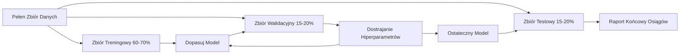

# Ocena Modelu (Model Evaluation)

> Twój model jest tylko tak dobry, jak sposób, w jaki go mierzysz.

**Typ:** Kompilacja
**Języki:** Python
**Wymagania wstępne:** Faza 1 (Prawdopodobieństwo i rozkłady, statystyka dla ML), Faza 2 (Lekcje 1-8)
**Czas:** ~90 minut

## Cele nauczania

- Zaimplementowanie od podstaw walidacji krzyżowej (K-Fold) oraz warstwowej walidacji krzyżowej (Stratified K-Fold) i zrozumienie, dlaczego stratyfikacja ma kluczowe znaczenie w przypadku niezrównoważonych danych.
- Samodzielne obliczanie metryk precyzji (Precision), czułości (Recall), F1-Score, AUC-ROC oraz metryk regresyjnych (MSE, RMSE, MAE, R-kwadrat).
- Poprawna interpretacja krzywych uczenia się w celu diagnozowania problemów z wysokim obciążeniem (high bias) oraz wysoką wariancją (high variance).
- Identyfikacja najczęstszych pułapek w ewaluacji modeli, takich jak wyciek danych (data leakage), błędny dobór metryk czy zanieczyszczenie zbioru testowego.

## Problem

Wytrenowałeś model. Narzędzie pokazuje dokładność (accuracy) na poziomie 95%. Czy to oznacza, że model jest dobry?

Może tak, a może nie. Jeśli w rozpatrywanym problemie 95% rekordów należy z definicji do jednej klasy docelowej, model, który naiwnie i stale wskazuje klasę większościową, bez żadnej analityki uzyska dokładność na poziomie 95% będąc w praktyce kompletnie bezużytecznym. Jeśli podczas ewaluacji użyłeś dokładnie tego samego zbioru, którego użyto na etapie treningu, wynik 95% pozbawiony jest wszelkiego sensu - model mógł po prostu nauczyć się odpowiedzi na pamięć (przeuczenie). Jeśli dodatkowo twój zbiór danych posiadał wewnętrzną strukturę upływającego czasu (Time-Series) i przed testami go potasowałeś, model po prostu skonsumował wartości "z przyszłości" by oceniać "przeszłość".

Ewaluacja to etap, w którym "wykłada się" przygniatająca większość komercyjnych projektów ML wdrożonych w życie biznesowe. Zła metryka potrafi świetnie maskować okropny model. Źle zaplanowany podział stwarza warunki do oszukiwania i przeuczenia algorytmu. Złe porównania doprowadzają do wdrożenia wadliwego mechanizmu. Dlatego bezwzględna powaga w poprawnej ewaluacji i pomiarze to krytyczna praca, stanowiąca potężną różnicę między systemem, który lśni u boku użytkownika produkcyjnego, a rozwiązaniem rozpadającym się przy pierwszej konfrontacji z prawdziwym światem.

## Koncepcje

### Treningowy, Walidacyjny, Testowy (Train, Val, Test)



Trzy rozbicia, trzy zupełnie różne cele:

- **Zbiór Treningowy (Train set)**: Obszar, gdzie uczeń wkuwa wiedzę na blachę. Przykłady na których iteruje, dopasowuje wagi i szuka odpowiedzi.
- **Zbiór Walidacyjny (Validation set)**: Rozwiązanie na którym sprawdzasz działanie modeli po każdej epice lub turze testowej, wybierasz, który wariant hiperparametrów sprawdza się lepiej. Model absolutnie *nie* trenuje (nie poprawia na nim funkcji optymalizacyjnej wag), ale w naturalny sposób kieruje i zawęża twoje ostateczne decyzje konfiguracyjne.
- **Zbiór Testowy (Test set)**: Sejf rozpieczętowywany z góry określony tylko i wyłącznie DOKŁADNIE JEDEN RAZ w historii modelu - tylko na końcu by rzetelnie wystawić raport ostateczny. Jeśli weźmiesz wariant i sprawdzisz jego wynik na secie Testowym, a widząc niezadowalającą wartość zaczniesz modyfikować warianty powracając na front treningowy, ten set Testowy stał się momentalnie Twoim Zbiorem Walidacyjnym i straciłeś narzędzie do uczciwego oszacowania wydajności.

### Walidacja krzyżowa (K-Fold Cross-Validation)

Przy zbiorach o ograniczonej objętości tradycyjne odcinanie pakietów połyka ogromne rezerwy i skutkuje wprowadzaniem wysokiego hałasu z wariancji dla małej próby. K-krotna (K-Fold) walidacja pozwala zjadać ciasto i mieć ciasto.

```mermaid
flowchart TB
    subgraph Fold1["Część 1"]
        direction LR
        V1["Val"] --- T1a["Train"] --- T1b["Train"] --- T1c["Train"] --- T1d["Train"]
    end
    subgraph Fold2["Część 2"]
        direction LR
        T2a["Train"] --- V2["Val"] --- T2b["Train"] --- T2c["Train"] --- T2d["Train"]
    end
    subgraph Fold3["Część 3"]
        direction LR
        T3a["Train"] --- T3b["Train"] --- V3["Val"] --- T3c["Train"] --- T3d["Train"]
    end
    subgraph Fold4["Część 4"]
        direction LR
        T4a["Train"] --- T4b["Train"] --- T4c["Train"] --- V4["Val"] --- T4d["Train"]
    end
    subgraph Fold5["Część 5"]
        direction LR
        T5a["Train"] --- T5b["Train"] --- T5c["Train"] --- T5d["Train"] --- V5["Val"]
    end
    Fold1 --> R["Uśrednione oceny"]
    Fold2 --> R
    Fold3 --> R
    Fold4 --> R
    Fold5 --> R
```



1. Dokonujemy sprawiedliwego pocięcia tabeli w równych ilościach na paczek K.
2. Odpalamy procedurę trenowania odizolowując na czas nauki wycinek 1, i oddając do nauki K-1 fałd.
3. Wskaźniki wyliczamy i agregujemy ze wszystkich wyciągniętych na siłę średnich ocen K.

Standard w branży (uznawany często z góry za wzór rzetelności do puszczania na testy t-Studenta) to procedury o K wynoszącym równo 5, rzadziej do 10. Gwarantują mniejszą wariancję na wskaźniku wynikowym od standardowych strzałów punktowych (pojedynczy random split).

**Walidacja Warstwowa K-Fold (Stratified K-Fold)**: Zabezpieczenie nakazujące, by podział kategorycznie i wiernie powtarzał zachowane uprzednio proporcje dystrybucyjne między elementami (szczególnie niezbędne dla binarnej kategoryzacji klas mniejszości i rzadkich).

### Metryki dla klasyfikacji

**Macierz pomyłek (Confusion matrix)**: Fundament prawdy wyliczeniowej. Tablica zestawiająca to co wystąpiło na prawdę, pod układem przewidywań ze strony logiki binarnej:

|  | Zadeklarowano jako Pozytywny | Zadeklarowano jako Negatywny |
|--|---|---|
| Obiektywnie Pozytywne | Prawdziwie Pozytywne (TP) | Fałszywie Negatywne (FN) |
| Obiektywnie Negatywne | Fałszywie Pozytywne (FP) | Prawdziwie Negatywne (TN) |

Ta macierz daje potężne bazy by generować z niej kolejne obiektywne przeliczniki:

- **Dokładność (Accuracy)** = (TP + TN) / (TP + TN + FP + FN). Ile razy system się ogólnie nie pomylił. Katastrofalny wybór dla dysproporcji.
- **Precyzja (Precision)** = TP / (TP + FP). Z całej fali wyrzuconych przez system zgłoszeń do bazy pod wariant "jest dobrze" - jaki odsetek miało rzetelne uzasadnienie?. Używana kiedy alerty wywalane przez błąd systemu rzutują na duże problemy (niechciany alarm dla działu fraud-ryzyka banku lub fałszywy alarm raka niszczący nerwy zdrowego człowieka).
- **Czułość (Recall)** = TP / (TP + FN). Nałożona perspektywa "co udało się wyciągnąć". System zarzuca wielkie, powolne sito byle nic dołem z układu prawdy przed nim nie zbiegło. Niezbędna tam gdzie koszty przeoczenia kosztują wszystko (Filtry odbezpieczające uderzenie rakiet na zidentyfikowany pojazd cywilny na radarze lub szukanie rzadkich patogenów wirusowych w wodach wodociągu po ataku biologicznym gdzie koszt false negative to zdrowie tysięcy użytkowników a alarm FP jest darmowy).
- **F1 Score** = 2 * (Precyzja * Czułość) / (Precyzja + Czułość). Matematycznie silnie uregulowana średnia harmoniczna ratująca z opresji rozjechanych w lewo czy w prawo statystyk przy wysoce rygorystycznym bilansie dla tych zmiennych.
- **AUC-ROC (Area Under the Receiver Operating Characteristic Curve)**: Niesamowicie miarodajny odcinający próg decyzyjny (np standardowe 0.5) wskaźnik rzutujący punktację w wykres po badaniu wszystkich ewentualnych wariantów dla pułapu "czy jest dobrze" versus odsetek "fałszywych ślepych rzutów strzałką" przy wszystkich konfiguracjach z góry do dołu. Doskonały miernik (na przedział 0.5 – kompletnie bezużyteczny zlewający do 1.0 – kategorycznie genialna separacja przestrzenna klas w wielowymiarach) dający informacje ile szans na bycie prawdą da ocena losowo wybranego przypadku do osądu maszyny.

### Metryki oceniające zadania Regresji

- **Błąd Średniokwadratowy (MSE)** = średnia wartość (y_prawdziwe - y_przewidywane)^2. Gigantycznie karze model za wszelkie rzucania się odciętych, samotnych wartości z tyłu skali z uwagi na potęgę funkcji. Agresywny szeryf od outlayerów.
- **Pierwiastek Błędu (RMSE)** = pierwiastek kwadratowy z (MSE). Łatwiejszy dla interpretacji inżyniera zwracający metrykę do rodzimej linii miary z problemu bez powiększeń potęgowych.
- **Średni błąd bezwzględny (MAE)** = liniowe, proste zebranie średnich wartości modułu z błędów (|y_prawdziwe - y_przewidziane|). Najlepsze przy bardzo szerokich pulach danych gdzie mocne wyskoki skrajne zaczną nam nadto obciążać rzuty i uogólniać sieć pod patologię w dół do wyników normalnych (lepsza ochrona).
- **R-kwadrat (R2)** = Powszechnie zaakceptowana miara obiektywna jak dobrze wyznaczony rzut modelu odciął tło niewiadomego hałasu na sygnale. Ułamek informujący ile % zachowania systemu oznaczanego wyjaśniają te cechy modelu. 1.0 - perfekcyjne i nieskazitelnie udane wyjaśnienie fenomenu; 0.0 - bezdenna głupota algorytmu nie wykazująca lepszych trafień jak ślepe liczenie z kalkulatora wartości arytmetycznie uśrednionej całości; Poniżej zera - usilnie wprowadzany chaos rozwalający system i gubiący rzuty (niedopasowany fatalnie wykres z wielkimi szumami).

### Odchylenie, Wariancja i diagnozowanie przez krzywe z nauki (Learning curves)

Obserwuj wykresy nakładające oceny w ramach rozszerzającej się wkładki ilości dla systemu uczonego i sprawdzanego:

- **Niedopasowanie (Wysokie odchylenie, bias)**: model kładzie się płasko oddając beznadziejny, słaby punktowy strzał równolegle w trybach do uczenia i oceny. Sypanie piaskiem w sprzęt nie ma najmniejszego biznesowego sensu i dorzucenie terabajtów do takiej struktury wyjściowo rzuci tym samym słabym wynikiem, bo sieć modelowa obiektywnie rzecz biorąc nie jest wyposażona z góry we "wrażliwe" instrumenty by łapać i zakrzywiać granice w pożądanych wielowymiarowych relacjach logicznych z bazy. Potrzebny upgrade i więcej zagnieżdżonego "muskułu" analitycznego (wymiany architektury w całości lub mocnego podrasowania sieci).
- **Przeuczenie (Wysoka Wariancja, overfitting)**: model śrubuje treningową wydolność w 100%, całkowicie rozkładając ręce na walidacji dając rozjechaną w dół z rzutami potężną "paszczę" rozwarstwiającą ułożenie obu wykresów od siebie o wiele oczek statystycznych. Pomaga mu tu albo cięcie siłowe zapędów regularyzacjami (by przestał się tak zapamiętale rzucać pod wklepanie bazy jako absolut) albo mocne zalać strumieniem nowych i odmiennych próbek w zbiorze by w końcu uśrednił i wygładził pogląd z poszarpanych pomyłek omijających rzuty.

### Krzywe służące do walidacji

Tnij metryki dla treningów z walidacją poprzez pryzmat jednego sterownika – badanego i iterowanego parametru modyfikującego sieć wewnętrzną w maszynie.

- Brak siły złożoności – oba układają się na dnie z marnym skutkiem (bias).
- Doskonały punkt G dla modelu – wskaźniki podchodzą najwyżej u góry nie odstępując znacząco i nie gryząc się ze sobą.
- Skrajna maksymalizacja opcji dla modelu (rozwijanie n warstw w głąb w potężnej sieci ML lub schodzenie hiper wielomianami w rzędach) – rzut treningowy ląduje idealnie obok jedynki, testowy pikuje w szalejące doły dekonspirując przeuczenie.

Optymalny nastaw to wskaźnik uzyskany tuż przed załamaniem dla opcji sprawdzającej (Walidacyjnej).

### Potężne zaniechania, pomyłki inżynieryjne przy systemach

**Rozlewy informacji (Data leakages)**: Absolutnie numer 1 wszechczasów wprowadzający na rynek modele warte zerowe wartości biznesowe, mimo błyszczących na zielono monitorów testowych u programistów w korporacji w trakcie developementu aplikacji ML. Przykład: wygładzenie całej tablicy na skalach numerycznych, bądź target-encoding z użyciem globalnych wariantów celu _ZANIM_ tnie się plik i chowa pod sejf na set-testowy i set do walidacji. Wynik = skaler wie doskonale i "widzi" ukrycie skali oraz środek i parametry ekstremów tego zjawiska uchodzącego przed nim od strony logicznej. Będzie sztucznie windował. Absolutna dyrektywa nr 1 w ML: tnij od zera pierwsze co otrzymasz, i wiedz i pre-procesuj dane wyłącznie z prób zamkniętych od trenowania, podmieniając później estymatory testów tymi z gotowych ukształtowanych układów optymalizacji skalerów.
**Zachwiana równowaga sił na klasach (Class imbalance)**: Odpalanie optymalizacji po linii "największa dokładność rzutu" dla sieci diagnozujących rzadkiego mutanta przy populacji w badaniu dla raka rzędu kilkaset próbek ułamek. To jawne proszenie się o to, by model kategorycznie zaprzeczał w logice sieci że zjawisko istnieje podbijając punktację ogólną do zyskownych maksimów. Przelicz miary dla odrębnych, słabych pod tym kątem ułożeń przy parametrach precyzji AUC by sprawdzić gdzie podąża uwaga dla rzadkiej domeny informacyjnej.
**Oszukiwanie podczas procesu strojenia (Zbyt duże i nachalne dopytywanie wskaźnikami zbioru dla ostatecznego osądu)**: Set-Testowy to rzecz z logiką dla pojedynczego sprawdzianu, niszczącego uwarunkowanie bezpowrotnie w pył na całe życie jeśli zerkasz tam w pętli wielokrotnie optymalizując ułożenie – on staje się wówczas częścią Twojej bazy do tuningu psując cel dla "nowo i świeżo obrabianej bazy do oceny obiektywnej ujętej z rzutu rzeczywistego".

## Implementacja

Przeanalizuj odpowiednie elementy pliku `code/evaluation.py` zawierające gotowe fundamenty.

## Wykorzystanie w praktyce

Biblioteka `scikit-learn` ułatwia życie, automatyzując i odcinając od nas setki linii kodu koniecznego pod ułożenia z cross-walidacji.

```python
from sklearn.model_selection import cross_val_score, StratifiedKFold, learning_curve
from sklearn.metrics import (
    accuracy_score, precision_score, recall_score, f1_score,
    roc_auc_score, confusion_matrix, mean_squared_error, r2_score,
)
from sklearn.linear_model import LogisticRegression

model = LogisticRegression()
scores = cross_val_score(model, X, y, cv=StratifiedKFold(5), scoring="f1")
```

Warto zaznaczyć, że nauka programowania tych procedur od absolutnych podstaw (pętle przydzielające w locie wektory indeksów, kalkulatory sumujące strzały True Positives / Negatives przy rzutowaniu) stanowi esencję zrozumienia – jak dany pakiet od wewnątrz ocenia i tnie krzywe rzutowane na wektor. Wszystkie komercyjne kompozyty jak Cross-Validation dodają w gratisie system równoległych kalkulacji wielordzeniowych i wsparcie przy łączeniu potoków.

## Co znajdziesz na koniec?

W paczce wynikowej udostępniono kluczowy schemat pod skilla:
- `outputs/skill-evaluation.md` – Kompletny profil operacyjny z rzutowaniem dla modelarza systemów sztucznej oceny. Pomoże zapobiec krytycznym omyłkom decyzyjnym.

## Ćwiczenia praktyczne

1. Zaimplementuj od zera i przeprowadź badanie wykresu "Precision-Recall Curve" i uśrednienia PR-AUC. Narysuj go w starciu ze standardowym rzutem klasycznego AUC-ROC dla zestawienia kategorycznie i rygorystycznie bardzo odjechanego pod względem niezrównoważonych mniejszości pakietu bazy i zobacz, jak potężne wnioski w stosunku dają dla takich domen informacje pochodzące wprost z PR w opozycji do złudnych założeń AUC dla mocnych dysproporcji na osi Y.
2. Zbuduj zaawansowany wielokrotny (Zagnieżdżony - Nested) cykl krzyżowej rzutni ewaluacji podziału "Nested Cross Validation": Zewnętrzna klamra tnąca rzuty pod generalną ewaluację błędu w modelu docelowym a od środka głęboko zaszyte wtórne rzuty dedykowane wyłącznie dla podstrajania hyperparametrów by uczciwie zaprezentować siłę sieci uciekając z "wycieku" dostrojeń we wskaźnik ewaluujący uogólnianie sieci w przestrzeni na styk ze zjawiskiem.
3. Utwórz metodę opartą na klasycznym przeliczeniu przez rzut losowy by udowodnić i uzasadnić różnice modeli. Rozbij siatkę rzutującą, przetasuj etykiety dla setek wycinków oceniając ponownie błędy estymacji w odtwarzanej ślepo z losowo i chaotycznie zrzuconym wektorem warunkującym pod 100 oddzielnych pętli uśredniających. Udowodnij "p-value" sprawdzając czy oryginalna maszyna faktycznie jest genialna czy z góry poddała się zjawisku ślepego losowego zrządzenia szczęścia w doborze wagi.

## Kluczowe pojęcia (Słowniczek)

| Termin | Potoczne określenie | Definicja techniczna |
|------|----------------|----------------------|
| Przeuczenie (Overfitting) | "Kucie bazy na blachę" | Skrajne odchylenie polegające na genialnej optymalizacji wag z rzutu sygnałowego przez co sieć modelowa zatraciła możliwość obróbki świeżej nieoznakowanej fali poprzez wektor. |
| Walidacja krzyżowa | "Sprawdzian łamany dla sprawiedliwości na kilka części" | Iteracyjny proces odcinający cyklicznie porcje pod układ walidacyjny bez straty i wyrzutu z procesu ewaluacji połączony w uśrednienie ocen pod jedną obiektywnie silniejszą nutę i wynik estymowany o wiele z mniejszą wariancją w domenie błędów. |
| Precyzja | "Jak dużo z obiecanych to ostatecznie były trafienia na celu" | Matematyczna wartość ułamkowa dzieląca wycelowane poprawne trafienia (True Positives) poprzez sumaryczny nakład trafień obiektywnych doliczając te z błędnie uruchomionym filtrem wzbudzania (TP + FP). |
| Czułość (Recall) | "Jak mocno otwarte były okna w detektorze by coś wychwycić i zasygnalizować" | Zestawienie tego, co wyłapano poprawnie do kompletnej grupy celów, jaka istniała (licząc ukryte "śpiochy", w stosunku do których zamek zawiódł a maszyna o nich pomyłkowo nie poinformowała FN) poprzez TP / (TP+FN). |
| AUC-ROC | "Jaka siła leży w byciu rzetelnym do rozdzielania jabłek od gruszek" | Zewnętrzny całościowy pomiar szacujący moc silnika w badaniach z ciętą gilotyną pułapów z próg. Optymalna jednostka rzutu z przedziałów ułamków dziesiętnych dających pełen zarys do rozbijania grup klasyfikacji w układ logiczny na skali 0.5 (nic nie wie, strzela jak przy rzucie kostką) w prawo do 1.0. |
| R-Kwadrat | "Zysk i poprawność odchyleń z wyjaśnień fali w opozycji z siłą sygnałów po omacku bazując na szumie" | Relacyjny przelicznik redukcji ułomnego uśredniania sygnału względem obiektywnej optymalizacji predykcji. Skompresowany rzut od zera do jedności opisujący poziom wyjaśnialności błędu w modelowanych wartościach przy analizie regresji. |
| Wyciek Danych (Data Leakage) | "Praca i pisanie z ukradzionym kluczem z odpowiedziami do egzaminu" | Tragiczny we wdrożeniowym świecie ustrój procesowy zapędzający analityków i sieć do niepoprawnego pre-wyliczania wartości dla trenującej maszyny z podglądu z uogólnień dla paczki na której rzekomo maszyna nigdy na oczy nie pracowała oblewając w locie walidację. |
| Krzywa Uczenia (Learning Curve) | "Pogląd w trakcie szkolenia po fali wzrostu przy dodawaniu paczek z informacją" | Zestawienie dwutorowe o zbiegającym do środka lub rozwarstwiającym osie w dół, na bazie predykcji weryfikujące poprawność zjawisk obciążeń bias na osi treningu z osią weryfikacyjną poprzez dodawany strumień skompresowanej wiedzy. |
| Pocięty układ Stratyfikacyjny (Stratified Split) | "Cięcie tortu rygorystycznie pod miarę warstw dla balansu" | Rozwaga w implementowaniu mechaniki cross-valida z zachowaniem odsetkowych dysproporcji (lub po prostu ogólnego balansu klas) przy tworzonych połamanych dla uśrednienia setów gwarantująca wybitnie sterylną i czystą estymację wektorowych zrzutów ostatecznych. |

## Dalsza lektura

- [Oficjalna dokumentacja wytycznych `scikit-learn` dla Doboru Modelu, Modułu Evaluacji Modeli we wskaźnikach CV oraz parametryzacji wieloetapowych](https://scikit-learn.org/stable/model_selection.html) – gigantyczna baza do pochłonięcia opisująca w jasny i genialny merytorycznie wektor pracy nad poprawnym oznaczaniu jakości prac uczenia rzutowanego sieci na procesory logiczne.
- [Google ML Crash Course - Wyjście poza Dokładność w rejon Precision z systematyką na Recall dla odizolowania anomalii w układzie dysproporcji](https://developers.google.com/machine-learning/crash-course/classification/precision-and-recall) - Fenomenalne opracowanie z potężnym i bogatym panelem zabawek symulacyjnych ilustrujących wagę dla rozróżniania precyzji w balansie czułości rzutu sygnału.
- [Praca Akademicka - Rozprawy w sferze systematyk opartych na podziałach Cross-Validation (S. Arlot & A. Celisse, 2010)](https://projecteuclid.org/journals/statistics-surveys/volume-4/issue-none/A-survey-of-cross-validation-procedures-for-model-selection/10.1214/09-SS054.full) – Obiektywne tło matematyczne dlaczego w różnych konfiguracjach należy wybierać specyficzne strategie do implementowania ewaluacji modeli analitycznych.
