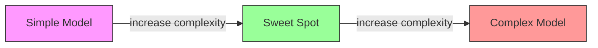
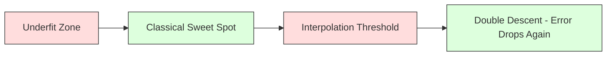
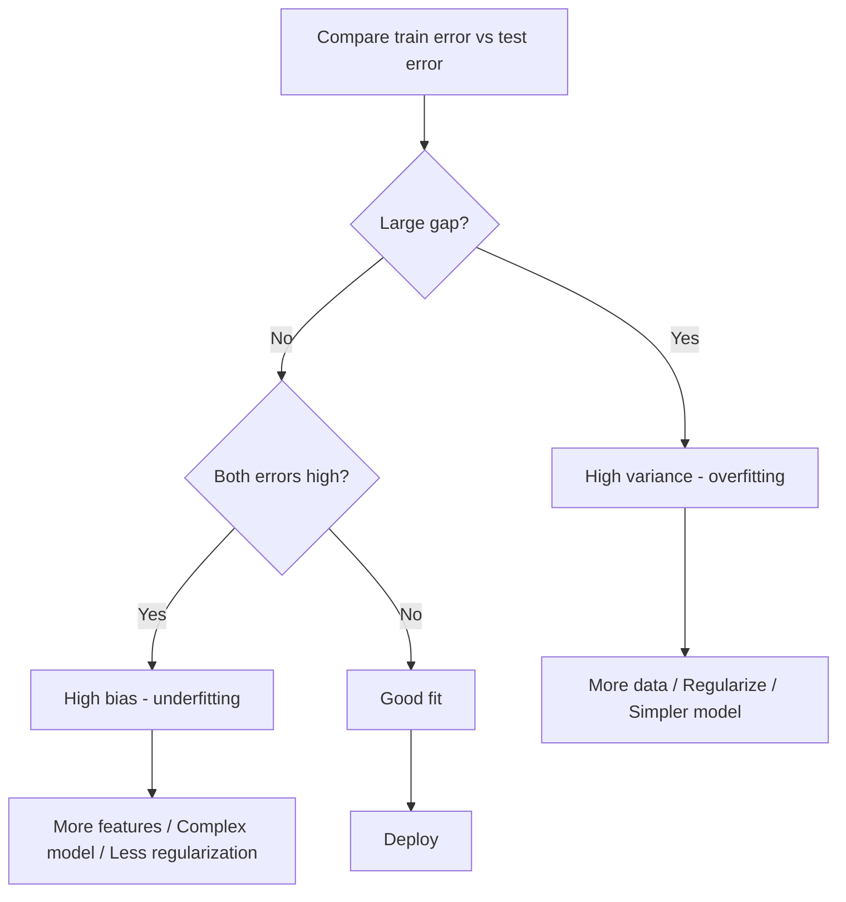
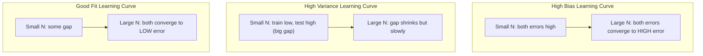
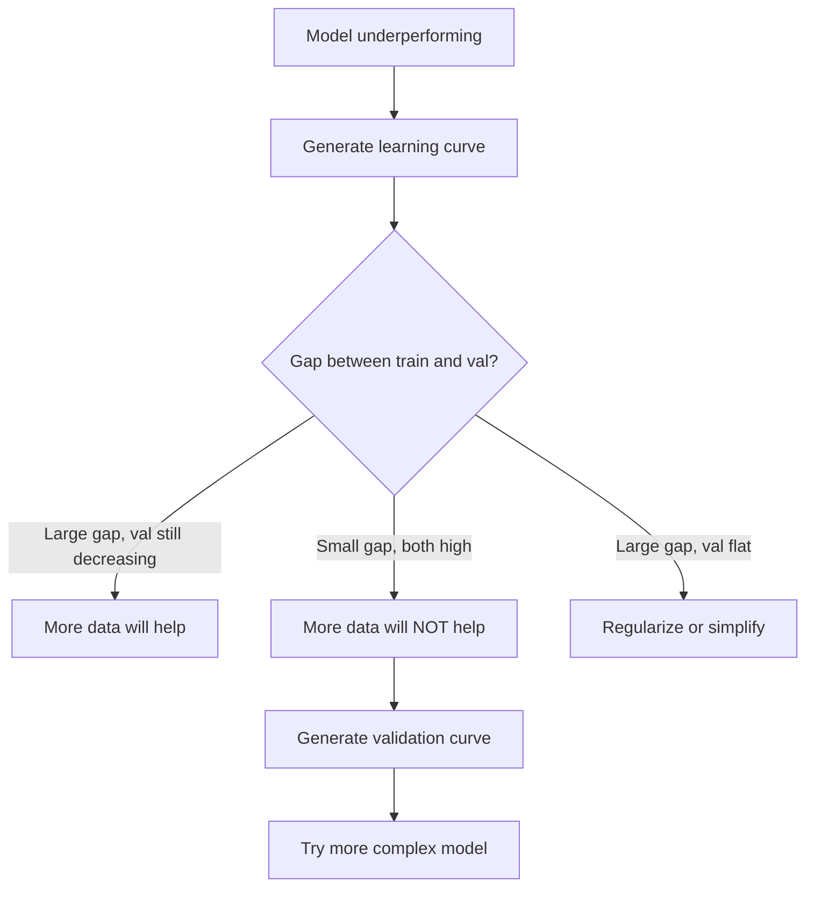

# Kompromis odchylenia-wariancji

> Każdy błąd modelu pochodzi z jednego z trzech źródeł: błędu systematycznego, wariancji lub szumu. Możesz kontrolować tylko dwa pierwsze.

**Typ:** Ucz się
**Język:** Python
**Wymagania wstępne:** Faza 2, lekcje 01-09 (podstawy ML, regresja, klasyfikacja, ocena)
**Czas:** ~75 minut

## Cele nauczania

- Wyprowadź rozkład odchylenia wariancji oczekiwanego błędu przewidywania i wyjaśnij rolę nieredukowalnego szumu
- Zdiagnozuj, czy model ma duże obciążenie lub dużą wariancję, korzystając z wzorców błędów uczenia i testowania
- Wyjaśnij, w jaki sposób techniki regularyzacji (L1, L2, rezygnacja z gry, wczesne zatrzymanie) wpływają na wariancję
- Wdrażaj eksperymenty, które wizualizują kompromis pomiędzy odchyleniem a wariancją w modelach o rosnącej złożoności

## Problem

Szkoliłeś modelkę. Zawiera błąd w danych testowych. Skąd bierze się ten błąd?

Jeśli Twój model jest zbyt prosty (regresja liniowa na zakrzywionym zbiorze danych), będzie konsekwentnie pomijał prawdziwy wzór. To jest stronniczość. Jeśli Twój model jest zbyt złożony (wielomian stopnia 20 na 15 punktach danych), będzie idealnie pasował do danych uczących, ale zapewni zupełnie inne przewidywania na podstawie nowych danych. To jest wariancja.

Nie można zminimalizować obu jednocześnie w przypadku ustalonej pojemności modelu. Zmniejsz odchylenie, a wariancja wzrośnie. Zmniejsz wariancję, a odchylenie wzrośnie. Zrozumienie tego kompromisu jest najbardziej przydatną umiejętnością diagnostyczną w uczeniu maszynowym. Mówi Ci, czy uczynić swój model bardziej złożonym, czy mniej złożonym, czy uzyskać więcej danych lub opracować lepsze funkcje, czy dokonać większej lub mniejszej regularyzacji.

## Koncepcja

### Błąd: błąd systematyczny

Odchylenie mierzy, jak daleko od średniej przewidywanej modelu znajduje się wartość prawdziwa. Jeśli wytrenowałeś ten sam model na wielu różnych zbiorach uczących pochodzących z tego samego rozkładu i uśredniłeś przewidywania, odchylenie to różnica między tą średnią a prawdą.

Wysokie odchylenie oznacza, że ​​model jest zbyt sztywny, aby uchwycić rzeczywisty wzór. Linia prosta dopasowana do paraboli zawsze będzie pomijać krzywą, niezależnie od tego, ile danych jej podasz. To jest niedopasowane.

```
High bias (underfitting):
  Model always predicts roughly the same wrong thing.
  Training error: HIGH
  Test error: HIGH
  Gap between them: SMALL
```

### Wariancja: wrażliwość na dane treningowe

Wariancja mierzy, jak bardzo zmieniają się Twoje przewidywania, gdy trenujesz na różnych podzbiorach danych. Jeśli małe zmiany w zbiorze uczącym powodują duże zmiany w modelu, wariancja jest wysoka.

Wysoka wariancja oznacza, że ​​model dopasowuje szum do danych uczących, a nie do sygnału bazowego. Wielomian stopnia 20 będzie przechodził przez każdy punkt treningowy, ale będzie gwałtownie oscylował między nimi. To jest nadmierne dopasowanie.

```
High variance (overfitting):
  Model fits training data perfectly but fails on new data.
  Training error: LOW
  Test error: HIGH
  Gap between them: LARGE
```

### Rozkład

Dla dowolnego punktu x oczekiwany błąd przewidywania przy kwadratowej stracie rozkłada się dokładnie:

```
Expected Error = Bias^2 + Variance + Irreducible Noise

where:
  Bias^2   = (E[f_hat(x)] - f(x))^2
  Variance = E[(f_hat(x) - E[f_hat(x)])^2]
  Noise    = E[(y - f(x))^2]             (sigma^2)
```

- `f(x)` jest prawdziwą funkcją
- `f_hat(x)` to przewidywanie Twojego modelu
- `E[...]` to oczekiwanie w stosunku do różnych zbiorów treningowych
- `y` to obserwowana etykieta (prawdziwa funkcja plus szum)

Termin szum jest nieredukowalny. Żaden model nie poradzi sobie lepiej niż sigma^2 w przypadku zaszumionych danych. Twoim zadaniem jest znalezienie właściwej równowagi pomiędzy odchyleniem^2 a wariancją.

### Złożoność modelu a błąd



Klasyczna krzywa w kształcie litery U:

| Złożoność | stronniczość | Wariancja | Całkowity błąd |
|----------|------|---------|------------|
| Za nisko | WYSOKI | NISKI | WYSOKI (niedopasowany) |
| W sam raz | UMIARKOWANY | UMIARKOWANY | NAJNIŻSZY |
| Za wysoko | NISKI | WYSOKI | WYSOKI (przeuczenie) |

### Regularyzacja jako kontrola odchylenia i wariancji

Regularyzacja celowo zwiększa odchylenie, aby zmniejszyć wariancję. Ogranicza model, aby nie mógł gonić za hałasem.

- **L2 (Grzbiet):** Zmniejsza wszystkie wagi do zera. Zachowuje wszystkie funkcje, ale zmniejsza ich wpływ.
- **L1 (Lasso):** Spycha niektóre wagi dokładnie do zera. Wykonuje wybór funkcji.
- **Przerwanie:** Losowo wyłącza neurony podczas treningu. Wymusza redundantne reprezentacje.
- **Wczesne zatrzymanie:** Zatrzymuje szkolenie, zanim model w pełni dopasuje się do danych treningowych.

Siła regularyzacji (lambda, współczynnik rezygnacji, liczba epok) bezpośrednio kontroluje miejsce na krzywej odchylenia-wariancji. Więcej regularyzacji oznacza więcej stronniczości i mniejszą wariancję.

### Podwójne pochodzenie: nowoczesna perspektywa

Klasyczna teoria mówi: po słodkim punkcie większa złożoność zawsze boli. Jednak badania prowadzone od 2019 roku wykazały coś nieoczekiwanego. Jeśli w dalszym ciągu zwiększasz pojemność modelu daleko poza próg interpolacji (gdzie model ma wystarczającą liczbę parametrów, aby idealnie dopasować dane szkoleniowe), błąd testu może ponownie się zmniejszyć.



To zjawisko „podwójnego opadania” wyjaśnia, dlaczego sieci neuronowe o znacznie przeparametryzowanych parametrach (ze znacznie większą liczbą parametrów niż przykłady szkoleniowe) nadal dobrze generalizują. Klasyczny kompromis w zakresie uprzedzeń i wariancji nie jest błędny, ale w przypadku współczesnego reżimu jest niekompletny.

Kluczowe obserwacje dotyczące podwójnego pochodzenia:
- Dzieje się tak w modelach liniowych, drzewach decyzyjnych i sieciach neuronowych
- Więcej danych może faktycznie zaszkodzić w obszarze interpolacji (podwójne zejście w oparciu o próbkę)
- Więcej epok treningowych też może to powodować (podwójne zejście epokowe)
- Regularyzacja wygładza pik, ale go nie eliminuje

Dlaczego tak się dzieje? Na progu interpolacji model ma wystarczającą pojemność, aby zmieścić wszystkie punkty treningowe. Wymuszone jest zastosowanie bardzo specyficznego rozwiązania, które obejmuje każdy punkt, a niewielkie zakłócenia w danych powodują duże zmiany w dopasowaniu. To tutaj wariancja osiąga szczyt. Po przekroczeniu progu model ma wiele możliwych rozwiązań, które doskonale pasują do danych. Algorytm uczenia się (np. Zejście gradientowe z ukrytą regularyzacją) ma tendencję do wybierania spośród nich najprostszego. To ukryte nastawienie na proste rozwiązania jest powodem uogólniania modeli przeparametryzowanych.

| Reżim | Parametry a próbki | Zachowanie |
|------------|----------------------|---------|
| Niesparametryzowany | p << n | Obowiązuje klasyczny kompromis |
| Próg interpolacji | p ~ n | Szczyty wariancji, skoki błędu testu |
| Przeparametryzowany | p >> n | Rozpoczyna się niejawna regularyzacja, błąd testu spada |

Ze względów praktycznych: jeśli używasz sieci neuronowych lub dużych zespołów drzew, nie zatrzymuj się na progu interpolacji. Albo pozostań znacznie poniżej tego poziomu (z wyraźną regularyzacją), albo przejdź znacznie poza niego. Najgorsze miejsce jest tuż za progiem.

### Diagnozowanie modelu



| Objaw | Diagnoza | Napraw |
|--------|-----------|-----|
| Wysoki błąd pociągu, wysoki błąd testu | stronniczość | Więcej funkcji, złożony model, mniej regularyzacji |
| Niski błąd pociągu, wysoki błąd testu | Wariancja | Więcej danych, regularyzacja, prostszy model, rezygnacja |
| Niski błąd pociągu, niski błąd testu | Dobre dopasowanie | Wyślij to |
| Błąd pociągu maleje, błąd testu rośnie | Trwa dopasowywanie | Wczesne zatrzymanie |

### Praktyczne strategie

**Kiedy problemem jest stronniczość:**
- Dodaj funkcje wielomianowe lub interakcyjne
- Użyj bardziej elastycznego modelu (zespołu drzew zamiast liniowego)
- Zmniejsz siłę regularyzacji
- Trenuj dłużej (jeśli jeszcze nie są zbieżne)

**Kiedy problemem jest wariancja:**
- Uzyskaj więcej danych treningowych
- Użyj workowania (losowe lasy)
- Zwiększenie regularyzacji (wyższa lambda, większy spadek)
- Wybór funkcji (usuń hałaśliwe funkcje)
- Użyj walidacji krzyżowej, aby wykryć to wcześnie

### Metody zespołowe i redukcja wariancji

Metody zespołowe są najbardziej praktycznym narzędziem do zwalczania wariancji.

**Bagging (agregacja Bootstrap)** trenuje wiele modeli na różnych próbkach ładowania początkowego danych szkoleniowych, a następnie uśrednia ich przewidywania. Każdy indywidualny model ma dużą wariancję, ale średnia ma znacznie mniejszą wariancję. Lasy losowe są stosowane do drzew decyzyjnych.

Dlaczego to działa matematycznie: jeśli uśrednisz N niezależnych przewidywań, każdy z wariancją sigma^2, wariancja średniej wynosi sigma^2 / N. Modele nie są w pełni niezależne (wszystkie widzą podobne dane), więc redukcja jest mniejsza niż 1/N, ale nadal jest znaczna.

**Wzmocnienie** zmniejsza stronniczość poprzez budowanie modeli sekwencyjnie, przy czym każdy nowy model skupia się na dotychczasowych błędach zespołu. Głównymi przykładami są wzmacnianie gradientu i AdaBoost. Wzmocnienie może spowodować nadmierne dopasowanie, jeśli dodasz zbyt wiele modeli, dlatego konieczne będzie wcześniejsze zatrzymanie lub regularyzacja.

| Metoda | Główny efekt | Zmiana nastawienia | Zmiana wariancji |
|------------|--------------|------------|----------------|
| Pakowanie | Zmniejsza wariancję | Bez zmian | Zmniejsza się |
| Wzmocnienie | Zmniejsza stronniczość | Zmniejsza się | Może zwiększyć |
| Układanie | Zmniejsza oba | Zależy od meta-ucznia | Zależy od modeli podstawowych |
| Rezygnacja | Ukryte pakowanie | Nieznaczny wzrost | Zmniejsza się |

**Praktyczna zasada:** jeśli Twój model podstawowy charakteryzuje się dużą wariancją (głębokie drzewa, wielomiany wysokiego stopnia), użyj workowania. Jeśli Twój model podstawowy ma duże odchylenie (płytkie kikuty, proste modele liniowe), użyj wzmocnienia.

### Krzywe uczenia się

Krzywe uczenia przedstawiają błąd uczenia i sprawdzania poprawności jako funkcję rozmiaru zbioru uczącego. Są najbardziej praktycznym narzędziem diagnostycznym, jakie posiadasz. W przeciwieństwie do pojedynczego porównania pociągu/testu, krzywe uczenia się pokazują trajektorię modelu i informują, czy przyda się więcej danych.



Jak je czytać:

| Scenariusz | Błąd szkolenia | Błąd walidacji | Luka | Co to znaczy | Co robić |
|--------------|----------|--------------------------------|----------|--------------|------------|
| Wysokie nastawienie | Wysoki | Wysoki | Mały | Model nie może uchwycić wzoru | Więcej funkcji, złożony model, mniej regularyzacji |
| Wysoka wariancja | Niski | Wysoki | Duży | Model zapamiętuje dane treningowe | Więcej danych, regularyzacja, prostszy model |
| Dobre dopasowanie | Umiarkowany | Umiarkowany | Mały | Model dobrze generalizuje | Wyślij to |
| Wysoka wariancja, poprawa | Niski | Maleje wraz ze wzrostem ilości danych | Kurczenie się | Problem wariancji, który można rozwiązać za pomocą danych | Zbierz więcej danych |
| Wysokie nastawienie, płaskie | Wysoki | Wysokie i płaskie | Mały i płaski | Więcej danych NIE pomoże | Zmień architekturę modelu |

Krytyczny spostrzeżenie: jeśli obie krzywe ustabilizowały się, a różnica jest niewielka, ale oba błędy są wysokie, więcej danych jest bezużytecznych. Potrzebujesz lepszego modelu. Jeśli różnica jest duża i nadal się zmniejsza, pomocna będzie większa ilość danych.

### Jak wygenerować krzywe uczenia się

Istnieją dwa podejścia:

**Podejście 1: Zmieniaj rozmiar zestawu treningowego, model stały.** Utrzymuj stały model i hiperparametry. Trenuj na coraz większych podzbiorach danych szkoleniowych. Zmierz błąd uczenia i błąd walidacji dla każdego rozmiaru. Jest to standardowa krzywa uczenia się.

**Podejście 2: Zmieniaj złożoność modelu, stałe dane.** Utrzymuj stałe dane. Przejrzyj parametr złożoności (stopień wielomianu, głębokość drzewa, liczba warstw). Zmierz błąd uczenia i błąd walidacji dla każdej złożoności. Jest to krzywa walidacyjna, która bezpośrednio pokazuje różnicę między odchyleniem a wariancją.

Obydwa podejścia uzupełniają się. Pierwsza informuje, czy więcej danych będzie pomocne. Drugi informuje, czy inny model pomoże. Uruchom oba przed podjęciem decyzji o następnym kroku.



## Zbuduj to

Kod w `code/bias_variance.py` przeprowadza pełny eksperyment dekompozycji odchylenia-wariancji. Oto podejście, krok po kroku.

### Krok 1: Wygeneruj dane syntetyczne na podstawie znanej funkcji

Używamy `f(x) = sin(1.5x) + 0.5x` z szumem Gaussa. Znajomość funkcji prawdziwej pozwala nam obliczyć dokładne obciążenie i wariancję.

```python
def true_function(x):
    return np.sin(1.5 * x) + 0.5 * x

def generate_data(n_samples=30, noise_std=0.5, x_range=(-3, 3), seed=None):
    rng = np.random.RandomState(seed)
    x = rng.uniform(x_range[0], x_range[1], n_samples)
    y = true_function(x) + rng.normal(0, noise_std, n_samples)
    return x, y
```

### Krok 2: Próbkowanie metodą bootstrap i dopasowywanie wielomianów

Dla każdego stopnia wielomianu rysujemy wiele zestawów szkoleniowych metodą ładowania początkowego, dopasowujemy wielomian i rejestrujemy przewidywania na ustalonej siatce testowej. Daje nam to rozkład przewidywań w każdym punkcie testowym.

```python
def fit_polynomial(x_train, y_train, degree, lam=0.0):
    X = np.column_stack([x_train ** d for d in range(degree + 1)])
    if lam > 0:
        penalty = lam * np.eye(X.shape[1])
        penalty[0, 0] = 0
        w = np.linalg.solve(X.T @ X + penalty, X.T @ y_train)
    else:
        w = np.linalg.lstsq(X, y_train, rcond=None)[0]
    return w
```

Dopasowujemy się do 200 różnych próbek bootstrap. Każda próbka bootstrap jest pobierana z tego samego rozkładu bazowego, ale zawiera różne punkty.

### Krok 3: Obliczanie błędu systematycznego^2, rozkład wariancji

Mając 200 zestawów przewidywań w każdym punkcie testowym, możemy obliczyć rozkład bezpośrednio z definicji:

```python
mean_pred = predictions.mean(axis=0)
bias_sq = np.mean((mean_pred - y_true) ** 2)
variance = np.mean(predictions.var(axis=0))
total_error = np.mean(np.mean((predictions - y_true) ** 2, axis=1))
```

- `mean_pred` to E[f_hat(x)] oszacowane na podstawie próbek bootstrap
- `bias_sq` to kwadratowa różnica między średnią prognozą a prawdą
- `variance` to średni rozrzut predykcji w próbkach bootstrapowych
- `total_error` powinien w przybliżeniu być równy odchyleniu^2 + wariancji + szumowi

### Krok 4: Krzywe uczenia się

Krzywe uczenia się omiatają rozmiar zestawu treningowego, utrzymując stałą złożoność modelu. Pokazują, czy Twój model ma ograniczoną ilość danych, czy ograniczoną pojemność.

```python
def demo_learning_curves():
    sizes = [10, 15, 20, 30, 50, 75, 100, 150, 200, 300]
    degree = 5

    for n in sizes:
        train_errors = []
        test_errors = []
        for seed in range(50):
            x_train, y_train = generate_data(n_samples=n, seed=seed * 100)
            w = fit_polynomial(x_train, y_train, degree)
            train_pred = predict_polynomial(x_train, w)
            train_mse = np.mean((train_pred - y_train) ** 2)
            test_pred = predict_polynomial(x_test, w)
            test_mse = np.mean((test_pred - y_test) ** 2)
            train_errors.append(train_mse)
            test_errors.append(test_mse)
        # Average over runs gives the learning curve point
```

W przypadku modelu o dużej wariancji (stopień 5 przy małych danych) widać:
- Błąd uczenia się zaczyna się od niskiego poziomu i wzrasta w miarę zwiększania się ilości danych utrudniających zapamiętywanie
- Błąd testu zaczyna się od wysokiego poziomu i maleje w miarę odbierania przez model większej ilości sygnału
- Różnica zmniejsza się wraz z większą ilością danych

W przypadku modelu o dużym odchyleniu (stopień 1) oba błędy szybko zbiegają się do tej samej wysokiej wartości i więcej danych nie pomaga.

### Krok 5: Przeglądanie regularyzacyjne

Kod zawiera również `demo_regularization_sweep()`, który ustala wielomian wysokiego stopnia (stopień 15) i przesuwa siłę regularyzacji grzbietu od 0,001 do 100. To pokazuje kompromis wariancji odchylenia z innego punktu widzenia: zamiast zmieniać złożoność modelu, zmieniamy siłę wiązania.

```python
def demo_regularization_sweep():
    alphas = [0.001, 0.005, 0.01, 0.05, 0.1, 0.5, 1.0, 5.0, 10.0, 50.0, 100.0]
    for alpha in alphas:
        results = bias_variance_decomposition([15], lam=alpha)
        r = results[15]
        print(f"alpha={alpha:.3f}  bias={r['bias_sq']:.4f}  var={r['variance']:.4f}")
```

Przy niskiej wartości alfa wielomian stopnia 15 jest prawie nieograniczony. Dominuje wariancja, ponieważ model goni szum w każdej próbce bootstrapowej. Przy wysokiej wartości alfa kara jest tak duża, że ​​model faktycznie staje się funkcją niemal stałą. Dominuje stronniczość. Optymalna alfa znajduje się pomiędzy tymi skrajnościami.

Jest to ta sama krzywa U o różnym stopniu wielomianu, ale kontrolowana za pomocą pokrętła ciągłego, a nie dyskretnego. W praktyce regularyzacja jest preferowanym sposobem kontrolowania kompromisu, ponieważ umożliwia precyzyjną kontrolę bez zmiany zestawu funkcji.

## Użyj tego

sklearn udostępnia `learning_curve` i `validation_curve` do automatyzacji tej diagnostyki bez pisania pętli startowych.

### Krzywa walidacji: złożoność modelu Sweep

```python
from sklearn.model_selection import validation_curve
from sklearn.pipeline import make_pipeline
from sklearn.preprocessing import PolynomialFeatures
from sklearn.linear_model import Ridge

degrees = list(range(1, 16))
train_scores_all = []
val_scores_all = []

for d in degrees:
    pipe = make_pipeline(PolynomialFeatures(d), Ridge(alpha=0.01))
    train_scores, val_scores = validation_curve(
        pipe, X, y, param_name="polynomialfeatures__degree",
        param_range=[d], cv=5, scoring="neg_mean_squared_error"
    )
    train_scores_all.append(-train_scores.mean())
    val_scores_all.append(-val_scores.mean())
```

Daje to bezpośrednio krzywą kompromisu wariancji odchylenia. Tam, gdzie wynik walidacji jest najgorszy w porównaniu z wynikiem pociągu, dominuje wariancja. Tam, gdzie oba są złe, dominuje uprzedzenie.

### Krzywa uczenia się: Rozmiar zestawu treningowego Sweep

```python
from sklearn.model_selection import learning_curve

pipe = make_pipeline(PolynomialFeatures(5), Ridge(alpha=0.01))
train_sizes, train_scores, val_scores = learning_curve(
    pipe, X, y, train_sizes=np.linspace(0.1, 1.0, 10),
    cv=5, scoring="neg_mean_squared_error"
)
train_mse = -train_scores.mean(axis=1)
val_mse = -val_scores.mean(axis=1)
```

Wykres `train_mse` i `val_mse` względem `train_sizes`. Kształt mówi Ci wszystko o Twoim modelu.

### Walidacja krzyżowa z przeglądaniem regularyzacyjnym

```python
from sklearn.model_selection import cross_val_score

alphas = [0.001, 0.01, 0.1, 1.0, 10.0, 100.0]
for alpha in alphas:
    pipe = make_pipeline(PolynomialFeatures(10), Ridge(alpha=alpha))
    scores = cross_val_score(pipe, X, y, cv=5, scoring="neg_mean_squared_error")
    print(f"alpha={alpha:>7.3f}  MSE={-scores.mean():.4f} +/- {scores.std():.4f}")
```

To zwiększa siłę regularyzacji dla ustalonej złożoności modelu. Zobaczysz ten sam kompromis w zakresie odchylenia od odchylenia: niska wartość alfa oznacza dużą wariancję, wysoka wartość alfa oznacza duże obciążenie.

### Łączenie wszystkiego w jedną całość: kompletny proces diagnostyczny

W praktyce diagnostykę przeprowadza się po kolei:

1. Wytrenuj swój model. Oblicz błąd pociągu i testuj.
2. Jeśli oba są wysokie: masz problem z uprzedzeniami. Przejdź do kroku 4.
3. Jeśli pociąg jest niski, ale test jest wysoki: masz problem z wariancją. Wygeneruj krzywą uczenia się, aby sprawdzić, czy więcej danych będzie pomocne. Jeśli nie, ureguluj.
4. Wygeneruj krzywą walidacji obejmującą główny parametr złożoności. Znajdź słodki punkt.
5. W optymalnym punkcie wygeneruj krzywą uczenia się. Jeśli różnica jest nadal duża, potrzebujesz więcej danych lub regularyzacji.
6. Wypróbuj Ridge/Lasso z różnymi wartościami alfa, używając `cross_val_score`. Wybierz alfa, w którym błąd sprawdzany krzyżowo jest najniższy.

W przypadku większości tabelarycznych zbiorów danych zajmuje to 10–15 minut obliczeń i pozwala zaoszczędzić wiele godzin zgadywania.

## Wyślij to

Z tej lekcji wynika: `outputs/prompt-model-diagnostics.md`

## Ćwiczenia

1. Uruchom dekompozycję za pomocą `noise_std=0` (bez szumów). Co się dzieje z nieredukowalnym składnikiem błędu? Czy optymalna złożoność ulega zmianie?

2. Zwiększ rozmiar zbioru uczącego z 30 do 300. Jak to wpływa na składnik wariancyjny? Czy optymalny stopień wielomianu ulega zmianie?

3. Dodaj do eksperymentu regularyzację L2 (regresję grzbietu). W przypadku wielomianu wysokiego stopnia (stopień 15) przesuń lambdę od 0 do 100. Wykreśl obciążenie^2 i wariancję jako funkcje lambda.

4. Zmień funkcję true z wielomianu na `sin(x)`. Jak zmienia się rozkład odchylenia-wariancji? Czy nadal istnieje wyraźny optymalny stopień?

5. Zaimplementuj proste opakowanie agregujące (pakujące) metodą bootstrap: wytrenuj 10 modeli na próbkach bootstrap i średnich przewidywaniach. Pokaż, że zmniejsza to wariancję bez znacznego zwiększania odchylenia.

## Kluczowe terminy

| Termin | Co ludzie mówią | Co to właściwie oznacza |
|------|----------------|----------------------|
| stronniczość | „Model jest zbyt prosty” | Systematyczny błąd wynikający z błędnych założeń. Luka pomiędzy średnią prognozą modelu a prawdą. |
| Wariancja | „Model jest przetrenowany” | Błąd wynikający z wrażliwości na dane szkoleniowe. Jak bardzo prognozy zmieniają się w różnych zestawach treningowych. |
| Nieredukowalny błąd | „Szum w danych” | Błąd wynikający z losowości w prawdziwym procesie generowania danych. Żaden model nie jest w stanie tego wyeliminować. |
| Niedopasowanie | „Za mało się uczę” | Model ma duże odchylenie. Brakuje prawdziwego wzorca nawet w przypadku danych treningowych. |
| Nadmierne dopasowanie | „Zapamiętywanie danych” | Model charakteryzuje się dużą wariancją. Dopasowuje szum do danych uczących, które nie generalizują. |
| Regularyzacja | „Wiązanie modelu” | Dodanie kary w celu zmniejszenia złożoności modelu, zamiana nastawienia na niższą wariancję. |
| Podwójne zejście | „Więcej parametrów może pomóc” | Błąd testu ponownie maleje, gdy pojemność modelu znacznie przekracza próg interpolacji. |
| Złożoność modelu | „Jak elastyczny jest model” | Zdolność modelu do dopasowania dowolnych wzorców. Kontrolowane przez architekturę, funkcje lub regularyzację. |

## Dalsze czytanie

- [Hastie, Tibshirani, Friedman: Elementy uczenia się statystycznego, rozdz. 7](https://hastie.su.domains/ElemStatLearn/) – ostateczne podejście do rozkładu odchyleń-wariancji
– [Belkin i in., Reconciling modern machine learning Practice and the bias-variance trade-off (2019)](https://arxiv.org/abs/1812.11118) – artykuł o podwójnym zejściu
– [Nakkiran i in., Deep Double Descent (2019)](https://arxiv.org/abs/1912.02292) – podwójne zejście w ujęciu epokowym i próbnym
- [Scott Fortmann-Roe: Zrozumienie kompromisu odchylenie-wariancja](http://scott.fortmann-roe.com/docs/BiasVariance.html) - jasne wyjaśnienie wizualne