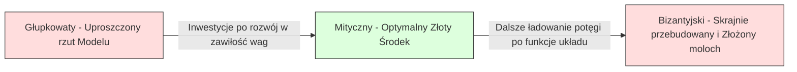

# Kompromis między obciążeniem a wariancją (Bias-Variance Tradeoff)

> Każdy błąd w modelu sztucznej inteligencji wywodzi się z jednego z trzech źródeł: obciążenia (bias), wariancji (variance) lub szumu (noise). Jako inżynier masz kontrolę wyłącznie nad dwoma pierwszymi.

**Typ:** Teoria i praktyka
**Język:** Python
**Wymagania wstępne:** Faza 2, lekcje 01-09 (Podstawy ML, Regresja, Klasyfikacja, Metryki Oceny Modelu)
**Czas:** ~75 minut

## Cele nauczania

- Wyprowadzenie z matematycznego punktu widzenia rozkładu błędu predykcyjnego na składowe: wariancję, obciążenie i nieredukowalny szum.
- Diagnozowanie modeli pod kątem problemów z obciążeniem (underfitting) lub wysoką wariancją (overfitting), posługując się analizą krzywych z uczenia i testowania.
- Zrozumienie, w jaki sposób techniki regularyzacyjne (L1 Lasso, L2 Ridge, Dropout, Early Stopping) pomagają w obniżaniu poziomu wariancji w systemie.
- Zaprojektowanie i wdrożenie eksperymentów numerycznych pozwalających zwizualizować relacje między obciążeniem a wariancją na modelach o rosnącej pojemności uogólniania (złożoności).

## Problem

Wytrenowałeś model uczenia maszynowego. Po puszczeniu predykcji na zbiorze testowym widzisz konkretny wskaźnik błędu. Co wygenerowało ten błąd i jakie jest jego źródło?

Jeśli użyty wariant modelu był zbyt ubogi i prosty pod kątem matematycznym (np. użyłeś regresji liniowej by dopasować dane, które układają się w przestrzenną parabolę), algorytm zawsze, i niezależnie od ilości dostarczonych porcji wiedzy pominie sygnał. To jest właśnie **obciążenie** (bias).
Z kolei jeśli architektura modelu była przesycona i przekomplikowana (np. rzucono wielomian na poziomie 20. stopnia by spiąć raptem 15 punktów szkoleniowych z wykresu), sieć ułoży idealnie zagięty, wijący się węgorzem wykres wokół punktów, ale przywróci zupełnie zdegenerowane predykcje, napotkawszy punkty na osi testowej. To jest **wariancja** (variance).

W warunkach ustalonej pojemności i wariantu bazowego dla struktury modelu, nie jesteś w stanie sprowadzić do matematycznego "zera" obu zjawisk na raz. Gdy zaczniesz dusić obciążenie (czyli skomplikujesz model), wariancja potężnie wybije w kosmos. Gdy przytniesz wariancję zrzucając i prostując węzły sieci – w nieubłagany sposób do góry poleci błąd obciążenia, tracąc zdolność wychwytu wzorców. 
Zrozumienie, kontrolowanie i diagnozowanie punktu balansu w tej "przepychance" jest absolutnie najużyteczniejszą rzeczą i kluczową umiejętnością, jaką możesz wynieść z etapu klasycznego uczenia maszynowego. Właśnie to kompendium doradzi i odpowie, w jakim kierunku skręcić koło sterowe – czy zwiększać muskuły w sieci wprowadzając zawiłość architektoniczną, czy przyciąć warstwy na płasko z agresywną regularyzacją, a może dołożyć i doinwestować setki tysięcy rekordów bazy dla wygładzenia fali.

## Koncepcje

### Składowa błędu nr 1: Obciążenie (Bias)

Pojęcie obciążenia wyznacza dystans pomiędzy wartością przewidzianą obiektywnie przez uśrednienie wyników powołanej do uczenia architektury na wycinkach prób z danego zjawiska, a absolutną (prawdziwą i naturalną w ekosystemie) wartością obserwowaną. Gdybyśmy zrekrutowali setki niezależnych sieci opartych o ten sam projekt strukturalny by zsumowały przewidywania wokół problemu na unikalnie przetasowanych setach – różnica pomiędzy centrum ich wspólnego punktu trafień a sygnałem prawdziwym, stanowi rygorystycznie obciążenie (bias).

Wysokie obciążenie jest czerwoną flagą świadczącą o tym, że architektura maszyny nie wykazuje fizycznej ani logicznej elastyczności na bycie podatną do zrozumienia fali i sygnału ze złożoności faktu w obiektywie zjawisk. Wymuszone przeprowadzenie idealnie gładkiej linii (wielomian I stopnia - funkcja linowa) poprzez dane opisujące rozkład czaszy spadochronu będzie wyrzucać wysoki błąd pominięć choćbyś naładował pod ten projekt miliony gigabajtów bazy ze spadochronami do nauki. Jest to znane w żargonie jako zjawisko **Niedopasowania (Underfitting)**.

```
Wysokie obciążenie (Niedopasowanie / Underfitting):
  Maszyna przewiduje uparcie na chłodno te same, głupie mylne założenia i wnioski.
  Błąd na Treningu: POTĘŻNY (WYSOKI)
  Błąd w fazie Testowania: POTĘŻNY (WYSOKI)
  Szpara w odchyłach ułożenia między tymi wskaźnikami: MINIMALNA (BŁAHY SKOK)
```

### Składowa błędu nr 2: Wariancja (Wrażliwość na podkład trenujący)

Wariancja precyzyjnie mierzy i wycenia "narwaną naturę i poszarpany układ fali rozkładu" dla modelu, definiując obiektywnie w jakim stopniu skaczą strzały i predykcje, ilekroć zmienimy ujęcie prób z materiałów treningowych na inny wycinek populacji do rzutu z baz. Jeśli wyjęcie, potasowanie i rzucenie lekko zmodyfikowanej tabelki z surowymi zmiennymi doprowadza do tego, że sieć wykonuje salto i uczy się zupełnie poplątanych w ułożeniach i skrajnych relacji, diagnoza jasno rzuca pojęcie wysokiego rzędu dla wariancji ze skłonności do paranoi.

Wysoka Wariancja implikuje zachowanie przypisane maszynie uczącej w trybie zapamiętywania zjawisk szumu dla osi zamiast odzyskiwania praw statystycznych sygnału bazy (tzw wkuwanie na blachę błędów). Rzucony potężnie elastyczny potwór – sieć zbudowana na równaniu z pikiem mocy 20-stopnia wejdzie we wskaźnik w tabeli punktów idealnie przez każdą z kropek. Zostawiając szalejące góry dla obszarów pustych (ekstrapolacji predykcyjnej dla uogólnień). System ten nosi patologiczne znamię **Przeuczenia (Overfitting)**.

```
Wysoka Wariancja (Przeuczenie / Overfitting):
  Sieć "wkuła" bazę danych wzorowo w logikę na blachę polegając na nowościach u progu implementacji.
  Błąd na treningu: BLISKI PERFEKCJI I ZERA (NISKI)
  Błąd z fazie Testowania: ODSTRASZAJĄCY (POTĘŻNIE WYSOKI)
  Szpara w odchyłach między zestawieniami wykresu z treningu i oceny: OGROMNA
```

### Równanie Dekompozycji Błędów Estymatora

Dla w pełni zdefiniowanego osiowego ujęcia punktów w osi predykcyjnej ułożenie skwantyfikowanego "oczekiwanego błędu strat z modelu (MSE na predykcji kwadratów)" poddaje się jasnemu procesowi na ułożeniu dekompozycji do bazy czynników pod postacią wzoru:

```
Oczekiwany wskaźnik do Strat (Błędu) = Wartość (Obciążenie)^2 + Wariancja + Nieredukowalny Hałas Wewnętrzny (Szum)

Gdzie w zapisie na układ matematyczny definicja przybiera kształty relacyjne w formacie wektorów oczekiwanych:
  Bias^2 (Kwadrat od Obciążenia)   = (E[f_hat(x)] - f(x))^2
  Wariancja rzutu i rozkładu osi   = E[(f_hat(x) - E[f_hat(x)])^2]
  Nieredukowalny stały Hałas       = E[(y - f(x))^2]               (określany z definicji miar sigma^2)
```

Gdzie we wzorze oznaczono poszczególne elementy fali:
- `f(x)` jako uwarunkowana z boskiej z góry perspektywy idealnie wpisana formuła "prawdy i funkcji matki" operującej w świecie procesów na badanych fizykach zjawisk.
- `f_hat(x)` stanowiący z rzutu predyktor modelowy uzyskany po fuzji ML (To nasza Sieć i jej rzut aproksymacji po wytrenowaniu fali i skoszeniu z osi).
- `E[...]` estymowana matematyczna z formuł składowa oczekiwania - uśrednianie nieskończonych wycinków dla próbkowanych losowo ułożeń z bazy.
- `y` surowy zaobserwowany wynik sygnału rzędnego tła z zebranych baz z zanieczyszczeniami pochodzenia naturalnego z zewnątrz od otoczenia z czujnika (Prawda fizyczna "Funkcji matki" f(x) + nakładka z zewnętrznego błędu naturalnej fluktuacji hałasu i zanieczyszczenia kwantowego).

Ostatni z klocków - Wektor z Szumem z tła pozostaje matematycznie *nieredukowalny* co oznacza bezwzględny wyrok z góry. Niezależnie w jak drogie chmury wpakujesz system i o jak potężnym zagnieżdżeniu sieci marzysz przy ML, nikt nie upora się lepiej z pułapem od błędu mierzonym poniżej skali fluktuacji dla parametru rozproszeń sigma^2 jeżeli u podstaw zbierany proces z zjawiska był zakłócony (np słaby sprzęt pomiarowy lub gubiąca giełda). Twoim odgórnym wyzwaniem i etatem pracy po stronie modelowania w Machine Learning jest odszukać złoty kompromis po krzywej ważącej sprytnie i równo błędy z parametru wariancji na szali ze statusem redukcyjnego obciążenia przy minimalnej szkodzie i nakładzie po sieci.

### Pojemność (złożoność) Systemu Kontra Błędy Rzutu



Legendarny paradygmat ułożenia "wykresu spod litery U":

| Wielkość Skomplikowania pod Układ Modelu | Pułapy z Bias (Obciążeń) | Pułapy z Wariancji (Zmienności) | Wyliczone nakłady z Sumarycznego Oczekiwanego Błędu i Strat z Predykcji |
|----------|------|---------|------------|
| Potężne Niedo-inwestowanie w algorytm (Płasko) | TRAGICZNIE WYSOKIE | ZEROWE DO NISKIE | TOTALNE - NIEWYBACZALNE WYNIKI Z ZAŁOŻENIEM (Niedopasowanie twarde - Underfit) |
| Dobrze wymierzona, zrównoważona i wycelowana rzutnia z optymalizacją pod zjawisko  | OPANOWANE - UMIARKOWANE | UTRZYMANE W WYZNACZONYCH NORMACH  | NAJNIŻSZY BEZWZGLĘDNY PUNKT ODNIESIENIA NA WYKRESIE (OPTYMUM) |
| Przepalona inwestycja w gigantyczne molocho-sieci głębokie na proste pytania ze światła fizyki  | ZEROWO / NISKIE (Trafia ideały z treningu) | KATASTROFALNIE ROZBUJANE SKOKI I FAZOWANIE ROZRZUTAMI | TOTALNE STRATY OD WYNIKU BŁĘDÓW OSTATECZNYCH PO RZUCIE (Przeuczenie - Overfit) |

### Redukcje i Regularyzacja w postaci narzucania smyczy pętających wariancje na zysk skromnego wzrostu z biasu

Technologia spod rygoru w Regularyzacji jest zabiegiem inżyniera z intencją sztucznie wprowadzających restrykcji budujących i obciążających model po to wprost, by na krzywej wyegzekwować bezkompromisowe ostudzenie dla zjawiska "wariancji szalejących na fali". Model krępuje się wagami, "wykręcając" układy do spodu, by pozbawić mocy obliczeniowych zdolności by układały wzory i "ścigały zakłócające odchyły uderzeń fal sygnału tła szumu". Odbiera to elastyczności.

- **Kary na L2 (Regresje na Ridge / Grzbiecie):** Modeluje układ gdzie bezpardonowo miażdży przeliczenia i zsyła wszystkie absolutne wagi pod sieci blisko zera z wymuszenia wzorem. Zachowuje całą wiedzę na strukturach dla atrybutów z kolumn bazowych po tablicach z bazy, ale ogałaca z drastycznych szarpnięć i dominacji przez układy poszczególnych sił.
- **Kary po filtrze z rodziny dla typu L1 (Lasso Regularyzacja):** Uderza punktowo, resetując z urzędu precyzyjnie niepewne węzły informacyjne na "Wagi O Zasięgu Typowo Twarde Równe 0.0". Rozwiązuje i ułatwia w procesie tzw. zjawisko z logik odrzucania atrybutów "selekcja na cechach rzutni".
- **Gubienie wiedzy - Porzucanie węzłowe na (Dropout w Keras itp.):** Strzela z układów pseudolosowych uśmiercając w trakcie faz tury treningowych pewne neurony pod fuzją (zerując im przesył u wyjścia w losowości i rzutach). Nakazuje bezapelacyjnie rozpraszać sygnał szukając ratunku na ułamkach układu w wymuszaniu budowania dróg alternatywnych i powtarzalnych redundancji ukrytych by przetrwać ucięcie dróg po sygnałach u przepływu.
- **Systematyka przedwczesnych Hamowań (Early Stopping):** Brute-Force'owe mrożenie układów iteracji uczenia maszyny (przerywanie treningu z góry i zapisu stanu), dokładnie zaraz po ułamku sekundy, jak tylko wskaźniki u sieci zaczną objawiać szaleńcze perfekcyjne dostrojenia z treningową tablicą po kosztach i rzutowaniu pod zbiór oceniającego i trzymanego pod zamek w tryb walidacji algorytmu na setach zewnętrznych.

Siła i parametryzacja współczynników pętających system po karach w trybie regularyzowania maszyn dla wariancji (suwaki dla wielkości w stałych lambda L2/L1, wskaźniki ułamkowe współczynników rzutu odłączeń dropout rate'ów, pułapy cięć ilości epok przelotowych) jest precyzyjnym systemem suwaka balansującego twój wariant z kompromisu. Masywny współczynnik przy karach u ułożeniu dla regulacji = pójście na rękę w rzut i wzrost potęgi dla wskaźnika bias - przy jednoczesnym błogosławieństwie i cięciu ułożeń po stronie rozregulowanej wariancyjnie u sieci rozrzuconej z rzutami na testach.

### Era Deep-Learning z Nowoczesną perspektywą (Double Descent – Zjawisko Podwójnych Opadów Wariancji)

Klasyczna zasada teorii po statystyce wbija inżynierom regułę do wyrycia w skałę ułożoną na słowach z sentencji rzutu: "Wszystko poza złotym środkiem w stronę przekomplikowania zawsze kończy się ukaraniem sieci u ogółu po wynikach testowych." Rewolucyjne ujęcia po przeanalizowaniu ogromnych sieci na przełomach po 2019 wykazały w środowisku wyłamywania się konwencjom, dając spektakularny odwrót pod uogólnienie z teorii ułożonych na książce.
Jeżeli odetniemy węzły z logiki przy klasyce i dopompujemy rozmiar z ilości pod parametry potężnie wykraczając do prawej strony układów ponad krytyczny próg na linii zwany progiem *szumu w interpolacji punktu* (to faza dla układów gdzie algorytm na siłę wpiął na punkt w 100 procent z pamięci wszystko do rzutu dla puli nauki w układ predyktora modelowego ze śrubą z przeuczenia po strefie z wariancją w zenit) – wykraczając parametrami powyżej w miliony wag u parametrów w maszynie sztucznej na niesamowity próg w prawą barierę – magicznie i paradoksalnie *Testowy błąd oceny za progiem z załamania leci po krzywej w ponowne i ostateczne dół i spadki pod minima*. Zjawisko "Zejścia dla Fali u Podwójnych Odpadów" (Double Descent Phenomenon) uogólniło szanse na zrozumienie logiki u sukcesów gigantycznych, współczesnych molocho-sieci do tworzenia o milionach parametrów na układzie, genialnie uogólniających prawdy u testów. Klasyka po zarysach na ułożeniu U nie upadła, jest wyłącznie w ucięciu od faktu rzutowania archaiczna bo niepełna zjawiska dając za progiem strefę dla współczesnej magii w ML w sieciach prze-parametryzowanych (Overparametrized regime).

## Implementacja

Przeanalizuj odpowiednie elementy pliku `code/bias_variance.py` zawierające gotowe demonstratory. Skrypt przeprowadzi kompletny układ dekompozycji w rozbiciu na elementy. Do dyspozycji masz ręczne wyprowadzenia bootstrapingowe (resampling) oraz wykorzystanie modułów scikit-learn generujących walidacyjne krzywe jednym poleceniem, co oddaje do ręki potężne i cenne wykresy dla poszukiwania "sweet spotu" – złotego punktu odniesienia kompromisów.

## Wykorzystanie w praktyce

Zamiast pisać złożone mechaniki testowe, stosuj gotowe narzędzia analityczne biblioteki `scikit-learn` ułatwiające sprawę.

Generowanie i rozkładanie sił krzywą pod walidację z uwzględnieniem wycieczki po parametrze złożoności (Validation Curve):
```python
from sklearn.model_selection import validation_curve
from sklearn.pipeline import make_pipeline
from sklearn.preprocessing import PolynomialFeatures
from sklearn.linear_model import Ridge

degrees = list(range(1, 16))
# Rurociąg budujący wielomian po zadanym D ze zintegrowanym systemem ucieczki poprzez regularyzacje w sieci Ridge L2.
for d in degrees:
    pipe = make_pipeline(PolynomialFeatures(d), Ridge(alpha=0.01))
    train_scores, val_scores = validation_curve(
        pipe, X, y, param_name="polynomialfeatures__degree",
        param_range=[d], cv=5, scoring="neg_mean_squared_error"
    )
```

Generowanie rzutni analiz i oceny pod zjawisko "Dławienia z braku pożywienia i bazy w danych" za pomocą Krzywych Uczenia - Learning Curves (Przesuw po zwiększanej systematycznie ilości wolumenu w bazach po wejściu dla n-rekordów z zachowaniem blokady wariantu o niezmiennych stopniem złożoności pod modelem architektury):
```python
from sklearn.model_selection import learning_curve

pipe = make_pipeline(PolynomialFeatures(5), Ridge(alpha=0.01))
# Algorytm wykona iteracyjnie zlecenia przy tuczeniu z 10 procent, potem 20 procent skrawka populacji prób, kończąc uczeniem po całokształcie i kreśląc przy tym dla testów ocenny ułamek błędów w ewaluacji.
train_sizes, train_scores, val_scores = learning_curve(
    pipe, X, y, train_sizes=np.linspace(0.1, 1.0, 10),
    cv=5, scoring="neg_mean_squared_error"
)
```

Ostatni blok polega na badaniu odgórnym z Cross-Walidacją dla przeszukiwań (Sweeping) sił od parametru w ujęciach z pętającej obciążenia kary na optymalizacji z wariancji – Lambda z osi Alpha. W pętli testujesz skrajne odchyły by namierzyć na ułamkach miejsce uspokojenia ułożeń do kompromisu przed zerwaniem algorytmu i puszczeniem w zniekształcenia gwałtownych odchyłów "po sygnale dławionych" (Underfitting) w modelowanym zbiorze.

## Podsumowanie i diagnozy dla Architekta

W środowisku docelowym używaj systematycznie tej procedury dla krystalicznego zoptymalizowania osi zjawiska:
1. Ucz maszynę z pierwszym prototypem do testowania. Przepuść uogólniający zarys weryfikując oszacowanie punktacji dla utraconego błędu w trybach Testowania i Trenowania z odcięciem na paczkach walidacyjnych z rozbicia.
2. Gdy uwarunkowanie psuje punktację na OBU frontach (Słabo z pociągu oraz jeszcze gorzej po testach): Układ tonie w wysokim ułożeniu **Obciążeń (Bias)**. Musisz koniecznie rozluźnić i wlać nowe drogi na rozwój maszyny pod skomplikowania na wielomianowej rzutni powiązań cech w model, dorzucić osie drzewek w zespole, poluzować cięcia regularyzacyjne i ostre bariery by wektor nabrał mocy sprawczej o elastyczność i chwycił "prawdę" ze środka zjawiska na bazie. Dolać parametrów i zawiłości w pętlach na uczenie (wydłużyć czas trenowania).
3. Gdy rzut dowozi i trafia kapitalne oceny po stronie uczenia wyuczonych pamięcią ślepców od fuzji modelu ML, a sromotnie przepala układy wyrzucając u góry błędne oceny i dekonspiruje rozbieżnościami potężne dół za ujęciem w Testach: Sieć zdycha po linii **Wysokiej Wariancji (High Variance Overfitting)**. Załącz koniecznie pętlami test po krzywych pod ułożenia w skale i zweryfikuj krzywą dla dodawanych i zbieranych danych. Kiedy błąd na walidacji wygładza skoki pod dolewaniu większych zbiorów prób - ratunek to uderzenie w pozyskiwanie z Big Data do korpusu wiedzy o rekordy w tabelach bazy by dławić błędy (uzyskaj potężny zasób obserwacyjny pod sieć uczącą). Kiedy baza się wyczerpała pod kątem poszerzania – załóż od rygoru brutalne łańcuchy u pętającej obciążeniami siłom w regularyzacjach kar (Zetnij wielomiany, uruchom Dropout'y z L1 Lasso i potężnym Alpha pod L2). Czym prostszy do przewidywań, ociosany, szary model po obcięciu szumów sygnałem w drzewo uśrednione - tym uratujesz predykcję po świeżych układach nowej fali na test. Zmniejsz bezmyślne parametry potęgi w budowlach u algorytmu.

## Oczekiwany materiał wyjściowy lekcji

Do dyspozycji na końcu pozostaje genialnie skonstruowana pigułka wypluwająca logiczny skrypt do użycia po procesor pod LLM w pliku (Prompt pod oceny błędów u źródeł modeli w diagnozowaniu po krzywych dla AI).

## Dalsza lektura

- [Dogłębna teoria ujęcia po klasyce pod rozbiór błędów fali za "Elementy Uczenia Statystycznego" z publikacji od znakomitości: Hastie i Friedman](https://hastie.su.domains/ElemStatLearn/)
- [Praca z analiz u przełomu dla nowo-objawionych fuzji ze zjawiska pod Deep Double Descent, wprowadzająca zagięcie klasyki dla wariancji rzutu ponad punkt z Interpolacyjnej Pętli - Mikhail Belkin (2019)](https://arxiv.org/abs/1812.11118)
- [Błyskawiczne streszczenie wizualne w blogu inżynieryjnym o dekompozycjach błędu u sieci dla Scotta Fortmann-Roe](http://scott.fortmann-roe.com/docs/BiasVariance.html)
