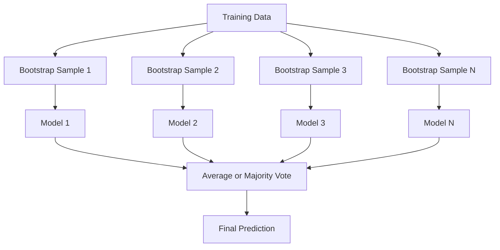
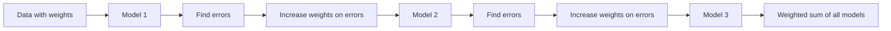
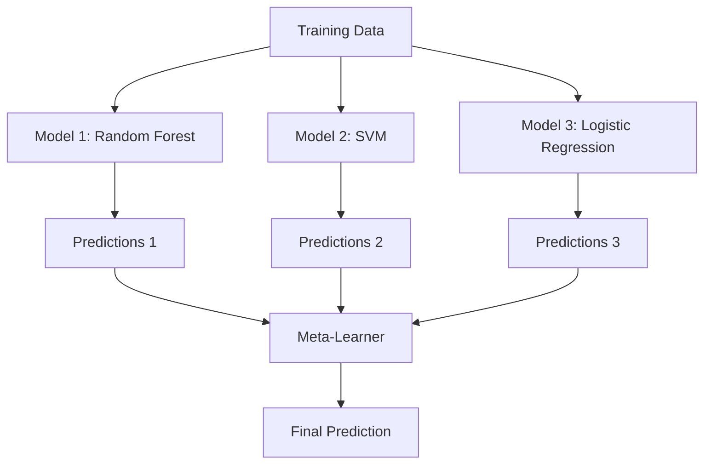

# Metody zespołowe

> Grupa słabych uczniów, odpowiednio dobrana, staje się silnym uczniem. To nie jest metafora. To jest twierdzenie.

**Typ:** Kompilacja
**Język:** Python
**Wymagania wstępne:** Faza 2, lekcja 10 (kompromis odchylenia i wariancji)
**Czas:** ~120 minut

## Cele nauczania

- Zaimplementuj od zera AdaBoost i wzmacnianie gradientu i wyjaśniaj, w jaki sposób wzmacnianie sekwencyjnie zmniejsza obciążenie
- Zbuduj zbiór worków i zademonstruj, jak uśrednianie modeli zdekorelowanych zmniejsza wariancję bez zwiększania błędu systematycznego
- Porównaj pakowanie, wzmacnianie i układanie w stosy pod względem składnika błędu, którego dotyczy każda metoda
- Oceń różnorodność zespołów i wyjaśnij, dlaczego dokładność głosowania większością poprawia się w przypadku bardziej niezależnych i słabych uczniów

## Problem

Pojedyncze drzewo decyzyjne można szybko wyszkolić i łatwo zinterpretować, ale jest ono przesadzone. Pojedynczy model liniowy jest niedopasowany do złożonych granic. Projektowanie idealnej architektury modelu można spędzić całymi dniami. Możesz też połączyć kilka niedoskonałych modeli i uzyskać coś lepszego niż którykolwiek z nich osobno.

Metody zespołowe robią dokładnie to. Stanowią najbardziej niezawodną technikę wygrywania konkursów Kaggle na danych tabelarycznych, zasilają większość produkcyjnych systemów ML i ilustrują w działaniu kompromis wariancji odchylenia. Pakowanie zmniejsza wariancję. Wzmocnienie zmniejsza stronniczość. Stacking uczy się, którym modelom można ufać i na jakich danych wejściowych.

## Koncepcja

### Dlaczego zespoły działają

Załóżmy, że masz N niezależnych klasyfikatorów, każdy z dokładnością p > 0,5. Większość głosów ma dokładność:

```
P(majority correct) = sum over k > N/2 of C(N,k) * p^k * (1-p)^(N-k)
```

W przypadku 21 klasyfikatorów, każdy z dokładnością 60%, dokładność głosowania większości wynosi około 74%. Przy 101 klasyfikatorach odsetek ten wzrasta do 84%. Błędy znoszą się, gdy modele popełniają różne błędy.

Kluczowym wymogiem jest **różnorodność**. Jeśli wszystkie modele popełniają te same błędy, łączenie ich nic nie pomoże. Zespoły działają, ponieważ tworzą różnorodne modele poprzez:

- Różne podzbiory treningowe (pakowanie)
- Różne podzbiory funkcji (losowe lasy)
- Sekwencyjna korekcja błędów (boosting)
- Różne rodziny modeli (układanie w stosy)

### Pakowanie (agregacja Bootstrap)

Pakowanie tworzy różnorodność poprzez uczenie każdego modelu na innej próbce ładowania początkowego danych szkoleniowych.



Próbka bootstrap jest pobierana z zastąpieniem oryginalnych danych o takim samym rozmiarze jak oryginał. W każdym bootstrapie pojawia się około 63,2% unikalnych próbek. Pozostałe 36,8% (próbki out-of-bag) zapewnia bezpłatny zestaw walidacyjny.

Bagażowanie zmniejsza wariancję bez znacznego zwiększania odchylenia. Każde pojedyncze drzewo nadmiernie dopasowuje się do swojej próbki bootstrap, ale nadmierne dopasowanie jest inne dla każdego drzewa, więc uśrednianie eliminuje szum.

**Losowe lasy** mają dodatkowy akcent: przy każdym podziale brany jest pod uwagę tylko losowy podzbiór funkcji. Wymusza to jeszcze większą różnorodność wśród drzew. Typowa liczba potencjalnych cech to `sqrt(n_features)` w przypadku klasyfikacji i `n_features / 3` w przypadku regresji.

### Wzmocnienie (sekwencyjna korekcja błędów)

Wzmacnianie modeli pociągów sekwencyjnie. Każdy nowy model skupia się na przykładach, w których poprzednie modele się myliły.



Wzmocnienie zmniejsza stronniczość. Każdy nowy model koryguje dotychczasowe błędy systematyczne zespołu. Ostateczna prognoza jest sumą ważoną wszystkich modeli, przy czym lepsze modele otrzymują wyższe wagi.

Kompromis: wzmocnienie może przesadzić, jeśli wykonasz zbyt wiele rund, ponieważ będzie pasować do trudniejszych przykładów, z których część może powodować hałas.

### AdaBoost

AdaBoost (Adaptive Boosting) był pierwszym praktycznym algorytmem wzmacniającym. Działa z każdym podstawowym uczniem, zazwyczaj z pniakami decyzyjnymi (drzewa o głębokości 1).

Algorytm:

```
1. Initialize sample weights: w_i = 1/N for all i

2. For t = 1 to T:
   a. Train weak learner h_t on weighted data
   b. Compute weighted error:
      err_t = sum(w_i * I(h_t(x_i) != y_i)) / sum(w_i)
   c. Compute model weight:
      alpha_t = 0.5 * ln((1 - err_t) / err_t)
   d. Update sample weights:
      w_i = w_i * exp(-alpha_t * y_i * h_t(x_i))
   e. Normalize weights to sum to 1

3. Final prediction: H(x) = sign(sum(alpha_t * h_t(x)))
```

Modele z niższym błędem uzyskują wyższą wartość alfa. Błędnie sklasyfikowane próbki otrzymują wyższe wagi, więc następny model skupia się na nich.

### Wzmocnienie gradientowe

Wzmocnienie gradientowe uogólnia wzmocnienie na dowolne funkcje straty. Zamiast ponownie ważyć próbki, dopasowuje każdy nowy model do reszt (ujemnego gradientu straty) bieżącego zestawu.

```
1. Initialize: F_0(x) = argmin_c sum(L(y_i, c))

2. For t = 1 to T:
   a. Compute pseudo-residuals:
      r_i = -dL(y_i, F_{t-1}(x_i)) / dF_{t-1}(x_i)
   b. Fit a tree h_t to the residuals r_i
   c. Find optimal step size:
      gamma_t = argmin_gamma sum(L(y_i, F_{t-1}(x_i) + gamma * h_t(x_i)))
   d. Update:
      F_t(x) = F_{t-1}(x) + learning_rate * gamma_t * h_t(x)

3. Final prediction: F_T(x)
```

W przypadku kwadratowej utraty błędów pseudoreszty są po prostu rzeczywistymi resztami: `r_i = y_i - F_{t-1}(x_i)`. Każde drzewo dosłownie pasuje do błędów poprzedniego zespołu.

Szybkość uczenia się (kurczenie) kontroluje wkład każdego drzewa. Mniejsze szybkości uczenia się wymagają większej liczby drzew, ale lepiej generalizują. Typowe wartości: 0,01 do 0,3.

### XGBoost: dlaczego dominuje w danych tabelarycznych

XGBoost (eXtreme Gradient Boosting) to zwiększanie gradientu z optymalizacjami inżynieryjnymi, dzięki którym jest szybkie, dokładne i odporne na nadmierne dopasowanie:

- **Uregulowany cel:** Kary L1 i L2 dotyczące ciężaru liści zapobiegają nadmiernej pewności poszczególnych drzew
- **Przybliżenie drugiego rzędu:** Wykorzystuje zarówno pierwszą, jak i drugą pochodną straty, dając lepsze decyzje dotyczące podziału
- **Podziały uwzględniające rzadkość:** Natywnie obsługuje braki danych, ucząc się najlepszego kierunku brakujących danych przy każdym podziale
- **Podpróbkowanie kolumn:** Podobnie jak w przypadku lasów losowych, próbki są uwzględniane przy każdym podziale w celu zapewnienia różnorodności
- **Ważony szkic kwantyla:** Skutecznie znajduje punkty podziału dla obiektów ciągłych w rozproszonych danych
- **Struktura bloków uwzględniająca pamięć podręczną:** Układ pamięci zoptymalizowany pod kątem linii pamięci podręcznej procesora

W przypadku danych tabelarycznych XGBoost (i jego następca LightGBM) konsekwentnie przewyższa sieci neuronowe. To nie zmieni się w najbliższym czasie. Jeśli Twoje dane mieszczą się w tabeli zawierającej wiersze i kolumny, zacznij od wzmocnienia gradientu.

### Układanie w stosy (Meta-nauka)

Stacking wykorzystuje przewidywania wielu modeli podstawowych jako funkcje dla metauczniów.



Metauczeń uczy się, któremu modelowi bazowemu zaufać w przypadku jakich danych wejściowych. Jeśli losowy las jest lepszy w niektórych regionach, a SVM w innych, metauczący nauczy się odpowiednio wyznaczać trasę.

Aby uniknąć wycieku danych, należy wygenerować prognozy modelu podstawowego poprzez weryfikację krzyżową zbioru uczącego. Nigdy nie szkolisz modeli podstawowych i nie generujesz metafunkcji na tych samych danych.

### Głosowanie

Najprostszy zespół. Po prostu połącz prognozy bezpośrednio.

- **Trudne głosowanie:** Głosowanie większościowe na etykietach klas.
- **Głosowanie miękkie:** Średnie przewidywane prawdopodobieństwa, wybierz klasę o najwyższym średnim prawdopodobieństwie. Zwykle jest lepszy, ponieważ wykorzystuje informacje poufne.

## Zbuduj to

### Krok 1: Kikut decyzyjny (uczeń podstawowy)

Kod w `code/ensembles.py` implementuje wszystko od zera. Zaczynamy od pnia decyzyjnego: drzewa z pojedynczym podziałem.

```python
class DecisionStump:
    def __init__(self):
        self.feature_idx = None
        self.threshold = None
        self.polarity = 1
        self.alpha = None

    def fit(self, X, y, weights):
        n_samples, n_features = X.shape
        best_error = float("inf")

        for f in range(n_features):
            thresholds = np.unique(X[:, f])
            for thresh in thresholds:
                for polarity in [1, -1]:
                    pred = np.ones(n_samples)
                    pred[polarity * X[:, f] < polarity * thresh] = -1
                    error = np.sum(weights[pred != y])
                    if error < best_error:
                        best_error = error
                        self.feature_idx = f
                        self.threshold = thresh
                        self.polarity = polarity

    def predict(self, X):
        n = X.shape[0]
        pred = np.ones(n)
        idx = self.polarity * X[:, self.feature_idx] < self.polarity * self.threshold
        pred[idx] = -1
        return pred
```

### Krok 2: AdaBoost od podstaw

```python
class AdaBoostScratch:
    def __init__(self, n_estimators=50):
        self.n_estimators = n_estimators
        self.stumps = []
        self.alphas = []

    def fit(self, X, y):
        n = X.shape[0]
        weights = np.full(n, 1 / n)

        for _ in range(self.n_estimators):
            stump = DecisionStump()
            stump.fit(X, y, weights)
            pred = stump.predict(X)

            err = np.sum(weights[pred != y])
            err = np.clip(err, 1e-10, 1 - 1e-10)

            alpha = 0.5 * np.log((1 - err) / err)
            weights *= np.exp(-alpha * y * pred)
            weights /= weights.sum()

            stump.alpha = alpha
            self.stumps.append(stump)
            self.alphas.append(alpha)

    def predict(self, X):
        total = sum(a * s.predict(X) for a, s in zip(self.alphas, self.stumps))
        return np.sign(total)
```

### Krok 3: Wzmocnienie gradientu od podstaw

```python
class GradientBoostingScratch:
    def __init__(self, n_estimators=100, learning_rate=0.1, max_depth=3):
        self.n_estimators = n_estimators
        self.lr = learning_rate
        self.max_depth = max_depth
        self.trees = []
        self.initial_pred = None

    def fit(self, X, y):
        self.initial_pred = np.mean(y)
        current_pred = np.full(len(y), self.initial_pred)

        for _ in range(self.n_estimators):
            residuals = y - current_pred
            tree = SimpleRegressionTree(max_depth=self.max_depth)
            tree.fit(X, residuals)
            update = tree.predict(X)
            current_pred += self.lr * update
            self.trees.append(tree)

    def predict(self, X):
        pred = np.full(X.shape[0], self.initial_pred)
        for tree in self.trees:
            pred += self.lr * tree.predict(X)
        return pred
```

### Krok 4: Porównanie ze sklearn

Kod sprawdza, czy nasze implementacje od podstaw zapewniają dokładność podobną do `AdaBoostClassifier` i `GradientBoostingClassifier` sklearna, a następnie porównuje wszystkie metody obok siebie.

## Użyj tego

### Kiedy stosować każdą metodę

| Metoda | Zmniejsza | Najlepsze dla | Uważaj na |
|--------|---------|---------|--------------|
| Pakowanie / Losowy las | Wariancja | Zaszumione dane, wiele funkcji | Nie pomaga w uprzedzeniach |
| AdaBoost | stronniczość | Czyste dane, prosta baza uczniów | Wrażliwy na wartości odstające i szum |
| Wzmocnienie gradientu | stronniczość | Dane tabelaryczne, konkursy | Powolny w treningu, łatwy do przetrenowania bez strojenia |
| XGBoost / LightGBM | Obydwa | Tabela produkcji ML | Wiele hiperparametrów |
| Układanie | Obydwa | Uzyskanie ostatniej dokładności 1-2% | Złożone, ryzyko nadmiernego dopasowania metauczącego się |
| Głosowanie | Wariancja | Szybkie łączenie różnorodnych modeli | Pomaga tylko wtedy, gdy modele są różnorodne |

### Stos produkcyjny dla danych tabelarycznych

W przypadku większości problemów z przewidywaniem tabelarycznym należy spróbować w następującej kolejności:

1. **LightGBM lub XGBoost** z parametrami domyślnymi
2. Dostrój n_estimators, learning_rate, max_głębię, min_child_weight
3. Jeśli potrzebujesz ostatnich 0,5%, zbuduj zestaw składający się z 3-5 różnych modeli
4. W całym tekście stosuj walidację krzyżową

Sieci neuronowe na danych tabelarycznych są prawie zawsze gorsze od wzmacniania gradientowego, pomimo ciągłych prób badawczych. TabNet, NODE i podobne architektury czasami dorównują dobrze dostrojonemu XGBoost, ale rzadko je pokonują.

## Wyślij to

W tej lekcji zostanie wyświetlony `outputs/prompt-ensemble-selector.md` — monit, który pomoże Ci wybrać właściwą metodę zestawiania dla danego zbioru danych. Opisz swoje dane (rozmiar, typy funkcji, poziom hałasu, równowagę klas) i problem, który rozwiązujesz. Podpowiedź przegląda listę kontrolną decyzji, zaleca metodę, sugeruje rozpoczęcie hiperparametrów i ostrzega o typowych błędach w przypadku tej metody. Tworzy także `outputs/skill-ensemble-builder.md` z pełnym przewodnikiem po wyborze.

## Ćwiczenia

1. Zmodyfikuj implementację AdaBoost, aby śledzić dokładność treningu po każdej rundzie. Dokładność wykresu a liczba estymatorów. Kiedy to się zbiega?

2. Zaimplementuj losowy las od podstaw, dodając losowe podpróbkowanie funkcji do drzewa regresji. Wytrenuj 100 drzew za pomocą `max_features=sqrt(n_features)` i średnich przewidywań. Porównaj redukcję wariancji z pojedynczym drzewem.

3. W implementacji wzmacniania gradientu dodaj wczesne zatrzymanie: śledź utratę walidacji po każdej rundzie i zatrzymuj się, gdy nie nastąpiła poprawa przez 10 kolejnych rund. Ile drzew tak naprawdę potrzebuje?

4. Zbuduj zespół układający składający się z trzech modeli podstawowych (regresja logistyczna, drzewo decyzyjne, k-najbliższych sąsiadów) i metauczącego się regresji logistycznej. Użyj 5-krotnej walidacji krzyżowej, aby wygenerować meta-cechy. Porównaj z każdym modelem podstawowym.

5. Uruchom XGBoost na tym samym zestawie danych z domyślnymi parametrami. Porównaj jego dokładność ze wzmocnieniem gradientu od zera. Czas na oba. Jak duża jest różnica prędkości?

## Kluczowe terminy

| Termin | Co ludzie mówią | Co to właściwie oznacza |
|------|----------------|----------------------|
| Pakowanie | „Trenuj na losowych podzbiorach” | Agregacja metodą bootstrap: trenuj modele na próbkach bootstrap, średnie przewidywania w celu zmniejszenia wariancji |
| Wzmocnienie | „Skoncentruj się na trudnych przykładach” | Trenuj modele sekwencyjnie, korygując dotychczasowe błędy zespołu, aby zmniejszyć obciążenie |
| AdaBoost | „Przeważ dane” | Zwiększanie poprzez aktualizacje masy próbki; błędnie sklasyfikowane punkty otrzymują wyższą wagę dla następnego ucznia |
| Wzmocnienie gradientu | „Dopasuj pozostałości” | Wzmocnienie poprzez dopasowanie każdego nowego modelu do ujemnego gradientu funkcji straty |
| XGBoost | „Broń Kaggle” | Wzmocnienie gradientu za pomocą regularyzacji, optymalizacji drugiego rzędu i sztuczek zwiększających prędkość na poziomie systemu |
| Układanie | „Modele na modelach” | Użyj przewidywań modeli podstawowych jako funkcji wejściowych dla metaucznia |
| Losowy las | „Wiele losowych drzew” | Łączenie z drzewami decyzyjnymi, dodawanie losowego podpróbkowania funkcji przy każdym podziale w celu zapewnienia różnorodności |
| Różnorodność zespołów | „Popełniaj różne błędy” | Aby zespół mógł poprawić się w stosunku do pojedynczych osób, modele muszą być nieskorelowane w swoich błędach
| Błąd braku worka | „Bezpłatna walidacja” | Próbki, które nie zostały pobrane metodą ładowania początkowego (~36,8%), służą jako zestaw walidacyjny bez konieczności wstrzymywania |

## Dalsze czytanie

- [Schapire & Freund: Boosting: Foundations and Algorithms](https://mitpress.mit.edu/9780262526036/) – książka twórców AdaBoost
- [Friedman: Aproksymacja funkcji zachłannej: maszyna do wzmacniania gradientu (2001)](https://statweb.stanford.edu/~jhf/ftp/trebst.pdf) – oryginalna publikacja dotycząca wzmacniania gradientu
– [Chen i Guestrin: XGBoost (2016)](https://arxiv.org/abs/1603.02754) – artykuł na temat XGBoost
– [Wolpert: Stacked Generalization (1992)](https://www.sciencedirect.com/science/article/abs/pii/S0893608005800231) – oryginalny papier do układania w stosy
- [Metody zespołowe scikit-learn](https://scikit-learn.org/stable/modules/ensemble.html) -- odniesienie praktyczne