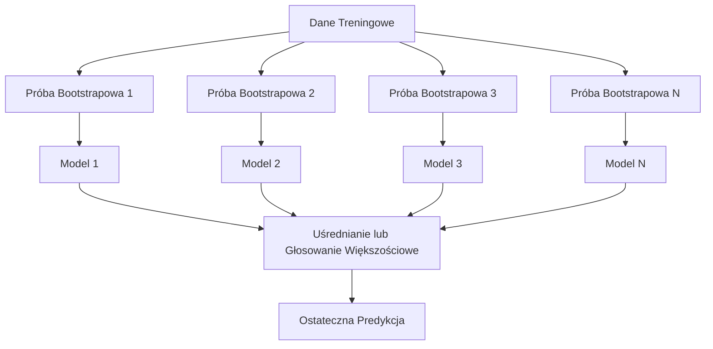
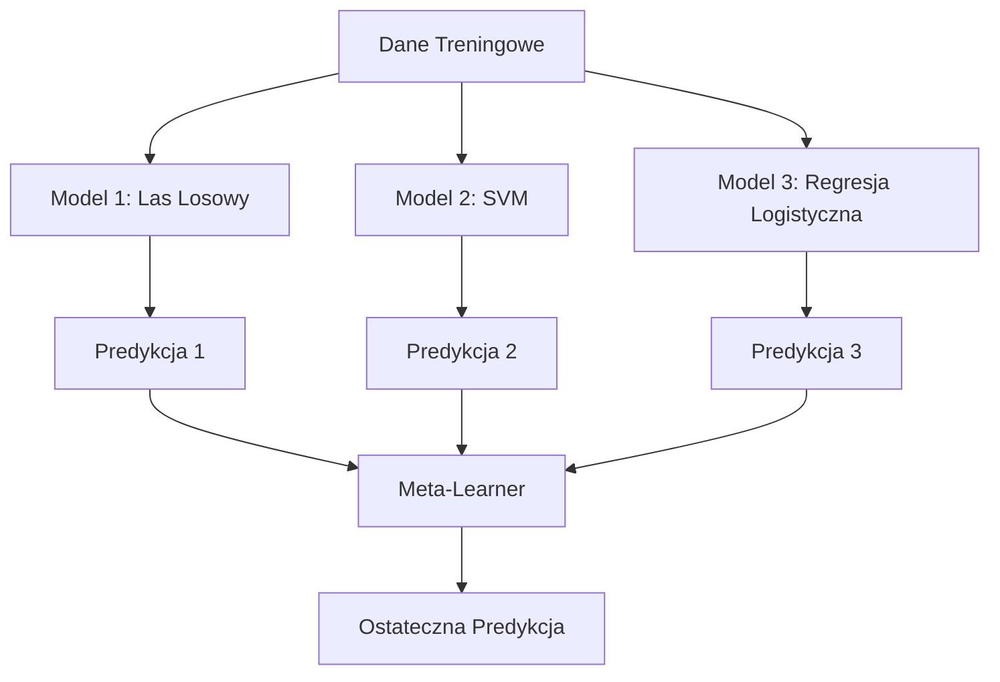

# Metody zespołowe (Ensemble Methods)

> Grupa słabych modeli, odpowiednio połączona, staje się silnym modelem. To nie jest metafora. To twierdzenie matematyczne.

**Typ:** Kompilacja
**Język:** Python
**Wymagania wstępne:** Faza 2, lekcja 10 (Kompromis między obciążeniem a wariancją)
**Czas:** ~120 minut

## Cele nauczania

- Zaimplementowanie od podstaw algorytmów AdaBoost i Gradient Boosting oraz wyjaśnienie, w jaki sposób boosting sekwencyjnie zmniejsza obciążenie (bias).
- Zbudowanie modelu opartego na baggingu i zademonstrowanie, jak uśrednianie nieskorelowanych modeli zmniejsza wariancję bez zwiększania obciążenia.
- Porównanie baggingu, boostingu i stackingu pod kątem składowej błędu, na którą wpływa każda z tych metod.
- Ocena różnorodności w ramach metod zespołowych oraz zrozumienie, dlaczego skuteczność głosowania większościowego (majority voting) rośnie, gdy bazowe modele są bardziej od siebie niezależne.

## Problem

Pojedyncze drzewo decyzyjne uczy się szybko i jest łatwe w interpretacji, ale ma silną tendencję do przeuczenia (overfittingu). Pojedynczy model liniowy nie radzi sobie ze złożonymi, nieliniowymi zależnościami (underfitting). Projektowaniu idealnej architektury modelu można poświęcić całe dnie. Zamiast tego, można połączyć kilka niedoskonałych modeli i uzyskać rezultat lepszy niż ten, który osiągnąłby jakikolwiek z nich osobno.

Metody zespołowe robią dokładnie to. Są one najbardziej niezawodną metodą na wygrywanie konkursów Kaggle z danymi tabelarycznymi, napędzają większość produkcyjnych systemów ML i doskonale ilustrują kompromis między obciążeniem a wariancją. Bagging redukuje wariancję. Boosting redukuje obciążenie. Stacking uczy się, którym modelom można ufać w zależności od analizowanych danych wejściowych.

## Koncepcja

### Dlaczego zespoły działają

Załóżmy, że masz N niezależnych klasyfikatorów, z których każdy ma skuteczność (dokładność) p > 0,5. Skuteczność głosowania większościowego wynosi:

```
P(majority correct) = suma dla k > N/2 z C(N,k) * p^k * (1-p)^(N-k)
```

W przypadku 21 klasyfikatorów, z których każdy ma skuteczność 60%, skuteczność głosowania większościowego wynosi około 74%. Przy 101 klasyfikatorach odsetek ten wzrasta do 84%. Błędy znoszą się wzajemnie, o ile poszczególne modele mylą się w różnych przypadkach.

Kluczowym wymogiem jest **różnorodność**. Jeśli wszystkie modele popełniają te same błędy, ich łączenie nic nie da. Metody zespołowe działają, ponieważ tworzą różnorodne modele poprzez:

- Różne podzbiory treningowe (bagging)
- Różne podzbiory cech (Lasy Losowe)
- Sekwencyjną korektę błędów (boosting)
- Różne typy algorytmów (stacking)

### Bagging (Agregacja Bootstrapowa)

Bagging tworzy różnorodność, trenując każdy bazowy model na innej próbie bootstrapowej pobranej z zestawu treningowego.



Próba bootstrapowa jest losowana ze zwracaniem, a jej rozmiar jest równy oryginalnemu zestawowi danych. W każdej takiej próbie znajduje się zazwyczaj około 63,2% unikalnych obserwacji. Pozostałe 36,8% (tzw. próbki out-of-bag) zapewnia darmowy zestaw walidacyjny.

Bagging zmniejsza wariancję bez znaczącego zwiększania obciążenia. Każde z pojedynczych drzew nadmiernie dopasowuje się do swojej próby bootstrapowej, ale charakter tego przeuczenia jest różny dla każdego drzewa, więc uśrednianie eliminuje ten szum.

**Lasy Losowe (Random Forests)** dodają jeszcze jedną modyfikację: przy każdym podziale węzła brany jest pod uwagę tylko losowy podzbiór cech. Wymusza to jeszcze większą różnorodność między drzewami. Standardowo wybiera się `sqrt(n_features)` potencjalnych cech dla klasyfikacji oraz `n_features / 3` dla regresji.

### Boosting (Sekwencyjna Korekta Błędów)

Boosting polega na sekwencyjnym trenowaniu modeli. Każdy kolejny model skupia się na przypadkach, w których poprzednie modele popełniły błędy.


Boosting redukuje obciążenie (bias). Każdy nowy model koryguje systematyczne błędy zespołu modeli. Ostateczna predykcja jest sumą ważoną wyników wszystkich modeli, przy czym lepsze modele otrzymują wyższe wagi.

Kompromis: boosting może ulec przeuczeniu (overfittingowi), jeśli wykonasz zbyt wiele iteracji (rund), ponieważ zacznie dopasowywać się do coraz trudniejszych obserwacji, z których część może być po prostu szumem.

### AdaBoost

AdaBoost (Adaptive Boosting) był pierwszym praktycznym algorytmem boostingu. Współpracuje on z każdym typem modeli bazowych (tzw. słabych uczniów - weak learners), jednak najczęściej wykorzystuje się pnie decyzyjne (drzewa decyzyjne o głębokości równej 1).

Algorytm:

```
1. Zainicjuj wagi próbek: w_i = 1/N dla każdego i

2. Dla t = 1 do T:
   a. Wytrenuj słaby model h_t na ważonych danych
   b. Oblicz błąd ważony:
      err_t = sum(w_i * I(h_t(x_i) != y_i)) / sum(w_i)
   c. Oblicz wagę modelu:
      alpha_t = 0.5 * ln((1 - err_t) / err_t)
   d. Zaktualizuj wagi próbek:
      w_i = w_i * exp(-alpha_t * y_i * h_t(x_i))
   e. Znormalizuj wagi, tak aby sumowały się do 1

3. Ostateczna predykcja: H(x) = sign(sum(alpha_t * h_t(x)))
```

Modele z niższym błędem otrzymują wyższą wartość wagi (alfa). Z kolei próbki, które zostały błędnie sklasyfikowane, otrzymują zwiększone wagi, dzięki czemu następny model będzie musiał skupić się właśnie na nich.

### Gradient Boosting

Gradient Boosting uogólnia metodę boostingu dla dowolnej różniczkowalnej funkcji straty. Zamiast operować na wagach próbek, algorytm uczy każdy kolejny model na tzw. pseudoresztach (czyli ujemnym gradiencie funkcji straty) z poprzedniej wersji zespołu.

```
1. Zainicjuj: F_0(x) = argmin_c sum(L(y_i, c))

2. Dla t = 1 do T:
   a. Oblicz pseudoreszty:
      r_i = -dL(y_i, F_{t-1}(x_i)) / dF_{t-1}(x_i)
   b. Dopasuj drzewo h_t do reszt r_i
   c. Znajdź optymalny rozmiar kroku (gamma_t):
      gamma_t = argmin_gamma sum(L(y_i, F_{t-1}(x_i) + gamma * h_t(x_i)))
   d. Zaktualizuj model:
      F_t(x) = F_{t-1}(x) + learning_rate * gamma_t * h_t(x)

3. Ostateczna predykcja: F_T(x)
```

W przypadku błędu średniokwadratowego (MSE) pseudoreszty to po prostu prawdziwe reszty: `r_i = y_i - F_{t-1}(x_i)`. Wówczas każde drzewo dosłownie uczy się korygować błędy pozostawione przez poprzednie iteracje.

Współczynnik uczenia (learning rate, czasami nazywany też "shrinkage") kontroluje wpływ każdego drzewa na ostateczny model. Niższy współczynnik uczenia wymaga większej liczby drzew, ale pozwala modelowi lepiej uogólniać wiedzę. Typowe wartości mieszczą się w przedziale od 0,01 do 0,3.

### XGBoost: dlaczego dominuje w danych tabelarycznych

XGBoost (eXtreme Gradient Boosting) to algorytm Gradient Boostingu posiadający specyficzne optymalizacje programistyczne i matematyczne, które sprawiają, że jest szybki, dokładny i odporny na przeuczenie:

- **Regularyzowana funkcja celu:** Kary L1 i L2 aplikowane do wag liści zapobiegają zbytniej "pewności" ze strony pojedynczych drzew.
- **Aproksymacja drugiego rzędu:** Oblicza zarówno pierwszą, jak i drugą pochodną funkcji straty, pozwalając na precyzyjniejsze decydowanie o miejscach podziału węzłów.
- **Odporność na wartości brakujące (Sparsity-aware splits):** Natywnie radzi sobie z brakami danych – podczas każdego podziału algorytm sprawdza najlepszy kierunek dla brakujących wartości.
- **Subsampling kolumn (Column subsampling):** Podobnie jak w losowych lasach, przy podziałach węzłów wykorzystywany jest podzbiór cech, co zwiększa różnorodność i odporność modelu.
- **Aproksymacja histogramowa (Weighted quantile sketch):** Skutecznie poszukuje potencjalnych punktów podziału węzła w dużych i rozproszonych zbiorach danych.
- **Budowa dostosowana do sprzętu (Cache-aware block structure):** Optymalizuje wykorzystanie pamięci podręcznej procesora.

Przy danych tabelarycznych XGBoost (i jego bezpośredni konkurent, LightGBM) konsekwentnie przewyższają skutecznością sieci neuronowe. Prędko się to nie zmieni. Jeśli Twoje dane to po prostu tabela z wierszami i kolumnami, Gradient Boosting to naturalny punkt wyjścia.

### Stacking (Meta-uczenie się)

Stacking wykorzystuje predykcje z wielu modeli bazowych jako funkcje dla nadrzędnego modelu metauczącego (meta-learnera).



Metauczeń sprawdza, którym z modeli bazowych można zaufać dla poszczególnych rodzajów danych wejściowych. Przykładowo, jeśli Las Losowy radzi sobie lepiej w konkretnym zakresie danych, a SVM w innym, metauczeń przyswoi sobie wiedzę o tej zależność i dokona odpowiedniej selekcji.

Aby uniknąć wycieku danych (data leakage), konieczne jest generowanie predykcji dla modelu bazowego w oparciu o weryfikację krzyżową (cross-validation) dla zbioru uczącego. Nigdy nie powinieneś trenować modeli bazowych oraz wyznaczać meta-cech dla tych samych danych.

### Głosowanie (Voting)

Najprostsza metoda łączenia modeli bazujących. Zwyczajnie uśrednia otrzymane prognozy.

- **Twarde głosowanie (Hard voting):** Podejmowanie decyzji większością głosów klasyfikatorów.
- **Miękkie głosowanie (Soft voting):** Średnia przewidywanych prawdopodobieństw; wybrana zostaje klasa z największą wartością. Zazwyczaj jest to skuteczniejsze od twardego głosowania, ponieważ bierze pod uwagę także marginesy błędu i pewność predykcji dla poszczególnych klas.

## Zbuduj to

### Krok 1: Pień decyzyjny (Model podstawowy)

Kod w pliku `code/ensembles.py` to pełna implementacja modeli bazowych od podstaw. Skrypt zaczyna się od tzw. pnia decyzyjnego (ang. decision stump), czyli drzewa dokonującego tylko jednego podziału.

```python
class DecisionStump:
    def __init__(self):
        self.feature_idx = None
        self.threshold = None
        self.polarity = 1
        self.alpha = None

    def fit(self, X, y, weights):
        n_samples, n_features = X.shape
        best_error = float("inf")

        for f in range(n_features):
            thresholds = np.unique(X[:, f])
            for thresh in thresholds:
                for polarity in [1, -1]:
                    pred = np.ones(n_samples)
                    pred[polarity * X[:, f] < polarity * thresh] = -1
                    error = np.sum(weights[pred != y])
                    if error < best_error:
                        best_error = error
                        self.feature_idx = f
                        self.threshold = thresh
                        self.polarity = polarity

    def predict(self, X):
        n = X.shape[0]
        pred = np.ones(n)
        idx = self.polarity * X[:, self.feature_idx] < self.polarity * self.threshold
        pred[idx] = -1
        return pred
```

### Krok 2: AdaBoost od podstaw

```python
class AdaBoostScratch:
    def __init__(self, n_estimators=50):
        self.n_estimators = n_estimators
        self.stumps = []
        self.alphas = []

    def fit(self, X, y):
        n = X.shape[0]
        weights = np.full(n, 1 / n)

        for _ in range(self.n_estimators):
            stump = DecisionStump()
            stump.fit(X, y, weights)
            pred = stump.predict(X)

            err = np.sum(weights[pred != y])
            err = np.clip(err, 1e-10, 1 - 1e-10)

            alpha = 0.5 * np.log((1 - err) / err)
            weights *= np.exp(-alpha * y * pred)
            weights /= weights.sum()

            stump.alpha = alpha
            self.stumps.append(stump)
            self.alphas.append(alpha)

    def predict(self, X):
        total = sum(a * s.predict(X) for a, s in zip(self.alphas, self.stumps))
        return np.sign(total)
```

### Krok 3: Gradient Boosting od podstaw

```python
class GradientBoostingScratch:
    def __init__(self, n_estimators=100, learning_rate=0.1, max_depth=3):
        self.n_estimators = n_estimators
        self.lr = learning_rate
        self.max_depth = max_depth
        self.trees = []
        self.initial_pred = None

    def fit(self, X, y):
        self.initial_pred = np.mean(y)
        current_pred = np.full(len(y), self.initial_pred)

        for _ in range(self.n_estimators):
            residuals = y - current_pred
            tree = SimpleRegressionTree(max_depth=self.max_depth)
            tree.fit(X, residuals)
            update = tree.predict(X)
            current_pred += self.lr * update
            self.trees.append(tree)

    def predict(self, X):
        pred = np.full(X.shape[0], self.initial_pred)
        for tree in self.trees:
            pred += self.lr * tree.predict(X)
        return pred
```

### Krok 4: Porównanie ze scikit-learn

Kod służy również do weryfikacji tego, czy autorska implementacja może mierzyć się z dokładnością klasyfikatorów takich jak `AdaBoostClassifier` oraz `GradientBoostingClassifier` ze scikit-learn. Skrypt porównuje bezpośrednio każdą z podanych metod.

## Zastosowanie

### Kiedy stosować każdą z metod

| Metoda | Redukuje | Najlepiej sprawdza się przy | Na co uważać |
|--------|---------|---------|--------------|
| Bagging / Las Losowy | Wariancję | Zaszumione dane, dużo cech | Nie redukuje obciążenia (bias) |
| AdaBoost | Obciążenie | Czyste dane, proste modele bazowe | Wrażliwy na wartości odstające i szum w danych |
| Gradient Boosting | Obciążenie | Dane tabelaryczne, konkursy Kaggle | Powolne uczenie, łatwo o przeuczenie bez tuningu |
| XGBoost / LightGBM | Jedno i drugie | Produkcyjne modele na danych tabelarycznych | Duża liczba hiperparametrów do dostrojenia |
| Stacking | Jedno i drugie | Wyciąganiu ostatnich 1-2% skuteczności | Złożone implementacyjnie, ryzyko przeuczenia meta-ucznia |
| Głosowanie (Voting) | Wariancję | Szybkim łączeniu zróżnicowanych modeli | Przynosi efekty tylko gdy modele wykazują istotną różnorodność |

### Standard produkcyjny dla danych tabelarycznych

Dla zdecydowanej większości zadań analitycznych związanych z danymi tabelarycznymi postępuj zgodnie z poniższym schematem:

1. Przetestuj **LightGBM lub XGBoost** z domyślnymi parametrami.
2. Dostrój `n_estimators`, `learning_rate`, `max_depth`, `min_child_weight`.
3. Jeśli potrzebujesz dodatkowych 0,5% do skuteczności, stwórz model używający stackingu składający się z 3-5 zróżnicowanych modeli.
4. Korzystaj z weryfikacji krzyżowej we wszystkich powyższych podpunktach.

Przez dekady, sieci neuronowe testowane dla strukturyzowanych danych tabelarycznych wykazywały niższe osiągi względem modeli bazujących na Gradient Boostingu, a nowsze architektury takie jak TabNet lub NODE rzadko potrafią dorównać zoptymalizowanemu XGBoost.

## Zadania do przesłania

Plikiem tworzonym dla celów lekcji jest `outputs/prompt-ensemble-selector.md` — jest to instrukcja mająca na celu dobranie adekwatnej metody dla danego zbioru danych. Należy opisać szczegóły w nim zawarte (wielkość zestawu, rodzaje atrybutów, szum i równowaga kategorii), aby na ich podstawie uzyskać polecenie adekwatnej metody oraz wskazówki konfiguracji. Polecenie wygeneruje również plik `outputs/skill-ensemble-builder.md`, stanowiący podręcznik tworzenia systemów analitycznych wykorzystujących zestawianie metod.

## Ćwiczenia

1. Zmodyfikuj zaimplementowany model AdaBoost, by śledził precyzję uczenia się po każdej z iteracji (rund). Zestaw dokładność oraz liczbę predyktorów na wykresie. W którym punkcie wykres staje się jednolity (konwerguje)?
2. Zaimplementuj od podstaw Losowy Las (Random Forest) poprzez dodanie podpróbkowania (subsamplingu) atrybutów w oparciu o proste drzewo regresyjne. Wytrenuj 100 drzew, przyjmując `max_features=sqrt(n_features)`. Uśrednij przewidywania drzew i zestaw redukcję błędu wynikającego z wariancji dla całości zbioru do pojedynczego drzewa.
3. Poszerz Gradient Boosting o "wczesne zatrzymanie" (early stopping). Kod powinien monitorować błędy na zbiorze walidacyjnym po każdej rundzie i przerywać pętlę uczenia w przypadku braku optymalizacji przez kolejnych 10 iteracji.
4. Utwórz zespół w oparciu o Stacking z użyciem 3 modeli analitycznych na bazie danych podstawowych: regresji logistycznej, drzewa decyzyjnego, klasyfikatora k-najbliższych sąsiadów. Zastosuj Regresję Logistyczną w funkcji metaucznia. Wymuś 5-krotną walidację krzyżową na danych w celu utworzenia metacech (meta-features). Odnieś tak zoptymalizowany klasyfikator metaucznia względem dowolnego klasyfikatora opisanego w podstawach stosu.
5. Zaimplementuj natywny kod klasyfikatora XGBoost do identycznego modelu podstawowego przy założeniu bazowych parametrów dla obu. Wykonaj ewaluację dokładności dla implementacji autorskiej (Gradient Boosting od zera) w zestawieniu z modelem XGBoost z biblioteki zewnętrznej. Zweryfikuj czasy obliczeniowe. Z jakiego rzędu optymalizacją czasu mamy do czynienia w modelu XGBoost?

## Kluczowe terminy

| Termin | Co mówią ludzie | Co to oznacza w praktyce |
|------|----------------|----------------------|
| Bagging | "Trenuj modele na losowych częściach danych" | Bootstrap Aggregation: trenuj szereg niezależnych klasyfikatorów na danych wejściowych generowanych losowo na drodze próbkowania w celu ograniczenia wariancji. |
| Boosting | "Skup się na trudnych przypadkach" | Trenowanie modeli sekwencyjnie. Uczenie nowego algorytmu ukierunkowane jest na korekcję błędu dotychczasowych analiz dla minimalizacji odchylenia (bias). |
| AdaBoost | "Rozdzielaj wagę po równo" | Adaptive Boosting: poprawiaj precyzję analiz w następstwie przypisania nowych wartości zmiennej `weight`. Punkty posiadające skazę klasyfikacji otrzymają podwyższoną ważność przy uczeniu przyszłego modelu. |
| Gradient Boosting | "Dopasuj do pozostałych (reszt)" | Boosting przy którym adaptujemy przyszłe drzewa tak, by ujemny wektor spadku wartości minimalizował funkcję strat dla reszt (błędów) estymatora. |
| XGBoost | "Zwycięzca Kaggle" | Implementacja Gradient Boostingu wzbogacona o systemy zapobiegające wyuczeniu z wykorzystaniem analizy pochodnej drugiego rzędu, co znacznie poszerza osiągi w architekturach optymalizacji. |
| Stacking | "Modele dla modeli" | Implementacja wyników modelu bazowego jako predyktora na wejściu dla nadrzędnego "metaucznia". |
| Las losowy (Random Forest) | "Sporo przypadkowych drzew" | Poszerzenie pojęcia "bagging" przy budowie drzew na podstawie randomizacji węzłów w oparciu o atrybuty cech, prowadzące do wzmocnienia różnorodności i uodpornienia modelu. |
| Różnorodność zespołów | "Rób różne błędy" | Zespół optymalizuje i naprawia proces o ile błędy wejściowe (w klasyfikatorach składowych), charakteryzuje brak korelacji. |
| Błąd braku worka (Out-of-Bag Error) | "Bezpłatna weryfikacja" | Pozostałość próby wejściowej nieobjęta losowaniem (około 36,8%) – wyliczenia dokonane na niej mogą posłużyć do oszacowania trafności prognoz modelu, zmniejszając wymóg tworzenia oddzielnych danych dla podzbioru do walidacji prób wstrzymanych. |

## Dalsza lektura

- [Schapire & Freund: Boosting: Foundations and Algorithms](https://mitpress.mit.edu/9780262526036/) – Twórcy mechanizmu AdaBoost.
- [Friedman: Greedy Function Approximation: A Gradient Boosting Machine (2001)](https://statweb.stanford.edu/~jhf/ftp/trebst.pdf) – Publikacja inicjująca Gradient Boosting.
- [Chen and Guestrin: XGBoost (2016)](https://arxiv.org/abs/1603.02754) – Oficjalny biuletyn metody XGBoost.
- [Wolpert: Stacked Generalization (1992)](https://www.sciencedirect.com/science/article/abs/pii/S0893608005800231) – Materiał, od którego zaczęto używać metodologii układania bloków modeli w piramidę.
- [Metody zespołowe scikit-learn](https://scikit-learn.org/stable/modules/ensemble.html) – Przydatne referencje w działaniu.
