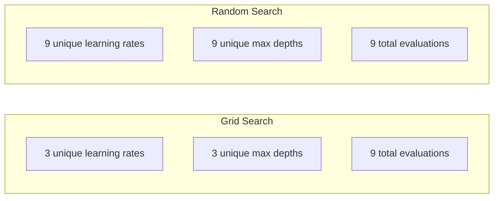
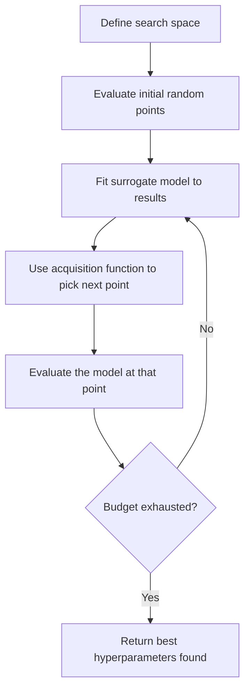
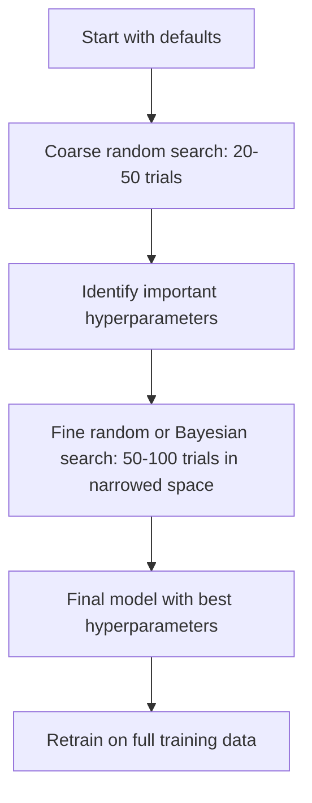
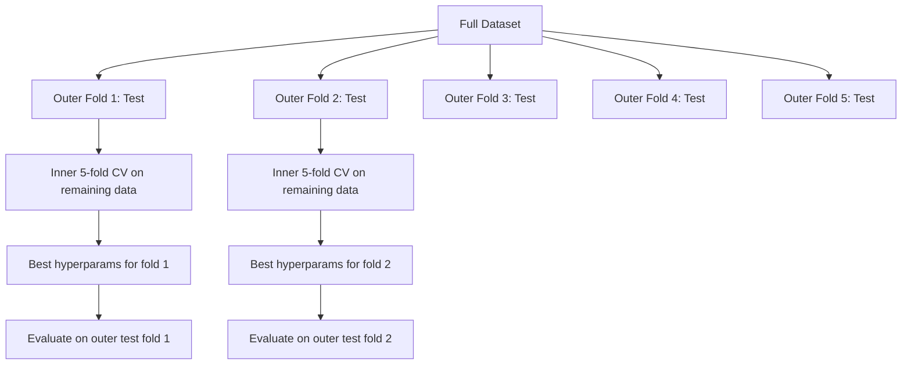

# Strojenie hiperparametrów

> Hiperparametry to pokrętła, które należy przekręcić przed rozpoczęciem treningu. Dobre ich obrócenie to różnica między modelem przeciętnym a świetnym.

**Typ:** Kompilacja
**Język:** Python
**Wymagania wstępne:** Faza 2, Lekcja 11 (Metody zespołowe)
**Czas:** ~90 minut

## Cele nauczania

- Zaimplementuj od podstaw wyszukiwanie siatki, wyszukiwanie losowe i optymalizację Bayesa i porównaj ich wydajność próbek
- Wyjaśnij, dlaczego wyszukiwanie losowe przewyższa wyszukiwanie siatkowe, gdy większość hiperparametrów ma niską efektywną wymiarowość
- Zbuduj pętlę optymalizacji Bayesa, korzystając z modelu zastępczego i funkcji akwizycji, aby poprowadzić wyszukiwanie
- Zaprojektuj strategię dostrajania hiperparametrów, która pozwoli uniknąć nadmiernego dopasowania zestawu walidacyjnego poprzez odpowiednią walidację krzyżową

## Problem

Twój model wzmacniania gradientu ma szybkość uczenia się, liczbę drzew, maksymalną głębokość, minimalną liczbę próbek na liść, stosunek podpróbek i współczynnik próbkowania w kolumnie. To sześć hiperparametrów. Jeśli każda ma 5 rozsądnych wartości, siatka ma 5^6 = 15 625 kombinacji. Każdy trening trwa 10 sekund. To 43 godziny obliczeń, aby wypróbować je wszystkie.

Przeszukiwanie siatki jest podejściem oczywistym i najgorszym pod względem skali. Wyszukiwanie losowe działa lepiej przy mniejszej liczbie obliczeń. Optymalizacja bayesowska radzi sobie jeszcze lepiej, ucząc się na podstawie wcześniejszych ocen. Wiedza o tym, jakiej strategii użyć i które hiperparametry faktycznie mają znaczenie, pozwala zaoszczędzić dni zmarnowanego czasu procesora graficznego.

## Koncepcja

### Parametry a hiperparametry

Parametry są uczone podczas szkolenia (wagi, odchylenia, progi podziału). Hiperparametry są ustawiane przed rozpoczęciem uczenia i kontrolują sposób uczenia się.

| Hiperparametr | Co kontroluje | Typowy zakres |
|--------------|--------------------------------|-------------|
| Szybkość uczenia się | Rozmiar kroku na aktualizację | 0,001 do 1,0 |
| Liczba drzew/epok | Jak długo trenować | 10 do 10 000 |
| Maksymalna głębokość | Złożoność modelu | 1 do 30 |
| Regularyzacja (lambda) | Zapobieganie przeuczeniu | 0,0001 do 100 |
| Wielkość partii | Szum estymacji gradientu | 16 do 512 |
| Wskaźnik rezygnacji | Część neuronów spadła | 0,0 do 0,5 |

### Wyszukiwanie siatki

Wyszukiwanie siatki ocenia każdą kombinację określonych wartości. Jest wyczerpujący i łatwy do zrozumienia, ale skaluje się wykładniczo wraz z liczbą hiperparametrów.

```
Grid for 2 hyperparameters:

  learning_rate: [0.01, 0.1, 1.0]
  max_depth:     [3, 5, 7]

  Evaluations: 3 x 3 = 9 combinations

  (0.01, 3)  (0.01, 5)  (0.01, 7)
  (0.1,  3)  (0.1,  5)  (0.1,  7)
  (1.0,  3)  (1.0,  5)  (1.0,  7)
```

Przeszukiwanie siatki ma podstawową wadę: jeśli jeden hiperparametr ma znaczenie, a drugi nie, większość ocen jest marnowana. Z 9 ocen otrzymujesz tylko 3 unikalne wartości ważnego parametru.

### Losowe wyszukiwanie

Wyszukiwanie losowe pobiera hiperparametry z rozkładów, a nie z siatki. Przy tym samym budżecie wynoszącym 9 ocen otrzymujesz 9 unikalnych wartości każdego hiperparametru.



Dlaczego siatka losowych uderzeń (Bergstra i Bengio, 2012):

- Większość hiperparametrów ma niską efektywną wymiarowość. Dla danego problemu zwykle znaczenie mają tylko 1-2 z 6 hiperparametrów.
- Wyszukiwanie siatki marnuje oceny na nieistotnych wymiarach.
- Wyszukiwanie losowe obejmuje ważniejsze wymiary w większym stopniu przy tym samym budżecie.
- Przy 60 losowych próbach masz 95% szans na znalezienie punktu mieszczącego się w granicach 5% optymalnego (jeśli taki istnieje w przestrzeni poszukiwań).

### Optymalizacja Bayesa

Wyszukiwanie losowe ignoruje wyniki. Nie uczy się, że wysokie tempo uczenia się powoduje rozbieżności lub że głębokość 3 stale przewyższa głębokość 10. Optymalizacja bayesowska wykorzystuje wcześniejsze oceny, aby zdecydować, gdzie dalej szukać.



Dwa kluczowe elementy:

**Model zastępczy:** Tani do oceny model (zwykle proces Gaussa), który aproksymuje kosztowną funkcję celu. Daje zarówno przewidywanie, jak i oszacowanie niepewności w dowolnym punkcie przestrzeni poszukiwań.

**Funkcja pozyskiwania:** Decyduje, gdzie przeprowadzić następną ocenę, równoważąc eksploatację (wyszukiwanie w pobliżu znanych dobrych punktów) i eksplorację (poszukiwanie tam, gdzie niepewność jest wysoka). Typowe wybory:

- **Oczekiwana poprawa (EI):** Jak dużej poprawy w stosunku do obecnego najlepszego wyniku spodziewamy się na tym etapie?
- **Górna granica ufności (UCB):** Przewidywanie plus wielokrotność niepewności. Wyższe UCB oznacza obiecujące lub niezbadane.
- **Prawdopodobieństwo poprawy (PI):** Jakie jest prawdopodobieństwo, że ten punkt będzie lepszy od obecnego najlepszego?

Optymalizacja bayesowska zazwyczaj znajduje lepsze hiperparametry niż wyszukiwanie losowe przy 2–5 razy mniejszej liczbie ocen. Narzut związany z dopasowaniem modelu zastępczego jest znikomy w porównaniu z szkoleniem rzeczywistego modelu.

### Wcześniejsze zatrzymanie

Nie każdy bieg treningowy musi się kończyć. Jeśli po 10 epokach konfiguracja jest wyraźnie zła, zatrzymaj ją i kontynuuj. Jest to wczesne zatrzymanie w kontekście wyszukiwania hiperparametrów.

Strategie:
- **Oparty na cierpliwości:** Zatrzymaj, jeśli utrata walidacji nie uległa poprawie przez N kolejnych epok
- **Przycinanie mediany:** Zatrzymaj, jeśli pośredni wynik badania jest gorszy niż mediana zakończonych badań na tym samym etapie
- **Hyperband:** Przydzielaj małe budżety wielu konfiguracjom, a następnie stopniowo zwiększaj budżet dla najlepszych

Szczególnie skuteczny jest Hyperband. Rozpoczyna 81 konfiguracji z 1 epoką każda, utrzymuje górną trzecią część, daje im 3 epoki, utrzymuje górną trzecią część i tak dalej. Pozwala to znaleźć dobre konfiguracje 10–50 razy szybciej niż ocena wszystkich konfiguracji pod kątem pełnego budżetu.

### Harmonogramy szybkości uczenia się

Szybkość uczenia się jest prawie zawsze najważniejszym hiperparametrem. Zamiast utrzymywać to na stałym poziomie, osoby planujące dostosowują je podczas szkolenia.

| Harmonogram | Formuła | Kiedy używać |
|----------|---------|------------|
| Zanik krokowy | Pomnóż przez 0,1 co N epok | Klasyczne szkolenie CNN |
| Wyżarzanie cosinusowe | lr * 0,5 * (1 + cos(pi * t / T)) | Nowoczesne domyślne |
| Rozgrzewka + zanik | Wzrost liniowy, a następnie rozpad cosinusa | Transformatory |
| Jeden cykl | Zwiększ, a następnie zmniejsz w ciągu jednego cyklu | Szybka konwergencja |
| Zmniejsz na płaskowyżu | Zmniejsz o współczynnik, gdy metryka utknie w martwym punkcie | Bezpieczne ustawienie domyślne |

### Znaczenie hiperparametru

Nie wszystkie hiperparametry mają jednakowe znaczenie. Badania lasów losowych (Probst i in., 2019) i zwiększania gradientu pokazują spójne wzorce:

**Duże znaczenie:**
- Szybkość uczenia się (zawsze dostrój najpierw)
- Liczba estymatorów / epok (użyj wczesnego zatrzymywania zamiast dostrajania)
- Siła regularyzacji

**Średnie znaczenie:**
- Maksymalna głębokość / liczba warstw
- Minimalna liczba próbek na liść / spadek masy
- Stosunek podpróbek

**Małe znaczenie:**
- Maksymalne funkcje (dla losowych lasów)
- Wybór konkretnej funkcji aktywacji
- Wielkość partii (w rozsądnym zakresie)

Najpierw dostrój najważniejsze, resztę pozostaw na ustawieniach domyślnych.

### Strategia praktyczna



Konkretny przepływ pracy:

1. **Zacznij od domyślnych ustawień biblioteki.** Są one wybierane przez doświadczonych praktyków i często sprawdzają się w 80%.
2. **Zgrubne wyszukiwanie losowe.** Szerokie zakresy, 20–50 prób. Użyj wczesnego zatrzymania, aby szybko zakończyć złe biegi.
3. **Przeanalizuj wyniki.** Które hiperparametry korelują z wydajnością? Zawęź przestrzeń poszukiwań.
4. **Wyszukiwanie dokładne.** Optymalizacja bayesowska lub skupione wyszukiwanie losowe w zawężonej przestrzeni. 50-100 prób.
5. **Ponowne szkolenie na wszystkich danych treningowych** z najlepszymi znalezionymi hiperparametrami.

### Integracja z walidacją krzyżową

Dostrajanie hiperparametrów w pojedynczym podziale walidacji jest ryzykowne. Najlepsze hiperparametry mogą nadmiernie pasować do określonego zakresu walidacji. Zagnieżdżona walidacja krzyżowa rozwiązuje ten problem za pomocą dwóch pętli:

- **Pętla zewnętrzna** (ocena): dzieli dane na pociąg+wartość i test. Raportuje bezstronne wyniki.
- **Pętla wewnętrzna** (tuning): dzieli pociąg+val na pociąg i val. Znajduje najlepsze hiperparametry.



Każda zewnętrzna fałda niezależnie znajduje swoje najlepsze hiperparametry. Wyniki zewnętrzne stanowią obiektywną ocenę skuteczności generalizacji.

Ze sklearnem:

```python
from sklearn.model_selection import cross_val_score, GridSearchCV
from sklearn.ensemble import GradientBoostingRegressor

inner_cv = GridSearchCV(
    GradientBoostingRegressor(),
    param_grid={
        "learning_rate": [0.01, 0.05, 0.1],
        "max_depth": [2, 3, 5],
        "n_estimators": [50, 100, 200],
    },
    cv=5,
    scoring="neg_mean_squared_error",
)

outer_scores = cross_val_score(
    inner_cv, X, y, cv=5, scoring="neg_mean_squared_error"
)

print(f"Nested CV MSE: {-outer_scores.mean():.4f} +/- {outer_scores.std():.4f}")
```

Jest to kosztowne (5 fałd zewnętrznych x 5 fałd wewnętrznych x 27 punktów siatki = 675 pasowań modelu), ale daje wiarygodną ocenę wydajności. Użyj go, gdy raportujesz ostateczne wyniki w artykułach lub gdy stawka decyzji jest wysoka.

### Praktyczne wskazówki

**Zacznij od szybkości uczenia się.** Jest to zawsze najważniejszy hiperparametr w przypadku metod opartych na gradiencie. Zła szybkość uczenia się sprawia, że ​​wszystko inne staje się nieistotne. Napraw inne hiperparametry na wartości domyślne i najpierw przemiataj szybkość uczenia się.

**Do szybkości uczenia się i regularyzacji używaj rozkładów logarytmiczno-jednorodnych.** Różnica między 0,001 a 0,01 ma takie samo znaczenie jak różnica między 0,1 a 1,0. Wyszukiwanie liniowe marnuje budżet w dużej mierze.

**Użyj wczesnego zatrzymywania zamiast dostrajania n_estymatorów.** W przypadku sieci wzmacniających i neuronowych ustaw wysoką liczbę n_estymatorów lub epok i pozwól, aby wcześniejsze zatrzymanie decydowało, kiedy zatrzymać. Spowoduje to usunięcie jednego hiperparametru z wyszukiwania.

**Alokacja budżetu.** Wydaj 60% swojego budżetu na strojenie na 2 najważniejsze hiperparametry. Pozostałe 40% wydaj na wszystko inne. Dwie pierwsze odpowiadają za większość różnic w wydajności.

**Skala ma znaczenie.** Nigdy nie szukaj wielkości partii na skali logarytmicznej (16, 32, 64 są w porządku). Zawsze szukaj szybkości uczenia się w skali logarytmicznej. Dopasuj rozkład wyszukiwania do wpływu hiperparametru na model.

| Typ modelu | Najlepsze hiperparametry | Polecane wyszukiwanie | Budżet |
|----------|--------------------|---------------------------------|-------|
| Losowy las | n_estymatory, max_głębia, min_samples_leaf | Losowe wyszukiwanie, 50 prób | Niski (szybki trening) |
| Wzmocnienie gradientu | współczynnik_uczenia się, n_estymatorów, maksymalna_głębokość | Bayesa, 100 prób + wcześniejsze zatrzymanie | Średni |
| Sieć neuronowa | współczynnik_uczenia się, rozkład_wagi, rozmiar_wsadu | Bayesowski lub losowy, ponad 100 prób | Wysoki (powolny trening) |
| SVM | C, gamma (jądro RBF) | Siatka w skali logarytmicznej, 25-50 prób | Niski (2 parametry) |
| Lasso/Grzbiet | alfa | Przeszukiwanie 1D w skali logarytmicznej, 20 prób | Bardzo niski |
| XGBoost | współczynnik_uczenia się, maksymalna głębokość, podpróbka, próbka kol | Bayesa, 100-200 prób + wcześniejsze zatrzymanie | Średni |

**W razie wątpliwości:** losowe wyszukiwanie z 2-krotną liczbą hiperparametrów jako prób (np. 6 hiperparametrów = minimum 12+ prób). Będziesz zaskoczony, jak często wyszukiwanie losowe z 50 próbami przewyższa starannie zaprojektowane wyszukiwanie w siatce.

## Zbuduj to

### Krok 1: Wyszukiwanie siatki od podstaw

Kod w `code/tuning.py` implementuje od podstaw przeszukiwanie siatki, wyszukiwanie losowe i prosty optymalizator Bayesa.

```python
def grid_search(model_fn, param_grid, X_train, y_train, X_val, y_val):
    keys = list(param_grid.keys())
    values = list(param_grid.values())
    best_score = -float("inf")
    best_params = None
    n_evals = 0

    for combo in itertools.product(*values):
        params = dict(zip(keys, combo))
        model = model_fn(**params)
        model.fit(X_train, y_train)
        score = evaluate(model, X_val, y_val)
        n_evals += 1

        if score > best_score:
            best_score = score
            best_params = params

    return best_params, best_score, n_evals
```

### Krok 2: Losowe wyszukiwanie od podstaw

```python
def random_search(model_fn, param_distributions, X_train, y_train,
                  X_val, y_val, n_iter=50, seed=42):
    rng = np.random.RandomState(seed)
    best_score = -float("inf")
    best_params = None

    for _ in range(n_iter):
        params = {k: sample(v, rng) for k, v in param_distributions.items()}
        model = model_fn(**params)
        model.fit(X_train, y_train)
        score = evaluate(model, X_val, y_val)

        if score > best_score:
            best_score = score
            best_params = params

    return best_params, best_score, n_iter
```

### Krok 3: Optymalizacja Bayesa (uproszczona)

Podstawowa idea: dopasować proces Gaussa do obserwowanych par (hiperparametrów, wyników), a następnie użyć funkcji akwizycji, aby zdecydować, gdzie dalej szukać.

```python
class SimpleBayesianOptimizer:
    def __init__(self, search_space, n_initial=5):
        self.search_space = search_space
        self.n_initial = n_initial
        self.X_observed = []
        self.y_observed = []

    def _kernel(self, x1, x2, length_scale=1.0):
        dists = np.sum((x1[:, None, :] - x2[None, :, :]) ** 2, axis=2)
        return np.exp(-0.5 * dists / length_scale ** 2)

    def _fit_gp(self, X_new):
        X_obs = np.array(self.X_observed)
        y_obs = np.array(self.y_observed)
        y_mean = y_obs.mean()
        y_centered = y_obs - y_mean

        K = self._kernel(X_obs, X_obs) + 1e-4 * np.eye(len(X_obs))
        K_star = self._kernel(X_new, X_obs)

        L = np.linalg.cholesky(K)
        alpha = np.linalg.solve(L.T, np.linalg.solve(L, y_centered))
        mu = K_star @ alpha + y_mean

        v = np.linalg.solve(L, K_star.T)
        var = 1.0 - np.sum(v ** 2, axis=0)
        var = np.maximum(var, 1e-6)

        return mu, var

    def _expected_improvement(self, mu, var, best_y):
        sigma = np.sqrt(var)
        z = (mu - best_y) / (sigma + 1e-10)
        ei = sigma * (z * norm_cdf(z) + norm_pdf(z))
        return ei

    def suggest(self):
        if len(self.X_observed) < self.n_initial:
            return sample_random(self.search_space)

        candidates = [sample_random(self.search_space) for _ in range(500)]
        X_cand = np.array([to_vector(c) for c in candidates])
        mu, var = self._fit_gp(X_cand)
        ei = self._expected_improvement(mu, var, max(self.y_observed))
        return candidates[np.argmax(ei)]

    def observe(self, params, score):
        self.X_observed.append(to_vector(params))
        self.y_observed.append(score)
```

Surogat GP podaje dwie rzeczy w każdym punkcie kandydującym: przewidywany wynik (mu) i niepewność (var). Oczekiwana poprawa równoważy te czynniki: faworyzuje punkty, w których model przewiduje wysokie wyniki LUB te, w których niepewność jest wysoka. Na początku większość punktów ma wysoką niepewność, więc optymalizator bada. Później skupia się na najbardziej obiecującym regionie.

### Krok 4: Porównaj wszystkie metody

Uruchom wszystkie trzy metody w oparciu o ten sam cel syntetyczny i porównaj. W tym porównaniu zastosowano uproszczone opakowanie, które wywołuje każdy optymalizator z bezpośrednią funkcją celu (bez uczenia modelu), dlatego interfejs API różni się od powyższych implementacji opartych na modelu:

```python
def synthetic_objective(params):
    lr = params["learning_rate"]
    depth = params["max_depth"]
    return -(np.log10(lr) + 2) ** 2 - (depth - 4) ** 2 + 10

param_grid = {
    "learning_rate": [0.001, 0.01, 0.1, 1.0],
    "max_depth": [2, 3, 4, 5, 6, 7, 8],
}

grid_best = None
grid_score = -float("inf")
grid_history = []
for combo in itertools.product(*param_grid.values()):
    params = dict(zip(param_grid.keys(), combo))
    score = synthetic_objective(params)
    grid_history.append((params, score))
    if score > grid_score:
        grid_score = score
        grid_best = params

param_dist = {
    "learning_rate": ("log_float", 0.001, 1.0),
    "max_depth": ("int", 2, 8),
}

rand_best = None
rand_score = -float("inf")
rand_history = []
rng = np.random.RandomState(42)
for _ in range(28):
    params = {k: sample(v, rng) for k, v in param_dist.items()}
    score = synthetic_objective(params)
    rand_history.append((params, score))
    if score > rand_score:
        rand_score = score
        rand_best = params

optimizer = SimpleBayesianOptimizer(param_dist, n_initial=5)
bayes_history = []
for _ in range(28):
    params = optimizer.suggest()
    score = synthetic_objective(params)
    optimizer.observe(params, score)
    bayes_history.append((params, score))
bayes_score = max(s for _, s in bayes_history)

print(f"{'Method':<20} {'Best Score':>12} {'Evaluations':>12}")
print("-" * 50)
print(f"{'Grid Search':<20} {grid_score:>12.4f} {len(grid_history):>12}")
print(f"{'Random Search':<20} {rand_score:>12.4f} {len(rand_history):>12}")
print(f"{'Bayesian Opt':<20} {bayes_score:>12.4f} {len(bayes_history):>12}")
```

Przy tym samym budżecie optymalizacja bayesowska zwykle najszybciej znajduje najlepszy wynik, ponieważ nie marnuje ocen w wyraźnie złych regionach. Wyszukiwanie losowe obejmuje większy obszar niż wyszukiwanie siatkowe. Wyszukiwanie w siatce sprawdza się tylko wtedy, gdy masz bardzo mało hiperparametrów i możesz sobie pozwolić na wyczerpujące wyszukiwanie.

## Użyj tego

### Optuna w praktyce

Optuna jest zalecaną biblioteką do poważnego dostrajania hiperparametrów. Obsługuje przycinanie, wyszukiwanie rozproszone i wizualizację od razu po wyjęciu z pudełka.

```python
import optuna

def objective(trial):
    lr = trial.suggest_float("learning_rate", 1e-4, 1e-1, log=True)
    n_est = trial.suggest_int("n_estimators", 50, 500)
    max_depth = trial.suggest_int("max_depth", 2, 10)

    model = GradientBoostingRegressor(
        learning_rate=lr,
        n_estimators=n_est,
        max_depth=max_depth,
    )
    model.fit(X_train, y_train)
    return mean_squared_error(y_val, model.predict(X_val))

study = optuna.create_study(direction="minimize")
study.optimize(objective, n_trials=100)

print(f"Best params: {study.best_params}")
print(f"Best MSE: {study.best_value:.4f}")
```

Kluczowe funkcje Optuny:
- `suggest_float(..., log=True)` dla parametrów najlepiej wyszukiwanych w skali logarytmicznej (szybkość uczenia się, regularyzacja)
- `suggest_int` dla parametrów całkowitych
- `suggest_categorical` dla dyskretnych wyborów
- Wbudowany MedianPruner do wczesnego zatrzymywania złych prób
- `study.trials_dataframe()` do analizy

### Optuna z przycinaniem

Przycinanie wcześnie zatrzymuje mało obiecujące próby, oszczędzając ogromne zasoby obliczeniowe. Oto wzór:

```python
import optuna
from sklearn.model_selection import cross_val_score

def objective(trial):
    params = {
        "learning_rate": trial.suggest_float("lr", 1e-4, 0.5, log=True),
        "max_depth": trial.suggest_int("max_depth", 2, 10),
        "n_estimators": trial.suggest_int("n_estimators", 50, 500),
        "subsample": trial.suggest_float("subsample", 0.5, 1.0),
    }

    model = GradientBoostingRegressor(**params)
    scores = cross_val_score(model, X_train, y_train, cv=3,
                             scoring="neg_mean_squared_error")
    mean_score = -scores.mean()

    trial.report(mean_score, step=0)
    if trial.should_prune():
        raise optuna.TrialPruned()

    return mean_score

pruner = optuna.pruners.MedianPruner(n_startup_trials=10, n_warmup_steps=5)
study = optuna.create_study(direction="minimize", pruner=pruner)
study.optimize(objective, n_trials=200)
```

Wartość `MedianPruner` zatrzymuje próbę, jeśli jej wartość pośrednia jest gorsza niż mediana wszystkich zakończonych prób na tym samym etapie. Oczyszczanie wymaga wywołania `trial.report()`, aby zgłosić metryki pośrednie, oraz `trial.should_prune()`, aby sprawdzić, czy wersja próbna powinna zostać zatrzymana. `n_startup_trials=10` zapewnia pełne ukończenie co najmniej 10 prób przed rozpoczęciem czyszczenia. Zwykle pozwala to zaoszczędzić 40–60% całkowitej mocy obliczeniowej.

### Wbudowane tunery sklearna

Do szybkich eksperymentów sklearn udostępnia `GridSearchCV`, `RandomizedSearchCV` i `HalvingRandomSearchCV`:

```python
from sklearn.model_selection import RandomizedSearchCV
from scipy.stats import loguniform, randint

param_dist = {
    "learning_rate": loguniform(1e-4, 0.5),
    "max_depth": randint(2, 10),
    "n_estimators": randint(50, 500),
}

search = RandomizedSearchCV(
    GradientBoostingRegressor(),
    param_dist,
    n_iter=100,
    cv=5,
    scoring="neg_mean_squared_error",
    random_state=42,
    n_jobs=-1,
)
search.fit(X_train, y_train)
print(f"Best params: {search.best_params_}")
print(f"Best CV MSE: {-search.best_score_:.4f}")
```

Użyj `loguniform` z scipy do szybkości uczenia się i regularyzacji. Użyj `randint` dla hiperparametrów całkowitych. Flaga `n_jobs=-1` działa równolegle na wszystkich rdzeniach procesora.

### Typowe błędy w dostrajaniu hiperparametrów

**Wyciek danych w wyniku wstępnego przetwarzania.** Jeśli przed weryfikacją krzyżową dopasujesz skaler do pełnego zbioru danych, informacje z części walidacyjnej wyciekną do szkolenia. Zawsze umieszczaj przetwarzanie wstępne w `Pipeline`, tak aby zmieściło się tylko na stronie treningowej.

**Przedmierne dopasowanie do zbioru walidacyjnego.** Przeprowadzanie tysięcy prób skutecznie uczy na zbiorze walidacyjnym. Użyj zagnieżdżonej walidacji krzyżowej w celu uzyskania ostatecznych szacunków wydajności lub przygotuj oddzielny zestaw testowy, którego nigdy nie dotykasz podczas strojenia.

**Wyszukiwanie jest zbyt wąskie.** Jeśli najlepsza wartość znajduje się na granicy obszaru wyszukiwania, oznacza to, że nie przeszukałeś wystarczająco szeroko. Optymalna wartość może znajdować się poza Twoim zakresem. Zawsze sprawdzaj, czy najlepsze parametry są na krawędziach.

**Ignorowanie efektów interakcji.** Szybkość uczenia się i liczba estymatorów silnie oddziałują na siebie podczas wzmacniania. Niski współczynnik uczenia wymaga większej liczby estymatorów. Strojenie ich niezależnie daje gorsze rezultaty niż strojenie ich razem.

**Nie stosuje się wczesnego zatrzymywania w modelach iteracyjnych.** W przypadku wzmacniania gradientu i sieci neuronowych należy ustawić n_estymatory lub epoki na wysoką wartość i zastosować wcześniejsze zatrzymanie. Jest to zdecydowanie lepsze niż dostrajanie liczby iteracji jako hiperparametru.

## Ćwiczenia

1. Przeprowadź wyszukiwanie siatki i wyszukiwanie losowe przy tym samym całkowitym budżecie (np. 50 ocen). Porównaj najlepsze znalezione wyniki. Przeprowadź doświadczenie 10 razy z różnymi nasionami. Jak często wygrywa losowe wyszukiwanie?

2. Zaimplementuj Hyperband od zera. Zacznij od 81 konfiguracji, każda trenowana przez 1 epokę. Zatrzymaj górną 1/3 w każdej rundzie i potroj swój budżet. Porównaj całkowite obliczenia (suma wszystkich epok we wszystkich konfiguracjach) z uruchomionymi 81 konfiguracjami przy pełnym budżecie.

3. Dodaj harmonogram szybkości uczenia się (wyżarzanie cosinusowe) do implementacji wzmacniania gradientu z lekcji 11. Czy to pomaga w porównaniu ze stałą szybkością uczenia się?

4. Użyj Optuna, aby dostroić RandomForestClassifier do rzeczywistego zbioru danych (np. zbioru danych sklearna dotyczącego raka piersi). Użyj `optuna.visualization.plot_param_importances(study)`, aby zobaczyć, które hiperparametry są najważniejsze. Czy odpowiada rankingowi ważności z tej lekcji?

5. Zaimplementuj prostą funkcję pozyskiwania (oczekiwane ulepszenie) i zademonstruj eksplorację w porównaniu z eksploatacją. Narysuj średnią i niepewność modelu zastępczego i pokaż, gdzie EI zdecyduje się dokonać następnej oceny.

## Kluczowe terminy

| Termin | Co ludzie mówią | Co to właściwie oznacza |
|------|----------------|----------------------|
| Hiperparametr | „Ustawienie, które wybierasz” | Wartość ustawiona przed szkoleniem, która kontroluje proces uczenia się, a nie nauczona z danych |
| Wyszukiwanie siatki | „Wypróbuj każdą kombinację” | Wyczerpujące wyszukiwanie w określonej siatce parametrów. Koszt wykładniczy. |
| Losowe wyszukiwanie | „Po prostu próbuj losowo” | Przykładowe hiperparametry z rozkładów. Obejmuje ważne wymiary lepiej niż wyszukiwanie siatki. |
| Optymalizacja Bayesa | „Inteligentne wyszukiwanie” | Wykorzystuje zastępczy model celu, aby zdecydować, gdzie przeprowadzić następną ocenę, równoważąc poszukiwania i eksploatację |
| Model zastępczy | „Tanie przybliżenie” | Model (zwykle proces Gaussa), który aproksymuje kosztowną funkcję celu na podstawie obserwowanych ocen |
| Funkcja nabycia | „Gdzie dalej szukać” | Zdobywa punkty kandydujące, równoważąc oczekiwaną poprawę z niepewnością. EI i UCB są powszechnymi wyborami. |
| Wczesne zatrzymanie | „Przestań marnować czas” | Zakończ szkolenie wcześniej, gdy skuteczność walidacji przestanie się poprawiać |
| Hyperband | „Wspornik turniejowy dla konfiguracji” | Adaptacyjna alokacja zasobów: rozpocznij wiele konfiguracji z małymi budżetami, zachowaj najlepsze i zwiększ ich budżety |
| Harmonogram szybkości uczenia się | „Zmień lr podczas treningu” | Funkcja, która dostosowuje tempo uczenia się w trakcie treningu w celu uzyskania lepszej zbieżności |

## Dalsze czytanie

– [Bergstra i Bengio: Random Search for Hyper-Parameter Optimization (2012)](https://jmlr.org/papers/v13/bergstra12a.html) – artykuł pokazujący siatkę dudnień losowych
- [Snoek i in., Praktyczna optymalizacja bayesowska algorytmów uczenia maszynowego (2012)](https://arxiv.org/abs/1206.2944) -- Optymalizacja bayesowska dla ML
– [Li i in., Hyperband: A Novel Bandit-Based Approach (2018)](https://jmlr.org/papers/v18/16-558.html) – artykuł dotyczący Hyperbandu
– [Optuna: Struktura optymalizacji hiperparametrów nowej generacji](https://arxiv.org/abs/1907.10902) – artykuł Optuny
– [Probst i in., Tunability: Importance of Hyperparameters (2019)](https://jmlr.org/papers/v20/18-444.html) – które hiperparametry mają znaczenie