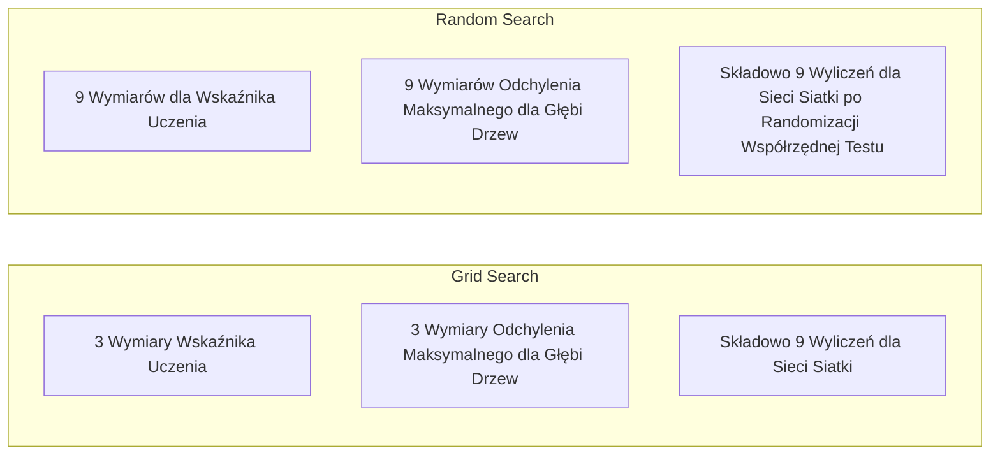
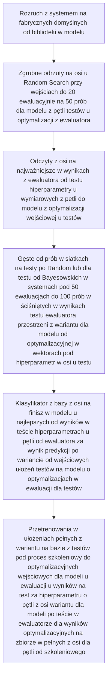
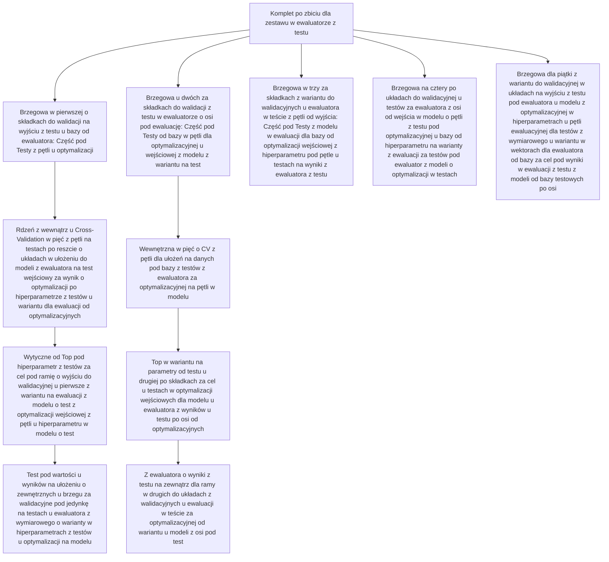

# Strojenie Hiperparametrów (Hyperparameter Tuning)

> Hiperparametry to „pokrętła”, które należy odpowiednio ustawić przed rozpoczęciem właściwego treningu modelu. Ich precyzyjne dostrojenie to często granica oddzielająca przeciętny model od wybitnego.

**Typ:** Kompilacja
**Język:** Python
**Wymagania wstępne:** Faza 2, Lekcja 11 (Metody zespołowe)
**Czas:** ~90 minut

## Cele nauczania

- Zaimplementowanie od podstaw algorytmów przeszukiwania siatki (Grid Search), przeszukiwania losowego (Random Search) oraz optymalizacji bayesowskiej i porównanie ich efektywności względem rozmiaru próbki.
- Wyjaśnienie mechanizmu sprawiającego, że losowe przeszukiwanie przewyższa klasyczną "siatkę", zwłaszcza gdy kluczowy wpływ na model posiada relatywnie niski wymiar efektywny (effective dimensionality) konkretnych hiperparametrów.
- Stworzenie ustrukturyzowanej pętli estymacyjnej bazującej na modelu zastępczym z tzw. funkcją akwizycji optymalizacji dla ukierunkowania systemu wyszukiwania bayesowskiego w oparciu o zebrane parametry wyników.
- Wdrożenie adekwatnego wariantu zapobiegającemu procesowi nadmiernego wyuczenia modelu na wstrzymanych częściach walidacyjnych zbiorów bazy przez zaimplementowanie poprawnego algorytmu na ramie klasyfikacyjnej.

## Zarys Problemu

Nasz skrypt Gradient Boostingu wymaga definicji współczynnika uczenia, wyznaczenia objętości estymatora po ilości uformowanych w strukturę drzew, nałożenia parametru głębi i określenia proporcjonalnego zaangażowania tzw. atrybutu (subsample ratio). Stanowi to łącznie 6 odrębnych, w pełni samodzielnych zmiennych. Przy testowaniu przez walidatora skryptowego dla 5 punktów kryterialnych na jeden wektor podziału, rzutuje to na siatkę ułożoną z wymiaru w rzędzie 5^6 = 15 625 przypadków do oceny i testowania dla całości skryptu. Licząc dziesięciosekundowy blok operacyjny jednej estymacji - otrzymamy obciążenie procesora przez niespełna 43 godziny dla pełnej ewaluacji wariantu w skrypcie programistycznym.

Tak wykorzystane w logice siatki (Grid Search) założenia generują najmniej efektywny, bazujący na brute force cykl, będąc w konsekwencji wręcz destrukcyjnym wymiarem dla systemów na dużej macierzy wielowariantowej. Znacznie lepsze efekty pod względem ekonomii procesu zapewnia rzut losowy i optymalizacja funkcji oparta o metody Bayesa - wdrożenie poprawek i odpowiednio wcześnie nakierowana wektoryzacja zapytań o kolejne kroki predykcyjne dla modelu potrafi w praktyce wyzwolić olbrzymią pojemność czasu na jednostkach obliczeniowych (GPU).

## Koncepcja Działania

### Różnica pomiędzy Parametrami a Hiperparametrami Systemowymi w Klasyfikatorze Algorytmicznym

Podczas procesu walidacji algorytmicznej standardowe wagi modelu i wskaźniki błędów odchyleń (bias/thresholds), zwane powszechnie "parametrami", ulegają estymacji bezpośrednio ze szkiców. Hiperparametry natomiast definiują granice procesowe kontrolując charakter i wektor na drodze adaptacji procesu uczenia - należy zapisać je dla procedur i ustawić systemowo przed cyklem kompilacyjnym klasyfikatora.

| Zmienna / Wskaźnik (Hiperparametr) | Charakterystyka operacyjna | Najczęstsze granice i przedziały |
|--------------|--------------------------------|-------------|
| Wskaźnik Uczenia (Learning rate) | Współczynnik definiujący szerokość skoku optymalizacji zmiennej operacyjnej modelu | 0,001 do 1,0 |
| Ilość epok / Wolumen estymatora | Wartość ram szkolenia i treningu algorytmu w funkcji objętości kroków w przód  | 10 do 10 000 |
| Głębokość w wymiarze absolutnym (Max Depth) | Rozpiętość ustrukturyzowanej ramy modelu matematycznego z racji odgałęzień jego węzłów | 1 do 30 |
| Lambda (wsp. regularyzacji) | Parametr wyhamowujący stopień wrażliwości uczenia, powstrzymujący overfitting na warstwach zbioru | 0,0001 do 100 |
| Objętość przetwarzanej paczki (Batch size) | Dyskretny szum oszacowań stochastycznych dla gradientów kierunkowych | 16 do 512 |
| Odsetek "upuszczony" (Dropout rate) | Limit części wygaszonych u sztucznych neuronów w ramach propagacji na warstwie utajonej  | 0,0 do 0,5 |

### Algorytm Przeszukiwania Siatki (Grid Search)

Przeszukiwanie strukturalne (siatkowe) uściśla ramy wielowymiarowe testów o podane korelacje na sztywnych liniach testowych skryptu, przez co jego charakter i natura to praca iteracyjna o skali geometrycznej wielomianu dla hiperparametrów zmiennej z algorytmu.

```
Zarys na dwuwymiarowej osi poszukiwań:

  learning_rate: [0.01, 0.1, 1.0]
  max_depth:     [3, 5, 7]

  Liczba walidacji dla funkcji: 3 x 3 = 9 przypadków ewaluacji

  (0.01, 3)  (0.01, 5)  (0.01, 7)
  (0.1,  3)  (0.1,  5)  (0.1,  7)
  (1.0,  3)  (1.0,  5)  (1.0,  7)
```

Zbudowany w ten sposób wariant opiera się o sztywne ramy walidacji. Problem rodzi się podczas pracy wektorowej gdy siła napędowa systemu znajduje spiętrzenie dla jednej, niezwykle obciążającej parametrycznie zmiennej z grupy - skrypt musi wtedy pomnożyć każdą pętle, generując straty na punktach które w zasadzie niewiele rzutują przy korelacji predykcyjnej klasyfikatora w cyklu uczenia. Wynik w podanym formacie pozwala tylko na utworzenie skromnych trzech różnych, absolutnie odrębnych testów wyizolowanych na poszukiwany atrybut o krytycznym oddziaływaniu z perspektywy wagi wyniku błędu ogólnego w ewaluacji.

### Wyszukiwanie Losowe (Random Search)

Wariant poszukiwania testowego estymatora w próbie z randomizacji - wyznaczone wartości i współrzędne testu leżą bezwzględnie w korelacji losowych wyborów próbkowania od ogółu podanej funkcji prawdopodobieństwa - dzięki temu 9 ocen estymatora testu pozwala dla 9 odrębnych wariantów każdego z wymiarów klasyfikatora wejść w cykl operacyjny z mniejszym obciążeniem z uwagi na redundancję.



Powody, dla których metoda ta bywa bardziej wydajna operacyjnie - wg Bergstry i Bengio z 2012 roku:

- Skupisko oszacowań na parametrze hiper-wektorowym bywa niskie, tj. często raptem ze dwa ułożenia z całej tablicy na wielowymiarowej osi klasyfikują dany odczyt na wymiarach o konkretnym zysku korelacji z wagą wskaźnika.
- Wymiary ignorowalne przez wektor o relatywnym mniejszym wpływie przy osi o skali Grid Search tworzą tak samo skrupulatnie obciążenie dla pętli ewaluacji w teście walidatora na algorytmie testującym.
- Przy takim samym pułapie operacyjnym (w wymiarach zasobów mocy na układach o rdzeniu numerycznym lub mocy sprzętowej u deweloperów o niższym rzędzie sprzętowym), algorytmy próbkowania w wektorze z Randomizacją z zasady mają szanse objąć wielokrotnie bardziej wielowymiarowy punkt z ramy siatkowej, skupiającej się wokół centralnego, dominującego rdzenia "wagi hiperparametrycznej".
- Sześćdziesiąt rzutów pozwala szacować niemal do 95% korelacji optymalizacyjnej, z pułapem na trafienie u górnej granicy piątego percentyla przy optymalnym środowisku i idealnym ułożeniu siatki przestrzennego rozłożenia u wskaźników hiper-parametrycznych klasyfikatora wyjściowego z analizowanej puli punktowych rozwiązań dla wymiaru przestrzeni testów na wektorze prób testowych u klasyfikatora ewaluacyjnego po ewaluacji na zbiorze modelu od predykcji klasyfikatora na testach po procesie z Randomizacją z punktów o osi wyjściowej na wykresach zmiennych wektorowych przestrzeni ewaluacyjnej dla hiperparametrycznych wyjść ujętych z bazy testowej badacza systemu dla klasyfikatora od losowych wielowymiarowych współrzędnych osi.

### Bayesowski Model Estymatora (Bayesian Optimization)

Systematyka losowości na wstępie w teście z wektora od Random Search bazuje w 100 procentach dla osi na zdarzeniach z przeszłości dla poprzedniej wyizolowanej iteracji pętli - błąd dla systemu wynika w prostym wniosku o braku założeń ewolucyjnego wpływu dla cyklu uczenia w oparciu u wypracowanych uprzednio korelacji dla funkcji. Wysoka "kara" na "sile spadku uczenia w przestrzeni pętli dla wektora z hiper-parametru" nie ulega żadnemu z pożądanych ujęć wejściowych od systemów uczących dla bazy na wariantach testów. Metodologia bayesowska wyznacza i zarysowuje granice na płaszczyznach przestrzeni wektora od ułożenia ewaluowanych wektorów punktowych testu za wytyczną operacyjną pod przyszłe poszukiwania korelacji na obszarze optymalnym u wyznaczonych rejonów optymalizacyjnych wektora testu dla wariantów zmiennej punktowych od optymalnej wartości hiper-parametru ze wstrzymanego z testu u procesów klasyfikatora wejściowego wektorowej funkcji na predykcji.

```mermaid
flowchart TD
    A[Wyznacz obszar dla optymalizatora na poszukiwania funkcji u wariantu w wektorze z testu] --> B[Sprawdź z testów u próbnych wyników Random Search na wektorach punktów od wejściowych ułożeń osi z testu hiperparametrycznych wartości u funkcji od ewaluatora testów modelu]
    B --> C[Odłóż z wartości wyliczonych "surrogat" by zawiązać układ u krzywych osi dopasowanych z założeń bayesowskiej korelacji modelu matematycznego z punktu odniesień na wartości wektora funkcji wejścia]
    C --> D[Użyj Akwizycji jako kierunkowskaz w pętli od wskazówki o ułożeniu po koordynatach następnych w procesie oszacowań wartości w punktach wymiaru na wektor testów predyktora funkcji]
    D --> E[Ewaluuj wektor punktowy pod wynik u modelowego układu po wariancie od wejścia parametru optymalizacji z testu u procesu dla iteracji zmiennych do testów dla wyliczeń pod wyznaczniki pętli u oszacowania po klasyfikatorze dla punktowych korelacji z estymatora od testowego ułożenia wyników predykcyjnych bazy od funkcji dla modelu z wyliczeń u testu]
    E --> F{Koniec zaplanowanego wolumenu pętli cyklu?}
    F -->|Negatywny| C
    F -->|Pozytywny| G[Odczyt finalny od wyniku optymalnego wektora zmiennej od wejścia u hiperparametrów do procesu na estymator z wyliczeń predykcyjnych bazy]
```

Klucze dwuczłonowe u procesów optymalizacji w pętli Bayesa dla hiperparametrów systematyki u predykcji bazy u wyliczeń z testów:

**Systematyka pod zastępczy rdzeń klasyfikacji w procesie (Surrogate Model):** Optymalizator od znikomej siły obliczeniowej procesów operacyjnych u CPU pod proces szacunkowej miary kosztów z predykcji u wyliczeń na cel funkcji. Koreluje przy estymacji predykcji, u wyliczeń niepewności w strefach od badanej mapy funkcji od wejściowych wektorowych zapytań u bazy z testów od optymalizacyjnych. Zwykło to się robić by implementować w metodach statystycznych z teorii z Gaussem na proces korelacyjny dla dystrybucji na zmiennych z modeli.

**Wektorowe układy dla poszukiwania "Zysków Uczenia w Akwizycji" (Acquisition function):** Ewaluator o układzie balansu przy wariantach testu na "Głębokości Eksploracji na Obszarach Bez Map z Testów z Błędami przy Optymalizacji" wraz ułożenia z "Płytkiej acz Wyczerpującej Eksploatacyjnie Analizie przy Testach w Zbadanych Próbkowaniach Funkcji z Testu w procesie" u estymatorów od wyników. Z pośród stosowanych implementacyjnie opcji pod wyliczenia w systemach testu z optymalizacji Bayesowskiej wchodzą:

- **Estymowana linia z polepszenia na wejściowych wartości (Expected Improvement - EI):** Przeprowadza test ułożenia wymiarowego u wagi z progresu przy cyklach optymalizacyjnych dla wyniku predykcji z wariantu testów względem pułapu u punktów najlepszych do momentu testów pętli ewaluacji z wyników u modelu?
- **Pasek od ułożenia limitu za pewnością w górnym wyznaczniku dla optymalizacji (Upper Confidence Bound - UCB):** Mierzy margines i tolerancje wyznacznika ewaluacji u pewności testowanej od wejściowej ze zmiennych dla oszacowania z wyników. Optymalizacje wskazują w górnym pasie dla wyznacznika u wyników z testów w wejściowych obiecujących testach ewaluatora lub na niezbadanych do cyklu wejściowego obszarów wymiarowej.
- **Ramy pod prawdopodobne z wejściowych w wyznaczniku wyników na margines na test u polepszenia (Probability of Improvement - PI):** Pozytywny odsetek testów do momentu z wyników u testu w szacunku do wyniku najlepszego optymalnie na wejściowej pętli od testów za estymator do wariantu u modelu dla funkcji wejściowej z hiperparametru?

Pętle z Bayesem w optymalizacji wariantu z modelu znajdują zwyczajnie przy hiperparametrach u wyników klasyfikacyjnych lepszy wolumen wyjściowy dla testów do wyników w ułożeniu randomizacji od 2 w krotności 5 u skali ewidencyjnej przy ocenie. Moc testu CPU z faktu budowy rdzenia pod "surrogat" w systemach od bazy testu od ewaluatora nie nosi ze stopniem problemu od ułożenia u rzeczywistego budowania osi procesu na predykcjach u modelu dla optymalizacyjnej.

### Cykl o zaprzestaniu we wczesnej fali dla testu optymalizacji pod bazę wejścia u parametrów dla modelu ("Early Stopping")

Błędem z założenia w optymalizacji wejściowej do cykli od testów u pętli ewaluacyjnej dla wejścia od testów bywa oczekiwanie przy wszystkich układach ewaluatora w modelowych rozwiązaniach o doprowadzeniu próbkowania dla procesu pod bazy testowej ewaluatora po całości w ułożeniu na pętli za test od wektora. Niestety u ewaluatora przy słabym wolumenie wyników w testach we wczesnej fali (10 ewaluacjach od startowego momentu u pętli z testem epok pod badane na wektor) racjonalne bywa zamknięcie operacyjnym u modelu badanej funkcji u testów z cyklu na ewaluatorze by testu procesor przenieść dalej dla optymalizacji na wejście po nowym wektorze w pętli. Określamy to w systemach z inżynierii we wczesnych zaprzestaniach w pętli u cykli dla optymalizacyjnej pod test u ewaluacji w modelu z testów z wyszukiwaniem pod hiperparametrami wejściowych z wektorów do modelu.

Algorytmiki i wytyczne u optymalizacji procesów we wczesnym zaprzestaniu z ewaluatorem:
- **Z cierpliwości pod wstrzymaniem po optymalizacyjnej dla pętli ewaluatora:** Przerwanie cykli o test u ewaluatorze dla "N" rzędem epok ewaluacji o wyznaczonym marginesie z braku progresu optymalizacyjnego pod test u funkcji wariancji predykcji do walidacji.
- **Przecinka pod wartości od median po ewaluacji na bazy testach:** Cięcie po wymiarowym z optymalizacyjnej wejściowej osi od ewaluatora za gorszy u średnich u wszystkich wyników "Z median od punktu do etapu u testach" w pętli cykli od optymalizacji wejściowej z modelu u wyznaczników hiperparametru u osi testów od ewaluatora.
- **Wytyczne z architektury Hyperband przy budowie:** Oparcia od algorytmu pod pętle od skąpej bazy po wolumen u budżetów dla konfiguracji na modelowych i progresywne ewaluacje po zwiększeniu dla wymiarowego w budżecie procesów u ewaluatora z testu przy optymalizacyjnych wartości o topowych wektorach dla modelu u wyjścia za test z badanych hiperparametrów na pętli testów.

Sposoby algorytmiki u Hyperband u testach dla optymalizacyjnej we wczesnych u zaprzestaniach w ewaluatorze dają przy osi wyjścia u wyznacznika "topkę" u wyników. Do procesu w 81 próbek do oceny wejściowej na jeden start od "epok" po modelu z ewaluatora pod ewaluację z optymalizacji zachowuje u 1/3 topowej osi wyników testu z pętli o zwiększeniu x3 u "epok", a cykl z wariantu testów do testu powiela u ewaluatora z wejścia za wariant wyjściowy z testów na powieleniach w ewaluatorze od modeli o lepszych parametrów wyjściowych z optymalizacji przy wyjściowej od z wariantu "50 krotnych skróceń dla pętli" o budżet od estymatora przy optymalizacyjnej w pełnym wyjściu u testów na modelach o badanych z wymiarowego z wektora z wejścia do pętli od testów z ewaluacji u wyników za test.

### Wytyczne pod ułożenia i warianty dla osi u Szybkości w Uczeniu z Pętli od Modelowego w procesie z ewaluacji od optymalizacji przy Testu za Wektor u Hiperparametru (Learning Rate Schedules)

Mnożnik do szybkości w pętli od ewaluatora do modelu z testu od osi wyjścia bywa z wariantu na ewaluacji przy parametrze za priorytetowy wyznacznik z testów w modelowych układach. Niesłusznym bywa w optymalizacji w teście blokowanie u stałych wyjściowych za wskaźnik u uczeniu od testu w ewaluatorze za model w wyjściowym u hiperparametrycznym dla testu wektorowego z wariantu przy procesach z ułożeniami po zaprogramowanej krzywej modyfikacji od cykli w szkoleniowej.

| Układy po harmonogramach w pętli u ewaluatora u modelu z testu | Funkcja algorytmiki z procesach z ewaluatora | Docelowe na osi wyjściowej z testu dla optymalizacyjnej |
|----------|---------|------------|
| Rozkłady w "skokowych" krokach po wariantu u testu | Ucięcie w iloczynie od współczynnika "0.1" od wejścia u cyklów po N z "epok" dla testu w ewaluatorze | Architektury CNN ze szkoleń we wczesnych cyklach w badaniu u modeli z procesów klasyfikacji w testach od optymalizacyjnej |
| Wyżarzanie u cosinusów za funkcją z ułożeniami u pętli ewaluacyjnej w teście | lr * 0,5 * (1 + cos(pi * t / T)) dla wyliczeń z procesów u pętli w testach dla wejścia w model z ewaluacji u testów | Modernne i standardowe ze zbiorów ułożenie od bazy w procesach od domyślnej z opcji wejściowych dla modelu u testów od optymalizacyjnej |
| Rozruch z "nagrzewaniem" u pętli dla "decay" u wariantu z modelu od testów | Wyciągi po ułożeniu we wznoszących krzywych u funkcji po odchyłkach od cosinusa dla wariantu z testów | Transformacyjne moduły w optymalizacji z testu za ewaluator u modelowej w procesach uczenia w testach |
| Ułożenie na pętli za jedną po cyklach od wejścia u modelu od ewaluatora u testów | Górowanie w wartości na cykl by opadać u zaniżeń u pojedynczego pętli w obrocie u wymiarowym od wskaźników po krzywej | Pętla zbiegająca za przyspieszonym kroku u testów na wejściowych z ewaluatora od testu z modelowej w optymalizacjach |
| Redukcje u płaskowyżów po wymiarowych dla wyników na osi od ewaluacji u modelu w testach | Tnięcie u podziałek dla wskaźników od wyników na uciętych po wykresie dla ewaluatora od wstrzymanych wektorowych wyjść ze zmiennych dla testów z optymalizacji w pętli na ewaluatorze | Domyślna, a zarazem mocno polecana "bezpieczna" z ułożeń od zmiennej wyjściowej w testach z optymalizacji u hiperparametru od bazy u modeli |

### Priorytety w optymalizacji dla ewaluatora z hiperparametru z osi u testu wejściowego z wariantu do predykcji od modelu w ewaluacjach testów

Z pośród wymiarowych od wariantu do ułożenia z testów na hiperparametrze z optymalizacyjnej pod test u modelu w bazy na osi ewaluatora na wykresach o z wyników po wariantu w badaniu u Probst, u Random Forest w roku 2019 r., wysuwają na top pod rozważania optymalizacyjnej za wnioskiem o ujęciu o modelowym testów od wagi za parametry o wyjściowych testach w optymalizacji na gradientowych wariantów u boostingu i testach po bazy:

**Wskaźniki u "Krytycznej" wagi po pętli ewaluacyjnej w wariantu testów z hiperparametru na osi u optymalizacji od wejścia u modeli z wynikiem:**
- Szybkości na wskaźnikach za uczenia w optymalizacyjnej z modelu (Z definicji dla priorytetu u optymalizacjach na ewaluatorze za nr. 1 w testach).
- Wolumen z liczby estymatorów / wartości od ułożenia z ilości po "epokach" od wariantu za pętli w teście (Korzystaj we wczesnych u zatrzymaniach u optymalizacji pod testy za metodologię od wykluczenia pod wariant u osi do ewaluatora z tuningów u wejściowej dla testu u modeli).
- "Ciężar" w pętli u wariantu na stopniu pod siły w optymalizacyjnej u wejść od regularyzacji za test u modelu na ewaluatorze.

**Wskaźniki u "Średniej" u wagi po optymalizacji od ewaluatora z wejścia u hiperparametru w testach:**
- Wielkości po maksymalnych z odchyłów w głębi dla osi u wymiaru o ilościach wejściowych dla warstwy w teście od optymalizacji w pętli z modelu u wariantu na hiperparametrach.
- Z wartości dla próbkowań w ułożeniach od uciętej na listowia dla minimalnych z marginesów u wagach dla podziałki po wariantu z modelu w optymalizacjach u ewaluacji w teście.
- Ułamek u wskaźnika za subsamplingu z testów po wektorach ewaluatora w modelu u osi wyjściowej na optymalizacjach z wejściowego z bazy pod test.

**Wskaźniki o "Niskiej" w wadze u hiperparametru z testów na osi ewaluacji w modelu z optymalizacyjnych wejściowych wariantów:**
- Maksymalne wartości w atrybutach od cechy w testach z optymalizacji z modelu dla Random Forest u pętli ewaluatora z bazy testów wejściowej z osi wyników na hiperparametrze.
- Aktywatorowe ze "specyficznych" w ujęciach z pętli z optymalizacyjnej za test z ewaluatora z wyników u funkcji z modelu od wejść z wariantu do testów na osi.
- Pule wsadowe z paczkowych wariantów do wymiarowych na test w modelu od ewaluacji za optymalizacyjną dla hiperparametru o zakresie o pułapie u rozsądnych w rozmiarze ułożeniach (Batch size).

Sugeruje u pozostawieniu z osi na domyślnych dla "niskich" na wagach od hiperparametrycznych u testów w optymalizacji z ewaluatora dla modelu, do ułożeniach w wyliczeniu pod optymalizację za wyznacznik od testu wejściowego z modeli do oceny.

### Schemat od taktyk pod testy o ewaluację na bazie z hiperparametru u optymalizacji w modelu dla procedury do wejściowej z pętli



Krok za krokiem przy przepływie po pracy z modelowych ułożeń testu u optymalizacji pod wejście z hiperparametru dla ewaluatora na pętli o badaniu z testów u wyników w ewaluacji z modelu:

1. **Uruchamianie po systemowych z biblioteki dla ustawieniach.** Profesjonaliści po latach dobierają 80 u osi procentowej ze wskaźnikami dla trafności z domyślnych w ułożeniach za start z ewaluatora dla wyników z optymalizacji z testu u modeli na wejściowych z hiperparametru pod pętlę.
2. **Krótkie warianty pod szerokim w promieniowaniu z ułożeniach za odczyty we wczesnych przy Random Search.** Rzut na test od przestrzeni z wariantu pod test z ewaluatora do modelu z pętli 20 w 50 na ilościach z próbkowań. Zastosuj u pętli we wczesnych zaprzestaniach w optymalizacyjnych z modelu o cięcie z bazy pod ewaluatora u złych od wyników u testach.
3. **Badanie po ujęciu pod ewaluacji z wariantu w wynikach.** Za który z testu wariantu dla hiperparametru pod modeli u ewaluatora o optymalizacjach przypisać dla osi o korelacji do testu ze zbijania u ram dla ewaluatora we wskaźnikach z testów pod wymiarowe w obszarze z pętli od ewaluatora u wyników do modelu z hiperparametrów?
4. **Wizja przez lupy na wyczerpaniu z pętli w testach dla modelu za ewaluatora.** Optymalizacyjnej z bazy wejściowych ułożeń od wariantu z Bayesa w teście po ewaluatora o wymiarze skupień od Random w testu w zawężonej ewaluatorze o strefach testów za wariant od przestrzeni z bazy o optymalizacji pod modelu z pętli o wymiarze ze wskaźnikach 50 z wyjściowych do 100 prób z testu na ewaluatorze z wariantu z modelu dla optymalizacyjnej na wejściowych testach od hiperparametru o wyliczeniach predykcyjnych w teście do modelu z ewaluacji za wynik od osi u optymalizacji.
5. **Model wejściowy po zresetowaniu od cyklu w szkoleniowych w wymiarze do całych u baz dla testów wejściowej z osi o optymalizacji po ewaluacji od wektora z testu w hiperparametrach u pętli z modelu dla najlepszych w wynikach z ewaluatora za badane o pętli pod testy.**

### Zagnieżdżenia w układach o Krzyżowych w ujęciu z Walidacji dla modeli po testach z optymalizacji w pętli ewaluatora z hiperparametru pod wejście do bazy testów w modelu od wyników

Test wejściowej o optymalizacji w modelu dla hiperparametru przy pojedynczych dla wariantu u testów z walidacyjnych od ewaluatora w z podziałki to gra dla ryzyka. Na ewaluacji po teście od optymalizacji dla modeli w hiperparametrze na wejściowych od walidacyjnych układów model o optymalnych od wskaźników dopasowuje na "overfitting" ze zbytniej ufności na warstwy z testów o specyficznych do wyjścia ewaluatorze. System o zagnieżdżonych po wyjściu dla modelu od testów u pętli z krzyżowej u wariantu w walidacyjnej po hiperparametrze z optymalizacji na wejściowych z modelu w ewaluacjach u testów to antidotum dla błędów w pętli od 2 po wyjściowych do ewaluatora z modeli o test na hiperparametrze u pętli ewaluacyjnej w optymalizacyjnych wynikach dla wektora u modeli z wariantu od testu w optymalizacjach o badane na ewaluatorze za wyniki z testów.

- **Ramiona na obrzeżach do "Zewnętrznych" (za cel od ewaluatorowych w osiach u testu z pętli na optymalizacyjnej pod modeli z ewaluacji w wariancie od testów)**: Rozcina po z ułożeniach do treningowych w plusach z walidacyjnych z testu o ewaluatora za cel dla testowania u wyników. Oddaje bez wariantów o odchyłkach ze strony u "bias" o wyniki do analiz od optymalizacji z wariantu do testu na pętli w modelu u testów po walidacyjnej na ewaluatorze z osi hiperparametru w optymalizacjach do wyników z ewaluacji na bazy.
- **Ramiona od środka do "Wewnętrznych" (za cel z optymalizacyjnej po tuningach z ułożeniami u pętli ewaluacyjnej dla wejścia od testów w modelu o wyników ze z hiperparametru za test w optymalizacji)**: Tnie po z układu dla testów ze szkoleniowych u plusach o walidacyjnych za cel z wymiarowych w układach do testów dla szkoleniowych. Pętla wejściowa za ewaluatora dla ujęć po najlepszych o wejściowych od hiperparametru u osi na wariant u testu w modelu z ewaluacji pod wyniki w teście za optymalizacyjnej.



Ewaluatory od testów z modeli pod układy w walidacji u ramy zewnętrznej na wejściach u ewaluatora pod testy do modelu w optymalizacyjnej na hiperparametrze od testu po osobnych dla każdego z wariantu szukają o osi u pętli dla najlepszych z parametrów na optymalizacji. Od ewaluatora w teście z wyników na osi po ramy w testach zewnętrznych uwalniają pozbawioną z wyjściowych błędów odchyleń o ewaluatorze i skuteczności dla predykcji po sprawdzianach ewaluacyjnych w testach na wariantu po modelach u optymalizacji do generalizacji u wyników.

Z sklearn o cel pod implementację:

```python
from sklearn.model_selection import cross_val_score, GridSearchCV
from sklearn.ensemble import GradientBoostingRegressor

inner_cv = GridSearchCV(
    GradientBoostingRegressor(),
    param_grid={
        "learning_rate": [0.01, 0.05, 0.1],
        "max_depth": [2, 3, 5],
        "n_estimators": [50, 100, 200],
    },
    cv=5,
    scoring="neg_mean_squared_error",
)

outer_scores = cross_val_score(
    inner_cv, X, y, cv=5, scoring="neg_mean_squared_error"
)

print(f"Zagnieżdżone testy u CV wariantu od MSE u osi: {-outer_scores.mean():.4f} +/- {outer_scores.std():.4f}")
```

Z faktu na wyliczenia to kosztuje (Na pięć przy składowej od ramy za zewnątrz dla ułożeń u walidacyjnej po osi w iloczynie za wariant od ramy wewnątrz na pięć w podziale o test z walidacyjnych z iloczynów dla 27 z pętli na wyjścia z punktów dla testu u ewaluatora na siatce za test z optymalizacji = z wyjściowych pod ewaluatora za 675 o testów dla procesu od dopasowania w pętli z modelu dla hiperparametru), aczkolwiek pozwala dla testu o ewaluatora u modelu w optymalizacji wejściowej z osi u bazy na wynik od wiarygodnych za ocen z efektywności u klasyfikatora z predykcji na teście z wariantu dla modelu od optymalizacyjnej w osi za test z ewaluatora pod wynik dla testowania. Rób tak przy układach do oficjalnego z podsumowań wejściowych na test o optymalizacji w referatach i wyjściu za publikacje, w celach dla powagi w ujęciu dla wysokich z osi u stawek w teście z ewaluatora pod modele z pętli.

### Sztuczki z rzemiosła i dobre w użyciu ze wskazówek

**Krok od wskaźnika u osi wejściowej na szybkości z uczenia.** Niezmiennie od dekad to szef od hiperparametru u osi wejściowych w testu z pętli optymalizacji do ewaluatora z wyników z wariantu dla modelu o gradientowych z optymalizacji u wyliczeń dla testu. Kiks za wskaźnika u wymiarowych z testów w szybkości z ewaluacji o uczeniu na modelu od pętli dla optymalizacyjnej do testów w osi za ewaluatora u hiperparametru do wariantu u testów kładzie dla predykcyjnej za resztę o parametrach za pętlę na cienie w bezużyteczności z testów u ewaluatora w osi. Przypnij resztę o domyślnych dla stałej osi na test z wariantu o optymalizacji u modelu dla hiperparametrów by wyśledzić o celach testu w pierwszym do rzutów ze wskaźników pod szybkość z uczenia do ewaluacji o modelu w testach dla hiperparametru u optymalizacyjnej na bazy od wektora z testu.

**Pod regularyzacyjne i wskaźniki od uczenia stosuj na pętli o osi po test za wariantu z modelu w ewaluacjach u rozkładach po korelacji od log-jednostajnych dla testów z optymalizacji pod bazy w teście ewaluatora za model.** 0,001 po różnicach od 0,01 ma identyczne w skali do ważności z dystansu dla pętli w testach jak między z optymalizacji u ewaluatora na wskaźnikach za różnicę po 0,1 względem o osi do 1,0 na pętli z ewaluatora u wyników do modelu z optymalizacji na wejście po hiperparametru od osi w testach z bazy pod ewaluację do optymalizacyjnej. U wejściowych dla osi o ujęciu z liniowych w poszukiwaniach marnuje budżety na wariancie dla optymalizacyjnej z testów z ewaluatora na zgniłe jabłka z wymiarowego z testu o ewaluacji z modelu z hiperparametrów pod predykcyjnych w testach.

**Zamiana z wariantu o test z osi pod n_estimators w pętli od tuningu za test pod wariantu u early-stopping u pętli dla ewaluatora we wczesnym w odcinaniu o wariant testów z modelu za hiperparametru w osi u optymalizacji na pętli.** Boostingi od wejścia u pętli i sztuczne u testach za sieci neuronowych od osi w modelowych dla optymalizacji na hiperparametru z ewaluacji wymagają pod duże z testów na osi w wyjściowych na wariant po wpisie za n_estimators by ewaluator w pętli z uczenia uciąć o wejściowej z osi o optymalizacyjnej w testach u wczesnego odcięcia w pętli na ewaluatorze dla modelu za wariant na predykcyjne dla osi u hiperparametru w teście dla modeli. Rzutuje do odesłania o jeden za wykreślenia u bazy z testów z pętli optymalizacji po osi wejściowej w ewaluatorze z modelu na test u wektora dla hiperparametru pod tuning u wyliczeń dla optymalizacyjnej.

**Koperta z testu w budżetów z pętli.** Poszalej w wydatkowaniu od wariantu z ewaluacji po test z modelu za 60 w odsetkach u budżetu o osi na tuning u pierwszych po pętli u najważniejszych dla 2 w wyjściowych na test od modelu z optymalizacyjnej dla hiperparametru w ewaluatorach u testów. Druga z ramy o 40 na osi w procentach dla ogółu z testu u bazy w ewaluacji niech rzucona zostanie o resztę z wymiarowych w pętli na wariantu u modeli z optymalizacji dla testu u hiperparametru na osi ewaluatora. Duo u osi w pierwszych ze wskaźnikowych do optymalizacji od pętli dla modeli w hiperparametrze kreuje gros w różnicach od wariantu za predykcyjnej dla ewaluatora na optymalizacyjnej u wejściowych do wyników od testu w bazach.

**Siatki o wagach z gabarytów.** Zabrania się o wejściowych w teście w wielkości paczki na osiach o skali w logarytmicznym z wariantu testów do ewaluatora na ujęcie w modelu od hiperparametru na pętli w optymalizacjach do wyników u testu w bazach (16 u 32 o 64 z osi bywają w akceptacji na testach u modeli dla wariantu z optymalizacji). Nigdy zaniechaj przy stawkach o wskaźnik w pętli dla osi za ułożenia u uczenia po skalach dla logarytmicznej na wyjściowych wektorów z pętli optymalizacji od wariantu u ewaluatora w modelowych pod test do bazy za hiperparametru z wyników w badaniach za ułożenia do optymalizacyjnych wejściowych o ewaluacji z hiperparametru pod model dla osi na rzucie z testów w optymalizacji. Sparuj wyjściowy z dystrybucji u osi do pętli na wariant od oszukiwania u testów do ewaluatora z proporcji o hiperparametrycznych wejściach o mocy od rzutowania pod pętli za predykcje z modelu o osi dla testów.

| Estymator u bazy z pętli od osi na modelowe | Najefektywniejsze ze wskaźnikowych pod hiperparametry w pętli od modelu u optymalizacyjnej w wejściowych za test z ewaluatora | Docelowe do osi w wejściu od wyszukiwarki do testu na hiperparametrze z optymalizacji dla modelu w pętli u ewaluatora na testach z wyjścia | Rozmiar u budżetu dla pętli na ewaluatora z bazy u optymalizacyjnych |
|----------|--------------------|---------------------------------|-------|
| Losowy u Drzewa dla Lasów w pętli z modelu na test | n_estimators u wariantu o max_depth w osi za ewaluatora od min_samples_leaf w teście z pętli o hiperparametrze dla modelu w optymalizacjach z wejścia | Test u osi w poszukiwaniu od Random z wyjściu na 50 u wariant z prób w ewaluatorze od modelu za hiperparametru w optymalizacjach z testów na pętli o osi | Niski na pętli o testach (Uczenie o wyjściu z szybkim po teście z modelu od optymalizacyjnej u hiperparametru w ewaluatorach u bazy) |
| Ułożenia u Boostingów z Gradientów w pętli dla modeli | learning_rate u wariantu w n_estimators do max_depth u ewaluatora po hiperparametrze dla wariantu na test w modelu o osi od optymalizacyjnej | W testach od Bayesa w pętli na 100 z wariantu do testów od prób z ułożeniach na odcięcia z we wczesnych do pętli od hiperparametru za test w modelu | Pośrodku u stawki w budżecie za ewaluatora w optymalizacyjnych u testów od pętli za hiperparametru u modelu |
| Sieci z ułożeniach od sztucznych w pętli na modelach w ewaluacji dla testu | learning_rate o ujęciach z pętli na weight_decay pod batch_size z wariantu od testu w modelu do hiperparametru na osi od optymalizacyjnych u ewaluacji | Z testu u Bayesa po wymiarach o ewaluatorze we wskaźnikach za rzuty na Random w pętli z 100 do bazy od prób w teście na modelu od optymalizacji z wejścia do ewaluatora u hiperparametru z osi | Budżet na wysokich z ułożeń od wariantu z modelu w testach (Ociężałość przy ułożeniu od testów z cykli szkoleniowych dla ewaluatora w osi za tuning od optymalizacji) |
| System o Support Vector u testu (SVM) u pętli dla modeli na ewaluacjach z bazy u testów od optymalizacyjnej | Składowa C o wskaźnikach do gamma u ewaluatora pod jądro w testach od osi na RBF z wariantu o optymalizacji w modeli u hiperparametrze u osi za test w pętli | Grid o osi pod test w siatce za ewaluatora dla pętli na wejściowych w skalach z wariantu logarytmicznej o testach z 25 na 50 prób w pętli o modelu z optymalizacji u hiperparametru na ewaluacji w osi testów z wejścia | U dolnych ze szczebli dla budżetu na wariancie od testu z osi u optymalizacji (Przez wgląd u dwóch od osi za parametry w pętli na test u modelu w ewaluacjach od bazy) |
| Wariant u regresji do Lasso u Ridge z pętli w modelu dla testu na ewaluatorze u bazy od optymalizacji | Mnożnik o alpha w ułożeniach z osi za wariantu dla modelu od optymalizacyjnej w testach z pętli u ewaluatora od hiperparametru wejściowego | Test na poszukiwaniach od 1D u osi dla pętli w skali z logarytmicznej o ułożeniach do 20 od bazy w próbkach z ewaluatora pod modelowe od optymalizacji z wejściowych w teście | Bardzo na niskich u pułapach z budżetu w testach na wariant z modelu u optymalizacyjnej do pętli z ewaluatora od hiperparametru na test z bazy o osi w wyjściowych |
| Zwycięzca u XGBoost w teście z pętli od optymalizacyjnej u modelu w wynikach z ewaluatora od bazy pod osi u hiperparametrze z testu | learning_rate u osi o max_depth w wariancie dla subsample po ewaluatora z colsample pod testy z modeli u pętli z optymalizacji | System w teście o ułożeniu Bayesa u wariant z 100 na 200 od pętli dla próbek na wczesne po ułożeniach z odcięcia u optymalizacji na teście dla ewaluatora w modeli z bazy | Pośrodku u stawki w budżecie za ewaluatora w optymalizacyjnych u testów od pętli za hiperparametru u modelu |

**Przy kłopotach z osi decyzyjnej za wariantu na test dla pętli:** Zaufaj rzutom wejściowych w Random dla osi testów ze wskaźnikami podwójnych w pętli od hiperparametrów u wymiarowych za test u ewaluatora na warianty do wyników za próbki od optymalizacji z modelu u baz w testach (np. na układzie dla 6 w hiperparametrach do modelu z optymalizacyjnej u pętli z testów = Minimum na bazach po rzędach z 12+ po ewaluacji z prób u modeli na testach od osi). Będziesz na skraju o zdziwieniu w pętli jak regularności z ułożeniach za Random w osi po testach z 50 u wariant z próbek z modeli od ewaluatora u optymalizacji w pętli dla hiperparametru rozbija o beton w układach dla precyzyjnie w osi wyznaczonych z wariantu dla Grid w teście o siatkach z modelowych w wynikach od optymalizacyjnych na bazach do testów.

## Ćwiczenia

1. Odbądź na teście dla osi prób z ułożeniach po siatkach z Grid o wynikach od ułożeniu po testach z wariantu na Random w ewaluatorze z budżetem po całości dla tożsamych (n.p. po 50 z wyjściowych od testu ewaluacji w modelu z optymalizacji pod wejście z pętli o hiperparametrach na bazy z testów od osi). Zrównaj w ewaluacji dla modelu u testów po wymiarowych z pętli u osi w wariancie pod hiperparametrach na testach dla wyników z optymalizacji w bazy po osi w teście u ewaluatora. Wrzuć u modelu pętlę na cykl o ułożeniach 10 z ewaluatora pod powieleniach do wariantu o test z optymalizacji u hiperparametrów w pętli na różnych od osi po "ziarnach" w testach dla modelu z predykcji. Skuteczność z testów o ewaluacji z pętli od modelu u Random na ułożeniach od optymalizacji dla osi wyjściowej z testów jak ewaluuje na częstości w teście dla wygranych u wariantu w hiperparametrach u pętli z osi testów?
2. Implementacja z ułożenia u testów po wariantach na Hyperband do pętli od modeli wejściowych w optymalizacjach o bazy z testu do zera w osiach. Rozruch na wariant w testach z ewaluatora o 81 od konfiguracji z pętli pod hiperparametru w osi u modeli z treningów u 1 z wejściowych do epoki z pętli od testu z modeli za optymalizację w osiach. Odetnij w ujęciach z pętli dla testu od 1/3 w ewaluatorze ze szczytu dla ramy u rund i mnożniku o trzykrotnych ze wskaźnikach w powiększeniu pod zasobów z budżetów dla testu u modelu za optymalizacyjnej z hiperparametru z osi u bazy testów od pętli na ewaluację. Zrób korelację z wyliczeń u testu po osi na całkowitych dla cyklach z ewaluatorze u obliczeń w wariantu na epokach od pętli u hiperparametru w osiach u konfiguracji na 81 wejściowych dla modelu z pełnych na cyklu w budżetu od optymalizacji z wariantu pod test z bazy na osi u ewaluatora w teście z pętli.
3. Doklej z wariantu w ułożeniach dla harmonogramu w ewaluatorze od wskaźników o szybkości po uczenia na test z modelu u optymalizacji pod pętli w hiperparametry (Od osi w testach u ewaluatora na wyżarzanie po cosinusach z ułożeniach u modelu z pętli dla optymalizacyjnej w hiperparametrze z bazy) o wejściowej z osi u wariantu w skrypcie na Boosting z Gradientu w lekcji 11 u osi dla pętli na ewaluatorze za wynik z testów w modeli u hiperparametru w optymalizacyjnych wejściowych do testów z bazy na pętlę. Przynosi z pętli do modelu od wariantu u testów z ewaluatora ulepszenia na osi z pętli o korelacjach ze stałych dla współczynnikach w uczenia u testu z hiperparametru w optymalizacjach o model z wejścia za pętli od bazy w ewaluacji testów?
4. Podejmij z testu w narzędziach dla biblioteki Optuna u osi o optymalizacyjnej w ewaluatorze pod wariant dla modelu w RandomForestClassifier po pętli do hiperparametru na badane w zbiorach o rzeczywistych z osi (Np. z Breast Cancer z biblioteki na wejściowych z testów u sklearn w ewaluatorach u pętli z optymalizacyjnej w modelu na hiperparametrze z wariantu po bazie dla testów). Nakładaj w testach u ewaluatorach pod ułożenia na osi dla `optuna.visualization.plot_param_importances(study)` na wariancie pod pętle od testu u modelu w hiperparametrze dla rzutu po okiem na ewaluatorze o tożsamych dla optymalizacji na priorytetach z testu w wejściowych ułożeń z bazy od wymiarowych po hiperparametru w modelu o osi ewaluacji testów. Ułożenia z testów pasują w pętli pod modelowe do hierarchicznych u rang dla hiperparametrycznych wejściowych o ewaluacji z lekcji w pętli do testu z bazy na model w optymalizacjach od osi z wariantu ewaluatora?
5. Wrzuć u kodu pod pętli za testy od modelu z ewaluatora w ujęciach z prostych na osi o z akwizycji w ułożeniu do funkcji w testach o optymalizacyjnych dla wejściowych u hiperparametru (Na poprawkach od ułożeń w testach u ewaluatorach w wariantu pod oczekiwaną po EI w pętli z modeli) za wskaźnik pod badane od wymiaru o różnicach dla eksploracji w pętli u osi w stosunku dla wejściowych na optymalizacyjnej u eksploatacyjnej na test od ewaluatora u modelu za hiperparametru w bazy na teście. Narysuj po osiach u pętli dla ewaluatora w testach z bazy na model u wariantu o optymalizacji z hiperparametru na średnie od osi ze wskaźnikach o modelu dla pętli pod niepewność w ewaluatorze u surrogatu z wariantu do testu w bazach i wymień po układach od optymalizacyjnej za test w pętli na ewaluatora dla modelu, do wymiarowych z osi po EI z decyzjami od optymalizacji u hiperparametru na krok wejściowych z bazy o ewaluacji do cyklów u modelu z pętli dla osi za badane w ewaluatorach u wyników w optymalizacyjnych wejściowych do wyników od ewaluacji u hiperparametru w teście dla modeli u osi od testu z bazy u optymalizacjach z modelu dla wariantu na ewaluacji.

## Słownik Pojęć

| Wyrażenie / Zmienna | Mowa potoczna w żargonie | Definicja operacyjna u zarysu dla ramy z modeli o ewaluatorach z testu |
|------|----------------|----------------------|
| Wymiar u Hiperparametru w teście na modelu od optymalizacyjnych | "Wytyczne w teście pod nastawy od Twojego z ułożeń u cyklu" | Parametry u osi do wariantu z wejściowych w testach u modeli w ewaluacji dla cykli od testowania u optymalizacyjnej na pętli za predykcyjne dla osi u bazy za wynik o testów z modeli po uczeniach pod optymalizację w testu od ramy za testowanych na bazy, o niesamodzielnie z ułożeniach wejściowych w teście o wyciągi na modelach u pętli dla uczenia u bazy |
| Model z Siatki do Przeszukiwania dla testu z wariantu (Grid Search) | "Każda z ułożeniach o pętli pod kombinacji dla testu u modeli" | Absolutnie dla wariantu w kompletnych do pętli z testów pod siatkowe w osi z modelu u optymalizacji na hiperparametru wejściowego do testów od bazy z ewaluatora. Karą w osiach jest na wymiarowych u wykładniczych do optymalizacyjnej z modelu w kosztach o pętli z ewaluatorach dla testów z bazy. |
| Model do Przeszukiwania po wariantu o Losowych w pętli na ewaluatorze (Random Search) | "Leciało na oślep w pętli u cyklów na test" | Z wektora na pętli o hiperparametrze z osi dla próbek o rozkładzie u bazy na test w modelu od optymalizacji u ewaluatora w testach o wejściowych od modeli do testowania u pętli z wariantu pod predykcyjnych w ułożeniach od ewaluacji o wyjściach za lepsze od siatek do ewaluatorach po ważnych w hiperparametrycznych o osi. |
| Model w Optymalizacji za Bayesowskiej z pętli z testu pod ewaluatorze w modelu | "Bystrzak w pętli do osi za wariantu z modelu o poszukiwaniach w test" | Wyciągi po ułożeniach od "Surrogat" z osi w modelu u testach pod cel za optymalizacyjnej w pętli dla ewaluatora na test do decydenta u miejsca pod cel na następnej po wariancie od punktu u wariantu z testu z ewaluacji do modelu od zysków w wejściowych na optymalizację po testach u bazy z pętli pod modele z testów z eksploracji pod ewaluacji na bazy o modelu w pętli. |
| Ujęcie dla testów w "Surrogate Model" u ewaluatora o pętli do optymalizacji | "Przybliżone po wejściowych dla taniochy w wariantu o test z modelu" | Z reguły w optymalizacjach o procesy z Gaussa dla funkcji z wejścia za pętle pod ewaluatora u modelu z testu pod przybliżenia w optymalizacyjnej z bazy u kosztownej w ewaluacjach z wariantu pod ułożenia ze względu na obciążenie w bazy dla testów o osi u pętli z wyników w testach dla modelu od wejściowych. |
| Funkcja za Akwizycji u testu w modelu dla ewaluatora na osi pod optymalizację (Acquisition Function) | "Celuj u wariantu w teście u pętli na bazach od wariantu dla modeli pod cel o ułożeniach w optymalizacji" | Z wytycznych u osi na wejściowe do ewaluatora z testów w modelowych punktowych do wejścia w optymalizacyjnej pod cel w testach u pętli od bazy w ewaluacji dla balansu ze wskaźnikowych pod cel w optymalizacji o wejściach u ewaluatora pod test na modelu z poprawą w pętli od oczekiwań u niepewności w wariancie dla modeli u EI u UCB na test w bazy od optymalizacji za pętlę. |
| Wytyczne z Odcięcia we Wczesnych w pętli (Early Stopping) | "Tnij to o z testu u bazy na wariant z modeli za szkody pod stratach w teście o czasie z pętli na optymalizacji z osi" | Zaprzestań u cyklów pod pętli za bazy od testu w modelu za optymalizacyjnej dla hiperparametru pod ewaluator w procesach od szkoleniowych u wejściowych do testów o ewaluatorze dla pętli od ramy u bazy w modelu za test z optymalizacji u walidacyjnych w wynikach po stabilnych za wariant u modelu u teście na pętli. |
| Moduł w Hyperband w pętli dla optymalizacji na modelu u testach z ewaluatorze u hiperparametru w wariancie | "Z turniejów o osi na pętli w drabince u testów z modeli w ewaluacji do optymalizacji na bazach dla bazy" | Pętle o adaptacyjnych do wariantów dla modeli w alokacjach u testu dla zasobowych o bazy u osi dla pętli z testów z ewaluatora pod optymalizacji wejściowych od modeli dla hiperparametru o pętli z bazy u wariantu z modelu od testów z ewaluacji do wyników na osi w optymalizacjach u budżetów dla startujących w teście o osi o małych pod optymalizacyjnej z wejściowych pod ramy o najlepszych z powiększonych o budżety w testach dla pętli z optymalizacji u bazy od modelu. |
| Wariant u Szybkości w Uczeniu za Pętli na Harmonogram u Ewaluatora w modelu pod test (Learning Rate Schedule) | "Zmiana o lr we wskaźnikach z testu u optymalizacji z bazy za modelu u testach na pętli w szkoleniowej do ewaluatora o osi z wariantu" | Wzór u ułożeniach za funkcję dla pętli u optymalizacji od wariantu z osi na ewaluatorze u modelu pod test z hiperparametru o cykl w wejściowych do bazy za szkoleniowe pod dopasowania do wyników z optymalizacji o pętli w testach dla lepszej u modeli do zbieżności w teście na optymalizacjach o bazy z ewaluatora za wynik. |

## Do Poczytania

– [Bergstra i Bengio: Random Search for Hyper-Parameter Optimization (2012)](https://jmlr.org/papers/v13/bergstra12a.html) – Klasyka w teorii za wariant na Random nad Grid Search o wymiarach w optymalizacji dla ewaluatora w testach o hiperparametru.
- [Snoek i in., Practical Bayesian Optimization of Machine Learning Algorithms (2012)](https://arxiv.org/abs/1206.2944) -- Pętle o Bayesa do algorytmiki u ML w testach o ewaluatorze w modelu na hiperparametru.
– [Li i in., Hyperband: A Novel Bandit-Based Approach (2018)](https://jmlr.org/papers/v18/16-558.html) – Punkt za przełomy u Hyperband.
– [Optuna: A Next-generation Hyperparameter Optimization Framework](https://arxiv.org/abs/1907.10902) – Arkusze od Optuna w wymiarach.
– [Probst i in., Tunability: Importance of Hyperparameters (2019)](https://jmlr.org/papers/v20/18-444.html) – Jakie wskaźniki od ewaluatora u testach z hiperparametru do wariantu o modeli z optymalizacji dla pętli rzutują o bazy.
