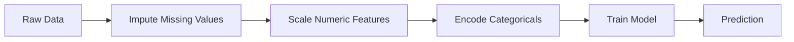
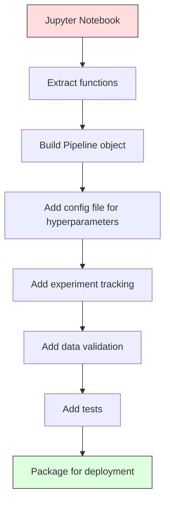

# Rurociągi ML

> Model nie jest produktem. Rurociąg jest. Potok obejmuje wszystko, od surowych danych po wdrożone prognozy, a każdy krok musi być powtarzalny.

**Typ:** Kompilacja
**Język:** Python
**Wymagania wstępne:** Faza 2, Lekcja 12 (Strojenie hiperparametrów)
**Czas:** ~120 minut

## Cele nauczania

- Zbuduj od podstaw potok uczenia maszynowego, który łączy imputację, skalowanie, kodowanie i szkolenie modeli w jeden odtwarzalny obiekt
- Zidentyfikuj scenariusze wycieków danych i wyjaśnij, w jaki sposób rurociągi zapobiegają im, dopasowując transformatory wyłącznie do danych szkoleniowych
- Skonstruuj ColumnTransformer, który stosuje różne przetwarzanie wstępne do cech numerycznych i kategorycznych
- Wdrożyć serializację rurociągów i wykazać, że ten sam zamontowany rurociąg daje identyczne wyniki w szkoleniu i produkcji

## Problem

Masz notatnik, który ładuje dane, uzupełnia brakujące wartości medianą, skaluje funkcje, trenuje model i drukuje dokładność. To działa. Wysyłasz to.

Miesiąc później ktoś ponownie szkoli model i otrzymuje inne wyniki. Medianę obliczono na pełnym zbiorze danych, łącznie z danymi testowymi (wyciek danych). Parametry skalowania nie zostały zapisane, więc wnioskowanie korzysta z innych statystyk. Kod inżynierii funkcji był kopiowany i wklejany pomiędzy szkoleniem a udostępnianiem, a kopie się rozeszły. Kolumna kategoryczna zyskała w produkcji nową wartość, jakiej koder nigdy nie widział.

Nie są to dane hipotetyczne. Są to najczęstsze przyczyny niepowodzeń w produkcji systemów ML. Pipelines rozwiązują wszystkie te problemy, pakując każdy etap transformacji w jeden, uporządkowany, powtarzalny obiekt.

## Koncepcja

### Czym jest rurociąg

Potok to uporządkowana sekwencja transformacji danych, po której następuje model. Każdy krok przyjmuje wynik poprzedniego kroku jako dane wejściowe. Cały potok jest dopasowywany jednorazowo do danych szkoleniowych. W momencie wnioskowania ten sam dopasowany potok przekształca nowe dane i generuje prognozy.



Rurociąg gwarantuje:
- Transformacje są dopasowywane tylko do danych treningowych (bez wycieków)
- Te same transformacje są stosowane w czasie wnioskowania
- Cały obiekt można serializować i wdrażać jako jeden artefakt
- Walidacja krzyżowa dotyczy rurociągu na złożenie, zapobiegając subtelnym wyciekom

### Wyciek danych: cichy zabójca

Wyciek danych ma miejsce, gdy informacje ze zbioru testowego lub przyszłe dane zanieczyszczają proces uczenia się. Rurociągi zapobiegają najczęstszym formom.

**Nieszczelne (błędne):**

```python
X = df.drop("target", axis=1)
y = df["target"]

scaler = StandardScaler()
X_scaled = scaler.fit_transform(X)

X_train, X_test = X_scaled[:800], X_scaled[800:]
y_train, y_test = y[:800], y[800:]
```

Skaler zobaczył dane testowe. Średnia i odchylenie standardowe obejmują próbki testowe. To zawyża szacunki dokładności.

**Poprawnie:**

```python
X_train, X_test = X[:800], X[800:]

scaler = StandardScaler()
X_train_scaled = scaler.fit_transform(X_train)
X_test_scaled = scaler.transform(X_test)
```

W przypadku rurociągu nie musisz o tym myśleć. Potok obsługuje to automatycznie.

### sklearuj Pipeline

sklearn `Pipeline` łączy transformatory i estymator. Udostępnia `.fit()`, `.predict()` i `.score()`, które wykonują wszystkie kroki w podanej kolejności.

```python
from sklearn.pipeline import Pipeline
from sklearn.preprocessing import StandardScaler
from sklearn.linear_model import LogisticRegression

pipe = Pipeline([
    ("scaler", StandardScaler()),
    ("model", LogisticRegression()),
])

pipe.fit(X_train, y_train)
predictions = pipe.predict(X_test)
```

Kiedy wywołujesz `pipe.fit(X_train, y_train)`:
1. Skaler wywołuje `fit_transform` w X_train
2. Wywołania modelu `fit` w skalowanym pociągu X_train

Kiedy wywołujesz `pipe.predict(X_test)`:
1. Wywołania skalera `transform` (nie fit_transform) w X_test
2. Wywołania modelu `predict` w skalowanym X_teście

Skaler nigdy nie widzi danych testowych podczas dopasowania. O to właśnie chodzi.

### ColumnTransformer: różne potoki dla różnych kolumn

Prawdziwe zbiory danych zawierają kolumny liczbowe i kategoryczne, które wymagają innego przetwarzania wstępnego. `ColumnTransformer` sobie z tym radzi.

```python
from sklearn.compose import ColumnTransformer
from sklearn.preprocessing import StandardScaler, OneHotEncoder
from sklearn.impute import SimpleImputer

numeric_pipe = Pipeline([
    ("impute", SimpleImputer(strategy="median")),
    ("scale", StandardScaler()),
])

categorical_pipe = Pipeline([
    ("impute", SimpleImputer(strategy="most_frequent")),
    ("encode", OneHotEncoder(handle_unknown="ignore")),
])

preprocessor = ColumnTransformer([
    ("num", numeric_pipe, ["age", "income", "score"]),
    ("cat", categorical_pipe, ["city", "gender", "plan"]),
])

full_pipeline = Pipeline([
    ("preprocess", preprocessor),
    ("model", GradientBoostingClassifier()),
])
```

`handle_unknown="ignore"` w OneHotEncoder ma kluczowe znaczenie dla produkcji. Kiedy pojawia się nowa kategoria (miasto, którego model nigdy nie widział), zamiast powodować awarię, generuje wektor zerowy.

### Śledzenie eksperymentu

Potok umożliwia powtarzalność szkolenia, ale trzeba także śledzić, co działo się w eksperymentach: jakie hiperparametry zostały użyte, jaka wersja zbioru danych, jakie były metryki i jaki kod był uruchomiony.

**MLflow** to najpopularniejsze rozwiązanie typu open source:

```python
import mlflow

with mlflow.start_run():
    mlflow.log_param("max_depth", 5)
    mlflow.log_param("n_estimators", 100)
    mlflow.log_param("learning_rate", 0.1)

    pipe.fit(X_train, y_train)
    accuracy = pipe.score(X_test, y_test)

    mlflow.log_metric("accuracy", accuracy)
    mlflow.sklearn.log_model(pipe, "model")
```

Każdy przebieg jest rejestrowany z parametrami, metrykami, artefaktami i pełnym modelem. Można porównywać przebiegi, odtwarzać dowolne eksperymenty i wdrażać dowolną wersję modelu.

**Wagi i odchylenia (wandb)** zapewniają tę samą funkcjonalność w przypadku hostowanego pulpitu nawigacyjnego:

```python
import wandb

wandb.init(project="my-pipeline")
wandb.config.update({"max_depth": 5, "n_estimators": 100})

pipe.fit(X_train, y_train)
accuracy = pipe.score(X_test, y_test)

wandb.log({"accuracy": accuracy})
```

### Wersjonowanie modelu

Po prześledzeniu eksperymentu musisz zarządzać wersjami modelu. Który model jest w produkcji? Która to inscenizacja? Który był z zeszłego tygodnia?

Rejestr modeli MLflow zapewnia:
- **Śledzenie wersji:** Każdy zapisany model otrzymuje numer wersji
- **Przejścia między etapami:** „Inscenizacja”, „Produkcja”, „Zarchiwizowane”
- **Przebieg zatwierdzania:** modele muszą zostać wyraźnie awansowane do produkcji
- **Wycofanie:** Natychmiastowe przejście do poprzedniej wersji

### Wersjonowanie danych za pomocą DVC

Kod jest wersjonowany za pomocą gita. Dane również powinny być wersjonowane, ale git nie obsługuje dużych plików. DVC (kontrola wersji danych) rozwiązuje ten problem.

```
dvc init
dvc add data/training.csv
git add data/training.csv.dvc data/.gitignore
git commit -m "Track training data"
dvc push
```

DVC przechowuje rzeczywiste dane w zdalnym magazynie (S3, GCS, Azure) i przechowuje mały plik `.dvc` w git, który rejestruje skrót. Kiedy pobierzesz zatwierdzenie git, `dvc checkout` przywraca dokładnie te dane, które zostały użyte.

Oznacza to, że każde zatwierdzenie git przypina zarówno kod, jak i dane. Pełna powtarzalność.

### Powtarzalne eksperymenty

Powtarzalny eksperyment wymaga czterech rzeczy:

1. **Naprawiono losowe nasiona:** Ustaw nasiona dla numpy, losowych i frameworka (torch, sklearn)
2. **Przypięte zależności:** require.txt lub poezja.lock z dokładnymi wersjami
3. **Dane wersjonowane:** DVC lub podobne
4. **Pliki konfiguracyjne:** Wszystkie hiperparametry w konfiguracji, nie zakodowane na stałe

```python
import numpy as np
import random

def set_seed(seed=42):
    random.seed(seed)
    np.random.seed(seed)
    try:
        import torch
        torch.manual_seed(seed)
        torch.cuda.manual_seed_all(seed)
        torch.backends.cudnn.deterministic = True
    except ImportError:
        pass
```

### Od notebooka do rurociągu produkcyjnego



Typowa progresja:

1. **Eksploracja w notatniku:** Szybkie eksperymenty, wizualizacje, pomysły na funkcje
2. **Wyodrębnij funkcje:** Przenieś przetwarzanie wstępne, inżynierię funkcji i ocenę do modułów
3. **Buduj Pipeline:** Transformacje łańcuchowe w sklearn Pipeline lub klasę niestandardową
4. **Zarządzanie konfiguracją:** Przenieś wszystkie hiperparametry do konfiguracji YAML/JSON
5. **Śledzenie eksperymentu:** Dodaj rejestrowanie MLflow lub wandb
6. **Weryfikacja danych:** Przed szkoleniem sprawdź schemat, rozkłady i wzorce brakujących wartości
7. **Testy:** Testy jednostkowe transformatorów, testy integracyjne całego rurociągu
8. **Wdrożenie:** Serializuj potok, zawijaj w API (FastAPI, Flask), konteneryzuj

### Typowe błędy rurociągu

| Błąd | Dlaczego jest źle | Napraw |
|-------------|------------|-----|
| Dopasowanie do pełnych danych przed podziałem | Wyciek danych | Użyj Pipeline z cross_val_score |
| Inżynieria funkcji poza rurociągiem | Różne transformacje w pociągu i obsłudze | Umieść wszystkie transformacje w potoku |
| Nie obsługuje nieznanych kategorii | Załamanie produkcji na nowych wartościach | OneHotEncoder(handle_unknown="ignore") |
| Zakodowane na stałe nazwy kolumn | Przerywa przy zmianie schematu | Użyj list nazw kolumn z konfiguracji |
| Brak walidacji danych | Po cichu błędne prognozy na podstawie złych danych | Dodaj kontrole schematu przed przewidywaniem |
| Przekrzywienie treningu/serwowania | Model widzi różne funkcje w prod | Jeden obiekt Pipeline dla obu |

## Zbuduj to

Kod w `code/pipeline.py` tworzy od podstaw kompletny potok ML:

### Krok 1: Transformator niestandardowy

```python
class CustomTransformer:
    def __init__(self):
        self.means = None
        self.stds = None

    def fit(self, X):
        self.means = np.mean(X, axis=0)
        self.stds = np.std(X, axis=0)
        self.stds[self.stds == 0] = 1.0
        return self

    def transform(self, X):
        return (X - self.means) / self.stds

    def fit_transform(self, X):
        return self.fit(X).transform(X)
```

### Krok 2: Rurociąg od podstaw

```python
class PipelineFromScratch:
    def __init__(self, steps):
        self.steps = steps

    def fit(self, X, y=None):
        X_current = X.copy()
        for name, step in self.steps[:-1]:
            X_current = step.fit_transform(X_current)
        name, model = self.steps[-1]
        model.fit(X_current, y)
        return self

    def predict(self, X):
        X_current = X.copy()
        for name, step in self.steps[:-1]:
            X_current = step.transform(X_current)
        name, model = self.steps[-1]
        return model.predict(X_current)
```

### Krok 3: Weryfikacja krzyżowa za pomocą potoku

Kod demonstruje, jak weryfikacja krzyżowa za pomocą potoku zapobiega wyciekom danych: skaler jest dopasowywany oddzielnie do danych szkoleniowych każdego złożenia.

### Krok 4: Pełny potok produkcyjny za pomocą sklearn

Kompletny potok z `ColumnTransformer`, wieloma ścieżkami przetwarzania wstępnego i modelem wyszkolonym z odpowiednią walidacją krzyżową i rejestrowaniem eksperymentów.

## Wyślij to

Ta lekcja daje:
- `outputs/prompt-ml-pipeline.md` – umiejętność budowania i debugowania potoków ML
- `code/pipeline.py` — kompletny potok od zera poprzez sklearn

## Ćwiczenia

1. Zbuduj potok obsługujący zbiór danych zawierający 3 kolumny liczbowe i 2 kolumny kategorialne. Użyj `ColumnTransformer`, aby zastosować imputację mediany + skalowanie do liczb i najczęstsze imputację + kodowanie one-hot do kategorii. Trenuj z 5-krotną walidacją krzyżową.

2. Celowo wprowadź wyciek danych: przed podziałem dopasuj skaler do pełnego zbioru danych. Porównaj wynik weryfikacji krzyżowej (nieszczelny) z wynikiem weryfikacji krzyżowej potoku (czysty). Jak duża jest różnica?

3. Serializuj potok za pomocą `joblib.dump`. Załaduj go w osobnym skrypcie i uruchom prognozy. Sprawdź, czy przewidywania są identyczne.

4. Dodaj do potoku niestandardowy transformator, który tworzy cechy wielomianowe (stopień 2) dla dwóch najważniejszych kolumn liczbowych. Gdzie powinien trafić w rurociągu?

5. Skonfiguruj śledzenie MLflow dla potoku. Przeprowadź 5 eksperymentów z różnymi hiperparametrami. Użyj interfejsu użytkownika MLflow (`mlflow ui`), aby porównać przebiegi i wybrać najlepszy model.

## Kluczowe terminy

| Termin | Co ludzie mówią | Co to właściwie oznacza |
|------|----------------|----------------------|
| Rurociąg | „Łańcuch transformacji + model” | Uporządkowana sekwencja zamontowanych transformatorów i model, zastosowane jako jedna jednostka, aby zapobiec wyciekom |
| Wyciek danych | „Informacje testowe wyciekły do ​​szkolenia” | Wykorzystanie informacji spoza zbioru uczącego do zbudowania modelu, zawyżenie szacunków wydajności |
| Transformator kolumny | „Różne przetwarzanie wstępne na kolumnę” | Stosuje różne potoki do różnych podzbiorów kolumn, łącząc wyniki |
| Śledzenie eksperymentu | „Rejestracja biegów” | Rejestrowanie parametrów, metryk, artefaktów i wersji kodu dla każdego przebiegu szkoleniowego |
| MLprzepływ | „Śledź i wdrażaj modele” | Platforma typu open source do śledzenia eksperymentów, rejestracji modeli i wdrażania |
| DVC | „Git dla danych” | System kontroli wersji dla dużych plików danych, przechowywanie skrótów w git i danych w zdalnym magazynie |
| Rejestr modeli | „Katalog wersji modelu” | System śledzący wersje modeli z etykietami scenicznymi (inscenizacja, produkcja, archiwizacja) |
| Przekrzywienie treningu/serwowania | „W notatniku zadziałało” | Różnice między sposobem przetwarzania danych podczas uczenia a wnioskowaniem, powodujące ciche błędy |
| Powtarzalność | „Ten sam kod, ten sam wynik” | Możliwość uzyskania identycznych wyników z tego samego kodu, danych i konfiguracji |

## Dalsze czytanie

- [dokumentacja scikit-learn Pipeline](https://scikit-learn.org/stable/modules/compose.html) — oficjalne informacje o potoku
– [Dokumentacja MLflow](https://mlflow.org/docs/latest/index.html) – śledzenie eksperymentów i rejestr modeli
– [Dokumentacja DVC](https://dvc.org/doc) – wersjonowanie danych
- [Sculley i in., Hidden Technical Debt in Machine Learning Systems (2015)](https://papers.nips.cc/paper/2015/hash/86df7dcfd896fcaf2674f757a2463eba-Abstract.html) – przełomowy artykuł na temat złożoności systemów uczenia maszynowego
– [Sprawdzone praktyki Google ML: zasady ML](https://developers.google.com/machine-learning/guides/rules-of-ml) – praktyczne porady dotyczące ML w produkcji