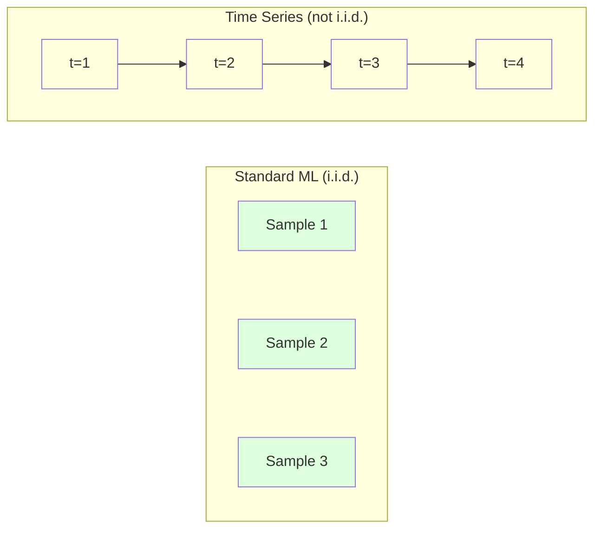
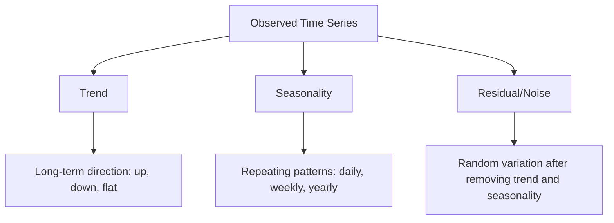
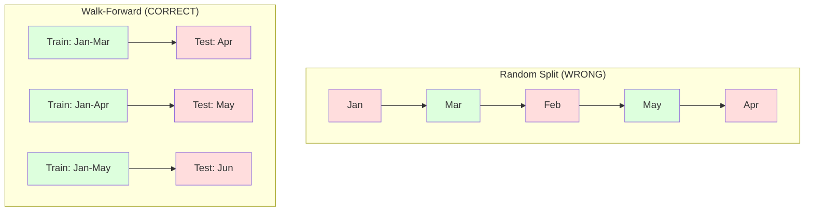

# Podstawy szeregów czasowych

> Dotychczasowe wyniki rzeczywiście przewidują przyszłe wyniki – jeśli najpierw sprawdzisz stacjonarność.

**Typ:** Kompilacja
**Język:** Python
**Wymagania wstępne:** Faza 2, Lekcje 01-09
**Czas:** ~90 minut

## Cele nauczania

- Rozłóż szereg czasowy na komponenty trendu, sezonowości i rezydualne oraz przetestuj stacjonarność
- Zaimplementuj funkcje opóźnień i statystyki kroczące, aby przekształcić szereg czasowy w problem uczenia się pod nadzorem
- Zbuduj strukturę walidacji, która zapobiegnie wyciekaniu przyszłych danych do szkolenia
- Wyjaśnij, dlaczego losowe podziały pociągów/testów są nieprawidłowe w przypadku szeregów czasowych i wykaż różnicę w wydajności w porównaniu z właściwymi podziałami czasowymi

## Problem

Masz dane uporządkowane według czasu. Dzienna sprzedaż, godzinowa temperatura, minutowe użycie procesora, tygodniowe ceny akcji. Chcesz przewidzieć następną wartość, następny tydzień, następny kwartał.

Sięgasz po standardowy zestaw narzędzi ML: losowy podział pociągu/testu, weryfikacja krzyżowa, wejście do macierzy cech, wykluczenie przewidywania. Każdy krok jest zły.

Szereg czasowy łamie założenia, na których opiera się standardowe ML. Próbki nie są niezależne - dzisiejsza temperatura zależy od wczorajszej. Losowe dzieli wyciek przyszłych informacji na przeszłość. Funkcje, które świetnie wyglądają w testach historycznych, nie sprawdzają się w środowisku produkcyjnym, ponieważ opierają się na wzorcach zmieniających się w czasie.

Model, który uzyskuje 95% dokładności przy losowej weryfikacji krzyżowej, może uzyskać 55% przy odpowiedniej ocenie opartej na czasie. Różnica nie jest kwestią techniczną. To jest różnica pomiędzy modelem, który działa na papierze, a tym, który sprawdza się w produkcji.

W tej lekcji omówione zostaną podstawy: co wyróżnia dane dotyczące czasu, jak uczciwie oceniać modele i jak przekształcać szeregi czasowe w funkcje, z których mogą korzystać standardowe modele uczenia maszynowego.

## Koncepcja

### Co wyróżnia szeregi czasowe

Standard ML zakłada i.i.d. - niezależne i równomiernie rozłożone. Każda próbka jest losowana z tego samego rozkładu, niezależnie od innych próbek. Szeregi czasowe naruszają oba:

- **Nie jest niezależny.** Dzisiejszy kurs akcji zależy od wczorajszego kursu. Sprzedaż w tym tygodniu jest zgodna z sprzedażą z poprzedniego tygodnia.
- **Rozkład nie jest identyczny.** Rozkład zmienia się w czasie. Sprzedaż w grudniu wygląda inaczej niż sprzedaż w marcu.

Naruszenia te nie są drobne. Zmieniają sposób budowania funkcji, oceniania modeli i działania algorytmów.



W standardowym ML próbki są wymienne. Ich przemieszanie nic nie zmienia. W szeregach czasowych porządek jest wszystkim. Tasowanie niszczy sygnał.

### Składniki szeregu czasowego

Każdy szereg czasowy jest kombinacją:



- **Trend**: Kierunek długoterminowy. Przychody rosną o 10% rocznie. Globalna temperatura rośnie.
- **Sezonowość**: Powtarzające się wzorce w ustalonych odstępach czasu. Gwałtowny wzrost sprzedaży detalicznej w grudniu. Szczyt wykorzystania klimatyzacji przypada na lipiec.
- **Resztkowe**: Wszystko, co pozostaje po usunięciu trendu i sezonowości. Jeśli reszta wygląda jak biały szum, oznacza to, że rozkład wychwycił sygnał.

### Stacjonarność

Szereg czasowy jest stacjonarny, jeśli jego właściwości statystyczne (średnia, wariancja, autokorelacja) nie zmieniają się w czasie. Większość metod prognozowania zakłada stacjonarność.

**Dlaczego to ma znaczenie:** Szereg niestacjonarny ma średnią, która dryfuje. Model wyszkolony na danych ze stycznia nauczył się innej średniej niż ta, którą pokaże luty. Będzie to systematycznie błędne.

**Jak sprawdzić:** Oblicz średnią kroczącą i kroczące odchylenie standardowe dla okien. Jeśli dryfują, szereg jest niestacjonarny.

**Jak naprawić:** Różnice. Zamiast modelować wartości surowe, modeluj zmianę pomiędzy kolejnymi wartościami:

```
diff[t] = value[t] - value[t-1]
```

Jeśli jedna runda różnicowania nie spowoduje, że szereg stanie się stacjonarny, zastosuj go ponownie (różnicowanie drugiego rzędu). Większość seriali w świecie rzeczywistym wymaga co najwyżej dwóch rund.

**Przykład:**

Oryginalna seria: [100, 102, 106, 112, 120]
Pierwsza różnica: [2, 4, 6, 8] (wciąż rośnie)
Druga różnica: [2, 2, 2] (stała - stacjonarna)

Oryginalna seria miała trend kwadratowy. Pierwsze różnicowanie przekształciło to w trend liniowy. Drugie różnicowanie sprawiło, że było płasko. W praktyce rzadko potrzeba więcej niż dwóch rund.

**Test formalny:** Test Augmented Dickey-Fuller (ADF) to standardowy test statystyczny stacjonarności. Hipoteza zerowa brzmi: „szereg jest niestacjonarny”. Wartość p poniżej 0,05 oznacza, że ​​można odrzucić wartość zerową i stwierdzić stacjonarność. Nie wdrażamy ADF od zera (wymaga to asymptotycznych tablic rozkładu), ale podejście do statystyki kroczącej w naszym kodzie daje praktyczną kontrolę wizualną.

### Autokorelacja

Autokorelacja mierzy, jak bardzo wartość w chwili t koreluje z wartością w chwili t-k (k kroków w przeszłości). Funkcja autokorelacji (ACF) wykreśla tę korelację dla każdego opóźnienia k.

**ACF mówi Ci:**
- Jak daleko sięga seria. Jeśli ACF spadnie do zera po 5 opóźnieniach, wartości sprzed ponad 5 kroków są nieistotne.
- Czy istnieje sezonowość. Jeśli ACF osiąga szczyt z opóźnieniem 12 (dane miesięczne), występuje roczna sezonowość.
- Ile funkcji opóźnienia utworzyć. Używaj opóźnień do momentu, gdy ACF stanie się nieistotny.

**PACF (funkcja częściowej autokorelacji)** usuwa korelacje pośrednie. Jeśli dzień dzisiejszy koreluje z dniem 3 dni temu tylko dlatego, że oba korelują z dniem wczorajszym, PACF przy opóźnieniu 3 będzie wynosić zero, podczas gdy ACF przy opóźnieniu 3 nie będzie.

### Funkcje opóźnień: przekształcanie szeregów czasowych w uczenie się pod nadzorem

Standardowe modele ML wymagają macierzy cech X i docelowego y. Szeregi czasowe dają pojedynczą kolumnę wartości. Most ma cechy opóźnienia.

Weź szereg [10, 12, 14, 13, 15] i utwórz funkcje opóźnienia 1 i opóźnienia 2:

| opóźnienie_2 | opóźnienie_1 | cel |
|-------|-------|--------|
| 10 | 12 | 14 |
| 12 | 14 | 13 |
| 14 | 13 | 15 |

Teraz masz standardowy problem regresji. Każdy model ML (regresja liniowa, las losowy, wzmacnianie gradientu) może przewidzieć cel na podstawie opóźnień.

Dodatkowe funkcje, które możesz zaprojektować:
- **Statystyki kroczące:** średnia, std, min, max z ostatnich k wartości
- **Funkcje kalendarza:** dzień tygodnia, miesiąc, is_wakacje, is_weekend
- **Różne wartości:** zmiana w stosunku do poprzedniego kroku
- **Statystyki rozwijające się:** średnia skumulowana, suma skumulowana
- **Cechy współczynnika:** aktualna wartość / średnia krocząca (jak daleko od ostatniej średniej)
- **Funkcje interakcji:** lag_1 * dzień_tygodnia (wpływ dnia tygodnia na dynamikę)

**Ile opóźnień?** Użyj funkcji autokorelacji. Jeśli ACF jest znaczący do opóźnienia 10, użyj co najmniej 10 opóźnień. Jeśli występuje cotygodniowa sezonowość, uwzględnij opóźnienie 7 (i ewentualnie 14). Większe opóźnienia zapewniają modelowi dłuższą historię, ale także więcej funkcji do dopasowania, co zwiększa ryzyko nadmiernego dopasowania.

**Pułapka wyrównania celu.** Podczas tworzenia obiektów opóźnionych cel musi mieć wartość w czasie t, a wszystkie obiekty muszą używać wartości w czasie t-1 lub wcześniejszym. Jeśli przypadkowo uwzględnisz wartość w chwili t jako cechę, otrzymasz doskonały predyktor i całkowicie bezużyteczny model. Jest to najczęstszy błąd w inżynierii funkcji szeregów czasowych.

### Walidacja przejścia do przodu

Jest to najważniejsza koncepcja tej lekcji. Standardowa k-krotna walidacja krzyżowa losowo przydziela próbki do trenowania i testowania. W przypadku szeregów czasowych powoduje to wyciek przyszłych informacji.



Walidacja przejścia do przodu:
1. Trenuj na danych do czasu t
2. Przewiduj w czasie t+1 (lub t+1 do t+k w przypadku operacji wieloetapowych)
3. Przesuń szybę do przodu
4. Powtórz

Każde zagięcie testu zawiera tylko dane, które pojawiają się po wszystkich danych szkoleniowych. Brak przyszłych wycieków. Daje to uczciwe oszacowanie wydajności modelu po wdrożeniu.

**Rozwijające się okno** wykorzystuje wszystkie dane historyczne do uczenia (okno rośnie). **Okno przesuwne** wykorzystuje okno szkoleniowe o stałym rozmiarze (slajdy okienne). Użyj rozwijania, jeśli uważasz, że starsze dane są nadal istotne. Używaj przesuwania, gdy świat się zmienia, a stare dane bolą.

### Intuicja ARIMA

ARIMA to klasyczny model szeregów czasowych. Zawiera trzy elementy:

- **AR (Autoregresja):** Prognozuj na podstawie przeszłych wartości. AR(p) wykorzystuje ostatnie wartości p.
- **I (zintegrowany):** Różnicowanie w celu osiągnięcia stacjonarności. I(d) stosuje d rundy różnicowania.
- **MA (średnia ruchoma):** Prognozuj na podstawie błędów wcześniejszych prognoz. MA(q) wykorzystuje ostatnie błędy q.

ARIMA(p, d, q) łączy wszystkie trzy. Wybierasz p, d, q na podstawie analizy ACF/PACF lub wyszukiwania automatycznego (auto-ARIMA).

Nie będziemy wdrażać ARIMA od zera – wymaga to optymalizacji numerycznej, która wykracza poza zakres tej lekcji. Kluczową kwestią jest zrozumienie działania każdego komponentu, dzięki czemu można zinterpretować wyniki ARIMA i wiedzieć, kiedy z nich skorzystać.

### Kiedy czego używać

| Podejście | Najlepsze dla | Obsługuje sezonowość | Obsługuje funkcje zewnętrzne |
|---------|---------|--------------------------------|----------------------|
| Funkcje opóźnienia + ML | Tabelaryczne z wieloma funkcjami zewnętrznymi | Z funkcjami kalendarza | Tak |
| ARIMA | Pojedynczy szereg jednowymiarowy, krótkoterminowy | Wariant SARIMA | Nie (ARIMAX dla ograniczonych) |
| Wygładzanie wykładnicze | Prosty trend + sezonowość | Tak (Holt-Winters) | Nie |
| Prorok | Prognozowanie biznesowe, wakacje | Tak (warunki Fouriera) | ograniczona |
| Sieci neuronowe (LSTM, Transformator) | Długie sekwencje, wiele serii | Dowiedziałem się | Tak |

W przypadku większości praktycznych problemów najlepszym punktem wyjścia są funkcje opóźnienia i wzmocnienie gradientu. W naturalny sposób obsługuje funkcje zewnętrzne, nie wymaga stacjonarności i jest łatwy do debugowania.

### Prognozowanie horyzontów i strategii

Prognozowanie jednoetapowe przewiduje jeden krok do przodu. Prognozowanie wieloetapowe przewiduje wiele kroków. Istnieją trzy strategie:

**Rekurencyjny (iterowany):** Przewiduj jeden krok do przodu, wykorzystaj prognozę jako dane wejściowe dla następnego kroku. Proste, ale błędy się kumulują – każda prognoza wykorzystuje poprzednią prognozę, więc błędy się kumulują.

**Bezpośrednio:** Trenuj oddzielny model dla każdego horyzontu. Model-1 przewiduje t+1, Model-5 przewiduje t+5. Nie ma kumulacji błędów, ale każdy model ma mniej próbek uczących i nie dzielą się informacjami.

**Wiele wyjść:** Trenuj jeden model, który generuje jednocześnie wszystkie horyzonty. Udostępnia informacje w różnych horyzontach, ale wymaga modelu obsługującego wiele wyników (lub niestandardowej funkcji straty).

W przypadku większości problemów praktycznych zacznij od rekurencji dla krótkich horyzontów (1-5 kroków) i bezpośrednio dla dłuższych horyzontów.

### Typowe błędy w szeregach czasowych

| Błąd | Dlaczego tak się dzieje | Jak naprawić |
|--------|---------------|----------|
| Losowy podział pociągu/testu | Nawyk ze standardowego ML | Użyj przejścia do przodu lub podziału czasowego |
| Korzystanie z przyszłych funkcji | Funkcja w chwili t uwzględniona przez pomyłkę | Sprawdź każdą funkcję pod kątem wyrównania czasowego |
| Nadmierne dopasowanie do sezonowości | Model zapamiętuje wzorce kalendarza | Przetrzymaj pełny cykl sezonowy w zestawie testowym |
| Ignorowanie zmian skali | Przychody podwajają się, ale wzorce pozostają | Modeluj zmianę procentową zamiast bezwzględnej |
| Zbyt wiele funkcji opóźnienia | „Więcej historii znaczy lepiej” | Użyj ACF, aby określić odpowiednie opóźnienia |
| Nie różnicując | „Modelka to rozwiąże” | Modele drzew obsługują trendy; modele liniowe wymagają stacjonarności |

## Zbuduj to

Kod w `code/time_series.py` implementuje od podstaw podstawowe elementy składowe.

### Kreator funkcji opóźnień

```python
def make_lag_features(series, n_lags):
    n = len(series)
    X = np.full((n, n_lags), np.nan)
    for lag in range(1, n_lags + 1):
        X[lag:, lag - 1] = series[:-lag]
    valid = ~np.isnan(X).any(axis=1)
    return X[valid], series[valid]
```

Spowoduje to konwersję serii 1D na macierz cech, w której każdy wiersz zawiera ostatnie wartości `n_lags` jako cechy i bieżącą wartość jako wartość docelową.

### Walidacja krzyżowa typu walk-forward

```python
def walk_forward_split(n_samples, n_splits=5, min_train=50):
    assert min_train < n_samples, "min_train must be less than n_samples"
    step = max(1, (n_samples - min_train) // n_splits)
    for i in range(n_splits):
        train_end = min_train + i * step
        test_end = min(train_end + step, n_samples)
        if train_end >= n_samples:
            break
        yield slice(0, train_end), slice(train_end, test_end)
```

Każdy podział zapewnia, że dane treningowe pojawiają się dokładnie przed danymi testowymi. Okno szkoleniowe rozszerza się przy każdym złożeniu.

### Prosty model autoregresyjny

Czysty model AR to po prostu regresja liniowa cech opóźnień:

```python
class SimpleAR:
    def __init__(self, n_lags=5):
        self.n_lags = n_lags
        self.weights = None
        self.bias = None

    def fit(self, series):
        X, y = make_lag_features(series, self.n_lags)
        # Solve via normal equations
        X_b = np.column_stack([np.ones(len(X)), X])
        theta = np.linalg.lstsq(X_b, y, rcond=None)[0]
        self.bias = theta[0]
        self.weights = theta[1:]
        return self
```

Pod względem koncepcyjnym jest to identyczne z regresją liniową z lekcji 02, ale stosowane do opóźnionych w czasie wersji tej samej zmiennej.

### Kontrola stacjonarności

Kod oblicza statystyki kroczące, aby wizualnie i numerycznie ocenić stacjonarność:

```python
def check_stationarity(series, window=50):
    rolling_mean = np.array([
        series[max(0, i - window):i].mean()
        for i in range(1, len(series) + 1)
    ])
    rolling_std = np.array([
        series[max(0, i - window):i].std()
        for i in range(1, len(series) + 1)
    ])
    return rolling_mean, rolling_std
```

Jeżeli średnia krocząca dryfuje lub zmienia się standard kroczący, szereg jest niestacjonarny. Zastosuj różnicę i sprawdź ponownie.

Kod sprawdza również stacjonarność, porównując pierwszą i drugą połowę serii. Jeżeli średnie różnią się o więcej niż połowę odchylenia standardowego lub współczynnik wariancji przekracza 2x, szereg jest oznaczany jako niestacjonarny.

### Autokorelacja

```python
def autocorrelation(series, max_lag=20):
    n = len(series)
    mean = series.mean()
    var = series.var()
    acf = np.zeros(max_lag + 1)
    for k in range(max_lag + 1):
        cov = np.mean((series[:n-k] - mean) * (series[k:] - mean))
        acf[k] = cov / var if var > 0 else 0
    return acf
```

## Użyj tego

Dzięki sklearn możesz używać funkcji opóźnienia bezpośrednio z dowolnym regresorem:

```python
from sklearn.linear_model import Ridge
from sklearn.ensemble import GradientBoostingRegressor

X, y = make_lag_features(series, n_lags=10)

for train_idx, test_idx in walk_forward_split(len(X)):
    model = Ridge(alpha=1.0)
    model.fit(X[train_idx], y[train_idx])
    predictions = model.predict(X[test_idx])
```

W przypadku ARIMA użyj statsmodels:

```python
from statsmodels.tsa.arima.model import ARIMA

model = ARIMA(train_series, order=(5, 1, 2))
fitted = model.fit()
forecast = fitted.forecast(steps=30)
```

Kod w `time_series.py` demonstruje oba podejścia i porównuje je za pomocą walidacji przejścia do przodu.

### sklearn TimeSeriesSplit

sklearn udostępnia `TimeSeriesSplit`, który implementuje weryfikację przejścia:

```python
from sklearn.model_selection import TimeSeriesSplit

tscv = TimeSeriesSplit(n_splits=5)
for train_index, test_index in tscv.split(X):
    X_train, X_test = X[train_index], X[test_index]
    y_train, y_test = y[train_index], y[test_index]
    model.fit(X_train, y_train)
    score = model.score(X_test, y_test)
```

Jest to odpowiednik naszego stworzonego od podstaw `walk_forward_split`, ale zintegrowanego ze strukturą walidacji krzyżowej sklearn. Możesz go używać z `cross_val_score`:

```python
from sklearn.model_selection import cross_val_score

scores = cross_val_score(model, X, y, cv=TimeSeriesSplit(n_splits=5))
print(f"Mean score: {scores.mean():.4f} +/- {scores.std():.4f}")
```

### Metryki oceny

Prognozowanie szeregów czasowych wykorzystuje metryki regresji, ale z kontekstem uwzględniającym czas:

- **MAE (Średni błąd bezwzględny):** Średnia z |y_true - y_pred|. Łatwe do interpretacji w oryginalnych jednostkach. „Średnio prognozy różnią się o 3,2 stopnia”.
- **RMSE (średni błąd kwadratowy):** Pierwiastek kwadratowy błędu średniokwadratowego. Karze większe błędy niż MAE. Używaj, gdy duże błędy są gorsze niż wiele małych błędów.
- **MAPE (Średni bezwzględny błąd procentowy):** Średnia |błędu / wartości_prawdziwej| * 100. Niezależne od skali, przydatne do porównywania różnych serii. Ale nieokreślony, gdy prawdziwe wartości wynoszą zero.
- **Naiwne porównanie wartości bazowych:** Zawsze porównuj z prostymi wartościami bazowymi. Sezonowa naiwna linia bazowa przewiduje wartość sprzed jednego okresu (wczoraj, ostatni tydzień). Jeśli Twój model nie jest w stanie pokonać naiwności, coś jest nie tak.

### Funkcje toczenia

Kod demonstruje dodanie statystyk kroczących (średnia, std, min, max w oknach 7 i 14 dni) do funkcji opóźnień. Dostarczają one modelowi informacji o najnowszych trendach i zmienności, których same cechy opóźnienia nie są w stanie uchwycić.

Na przykład, jeśli średnia krocząca rośnie, sugeruje to tendencję wzrostową. Jeśli standard kroczący rośnie, sugeruje to rosnącą zmienność. Są to rodzaje wzorców, z których modele oparte na drzewach mogą się uczyć, ale modele liniowe nie.

## Wyślij to

Ta lekcja daje:
- `outputs/prompt-time-series-advisor.md` – monit o sformułowanie problemów z szeregami czasowymi
- `code/time_series.py` – funkcje opóźnień, weryfikacja przejścia do przodu, model AR, kontrola stacjonarności

### Wartości bazowe, które musisz pokonać

Przed zbudowaniem dowolnego modelu ustal wartości bazowe:

1. **Ostatnia wartość (trwałość).** Przewiduj, że jutro będzie takie samo jak dzisiaj. W przypadku wielu seriali jest to zaskakująco trudne do pokonania.
2. **Naiwność sezonowa.** Przewiduj, że dzisiejszy dzień będzie taki sam jak ten sam dzień w zeszłym tygodniu (lub zeszłym roku). Jeśli Twój model nie może tego pokonać, oznacza to, że nie nauczył się żadnego przydatnego wzorca poza sezonowością.
3. **Średnia krocząca.** Wytypuj średnią z ostatnich k wartości. Wygładza szum, ale nie może uchwycić nagłych zmian.

Jeśli Twój fantazyjny model ML przegrywa z sezonową naiwną linią bazową, masz błąd. Najczęściej: przyszłe wycieki funkcji, zła metoda oceny lub seria jest naprawdę przypadkowa i nieprzewidywalna.

### Praktyczne wskazówki

1. **Zacznij od wykreślenia.** Przed jakimkolwiek modelowaniem narysuj surową serię. Szukaj trendów, sezonowości, wartości odstających, załamań strukturalnych (nagłych zmian w zachowaniu). 30-sekundowa inspekcja wizualna często mówi więcej niż godzinę automatycznej analizy.

2. **Najpierw różnica, potem model.** Jeśli seria ma wyraźny trend, różnicuj ją przed utworzeniem cech opóźnienia. Modele oparte na drzewach radzą sobie z trendami, ale modele liniowe nie, a różnicowanie nigdy nie zaszkodzi.

3. **Wytrzymaj co najmniej jeden pełny cykl sezonowy.** Jeśli masz cotygodniową sezonowość, Twój zestaw testowy potrzebuje co najmniej jednego pełnego tygodnia. Jeśli co miesiąc, co najmniej jeden pełny miesiąc. W przeciwnym razie nie można ocenić, czy model uchwycił wzór sezonowy.

4. **Monitor w produkcji.** Modele szeregów czasowych ulegają degradacji wraz z upływem czasu wraz ze zmianami na świecie. Śledź błędy przewidywań na bieżąco. Gdy błędy zaczną się zwiększać, należy ponownie nauczyć model na podstawie najnowszych danych.

5. **Uważaj na zmiany reżimu.** Model wytrenowany na danych przed pandemią nie będzie w stanie przewidzieć zachowania po pandemii. Dołącz wskaźniki znanych zmian reżimu jako funkcje lub użyj przesuwanego okna, które zapomina stare dane.

6. **Seria skośna z transformacją logarytmiczną.** Przychody, ceny i liczby są często odchylone w prawo. Branie logu stabilizuje wariancję i sprawia, że ​​wzorce multiplikatywne są addytywne, z czym mogą sobie poradzić modele liniowe. Prognozuj w przestrzeni dziennika, a następnie wykładnij, aby wrócić do oryginalnych jednostek.

## Ćwiczenia

1. **Eksperyment stacjonarności.** Wygeneruj szereg z trendem liniowym. Sprawdź stacjonarność za pomocą statystyk kroczących. Zastosuj pierwsze różnicowanie. Sprawdź ponownie. Ile rund różnicowania potrzeba, aby uzyskać trend kwadratowy?

2. **Wybór opóźnienia.** Oblicz ACF na szeregu sezonowym (okres=7). Które opóźnienia mają najwyższą autokorelację? Twórz funkcje opóźnień, używając tylko tych opóźnień (nie kolejnych opóźnień). Czy dokładność poprawia się w porównaniu z opóźnieniami od 1 do 7?

3. **Przejście do przodu a podział losowy.** Trenuj regresję Ridge na cechach opóźnień. Oceniaj za pomocą losowego podziału 80/20 i walidacji typu walk-forward. O ile losowy podział zawyża wydajność?

4. **Inżynieria funkcji.** Dodaj średnią kroczącą (okno=7), kroczącą wartość standardową (okno=7) i funkcje dnia tygodnia do funkcji opóźnienia. Porównaj dokładność z tymi dodatkami i bez nich, korzystając z walidacji przejścia do przodu.

5. **Prognozowanie wieloetapowe.** Zmodyfikuj model AR, aby przewidywał 5 kroków do przodu zamiast 1. Porównaj dwie strategie: (a) przewiduj jeden krok, wykorzystaj przewidywanie jako dane wejściowe dla następnego kroku (rekurencyjne) oraz (b) trenuj oddzielne modele dla każdego horyzontu (bezpośrednie). Co jest dokładniejsze?

## Kluczowe terminy

| Termin | Co ludzie mówią | Co to właściwie oznacza |
|------|----------------|----------------------|
| Stacjonarność | „Statystyki nie zmieniają się w czasie” | Szereg, którego średnia, wariancja i struktura autokorelacji są stałe w czasie |
| Różnicowanie | „Odejmij kolejne wartości” | Obliczanie y[t] - y[t-1] w celu usunięcia trendów i osiągnięcia stacjonarności |
| Autokorelacja (ACF) | „Jak seria koreluje ze sobą” | Korelacja między szeregiem czasowym a jego opóźnioną kopią, jako funkcja opóźnienia |
| Częściowa autokorelacja (PACF) | „Tylko bezpośrednia korelacja” | Autokorelacja przy opóźnieniu k po usunięciu efektu wszystkich krótszych opóźnień |
| Funkcje opóźnienia | „Wcześniejsze wartości jako dane wejściowe” | Używanie y[t-1], y[t-2], ..., y[t-k] jako cech do przewidywania y[t] |
| Walidacja dalszej realizacji | „Weryfikacja krzyżowa z poszanowaniem czasu” | Ocena, w której dane szkoleniowe zawsze poprzedzają dane testowe chronologicznie |
| ARIMA | „Klasyczny model szeregów czasowych” | Zintegrowana średnia ruchoma autoregresyjna: łączy wartości przeszłe (AR), różnicę (I) i błędy przeszłe (MA) |
| Sezonowość | „Powtarzające się wzorce kalendarza” | Regularne, przewidywalne cykle w szeregach czasowych powiązanych z okresami kalendarzowymi (dzienne, tygodniowe, roczne) |
| Trend | „Kierunek długoterminowy” | Trwały wzrost lub spadek poziomu serii w czasie |
| Rozwijające się okno | „Użyj całej historii” | Walidacja przejścia do przodu, w której zbiór treningowy rośnie z każdym złożeniem |
| Przesuwane okno | „Historia o stałym rozmiarze” | Walidacja przejścia do przodu, gdzie zestaw szkoleniowy jest oknem o stałej długości, które przesuwa się do przodu |

## Dalsze czytanie

- [Hyndman i Athanasopoulos, Forecasting: Principles and Practice (3rd ed.)](https://otexts.com/fpp3/) – najlepszy darmowy podręcznik na temat prognozowania szeregów czasowych
- [scikit-learn podział szeregów czasowych](https://scikit-learn.org/stable/modules/generated/sklearn.model_selection.TimeSeriesSplit.html) -- rozdzielacz przechodzenia do przodu sklearn
- [dokumentacja statsmodels ARIMA](https://www.statsmodels.org/stable/generated/statsmodels.tsa.arima.model.ARIMA.html) -- Implementacja ARIMA z diagnostyką
- [Makridakis i in., The M5 Competition (2022)](https://www.sciencedirect.com/science/article/pii/S0169207021001874) -- wielkoskalowy konkurs prognostyczny pokazujący metody ML w porównaniu z metodami statystycznymi