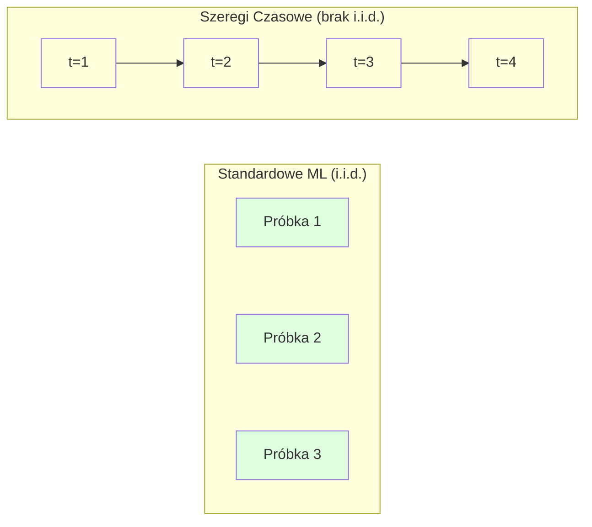
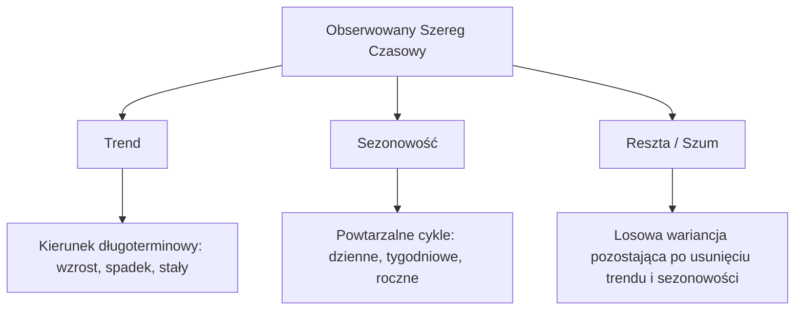
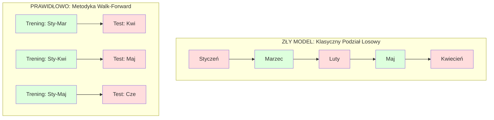

# Podstawy Analizy Szeregów Czasowych

> Historyczne wyniki potrafią przewidzieć przyszłość – o ile najpierw zweryfikujesz stacjonarność.

**Typ:** Kompilacja
**Język:** Python
**Wymagania wstępne:** Faza 2, Lekcje 01-09
**Czas:** ~90 minut

## Cele edukacyjne

- Rozkład szeregu czasowego na komponenty: trend, sezonowość i szum resztowy oraz testowanie stacjonarności.
- Implementacja cech opóźnionych (lag features) i statystyk kroczących, by przekształcić problem szeregów czasowych w standardowe zadanie uczenia nadzorowanego.
- Budowa odpowiedniej struktury walidacji, która zapobiega wyciekowi danych z przyszłości do zbioru uczącego (tzw. data leakage).
- Zrozumienie, dlaczego losowy podział na zbiór treningowy i testowy (train/test split) jest całkowicie błędny w przypadku szeregów czasowych.

## Problem biznesowy

Dysponujesz danymi uporządkowanymi w czasie. Może to być dzienna sprzedaż, godzinowa temperatura, minutowe użycie procesora czy tygodniowe kursy akcji. Chcesz przewidzieć kolejną wartość na następny krok, tydzień lub kwartał.

Odruchowo sięgasz po standardowy zestaw narzędzi ML: losowy podział trening/test, walidacja krzyżowa, spłaszczenie do macierzy cech. Każdy z tych kroków jest fundamentalnie błędny.

Szeregi czasowe łamią podstawowe założenia uczenia maszynowego. Próbki nie są niezależne – dzisiejsza temperatura zależy od wczorajszej. Losowy podział zbioru powoduje wyciek informacji z przyszłości do przeszłości. Cechy, które wyglądają świetnie w testach historycznych, zawodzą na produkcji, ponieważ opierają się na wzorcach, które z czasem ulegają zmianie.

Model, który w losowej walidacji krzyżowej osiąga 95% skuteczności, może po zastosowaniu poprawnej metodologii chronologicznej uzyskać zaledwie 55%. Nie jest to kwestia techniczna – to różnica między modelem świetnie wyglądającym na papierze a systemem, który realnie działa na produkcji.

W tej lekcji omówione zostaną podstawy: czym wyróżniają się dane temporalne, jak rzetelnie oceniać modele predykcyjne oraz w jaki sposób transformować szeregi czasowe w reprezentację cech odpowiednią dla tradycyjnych modeli ML.

## Koncepcja teoretyczna

### Co wyróżnia analizę szeregów czasowych

Standardowe metody uczenia maszynowego opierają się na założeniu i.i.d. (niezależne i o identycznym rozkładzie). Każda próbka jest losowana z tej samej populacji, niezależnie od innych. Szeregi czasowe łamią oba te postulaty:

- **Brak niezależności.** Dzisiejszy kurs akcji nierozerwalnie zależy od wczorajszego. Skalowana sprzedaż w tym tygodniu bazuje na dynamice tygodnia minionego.
- **Niestabilność rozkładu.** Charakterystyka rozkładu ewoluuje w czasie. Struktura sprzedaży w grudniu wygląda drastycznie inaczej niż w marcu.



W klasycznym ML próbki są wymienialne – tasowanie wierszy niczego nie zmienia. W szeregach czasowych sekwencyjny porządek jest nośnikiem informacji, a tasowanie bezpowrotnie niszczy ten sygnał.

### Komponenty szeregu czasowego

Każdy szereg czasowy to w rzeczywistości kompozycja trzech sił:



- **Trend**: Fundamentalny, długoterminowy wektor. 
- **Sezonowość**: Znane, powtarzalne i cykliczne wzorce w stałych odstępach kalendarzowych.
- **Szum rezydualny (Residue)**: Wariancja niezrozumiana po odjęciu trendu i sezonowości. 

### Stacjonarność

Szereg czasowy uznajemy za stacjonarny, jeśli jego fundamentalne właściwości statystyczne (średnia, wariancja, autokorelacja) nie fluktuują w czasie. Większość metod prognozowania zakłada i wymaga stacjonarności.

**Dlaczego jest to kluczowe:** Szereg niestacjonarny ma "wędrującą" średnią. Model wytrenowany w oparciu o stary rozkład nauczy się innej specyfiki, więc jego prognozy będą systematycznie obciążone błędem.

**Jak weryfikować:** Analizuj średnią kroczącą i kroczące odchylenie standardowe w oknach czasowych. Zauważalny dryft świadczy o braku stacjonarności.

**Jak to naprawić:** Zróżniczkowanie (Differencing). Zamiast modelować surowe liczby bezwzględne, prognozuj wartość zmiany (delta) pomiędzy sekwencyjnymi pomiarami:

```
diff[t] = value[t] - value[t-1]
```

Jeśli jedna runda różniczkowania nie gwarantuje stacjonarności, zastosuj ją ponownie (różniczkowanie drugiego rzędu). 

### Autokorelacja

Autokorelacja mierzy, jak mocno bieżący punkt danych koreluje z pomiarem w czasie $t-k$ (oddalonym o $k$ kroków w przeszłości). Funkcja ACF wykreśla tę relację dla rosnących przesunięć.

**Czego uczy ACF:**
- Jak daleko w przeszłość sięga pamięć szeregu. 
- Czy występuje sezonowość. 
- Jaką liczbę cech opóźnionych należy wygenerować dla modeli uczenia maszynowego.

### Cechy opóźnione (Lag Features)

Zaawansowane modele ML wymagają zdefiniowanej macierzy cech X i wektora etykiet y. Przekształcenie surowej sekwencji czasowej polega na utworzeniu odpowiednich cech z przesunięciem (Lags).

Sygnał [10, 12, 14, 13, 15] poddany procesowi wyodrębniania opóźnień do kroku 2 staje się przejrzystą tabelą cech:

| lag_2 (t-2) | lag_1 (t-1) | cel (y=t) |
|-------------|-------------|-----------|
| 10          | 12          | 14        |
| 12          | 14          | 13        |
| 14          | 13          | 15        |

Oto kluczowe wzbogacenia inżynieryjne, jakie można tu wdrożyć:
- **Statystyki kroczące:** średnia, min, max w ustalonym oknie z przeszłości.
- **Cechy kalendarzowe:** godzina, dzień tygodnia, weekend.
- **Różnice wartości:** bezpośrednia zmiana procentowa lub bezwzględna.

### Chronologiczna Walidacja (Walk-Forward Validation)

Konwencjonalna walidacja krzyżowa (CV) powoduje wymieszanie przyszłości z przeszłością, co w szeregach czasowych skutkuje krytycznym wyciekiem danych (data leakage).



### Typowe Błędy

| Błąd | Powód | Jak naprawić |
|--------|---------------|----------|
| Klasyczny losowy podział | Nawyk z typowych problemów ML | Bezwzględnie stosuj chronologiczny podział walk-forward |
| Wykorzystanie danych z przyszłości | Nieuwaga w konstrukcji cech opóźnionych | Zweryfikuj, czy wartości cechy dla predykcji na moment t na pewno są znane w czasie t-1 |
| Nadmierne dopasowanie do sezonowości | Model zapamiętuje dany okres na pamięć | Używaj pełnych cyklów czasowych do walidacji |
| Zbyt dużo cech opóźnionych | Założenie "więcej znaczy lepiej" | Polegaj wyłącznie na ACF, by ograniczyć szum |

## Zbuduj to

Kod w `code/time_series.py` implementuje wszystkie elementy od zera. Zachęcamy do zapoznania się ze wskazanymi funkcjami: generowaniem opóźnień (make_lag_features), walidacją w przód (walk_forward_split) i testami autokorelacji.

## Wyślij to

Po tej lekcji dysponujesz nową wiedzą:
- `outputs/prompt-time-series-advisor.md` – prompt instruujący asystenta o typowych pułapkach analizy szeregów.
- `code/time_series.py` – narzędzia Python implementujące walidację i kontrolę cech.
