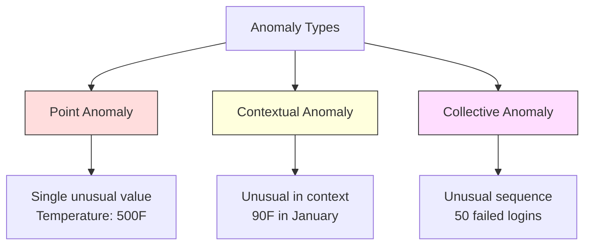
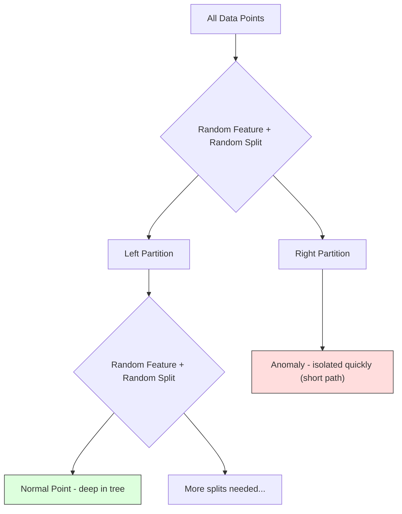
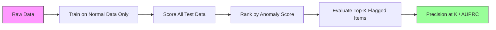

# Wykrywanie anomalii

> Normalność jest łatwa do zdefiniowania. Nienormalne jest wszystko, co nie pasuje.

**Typ:** Kompilacja
**Język:** Python
**Wymagania wstępne:** Faza 2, Lekcje 01-09
**Czas:** ~75 minut

## Cele nauczania

- Wdrażaj od podstaw metody wykrywania anomalii Z-score, IQR i Isolation Forest
- Rozróżnij anomalie punktowe, kontekstowe i zbiorcze i wybierz dla każdej z nich odpowiednią metodę wykrywania
- Wyjaśnij, dlaczego wykrywanie anomalii jest postrzegane jako modelowanie normalnych danych, a nie klasyfikacja anomalii
- Porównaj wykrywanie anomalii bez nadzoru z klasyfikacją pod nadzorem i oceń kompromis pomiędzy pokryciem nowych anomalii a precyzją

## Problem

Karta kredytowa jest używana w Nowym Jorku o godzinie 14:00, a następnie w Tokio o 14:05. Fabryczny czujnik odczytuje 150 stopni, gdy normalny zakres wynosi 80-120. Serwer wysyła 50 000 żądań na sekundę, gdy średnia dzienna wynosi 200.

To są anomalie. Znalezienie ich ma znaczenie. Oszustwa kosztują miliardy. Awarie sprzętu kosztują przestoje. Dane o kosztach włamań do sieci.

Wyzwanie: rzadko opisujesz przykłady anomalii. Oszustwa stanowią 0,1% transakcji. Awarie sprzętu zdarzają się kilka razy w roku. Nie można wytrenować standardowego klasyfikatora, ponieważ w klasie „anomalii” nie ma prawie niczego, z czego można by się uczyć. Nawet jeśli masz jakieś etykiety, anomalie, które zaobserwowałeś, nie są jedynymi typami, z którymi się spotkasz. Schemat oszustwa jutra będzie inny niż dzisiejszy.

Wykrywanie anomalii odwraca problem. Zamiast uczyć się tego, co jest nienormalne, naucz się tego, co normalne. Wszystko, co odbiega od normy, jest podejrzane. Działa to bez etykiet, dostosowuje się do nowych typów anomalii i skaluje się do ogromnych zbiorów danych.

## Koncepcja

### Rodzaje anomalii

Nie wszystkie anomalie są takie same:

- **Anomalie punktowe.** Pojedynczy punkt danych, który jest nietypowy niezależnie od kontekstu. Odczyt temperatury 500 stopni. Transakcja na kwotę $50,000 from an account that normally spends $50.
- **Anomalie kontekstowe.** Punkt danych, który jest nietypowy, biorąc pod uwagę jego kontekst. Latem temperatura 90 stopni jest normalna, zimą jest nienormalna. Ta sama wartość, inny kontekst.
- **Anomalie zbiorowe.** Sekwencja punktów danych, która jest nietypowa jako grupa, mimo że każdy pojedynczy punkt może być normalny. Pięć nieudanych prób logowania jest zjawiskiem normalnym. Pięćdziesiąt z rzędu to atak brutalnej siły.

Większość metod wykrywa anomalie punktowe. Anomalie kontekstowe wymagają cech czasu lub lokalizacji. Anomalie zbiorowe wymagają metod uwzględniających sekwencję.



### Wrabianie bez nadzoru

W standardowej klasyfikacji masz etykiety dla obu klas. Podczas wykrywania anomalii zazwyczaj występuje jedna z trzech sytuacji:

1. **Całkowicie bez nadzoru.** Brak etykiet. Dopasowujesz detektor do wszystkich danych i masz nadzieję, że anomalie są na tyle rzadkie, że nie uszkodzą „normalnego” modelu.
2. **Częściowo nadzorowany.** Masz czysty zbiór danych składający się wyłącznie z normalnych danych. Pasujesz do tego czystego seta i zdobywasz punkty we wszystkim innym. Jest to najsilniejsza konfiguracja, jeśli to możliwe.
3. **Słabo nadzorowany.** Masz kilka oznaczonych anomalii. Używaj ich do oceny, a nie szkolenia. Trenuj bez nadzoru, a następnie zmierz precyzję/przypomnienie w oznaczonym podzbiorze.

Kluczowy wniosek: wykrywanie anomalii zasadniczo różni się od klasyfikacji. Modelujesz rozkład normalnych danych, a nie granicę decyzyjną między dwiema klasami.

### Nadzorowany a nienadzorowany: kompromis

Jeśli masz oznaczone anomalie, czy powinieneś je wykorzystać do szkolenia (klasyfikacja nadzorowana), czy tylko do oceny (wykrywanie bez nadzoru)?

**Nadzorowany (traktuj jako klasyfikacja):**
- Wychwytuje dokładnie te typy anomalii, które widziałeś wcześniej
- Większa precyzja znanych typów anomalii
- Całkowicie pomija nowe typy anomalii
- Wymaga ponownego szkolenia, gdy pojawią się nowe typy anomalii
- Wymaga wystarczającej liczby przykładów anomalii (często za mało)

**Bez nadzoru (model normalny, odchylenia od flag):**
- Wyłapuje wszelkie odchylenia od normy, w tym nowe typy
- Nie wymaga oznakowanych anomalii
- Wyższy odsetek fałszywych trafień (nie wszystko niezwykłe jest złe)
- Większa odporność na zmianę dystrybucji

W praktyce najlepsze systemy łączą w sobie zarówno wykrywanie bez nadzoru w przypadku szerokiego zasięgu, nadzorowane modele znanych typów anomalii o wysokim priorytecie, jak i weryfikację manualną w przypadku niejednoznacznych przypadków.

### Metoda Z-Score

Najprostsze podejście. Oblicz średnią i odchylenie standardowe każdej cechy. Oznacz dowolny punkt większy niż k odchyleń standardowych od średniej.

```text
z_score = (x - mean) / std
anomaly if |z_score| > threshold
```

Domyślny próg wynosi 3,0 (99,7% normalnych danych mieści się w 3 odchyleniach standardowych dla rozkładu Gaussa).

**Mocne strony:** Proste. Szybko. Interpretowalne („ta wartość wynosi 4,5 odchylenia standardowego od normy”).

**Słabe strony:** Zakłada się, że dane mają rozkład normalny. Wrażliwe na wartości odstające w danych szkoleniowych (wartości odstające przesuwają średnią i zawyżają standard, przez co stają się trudniejsze do wykrycia). Nie działa w przypadku dystrybucji multimodalnych.

**Kiedy działa dobrze:** Monitorowanie pojedynczych funkcji, w przypadku którego dane mają z grubsza kształt dzwonu. Czasy reakcji serwera, tolerancje produkcyjne, odczyty czujników przy stabilnych wartościach bazowych.

**W przypadku niepowodzenia:** Dane z wielu klastrów (dwie lokalizacje biur o różnych temperaturach bazowych), dane wypaczone (kwoty transakcji, w przypadku których 1000 USD jest rzadkie, ale nie nietypowe), dane z wartościami odstającymi w zestawie szkoleniowym.

### Metoda IQR

Bardziej wytrzymały niż Z-score. Używa rozstępu międzykwartylowego zamiast średniej i odchylenia standardowego.

```
Q1 = 25th percentile
Q3 = 75th percentile
IQR = Q3 - Q1
lower_bound = Q1 - factor * IQR
upper_bound = Q3 + factor * IQR
anomaly if x < lower_bound or x > upper_bound
```

Domyślny współczynnik to 1,5.

**Mocne strony:** Odporne na wartości odstające (wartości ekstremalne nie mają wpływu na percentyle). Działa na dystrybucjach skośnych. Żadnego założenia o normalności.

**Wady:** Tylko jednowymiarowe (dotyczy niezależnie każdej funkcji). Nie można wykryć anomalii, które są niezwykłe tylko wtedy, gdy cechy są rozpatrywane łącznie (punkt może być normalny w każdej cesze z osobna, ale anomalny w przestrzeni wspólnej).

**Uwaga praktyczna:** Współczynnik 1,5 w IQR odpowiada wąsom na wykresie pudełkowym. Punkty poza wąsami są potencjalnymi wartościami odstającymi. Użycie wartości 3,0 zamiast 1,5 sprawia, że ​​detektor jest bardziej konserwatywny (mniej flag, mniej fałszywych alarmów). Właściwy współczynnik zależy od Twojej tolerancji na fałszywe alarmy.

### Las izolacji

Kluczowy spostrzeżenie: anomalie są nieliczne i zróżnicowane. W przypadku losowego podziału danych anomalie są łatwiejsze do wyizolowania — potrzeba mniej losowych podziałów, aby oddzielić je od reszty.



**Jak to działa:**
1. Zbuduj wiele losowych drzew (las izolacyjny)
2. W każdym węźle wybierz losową cechę i losową wartość podziału pomiędzy wartością minimalną i maksymalną cechy
3. Kontynuuj dzielenie, aż każdy punkt zostanie wyodrębniony (w swoim własnym liściu)
4. Anomalie mają krótszą średnią długość ścieżki we wszystkich drzewach

**Dlaczego to działa:** Normalne punkty znajdują się w gęstych regionach. Aby odizolować jeden od sąsiadów, potrzeba wielu losowych podziałów. Anomalie żyją w rzadkich regionach. Aby je wyizolować, wystarczy jeden lub dwa losowe podziały.

Wynik anomalii opiera się na średniej długości ścieżki we wszystkich drzewach, znormalizowanej przez oczekiwaną długość ścieżki losowego drzewa wyszukiwania binarnego:

```
score(x) = 2^(-average_path_length(x) / c(n))
```

Gdzie `c(n)` to oczekiwana długość ścieżki dla n próbek. Wynik w pobliżu 1 oznacza anomalię. Wynik w pobliżu 0,5 oznacza normalność. Wynik bliski 0 oznacza bardzo normalny (głęboko w gęstych skupiskach).

**Mocne strony:** Brak założeń dotyczących dystrybucji. Działa w dużych wymiarach. Dobrze się skaluje (podliniowa wielkość próbki, ponieważ każde drzewo wykorzystuje podpróbkę). Obsługuje mieszane typy obiektów.

**Słaby:** Walczy z anomaliami w gęstych obszarach (efekt maskowania). Losowe dzielenie jest mniej skuteczne, gdy wiele funkcji jest nieistotnych.

**Kluczowe hiperparametry:**
- `n_estimators`: Liczba drzew. Zwykle wystarczy 100. Więcej drzew daje bardziej stabilne wyniki, ale wolniejsze obliczenia.
- `max_samples`: Liczba próbek na drzewo. Wartość domyślna na papierze oryginalnym to 256. Mniejsze wartości powodują, że poszczególne drzewa są mniej dokładne, ale zwiększają różnorodność. Dzięki podpróbkowaniu Isolation Forest jest szybki — każde drzewo widzi niewielką część danych.
- `contamination`: Oczekiwana część anomalii. Służy wyłącznie do ustawiania progu. Nie ma to wpływu na same wyniki.

### Lokalny współczynnik odstający (LOF)

LOF porównuje gęstość lokalną wokół punktu z gęstością wokół sąsiadów. Punkt w rzadkim regionie otoczony gęstymi obszarami jest anomalny.

**Jak to działa:**
1. Znajdź dla każdego punktu k najbliższych sąsiadów
2. Oblicz gęstość lokalnej osiągalności (jak gęste jest sąsiedztwo)
3. Porównaj gęstość każdego punktu z gęstością sąsiadujących punktów
4. Jeśli punkt ma znacznie mniejszą gęstość niż jego sąsiedzi, jest to punkt odstający

**Wynik LOF:**
- LOF bliski 1.0 oznacza gęstość podobną do sąsiadów (normalną)
- LOF większy niż 1,0 oznacza mniejszą gęstość niż sąsiedzi (potencjalnie anomalna)
- LOF znacznie większy niż 1,0 (np. 2,0+) oznacza znacznie niższą gęstość (prawdopodobną anomalię)

Część „lokalna” jest kluczowa. Rozważmy zbiór danych składający się z dwóch klastrów: gęstego skupienia składającego się z 1000 punktów i rzadkiego skupienia składającego się z 50 punktów. Punkt na krawędzi rzadkiej gromady nie jest niczym niezwykłym w skali globalnej – ma 50 sąsiadów. Jednak lokalnie jest to niezwykłe, jeśli jego najbliżsi sąsiedzi są gęstsi niż w rzeczywistości. LOF wychwytuje ten niuans, którego brakuje metodom globalnym.

**Mocne strony:** Wykrywa lokalne anomalie (punkty, które są nietypowe w swoim sąsiedztwie, nawet jeśli nie są nietypowe w skali globalnej). Działa na klastrach o różnej gęstości.

**Słabe strony:** Wolne w przypadku dużych zbiorów danych (O(n^2) w przypadku naiwnej implementacji). Wrażliwy na wybór k. Nie działa dobrze w bardzo dużych wymiarach (przekleństwo wymiarowości wpływa na obliczenia odległości).

### Porównanie

| Metoda | Założenia | Prędkość | Obsługuje wysokie przyciemnienia | Wykrywa lokalne anomalie |
|------------|------------|-------|--------------------------------|----------------------|
| Wynik Z | Rozkład normalny | Bardzo szybko | Tak (na funkcję) | Nie |
| IQR | Brak (na funkcję) | Bardzo szybko | Tak (na funkcję) | Nie |
| Izolacyjny Las | Brak | Szybki | Tak | Częściowo |
| LOF | Odległość ma znaczenie | Powolny | Słabo | Tak |

### Wyzwania związane z oceną

Ocena detektorów anomalii jest trudniejsza niż ocena klasyfikatorów:

- **Ekstremalna nierównowaga klas.** Przy 0,1% anomalii przewidywanie „normalności” we wszystkim daje 99,9% dokładności. Dokładność jest bezużyteczna.
- **AUROC wprowadza w błąd.** Przy dużym braku równowagi, AUROC może wyglądać dobrze nawet wtedy, gdy model pomija większość anomalii na praktycznych progach.
- **Lepsze wskaźniki:** Precyzja@k (z k najwyżej oznaczonych elementów, ile to rzeczywiste anomalie), AUPRC (obszar pod krzywą precyzji przypominania) i stały współczynnik fałszywych alarmów.



### Rurociąg wykrywania anomalii

W praktyce wykrywanie anomalii przebiega według następującego schematu:

1. **Zbierz dane wyjściowe.** Najlepiej jest to okres, w którym wiadomo, że nie ma żadnych (lub jest ich bardzo niewiele) anomalii.
2. **Inżynieria funkcji.** Surowe funkcje plus funkcje pochodne (statystyki kroczące, cechy czasowe, współczynniki).
3. **Wytrenuj detektor.** Dopasuj dane bazowe. Modelka uczy się, jak wygląda „normalność”.
4. **Oceniaj nowe dane.** Każda nowa obserwacja otrzymuje ocenę anomalii.
5. **Wybór progu.** Wybierz punkt odcięcia. Jest to decyzja biznesowa: wyższy próg oznacza mniej fałszywych alarmów, ale więcej przeoczonych anomalii.
6. **Zaalarmuj i zbadaj sprawę.** Oznaczone punkty trafiają do weryfikacji ręcznej lub odpowiedzi automatycznej.
7. **Zbieranie informacji zwrotnych.** Zapisz, czy oznaczone elementy były prawdziwymi anomaliami, czy fałszywymi alarmami. Użyj tych danych do oceny detektora i dostrojenia progu w czasie.

Rurociąg nigdy nie jest „ukończony”. Zmieniają się rozkłady danych, pojawiają się nowe typy anomalii, a progi wymagają dostosowania. Traktuj wykrywanie anomalii jak żywy system, a nie jednorazowy model.

## Zbuduj to

Kod w `code/anomaly_detection.py` implementuje od podstaw Z-score, IQR i Isolation Forest.

### Detektor Z-Score

```python
def zscore_detect(X, threshold=3.0):
    mean = X.mean(axis=0)
    std = X.std(axis=0)
    std[std == 0] = 1.0
    z = np.abs((X - mean) / std)
    return z.max(axis=1) > threshold
```

Proste i wektoryzowane. Oznacza punkt, jeśli jakikolwiek obiekt przekracza próg.

### Detektor IQR

```python
def iqr_detect(X, factor=1.5):
    q1 = np.percentile(X, 25, axis=0)
    q3 = np.percentile(X, 75, axis=0)
    iqr = q3 - q1
    iqr[iqr == 0] = 1.0
    lower = q1 - factor * iqr
    upper = q3 + factor * iqr
    outside = (X < lower) | (X > upper)
    return outside.any(axis=1)
```

### Izolacja lasu od podstaw

Implementacja od podstaw buduje drzewa izolacji, które losowo dzielą przestrzeń funkcji:

```python
class IsolationTree:
    def __init__(self, max_depth):
        self.max_depth = max_depth

    def fit(self, X, depth=0):
        n, p = X.shape
        if depth >= self.max_depth or n <= 1:
            self.is_leaf = True
            self.size = n
            return self
        self.is_leaf = False
        self.feature = np.random.randint(p)
        x_min = X[:, self.feature].min()
        x_max = X[:, self.feature].max()
        if x_min == x_max:
            self.is_leaf = True
            self.size = n
            return self
        self.threshold = np.random.uniform(x_min, x_max)
        left_mask = X[:, self.feature] < self.threshold
        self.left = IsolationTree(self.max_depth).fit(X[left_mask], depth + 1)
        self.right = IsolationTree(self.max_depth).fit(X[~left_mask], depth + 1)
        return self
```

Długość ścieżki izolowania punktu określa jego wynik anomalii. Krótsze ścieżki oznaczają więcej anomalii.

Klasa `IsolationForest` otacza wiele drzew:

```python
class IsolationForest:
    def __init__(self, n_estimators=100, max_samples=256, seed=42):
        self.n_estimators = n_estimators
        self.max_samples = max_samples

    def fit(self, X):
        sample_size = min(self.max_samples, X.shape[0])
        max_depth = int(np.ceil(np.log2(sample_size)))
        for _ in range(self.n_estimators):
            idx = rng.choice(X.shape[0], size=sample_size, replace=False)
            tree = IsolationTree(max_depth=max_depth)
            tree.fit(X[idx])
            self.trees.append(tree)

    def anomaly_score(self, X):
        avg_path = average path length across all trees
        scores = 2.0 ** (-avg_path / c(max_samples))
        return scores
```

Współczynnik normalizacji `c(n)` to oczekiwana długość ścieżki nieudanego wyszukiwania w drzewie wyszukiwania binarnego z n elementami. Jest równa `2 * H(n-1) - 2*(n-1)/n`, gdzie `H` to liczba harmoniczna. Ta normalizacja zapewnia porównywalność wyników w zbiorach danych o różnej wielkości.

### Scenariusze demonstracyjne

Kod generuje wiele scenariuszy testowych:

1. **Pojedynczy klaster z wartościami odstającymi.** Dwuwymiarowy klaster Gaussa z anomaliami wstrzykniętymi daleko od środka. Wszystkie metody powinny tu zadziałać.
2. **Dane multimodalne.** Trzy klastry o różnej wielkości i gęstości. Punkty pomiędzy klastrami są anomalne. Wynik Z jest trudny, ponieważ zakresy poszczególnych funkcji są szerokie.
3. **Dane wielowymiarowe.** 50 cech, ale anomalie różnią się tylko w 5 z nich. Testuje, czy metody mogą znaleźć anomalie w podzbiorze funkcji.

Każde demo porównuje wszystkie metody przy użyciu precyzji, przywołania, F1 i Precision@k.

## Użyj tego

Ze sklearn (używając implementacji bibliotek, a nie od zera):

```python
from sklearn.ensemble import IsolationForest
from sklearn.neighbors import LocalOutlierFactor

iso = IsolationForest(n_estimators=100, contamination=0.05, random_state=42)
iso.fit(X_train)
predictions = iso.predict(X_test)

lof = LocalOutlierFactor(n_neighbors=20, contamination=0.05, novelty=True)
lof.fit(X_train)
predictions = lof.predict(X_test)
```

Uwaga `contamination` ustawia oczekiwaną część anomalii. Prawidłowe ustawienie ma znaczenie — zbyt niskie pomija anomalie, zbyt wysokie powoduje fałszywe alarmy.

Kod w `anomaly_detection.py` porównuje implementacje od podstaw z implementacjami sklearn na tych samych danych.

### sklearn Parametr zanieczyszczenia

Parametr `contamination` w sklearn określa próg konwersji ciągłych wyników anomalii na przewidywania binarne. Nie zmienia to bazowych wyników.

```python
iso_5 = IsolationForest(contamination=0.05)
iso_10 = IsolationForest(contamination=0.10)
```

Obydwa dają takie same wyniki anomalii. Ale `iso_5` oznacza górne 5%, podczas gdy `iso_10` oznacza górne 10%. Jeśli nie znasz prawdziwego współczynnika anomalii (zwykle tego nie robisz), ustaw zanieczyszczenie na „automatyczne” i pracuj bezpośrednio z surowymi wynikami. Ustaw własny próg w oparciu o kompromis między kosztami między wynikami fałszywie pozytywnymi i fałszywie negatywnymi.

### SVM jednej klasy

Kolejny nienadzorowany detektor anomalii, który warto poznać. Jednoklasowy SVM dopasowuje granicę wokół normalnych danych w wielowymiarowej przestrzeni cech (przy użyciu sztuczki jądra).

```python
from sklearn.svm import OneClassSVM

oc_svm = OneClassSVM(kernel="rbf", gamma="auto", nu=0.05)
oc_svm.fit(X_train)
predictions = oc_svm.predict(X_test)
```

Parametr `nu` przybliża ułamek anomalii. One-Class SVM działa dobrze na małych i średnich zbiorach danych, ale nie skaluje się do bardzo dużych danych (macierz jądra rośnie kwadratowo).

### Metoda automatycznego kodowania (wersja zapoznawcza)

Autoenkodery to sieci neuronowe, które uczą się kompresować i rekonstruować dane. Trenuj na normalnych danych. W czasie testu anomalie obarczone są wysokim błędem rekonstrukcji, ponieważ sieć nauczyła się rekonstruować tylko normalne wzorce.

Jest to omówione w fazie 3 (głębokie uczenie się), ale zasada jest ta sama: modeluj to, co jest normalne, zaznaczaj to, co odbiega od normy.

### Wykrywanie anomalii zespołu

Tak jak metody zespołowe poprawiają klasyfikację (Lekcja 11), tak połączenie wielu detektorów anomalii poprawia wykrywanie. Najprostsze podejście:

1. Uruchom wiele detektorów (Z-score, IQR, Isolation Forest, LOF)
2. Normalizuj wyniki każdego detektora do [0, 1]
3. Uśrednij znormalizowane wyniki
4. Oznacz punkty powyżej progu średniego wyniku

Zmniejsza to liczbę fałszywych alarmów, ponieważ różne metody mają różne tryby awarii. Punkt oznaczony wszystkimi czterema metodami jest prawie na pewno nietypowy. Punkt oznaczony tylko przez jednego może być dziwactwem tej metody.

Bardziej wyrafinowane zespoły ważą każdy detektor na podstawie jego szacowanej niezawodności (mierzonej na zestawie walidacyjnym ze znanymi anomaliami, jeśli są dostępne).

### Zagadnienia produkcyjne

1. **Przesunięcie progu.** W miarę zmiany dystrybucji danych stały próg staje się nieaktualny. Monitoruj rozkład wyników anomalii i okresowo dostosowuj.
2. **Zmęczenie alarmowaniem.** Zbyt wiele fałszywych alarmów powoduje, że operatorzy przestają zwracać uwagę. Zacznij od wysokiego progu (mniej, bardziej niezawodne alerty) i obniżaj go w miarę budowania zaufania.
3. **Podejście zespołowe.** Podczas produkcji należy łączyć wiele detektorów. Oznacz punkt tylko wtedy, gdy wiele metod zgodzi się, że jest to anomalia. To znacznie zmniejsza liczbę fałszywych alarmów.
4. **Inżynieria funkcji.** Surowe funkcje rzadko wystarczą. Dodaj kroczące statystyki, współczynniki, czas od ostatniego zdarzenia i funkcje specyficzne dla domeny. Dobry zestaw funkcji ma większe znaczenie niż wybór detektora.
5. **Pętla informacji zwrotnej.** Kiedy operatorzy sprawdzają oznaczone elementy i potwierdzają je lub odrzucają, przekaż informacje z powrotem do systemu. Gromadź oznaczone dane w miarę upływu czasu, aby ocenić i ulepszyć detektor.

## Wyślij to

Ta lekcja daje:
- `outputs/skill-anomaly-detector.md` – umiejętność podejmowania decyzji przy wyborze odpowiedniego detektora
- `code/anomaly_detection.py` — Z-score, IQR i Isolation Forest od zera, z porównaniem sklearn

### Wybór progu

Wynik anomalii jest ciągły. Aby podejmować decyzje binarne, potrzebujesz progu. To decyzja biznesowa, a nie techniczna.

Rozważ dwa scenariusze:
- **Wykrywanie oszustw.** Brak oszustw jest kosztowny (obciążenia zwrotne, zaufanie klientów). Zbadanie fałszywych alarmów zajmuje analitykowi 5 minut. Ustaw niski próg, aby wychwycić więcej oszustw i zaakceptować więcej fałszywych alarmów.
- **Konserwacja sprzętu.** Fałszywy alarm oznacza niepotrzebne przestoje, których koszt wynosi $50,000. A missed failure means a $500 000 napraw. Ustaw próg, aby zrównoważyć te koszty.

W obu przypadkach optymalny próg zależy od stosunku kosztów pomiędzy wynikami fałszywie pozytywnymi i fałszywie negatywnymi. Wykreśl precyzję i przypominanie dla różnych progów, nałóż funkcję kosztu i wybierz punkt minimalnego kosztu.

### Skalowanie do produkcji

Do wykrywania anomalii w czasie rzeczywistym w produkcji:

1. **Szkolenie wsadowe, punktacja online.** Trenuj model okresowo (codziennie, co tydzień) na najnowszych normalnych danych. Oceniaj każdą nową obserwację, gdy tylko się pojawi.
2. **Obliczenia cech muszą się zgadzać.** Jeśli trenowałeś ze statystykami kroczącymi przez 30 dni, potrzebujesz 30-dniowej historii, aby obliczyć cechy dla nowej obserwacji. Buforuj wymaganą historię.
3. **Monitorowanie dystrybucji wyników.** Śledź rozkład wyników anomalii w czasie. Jeśli mediana wyniku dryfuje w górę, albo dane się zmieniają, albo model jest nieaktualny.
4. **Wyjaśnialność.** Kiedy zgłaszasz anomalię, powiedz dlaczego. Wynik Z: „Cecha X wynosi 4,2 odchylenia standardowego powyżej normy”. Isolation Forest: „Ten punkt został wyodrębniony średnio w 3,1 podziałach (normalne punkty zajmują 8,5).”

## Ćwiczenia

1. **Strojenie progu.** Uruchom detektor Z-score z progami od 1,0 do 5,0 w krokach co 0,5. Nakreśl precyzję i przypomnienie dla każdego progu. Gdzie jest najlepsze miejsce na Twoje dane?

2. **Anomalie wielowymiarowe.** Twórz dane 2D, w których każda cecha z osobna wygląda normalnie, ale kombinacja jest anomalna (np. punkty oddalone od przekątnej głównej gromady). Pokaż, że wynik Z na funkcję pomija te elementy, ale Isolation Forest je wyłapuje.

3. **LOF od zera.** Zaimplementuj lokalny współczynnik odstający przy użyciu k-najbliższych sąsiadów. Porównaj z LocalOutlierFactor sklearna na tych samych danych. Użyj k=10 i k=50 — jak wybór k wpływa na wyniki?

4. **Wykrywanie anomalii w transmisji strumieniowej.** Zmodyfikuj detektor Z-score, aby działał w ustawieniach przesyłania strumieniowego: aktualizuj średnią bieżącą i wariancję w miarę pojawiania się nowych punktów (algorytm online Welforda). Porównaj z wsadowym wynikiem Z dla tych samych danych.

5. **Ocena w świecie rzeczywistym.** Weź zbiór danych ze znanymi anomaliami (na przykład oszustwo związane z kartami kredytowymi od Kaggle). Oceń wszystkie cztery metody, używając precyzji @ 100, precyzji @ 500 i AUPRC. Która metoda działa najlepiej? Dlaczego?

## Kluczowe terminy

| Termin | Co ludzie mówią | Co to właściwie oznacza |
|------|----------------|----------------------|
| Anomalia | „Odstający, niezwykły punkt” | Punkt danych, który znacznie odbiega od oczekiwanego wzorca normalnych danych |
| Anomalia punktowa | „Pojedyncza dziwna wartość” | Indywidualna obserwacja, niezwykła niezależnie od kontekstu |
| Anomalia kontekstowa | „Normalna wartość, zły kontekst” | Obserwacja, która jest niezwykła ze względu na swój kontekst (czas, miejsce itp.), ale może być normalna w innym kontekście |
| Izolacyjny Las | „Losowe podziały w celu znalezienia wartości odstających” | Zespół losowych drzew, który izoluje anomalie z mniejszą liczbą podziałów niż normalne punkty |
| Lokalny czynnik odstający | „Porównaj gęstość z sąsiadami” | Metoda oznaczająca punkty, których gęstość lokalna jest znacznie niższa niż gęstość sąsiadów |
| Wynik Z | „Odchylenia standardowe od średniej” | (x - średnia) / std, pomiar odległości punktu od środka w jednostkach odchylenia standardowego |
| IQR | „Rozstęp międzykwartylowy” | Q3 - Q1, pomiar rozproszenia środkowych 50% danych, stosowany do niezawodnego wykrywania wartości odstających |
| Zanieczyszczenie | „Oczekiwany ułamek anomalii” | Hiperparametr informujący detektor, jaką część danych powinien oznaczyć jako anomalną |
| Precyzja@k | „Z najlepszych k flag, ile jest prawdziwych” | Precyzja obliczona tylko dla k najbardziej podejrzanych punktów, przydatna do wykrywania niezrównoważonych anomalii |
| AUPRC | „Obszar pod krzywą zapamiętania precyzji” | Metryka podsumowująca wydajność precyzyjnego przypominania we wszystkich progach, lepsza niż AUROC dla niezrównoważonych danych

## Dalsze czytanie

- [Liu i in., Isolation Forest (2008)](https://cs.nju.edu.cn/zhouzh/zhouzh.files/publication/icdm08b.pdf) – oryginalny artykuł Isolation Forest
- [Breunig i in., LOF: Identyfikacja lokalnych wartości odstających opartych na gęstości (2000)](https://dl.acm.org/doi/10.1145/342009.335388) – oryginalny artykuł LOF
- [dokumentacja scikit-learn dotycząca wykrywania wartości odstających] (https://scikit-learn.org/stable/modules/outlier_detection.html) -- przegląd wszystkich detektorów anomalii sklearn
- [Chandola i in., Anomaly Detection: A Survey (2009)] (https://dl.acm.org/doi/10.1145/1541880.1541882) – kompleksowy przegląd metod wykrywania anomalii
- [Goldstein i Uchida, A Comparative Evaluation of Unsupervised Anomaly Detection Algorithms (2016)](https://journals.plos.org/plosone/article?id=10.1371/journal.pone.0152173) -- empiryczne porównanie 10 metod na rzeczywistych zbiorach danych